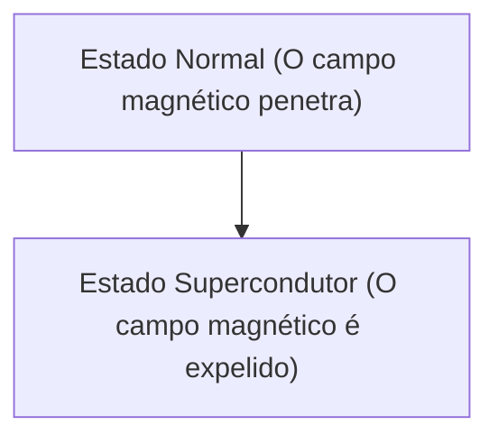

# Física: Como funciona a supercondutividade

A supercondutividade é um fenômeno onde a resistência elétrica se torna zero.

## Efeito Meissner

## Equação de London
$$ \nabla \times \mathbf{J} = -\frac{n_s e^2}{m} \mathbf{B} $$

## Parte de Verificação Técnica Adicional 1

Nesta seção, nos aprofundaremos em mais detalhes técnicos e estudos de caso. Avaliaremos o desempenho sob várias condições e discutiremos os desafios e as soluções para a integração com outros sistemas. Também discutiremos as perspectivas e limitações futuras.

