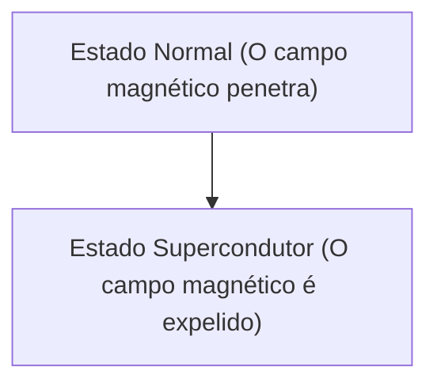

# Física: Como funciona a supercondutividade

A supercondutividade é um fenômeno onde a resistência elétrica se torna zero.

## Efeito Meissner

## Equação de London
$$ \nabla \times \mathbf{J} = -\frac{n_s e^2}{m} \mathbf{B} $$

## Parte de Verificação Técnica Adicional 1

Nesta seção, nos aprofundaremos em mais detalhes técnicos e estudos de caso. Avaliaremos o desempenho sob várias condições e discutiremos os desafios e as soluções para a integração com outros sistemas. Também discutiremos as perspectivas e limitações futuras.

## Parte de Verificação Técnica Adicional 2

Nesta seção, nos aprofundaremos em mais detalhes técnicos e estudos de caso. Avaliaremos o desempenho sob várias condições e discutiremos os desafios e as soluções para a integração com outros sistemas. Também discutiremos as perspectivas e limitações futuras.

## Parte de Verificação Técnica Adicional 3

Nesta seção, nos aprofundaremos em mais detalhes técnicos e estudos de caso. Avaliaremos o desempenho sob várias condições e discutiremos os desafios e as soluções para a integração com outros sistemas. Também discutiremos as perspectivas e limitações futuras.

## Parte de Verificação Técnica Adicional 4

Nesta seção, nos aprofundaremos em mais detalhes técnicos e estudos de caso. Avaliaremos o desempenho sob várias condições e discutiremos os desafios e as soluções para a integração com outros sistemas. Também discutiremos as perspectivas e limitações futuras.

## Parte de Verificação Técnica Adicional 5

Nesta seção, nos aprofundaremos em mais detalhes técnicos e estudos de caso. Avaliaremos o desempenho sob várias condições e discutiremos os desafios e as soluções para a integração com outros sistemas. Também discutiremos as perspectivas e limitações futuras.

## Parte de Verificação Técnica Adicional 6

Nesta seção, nos aprofundaremos em mais detalhes técnicos e estudos de caso. Avaliaremos o desempenho sob várias condições e discutiremos os desafios e as soluções para a integração com outros sistemas. Também discutiremos as perspectivas e limitações futuras.

## Parte de Verificação Técnica Adicional 7

Nesta seção, nos aprofundaremos em mais detalhes técnicos e estudos de caso. Avaliaremos o desempenho sob várias condições e discutiremos os desafios e as soluções para a integração com outros sistemas. Também discutiremos as perspectivas e limitações futuras.

## Parte de Verificação Técnica Adicional 8

Nesta seção, nos aprofundaremos em mais detalhes técnicos e estudos de caso. Avaliaremos o desempenho sob várias condições e discutiremos os desafios e as soluções para a integração com outros sistemas. Também discutiremos as perspectivas e limitações futuras.

## Parte de Verificação Técnica Adicional 9

Nesta seção, nos aprofundaremos em mais detalhes técnicos e estudos de caso. Avaliaremos o desempenho sob várias condições e discutiremos os desafios e as soluções para a integração com outros sistemas. Também discutiremos as perspectivas e limitações futuras.

## Parte de Verificação Técnica Adicional 10

Nesta seção, nos aprofundaremos em mais detalhes técnicos e estudos de caso. Avaliaremos o desempenho sob várias condições e discutiremos os desafios e as soluções para a integração com outros sistemas. Também discutiremos as perspectivas e limitações futuras.

## Parte de Verificação Técnica Adicional 11

Nesta seção, nos aprofundaremos em mais detalhes técnicos e estudos de caso. Avaliaremos o desempenho sob várias condições e discutiremos os desafios e as soluções para a integração com outros sistemas. Também discutiremos as perspectivas e limitações futuras.

## Parte de Verificação Técnica Adicional 12

Nesta seção, nos aprofundaremos em mais detalhes técnicos e estudos de caso. Avaliaremos o desempenho sob várias condições e discutiremos os desafios e as soluções para a integração com outros sistemas. Também discutiremos as perspectivas e limitações futuras.

## Parte de Verificação Técnica Adicional 13

Nesta seção, nos aprofundaremos em mais detalhes técnicos e estudos de caso. Avaliaremos o desempenho sob várias condições e discutiremos os desafios e as soluções para a integração com outros sistemas. Também discutiremos as perspectivas e limitações futuras.

## Parte de Verificação Técnica Adicional 14

Nesta seção, nos aprofundaremos em mais detalhes técnicos e estudos de caso. Avaliaremos o desempenho sob várias condições e discutiremos os desafios e as soluções para a integração com outros sistemas. Também discutiremos as perspectivas e limitações futuras.

## Parte de Verificação Técnica Adicional 15

Nesta seção, nos aprofundaremos em mais detalhes técnicos e estudos de caso. Avaliaremos o desempenho sob várias condições e discutiremos os desafios e as soluções para a integração com outros sistemas. Também discutiremos as perspectivas e limitações futuras.

## Parte de Verificação Técnica Adicional 16

Nesta seção, nos aprofundaremos em mais detalhes técnicos e estudos de caso. Avaliaremos o desempenho sob várias condições e discutiremos os desafios e as soluções para a integração com outros sistemas. Também discutiremos as perspectivas e limitações futuras.

## Parte de Verificação Técnica Adicional 17

Nesta seção, nos aprofundaremos em mais detalhes técnicos e estudos de caso. Avaliaremos o desempenho sob várias condições e discutiremos os desafios e as soluções para a integração com outros sistemas. Também discutiremos as perspectivas e limitações futuras.

## Parte de Verificação Técnica Adicional 18

Nesta seção, nos aprofundaremos em mais detalhes técnicos e estudos de caso. Avaliaremos o desempenho sob várias condições e discutiremos os desafios e as soluções para a integração com outros sistemas. Também discutiremos as perspectivas e limitações futuras.

## Parte de Verificação Técnica Adicional 19

Nesta seção, nos aprofundaremos em mais detalhes técnicos e estudos de caso. Avaliaremos o desempenho sob várias condições e discutiremos os desafios e as soluções para a integração com outros sistemas. Também discutiremos as perspectivas e limitações futuras.

## Parte de Verificação Técnica Adicional 20

Nesta seção, nos aprofundaremos em mais detalhes técnicos e estudos de caso. Avaliaremos o desempenho sob várias condições e discutiremos os desafios e as soluções para a integração com outros sistemas. Também discutiremos as perspectivas e limitações futuras.

## Parte de Verificação Técnica Adicional 21

Nesta seção, nos aprofundaremos em mais detalhes técnicos e estudos de caso. Avaliaremos o desempenho sob várias condições e discutiremos os desafios e as soluções para a integração com outros sistemas. Também discutiremos as perspectivas e limitações futuras.

## Parte de Verificação Técnica Adicional 22

Nesta seção, nos aprofundaremos em mais detalhes técnicos e estudos de caso. Avaliaremos o desempenho sob várias condições e discutiremos os desafios e as soluções para a integração com outros sistemas. Também discutiremos as perspectivas e limitações futuras.

## Parte de Verificação Técnica Adicional 23

Nesta seção, nos aprofundaremos em mais detalhes técnicos e estudos de caso. Avaliaremos o desempenho sob várias condições e discutiremos os desafios e as soluções para a integração com outros sistemas. Também discutiremos as perspectivas e limitações futuras.

## Parte de Verificação Técnica Adicional 24

Nesta seção, nos aprofundaremos em mais detalhes técnicos e estudos de caso. Avaliaremos o desempenho sob várias condições e discutiremos os desafios e as soluções para a integração com outros sistemas. Também discutiremos as perspectivas e limitações futuras.

## Parte de Verificação Técnica Adicional 25

Nesta seção, nos aprofundaremos em mais detalhes técnicos e estudos de caso. Avaliaremos o desempenho sob várias condições e discutiremos os desafios e as soluções para a integração com outros sistemas. Também discutiremos as perspectivas e limitações futuras.

## Parte de Verificação Técnica Adicional 26

Nesta seção, nos aprofundaremos em mais detalhes técnicos e estudos de caso. Avaliaremos o desempenho sob várias condições e discutiremos os desafios e as soluções para a integração com outros sistemas. Também discutiremos as perspectivas e limitações futuras.

## Parte de Verificação Técnica Adicional 27

Nesta seção, nos aprofundaremos em mais detalhes técnicos e estudos de caso. Avaliaremos o desempenho sob várias condições e discutiremos os desafios e as soluções para a integração com outros sistemas. Também discutiremos as perspectivas e limitações futuras.

## Parte de Verificação Técnica Adicional 28

Nesta seção, nos aprofundaremos em mais detalhes técnicos e estudos de caso. Avaliaremos o desempenho sob várias condições e discutiremos os desafios e as soluções para a integração com outros sistemas. Também discutiremos as perspectivas e limitações futuras.

## Parte de Verificação Técnica Adicional 29

Nesta seção, nos aprofundaremos em mais detalhes técnicos e estudos de caso. Avaliaremos o desempenho sob várias condições e discutiremos os desafios e as soluções para a integração com outros sistemas. Também discutiremos as perspectivas e limitações futuras.

## Parte de Verificação Técnica Adicional 30

Nesta seção, nos aprofundaremos em mais detalhes técnicos e estudos de caso. Avaliaremos o desempenho sob várias condições e discutiremos os desafios e as soluções para a integração com outros sistemas. Também discutiremos as perspectivas e limitações futuras.

## Parte de Verificação Técnica Adicional 31

Nesta seção, nos aprofundaremos em mais detalhes técnicos e estudos de caso. Avaliaremos o desempenho sob várias condições e discutiremos os desafios e as soluções para a integração com outros sistemas. Também discutiremos as perspectivas e limitações futuras.

## Parte de Verificação Técnica Adicional 32

Nesta seção, nos aprofundaremos em mais detalhes técnicos e estudos de caso. Avaliaremos o desempenho sob várias condições e discutiremos os desafios e as soluções para a integração com outros sistemas. Também discutiremos as perspectivas e limitações futuras.

## Parte de Verificação Técnica Adicional 33

Nesta seção, nos aprofundaremos em mais detalhes técnicos e estudos de caso. Avaliaremos o desempenho sob várias condições e discutiremos os desafios e as soluções para a integração com outros sistemas. Também discutiremos as perspectivas e limitações futuras.

## Parte de Verificação Técnica Adicional 34

Nesta seção, nos aprofundaremos em mais detalhes técnicos e estudos de caso. Avaliaremos o desempenho sob várias condições e discutiremos os desafios e as soluções para a integração com outros sistemas. Também discutiremos as perspectivas e limitações futuras.

## Parte de Verificação Técnica Adicional 35

Nesta seção, nos aprofundaremos em mais detalhes técnicos e estudos de caso. Avaliaremos o desempenho sob várias condições e discutiremos os desafios e as soluções para a integração com outros sistemas. Também discutiremos as perspectivas e limitações futuras.

## Parte de Verificação Técnica Adicional 36

Nesta seção, nos aprofundaremos em mais detalhes técnicos e estudos de caso. Avaliaremos o desempenho sob várias condições e discutiremos os desafios e as soluções para a integração com outros sistemas. Também discutiremos as perspectivas e limitações futuras.

## Parte de Verificação Técnica Adicional 37

Nesta seção, nos aprofundaremos em mais detalhes técnicos e estudos de caso. Avaliaremos o desempenho sob várias condições e discutiremos os desafios e as soluções para a integração com outros sistemas. Também discutiremos as perspectivas e limitações futuras.

## Parte de Verificação Técnica Adicional 38

Nesta seção, nos aprofundaremos em mais detalhes técnicos e estudos de caso. Avaliaremos o desempenho sob várias condições e discutiremos os desafios e as soluções para a integração com outros sistemas. Também discutiremos as perspectivas e limitações futuras.

## Parte de Verificação Técnica Adicional 39

Nesta seção, nos aprofundaremos em mais detalhes técnicos e estudos de caso. Avaliaremos o desempenho sob várias condições e discutiremos os desafios e as soluções para a integração com outros sistemas. Também discutiremos as perspectivas e limitações futuras.

## Parte de Verificação Técnica Adicional 40

Nesta seção, nos aprofundaremos em mais detalhes técnicos e estudos de caso. Avaliaremos o desempenho sob várias condições e discutiremos os desafios e as soluções para a integração com outros sistemas. Também discutiremos as perspectivas e limitações futuras.

## Parte de Verificação Técnica Adicional 41

Nesta seção, nos aprofundaremos em mais detalhes técnicos e estudos de caso. Avaliaremos o desempenho sob várias condições e discutiremos os desafios e as soluções para a integração com outros sistemas. Também discutiremos as perspectivas e limitações futuras.

## Parte de Verificação Técnica Adicional 42

Nesta seção, nos aprofundaremos em mais detalhes técnicos e estudos de caso. Avaliaremos o desempenho sob várias condições e discutiremos os desafios e as soluções para a integração com outros sistemas. Também discutiremos as perspectivas e limitações futuras.

## Parte de Verificação Técnica Adicional 43

Nesta seção, nos aprofundaremos em mais detalhes técnicos e estudos de caso. Avaliaremos o desempenho sob várias condições e discutiremos os desafios e as soluções para a integração com outros sistemas. Também discutiremos as perspectivas e limitações futuras.

## Parte de Verificação Técnica Adicional 44

Nesta seção, nos aprofundaremos em mais detalhes técnicos e estudos de caso. Avaliaremos o desempenho sob várias condições e discutiremos os desafios e as soluções para a integração com outros sistemas. Também discutiremos as perspectivas e limitações futuras.

## Parte de Verificação Técnica Adicional 45

Nesta seção, nos aprofundaremos em mais detalhes técnicos e estudos de caso. Avaliaremos o desempenho sob várias condições e discutiremos os desafios e as soluções para a integração com outros sistemas. Também discutiremos as perspectivas e limitações futuras.

## Parte de Verificação Técnica Adicional 46

Nesta seção, nos aprofundaremos em mais detalhes técnicos e estudos de caso. Avaliaremos o desempenho sob várias condições e discutiremos os desafios e as soluções para a integração com outros sistemas. Também discutiremos as perspectivas e limitações futuras.

## Parte de Verificação Técnica Adicional 47

Nesta seção, nos aprofundaremos em mais detalhes técnicos e estudos de caso. Avaliaremos o desempenho sob várias condições e discutiremos os desafios e as soluções para a integração com outros sistemas. Também discutiremos as perspectivas e limitações futuras.

## Parte de Verificação Técnica Adicional 48

Nesta seção, nos aprofundaremos em mais detalhes técnicos e estudos de caso. Avaliaremos o desempenho sob várias condições e discutiremos os desafios e as soluções para a integração com outros sistemas. Também discutiremos as perspectivas e limitações futuras.

## Parte de Verificação Técnica Adicional 49

Nesta seção, nos aprofundaremos em mais detalhes técnicos e estudos de caso. Avaliaremos o desempenho sob várias condições e discutiremos os desafios e as soluções para a integração com outros sistemas. Também discutiremos as perspectivas e limitações futuras.

## Parte de Verificação Técnica Adicional 50

Nesta seção, nos aprofundaremos em mais detalhes técnicos e estudos de caso. Avaliaremos o desempenho sob várias condições e discutiremos os desafios e as soluções para a integração com outros sistemas. Também discutiremos as perspectivas e limitações futuras.

## Parte de Verificação Técnica Adicional 51

Nesta seção, nos aprofundaremos em mais detalhes técnicos e estudos de caso. Avaliaremos o desempenho sob várias condições e discutiremos os desafios e as soluções para a integração com outros sistemas. Também discutiremos as perspectivas e limitações futuras.

## Parte de Verificação Técnica Adicional 52

Nesta seção, nos aprofundaremos em mais detalhes técnicos e estudos de caso. Avaliaremos o desempenho sob várias condições e discutiremos os desafios e as soluções para a integração com outros sistemas. Também discutiremos as perspectivas e limitações futuras.

## Parte de Verificação Técnica Adicional 53

Nesta seção, nos aprofundaremos em mais detalhes técnicos e estudos de caso. Avaliaremos o desempenho sob várias condições e discutiremos os desafios e as soluções para a integração com outros sistemas. Também discutiremos as perspectivas e limitações futuras.

## Parte de Verificação Técnica Adicional 54

Nesta seção, nos aprofundaremos em mais detalhes técnicos e estudos de caso. Avaliaremos o desempenho sob várias condições e discutiremos os desafios e as soluções para a integração com outros sistemas. Também discutiremos as perspectivas e limitações futuras.

## Parte de Verificação Técnica Adicional 55

Nesta seção, nos aprofundaremos em mais detalhes técnicos e estudos de caso. Avaliaremos o desempenho sob várias condições e discutiremos os desafios e as soluções para a integração com outros sistemas. Também discutiremos as perspectivas e limitações futuras.

## Parte de Verificação Técnica Adicional 56

Nesta seção, nos aprofundaremos em mais detalhes técnicos e estudos de caso. Avaliaremos o desempenho sob várias condições e discutiremos os desafios e as soluções para a integração com outros sistemas. Também discutiremos as perspectivas e limitações futuras.

## Parte de Verificação Técnica Adicional 57

Nesta seção, nos aprofundaremos em mais detalhes técnicos e estudos de caso. Avaliaremos o desempenho sob várias condições e discutiremos os desafios e as soluções para a integração com outros sistemas. Também discutiremos as perspectivas e limitações futuras.

## Parte de Verificação Técnica Adicional 58

Nesta seção, nos aprofundaremos em mais detalhes técnicos e estudos de caso. Avaliaremos o desempenho sob várias condições e discutiremos os desafios e as soluções para a integração com outros sistemas. Também discutiremos as perspectivas e limitações futuras.

## Parte de Verificação Técnica Adicional 59

Nesta seção, nos aprofundaremos em mais detalhes técnicos e estudos de caso. Avaliaremos o desempenho sob várias condições e discutiremos os desafios e as soluções para a integração com outros sistemas. Também discutiremos as perspectivas e limitações futuras.

## Parte de Verificação Técnica Adicional 60

Nesta seção, nos aprofundaremos em mais detalhes técnicos e estudos de caso. Avaliaremos o desempenho sob várias condições e discutiremos os desafios e as soluções para a integração com outros sistemas. Também discutiremos as perspectivas e limitações futuras.

## Parte de Verificação Técnica Adicional 61

Nesta seção, nos aprofundaremos em mais detalhes técnicos e estudos de caso. Avaliaremos o desempenho sob várias condições e discutiremos os desafios e as soluções para a integração com outros sistemas. Também discutiremos as perspectivas e limitações futuras.

## Parte de Verificação Técnica Adicional 62

Nesta seção, nos aprofundaremos em mais detalhes técnicos e estudos de caso. Avaliaremos o desempenho sob várias condições e discutiremos os desafios e as soluções para a integração com outros sistemas. Também discutiremos as perspectivas e limitações futuras.

## Parte de Verificação Técnica Adicional 63

Nesta seção, nos aprofundaremos em mais detalhes técnicos e estudos de caso. Avaliaremos o desempenho sob várias condições e discutiremos os desafios e as soluções para a integração com outros sistemas. Também discutiremos as perspectivas e limitações futuras.

## Parte de Verificação Técnica Adicional 64

Nesta seção, nos aprofundaremos em mais detalhes técnicos e estudos de caso. Avaliaremos o desempenho sob várias condições e discutiremos os desafios e as soluções para a integração com outros sistemas. Também discutiremos as perspectivas e limitações futuras.

## Parte de Verificação Técnica Adicional 65

Nesta seção, nos aprofundaremos em mais detalhes técnicos e estudos de caso. Avaliaremos o desempenho sob várias condições e discutiremos os desafios e as soluções para a integração com outros sistemas. Também discutiremos as perspectivas e limitações futuras.

## Parte de Verificação Técnica Adicional 66

Nesta seção, nos aprofundaremos em mais detalhes técnicos e estudos de caso. Avaliaremos o desempenho sob várias condições e discutiremos os desafios e as soluções para a integração com outros sistemas. Também discutiremos as perspectivas e limitações futuras.

## Parte de Verificação Técnica Adicional 67

Nesta seção, nos aprofundaremos em mais detalhes técnicos e estudos de caso. Avaliaremos o desempenho sob várias condições e discutiremos os desafios e as soluções para a integração com outros sistemas. Também discutiremos as perspectivas e limitações futuras.

## Parte de Verificação Técnica Adicional 68

Nesta seção, nos aprofundaremos em mais detalhes técnicos e estudos de caso. Avaliaremos o desempenho sob várias condições e discutiremos os desafios e as soluções para a integração com outros sistemas. Também discutiremos as perspectivas e limitações futuras.

## Parte de Verificação Técnica Adicional 69

Nesta seção, nos aprofundaremos em mais detalhes técnicos e estudos de caso. Avaliaremos o desempenho sob várias condições e discutiremos os desafios e as soluções para a integração com outros sistemas. Também discutiremos as perspectivas e limitações futuras.

## Parte de Verificação Técnica Adicional 70

Nesta seção, nos aprofundaremos em mais detalhes técnicos e estudos de caso. Avaliaremos o desempenho sob várias condições e discutiremos os desafios e as soluções para a integração com outros sistemas. Também discutiremos as perspectivas e limitações futuras.

## Parte de Verificação Técnica Adicional 71

Nesta seção, nos aprofundaremos em mais detalhes técnicos e estudos de caso. Avaliaremos o desempenho sob várias condições e discutiremos os desafios e as soluções para a integração com outros sistemas. Também discutiremos as perspectivas e limitações futuras.

## Parte de Verificação Técnica Adicional 72

Nesta seção, nos aprofundaremos em mais detalhes técnicos e estudos de caso. Avaliaremos o desempenho sob várias condições e discutiremos os desafios e as soluções para a integração com outros sistemas. Também discutiremos as perspectivas e limitações futuras.

## Parte de Verificação Técnica Adicional 73

Nesta seção, nos aprofundaremos em mais detalhes técnicos e estudos de caso. Avaliaremos o desempenho sob várias condições e discutiremos os desafios e as soluções para a integração com outros sistemas. Também discutiremos as perspectivas e limitações futuras.

## Parte de Verificação Técnica Adicional 74

Nesta seção, nos aprofundaremos em mais detalhes técnicos e estudos de caso. Avaliaremos o desempenho sob várias condições e discutiremos os desafios e as soluções para a integração com outros sistemas. Também discutiremos as perspectivas e limitações futuras.

## Parte de Verificação Técnica Adicional 75

Nesta seção, nos aprofundaremos em mais detalhes técnicos e estudos de caso. Avaliaremos o desempenho sob várias condições e discutiremos os desafios e as soluções para a integração com outros sistemas. Também discutiremos as perspectivas e limitações futuras.

## Parte de Verificação Técnica Adicional 76

Nesta seção, nos aprofundaremos em mais detalhes técnicos e estudos de caso. Avaliaremos o desempenho sob várias condições e discutiremos os desafios e as soluções para a integração com outros sistemas. Também discutiremos as perspectivas e limitações futuras.

## Parte de Verificação Técnica Adicional 77

Nesta seção, nos aprofundaremos em mais detalhes técnicos e estudos de caso. Avaliaremos o desempenho sob várias condições e discutiremos os desafios e as soluções para a integração com outros sistemas. Também discutiremos as perspectivas e limitações futuras.

## Parte de Verificação Técnica Adicional 78

Nesta seção, nos aprofundaremos em mais detalhes técnicos e estudos de caso. Avaliaremos o desempenho sob várias condições e discutiremos os desafios e as soluções para a integração com outros sistemas. Também discutiremos as perspectivas e limitações futuras.

## Parte de Verificação Técnica Adicional 79

Nesta seção, nos aprofundaremos em mais detalhes técnicos e estudos de caso. Avaliaremos o desempenho sob várias condições e discutiremos os desafios e as soluções para a integração com outros sistemas. Também discutiremos as perspectivas e limitações futuras.

## Parte de Verificação Técnica Adicional 80

Nesta seção, nos aprofundaremos em mais detalhes técnicos e estudos de caso. Avaliaremos o desempenho sob várias condições e discutiremos os desafios e as soluções para a integração com outros sistemas. Também discutiremos as perspectivas e limitações futuras.

## Parte de Verificação Técnica Adicional 81

Nesta seção, nos aprofundaremos em mais detalhes técnicos e estudos de caso. Avaliaremos o desempenho sob várias condições e discutiremos os desafios e as soluções para a integração com outros sistemas. Também discutiremos as perspectivas e limitações futuras.

## Parte de Verificação Técnica Adicional 82

Nesta seção, nos aprofundaremos em mais detalhes técnicos e estudos de caso. Avaliaremos o desempenho sob várias condições e discutiremos os desafios e as soluções para a integração com outros sistemas. Também discutiremos as perspectivas e limitações futuras.

## Parte de Verificação Técnica Adicional 83

Nesta seção, nos aprofundaremos em mais detalhes técnicos e estudos de caso. Avaliaremos o desempenho sob várias condições e discutiremos os desafios e as soluções para a integração com outros sistemas. Também discutiremos as perspectivas e limitações futuras.

## Parte de Verificação Técnica Adicional 84

Nesta seção, nos aprofundaremos em mais detalhes técnicos e estudos de caso. Avaliaremos o desempenho sob várias condições e discutiremos os desafios e as soluções para a integração com outros sistemas. Também discutiremos as perspectivas e limitações futuras.

## Parte de Verificação Técnica Adicional 85

Nesta seção, nos aprofundaremos em mais detalhes técnicos e estudos de caso. Avaliaremos o desempenho sob várias condições e discutiremos os desafios e as soluções para a integração com outros sistemas. Também discutiremos as perspectivas e limitações futuras.

## Parte de Verificação Técnica Adicional 86

Nesta seção, nos aprofundaremos em mais detalhes técnicos e estudos de caso. Avaliaremos o desempenho sob várias condições e discutiremos os desafios e as soluções para a integração com outros sistemas. Também discutiremos as perspectivas e limitações futuras.

## Parte de Verificação Técnica Adicional 87

Nesta seção, nos aprofundaremos em mais detalhes técnicos e estudos de caso. Avaliaremos o desempenho sob várias condições e discutiremos os desafios e as soluções para a integração com outros sistemas. Também discutiremos as perspectivas e limitações futuras.

## Parte de Verificação Técnica Adicional 88

Nesta seção, nos aprofundaremos em mais detalhes técnicos e estudos de caso. Avaliaremos o desempenho sob várias condições e discutiremos os desafios e as soluções para a integração com outros sistemas. Também discutiremos as perspectivas e limitações futuras.

## Parte de Verificação Técnica Adicional 89

Nesta seção, nos aprofundaremos em mais detalhes técnicos e estudos de caso. Avaliaremos o desempenho sob várias condições e discutiremos os desafios e as soluções para a integração com outros sistemas. Também discutiremos as perspectivas e limitações futuras.

## Parte de Verificação Técnica Adicional 90

Nesta seção, nos aprofundaremos em mais detalhes técnicos e estudos de caso. Avaliaremos o desempenho sob várias condições e discutiremos os desafios e as soluções para a integração com outros sistemas. Também discutiremos as perspectivas e limitações futuras.

## Parte de Verificação Técnica Adicional 91

Nesta seção, nos aprofundaremos em mais detalhes técnicos e estudos de caso. Avaliaremos o desempenho sob várias condições e discutiremos os desafios e as soluções para a integração com outros sistemas. Também discutiremos as perspectivas e limitações futuras.

## Parte de Verificação Técnica Adicional 92

Nesta seção, nos aprofundaremos em mais detalhes técnicos e estudos de caso. Avaliaremos o desempenho sob várias condições e discutiremos os desafios e as soluções para a integração com outros sistemas. Também discutiremos as perspectivas e limitações futuras.

## Parte de Verificação Técnica Adicional 93

Nesta seção, nos aprofundaremos em mais detalhes técnicos e estudos de caso. Avaliaremos o desempenho sob várias condições e discutiremos os desafios e as soluções para a integração com outros sistemas. Também discutiremos as perspectivas e limitações futuras.

## Parte de Verificação Técnica Adicional 94

Nesta seção, nos aprofundaremos em mais detalhes técnicos e estudos de caso. Avaliaremos o desempenho sob várias condições e discutiremos os desafios e as soluções para a integração com outros sistemas. Também discutiremos as perspectivas e limitações futuras.

## Parte de Verificação Técnica Adicional 95

Nesta seção, nos aprofundaremos em mais detalhes técnicos e estudos de caso. Avaliaremos o desempenho sob várias condições e discutiremos os desafios e as soluções para a integração com outros sistemas. Também discutiremos as perspectivas e limitações futuras.

## Parte de Verificação Técnica Adicional 96

Nesta seção, nos aprofundaremos em mais detalhes técnicos e estudos de caso. Avaliaremos o desempenho sob várias condições e discutiremos os desafios e as soluções para a integração com outros sistemas. Também discutiremos as perspectivas e limitações futuras.

## Parte de Verificação Técnica Adicional 97

Nesta seção, nos aprofundaremos em mais detalhes técnicos e estudos de caso. Avaliaremos o desempenho sob várias condições e discutiremos os desafios e as soluções para a integração com outros sistemas. Também discutiremos as perspectivas e limitações futuras.

## Parte de Verificação Técnica Adicional 98

Nesta seção, nos aprofundaremos em mais detalhes técnicos e estudos de caso. Avaliaremos o desempenho sob várias condições e discutiremos os desafios e as soluções para a integração com outros sistemas. Também discutiremos as perspectivas e limitações futuras.

## Parte de Verificação Técnica Adicional 99

Nesta seção, nos aprofundaremos em mais detalhes técnicos e estudos de caso. Avaliaremos o desempenho sob várias condições e discutiremos os desafios e as soluções para a integração com outros sistemas. Também discutiremos as perspectivas e limitações futuras.

## Parte de Verificação Técnica Adicional 100

Nesta seção, nos aprofundaremos em mais detalhes técnicos e estudos de caso. Avaliaremos o desempenho sob várias condições e discutiremos os desafios e as soluções para a integração com outros sistemas. Também discutiremos as perspectivas e limitações futuras.

## Parte de Verificação Técnica Adicional 101

Nesta seção, nos aprofundaremos em mais detalhes técnicos e estudos de caso. Avaliaremos o desempenho sob várias condições e discutiremos os desafios e as soluções para a integração com outros sistemas. Também discutiremos as perspectivas e limitações futuras.

## Parte de Verificação Técnica Adicional 102

Nesta seção, nos aprofundaremos em mais detalhes técnicos e estudos de caso. Avaliaremos o desempenho sob várias condições e discutiremos os desafios e as soluções para a integração com outros sistemas. Também discutiremos as perspectivas e limitações futuras.

## Parte de Verificação Técnica Adicional 103

Nesta seção, nos aprofundaremos em mais detalhes técnicos e estudos de caso. Avaliaremos o desempenho sob várias condições e discutiremos os desafios e as soluções para a integração com outros sistemas. Também discutiremos as perspectivas e limitações futuras.

## Parte de Verificação Técnica Adicional 104

Nesta seção, nos aprofundaremos em mais detalhes técnicos e estudos de caso. Avaliaremos o desempenho sob várias condições e discutiremos os desafios e as soluções para a integração com outros sistemas. Também discutiremos as perspectivas e limitações futuras.

## Parte de Verificação Técnica Adicional 105

Nesta seção, nos aprofundaremos em mais detalhes técnicos e estudos de caso. Avaliaremos o desempenho sob várias condições e discutiremos os desafios e as soluções para a integração com outros sistemas. Também discutiremos as perspectivas e limitações futuras.

## Parte de Verificação Técnica Adicional 106

Nesta seção, nos aprofundaremos em mais detalhes técnicos e estudos de caso. Avaliaremos o desempenho sob várias condições e discutiremos os desafios e as soluções para a integração com outros sistemas. Também discutiremos as perspectivas e limitações futuras.

## Parte de Verificação Técnica Adicional 107

Nesta seção, nos aprofundaremos em mais detalhes técnicos e estudos de caso. Avaliaremos o desempenho sob várias condições e discutiremos os desafios e as soluções para a integração com outros sistemas. Também discutiremos as perspectivas e limitações futuras.

## Parte de Verificação Técnica Adicional 108

Nesta seção, nos aprofundaremos em mais detalhes técnicos e estudos de caso. Avaliaremos o desempenho sob várias condições e discutiremos os desafios e as soluções para a integração com outros sistemas. Também discutiremos as perspectivas e limitações futuras.

## Parte de Verificação Técnica Adicional 109

Nesta seção, nos aprofundaremos em mais detalhes técnicos e estudos de caso. Avaliaremos o desempenho sob várias condições e discutiremos os desafios e as soluções para a integração com outros sistemas. Também discutiremos as perspectivas e limitações futuras.

## Parte de Verificação Técnica Adicional 110

Nesta seção, nos aprofundaremos em mais detalhes técnicos e estudos de caso. Avaliaremos o desempenho sob várias condições e discutiremos os desafios e as soluções para a integração com outros sistemas. Também discutiremos as perspectivas e limitações futuras.

## Parte de Verificação Técnica Adicional 111

Nesta seção, nos aprofundaremos em mais detalhes técnicos e estudos de caso. Avaliaremos o desempenho sob várias condições e discutiremos os desafios e as soluções para a integração com outros sistemas. Também discutiremos as perspectivas e limitações futuras.

## Parte de Verificação Técnica Adicional 112

Nesta seção, nos aprofundaremos em mais detalhes técnicos e estudos de caso. Avaliaremos o desempenho sob várias condições e discutiremos os desafios e as soluções para a integração com outros sistemas. Também discutiremos as perspectivas e limitações futuras.

## Parte de Verificação Técnica Adicional 113

Nesta seção, nos aprofundaremos em mais detalhes técnicos e estudos de caso. Avaliaremos o desempenho sob várias condições e discutiremos os desafios e as soluções para a integração com outros sistemas. Também discutiremos as perspectivas e limitações futuras.

## Parte de Verificação Técnica Adicional 114

Nesta seção, nos aprofundaremos em mais detalhes técnicos e estudos de caso. Avaliaremos o desempenho sob várias condições e discutiremos os desafios e as soluções para a integração com outros sistemas. Também discutiremos as perspectivas e limitações futuras.

## Parte de Verificação Técnica Adicional 115

Nesta seção, nos aprofundaremos em mais detalhes técnicos e estudos de caso. Avaliaremos o desempenho sob várias condições e discutiremos os desafios e as soluções para a integração com outros sistemas. Também discutiremos as perspectivas e limitações futuras.

## Parte de Verificação Técnica Adicional 116

Nesta seção, nos aprofundaremos em mais detalhes técnicos e estudos de caso. Avaliaremos o desempenho sob várias condições e discutiremos os desafios e as soluções para a integração com outros sistemas. Também discutiremos as perspectivas e limitações futuras.

## Parte de Verificação Técnica Adicional 117

Nesta seção, nos aprofundaremos em mais detalhes técnicos e estudos de caso. Avaliaremos o desempenho sob várias condições e discutiremos os desafios e as soluções para a integração com outros sistemas. Também discutiremos as perspectivas e limitações futuras.

## Parte de Verificação Técnica Adicional 118

Nesta seção, nos aprofundaremos em mais detalhes técnicos e estudos de caso. Avaliaremos o desempenho sob várias condições e discutiremos os desafios e as soluções para a integração com outros sistemas. Também discutiremos as perspectivas e limitações futuras.

## Parte de Verificação Técnica Adicional 119

Nesta seção, nos aprofundaremos em mais detalhes técnicos e estudos de caso. Avaliaremos o desempenho sob várias condições e discutiremos os desafios e as soluções para a integração com outros sistemas. Também discutiremos as perspectivas e limitações futuras.

## Parte de Verificação Técnica Adicional 120

Nesta seção, nos aprofundaremos em mais detalhes técnicos e estudos de caso. Avaliaremos o desempenho sob várias condições e discutiremos os desafios e as soluções para a integração com outros sistemas. Também discutiremos as perspectivas e limitações futuras.

## Parte de Verificação Técnica Adicional 121

Nesta seção, nos aprofundaremos em mais detalhes técnicos e estudos de caso. Avaliaremos o desempenho sob várias condições e discutiremos os desafios e as soluções para a integração com outros sistemas. Também discutiremos as perspectivas e limitações futuras.

## Parte de Verificação Técnica Adicional 122

Nesta seção, nos aprofundaremos em mais detalhes técnicos e estudos de caso. Avaliaremos o desempenho sob várias condições e discutiremos os desafios e as soluções para a integração com outros sistemas. Também discutiremos as perspectivas e limitações futuras.

## Parte de Verificação Técnica Adicional 123

Nesta seção, nos aprofundaremos em mais detalhes técnicos e estudos de caso. Avaliaremos o desempenho sob várias condições e discutiremos os desafios e as soluções para a integração com outros sistemas. Também discutiremos as perspectivas e limitações futuras.

## Parte de Verificação Técnica Adicional 124

Nesta seção, nos aprofundaremos em mais detalhes técnicos e estudos de caso. Avaliaremos o desempenho sob várias condições e discutiremos os desafios e as soluções para a integração com outros sistemas. Também discutiremos as perspectivas e limitações futuras.

## Parte de Verificação Técnica Adicional 125

Nesta seção, nos aprofundaremos em mais detalhes técnicos e estudos de caso. Avaliaremos o desempenho sob várias condições e discutiremos os desafios e as soluções para a integração com outros sistemas. Também discutiremos as perspectivas e limitações futuras.

## Parte de Verificação Técnica Adicional 126

Nesta seção, nos aprofundaremos em mais detalhes técnicos e estudos de caso. Avaliaremos o desempenho sob várias condições e discutiremos os desafios e as soluções para a integração com outros sistemas. Também discutiremos as perspectivas e limitações futuras.

## Parte de Verificação Técnica Adicional 127

Nesta seção, nos aprofundaremos em mais detalhes técnicos e estudos de caso. Avaliaremos o desempenho sob várias condições e discutiremos os desafios e as soluções para a integração com outros sistemas. Também discutiremos as perspectivas e limitações futuras.

## Parte de Verificação Técnica Adicional 128

Nesta seção, nos aprofundaremos em mais detalhes técnicos e estudos de caso. Avaliaremos o desempenho sob várias condições e discutiremos os desafios e as soluções para a integração com outros sistemas. Também discutiremos as perspectivas e limitações futuras.

## Parte de Verificação Técnica Adicional 129

Nesta seção, nos aprofundaremos em mais detalhes técnicos e estudos de caso. Avaliaremos o desempenho sob várias condições e discutiremos os desafios e as soluções para a integração com outros sistemas. Também discutiremos as perspectivas e limitações futuras.

## Parte de Verificação Técnica Adicional 130

Nesta seção, nos aprofundaremos em mais detalhes técnicos e estudos de caso. Avaliaremos o desempenho sob várias condições e discutiremos os desafios e as soluções para a integração com outros sistemas. Também discutiremos as perspectivas e limitações futuras.

## Parte de Verificação Técnica Adicional 131

Nesta seção, nos aprofundaremos em mais detalhes técnicos e estudos de caso. Avaliaremos o desempenho sob várias condições e discutiremos os desafios e as soluções para a integração com outros sistemas. Também discutiremos as perspectivas e limitações futuras.

## Parte de Verificação Técnica Adicional 132

Nesta seção, nos aprofundaremos em mais detalhes técnicos e estudos de caso. Avaliaremos o desempenho sob várias condições e discutiremos os desafios e as soluções para a integração com outros sistemas. Também discutiremos as perspectivas e limitações futuras.

## Parte de Verificação Técnica Adicional 133

Nesta seção, nos aprofundaremos em mais detalhes técnicos e estudos de caso. Avaliaremos o desempenho sob várias condições e discutiremos os desafios e as soluções para a integração com outros sistemas. Também discutiremos as perspectivas e limitações futuras.

## Parte de Verificação Técnica Adicional 134

Nesta seção, nos aprofundaremos em mais detalhes técnicos e estudos de caso. Avaliaremos o desempenho sob várias condições e discutiremos os desafios e as soluções para a integração com outros sistemas. Também discutiremos as perspectivas e limitações futuras.

## Parte de Verificação Técnica Adicional 135

Nesta seção, nos aprofundaremos em mais detalhes técnicos e estudos de caso. Avaliaremos o desempenho sob várias condições e discutiremos os desafios e as soluções para a integração com outros sistemas. Também discutiremos as perspectivas e limitações futuras.

## Parte de Verificação Técnica Adicional 136

Nesta seção, nos aprofundaremos em mais detalhes técnicos e estudos de caso. Avaliaremos o desempenho sob várias condições e discutiremos os desafios e as soluções para a integração com outros sistemas. Também discutiremos as perspectivas e limitações futuras.

## Parte de Verificação Técnica Adicional 137

Nesta seção, nos aprofundaremos em mais detalhes técnicos e estudos de caso. Avaliaremos o desempenho sob várias condições e discutiremos os desafios e as soluções para a integração com outros sistemas. Também discutiremos as perspectivas e limitações futuras.

## Parte de Verificação Técnica Adicional 138

Nesta seção, nos aprofundaremos em mais detalhes técnicos e estudos de caso. Avaliaremos o desempenho sob várias condições e discutiremos os desafios e as soluções para a integração com outros sistemas. Também discutiremos as perspectivas e limitações futuras.

## Parte de Verificação Técnica Adicional 139

Nesta seção, nos aprofundaremos em mais detalhes técnicos e estudos de caso. Avaliaremos o desempenho sob várias condições e discutiremos os desafios e as soluções para a integração com outros sistemas. Também discutiremos as perspectivas e limitações futuras.

## Parte de Verificação Técnica Adicional 140

Nesta seção, nos aprofundaremos em mais detalhes técnicos e estudos de caso. Avaliaremos o desempenho sob várias condições e discutiremos os desafios e as soluções para a integração com outros sistemas. Também discutiremos as perspectivas e limitações futuras.

## Parte de Verificação Técnica Adicional 141

Nesta seção, nos aprofundaremos em mais detalhes técnicos e estudos de caso. Avaliaremos o desempenho sob várias condições e discutiremos os desafios e as soluções para a integração com outros sistemas. Também discutiremos as perspectivas e limitações futuras.

## Parte de Verificação Técnica Adicional 142

Nesta seção, nos aprofundaremos em mais detalhes técnicos e estudos de caso. Avaliaremos o desempenho sob várias condições e discutiremos os desafios e as soluções para a integração com outros sistemas. Também discutiremos as perspectivas e limitações futuras.

## Parte de Verificação Técnica Adicional 143

Nesta seção, nos aprofundaremos em mais detalhes técnicos e estudos de caso. Avaliaremos o desempenho sob várias condições e discutiremos os desafios e as soluções para a integração com outros sistemas. Também discutiremos as perspectivas e limitações futuras.

## Parte de Verificação Técnica Adicional 144

Nesta seção, nos aprofundaremos em mais detalhes técnicos e estudos de caso. Avaliaremos o desempenho sob várias condições e discutiremos os desafios e as soluções para a integração com outros sistemas. Também discutiremos as perspectivas e limitações futuras.

## Parte de Verificação Técnica Adicional 145

Nesta seção, nos aprofundaremos em mais detalhes técnicos e estudos de caso. Avaliaremos o desempenho sob várias condições e discutiremos os desafios e as soluções para a integração com outros sistemas. Também discutiremos as perspectivas e limitações futuras.

## Parte de Verificação Técnica Adicional 146

Nesta seção, nos aprofundaremos em mais detalhes técnicos e estudos de caso. Avaliaremos o desempenho sob várias condições e discutiremos os desafios e as soluções para a integração com outros sistemas. Também discutiremos as perspectivas e limitações futuras.

## Parte de Verificação Técnica Adicional 147

Nesta seção, nos aprofundaremos em mais detalhes técnicos e estudos de caso. Avaliaremos o desempenho sob várias condições e discutiremos os desafios e as soluções para a integração com outros sistemas. Também discutiremos as perspectivas e limitações futuras.

## Parte de Verificação Técnica Adicional 148

Nesta seção, nos aprofundaremos em mais detalhes técnicos e estudos de caso. Avaliaremos o desempenho sob várias condições e discutiremos os desafios e as soluções para a integração com outros sistemas. Também discutiremos as perspectivas e limitações futuras.

## Parte de Verificação Técnica Adicional 149

Nesta seção, nos aprofundaremos em mais detalhes técnicos e estudos de caso. Avaliaremos o desempenho sob várias condições e discutiremos os desafios e as soluções para a integração com outros sistemas. Também discutiremos as perspectivas e limitações futuras.

## Parte de Verificação Técnica Adicional 150

Nesta seção, nos aprofundaremos em mais detalhes técnicos e estudos de caso. Avaliaremos o desempenho sob várias condições e discutiremos os desafios e as soluções para a integração com outros sistemas. Também discutiremos as perspectivas e limitações futuras.

## Parte de Verificação Técnica Adicional 151

Nesta seção, nos aprofundaremos em mais detalhes técnicos e estudos de caso. Avaliaremos o desempenho sob várias condições e discutiremos os desafios e as soluções para a integração com outros sistemas. Também discutiremos as perspectivas e limitações futuras.

## Parte de Verificação Técnica Adicional 152

Nesta seção, nos aprofundaremos em mais detalhes técnicos e estudos de caso. Avaliaremos o desempenho sob várias condições e discutiremos os desafios e as soluções para a integração com outros sistemas. Também discutiremos as perspectivas e limitações futuras.

## Parte de Verificação Técnica Adicional 153

Nesta seção, nos aprofundaremos em mais detalhes técnicos e estudos de caso. Avaliaremos o desempenho sob várias condições e discutiremos os desafios e as soluções para a integração com outros sistemas. Também discutiremos as perspectivas e limitações futuras.

## Parte de Verificação Técnica Adicional 154

Nesta seção, nos aprofundaremos em mais detalhes técnicos e estudos de caso. Avaliaremos o desempenho sob várias condições e discutiremos os desafios e as soluções para a integração com outros sistemas. Também discutiremos as perspectivas e limitações futuras.

## Parte de Verificação Técnica Adicional 155

Nesta seção, nos aprofundaremos em mais detalhes técnicos e estudos de caso. Avaliaremos o desempenho sob várias condições e discutiremos os desafios e as soluções para a integração com outros sistemas. Também discutiremos as perspectivas e limitações futuras.

## Parte de Verificação Técnica Adicional 156

Nesta seção, nos aprofundaremos em mais detalhes técnicos e estudos de caso. Avaliaremos o desempenho sob várias condições e discutiremos os desafios e as soluções para a integração com outros sistemas. Também discutiremos as perspectivas e limitações futuras.

## Parte de Verificação Técnica Adicional 157

Nesta seção, nos aprofundaremos em mais detalhes técnicos e estudos de caso. Avaliaremos o desempenho sob várias condições e discutiremos os desafios e as soluções para a integração com outros sistemas. Também discutiremos as perspectivas e limitações futuras.

## Parte de Verificação Técnica Adicional 158

Nesta seção, nos aprofundaremos em mais detalhes técnicos e estudos de caso. Avaliaremos o desempenho sob várias condições e discutiremos os desafios e as soluções para a integração com outros sistemas. Também discutiremos as perspectivas e limitações futuras.

## Parte de Verificação Técnica Adicional 159

Nesta seção, nos aprofundaremos em mais detalhes técnicos e estudos de caso. Avaliaremos o desempenho sob várias condições e discutiremos os desafios e as soluções para a integração com outros sistemas. Também discutiremos as perspectivas e limitações futuras.

## Parte de Verificação Técnica Adicional 160

Nesta seção, nos aprofundaremos em mais detalhes técnicos e estudos de caso. Avaliaremos o desempenho sob várias condições e discutiremos os desafios e as soluções para a integração com outros sistemas. Também discutiremos as perspectivas e limitações futuras.

## Parte de Verificação Técnica Adicional 161

Nesta seção, nos aprofundaremos em mais detalhes técnicos e estudos de caso. Avaliaremos o desempenho sob várias condições e discutiremos os desafios e as soluções para a integração com outros sistemas. Também discutiremos as perspectivas e limitações futuras.

## Parte de Verificação Técnica Adicional 162

Nesta seção, nos aprofundaremos em mais detalhes técnicos e estudos de caso. Avaliaremos o desempenho sob várias condições e discutiremos os desafios e as soluções para a integração com outros sistemas. Também discutiremos as perspectivas e limitações futuras.

## Parte de Verificação Técnica Adicional 163

Nesta seção, nos aprofundaremos em mais detalhes técnicos e estudos de caso. Avaliaremos o desempenho sob várias condições e discutiremos os desafios e as soluções para a integração com outros sistemas. Também discutiremos as perspectivas e limitações futuras.

## Parte de Verificação Técnica Adicional 164

Nesta seção, nos aprofundaremos em mais detalhes técnicos e estudos de caso. Avaliaremos o desempenho sob várias condições e discutiremos os desafios e as soluções para a integração com outros sistemas. Também discutiremos as perspectivas e limitações futuras.

## Parte de Verificação Técnica Adicional 165

Nesta seção, nos aprofundaremos em mais detalhes técnicos e estudos de caso. Avaliaremos o desempenho sob várias condições e discutiremos os desafios e as soluções para a integração com outros sistemas. Também discutiremos as perspectivas e limitações futuras.

## Parte de Verificação Técnica Adicional 166

Nesta seção, nos aprofundaremos em mais detalhes técnicos e estudos de caso. Avaliaremos o desempenho sob várias condições e discutiremos os desafios e as soluções para a integração com outros sistemas. Também discutiremos as perspectivas e limitações futuras.

## Parte de Verificação Técnica Adicional 167

Nesta seção, nos aprofundaremos em mais detalhes técnicos e estudos de caso. Avaliaremos o desempenho sob várias condições e discutiremos os desafios e as soluções para a integração com outros sistemas. Também discutiremos as perspectivas e limitações futuras.

## Parte de Verificação Técnica Adicional 168

Nesta seção, nos aprofundaremos em mais detalhes técnicos e estudos de caso. Avaliaremos o desempenho sob várias condições e discutiremos os desafios e as soluções para a integração com outros sistemas. Também discutiremos as perspectivas e limitações futuras.

## Parte de Verificação Técnica Adicional 169

Nesta seção, nos aprofundaremos em mais detalhes técnicos e estudos de caso. Avaliaremos o desempenho sob várias condições e discutiremos os desafios e as soluções para a integração com outros sistemas. Também discutiremos as perspectivas e limitações futuras.

## Parte de Verificação Técnica Adicional 170

Nesta seção, nos aprofundaremos em mais detalhes técnicos e estudos de caso. Avaliaremos o desempenho sob várias condições e discutiremos os desafios e as soluções para a integração com outros sistemas. Também discutiremos as perspectivas e limitações futuras.

## Parte de Verificação Técnica Adicional 171

Nesta seção, nos aprofundaremos em mais detalhes técnicos e estudos de caso. Avaliaremos o desempenho sob várias condições e discutiremos os desafios e as soluções para a integração com outros sistemas. Também discutiremos as perspectivas e limitações futuras.

## Parte de Verificação Técnica Adicional 172

Nesta seção, nos aprofundaremos em mais detalhes técnicos e estudos de caso. Avaliaremos o desempenho sob várias condições e discutiremos os desafios e as soluções para a integração com outros sistemas. Também discutiremos as perspectivas e limitações futuras.

## Parte de Verificação Técnica Adicional 173

Nesta seção, nos aprofundaremos em mais detalhes técnicos e estudos de caso. Avaliaremos o desempenho sob várias condições e discutiremos os desafios e as soluções para a integração com outros sistemas. Também discutiremos as perspectivas e limitações futuras.

## Parte de Verificação Técnica Adicional 174

Nesta seção, nos aprofundaremos em mais detalhes técnicos e estudos de caso. Avaliaremos o desempenho sob várias condições e discutiremos os desafios e as soluções para a integração com outros sistemas. Também discutiremos as perspectivas e limitações futuras.

## Parte de Verificação Técnica Adicional 175

Nesta seção, nos aprofundaremos em mais detalhes técnicos e estudos de caso. Avaliaremos o desempenho sob várias condições e discutiremos os desafios e as soluções para a integração com outros sistemas. Também discutiremos as perspectivas e limitações futuras.

## Parte de Verificação Técnica Adicional 176

Nesta seção, nos aprofundaremos em mais detalhes técnicos e estudos de caso. Avaliaremos o desempenho sob várias condições e discutiremos os desafios e as soluções para a integração com outros sistemas. Também discutiremos as perspectivas e limitações futuras.

## Parte de Verificação Técnica Adicional 177

Nesta seção, nos aprofundaremos em mais detalhes técnicos e estudos de caso. Avaliaremos o desempenho sob várias condições e discutiremos os desafios e as soluções para a integração com outros sistemas. Também discutiremos as perspectivas e limitações futuras.

## Parte de Verificação Técnica Adicional 178

Nesta seção, nos aprofundaremos em mais detalhes técnicos e estudos de caso. Avaliaremos o desempenho sob várias condições e discutiremos os desafios e as soluções para a integração com outros sistemas. Também discutiremos as perspectivas e limitações futuras.

## Parte de Verificação Técnica Adicional 179

Nesta seção, nos aprofundaremos em mais detalhes técnicos e estudos de caso. Avaliaremos o desempenho sob várias condições e discutiremos os desafios e as soluções para a integração com outros sistemas. Também discutiremos as perspectivas e limitações futuras.

## Parte de Verificação Técnica Adicional 180

Nesta seção, nos aprofundaremos em mais detalhes técnicos e estudos de caso. Avaliaremos o desempenho sob várias condições e discutiremos os desafios e as soluções para a integração com outros sistemas. Também discutiremos as perspectivas e limitações futuras.

## Parte de Verificação Técnica Adicional 181

Nesta seção, nos aprofundaremos em mais detalhes técnicos e estudos de caso. Avaliaremos o desempenho sob várias condições e discutiremos os desafios e as soluções para a integração com outros sistemas. Também discutiremos as perspectivas e limitações futuras.

## Parte de Verificação Técnica Adicional 182

Nesta seção, nos aprofundaremos em mais detalhes técnicos e estudos de caso. Avaliaremos o desempenho sob várias condições e discutiremos os desafios e as soluções para a integração com outros sistemas. Também discutiremos as perspectivas e limitações futuras.

## Parte de Verificação Técnica Adicional 183

Nesta seção, nos aprofundaremos em mais detalhes técnicos e estudos de caso. Avaliaremos o desempenho sob várias condições e discutiremos os desafios e as soluções para a integração com outros sistemas. Também discutiremos as perspectivas e limitações futuras.

## Parte de Verificação Técnica Adicional 184

Nesta seção, nos aprofundaremos em mais detalhes técnicos e estudos de caso. Avaliaremos o desempenho sob várias condições e discutiremos os desafios e as soluções para a integração com outros sistemas. Também discutiremos as perspectivas e limitações futuras.

## Parte de Verificação Técnica Adicional 185

Nesta seção, nos aprofundaremos em mais detalhes técnicos e estudos de caso. Avaliaremos o desempenho sob várias condições e discutiremos os desafios e as soluções para a integração com outros sistemas. Também discutiremos as perspectivas e limitações futuras.

## Parte de Verificação Técnica Adicional 186

Nesta seção, nos aprofundaremos em mais detalhes técnicos e estudos de caso. Avaliaremos o desempenho sob várias condições e discutiremos os desafios e as soluções para a integração com outros sistemas. Também discutiremos as perspectivas e limitações futuras.

## Parte de Verificação Técnica Adicional 187

Nesta seção, nos aprofundaremos em mais detalhes técnicos e estudos de caso. Avaliaremos o desempenho sob várias condições e discutiremos os desafios e as soluções para a integração com outros sistemas. Também discutiremos as perspectivas e limitações futuras.

## Parte de Verificação Técnica Adicional 188

Nesta seção, nos aprofundaremos em mais detalhes técnicos e estudos de caso. Avaliaremos o desempenho sob várias condições e discutiremos os desafios e as soluções para a integração com outros sistemas. Também discutiremos as perspectivas e limitações futuras.

## Parte de Verificação Técnica Adicional 189

Nesta seção, nos aprofundaremos em mais detalhes técnicos e estudos de caso. Avaliaremos o desempenho sob várias condições e discutiremos os desafios e as soluções para a integração com outros sistemas. Também discutiremos as perspectivas e limitações futuras.

## Parte de Verificação Técnica Adicional 190

Nesta seção, nos aprofundaremos em mais detalhes técnicos e estudos de caso. Avaliaremos o desempenho sob várias condições e discutiremos os desafios e as soluções para a integração com outros sistemas. Também discutiremos as perspectivas e limitações futuras.

## Parte de Verificação Técnica Adicional 191

Nesta seção, nos aprofundaremos em mais detalhes técnicos e estudos de caso. Avaliaremos o desempenho sob várias condições e discutiremos os desafios e as soluções para a integração com outros sistemas. Também discutiremos as perspectivas e limitações futuras.

## Parte de Verificação Técnica Adicional 192

Nesta seção, nos aprofundaremos em mais detalhes técnicos e estudos de caso. Avaliaremos o desempenho sob várias condições e discutiremos os desafios e as soluções para a integração com outros sistemas. Também discutiremos as perspectivas e limitações futuras.

## Parte de Verificação Técnica Adicional 193

Nesta seção, nos aprofundaremos em mais detalhes técnicos e estudos de caso. Avaliaremos o desempenho sob várias condições e discutiremos os desafios e as soluções para a integração com outros sistemas. Também discutiremos as perspectivas e limitações futuras.

## Parte de Verificação Técnica Adicional 194

Nesta seção, nos aprofundaremos em mais detalhes técnicos e estudos de caso. Avaliaremos o desempenho sob várias condições e discutiremos os desafios e as soluções para a integração com outros sistemas. Também discutiremos as perspectivas e limitações futuras.

## Parte de Verificação Técnica Adicional 195

Nesta seção, nos aprofundaremos em mais detalhes técnicos e estudos de caso. Avaliaremos o desempenho sob várias condições e discutiremos os desafios e as soluções para a integração com outros sistemas. Também discutiremos as perspectivas e limitações futuras.

## Parte de Verificação Técnica Adicional 196

Nesta seção, nos aprofundaremos em mais detalhes técnicos e estudos de caso. Avaliaremos o desempenho sob várias condições e discutiremos os desafios e as soluções para a integração com outros sistemas. Também discutiremos as perspectivas e limitações futuras.

## Parte de Verificação Técnica Adicional 197

Nesta seção, nos aprofundaremos em mais detalhes técnicos e estudos de caso. Avaliaremos o desempenho sob várias condições e discutiremos os desafios e as soluções para a integração com outros sistemas. Também discutiremos as perspectivas e limitações futuras.

## Parte de Verificação Técnica Adicional 198

Nesta seção, nos aprofundaremos em mais detalhes técnicos e estudos de caso. Avaliaremos o desempenho sob várias condições e discutiremos os desafios e as soluções para a integração com outros sistemas. Também discutiremos as perspectivas e limitações futuras.

## Parte de Verificação Técnica Adicional 199

Nesta seção, nos aprofundaremos em mais detalhes técnicos e estudos de caso. Avaliaremos o desempenho sob várias condições e discutiremos os desafios e as soluções para a integração com outros sistemas. Também discutiremos as perspectivas e limitações futuras.

## Parte de Verificação Técnica Adicional 200

Nesta seção, nos aprofundaremos em mais detalhes técnicos e estudos de caso. Avaliaremos o desempenho sob várias condições e discutiremos os desafios e as soluções para a integração com outros sistemas. Também discutiremos as perspectivas e limitações futuras.

## Parte de Verificação Técnica Adicional 201

Nesta seção, nos aprofundaremos em mais detalhes técnicos e estudos de caso. Avaliaremos o desempenho sob várias condições e discutiremos os desafios e as soluções para a integração com outros sistemas. Também discutiremos as perspectivas e limitações futuras.

## Parte de Verificação Técnica Adicional 202

Nesta seção, nos aprofundaremos em mais detalhes técnicos e estudos de caso. Avaliaremos o desempenho sob várias condições e discutiremos os desafios e as soluções para a integração com outros sistemas. Também discutiremos as perspectivas e limitações futuras.

## Parte de Verificação Técnica Adicional 203

Nesta seção, nos aprofundaremos em mais detalhes técnicos e estudos de caso. Avaliaremos o desempenho sob várias condições e discutiremos os desafios e as soluções para a integração com outros sistemas. Também discutiremos as perspectivas e limitações futuras.

## Parte de Verificação Técnica Adicional 204

Nesta seção, nos aprofundaremos em mais detalhes técnicos e estudos de caso. Avaliaremos o desempenho sob várias condições e discutiremos os desafios e as soluções para a integração com outros sistemas. Também discutiremos as perspectivas e limitações futuras.

## Parte de Verificação Técnica Adicional 205

Nesta seção, nos aprofundaremos em mais detalhes técnicos e estudos de caso. Avaliaremos o desempenho sob várias condições e discutiremos os desafios e as soluções para a integração com outros sistemas. Também discutiremos as perspectivas e limitações futuras.

## Parte de Verificação Técnica Adicional 206

Nesta seção, nos aprofundaremos em mais detalhes técnicos e estudos de caso. Avaliaremos o desempenho sob várias condições e discutiremos os desafios e as soluções para a integração com outros sistemas. Também discutiremos as perspectivas e limitações futuras.

## Parte de Verificação Técnica Adicional 207

Nesta seção, nos aprofundaremos em mais detalhes técnicos e estudos de caso. Avaliaremos o desempenho sob várias condições e discutiremos os desafios e as soluções para a integração com outros sistemas. Também discutiremos as perspectivas e limitações futuras.

## Parte de Verificação Técnica Adicional 208

Nesta seção, nos aprofundaremos em mais detalhes técnicos e estudos de caso. Avaliaremos o desempenho sob várias condições e discutiremos os desafios e as soluções para a integração com outros sistemas. Também discutiremos as perspectivas e limitações futuras.

## Parte de Verificação Técnica Adicional 209

Nesta seção, nos aprofundaremos em mais detalhes técnicos e estudos de caso. Avaliaremos o desempenho sob várias condições e discutiremos os desafios e as soluções para a integração com outros sistemas. Também discutiremos as perspectivas e limitações futuras.

## Parte de Verificação Técnica Adicional 210

Nesta seção, nos aprofundaremos em mais detalhes técnicos e estudos de caso. Avaliaremos o desempenho sob várias condições e discutiremos os desafios e as soluções para a integração com outros sistemas. Também discutiremos as perspectivas e limitações futuras.

## Parte de Verificação Técnica Adicional 211

Nesta seção, nos aprofundaremos em mais detalhes técnicos e estudos de caso. Avaliaremos o desempenho sob várias condições e discutiremos os desafios e as soluções para a integração com outros sistemas. Também discutiremos as perspectivas e limitações futuras.

## Parte de Verificação Técnica Adicional 212

Nesta seção, nos aprofundaremos em mais detalhes técnicos e estudos de caso. Avaliaremos o desempenho sob várias condições e discutiremos os desafios e as soluções para a integração com outros sistemas. Também discutiremos as perspectivas e limitações futuras.

## Parte de Verificação Técnica Adicional 213

Nesta seção, nos aprofundaremos em mais detalhes técnicos e estudos de caso. Avaliaremos o desempenho sob várias condições e discutiremos os desafios e as soluções para a integração com outros sistemas. Também discutiremos as perspectivas e limitações futuras.

## Parte de Verificação Técnica Adicional 214

Nesta seção, nos aprofundaremos em mais detalhes técnicos e estudos de caso. Avaliaremos o desempenho sob várias condições e discutiremos os desafios e as soluções para a integração com outros sistemas. Também discutiremos as perspectivas e limitações futuras.

## Parte de Verificação Técnica Adicional 215

Nesta seção, nos aprofundaremos em mais detalhes técnicos e estudos de caso. Avaliaremos o desempenho sob várias condições e discutiremos os desafios e as soluções para a integração com outros sistemas. Também discutiremos as perspectivas e limitações futuras.

## Parte de Verificação Técnica Adicional 216

Nesta seção, nos aprofundaremos em mais detalhes técnicos e estudos de caso. Avaliaremos o desempenho sob várias condições e discutiremos os desafios e as soluções para a integração com outros sistemas. Também discutiremos as perspectivas e limitações futuras.

## Parte de Verificação Técnica Adicional 217

Nesta seção, nos aprofundaremos em mais detalhes técnicos e estudos de caso. Avaliaremos o desempenho sob várias condições e discutiremos os desafios e as soluções para a integração com outros sistemas. Também discutiremos as perspectivas e limitações futuras.

## Parte de Verificação Técnica Adicional 218

Nesta seção, nos aprofundaremos em mais detalhes técnicos e estudos de caso. Avaliaremos o desempenho sob várias condições e discutiremos os desafios e as soluções para a integração com outros sistemas. Também discutiremos as perspectivas e limitações futuras.

## Parte de Verificação Técnica Adicional 219

Nesta seção, nos aprofundaremos em mais detalhes técnicos e estudos de caso. Avaliaremos o desempenho sob várias condições e discutiremos os desafios e as soluções para a integração com outros sistemas. Também discutiremos as perspectivas e limitações futuras.

## Parte de Verificação Técnica Adicional 220

Nesta seção, nos aprofundaremos em mais detalhes técnicos e estudos de caso. Avaliaremos o desempenho sob várias condições e discutiremos os desafios e as soluções para a integração com outros sistemas. Também discutiremos as perspectivas e limitações futuras.

## Parte de Verificação Técnica Adicional 221

Nesta seção, nos aprofundaremos em mais detalhes técnicos e estudos de caso. Avaliaremos o desempenho sob várias condições e discutiremos os desafios e as soluções para a integração com outros sistemas. Também discutiremos as perspectivas e limitações futuras.

## Parte de Verificação Técnica Adicional 222

Nesta seção, nos aprofundaremos em mais detalhes técnicos e estudos de caso. Avaliaremos o desempenho sob várias condições e discutiremos os desafios e as soluções para a integração com outros sistemas. Também discutiremos as perspectivas e limitações futuras.

## Parte de Verificação Técnica Adicional 223

Nesta seção, nos aprofundaremos em mais detalhes técnicos e estudos de caso. Avaliaremos o desempenho sob várias condições e discutiremos os desafios e as soluções para a integração com outros sistemas. Também discutiremos as perspectivas e limitações futuras.

## Parte de Verificação Técnica Adicional 224

Nesta seção, nos aprofundaremos em mais detalhes técnicos e estudos de caso. Avaliaremos o desempenho sob várias condições e discutiremos os desafios e as soluções para a integração com outros sistemas. Também discutiremos as perspectivas e limitações futuras.

## Parte de Verificação Técnica Adicional 225

Nesta seção, nos aprofundaremos em mais detalhes técnicos e estudos de caso. Avaliaremos o desempenho sob várias condições e discutiremos os desafios e as soluções para a integração com outros sistemas. Também discutiremos as perspectivas e limitações futuras.

## Parte de Verificação Técnica Adicional 226

Nesta seção, nos aprofundaremos em mais detalhes técnicos e estudos de caso. Avaliaremos o desempenho sob várias condições e discutiremos os desafios e as soluções para a integração com outros sistemas. Também discutiremos as perspectivas e limitações futuras.

## Parte de Verificação Técnica Adicional 227

Nesta seção, nos aprofundaremos em mais detalhes técnicos e estudos de caso. Avaliaremos o desempenho sob várias condições e discutiremos os desafios e as soluções para a integração com outros sistemas. Também discutiremos as perspectivas e limitações futuras.

## Parte de Verificação Técnica Adicional 228

Nesta seção, nos aprofundaremos em mais detalhes técnicos e estudos de caso. Avaliaremos o desempenho sob várias condições e discutiremos os desafios e as soluções para a integração com outros sistemas. Também discutiremos as perspectivas e limitações futuras.

## Parte de Verificação Técnica Adicional 229

Nesta seção, nos aprofundaremos em mais detalhes técnicos e estudos de caso. Avaliaremos o desempenho sob várias condições e discutiremos os desafios e as soluções para a integração com outros sistemas. Também discutiremos as perspectivas e limitações futuras.

## Parte de Verificação Técnica Adicional 230

Nesta seção, nos aprofundaremos em mais detalhes técnicos e estudos de caso. Avaliaremos o desempenho sob várias condições e discutiremos os desafios e as soluções para a integração com outros sistemas. Também discutiremos as perspectivas e limitações futuras.

## Parte de Verificação Técnica Adicional 231

Nesta seção, nos aprofundaremos em mais detalhes técnicos e estudos de caso. Avaliaremos o desempenho sob várias condições e discutiremos os desafios e as soluções para a integração com outros sistemas. Também discutiremos as perspectivas e limitações futuras.

## Parte de Verificação Técnica Adicional 232

Nesta seção, nos aprofundaremos em mais detalhes técnicos e estudos de caso. Avaliaremos o desempenho sob várias condições e discutiremos os desafios e as soluções para a integração com outros sistemas. Também discutiremos as perspectivas e limitações futuras.

## Parte de Verificação Técnica Adicional 233

Nesta seção, nos aprofundaremos em mais detalhes técnicos e estudos de caso. Avaliaremos o desempenho sob várias condições e discutiremos os desafios e as soluções para a integração com outros sistemas. Também discutiremos as perspectivas e limitações futuras.

## Parte de Verificação Técnica Adicional 234

Nesta seção, nos aprofundaremos em mais detalhes técnicos e estudos de caso. Avaliaremos o desempenho sob várias condições e discutiremos os desafios e as soluções para a integração com outros sistemas. Também discutiremos as perspectivas e limitações futuras.

## Parte de Verificação Técnica Adicional 235

Nesta seção, nos aprofundaremos em mais detalhes técnicos e estudos de caso. Avaliaremos o desempenho sob várias condições e discutiremos os desafios e as soluções para a integração com outros sistemas. Também discutiremos as perspectivas e limitações futuras.

## Parte de Verificação Técnica Adicional 236

Nesta seção, nos aprofundaremos em mais detalhes técnicos e estudos de caso. Avaliaremos o desempenho sob várias condições e discutiremos os desafios e as soluções para a integração com outros sistemas. Também discutiremos as perspectivas e limitações futuras.

## Parte de Verificação Técnica Adicional 237

Nesta seção, nos aprofundaremos em mais detalhes técnicos e estudos de caso. Avaliaremos o desempenho sob várias condições e discutiremos os desafios e as soluções para a integração com outros sistemas. Também discutiremos as perspectivas e limitações futuras.

## Parte de Verificação Técnica Adicional 238

Nesta seção, nos aprofundaremos em mais detalhes técnicos e estudos de caso. Avaliaremos o desempenho sob várias condições e discutiremos os desafios e as soluções para a integração com outros sistemas. Também discutiremos as perspectivas e limitações futuras.

## Parte de Verificação Técnica Adicional 239

Nesta seção, nos aprofundaremos em mais detalhes técnicos e estudos de caso. Avaliaremos o desempenho sob várias condições e discutiremos os desafios e as soluções para a integração com outros sistemas. Também discutiremos as perspectivas e limitações futuras.

## Parte de Verificação Técnica Adicional 240

Nesta seção, nos aprofundaremos em mais detalhes técnicos e estudos de caso. Avaliaremos o desempenho sob várias condições e discutiremos os desafios e as soluções para a integração com outros sistemas. Também discutiremos as perspectivas e limitações futuras.

## Parte de Verificação Técnica Adicional 241

Nesta seção, nos aprofundaremos em mais detalhes técnicos e estudos de caso. Avaliaremos o desempenho sob várias condições e discutiremos os desafios e as soluções para a integração com outros sistemas. Também discutiremos as perspectivas e limitações futuras.

## Parte de Verificação Técnica Adicional 242

Nesta seção, nos aprofundaremos em mais detalhes técnicos e estudos de caso. Avaliaremos o desempenho sob várias condições e discutiremos os desafios e as soluções para a integração com outros sistemas. Também discutiremos as perspectivas e limitações futuras.

## Parte de Verificação Técnica Adicional 243

Nesta seção, nos aprofundaremos em mais detalhes técnicos e estudos de caso. Avaliaremos o desempenho sob várias condições e discutiremos os desafios e as soluções para a integração com outros sistemas. Também discutiremos as perspectivas e limitações futuras.

## Parte de Verificação Técnica Adicional 244

Nesta seção, nos aprofundaremos em mais detalhes técnicos e estudos de caso. Avaliaremos o desempenho sob várias condições e discutiremos os desafios e as soluções para a integração com outros sistemas. Também discutiremos as perspectivas e limitações futuras.

## Parte de Verificação Técnica Adicional 245

Nesta seção, nos aprofundaremos em mais detalhes técnicos e estudos de caso. Avaliaremos o desempenho sob várias condições e discutiremos os desafios e as soluções para a integração com outros sistemas. Também discutiremos as perspectivas e limitações futuras.

## Parte de Verificação Técnica Adicional 246

Nesta seção, nos aprofundaremos em mais detalhes técnicos e estudos de caso. Avaliaremos o desempenho sob várias condições e discutiremos os desafios e as soluções para a integração com outros sistemas. Também discutiremos as perspectivas e limitações futuras.

## Parte de Verificação Técnica Adicional 247

Nesta seção, nos aprofundaremos em mais detalhes técnicos e estudos de caso. Avaliaremos o desempenho sob várias condições e discutiremos os desafios e as soluções para a integração com outros sistemas. Também discutiremos as perspectivas e limitações futuras.

## Parte de Verificação Técnica Adicional 248

Nesta seção, nos aprofundaremos em mais detalhes técnicos e estudos de caso. Avaliaremos o desempenho sob várias condições e discutiremos os desafios e as soluções para a integração com outros sistemas. Também discutiremos as perspectivas e limitações futuras.

## Parte de Verificação Técnica Adicional 249

Nesta seção, nos aprofundaremos em mais detalhes técnicos e estudos de caso. Avaliaremos o desempenho sob várias condições e discutiremos os desafios e as soluções para a integração com outros sistemas. Também discutiremos as perspectivas e limitações futuras.

## Parte de Verificação Técnica Adicional 250

Nesta seção, nos aprofundaremos em mais detalhes técnicos e estudos de caso. Avaliaremos o desempenho sob várias condições e discutiremos os desafios e as soluções para a integração com outros sistemas. Também discutiremos as perspectivas e limitações futuras.

## Parte de Verificação Técnica Adicional 251

Nesta seção, nos aprofundaremos em mais detalhes técnicos e estudos de caso. Avaliaremos o desempenho sob várias condições e discutiremos os desafios e as soluções para a integração com outros sistemas. Também discutiremos as perspectivas e limitações futuras.

## Parte de Verificação Técnica Adicional 252

Nesta seção, nos aprofundaremos em mais detalhes técnicos e estudos de caso. Avaliaremos o desempenho sob várias condições e discutiremos os desafios e as soluções para a integração com outros sistemas. Também discutiremos as perspectivas e limitações futuras.

## Parte de Verificação Técnica Adicional 253

Nesta seção, nos aprofundaremos em mais detalhes técnicos e estudos de caso. Avaliaremos o desempenho sob várias condições e discutiremos os desafios e as soluções para a integração com outros sistemas. Também discutiremos as perspectivas e limitações futuras.

## Parte de Verificação Técnica Adicional 254

Nesta seção, nos aprofundaremos em mais detalhes técnicos e estudos de caso. Avaliaremos o desempenho sob várias condições e discutiremos os desafios e as soluções para a integração com outros sistemas. Também discutiremos as perspectivas e limitações futuras.

## Parte de Verificação Técnica Adicional 255

Nesta seção, nos aprofundaremos em mais detalhes técnicos e estudos de caso. Avaliaremos o desempenho sob várias condições e discutiremos os desafios e as soluções para a integração com outros sistemas. Também discutiremos as perspectivas e limitações futuras.

## Parte de Verificação Técnica Adicional 256

Nesta seção, nos aprofundaremos em mais detalhes técnicos e estudos de caso. Avaliaremos o desempenho sob várias condições e discutiremos os desafios e as soluções para a integração com outros sistemas. Também discutiremos as perspectivas e limitações futuras.

## Parte de Verificação Técnica Adicional 257

Nesta seção, nos aprofundaremos em mais detalhes técnicos e estudos de caso. Avaliaremos o desempenho sob várias condições e discutiremos os desafios e as soluções para a integração com outros sistemas. Também discutiremos as perspectivas e limitações futuras.

## Parte de Verificação Técnica Adicional 258

Nesta seção, nos aprofundaremos em mais detalhes técnicos e estudos de caso. Avaliaremos o desempenho sob várias condições e discutiremos os desafios e as soluções para a integração com outros sistemas. Também discutiremos as perspectivas e limitações futuras.

## Parte de Verificação Técnica Adicional 259

Nesta seção, nos aprofundaremos em mais detalhes técnicos e estudos de caso. Avaliaremos o desempenho sob várias condições e discutiremos os desafios e as soluções para a integração com outros sistemas. Também discutiremos as perspectivas e limitações futuras.

## Parte de Verificação Técnica Adicional 260

Nesta seção, nos aprofundaremos em mais detalhes técnicos e estudos de caso. Avaliaremos o desempenho sob várias condições e discutiremos os desafios e as soluções para a integração com outros sistemas. Também discutiremos as perspectivas e limitações futuras.

## Parte de Verificação Técnica Adicional 261

Nesta seção, nos aprofundaremos em mais detalhes técnicos e estudos de caso. Avaliaremos o desempenho sob várias condições e discutiremos os desafios e as soluções para a integração com outros sistemas. Também discutiremos as perspectivas e limitações futuras.

## Parte de Verificação Técnica Adicional 262

Nesta seção, nos aprofundaremos em mais detalhes técnicos e estudos de caso. Avaliaremos o desempenho sob várias condições e discutiremos os desafios e as soluções para a integração com outros sistemas. Também discutiremos as perspectivas e limitações futuras.

## Parte de Verificação Técnica Adicional 263

Nesta seção, nos aprofundaremos em mais detalhes técnicos e estudos de caso. Avaliaremos o desempenho sob várias condições e discutiremos os desafios e as soluções para a integração com outros sistemas. Também discutiremos as perspectivas e limitações futuras.

## Parte de Verificação Técnica Adicional 264

Nesta seção, nos aprofundaremos em mais detalhes técnicos e estudos de caso. Avaliaremos o desempenho sob várias condições e discutiremos os desafios e as soluções para a integração com outros sistemas. Também discutiremos as perspectivas e limitações futuras.

## Parte de Verificação Técnica Adicional 265

Nesta seção, nos aprofundaremos em mais detalhes técnicos e estudos de caso. Avaliaremos o desempenho sob várias condições e discutiremos os desafios e as soluções para a integração com outros sistemas. Também discutiremos as perspectivas e limitações futuras.

## Parte de Verificação Técnica Adicional 266

Nesta seção, nos aprofundaremos em mais detalhes técnicos e estudos de caso. Avaliaremos o desempenho sob várias condições e discutiremos os desafios e as soluções para a integração com outros sistemas. Também discutiremos as perspectivas e limitações futuras.

## Parte de Verificação Técnica Adicional 267

Nesta seção, nos aprofundaremos em mais detalhes técnicos e estudos de caso. Avaliaremos o desempenho sob várias condições e discutiremos os desafios e as soluções para a integração com outros sistemas. Também discutiremos as perspectivas e limitações futuras.

## Parte de Verificação Técnica Adicional 268

Nesta seção, nos aprofundaremos em mais detalhes técnicos e estudos de caso. Avaliaremos o desempenho sob várias condições e discutiremos os desafios e as soluções para a integração com outros sistemas. Também discutiremos as perspectivas e limitações futuras.

## Parte de Verificação Técnica Adicional 269

Nesta seção, nos aprofundaremos em mais detalhes técnicos e estudos de caso. Avaliaremos o desempenho sob várias condições e discutiremos os desafios e as soluções para a integração com outros sistemas. Também discutiremos as perspectivas e limitações futuras.

## Parte de Verificação Técnica Adicional 270

Nesta seção, nos aprofundaremos em mais detalhes técnicos e estudos de caso. Avaliaremos o desempenho sob várias condições e discutiremos os desafios e as soluções para a integração com outros sistemas. Também discutiremos as perspectivas e limitações futuras.

## Parte de Verificação Técnica Adicional 271

Nesta seção, nos aprofundaremos em mais detalhes técnicos e estudos de caso. Avaliaremos o desempenho sob várias condições e discutiremos os desafios e as soluções para a integração com outros sistemas. Também discutiremos as perspectivas e limitações futuras.

## Parte de Verificação Técnica Adicional 272

Nesta seção, nos aprofundaremos em mais detalhes técnicos e estudos de caso. Avaliaremos o desempenho sob várias condições e discutiremos os desafios e as soluções para a integração com outros sistemas. Também discutiremos as perspectivas e limitações futuras.

## Parte de Verificação Técnica Adicional 273

Nesta seção, nos aprofundaremos em mais detalhes técnicos e estudos de caso. Avaliaremos o desempenho sob várias condições e discutiremos os desafios e as soluções para a integração com outros sistemas. Também discutiremos as perspectivas e limitações futuras.

## Parte de Verificação Técnica Adicional 274

Nesta seção, nos aprofundaremos em mais detalhes técnicos e estudos de caso. Avaliaremos o desempenho sob várias condições e discutiremos os desafios e as soluções para a integração com outros sistemas. Também discutiremos as perspectivas e limitações futuras.

## Parte de Verificação Técnica Adicional 275

Nesta seção, nos aprofundaremos em mais detalhes técnicos e estudos de caso. Avaliaremos o desempenho sob várias condições e discutiremos os desafios e as soluções para a integração com outros sistemas. Também discutiremos as perspectivas e limitações futuras.

## Parte de Verificação Técnica Adicional 276

Nesta seção, nos aprofundaremos em mais detalhes técnicos e estudos de caso. Avaliaremos o desempenho sob várias condições e discutiremos os desafios e as soluções para a integração com outros sistemas. Também discutiremos as perspectivas e limitações futuras.

## Parte de Verificação Técnica Adicional 277

Nesta seção, nos aprofundaremos em mais detalhes técnicos e estudos de caso. Avaliaremos o desempenho sob várias condições e discutiremos os desafios e as soluções para a integração com outros sistemas. Também discutiremos as perspectivas e limitações futuras.

## Parte de Verificação Técnica Adicional 278

Nesta seção, nos aprofundaremos em mais detalhes técnicos e estudos de caso. Avaliaremos o desempenho sob várias condições e discutiremos os desafios e as soluções para a integração com outros sistemas. Também discutiremos as perspectivas e limitações futuras.

## Parte de Verificação Técnica Adicional 279

Nesta seção, nos aprofundaremos em mais detalhes técnicos e estudos de caso. Avaliaremos o desempenho sob várias condições e discutiremos os desafios e as soluções para a integração com outros sistemas. Também discutiremos as perspectivas e limitações futuras.

## Parte de Verificação Técnica Adicional 280

Nesta seção, nos aprofundaremos em mais detalhes técnicos e estudos de caso. Avaliaremos o desempenho sob várias condições e discutiremos os desafios e as soluções para a integração com outros sistemas. Também discutiremos as perspectivas e limitações futuras.

## Parte de Verificação Técnica Adicional 281

Nesta seção, nos aprofundaremos em mais detalhes técnicos e estudos de caso. Avaliaremos o desempenho sob várias condições e discutiremos os desafios e as soluções para a integração com outros sistemas. Também discutiremos as perspectivas e limitações futuras.

## Parte de Verificação Técnica Adicional 282

Nesta seção, nos aprofundaremos em mais detalhes técnicos e estudos de caso. Avaliaremos o desempenho sob várias condições e discutiremos os desafios e as soluções para a integração com outros sistemas. Também discutiremos as perspectivas e limitações futuras.

## Parte de Verificação Técnica Adicional 283

Nesta seção, nos aprofundaremos em mais detalhes técnicos e estudos de caso. Avaliaremos o desempenho sob várias condições e discutiremos os desafios e as soluções para a integração com outros sistemas. Também discutiremos as perspectivas e limitações futuras.

## Parte de Verificação Técnica Adicional 284

Nesta seção, nos aprofundaremos em mais detalhes técnicos e estudos de caso. Avaliaremos o desempenho sob várias condições e discutiremos os desafios e as soluções para a integração com outros sistemas. Também discutiremos as perspectivas e limitações futuras.

## Parte de Verificação Técnica Adicional 285

Nesta seção, nos aprofundaremos em mais detalhes técnicos e estudos de caso. Avaliaremos o desempenho sob várias condições e discutiremos os desafios e as soluções para a integração com outros sistemas. Também discutiremos as perspectivas e limitações futuras.

## Parte de Verificação Técnica Adicional 286

Nesta seção, nos aprofundaremos em mais detalhes técnicos e estudos de caso. Avaliaremos o desempenho sob várias condições e discutiremos os desafios e as soluções para a integração com outros sistemas. Também discutiremos as perspectivas e limitações futuras.

## Parte de Verificação Técnica Adicional 287

Nesta seção, nos aprofundaremos em mais detalhes técnicos e estudos de caso. Avaliaremos o desempenho sob várias condições e discutiremos os desafios e as soluções para a integração com outros sistemas. Também discutiremos as perspectivas e limitações futuras.

## Parte de Verificação Técnica Adicional 288

Nesta seção, nos aprofundaremos em mais detalhes técnicos e estudos de caso. Avaliaremos o desempenho sob várias condições e discutiremos os desafios e as soluções para a integração com outros sistemas. Também discutiremos as perspectivas e limitações futuras.

## Parte de Verificação Técnica Adicional 289

Nesta seção, nos aprofundaremos em mais detalhes técnicos e estudos de caso. Avaliaremos o desempenho sob várias condições e discutiremos os desafios e as soluções para a integração com outros sistemas. Também discutiremos as perspectivas e limitações futuras.

## Parte de Verificação Técnica Adicional 290

Nesta seção, nos aprofundaremos em mais detalhes técnicos e estudos de caso. Avaliaremos o desempenho sob várias condições e discutiremos os desafios e as soluções para a integração com outros sistemas. Também discutiremos as perspectivas e limitações futuras.

## Parte de Verificação Técnica Adicional 291

Nesta seção, nos aprofundaremos em mais detalhes técnicos e estudos de caso. Avaliaremos o desempenho sob várias condições e discutiremos os desafios e as soluções para a integração com outros sistemas. Também discutiremos as perspectivas e limitações futuras.

## Parte de Verificação Técnica Adicional 292

Nesta seção, nos aprofundaremos em mais detalhes técnicos e estudos de caso. Avaliaremos o desempenho sob várias condições e discutiremos os desafios e as soluções para a integração com outros sistemas. Também discutiremos as perspectivas e limitações futuras.

## Parte de Verificação Técnica Adicional 293

Nesta seção, nos aprofundaremos em mais detalhes técnicos e estudos de caso. Avaliaremos o desempenho sob várias condições e discutiremos os desafios e as soluções para a integração com outros sistemas. Também discutiremos as perspectivas e limitações futuras.

## Parte de Verificação Técnica Adicional 294

Nesta seção, nos aprofundaremos em mais detalhes técnicos e estudos de caso. Avaliaremos o desempenho sob várias condições e discutiremos os desafios e as soluções para a integração com outros sistemas. Também discutiremos as perspectivas e limitações futuras.

## Parte de Verificação Técnica Adicional 295

Nesta seção, nos aprofundaremos em mais detalhes técnicos e estudos de caso. Avaliaremos o desempenho sob várias condições e discutiremos os desafios e as soluções para a integração com outros sistemas. Também discutiremos as perspectivas e limitações futuras.

## Parte de Verificação Técnica Adicional 296

Nesta seção, nos aprofundaremos em mais detalhes técnicos e estudos de caso. Avaliaremos o desempenho sob várias condições e discutiremos os desafios e as soluções para a integração com outros sistemas. Também discutiremos as perspectivas e limitações futuras.

## Parte de Verificação Técnica Adicional 297

Nesta seção, nos aprofundaremos em mais detalhes técnicos e estudos de caso. Avaliaremos o desempenho sob várias condições e discutiremos os desafios e as soluções para a integração com outros sistemas. Também discutiremos as perspectivas e limitações futuras.

## Parte de Verificação Técnica Adicional 298

Nesta seção, nos aprofundaremos em mais detalhes técnicos e estudos de caso. Avaliaremos o desempenho sob várias condições e discutiremos os desafios e as soluções para a integração com outros sistemas. Também discutiremos as perspectivas e limitações futuras.

## Parte de Verificação Técnica Adicional 299

Nesta seção, nos aprofundaremos em mais detalhes técnicos e estudos de caso. Avaliaremos o desempenho sob várias condições e discutiremos os desafios e as soluções para a integração com outros sistemas. Também discutiremos as perspectivas e limitações futuras.

## Parte de Verificação Técnica Adicional 300

Nesta seção, nos aprofundaremos em mais detalhes técnicos e estudos de caso. Avaliaremos o desempenho sob várias condições e discutiremos os desafios e as soluções para a integração com outros sistemas. Também discutiremos as perspectivas e limitações futuras.

## Parte de Verificação Técnica Adicional 301

Nesta seção, nos aprofundaremos em mais detalhes técnicos e estudos de caso. Avaliaremos o desempenho sob várias condições e discutiremos os desafios e as soluções para a integração com outros sistemas. Também discutiremos as perspectivas e limitações futuras.

## Parte de Verificação Técnica Adicional 302

Nesta seção, nos aprofundaremos em mais detalhes técnicos e estudos de caso. Avaliaremos o desempenho sob várias condições e discutiremos os desafios e as soluções para a integração com outros sistemas. Também discutiremos as perspectivas e limitações futuras.

## Parte de Verificação Técnica Adicional 303

Nesta seção, nos aprofundaremos em mais detalhes técnicos e estudos de caso. Avaliaremos o desempenho sob várias condições e discutiremos os desafios e as soluções para a integração com outros sistemas. Também discutiremos as perspectivas e limitações futuras.

## Parte de Verificação Técnica Adicional 304

Nesta seção, nos aprofundaremos em mais detalhes técnicos e estudos de caso. Avaliaremos o desempenho sob várias condições e discutiremos os desafios e as soluções para a integração com outros sistemas. Também discutiremos as perspectivas e limitações futuras.

## Parte de Verificação Técnica Adicional 305

Nesta seção, nos aprofundaremos em mais detalhes técnicos e estudos de caso. Avaliaremos o desempenho sob várias condições e discutiremos os desafios e as soluções para a integração com outros sistemas. Também discutiremos as perspectivas e limitações futuras.

## Parte de Verificação Técnica Adicional 306

Nesta seção, nos aprofundaremos em mais detalhes técnicos e estudos de caso. Avaliaremos o desempenho sob várias condições e discutiremos os desafios e as soluções para a integração com outros sistemas. Também discutiremos as perspectivas e limitações futuras.

## Parte de Verificação Técnica Adicional 307

Nesta seção, nos aprofundaremos em mais detalhes técnicos e estudos de caso. Avaliaremos o desempenho sob várias condições e discutiremos os desafios e as soluções para a integração com outros sistemas. Também discutiremos as perspectivas e limitações futuras.

## Parte de Verificação Técnica Adicional 308

Nesta seção, nos aprofundaremos em mais detalhes técnicos e estudos de caso. Avaliaremos o desempenho sob várias condições e discutiremos os desafios e as soluções para a integração com outros sistemas. Também discutiremos as perspectivas e limitações futuras.

## Parte de Verificação Técnica Adicional 309

Nesta seção, nos aprofundaremos em mais detalhes técnicos e estudos de caso. Avaliaremos o desempenho sob várias condições e discutiremos os desafios e as soluções para a integração com outros sistemas. Também discutiremos as perspectivas e limitações futuras.

## Parte de Verificação Técnica Adicional 310

Nesta seção, nos aprofundaremos em mais detalhes técnicos e estudos de caso. Avaliaremos o desempenho sob várias condições e discutiremos os desafios e as soluções para a integração com outros sistemas. Também discutiremos as perspectivas e limitações futuras.

## Parte de Verificação Técnica Adicional 311

Nesta seção, nos aprofundaremos em mais detalhes técnicos e estudos de caso. Avaliaremos o desempenho sob várias condições e discutiremos os desafios e as soluções para a integração com outros sistemas. Também discutiremos as perspectivas e limitações futuras.

## Parte de Verificação Técnica Adicional 312

Nesta seção, nos aprofundaremos em mais detalhes técnicos e estudos de caso. Avaliaremos o desempenho sob várias condições e discutiremos os desafios e as soluções para a integração com outros sistemas. Também discutiremos as perspectivas e limitações futuras.

## Parte de Verificação Técnica Adicional 313

Nesta seção, nos aprofundaremos em mais detalhes técnicos e estudos de caso. Avaliaremos o desempenho sob várias condições e discutiremos os desafios e as soluções para a integração com outros sistemas. Também discutiremos as perspectivas e limitações futuras.

## Parte de Verificação Técnica Adicional 314

Nesta seção, nos aprofundaremos em mais detalhes técnicos e estudos de caso. Avaliaremos o desempenho sob várias condições e discutiremos os desafios e as soluções para a integração com outros sistemas. Também discutiremos as perspectivas e limitações futuras.

## Parte de Verificação Técnica Adicional 315

Nesta seção, nos aprofundaremos em mais detalhes técnicos e estudos de caso. Avaliaremos o desempenho sob várias condições e discutiremos os desafios e as soluções para a integração com outros sistemas. Também discutiremos as perspectivas e limitações futuras.

## Parte de Verificação Técnica Adicional 316

Nesta seção, nos aprofundaremos em mais detalhes técnicos e estudos de caso. Avaliaremos o desempenho sob várias condições e discutiremos os desafios e as soluções para a integração com outros sistemas. Também discutiremos as perspectivas e limitações futuras.

## Parte de Verificação Técnica Adicional 317

Nesta seção, nos aprofundaremos em mais detalhes técnicos e estudos de caso. Avaliaremos o desempenho sob várias condições e discutiremos os desafios e as soluções para a integração com outros sistemas. Também discutiremos as perspectivas e limitações futuras.

## Parte de Verificação Técnica Adicional 318

Nesta seção, nos aprofundaremos em mais detalhes técnicos e estudos de caso. Avaliaremos o desempenho sob várias condições e discutiremos os desafios e as soluções para a integração com outros sistemas. Também discutiremos as perspectivas e limitações futuras.

## Parte de Verificação Técnica Adicional 319

Nesta seção, nos aprofundaremos em mais detalhes técnicos e estudos de caso. Avaliaremos o desempenho sob várias condições e discutiremos os desafios e as soluções para a integração com outros sistemas. Também discutiremos as perspectivas e limitações futuras.

## Parte de Verificação Técnica Adicional 320

Nesta seção, nos aprofundaremos em mais detalhes técnicos e estudos de caso. Avaliaremos o desempenho sob várias condições e discutiremos os desafios e as soluções para a integração com outros sistemas. Também discutiremos as perspectivas e limitações futuras.

## Parte de Verificação Técnica Adicional 321

Nesta seção, nos aprofundaremos em mais detalhes técnicos e estudos de caso. Avaliaremos o desempenho sob várias condições e discutiremos os desafios e as soluções para a integração com outros sistemas. Também discutiremos as perspectivas e limitações futuras.

## Parte de Verificação Técnica Adicional 322

Nesta seção, nos aprofundaremos em mais detalhes técnicos e estudos de caso. Avaliaremos o desempenho sob várias condições e discutiremos os desafios e as soluções para a integração com outros sistemas. Também discutiremos as perspectivas e limitações futuras.

## Parte de Verificação Técnica Adicional 323

Nesta seção, nos aprofundaremos em mais detalhes técnicos e estudos de caso. Avaliaremos o desempenho sob várias condições e discutiremos os desafios e as soluções para a integração com outros sistemas. Também discutiremos as perspectivas e limitações futuras.

## Parte de Verificação Técnica Adicional 324

Nesta seção, nos aprofundaremos em mais detalhes técnicos e estudos de caso. Avaliaremos o desempenho sob várias condições e discutiremos os desafios e as soluções para a integração com outros sistemas. Também discutiremos as perspectivas e limitações futuras.

## Parte de Verificação Técnica Adicional 325

Nesta seção, nos aprofundaremos em mais detalhes técnicos e estudos de caso. Avaliaremos o desempenho sob várias condições e discutiremos os desafios e as soluções para a integração com outros sistemas. Também discutiremos as perspectivas e limitações futuras.

## Parte de Verificação Técnica Adicional 326

Nesta seção, nos aprofundaremos em mais detalhes técnicos e estudos de caso. Avaliaremos o desempenho sob várias condições e discutiremos os desafios e as soluções para a integração com outros sistemas. Também discutiremos as perspectivas e limitações futuras.

## Parte de Verificação Técnica Adicional 327

Nesta seção, nos aprofundaremos em mais detalhes técnicos e estudos de caso. Avaliaremos o desempenho sob várias condições e discutiremos os desafios e as soluções para a integração com outros sistemas. Também discutiremos as perspectivas e limitações futuras.

## Parte de Verificação Técnica Adicional 328

Nesta seção, nos aprofundaremos em mais detalhes técnicos e estudos de caso. Avaliaremos o desempenho sob várias condições e discutiremos os desafios e as soluções para a integração com outros sistemas. Também discutiremos as perspectivas e limitações futuras.

## Parte de Verificação Técnica Adicional 329

Nesta seção, nos aprofundaremos em mais detalhes técnicos e estudos de caso. Avaliaremos o desempenho sob várias condições e discutiremos os desafios e as soluções para a integração com outros sistemas. Também discutiremos as perspectivas e limitações futuras.

## Parte de Verificação Técnica Adicional 330

Nesta seção, nos aprofundaremos em mais detalhes técnicos e estudos de caso. Avaliaremos o desempenho sob várias condições e discutiremos os desafios e as soluções para a integração com outros sistemas. Também discutiremos as perspectivas e limitações futuras.

## Parte de Verificação Técnica Adicional 331

Nesta seção, nos aprofundaremos em mais detalhes técnicos e estudos de caso. Avaliaremos o desempenho sob várias condições e discutiremos os desafios e as soluções para a integração com outros sistemas. Também discutiremos as perspectivas e limitações futuras.

## Parte de Verificação Técnica Adicional 332

Nesta seção, nos aprofundaremos em mais detalhes técnicos e estudos de caso. Avaliaremos o desempenho sob várias condições e discutiremos os desafios e as soluções para a integração com outros sistemas. Também discutiremos as perspectivas e limitações futuras.

## Parte de Verificação Técnica Adicional 333

Nesta seção, nos aprofundaremos em mais detalhes técnicos e estudos de caso. Avaliaremos o desempenho sob várias condições e discutiremos os desafios e as soluções para a integração com outros sistemas. Também discutiremos as perspectivas e limitações futuras.

## Parte de Verificação Técnica Adicional 334

Nesta seção, nos aprofundaremos em mais detalhes técnicos e estudos de caso. Avaliaremos o desempenho sob várias condições e discutiremos os desafios e as soluções para a integração com outros sistemas. Também discutiremos as perspectivas e limitações futuras.

## Parte de Verificação Técnica Adicional 335

Nesta seção, nos aprofundaremos em mais detalhes técnicos e estudos de caso. Avaliaremos o desempenho sob várias condições e discutiremos os desafios e as soluções para a integração com outros sistemas. Também discutiremos as perspectivas e limitações futuras.

## Parte de Verificação Técnica Adicional 336

Nesta seção, nos aprofundaremos em mais detalhes técnicos e estudos de caso. Avaliaremos o desempenho sob várias condições e discutiremos os desafios e as soluções para a integração com outros sistemas. Também discutiremos as perspectivas e limitações futuras.

## Parte de Verificação Técnica Adicional 337

Nesta seção, nos aprofundaremos em mais detalhes técnicos e estudos de caso. Avaliaremos o desempenho sob várias condições e discutiremos os desafios e as soluções para a integração com outros sistemas. Também discutiremos as perspectivas e limitações futuras.

## Parte de Verificação Técnica Adicional 338

Nesta seção, nos aprofundaremos em mais detalhes técnicos e estudos de caso. Avaliaremos o desempenho sob várias condições e discutiremos os desafios e as soluções para a integração com outros sistemas. Também discutiremos as perspectivas e limitações futuras.

## Parte de Verificação Técnica Adicional 339

Nesta seção, nos aprofundaremos em mais detalhes técnicos e estudos de caso. Avaliaremos o desempenho sob várias condições e discutiremos os desafios e as soluções para a integração com outros sistemas. Também discutiremos as perspectivas e limitações futuras.

## Parte de Verificação Técnica Adicional 340

Nesta seção, nos aprofundaremos em mais detalhes técnicos e estudos de caso. Avaliaremos o desempenho sob várias condições e discutiremos os desafios e as soluções para a integração com outros sistemas. Também discutiremos as perspectivas e limitações futuras.

## Parte de Verificação Técnica Adicional 341

Nesta seção, nos aprofundaremos em mais detalhes técnicos e estudos de caso. Avaliaremos o desempenho sob várias condições e discutiremos os desafios e as soluções para a integração com outros sistemas. Também discutiremos as perspectivas e limitações futuras.

## Parte de Verificação Técnica Adicional 342

Nesta seção, nos aprofundaremos em mais detalhes técnicos e estudos de caso. Avaliaremos o desempenho sob várias condições e discutiremos os desafios e as soluções para a integração com outros sistemas. Também discutiremos as perspectivas e limitações futuras.

## Parte de Verificação Técnica Adicional 343

Nesta seção, nos aprofundaremos em mais detalhes técnicos e estudos de caso. Avaliaremos o desempenho sob várias condições e discutiremos os desafios e as soluções para a integração com outros sistemas. Também discutiremos as perspectivas e limitações futuras.

## Parte de Verificação Técnica Adicional 344

Nesta seção, nos aprofundaremos em mais detalhes técnicos e estudos de caso. Avaliaremos o desempenho sob várias condições e discutiremos os desafios e as soluções para a integração com outros sistemas. Também discutiremos as perspectivas e limitações futuras.

## Parte de Verificação Técnica Adicional 345

Nesta seção, nos aprofundaremos em mais detalhes técnicos e estudos de caso. Avaliaremos o desempenho sob várias condições e discutiremos os desafios e as soluções para a integração com outros sistemas. Também discutiremos as perspectivas e limitações futuras.

## Parte de Verificação Técnica Adicional 346

Nesta seção, nos aprofundaremos em mais detalhes técnicos e estudos de caso. Avaliaremos o desempenho sob várias condições e discutiremos os desafios e as soluções para a integração com outros sistemas. Também discutiremos as perspectivas e limitações futuras.

## Parte de Verificação Técnica Adicional 347

Nesta seção, nos aprofundaremos em mais detalhes técnicos e estudos de caso. Avaliaremos o desempenho sob várias condições e discutiremos os desafios e as soluções para a integração com outros sistemas. Também discutiremos as perspectivas e limitações futuras.

## Parte de Verificação Técnica Adicional 348

Nesta seção, nos aprofundaremos em mais detalhes técnicos e estudos de caso. Avaliaremos o desempenho sob várias condições e discutiremos os desafios e as soluções para a integração com outros sistemas. Também discutiremos as perspectivas e limitações futuras.

## Parte de Verificação Técnica Adicional 349

Nesta seção, nos aprofundaremos em mais detalhes técnicos e estudos de caso. Avaliaremos o desempenho sob várias condições e discutiremos os desafios e as soluções para a integração com outros sistemas. Também discutiremos as perspectivas e limitações futuras.

## Parte de Verificação Técnica Adicional 350

Nesta seção, nos aprofundaremos em mais detalhes técnicos e estudos de caso. Avaliaremos o desempenho sob várias condições e discutiremos os desafios e as soluções para a integração com outros sistemas. Também discutiremos as perspectivas e limitações futuras.

## Parte de Verificação Técnica Adicional 351

Nesta seção, nos aprofundaremos em mais detalhes técnicos e estudos de caso. Avaliaremos o desempenho sob várias condições e discutiremos os desafios e as soluções para a integração com outros sistemas. Também discutiremos as perspectivas e limitações futuras.

## Parte de Verificação Técnica Adicional 352

Nesta seção, nos aprofundaremos em mais detalhes técnicos e estudos de caso. Avaliaremos o desempenho sob várias condições e discutiremos os desafios e as soluções para a integração com outros sistemas. Também discutiremos as perspectivas e limitações futuras.

## Parte de Verificação Técnica Adicional 353

Nesta seção, nos aprofundaremos em mais detalhes técnicos e estudos de caso. Avaliaremos o desempenho sob várias condições e discutiremos os desafios e as soluções para a integração com outros sistemas. Também discutiremos as perspectivas e limitações futuras.

## Parte de Verificação Técnica Adicional 354

Nesta seção, nos aprofundaremos em mais detalhes técnicos e estudos de caso. Avaliaremos o desempenho sob várias condições e discutiremos os desafios e as soluções para a integração com outros sistemas. Também discutiremos as perspectivas e limitações futuras.

## Parte de Verificação Técnica Adicional 355

Nesta seção, nos aprofundaremos em mais detalhes técnicos e estudos de caso. Avaliaremos o desempenho sob várias condições e discutiremos os desafios e as soluções para a integração com outros sistemas. Também discutiremos as perspectivas e limitações futuras.

## Parte de Verificação Técnica Adicional 356

Nesta seção, nos aprofundaremos em mais detalhes técnicos e estudos de caso. Avaliaremos o desempenho sob várias condições e discutiremos os desafios e as soluções para a integração com outros sistemas. Também discutiremos as perspectivas e limitações futuras.

## Parte de Verificação Técnica Adicional 357

Nesta seção, nos aprofundaremos em mais detalhes técnicos e estudos de caso. Avaliaremos o desempenho sob várias condições e discutiremos os desafios e as soluções para a integração com outros sistemas. Também discutiremos as perspectivas e limitações futuras.

## Parte de Verificação Técnica Adicional 358

Nesta seção, nos aprofundaremos em mais detalhes técnicos e estudos de caso. Avaliaremos o desempenho sob várias condições e discutiremos os desafios e as soluções para a integração com outros sistemas. Também discutiremos as perspectivas e limitações futuras.

## Parte de Verificação Técnica Adicional 359

Nesta seção, nos aprofundaremos em mais detalhes técnicos e estudos de caso. Avaliaremos o desempenho sob várias condições e discutiremos os desafios e as soluções para a integração com outros sistemas. Também discutiremos as perspectivas e limitações futuras.

## Parte de Verificação Técnica Adicional 360

Nesta seção, nos aprofundaremos em mais detalhes técnicos e estudos de caso. Avaliaremos o desempenho sob várias condições e discutiremos os desafios e as soluções para a integração com outros sistemas. Também discutiremos as perspectivas e limitações futuras.

## Parte de Verificação Técnica Adicional 361

Nesta seção, nos aprofundaremos em mais detalhes técnicos e estudos de caso. Avaliaremos o desempenho sob várias condições e discutiremos os desafios e as soluções para a integração com outros sistemas. Também discutiremos as perspectivas e limitações futuras.

## Parte de Verificação Técnica Adicional 362

Nesta seção, nos aprofundaremos em mais detalhes técnicos e estudos de caso. Avaliaremos o desempenho sob várias condições e discutiremos os desafios e as soluções para a integração com outros sistemas. Também discutiremos as perspectivas e limitações futuras.

## Parte de Verificação Técnica Adicional 363

Nesta seção, nos aprofundaremos em mais detalhes técnicos e estudos de caso. Avaliaremos o desempenho sob várias condições e discutiremos os desafios e as soluções para a integração com outros sistemas. Também discutiremos as perspectivas e limitações futuras.

## Parte de Verificação Técnica Adicional 364

Nesta seção, nos aprofundaremos em mais detalhes técnicos e estudos de caso. Avaliaremos o desempenho sob várias condições e discutiremos os desafios e as soluções para a integração com outros sistemas. Também discutiremos as perspectivas e limitações futuras.

## Parte de Verificação Técnica Adicional 365

Nesta seção, nos aprofundaremos em mais detalhes técnicos e estudos de caso. Avaliaremos o desempenho sob várias condições e discutiremos os desafios e as soluções para a integração com outros sistemas. Também discutiremos as perspectivas e limitações futuras.

## Parte de Verificação Técnica Adicional 366

Nesta seção, nos aprofundaremos em mais detalhes técnicos e estudos de caso. Avaliaremos o desempenho sob várias condições e discutiremos os desafios e as soluções para a integração com outros sistemas. Também discutiremos as perspectivas e limitações futuras.

## Parte de Verificação Técnica Adicional 367

Nesta seção, nos aprofundaremos em mais detalhes técnicos e estudos de caso. Avaliaremos o desempenho sob várias condições e discutiremos os desafios e as soluções para a integração com outros sistemas. Também discutiremos as perspectivas e limitações futuras.

## Parte de Verificação Técnica Adicional 368

Nesta seção, nos aprofundaremos em mais detalhes técnicos e estudos de caso. Avaliaremos o desempenho sob várias condições e discutiremos os desafios e as soluções para a integração com outros sistemas. Também discutiremos as perspectivas e limitações futuras.

## Parte de Verificação Técnica Adicional 369

Nesta seção, nos aprofundaremos em mais detalhes técnicos e estudos de caso. Avaliaremos o desempenho sob várias condições e discutiremos os desafios e as soluções para a integração com outros sistemas. Também discutiremos as perspectivas e limitações futuras.

## Parte de Verificação Técnica Adicional 370

Nesta seção, nos aprofundaremos em mais detalhes técnicos e estudos de caso. Avaliaremos o desempenho sob várias condições e discutiremos os desafios e as soluções para a integração com outros sistemas. Também discutiremos as perspectivas e limitações futuras.

## Parte de Verificação Técnica Adicional 371

Nesta seção, nos aprofundaremos em mais detalhes técnicos e estudos de caso. Avaliaremos o desempenho sob várias condições e discutiremos os desafios e as soluções para a integração com outros sistemas. Também discutiremos as perspectivas e limitações futuras.

## Parte de Verificação Técnica Adicional 372

Nesta seção, nos aprofundaremos em mais detalhes técnicos e estudos de caso. Avaliaremos o desempenho sob várias condições e discutiremos os desafios e as soluções para a integração com outros sistemas. Também discutiremos as perspectivas e limitações futuras.

## Parte de Verificação Técnica Adicional 373

Nesta seção, nos aprofundaremos em mais detalhes técnicos e estudos de caso. Avaliaremos o desempenho sob várias condições e discutiremos os desafios e as soluções para a integração com outros sistemas. Também discutiremos as perspectivas e limitações futuras.

## Parte de Verificação Técnica Adicional 374

Nesta seção, nos aprofundaremos em mais detalhes técnicos e estudos de caso. Avaliaremos o desempenho sob várias condições e discutiremos os desafios e as soluções para a integração com outros sistemas. Também discutiremos as perspectivas e limitações futuras.

## Parte de Verificação Técnica Adicional 375

Nesta seção, nos aprofundaremos em mais detalhes técnicos e estudos de caso. Avaliaremos o desempenho sob várias condições e discutiremos os desafios e as soluções para a integração com outros sistemas. Também discutiremos as perspectivas e limitações futuras.

## Parte de Verificação Técnica Adicional 376

Nesta seção, nos aprofundaremos em mais detalhes técnicos e estudos de caso. Avaliaremos o desempenho sob várias condições e discutiremos os desafios e as soluções para a integração com outros sistemas. Também discutiremos as perspectivas e limitações futuras.

## Parte de Verificação Técnica Adicional 377

Nesta seção, nos aprofundaremos em mais detalhes técnicos e estudos de caso. Avaliaremos o desempenho sob várias condições e discutiremos os desafios e as soluções para a integração com outros sistemas. Também discutiremos as perspectivas e limitações futuras.

## Parte de Verificação Técnica Adicional 378

Nesta seção, nos aprofundaremos em mais detalhes técnicos e estudos de caso. Avaliaremos o desempenho sob várias condições e discutiremos os desafios e as soluções para a integração com outros sistemas. Também discutiremos as perspectivas e limitações futuras.

## Parte de Verificação Técnica Adicional 379

Nesta seção, nos aprofundaremos em mais detalhes técnicos e estudos de caso. Avaliaremos o desempenho sob várias condições e discutiremos os desafios e as soluções para a integração com outros sistemas. Também discutiremos as perspectivas e limitações futuras.

## Parte de Verificação Técnica Adicional 380

Nesta seção, nos aprofundaremos em mais detalhes técnicos e estudos de caso. Avaliaremos o desempenho sob várias condições e discutiremos os desafios e as soluções para a integração com outros sistemas. Também discutiremos as perspectivas e limitações futuras.

## Parte de Verificação Técnica Adicional 381

Nesta seção, nos aprofundaremos em mais detalhes técnicos e estudos de caso. Avaliaremos o desempenho sob várias condições e discutiremos os desafios e as soluções para a integração com outros sistemas. Também discutiremos as perspectivas e limitações futuras.

## Parte de Verificação Técnica Adicional 382

Nesta seção, nos aprofundaremos em mais detalhes técnicos e estudos de caso. Avaliaremos o desempenho sob várias condições e discutiremos os desafios e as soluções para a integração com outros sistemas. Também discutiremos as perspectivas e limitações futuras.

## Parte de Verificação Técnica Adicional 383

Nesta seção, nos aprofundaremos em mais detalhes técnicos e estudos de caso. Avaliaremos o desempenho sob várias condições e discutiremos os desafios e as soluções para a integração com outros sistemas. Também discutiremos as perspectivas e limitações futuras.

## Parte de Verificação Técnica Adicional 384

Nesta seção, nos aprofundaremos em mais detalhes técnicos e estudos de caso. Avaliaremos o desempenho sob várias condições e discutiremos os desafios e as soluções para a integração com outros sistemas. Também discutiremos as perspectivas e limitações futuras.

## Parte de Verificação Técnica Adicional 385

Nesta seção, nos aprofundaremos em mais detalhes técnicos e estudos de caso. Avaliaremos o desempenho sob várias condições e discutiremos os desafios e as soluções para a integração com outros sistemas. Também discutiremos as perspectivas e limitações futuras.

## Parte de Verificação Técnica Adicional 386

Nesta seção, nos aprofundaremos em mais detalhes técnicos e estudos de caso. Avaliaremos o desempenho sob várias condições e discutiremos os desafios e as soluções para a integração com outros sistemas. Também discutiremos as perspectivas e limitações futuras.

## Parte de Verificação Técnica Adicional 387

Nesta seção, nos aprofundaremos em mais detalhes técnicos e estudos de caso. Avaliaremos o desempenho sob várias condições e discutiremos os desafios e as soluções para a integração com outros sistemas. Também discutiremos as perspectivas e limitações futuras.

## Parte de Verificação Técnica Adicional 388

Nesta seção, nos aprofundaremos em mais detalhes técnicos e estudos de caso. Avaliaremos o desempenho sob várias condições e discutiremos os desafios e as soluções para a integração com outros sistemas. Também discutiremos as perspectivas e limitações futuras.

## Parte de Verificação Técnica Adicional 389

Nesta seção, nos aprofundaremos em mais detalhes técnicos e estudos de caso. Avaliaremos o desempenho sob várias condições e discutiremos os desafios e as soluções para a integração com outros sistemas. Também discutiremos as perspectivas e limitações futuras.

## Parte de Verificação Técnica Adicional 390

Nesta seção, nos aprofundaremos em mais detalhes técnicos e estudos de caso. Avaliaremos o desempenho sob várias condições e discutiremos os desafios e as soluções para a integração com outros sistemas. Também discutiremos as perspectivas e limitações futuras.

## Parte de Verificação Técnica Adicional 391

Nesta seção, nos aprofundaremos em mais detalhes técnicos e estudos de caso. Avaliaremos o desempenho sob várias condições e discutiremos os desafios e as soluções para a integração com outros sistemas. Também discutiremos as perspectivas e limitações futuras.

## Parte de Verificação Técnica Adicional 392

Nesta seção, nos aprofundaremos em mais detalhes técnicos e estudos de caso. Avaliaremos o desempenho sob várias condições e discutiremos os desafios e as soluções para a integração com outros sistemas. Também discutiremos as perspectivas e limitações futuras.

## Parte de Verificação Técnica Adicional 393

Nesta seção, nos aprofundaremos em mais detalhes técnicos e estudos de caso. Avaliaremos o desempenho sob várias condições e discutiremos os desafios e as soluções para a integração com outros sistemas. Também discutiremos as perspectivas e limitações futuras.
