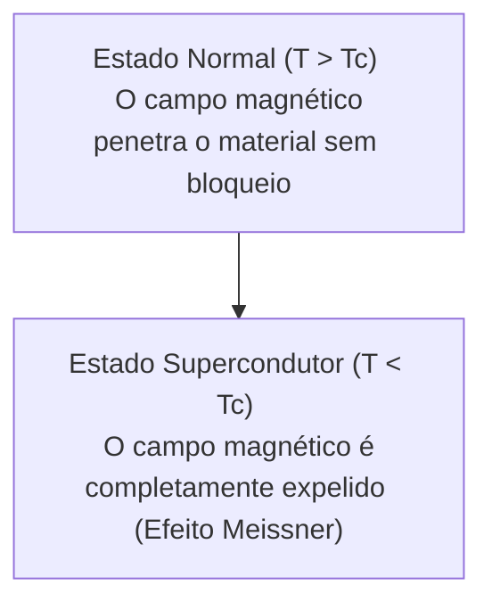

# Física: Mecanismos da Supercondutividade - Do Efeito Meissner ao Trem Maglev e às Tecnologias do Futuro

Entre os fenômenos físicos capazes de romper os limites da tecnologia contemporânea, a **supercondutividade** destaca-se pelo seu poder revolucionário. A ausência absoluta de resistência elétrica e a expulsão completa de campos magnéticos estão transformando redes elétricas, transportes de alta velocidade, diagnósticos médicos e a [computação quântica](/p/technology-quantum-computer/).

Este artigo aborda em profundidade os fundamentos da supercondutividade: desde a sua descoberta histórica e a eletrodinâmica do Efeito Meissner, passando pelos pares de Cooper e a teoria BCS, os cupratos de alta temperatura crítica, até as principais aplicações industriais (Maglev, ressonância magnética, reatores de fusão) e o sonho do supercondutor em temperatura ambiente.

## 1. O que é a Supercondutividade? Uma Descoberta Histórica

A supercondutividade é um estado quântico macroscópico apresentado por certos metais, ligas e compostos cerâmicos quando resfriados abaixo de uma **temperatura crítica ($T_c$)**, caracterizado pelo cancelamento total e abrupto da resistência elétrica em corrente contínua.

Nos condutores comuns (como cobre ou ouro), os elétrons colidem com as oscilações térmicas da rede cristalina (fônons) e impurezas, dissipando energia sob a forma de calor por Efeito Joule. Em um supercondutor abaixo de $T_c$, essa resistência anula-se inteiramente ($R = 0$). Isso significa que uma corrente induzida em um anel supercondutor fechado circula perpetuamente sem necessidade de alimentação contínua, fenômeno conhecido como **corrente persistente**.

O fenômeno foi descoberto em 1911 pelo físico holandês **Heike Kamerlingh Onnes** na Universidade de Leiden. Tendo conseguido liquefazer o hélio a 4,2 Kelvin ($-269^\circ\text{C}$), Onnes mediu a resistência elétrica do mercúrio sólido e observou que a 4,19 K ela caía subitamente para zero. Por esse feito histórico, Onnes recebeu o Prêmio Nobel de Física em 1913.

## 2. O Efeito Meissner e o Diamagnetismo Perfeito

A supercondutividade vai além de ser apenas uma condutividade elétrica ideal. Em 1933, os físicos alemães **Walther Meissner** e **Robert Ochsenfeld** descobriram uma propriedade eletromagnética ainda mais essencial: o **diamagnetismo perfeito**, consagrado como **Efeito Meissner**.

Ao ser resfriado abaixo de sua temperatura crítica na presença de um campo magnético externo, o supercondutor expele ativamente todas as linhas de fluxo magnético de seu interior. As linhas de campo contornam a superfície exterior do material.

```mermaid
flowchart TD
    A["Estado Normal (T > Tc) \n O campo magnético penetra o material sem bloqueio"] --> B["Estado Supercondutor (T < Tc) \n O campo magnético é completamente expelido (Efeito Meissner)"]
```

Para modelar matematicamente esse comportamento, os irmãos Fritz e Heinz London deduziram em 1935 as **Equações de London**. A segunda equação correlaciona a densidade de corrente supercondutora $\mathbf{J}$ com a densidade de fluxo magnético $\mathbf{B}$:

$$ \nabla \times \mathbf{J} = -\frac{n_s e^2}{m} \mathbf{B} $$

Onde:
- $\mathbf{J}$ é a densidade de corrente supercondutora.
- $n_s$ representa a densidade de portadores supercondutores.
- $e$ é a carga elementar do elétron.
- $m$ é a massa do elétron.
- $\mathbf{B}$ é o vetor de indução magnética.

Integrada às equações de Maxwell, essa relação prova que o campo magnético decai exponencialmente na superfície do material ao longo de uma profundidade diminuta chamada **comprimento de penetração de London ($\lambda_L$)**:

$$ B(x) = B_0 e^{-x / \lambda_L} $$

No interior do supercondutor, o campo é estritamente nulo ($\mathbf{B} = 0$). Quando um ímã é colocado sobre um supercondutor, formam-se correntes de blindagem na superfície que geram uma força magnética oposta idêntica, sustentando o ímã suspenso no ar em uma impressionante **levitação magnética quântica**.

## 3. O Mecanismo Quântico: Teoria BCS e Pares de Cooper

Por quase meio século após a descoberta de Onnes, a física desconhecia a causa microscópica da supercondutividade. Em 1957, **John Bardeen, Leon Cooper e John Robert Schrieffer** formularam a **Teoria BCS**, laureada com o Prêmio Nobel de Física em 1972.

A base da teoria BCS é a formação dos **pares de Cooper**. No vácuo, dois elétrons repelem-se com força devido à repulsão de Coulomb. Entretanto, ao se deslocar por uma rede cristalina em temperaturas criogênicas, a carga negativa do elétron atrai ligeiramente os íons positivos vizinhos, deformando a rede e gerando um fônon virtual. Antes que a rede retorne à posição original, essa região positiva atrai um segundo elétron com momento linear e spin opostos.

Por mediação dessa vibração da rede, estabelece-se uma atração efetiva entre os elétrons:

$$ (\mathbf{k} \uparrow, -\mathbf{k} \downarrow) $$

Sendo férmions isolados com spin $1/2$, os elétrons obedecem ao princípio de exclusão de Pauli. Contudo, unidos em pares de Cooper, adquirem spin inteiro 0 e passam a agir como bósons compostos. Abaixo de $T_c$, esses pares condensam-se em um único estado quântico fundamental macroscópico (similar ao condensado de Bose-Einstein). Todos os pares fluem em uníssono sob a mesma função de onda. Como romper essa ordem coletiva exige superar uma barreira de energia finita ($\Delta$), as vibrações térmicas e as impurezas do cristal não conseguem espalhar os elétrons, assegurando resistência estritamente nula.

## 4. Supercondutores de Alta Temperatura (HTS)

A formulação original da teoria BCS estipulava que a supercondutividade mediada por fônons convencionais não poderia ultrapassar o patamar de 30 a 40 K (o limite de McMillan).

Em 1986, **Johannes Georg Bednorz** e **Karl Alexander Müller**, nos laboratórios da IBM em Zurique, identificaram supercondutividade a 35 K em um composto cerâmico de óxido de cobre e lantânio (cuprato), superando a barreira teórica e sendo agraciados com o Nobel em 1987.

Em 1987, foi sintetizado o **YBCO (Óxido de Ítrio, Bário e Cobre)** com uma temperatura crítica de 93 K, superando o **ponto de ebulição do nitrogênio líquido (77 K / $-196^\circ\text{C}$)**. O nitrogênio líquido é abundante, seguro e consideravelmente mais barato do que o hélio líquido, viabilizando a exploração em larga escala da supercondutividade industrial.

A física dos cupratos de alta temperatura envolve fortes correlações eletrônicas e flutuações magnéticas de spin que transcendem o modelo BCS puramente fonônico, permanecendo um dos maiores desafios em aberto na física da matéria condensada.

## 5. Aplicações Tecnológicas de Grande Impacto

A condução de correntes elétricas altíssimas sem geração de calor e a produção de campos magnéticos extremos impulsionam setores cruciais:

### 5.1 O Trem de Levitação Magnética (SCMaglev)
O sistema japonês **SCMaglev** utiliza ímãs supercondutores de nióbio-titânio (NbTi) refrigerados por hélio líquido. Correntes persistentes nas bobinas criam campos magnéticos intensos que interagem com as bobinas da via, suspendendo o veículo a 10 cm do chão e deslocando-o a mais de **500 km/h (com recorde de 603 km/h)** com ausência total de atrito mecânico.

### 5.2 Ressonância Magnética (MRI) na Medicina
Os aparelhos de ressonância magnética exigem campos magnéticos altamente homogêneos e estáveis de 1,5 a 3,0 Teslas (atingindo 7T em pesquisas cerebrais). As bobinas supercondutoras mantêm esses campos imensos continuamente sem dissipação de calor, garantindo diagnósticos por imagem de resolução milimétrica.

### 5.3 Aceleradores de Partículas e Reatores de Fusão
No CERN, o **Grande Colisor de Hádrons (LHC)** utiliza mais de 1.200 dipolos supercondutores ao longo de um anel de 27 km para guiar prótons a 99,999999% da velocidade da luz. No reator experimental de fusão **ITER**, gigantescas bobinas supercondutoras de nióbio-estanho ($Nb_3Sn$) geram uma gaiola magnética de 13 Teslas para conter o plasma aquecido a 100 milhões de graus Celsius.

### 5.4 Computadores Quânticos Supercondutores
Processadores quânticos líderes da indústria (Google Sycamore, IBM Quantum) utilizam circuitos supercondutores. Por meio de **junções Josephson** (camadas isolantes ultrafinas entre supercondutores), criam-se qubits artificiais controlados por pulsos de micro-ondas em refrigeradores de diluição em temperaturas de milikelvins.

## 6. A Fronteira Científica: Supercondutividade em Temperatura Ambiente

O principal entrave à universalização da supercondutividade reside nos custos operacionais dos sistemas criogênicos.

A eventual síntese de um **supercondutor em temperatura e pressão ambientes ($T_c > 300\text{ K}$, $P = 1\text{ atm}$)** deflagraria uma revolução energética sem precedentes:
- **Redes elétricas com zero perdas**: Eliminação dos 5% a 10% da energia elétrica mundial perdida em aquecimento de linhas de transmissão.
- **Microprocessadores sem aquecimento**: Circuitos integrados que operariam em frequências de terahertz livres do estrangulamento térmico.
- **Armazenamento magnético de energia (SMES)**: Baterias magnéticas para armazenar gigawatts-hora com rendimento de ciclo próximo a 100%.

Nos últimos anos, experimentos com células de bigorna de diamante alcançaram supercondutividade a cerca de 250 K ($-23^\circ\text{C}$) em hidretos superpressurizados ($H_3S$, $LaH_{10}$) a mais de 1,5 milhão de atmosferas. O objetivo atual da ciência dos materiais é estabilizar materiais análogos sob pressão atmosférica normal.

## Conclusão: O Universo Quântico na Escala Humana

A supercondutividade é um dos raros fenômenos em que os princípios da mecânica quântica se tornam visíveis aos nossos olhos. Da gota de mercúrio de Onnes em 1911 aos reatores de fusão e computadores quânticos atuais, a supercondutividade continua expandindo os horizontes da ciência e da civilização moderna.
