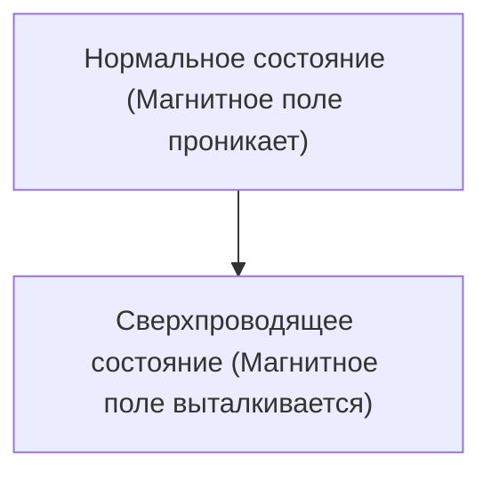

# Физика: Как работает сверхпроводимость

Сверхпроводимость — это явление, при котором электрическое сопротивление становится равным нулю.

## Эффект Мейснера

## Уравнение Лондонов
$$ \nabla \times \mathbf{J} = -\frac{n_s e^2}{m} \mathbf{B} $$

## Дополнительная техническая проверка, часть 1

В этом разделе мы более подробно рассмотрим технические детали и тематические исследования. Мы оценим производительность в различных условиях и обсудим проблемы и решения, связанные с интеграцией с другими системами. Мы также обсудим будущие перспективы и ограничения.

