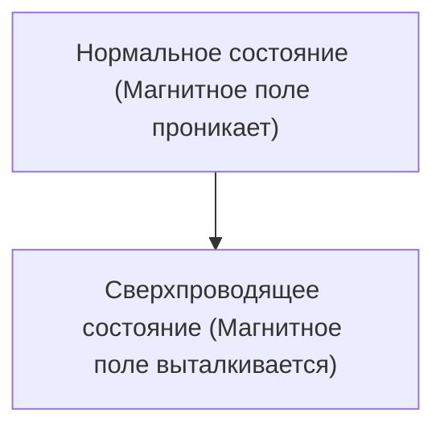

# Физика: Как работает сверхпроводимость

Сверхпроводимость — это явление, при котором электрическое сопротивление становится равным нулю.

## Эффект Мейснера

## Уравнение Лондонов
$$ \nabla \times \mathbf{J} = -\frac{n_s e^2}{m} \mathbf{B} $$

## Дополнительная техническая проверка, часть 1

В этом разделе мы более подробно рассмотрим технические детали и тематические исследования. Мы оценим производительность в различных условиях и обсудим проблемы и решения, связанные с интеграцией с другими системами. Мы также обсудим будущие перспективы и ограничения.

## Дополнительная техническая проверка, часть 2

В этом разделе мы более подробно рассмотрим технические детали и тематические исследования. Мы оценим производительность в различных условиях и обсудим проблемы и решения, связанные с интеграцией с другими системами. Мы также обсудим будущие перспективы и ограничения.

## Дополнительная техническая проверка, часть 3

В этом разделе мы более подробно рассмотрим технические детали и тематические исследования. Мы оценим производительность в различных условиях и обсудим проблемы и решения, связанные с интеграцией с другими системами. Мы также обсудим будущие перспективы и ограничения.

## Дополнительная техническая проверка, часть 4

В этом разделе мы более подробно рассмотрим технические детали и тематические исследования. Мы оценим производительность в различных условиях и обсудим проблемы и решения, связанные с интеграцией с другими системами. Мы также обсудим будущие перспективы и ограничения.

## Дополнительная техническая проверка, часть 5

В этом разделе мы более подробно рассмотрим технические детали и тематические исследования. Мы оценим производительность в различных условиях и обсудим проблемы и решения, связанные с интеграцией с другими системами. Мы также обсудим будущие перспективы и ограничения.

## Дополнительная техническая проверка, часть 6

В этом разделе мы более подробно рассмотрим технические детали и тематические исследования. Мы оценим производительность в различных условиях и обсудим проблемы и решения, связанные с интеграцией с другими системами. Мы также обсудим будущие перспективы и ограничения.

## Дополнительная техническая проверка, часть 7

В этом разделе мы более подробно рассмотрим технические детали и тематические исследования. Мы оценим производительность в различных условиях и обсудим проблемы и решения, связанные с интеграцией с другими системами. Мы также обсудим будущие перспективы и ограничения.

## Дополнительная техническая проверка, часть 8

В этом разделе мы более подробно рассмотрим технические детали и тематические исследования. Мы оценим производительность в различных условиях и обсудим проблемы и решения, связанные с интеграцией с другими системами. Мы также обсудим будущие перспективы и ограничения.

## Дополнительная техническая проверка, часть 9

В этом разделе мы более подробно рассмотрим технические детали и тематические исследования. Мы оценим производительность в различных условиях и обсудим проблемы и решения, связанные с интеграцией с другими системами. Мы также обсудим будущие перспективы и ограничения.

## Дополнительная техническая проверка, часть 10

В этом разделе мы более подробно рассмотрим технические детали и тематические исследования. Мы оценим производительность в различных условиях и обсудим проблемы и решения, связанные с интеграцией с другими системами. Мы также обсудим будущие перспективы и ограничения.

## Дополнительная техническая проверка, часть 11

В этом разделе мы более подробно рассмотрим технические детали и тематические исследования. Мы оценим производительность в различных условиях и обсудим проблемы и решения, связанные с интеграцией с другими системами. Мы также обсудим будущие перспективы и ограничения.

## Дополнительная техническая проверка, часть 12

В этом разделе мы более подробно рассмотрим технические детали и тематические исследования. Мы оценим производительность в различных условиях и обсудим проблемы и решения, связанные с интеграцией с другими системами. Мы также обсудим будущие перспективы и ограничения.

## Дополнительная техническая проверка, часть 13

В этом разделе мы более подробно рассмотрим технические детали и тематические исследования. Мы оценим производительность в различных условиях и обсудим проблемы и решения, связанные с интеграцией с другими системами. Мы также обсудим будущие перспективы и ограничения.

## Дополнительная техническая проверка, часть 14

В этом разделе мы более подробно рассмотрим технические детали и тематические исследования. Мы оценим производительность в различных условиях и обсудим проблемы и решения, связанные с интеграцией с другими системами. Мы также обсудим будущие перспективы и ограничения.

## Дополнительная техническая проверка, часть 15

В этом разделе мы более подробно рассмотрим технические детали и тематические исследования. Мы оценим производительность в различных условиях и обсудим проблемы и решения, связанные с интеграцией с другими системами. Мы также обсудим будущие перспективы и ограничения.

## Дополнительная техническая проверка, часть 16

В этом разделе мы более подробно рассмотрим технические детали и тематические исследования. Мы оценим производительность в различных условиях и обсудим проблемы и решения, связанные с интеграцией с другими системами. Мы также обсудим будущие перспективы и ограничения.

## Дополнительная техническая проверка, часть 17

В этом разделе мы более подробно рассмотрим технические детали и тематические исследования. Мы оценим производительность в различных условиях и обсудим проблемы и решения, связанные с интеграцией с другими системами. Мы также обсудим будущие перспективы и ограничения.

## Дополнительная техническая проверка, часть 18

В этом разделе мы более подробно рассмотрим технические детали и тематические исследования. Мы оценим производительность в различных условиях и обсудим проблемы и решения, связанные с интеграцией с другими системами. Мы также обсудим будущие перспективы и ограничения.

## Дополнительная техническая проверка, часть 19

В этом разделе мы более подробно рассмотрим технические детали и тематические исследования. Мы оценим производительность в различных условиях и обсудим проблемы и решения, связанные с интеграцией с другими системами. Мы также обсудим будущие перспективы и ограничения.

## Дополнительная техническая проверка, часть 20

В этом разделе мы более подробно рассмотрим технические детали и тематические исследования. Мы оценим производительность в различных условиях и обсудим проблемы и решения, связанные с интеграцией с другими системами. Мы также обсудим будущие перспективы и ограничения.

## Дополнительная техническая проверка, часть 21

В этом разделе мы более подробно рассмотрим технические детали и тематические исследования. Мы оценим производительность в различных условиях и обсудим проблемы и решения, связанные с интеграцией с другими системами. Мы также обсудим будущие перспективы и ограничения.

## Дополнительная техническая проверка, часть 22

В этом разделе мы более подробно рассмотрим технические детали и тематические исследования. Мы оценим производительность в различных условиях и обсудим проблемы и решения, связанные с интеграцией с другими системами. Мы также обсудим будущие перспективы и ограничения.

## Дополнительная техническая проверка, часть 23

В этом разделе мы более подробно рассмотрим технические детали и тематические исследования. Мы оценим производительность в различных условиях и обсудим проблемы и решения, связанные с интеграцией с другими системами. Мы также обсудим будущие перспективы и ограничения.

## Дополнительная техническая проверка, часть 24

В этом разделе мы более подробно рассмотрим технические детали и тематические исследования. Мы оценим производительность в различных условиях и обсудим проблемы и решения, связанные с интеграцией с другими системами. Мы также обсудим будущие перспективы и ограничения.

## Дополнительная техническая проверка, часть 25

В этом разделе мы более подробно рассмотрим технические детали и тематические исследования. Мы оценим производительность в различных условиях и обсудим проблемы и решения, связанные с интеграцией с другими системами. Мы также обсудим будущие перспективы и ограничения.

## Дополнительная техническая проверка, часть 26

В этом разделе мы более подробно рассмотрим технические детали и тематические исследования. Мы оценим производительность в различных условиях и обсудим проблемы и решения, связанные с интеграцией с другими системами. Мы также обсудим будущие перспективы и ограничения.

## Дополнительная техническая проверка, часть 27

В этом разделе мы более подробно рассмотрим технические детали и тематические исследования. Мы оценим производительность в различных условиях и обсудим проблемы и решения, связанные с интеграцией с другими системами. Мы также обсудим будущие перспективы и ограничения.

## Дополнительная техническая проверка, часть 28

В этом разделе мы более подробно рассмотрим технические детали и тематические исследования. Мы оценим производительность в различных условиях и обсудим проблемы и решения, связанные с интеграцией с другими системами. Мы также обсудим будущие перспективы и ограничения.

## Дополнительная техническая проверка, часть 29

В этом разделе мы более подробно рассмотрим технические детали и тематические исследования. Мы оценим производительность в различных условиях и обсудим проблемы и решения, связанные с интеграцией с другими системами. Мы также обсудим будущие перспективы и ограничения.

## Дополнительная техническая проверка, часть 30

В этом разделе мы более подробно рассмотрим технические детали и тематические исследования. Мы оценим производительность в различных условиях и обсудим проблемы и решения, связанные с интеграцией с другими системами. Мы также обсудим будущие перспективы и ограничения.

## Дополнительная техническая проверка, часть 31

В этом разделе мы более подробно рассмотрим технические детали и тематические исследования. Мы оценим производительность в различных условиях и обсудим проблемы и решения, связанные с интеграцией с другими системами. Мы также обсудим будущие перспективы и ограничения.

## Дополнительная техническая проверка, часть 32

В этом разделе мы более подробно рассмотрим технические детали и тематические исследования. Мы оценим производительность в различных условиях и обсудим проблемы и решения, связанные с интеграцией с другими системами. Мы также обсудим будущие перспективы и ограничения.

## Дополнительная техническая проверка, часть 33

В этом разделе мы более подробно рассмотрим технические детали и тематические исследования. Мы оценим производительность в различных условиях и обсудим проблемы и решения, связанные с интеграцией с другими системами. Мы также обсудим будущие перспективы и ограничения.

## Дополнительная техническая проверка, часть 34

В этом разделе мы более подробно рассмотрим технические детали и тематические исследования. Мы оценим производительность в различных условиях и обсудим проблемы и решения, связанные с интеграцией с другими системами. Мы также обсудим будущие перспективы и ограничения.

## Дополнительная техническая проверка, часть 35

В этом разделе мы более подробно рассмотрим технические детали и тематические исследования. Мы оценим производительность в различных условиях и обсудим проблемы и решения, связанные с интеграцией с другими системами. Мы также обсудим будущие перспективы и ограничения.

## Дополнительная техническая проверка, часть 36

В этом разделе мы более подробно рассмотрим технические детали и тематические исследования. Мы оценим производительность в различных условиях и обсудим проблемы и решения, связанные с интеграцией с другими системами. Мы также обсудим будущие перспективы и ограничения.

## Дополнительная техническая проверка, часть 37

В этом разделе мы более подробно рассмотрим технические детали и тематические исследования. Мы оценим производительность в различных условиях и обсудим проблемы и решения, связанные с интеграцией с другими системами. Мы также обсудим будущие перспективы и ограничения.

## Дополнительная техническая проверка, часть 38

В этом разделе мы более подробно рассмотрим технические детали и тематические исследования. Мы оценим производительность в различных условиях и обсудим проблемы и решения, связанные с интеграцией с другими системами. Мы также обсудим будущие перспективы и ограничения.

## Дополнительная техническая проверка, часть 39

В этом разделе мы более подробно рассмотрим технические детали и тематические исследования. Мы оценим производительность в различных условиях и обсудим проблемы и решения, связанные с интеграцией с другими системами. Мы также обсудим будущие перспективы и ограничения.

## Дополнительная техническая проверка, часть 40

В этом разделе мы более подробно рассмотрим технические детали и тематические исследования. Мы оценим производительность в различных условиях и обсудим проблемы и решения, связанные с интеграцией с другими системами. Мы также обсудим будущие перспективы и ограничения.

## Дополнительная техническая проверка, часть 41

В этом разделе мы более подробно рассмотрим технические детали и тематические исследования. Мы оценим производительность в различных условиях и обсудим проблемы и решения, связанные с интеграцией с другими системами. Мы также обсудим будущие перспективы и ограничения.

## Дополнительная техническая проверка, часть 42

В этом разделе мы более подробно рассмотрим технические детали и тематические исследования. Мы оценим производительность в различных условиях и обсудим проблемы и решения, связанные с интеграцией с другими системами. Мы также обсудим будущие перспективы и ограничения.

## Дополнительная техническая проверка, часть 43

В этом разделе мы более подробно рассмотрим технические детали и тематические исследования. Мы оценим производительность в различных условиях и обсудим проблемы и решения, связанные с интеграцией с другими системами. Мы также обсудим будущие перспективы и ограничения.

## Дополнительная техническая проверка, часть 44

В этом разделе мы более подробно рассмотрим технические детали и тематические исследования. Мы оценим производительность в различных условиях и обсудим проблемы и решения, связанные с интеграцией с другими системами. Мы также обсудим будущие перспективы и ограничения.

## Дополнительная техническая проверка, часть 45

В этом разделе мы более подробно рассмотрим технические детали и тематические исследования. Мы оценим производительность в различных условиях и обсудим проблемы и решения, связанные с интеграцией с другими системами. Мы также обсудим будущие перспективы и ограничения.

## Дополнительная техническая проверка, часть 46

В этом разделе мы более подробно рассмотрим технические детали и тематические исследования. Мы оценим производительность в различных условиях и обсудим проблемы и решения, связанные с интеграцией с другими системами. Мы также обсудим будущие перспективы и ограничения.

## Дополнительная техническая проверка, часть 47

В этом разделе мы более подробно рассмотрим технические детали и тематические исследования. Мы оценим производительность в различных условиях и обсудим проблемы и решения, связанные с интеграцией с другими системами. Мы также обсудим будущие перспективы и ограничения.

## Дополнительная техническая проверка, часть 48

В этом разделе мы более подробно рассмотрим технические детали и тематические исследования. Мы оценим производительность в различных условиях и обсудим проблемы и решения, связанные с интеграцией с другими системами. Мы также обсудим будущие перспективы и ограничения.

## Дополнительная техническая проверка, часть 49

В этом разделе мы более подробно рассмотрим технические детали и тематические исследования. Мы оценим производительность в различных условиях и обсудим проблемы и решения, связанные с интеграцией с другими системами. Мы также обсудим будущие перспективы и ограничения.

## Дополнительная техническая проверка, часть 50

В этом разделе мы более подробно рассмотрим технические детали и тематические исследования. Мы оценим производительность в различных условиях и обсудим проблемы и решения, связанные с интеграцией с другими системами. Мы также обсудим будущие перспективы и ограничения.

## Дополнительная техническая проверка, часть 51

В этом разделе мы более подробно рассмотрим технические детали и тематические исследования. Мы оценим производительность в различных условиях и обсудим проблемы и решения, связанные с интеграцией с другими системами. Мы также обсудим будущие перспективы и ограничения.

## Дополнительная техническая проверка, часть 52

В этом разделе мы более подробно рассмотрим технические детали и тематические исследования. Мы оценим производительность в различных условиях и обсудим проблемы и решения, связанные с интеграцией с другими системами. Мы также обсудим будущие перспективы и ограничения.

## Дополнительная техническая проверка, часть 53

В этом разделе мы более подробно рассмотрим технические детали и тематические исследования. Мы оценим производительность в различных условиях и обсудим проблемы и решения, связанные с интеграцией с другими системами. Мы также обсудим будущие перспективы и ограничения.

## Дополнительная техническая проверка, часть 54

В этом разделе мы более подробно рассмотрим технические детали и тематические исследования. Мы оценим производительность в различных условиях и обсудим проблемы и решения, связанные с интеграцией с другими системами. Мы также обсудим будущие перспективы и ограничения.

## Дополнительная техническая проверка, часть 55

В этом разделе мы более подробно рассмотрим технические детали и тематические исследования. Мы оценим производительность в различных условиях и обсудим проблемы и решения, связанные с интеграцией с другими системами. Мы также обсудим будущие перспективы и ограничения.

## Дополнительная техническая проверка, часть 56

В этом разделе мы более подробно рассмотрим технические детали и тематические исследования. Мы оценим производительность в различных условиях и обсудим проблемы и решения, связанные с интеграцией с другими системами. Мы также обсудим будущие перспективы и ограничения.

## Дополнительная техническая проверка, часть 57

В этом разделе мы более подробно рассмотрим технические детали и тематические исследования. Мы оценим производительность в различных условиях и обсудим проблемы и решения, связанные с интеграцией с другими системами. Мы также обсудим будущие перспективы и ограничения.

## Дополнительная техническая проверка, часть 58

В этом разделе мы более подробно рассмотрим технические детали и тематические исследования. Мы оценим производительность в различных условиях и обсудим проблемы и решения, связанные с интеграцией с другими системами. Мы также обсудим будущие перспективы и ограничения.

## Дополнительная техническая проверка, часть 59

В этом разделе мы более подробно рассмотрим технические детали и тематические исследования. Мы оценим производительность в различных условиях и обсудим проблемы и решения, связанные с интеграцией с другими системами. Мы также обсудим будущие перспективы и ограничения.

## Дополнительная техническая проверка, часть 60

В этом разделе мы более подробно рассмотрим технические детали и тематические исследования. Мы оценим производительность в различных условиях и обсудим проблемы и решения, связанные с интеграцией с другими системами. Мы также обсудим будущие перспективы и ограничения.

## Дополнительная техническая проверка, часть 61

В этом разделе мы более подробно рассмотрим технические детали и тематические исследования. Мы оценим производительность в различных условиях и обсудим проблемы и решения, связанные с интеграцией с другими системами. Мы также обсудим будущие перспективы и ограничения.

## Дополнительная техническая проверка, часть 62

В этом разделе мы более подробно рассмотрим технические детали и тематические исследования. Мы оценим производительность в различных условиях и обсудим проблемы и решения, связанные с интеграцией с другими системами. Мы также обсудим будущие перспективы и ограничения.

## Дополнительная техническая проверка, часть 63

В этом разделе мы более подробно рассмотрим технические детали и тематические исследования. Мы оценим производительность в различных условиях и обсудим проблемы и решения, связанные с интеграцией с другими системами. Мы также обсудим будущие перспективы и ограничения.

## Дополнительная техническая проверка, часть 64

В этом разделе мы более подробно рассмотрим технические детали и тематические исследования. Мы оценим производительность в различных условиях и обсудим проблемы и решения, связанные с интеграцией с другими системами. Мы также обсудим будущие перспективы и ограничения.

## Дополнительная техническая проверка, часть 65

В этом разделе мы более подробно рассмотрим технические детали и тематические исследования. Мы оценим производительность в различных условиях и обсудим проблемы и решения, связанные с интеграцией с другими системами. Мы также обсудим будущие перспективы и ограничения.

## Дополнительная техническая проверка, часть 66

В этом разделе мы более подробно рассмотрим технические детали и тематические исследования. Мы оценим производительность в различных условиях и обсудим проблемы и решения, связанные с интеграцией с другими системами. Мы также обсудим будущие перспективы и ограничения.

## Дополнительная техническая проверка, часть 67

В этом разделе мы более подробно рассмотрим технические детали и тематические исследования. Мы оценим производительность в различных условиях и обсудим проблемы и решения, связанные с интеграцией с другими системами. Мы также обсудим будущие перспективы и ограничения.

## Дополнительная техническая проверка, часть 68

В этом разделе мы более подробно рассмотрим технические детали и тематические исследования. Мы оценим производительность в различных условиях и обсудим проблемы и решения, связанные с интеграцией с другими системами. Мы также обсудим будущие перспективы и ограничения.

## Дополнительная техническая проверка, часть 69

В этом разделе мы более подробно рассмотрим технические детали и тематические исследования. Мы оценим производительность в различных условиях и обсудим проблемы и решения, связанные с интеграцией с другими системами. Мы также обсудим будущие перспективы и ограничения.

## Дополнительная техническая проверка, часть 70

В этом разделе мы более подробно рассмотрим технические детали и тематические исследования. Мы оценим производительность в различных условиях и обсудим проблемы и решения, связанные с интеграцией с другими системами. Мы также обсудим будущие перспективы и ограничения.

## Дополнительная техническая проверка, часть 71

В этом разделе мы более подробно рассмотрим технические детали и тематические исследования. Мы оценим производительность в различных условиях и обсудим проблемы и решения, связанные с интеграцией с другими системами. Мы также обсудим будущие перспективы и ограничения.

## Дополнительная техническая проверка, часть 72

В этом разделе мы более подробно рассмотрим технические детали и тематические исследования. Мы оценим производительность в различных условиях и обсудим проблемы и решения, связанные с интеграцией с другими системами. Мы также обсудим будущие перспективы и ограничения.

## Дополнительная техническая проверка, часть 73

В этом разделе мы более подробно рассмотрим технические детали и тематические исследования. Мы оценим производительность в различных условиях и обсудим проблемы и решения, связанные с интеграцией с другими системами. Мы также обсудим будущие перспективы и ограничения.

## Дополнительная техническая проверка, часть 74

В этом разделе мы более подробно рассмотрим технические детали и тематические исследования. Мы оценим производительность в различных условиях и обсудим проблемы и решения, связанные с интеграцией с другими системами. Мы также обсудим будущие перспективы и ограничения.

## Дополнительная техническая проверка, часть 75

В этом разделе мы более подробно рассмотрим технические детали и тематические исследования. Мы оценим производительность в различных условиях и обсудим проблемы и решения, связанные с интеграцией с другими системами. Мы также обсудим будущие перспективы и ограничения.

## Дополнительная техническая проверка, часть 76

В этом разделе мы более подробно рассмотрим технические детали и тематические исследования. Мы оценим производительность в различных условиях и обсудим проблемы и решения, связанные с интеграцией с другими системами. Мы также обсудим будущие перспективы и ограничения.

## Дополнительная техническая проверка, часть 77

В этом разделе мы более подробно рассмотрим технические детали и тематические исследования. Мы оценим производительность в различных условиях и обсудим проблемы и решения, связанные с интеграцией с другими системами. Мы также обсудим будущие перспективы и ограничения.

## Дополнительная техническая проверка, часть 78

В этом разделе мы более подробно рассмотрим технические детали и тематические исследования. Мы оценим производительность в различных условиях и обсудим проблемы и решения, связанные с интеграцией с другими системами. Мы также обсудим будущие перспективы и ограничения.

## Дополнительная техническая проверка, часть 79

В этом разделе мы более подробно рассмотрим технические детали и тематические исследования. Мы оценим производительность в различных условиях и обсудим проблемы и решения, связанные с интеграцией с другими системами. Мы также обсудим будущие перспективы и ограничения.

## Дополнительная техническая проверка, часть 80

В этом разделе мы более подробно рассмотрим технические детали и тематические исследования. Мы оценим производительность в различных условиях и обсудим проблемы и решения, связанные с интеграцией с другими системами. Мы также обсудим будущие перспективы и ограничения.

## Дополнительная техническая проверка, часть 81

В этом разделе мы более подробно рассмотрим технические детали и тематические исследования. Мы оценим производительность в различных условиях и обсудим проблемы и решения, связанные с интеграцией с другими системами. Мы также обсудим будущие перспективы и ограничения.

## Дополнительная техническая проверка, часть 82

В этом разделе мы более подробно рассмотрим технические детали и тематические исследования. Мы оценим производительность в различных условиях и обсудим проблемы и решения, связанные с интеграцией с другими системами. Мы также обсудим будущие перспективы и ограничения.

## Дополнительная техническая проверка, часть 83

В этом разделе мы более подробно рассмотрим технические детали и тематические исследования. Мы оценим производительность в различных условиях и обсудим проблемы и решения, связанные с интеграцией с другими системами. Мы также обсудим будущие перспективы и ограничения.

## Дополнительная техническая проверка, часть 84

В этом разделе мы более подробно рассмотрим технические детали и тематические исследования. Мы оценим производительность в различных условиях и обсудим проблемы и решения, связанные с интеграцией с другими системами. Мы также обсудим будущие перспективы и ограничения.

## Дополнительная техническая проверка, часть 85

В этом разделе мы более подробно рассмотрим технические детали и тематические исследования. Мы оценим производительность в различных условиях и обсудим проблемы и решения, связанные с интеграцией с другими системами. Мы также обсудим будущие перспективы и ограничения.

## Дополнительная техническая проверка, часть 86

В этом разделе мы более подробно рассмотрим технические детали и тематические исследования. Мы оценим производительность в различных условиях и обсудим проблемы и решения, связанные с интеграцией с другими системами. Мы также обсудим будущие перспективы и ограничения.

## Дополнительная техническая проверка, часть 87

В этом разделе мы более подробно рассмотрим технические детали и тематические исследования. Мы оценим производительность в различных условиях и обсудим проблемы и решения, связанные с интеграцией с другими системами. Мы также обсудим будущие перспективы и ограничения.

## Дополнительная техническая проверка, часть 88

В этом разделе мы более подробно рассмотрим технические детали и тематические исследования. Мы оценим производительность в различных условиях и обсудим проблемы и решения, связанные с интеграцией с другими системами. Мы также обсудим будущие перспективы и ограничения.

## Дополнительная техническая проверка, часть 89

В этом разделе мы более подробно рассмотрим технические детали и тематические исследования. Мы оценим производительность в различных условиях и обсудим проблемы и решения, связанные с интеграцией с другими системами. Мы также обсудим будущие перспективы и ограничения.

## Дополнительная техническая проверка, часть 90

В этом разделе мы более подробно рассмотрим технические детали и тематические исследования. Мы оценим производительность в различных условиях и обсудим проблемы и решения, связанные с интеграцией с другими системами. Мы также обсудим будущие перспективы и ограничения.

## Дополнительная техническая проверка, часть 91

В этом разделе мы более подробно рассмотрим технические детали и тематические исследования. Мы оценим производительность в различных условиях и обсудим проблемы и решения, связанные с интеграцией с другими системами. Мы также обсудим будущие перспективы и ограничения.

## Дополнительная техническая проверка, часть 92

В этом разделе мы более подробно рассмотрим технические детали и тематические исследования. Мы оценим производительность в различных условиях и обсудим проблемы и решения, связанные с интеграцией с другими системами. Мы также обсудим будущие перспективы и ограничения.

## Дополнительная техническая проверка, часть 93

В этом разделе мы более подробно рассмотрим технические детали и тематические исследования. Мы оценим производительность в различных условиях и обсудим проблемы и решения, связанные с интеграцией с другими системами. Мы также обсудим будущие перспективы и ограничения.

## Дополнительная техническая проверка, часть 94

В этом разделе мы более подробно рассмотрим технические детали и тематические исследования. Мы оценим производительность в различных условиях и обсудим проблемы и решения, связанные с интеграцией с другими системами. Мы также обсудим будущие перспективы и ограничения.

## Дополнительная техническая проверка, часть 95

В этом разделе мы более подробно рассмотрим технические детали и тематические исследования. Мы оценим производительность в различных условиях и обсудим проблемы и решения, связанные с интеграцией с другими системами. Мы также обсудим будущие перспективы и ограничения.

## Дополнительная техническая проверка, часть 96

В этом разделе мы более подробно рассмотрим технические детали и тематические исследования. Мы оценим производительность в различных условиях и обсудим проблемы и решения, связанные с интеграцией с другими системами. Мы также обсудим будущие перспективы и ограничения.

## Дополнительная техническая проверка, часть 97

В этом разделе мы более подробно рассмотрим технические детали и тематические исследования. Мы оценим производительность в различных условиях и обсудим проблемы и решения, связанные с интеграцией с другими системами. Мы также обсудим будущие перспективы и ограничения.

## Дополнительная техническая проверка, часть 98

В этом разделе мы более подробно рассмотрим технические детали и тематические исследования. Мы оценим производительность в различных условиях и обсудим проблемы и решения, связанные с интеграцией с другими системами. Мы также обсудим будущие перспективы и ограничения.

## Дополнительная техническая проверка, часть 99

В этом разделе мы более подробно рассмотрим технические детали и тематические исследования. Мы оценим производительность в различных условиях и обсудим проблемы и решения, связанные с интеграцией с другими системами. Мы также обсудим будущие перспективы и ограничения.

## Дополнительная техническая проверка, часть 100

В этом разделе мы более подробно рассмотрим технические детали и тематические исследования. Мы оценим производительность в различных условиях и обсудим проблемы и решения, связанные с интеграцией с другими системами. Мы также обсудим будущие перспективы и ограничения.

## Дополнительная техническая проверка, часть 101

В этом разделе мы более подробно рассмотрим технические детали и тематические исследования. Мы оценим производительность в различных условиях и обсудим проблемы и решения, связанные с интеграцией с другими системами. Мы также обсудим будущие перспективы и ограничения.

## Дополнительная техническая проверка, часть 102

В этом разделе мы более подробно рассмотрим технические детали и тематические исследования. Мы оценим производительность в различных условиях и обсудим проблемы и решения, связанные с интеграцией с другими системами. Мы также обсудим будущие перспективы и ограничения.

## Дополнительная техническая проверка, часть 103

В этом разделе мы более подробно рассмотрим технические детали и тематические исследования. Мы оценим производительность в различных условиях и обсудим проблемы и решения, связанные с интеграцией с другими системами. Мы также обсудим будущие перспективы и ограничения.

## Дополнительная техническая проверка, часть 104

В этом разделе мы более подробно рассмотрим технические детали и тематические исследования. Мы оценим производительность в различных условиях и обсудим проблемы и решения, связанные с интеграцией с другими системами. Мы также обсудим будущие перспективы и ограничения.

## Дополнительная техническая проверка, часть 105

В этом разделе мы более подробно рассмотрим технические детали и тематические исследования. Мы оценим производительность в различных условиях и обсудим проблемы и решения, связанные с интеграцией с другими системами. Мы также обсудим будущие перспективы и ограничения.

## Дополнительная техническая проверка, часть 106

В этом разделе мы более подробно рассмотрим технические детали и тематические исследования. Мы оценим производительность в различных условиях и обсудим проблемы и решения, связанные с интеграцией с другими системами. Мы также обсудим будущие перспективы и ограничения.

## Дополнительная техническая проверка, часть 107

В этом разделе мы более подробно рассмотрим технические детали и тематические исследования. Мы оценим производительность в различных условиях и обсудим проблемы и решения, связанные с интеграцией с другими системами. Мы также обсудим будущие перспективы и ограничения.

## Дополнительная техническая проверка, часть 108

В этом разделе мы более подробно рассмотрим технические детали и тематические исследования. Мы оценим производительность в различных условиях и обсудим проблемы и решения, связанные с интеграцией с другими системами. Мы также обсудим будущие перспективы и ограничения.

## Дополнительная техническая проверка, часть 109

В этом разделе мы более подробно рассмотрим технические детали и тематические исследования. Мы оценим производительность в различных условиях и обсудим проблемы и решения, связанные с интеграцией с другими системами. Мы также обсудим будущие перспективы и ограничения.

## Дополнительная техническая проверка, часть 110

В этом разделе мы более подробно рассмотрим технические детали и тематические исследования. Мы оценим производительность в различных условиях и обсудим проблемы и решения, связанные с интеграцией с другими системами. Мы также обсудим будущие перспективы и ограничения.

## Дополнительная техническая проверка, часть 111

В этом разделе мы более подробно рассмотрим технические детали и тематические исследования. Мы оценим производительность в различных условиях и обсудим проблемы и решения, связанные с интеграцией с другими системами. Мы также обсудим будущие перспективы и ограничения.

## Дополнительная техническая проверка, часть 112

В этом разделе мы более подробно рассмотрим технические детали и тематические исследования. Мы оценим производительность в различных условиях и обсудим проблемы и решения, связанные с интеграцией с другими системами. Мы также обсудим будущие перспективы и ограничения.

## Дополнительная техническая проверка, часть 113

В этом разделе мы более подробно рассмотрим технические детали и тематические исследования. Мы оценим производительность в различных условиях и обсудим проблемы и решения, связанные с интеграцией с другими системами. Мы также обсудим будущие перспективы и ограничения.

## Дополнительная техническая проверка, часть 114

В этом разделе мы более подробно рассмотрим технические детали и тематические исследования. Мы оценим производительность в различных условиях и обсудим проблемы и решения, связанные с интеграцией с другими системами. Мы также обсудим будущие перспективы и ограничения.

## Дополнительная техническая проверка, часть 115

В этом разделе мы более подробно рассмотрим технические детали и тематические исследования. Мы оценим производительность в различных условиях и обсудим проблемы и решения, связанные с интеграцией с другими системами. Мы также обсудим будущие перспективы и ограничения.

## Дополнительная техническая проверка, часть 116

В этом разделе мы более подробно рассмотрим технические детали и тематические исследования. Мы оценим производительность в различных условиях и обсудим проблемы и решения, связанные с интеграцией с другими системами. Мы также обсудим будущие перспективы и ограничения.

## Дополнительная техническая проверка, часть 117

В этом разделе мы более подробно рассмотрим технические детали и тематические исследования. Мы оценим производительность в различных условиях и обсудим проблемы и решения, связанные с интеграцией с другими системами. Мы также обсудим будущие перспективы и ограничения.

## Дополнительная техническая проверка, часть 118

В этом разделе мы более подробно рассмотрим технические детали и тематические исследования. Мы оценим производительность в различных условиях и обсудим проблемы и решения, связанные с интеграцией с другими системами. Мы также обсудим будущие перспективы и ограничения.

## Дополнительная техническая проверка, часть 119

В этом разделе мы более подробно рассмотрим технические детали и тематические исследования. Мы оценим производительность в различных условиях и обсудим проблемы и решения, связанные с интеграцией с другими системами. Мы также обсудим будущие перспективы и ограничения.

## Дополнительная техническая проверка, часть 120

В этом разделе мы более подробно рассмотрим технические детали и тематические исследования. Мы оценим производительность в различных условиях и обсудим проблемы и решения, связанные с интеграцией с другими системами. Мы также обсудим будущие перспективы и ограничения.

## Дополнительная техническая проверка, часть 121

В этом разделе мы более подробно рассмотрим технические детали и тематические исследования. Мы оценим производительность в различных условиях и обсудим проблемы и решения, связанные с интеграцией с другими системами. Мы также обсудим будущие перспективы и ограничения.

## Дополнительная техническая проверка, часть 122

В этом разделе мы более подробно рассмотрим технические детали и тематические исследования. Мы оценим производительность в различных условиях и обсудим проблемы и решения, связанные с интеграцией с другими системами. Мы также обсудим будущие перспективы и ограничения.

## Дополнительная техническая проверка, часть 123

В этом разделе мы более подробно рассмотрим технические детали и тематические исследования. Мы оценим производительность в различных условиях и обсудим проблемы и решения, связанные с интеграцией с другими системами. Мы также обсудим будущие перспективы и ограничения.

## Дополнительная техническая проверка, часть 124

В этом разделе мы более подробно рассмотрим технические детали и тематические исследования. Мы оценим производительность в различных условиях и обсудим проблемы и решения, связанные с интеграцией с другими системами. Мы также обсудим будущие перспективы и ограничения.

## Дополнительная техническая проверка, часть 125

В этом разделе мы более подробно рассмотрим технические детали и тематические исследования. Мы оценим производительность в различных условиях и обсудим проблемы и решения, связанные с интеграцией с другими системами. Мы также обсудим будущие перспективы и ограничения.

## Дополнительная техническая проверка, часть 126

В этом разделе мы более подробно рассмотрим технические детали и тематические исследования. Мы оценим производительность в различных условиях и обсудим проблемы и решения, связанные с интеграцией с другими системами. Мы также обсудим будущие перспективы и ограничения.

## Дополнительная техническая проверка, часть 127

В этом разделе мы более подробно рассмотрим технические детали и тематические исследования. Мы оценим производительность в различных условиях и обсудим проблемы и решения, связанные с интеграцией с другими системами. Мы также обсудим будущие перспективы и ограничения.

## Дополнительная техническая проверка, часть 128

В этом разделе мы более подробно рассмотрим технические детали и тематические исследования. Мы оценим производительность в различных условиях и обсудим проблемы и решения, связанные с интеграцией с другими системами. Мы также обсудим будущие перспективы и ограничения.

## Дополнительная техническая проверка, часть 129

В этом разделе мы более подробно рассмотрим технические детали и тематические исследования. Мы оценим производительность в различных условиях и обсудим проблемы и решения, связанные с интеграцией с другими системами. Мы также обсудим будущие перспективы и ограничения.

## Дополнительная техническая проверка, часть 130

В этом разделе мы более подробно рассмотрим технические детали и тематические исследования. Мы оценим производительность в различных условиях и обсудим проблемы и решения, связанные с интеграцией с другими системами. Мы также обсудим будущие перспективы и ограничения.

## Дополнительная техническая проверка, часть 131

В этом разделе мы более подробно рассмотрим технические детали и тематические исследования. Мы оценим производительность в различных условиях и обсудим проблемы и решения, связанные с интеграцией с другими системами. Мы также обсудим будущие перспективы и ограничения.

## Дополнительная техническая проверка, часть 132

В этом разделе мы более подробно рассмотрим технические детали и тематические исследования. Мы оценим производительность в различных условиях и обсудим проблемы и решения, связанные с интеграцией с другими системами. Мы также обсудим будущие перспективы и ограничения.

## Дополнительная техническая проверка, часть 133

В этом разделе мы более подробно рассмотрим технические детали и тематические исследования. Мы оценим производительность в различных условиях и обсудим проблемы и решения, связанные с интеграцией с другими системами. Мы также обсудим будущие перспективы и ограничения.

## Дополнительная техническая проверка, часть 134

В этом разделе мы более подробно рассмотрим технические детали и тематические исследования. Мы оценим производительность в различных условиях и обсудим проблемы и решения, связанные с интеграцией с другими системами. Мы также обсудим будущие перспективы и ограничения.

## Дополнительная техническая проверка, часть 135

В этом разделе мы более подробно рассмотрим технические детали и тематические исследования. Мы оценим производительность в различных условиях и обсудим проблемы и решения, связанные с интеграцией с другими системами. Мы также обсудим будущие перспективы и ограничения.

## Дополнительная техническая проверка, часть 136

В этом разделе мы более подробно рассмотрим технические детали и тематические исследования. Мы оценим производительность в различных условиях и обсудим проблемы и решения, связанные с интеграцией с другими системами. Мы также обсудим будущие перспективы и ограничения.

## Дополнительная техническая проверка, часть 137

В этом разделе мы более подробно рассмотрим технические детали и тематические исследования. Мы оценим производительность в различных условиях и обсудим проблемы и решения, связанные с интеграцией с другими системами. Мы также обсудим будущие перспективы и ограничения.

## Дополнительная техническая проверка, часть 138

В этом разделе мы более подробно рассмотрим технические детали и тематические исследования. Мы оценим производительность в различных условиях и обсудим проблемы и решения, связанные с интеграцией с другими системами. Мы также обсудим будущие перспективы и ограничения.

## Дополнительная техническая проверка, часть 139

В этом разделе мы более подробно рассмотрим технические детали и тематические исследования. Мы оценим производительность в различных условиях и обсудим проблемы и решения, связанные с интеграцией с другими системами. Мы также обсудим будущие перспективы и ограничения.

## Дополнительная техническая проверка, часть 140

В этом разделе мы более подробно рассмотрим технические детали и тематические исследования. Мы оценим производительность в различных условиях и обсудим проблемы и решения, связанные с интеграцией с другими системами. Мы также обсудим будущие перспективы и ограничения.

## Дополнительная техническая проверка, часть 141

В этом разделе мы более подробно рассмотрим технические детали и тематические исследования. Мы оценим производительность в различных условиях и обсудим проблемы и решения, связанные с интеграцией с другими системами. Мы также обсудим будущие перспективы и ограничения.

## Дополнительная техническая проверка, часть 142

В этом разделе мы более подробно рассмотрим технические детали и тематические исследования. Мы оценим производительность в различных условиях и обсудим проблемы и решения, связанные с интеграцией с другими системами. Мы также обсудим будущие перспективы и ограничения.

## Дополнительная техническая проверка, часть 143

В этом разделе мы более подробно рассмотрим технические детали и тематические исследования. Мы оценим производительность в различных условиях и обсудим проблемы и решения, связанные с интеграцией с другими системами. Мы также обсудим будущие перспективы и ограничения.

## Дополнительная техническая проверка, часть 144

В этом разделе мы более подробно рассмотрим технические детали и тематические исследования. Мы оценим производительность в различных условиях и обсудим проблемы и решения, связанные с интеграцией с другими системами. Мы также обсудим будущие перспективы и ограничения.

## Дополнительная техническая проверка, часть 145

В этом разделе мы более подробно рассмотрим технические детали и тематические исследования. Мы оценим производительность в различных условиях и обсудим проблемы и решения, связанные с интеграцией с другими системами. Мы также обсудим будущие перспективы и ограничения.

## Дополнительная техническая проверка, часть 146

В этом разделе мы более подробно рассмотрим технические детали и тематические исследования. Мы оценим производительность в различных условиях и обсудим проблемы и решения, связанные с интеграцией с другими системами. Мы также обсудим будущие перспективы и ограничения.

## Дополнительная техническая проверка, часть 147

В этом разделе мы более подробно рассмотрим технические детали и тематические исследования. Мы оценим производительность в различных условиях и обсудим проблемы и решения, связанные с интеграцией с другими системами. Мы также обсудим будущие перспективы и ограничения.

## Дополнительная техническая проверка, часть 148

В этом разделе мы более подробно рассмотрим технические детали и тематические исследования. Мы оценим производительность в различных условиях и обсудим проблемы и решения, связанные с интеграцией с другими системами. Мы также обсудим будущие перспективы и ограничения.

## Дополнительная техническая проверка, часть 149

В этом разделе мы более подробно рассмотрим технические детали и тематические исследования. Мы оценим производительность в различных условиях и обсудим проблемы и решения, связанные с интеграцией с другими системами. Мы также обсудим будущие перспективы и ограничения.

## Дополнительная техническая проверка, часть 150

В этом разделе мы более подробно рассмотрим технические детали и тематические исследования. Мы оценим производительность в различных условиях и обсудим проблемы и решения, связанные с интеграцией с другими системами. Мы также обсудим будущие перспективы и ограничения.

## Дополнительная техническая проверка, часть 151

В этом разделе мы более подробно рассмотрим технические детали и тематические исследования. Мы оценим производительность в различных условиях и обсудим проблемы и решения, связанные с интеграцией с другими системами. Мы также обсудим будущие перспективы и ограничения.

## Дополнительная техническая проверка, часть 152

В этом разделе мы более подробно рассмотрим технические детали и тематические исследования. Мы оценим производительность в различных условиях и обсудим проблемы и решения, связанные с интеграцией с другими системами. Мы также обсудим будущие перспективы и ограничения.

## Дополнительная техническая проверка, часть 153

В этом разделе мы более подробно рассмотрим технические детали и тематические исследования. Мы оценим производительность в различных условиях и обсудим проблемы и решения, связанные с интеграцией с другими системами. Мы также обсудим будущие перспективы и ограничения.

## Дополнительная техническая проверка, часть 154

В этом разделе мы более подробно рассмотрим технические детали и тематические исследования. Мы оценим производительность в различных условиях и обсудим проблемы и решения, связанные с интеграцией с другими системами. Мы также обсудим будущие перспективы и ограничения.

## Дополнительная техническая проверка, часть 155

В этом разделе мы более подробно рассмотрим технические детали и тематические исследования. Мы оценим производительность в различных условиях и обсудим проблемы и решения, связанные с интеграцией с другими системами. Мы также обсудим будущие перспективы и ограничения.

## Дополнительная техническая проверка, часть 156

В этом разделе мы более подробно рассмотрим технические детали и тематические исследования. Мы оценим производительность в различных условиях и обсудим проблемы и решения, связанные с интеграцией с другими системами. Мы также обсудим будущие перспективы и ограничения.

## Дополнительная техническая проверка, часть 157

В этом разделе мы более подробно рассмотрим технические детали и тематические исследования. Мы оценим производительность в различных условиях и обсудим проблемы и решения, связанные с интеграцией с другими системами. Мы также обсудим будущие перспективы и ограничения.

## Дополнительная техническая проверка, часть 158

В этом разделе мы более подробно рассмотрим технические детали и тематические исследования. Мы оценим производительность в различных условиях и обсудим проблемы и решения, связанные с интеграцией с другими системами. Мы также обсудим будущие перспективы и ограничения.

## Дополнительная техническая проверка, часть 159

В этом разделе мы более подробно рассмотрим технические детали и тематические исследования. Мы оценим производительность в различных условиях и обсудим проблемы и решения, связанные с интеграцией с другими системами. Мы также обсудим будущие перспективы и ограничения.

## Дополнительная техническая проверка, часть 160

В этом разделе мы более подробно рассмотрим технические детали и тематические исследования. Мы оценим производительность в различных условиях и обсудим проблемы и решения, связанные с интеграцией с другими системами. Мы также обсудим будущие перспективы и ограничения.

## Дополнительная техническая проверка, часть 161

В этом разделе мы более подробно рассмотрим технические детали и тематические исследования. Мы оценим производительность в различных условиях и обсудим проблемы и решения, связанные с интеграцией с другими системами. Мы также обсудим будущие перспективы и ограничения.

## Дополнительная техническая проверка, часть 162

В этом разделе мы более подробно рассмотрим технические детали и тематические исследования. Мы оценим производительность в различных условиях и обсудим проблемы и решения, связанные с интеграцией с другими системами. Мы также обсудим будущие перспективы и ограничения.

## Дополнительная техническая проверка, часть 163

В этом разделе мы более подробно рассмотрим технические детали и тематические исследования. Мы оценим производительность в различных условиях и обсудим проблемы и решения, связанные с интеграцией с другими системами. Мы также обсудим будущие перспективы и ограничения.

## Дополнительная техническая проверка, часть 164

В этом разделе мы более подробно рассмотрим технические детали и тематические исследования. Мы оценим производительность в различных условиях и обсудим проблемы и решения, связанные с интеграцией с другими системами. Мы также обсудим будущие перспективы и ограничения.

## Дополнительная техническая проверка, часть 165

В этом разделе мы более подробно рассмотрим технические детали и тематические исследования. Мы оценим производительность в различных условиях и обсудим проблемы и решения, связанные с интеграцией с другими системами. Мы также обсудим будущие перспективы и ограничения.

## Дополнительная техническая проверка, часть 166

В этом разделе мы более подробно рассмотрим технические детали и тематические исследования. Мы оценим производительность в различных условиях и обсудим проблемы и решения, связанные с интеграцией с другими системами. Мы также обсудим будущие перспективы и ограничения.

## Дополнительная техническая проверка, часть 167

В этом разделе мы более подробно рассмотрим технические детали и тематические исследования. Мы оценим производительность в различных условиях и обсудим проблемы и решения, связанные с интеграцией с другими системами. Мы также обсудим будущие перспективы и ограничения.

## Дополнительная техническая проверка, часть 168

В этом разделе мы более подробно рассмотрим технические детали и тематические исследования. Мы оценим производительность в различных условиях и обсудим проблемы и решения, связанные с интеграцией с другими системами. Мы также обсудим будущие перспективы и ограничения.

## Дополнительная техническая проверка, часть 169

В этом разделе мы более подробно рассмотрим технические детали и тематические исследования. Мы оценим производительность в различных условиях и обсудим проблемы и решения, связанные с интеграцией с другими системами. Мы также обсудим будущие перспективы и ограничения.

## Дополнительная техническая проверка, часть 170

В этом разделе мы более подробно рассмотрим технические детали и тематические исследования. Мы оценим производительность в различных условиях и обсудим проблемы и решения, связанные с интеграцией с другими системами. Мы также обсудим будущие перспективы и ограничения.

## Дополнительная техническая проверка, часть 171

В этом разделе мы более подробно рассмотрим технические детали и тематические исследования. Мы оценим производительность в различных условиях и обсудим проблемы и решения, связанные с интеграцией с другими системами. Мы также обсудим будущие перспективы и ограничения.

## Дополнительная техническая проверка, часть 172

В этом разделе мы более подробно рассмотрим технические детали и тематические исследования. Мы оценим производительность в различных условиях и обсудим проблемы и решения, связанные с интеграцией с другими системами. Мы также обсудим будущие перспективы и ограничения.

## Дополнительная техническая проверка, часть 173

В этом разделе мы более подробно рассмотрим технические детали и тематические исследования. Мы оценим производительность в различных условиях и обсудим проблемы и решения, связанные с интеграцией с другими системами. Мы также обсудим будущие перспективы и ограничения.

## Дополнительная техническая проверка, часть 174

В этом разделе мы более подробно рассмотрим технические детали и тематические исследования. Мы оценим производительность в различных условиях и обсудим проблемы и решения, связанные с интеграцией с другими системами. Мы также обсудим будущие перспективы и ограничения.

## Дополнительная техническая проверка, часть 175

В этом разделе мы более подробно рассмотрим технические детали и тематические исследования. Мы оценим производительность в различных условиях и обсудим проблемы и решения, связанные с интеграцией с другими системами. Мы также обсудим будущие перспективы и ограничения.

## Дополнительная техническая проверка, часть 176

В этом разделе мы более подробно рассмотрим технические детали и тематические исследования. Мы оценим производительность в различных условиях и обсудим проблемы и решения, связанные с интеграцией с другими системами. Мы также обсудим будущие перспективы и ограничения.

## Дополнительная техническая проверка, часть 177

В этом разделе мы более подробно рассмотрим технические детали и тематические исследования. Мы оценим производительность в различных условиях и обсудим проблемы и решения, связанные с интеграцией с другими системами. Мы также обсудим будущие перспективы и ограничения.

## Дополнительная техническая проверка, часть 178

В этом разделе мы более подробно рассмотрим технические детали и тематические исследования. Мы оценим производительность в различных условиях и обсудим проблемы и решения, связанные с интеграцией с другими системами. Мы также обсудим будущие перспективы и ограничения.

## Дополнительная техническая проверка, часть 179

В этом разделе мы более подробно рассмотрим технические детали и тематические исследования. Мы оценим производительность в различных условиях и обсудим проблемы и решения, связанные с интеграцией с другими системами. Мы также обсудим будущие перспективы и ограничения.

## Дополнительная техническая проверка, часть 180

В этом разделе мы более подробно рассмотрим технические детали и тематические исследования. Мы оценим производительность в различных условиях и обсудим проблемы и решения, связанные с интеграцией с другими системами. Мы также обсудим будущие перспективы и ограничения.

## Дополнительная техническая проверка, часть 181

В этом разделе мы более подробно рассмотрим технические детали и тематические исследования. Мы оценим производительность в различных условиях и обсудим проблемы и решения, связанные с интеграцией с другими системами. Мы также обсудим будущие перспективы и ограничения.

## Дополнительная техническая проверка, часть 182

В этом разделе мы более подробно рассмотрим технические детали и тематические исследования. Мы оценим производительность в различных условиях и обсудим проблемы и решения, связанные с интеграцией с другими системами. Мы также обсудим будущие перспективы и ограничения.

## Дополнительная техническая проверка, часть 183

В этом разделе мы более подробно рассмотрим технические детали и тематические исследования. Мы оценим производительность в различных условиях и обсудим проблемы и решения, связанные с интеграцией с другими системами. Мы также обсудим будущие перспективы и ограничения.

## Дополнительная техническая проверка, часть 184

В этом разделе мы более подробно рассмотрим технические детали и тематические исследования. Мы оценим производительность в различных условиях и обсудим проблемы и решения, связанные с интеграцией с другими системами. Мы также обсудим будущие перспективы и ограничения.

## Дополнительная техническая проверка, часть 185

В этом разделе мы более подробно рассмотрим технические детали и тематические исследования. Мы оценим производительность в различных условиях и обсудим проблемы и решения, связанные с интеграцией с другими системами. Мы также обсудим будущие перспективы и ограничения.

## Дополнительная техническая проверка, часть 186

В этом разделе мы более подробно рассмотрим технические детали и тематические исследования. Мы оценим производительность в различных условиях и обсудим проблемы и решения, связанные с интеграцией с другими системами. Мы также обсудим будущие перспективы и ограничения.

## Дополнительная техническая проверка, часть 187

В этом разделе мы более подробно рассмотрим технические детали и тематические исследования. Мы оценим производительность в различных условиях и обсудим проблемы и решения, связанные с интеграцией с другими системами. Мы также обсудим будущие перспективы и ограничения.

## Дополнительная техническая проверка, часть 188

В этом разделе мы более подробно рассмотрим технические детали и тематические исследования. Мы оценим производительность в различных условиях и обсудим проблемы и решения, связанные с интеграцией с другими системами. Мы также обсудим будущие перспективы и ограничения.

## Дополнительная техническая проверка, часть 189

В этом разделе мы более подробно рассмотрим технические детали и тематические исследования. Мы оценим производительность в различных условиях и обсудим проблемы и решения, связанные с интеграцией с другими системами. Мы также обсудим будущие перспективы и ограничения.

## Дополнительная техническая проверка, часть 190

В этом разделе мы более подробно рассмотрим технические детали и тематические исследования. Мы оценим производительность в различных условиях и обсудим проблемы и решения, связанные с интеграцией с другими системами. Мы также обсудим будущие перспективы и ограничения.

## Дополнительная техническая проверка, часть 191

В этом разделе мы более подробно рассмотрим технические детали и тематические исследования. Мы оценим производительность в различных условиях и обсудим проблемы и решения, связанные с интеграцией с другими системами. Мы также обсудим будущие перспективы и ограничения.

## Дополнительная техническая проверка, часть 192

В этом разделе мы более подробно рассмотрим технические детали и тематические исследования. Мы оценим производительность в различных условиях и обсудим проблемы и решения, связанные с интеграцией с другими системами. Мы также обсудим будущие перспективы и ограничения.

## Дополнительная техническая проверка, часть 193

В этом разделе мы более подробно рассмотрим технические детали и тематические исследования. Мы оценим производительность в различных условиях и обсудим проблемы и решения, связанные с интеграцией с другими системами. Мы также обсудим будущие перспективы и ограничения.

## Дополнительная техническая проверка, часть 194

В этом разделе мы более подробно рассмотрим технические детали и тематические исследования. Мы оценим производительность в различных условиях и обсудим проблемы и решения, связанные с интеграцией с другими системами. Мы также обсудим будущие перспективы и ограничения.

## Дополнительная техническая проверка, часть 195

В этом разделе мы более подробно рассмотрим технические детали и тематические исследования. Мы оценим производительность в различных условиях и обсудим проблемы и решения, связанные с интеграцией с другими системами. Мы также обсудим будущие перспективы и ограничения.

## Дополнительная техническая проверка, часть 196

В этом разделе мы более подробно рассмотрим технические детали и тематические исследования. Мы оценим производительность в различных условиях и обсудим проблемы и решения, связанные с интеграцией с другими системами. Мы также обсудим будущие перспективы и ограничения.

## Дополнительная техническая проверка, часть 197

В этом разделе мы более подробно рассмотрим технические детали и тематические исследования. Мы оценим производительность в различных условиях и обсудим проблемы и решения, связанные с интеграцией с другими системами. Мы также обсудим будущие перспективы и ограничения.

## Дополнительная техническая проверка, часть 198

В этом разделе мы более подробно рассмотрим технические детали и тематические исследования. Мы оценим производительность в различных условиях и обсудим проблемы и решения, связанные с интеграцией с другими системами. Мы также обсудим будущие перспективы и ограничения.

## Дополнительная техническая проверка, часть 199

В этом разделе мы более подробно рассмотрим технические детали и тематические исследования. Мы оценим производительность в различных условиях и обсудим проблемы и решения, связанные с интеграцией с другими системами. Мы также обсудим будущие перспективы и ограничения.

## Дополнительная техническая проверка, часть 200

В этом разделе мы более подробно рассмотрим технические детали и тематические исследования. Мы оценим производительность в различных условиях и обсудим проблемы и решения, связанные с интеграцией с другими системами. Мы также обсудим будущие перспективы и ограничения.

## Дополнительная техническая проверка, часть 201

В этом разделе мы более подробно рассмотрим технические детали и тематические исследования. Мы оценим производительность в различных условиях и обсудим проблемы и решения, связанные с интеграцией с другими системами. Мы также обсудим будущие перспективы и ограничения.

## Дополнительная техническая проверка, часть 202

В этом разделе мы более подробно рассмотрим технические детали и тематические исследования. Мы оценим производительность в различных условиях и обсудим проблемы и решения, связанные с интеграцией с другими системами. Мы также обсудим будущие перспективы и ограничения.

## Дополнительная техническая проверка, часть 203

В этом разделе мы более подробно рассмотрим технические детали и тематические исследования. Мы оценим производительность в различных условиях и обсудим проблемы и решения, связанные с интеграцией с другими системами. Мы также обсудим будущие перспективы и ограничения.

## Дополнительная техническая проверка, часть 204

В этом разделе мы более подробно рассмотрим технические детали и тематические исследования. Мы оценим производительность в различных условиях и обсудим проблемы и решения, связанные с интеграцией с другими системами. Мы также обсудим будущие перспективы и ограничения.

## Дополнительная техническая проверка, часть 205

В этом разделе мы более подробно рассмотрим технические детали и тематические исследования. Мы оценим производительность в различных условиях и обсудим проблемы и решения, связанные с интеграцией с другими системами. Мы также обсудим будущие перспективы и ограничения.

## Дополнительная техническая проверка, часть 206

В этом разделе мы более подробно рассмотрим технические детали и тематические исследования. Мы оценим производительность в различных условиях и обсудим проблемы и решения, связанные с интеграцией с другими системами. Мы также обсудим будущие перспективы и ограничения.

## Дополнительная техническая проверка, часть 207

В этом разделе мы более подробно рассмотрим технические детали и тематические исследования. Мы оценим производительность в различных условиях и обсудим проблемы и решения, связанные с интеграцией с другими системами. Мы также обсудим будущие перспективы и ограничения.

## Дополнительная техническая проверка, часть 208

В этом разделе мы более подробно рассмотрим технические детали и тематические исследования. Мы оценим производительность в различных условиях и обсудим проблемы и решения, связанные с интеграцией с другими системами. Мы также обсудим будущие перспективы и ограничения.

## Дополнительная техническая проверка, часть 209

В этом разделе мы более подробно рассмотрим технические детали и тематические исследования. Мы оценим производительность в различных условиях и обсудим проблемы и решения, связанные с интеграцией с другими системами. Мы также обсудим будущие перспективы и ограничения.

## Дополнительная техническая проверка, часть 210

В этом разделе мы более подробно рассмотрим технические детали и тематические исследования. Мы оценим производительность в различных условиях и обсудим проблемы и решения, связанные с интеграцией с другими системами. Мы также обсудим будущие перспективы и ограничения.

## Дополнительная техническая проверка, часть 211

В этом разделе мы более подробно рассмотрим технические детали и тематические исследования. Мы оценим производительность в различных условиях и обсудим проблемы и решения, связанные с интеграцией с другими системами. Мы также обсудим будущие перспективы и ограничения.

## Дополнительная техническая проверка, часть 212

В этом разделе мы более подробно рассмотрим технические детали и тематические исследования. Мы оценим производительность в различных условиях и обсудим проблемы и решения, связанные с интеграцией с другими системами. Мы также обсудим будущие перспективы и ограничения.

## Дополнительная техническая проверка, часть 213

В этом разделе мы более подробно рассмотрим технические детали и тематические исследования. Мы оценим производительность в различных условиях и обсудим проблемы и решения, связанные с интеграцией с другими системами. Мы также обсудим будущие перспективы и ограничения.

## Дополнительная техническая проверка, часть 214

В этом разделе мы более подробно рассмотрим технические детали и тематические исследования. Мы оценим производительность в различных условиях и обсудим проблемы и решения, связанные с интеграцией с другими системами. Мы также обсудим будущие перспективы и ограничения.

## Дополнительная техническая проверка, часть 215

В этом разделе мы более подробно рассмотрим технические детали и тематические исследования. Мы оценим производительность в различных условиях и обсудим проблемы и решения, связанные с интеграцией с другими системами. Мы также обсудим будущие перспективы и ограничения.

## Дополнительная техническая проверка, часть 216

В этом разделе мы более подробно рассмотрим технические детали и тематические исследования. Мы оценим производительность в различных условиях и обсудим проблемы и решения, связанные с интеграцией с другими системами. Мы также обсудим будущие перспективы и ограничения.

## Дополнительная техническая проверка, часть 217

В этом разделе мы более подробно рассмотрим технические детали и тематические исследования. Мы оценим производительность в различных условиях и обсудим проблемы и решения, связанные с интеграцией с другими системами. Мы также обсудим будущие перспективы и ограничения.

## Дополнительная техническая проверка, часть 218

В этом разделе мы более подробно рассмотрим технические детали и тематические исследования. Мы оценим производительность в различных условиях и обсудим проблемы и решения, связанные с интеграцией с другими системами. Мы также обсудим будущие перспективы и ограничения.

## Дополнительная техническая проверка, часть 219

В этом разделе мы более подробно рассмотрим технические детали и тематические исследования. Мы оценим производительность в различных условиях и обсудим проблемы и решения, связанные с интеграцией с другими системами. Мы также обсудим будущие перспективы и ограничения.

## Дополнительная техническая проверка, часть 220

В этом разделе мы более подробно рассмотрим технические детали и тематические исследования. Мы оценим производительность в различных условиях и обсудим проблемы и решения, связанные с интеграцией с другими системами. Мы также обсудим будущие перспективы и ограничения.

## Дополнительная техническая проверка, часть 221

В этом разделе мы более подробно рассмотрим технические детали и тематические исследования. Мы оценим производительность в различных условиях и обсудим проблемы и решения, связанные с интеграцией с другими системами. Мы также обсудим будущие перспективы и ограничения.

## Дополнительная техническая проверка, часть 222

В этом разделе мы более подробно рассмотрим технические детали и тематические исследования. Мы оценим производительность в различных условиях и обсудим проблемы и решения, связанные с интеграцией с другими системами. Мы также обсудим будущие перспективы и ограничения.

## Дополнительная техническая проверка, часть 223

В этом разделе мы более подробно рассмотрим технические детали и тематические исследования. Мы оценим производительность в различных условиях и обсудим проблемы и решения, связанные с интеграцией с другими системами. Мы также обсудим будущие перспективы и ограничения.

## Дополнительная техническая проверка, часть 224

В этом разделе мы более подробно рассмотрим технические детали и тематические исследования. Мы оценим производительность в различных условиях и обсудим проблемы и решения, связанные с интеграцией с другими системами. Мы также обсудим будущие перспективы и ограничения.

## Дополнительная техническая проверка, часть 225

В этом разделе мы более подробно рассмотрим технические детали и тематические исследования. Мы оценим производительность в различных условиях и обсудим проблемы и решения, связанные с интеграцией с другими системами. Мы также обсудим будущие перспективы и ограничения.

## Дополнительная техническая проверка, часть 226

В этом разделе мы более подробно рассмотрим технические детали и тематические исследования. Мы оценим производительность в различных условиях и обсудим проблемы и решения, связанные с интеграцией с другими системами. Мы также обсудим будущие перспективы и ограничения.

## Дополнительная техническая проверка, часть 227

В этом разделе мы более подробно рассмотрим технические детали и тематические исследования. Мы оценим производительность в различных условиях и обсудим проблемы и решения, связанные с интеграцией с другими системами. Мы также обсудим будущие перспективы и ограничения.

## Дополнительная техническая проверка, часть 228

В этом разделе мы более подробно рассмотрим технические детали и тематические исследования. Мы оценим производительность в различных условиях и обсудим проблемы и решения, связанные с интеграцией с другими системами. Мы также обсудим будущие перспективы и ограничения.

## Дополнительная техническая проверка, часть 229

В этом разделе мы более подробно рассмотрим технические детали и тематические исследования. Мы оценим производительность в различных условиях и обсудим проблемы и решения, связанные с интеграцией с другими системами. Мы также обсудим будущие перспективы и ограничения.

## Дополнительная техническая проверка, часть 230

В этом разделе мы более подробно рассмотрим технические детали и тематические исследования. Мы оценим производительность в различных условиях и обсудим проблемы и решения, связанные с интеграцией с другими системами. Мы также обсудим будущие перспективы и ограничения.

## Дополнительная техническая проверка, часть 231

В этом разделе мы более подробно рассмотрим технические детали и тематические исследования. Мы оценим производительность в различных условиях и обсудим проблемы и решения, связанные с интеграцией с другими системами. Мы также обсудим будущие перспективы и ограничения.

## Дополнительная техническая проверка, часть 232

В этом разделе мы более подробно рассмотрим технические детали и тематические исследования. Мы оценим производительность в различных условиях и обсудим проблемы и решения, связанные с интеграцией с другими системами. Мы также обсудим будущие перспективы и ограничения.

## Дополнительная техническая проверка, часть 233

В этом разделе мы более подробно рассмотрим технические детали и тематические исследования. Мы оценим производительность в различных условиях и обсудим проблемы и решения, связанные с интеграцией с другими системами. Мы также обсудим будущие перспективы и ограничения.

## Дополнительная техническая проверка, часть 234

В этом разделе мы более подробно рассмотрим технические детали и тематические исследования. Мы оценим производительность в различных условиях и обсудим проблемы и решения, связанные с интеграцией с другими системами. Мы также обсудим будущие перспективы и ограничения.

## Дополнительная техническая проверка, часть 235

В этом разделе мы более подробно рассмотрим технические детали и тематические исследования. Мы оценим производительность в различных условиях и обсудим проблемы и решения, связанные с интеграцией с другими системами. Мы также обсудим будущие перспективы и ограничения.

## Дополнительная техническая проверка, часть 236

В этом разделе мы более подробно рассмотрим технические детали и тематические исследования. Мы оценим производительность в различных условиях и обсудим проблемы и решения, связанные с интеграцией с другими системами. Мы также обсудим будущие перспективы и ограничения.

## Дополнительная техническая проверка, часть 237

В этом разделе мы более подробно рассмотрим технические детали и тематические исследования. Мы оценим производительность в различных условиях и обсудим проблемы и решения, связанные с интеграцией с другими системами. Мы также обсудим будущие перспективы и ограничения.

## Дополнительная техническая проверка, часть 238

В этом разделе мы более подробно рассмотрим технические детали и тематические исследования. Мы оценим производительность в различных условиях и обсудим проблемы и решения, связанные с интеграцией с другими системами. Мы также обсудим будущие перспективы и ограничения.

## Дополнительная техническая проверка, часть 239

В этом разделе мы более подробно рассмотрим технические детали и тематические исследования. Мы оценим производительность в различных условиях и обсудим проблемы и решения, связанные с интеграцией с другими системами. Мы также обсудим будущие перспективы и ограничения.

## Дополнительная техническая проверка, часть 240

В этом разделе мы более подробно рассмотрим технические детали и тематические исследования. Мы оценим производительность в различных условиях и обсудим проблемы и решения, связанные с интеграцией с другими системами. Мы также обсудим будущие перспективы и ограничения.

## Дополнительная техническая проверка, часть 241

В этом разделе мы более подробно рассмотрим технические детали и тематические исследования. Мы оценим производительность в различных условиях и обсудим проблемы и решения, связанные с интеграцией с другими системами. Мы также обсудим будущие перспективы и ограничения.

## Дополнительная техническая проверка, часть 242

В этом разделе мы более подробно рассмотрим технические детали и тематические исследования. Мы оценим производительность в различных условиях и обсудим проблемы и решения, связанные с интеграцией с другими системами. Мы также обсудим будущие перспективы и ограничения.

## Дополнительная техническая проверка, часть 243

В этом разделе мы более подробно рассмотрим технические детали и тематические исследования. Мы оценим производительность в различных условиях и обсудим проблемы и решения, связанные с интеграцией с другими системами. Мы также обсудим будущие перспективы и ограничения.

## Дополнительная техническая проверка, часть 244

В этом разделе мы более подробно рассмотрим технические детали и тематические исследования. Мы оценим производительность в различных условиях и обсудим проблемы и решения, связанные с интеграцией с другими системами. Мы также обсудим будущие перспективы и ограничения.

## Дополнительная техническая проверка, часть 245

В этом разделе мы более подробно рассмотрим технические детали и тематические исследования. Мы оценим производительность в различных условиях и обсудим проблемы и решения, связанные с интеграцией с другими системами. Мы также обсудим будущие перспективы и ограничения.

## Дополнительная техническая проверка, часть 246

В этом разделе мы более подробно рассмотрим технические детали и тематические исследования. Мы оценим производительность в различных условиях и обсудим проблемы и решения, связанные с интеграцией с другими системами. Мы также обсудим будущие перспективы и ограничения.

## Дополнительная техническая проверка, часть 247

В этом разделе мы более подробно рассмотрим технические детали и тематические исследования. Мы оценим производительность в различных условиях и обсудим проблемы и решения, связанные с интеграцией с другими системами. Мы также обсудим будущие перспективы и ограничения.

## Дополнительная техническая проверка, часть 248

В этом разделе мы более подробно рассмотрим технические детали и тематические исследования. Мы оценим производительность в различных условиях и обсудим проблемы и решения, связанные с интеграцией с другими системами. Мы также обсудим будущие перспективы и ограничения.

## Дополнительная техническая проверка, часть 249

В этом разделе мы более подробно рассмотрим технические детали и тематические исследования. Мы оценим производительность в различных условиях и обсудим проблемы и решения, связанные с интеграцией с другими системами. Мы также обсудим будущие перспективы и ограничения.

## Дополнительная техническая проверка, часть 250

В этом разделе мы более подробно рассмотрим технические детали и тематические исследования. Мы оценим производительность в различных условиях и обсудим проблемы и решения, связанные с интеграцией с другими системами. Мы также обсудим будущие перспективы и ограничения.

## Дополнительная техническая проверка, часть 251

В этом разделе мы более подробно рассмотрим технические детали и тематические исследования. Мы оценим производительность в различных условиях и обсудим проблемы и решения, связанные с интеграцией с другими системами. Мы также обсудим будущие перспективы и ограничения.

## Дополнительная техническая проверка, часть 252

В этом разделе мы более подробно рассмотрим технические детали и тематические исследования. Мы оценим производительность в различных условиях и обсудим проблемы и решения, связанные с интеграцией с другими системами. Мы также обсудим будущие перспективы и ограничения.

## Дополнительная техническая проверка, часть 253

В этом разделе мы более подробно рассмотрим технические детали и тематические исследования. Мы оценим производительность в различных условиях и обсудим проблемы и решения, связанные с интеграцией с другими системами. Мы также обсудим будущие перспективы и ограничения.

## Дополнительная техническая проверка, часть 254

В этом разделе мы более подробно рассмотрим технические детали и тематические исследования. Мы оценим производительность в различных условиях и обсудим проблемы и решения, связанные с интеграцией с другими системами. Мы также обсудим будущие перспективы и ограничения.

## Дополнительная техническая проверка, часть 255

В этом разделе мы более подробно рассмотрим технические детали и тематические исследования. Мы оценим производительность в различных условиях и обсудим проблемы и решения, связанные с интеграцией с другими системами. Мы также обсудим будущие перспективы и ограничения.

## Дополнительная техническая проверка, часть 256

В этом разделе мы более подробно рассмотрим технические детали и тематические исследования. Мы оценим производительность в различных условиях и обсудим проблемы и решения, связанные с интеграцией с другими системами. Мы также обсудим будущие перспективы и ограничения.

## Дополнительная техническая проверка, часть 257

В этом разделе мы более подробно рассмотрим технические детали и тематические исследования. Мы оценим производительность в различных условиях и обсудим проблемы и решения, связанные с интеграцией с другими системами. Мы также обсудим будущие перспективы и ограничения.

## Дополнительная техническая проверка, часть 258

В этом разделе мы более подробно рассмотрим технические детали и тематические исследования. Мы оценим производительность в различных условиях и обсудим проблемы и решения, связанные с интеграцией с другими системами. Мы также обсудим будущие перспективы и ограничения.

## Дополнительная техническая проверка, часть 259

В этом разделе мы более подробно рассмотрим технические детали и тематические исследования. Мы оценим производительность в различных условиях и обсудим проблемы и решения, связанные с интеграцией с другими системами. Мы также обсудим будущие перспективы и ограничения.

## Дополнительная техническая проверка, часть 260

В этом разделе мы более подробно рассмотрим технические детали и тематические исследования. Мы оценим производительность в различных условиях и обсудим проблемы и решения, связанные с интеграцией с другими системами. Мы также обсудим будущие перспективы и ограничения.

## Дополнительная техническая проверка, часть 261

В этом разделе мы более подробно рассмотрим технические детали и тематические исследования. Мы оценим производительность в различных условиях и обсудим проблемы и решения, связанные с интеграцией с другими системами. Мы также обсудим будущие перспективы и ограничения.

## Дополнительная техническая проверка, часть 262

В этом разделе мы более подробно рассмотрим технические детали и тематические исследования. Мы оценим производительность в различных условиях и обсудим проблемы и решения, связанные с интеграцией с другими системами. Мы также обсудим будущие перспективы и ограничения.

## Дополнительная техническая проверка, часть 263

В этом разделе мы более подробно рассмотрим технические детали и тематические исследования. Мы оценим производительность в различных условиях и обсудим проблемы и решения, связанные с интеграцией с другими системами. Мы также обсудим будущие перспективы и ограничения.

## Дополнительная техническая проверка, часть 264

В этом разделе мы более подробно рассмотрим технические детали и тематические исследования. Мы оценим производительность в различных условиях и обсудим проблемы и решения, связанные с интеграцией с другими системами. Мы также обсудим будущие перспективы и ограничения.

## Дополнительная техническая проверка, часть 265

В этом разделе мы более подробно рассмотрим технические детали и тематические исследования. Мы оценим производительность в различных условиях и обсудим проблемы и решения, связанные с интеграцией с другими системами. Мы также обсудим будущие перспективы и ограничения.

## Дополнительная техническая проверка, часть 266

В этом разделе мы более подробно рассмотрим технические детали и тематические исследования. Мы оценим производительность в различных условиях и обсудим проблемы и решения, связанные с интеграцией с другими системами. Мы также обсудим будущие перспективы и ограничения.

## Дополнительная техническая проверка, часть 267

В этом разделе мы более подробно рассмотрим технические детали и тематические исследования. Мы оценим производительность в различных условиях и обсудим проблемы и решения, связанные с интеграцией с другими системами. Мы также обсудим будущие перспективы и ограничения.

## Дополнительная техническая проверка, часть 268

В этом разделе мы более подробно рассмотрим технические детали и тематические исследования. Мы оценим производительность в различных условиях и обсудим проблемы и решения, связанные с интеграцией с другими системами. Мы также обсудим будущие перспективы и ограничения.

## Дополнительная техническая проверка, часть 269

В этом разделе мы более подробно рассмотрим технические детали и тематические исследования. Мы оценим производительность в различных условиях и обсудим проблемы и решения, связанные с интеграцией с другими системами. Мы также обсудим будущие перспективы и ограничения.

## Дополнительная техническая проверка, часть 270

В этом разделе мы более подробно рассмотрим технические детали и тематические исследования. Мы оценим производительность в различных условиях и обсудим проблемы и решения, связанные с интеграцией с другими системами. Мы также обсудим будущие перспективы и ограничения.

## Дополнительная техническая проверка, часть 271

В этом разделе мы более подробно рассмотрим технические детали и тематические исследования. Мы оценим производительность в различных условиях и обсудим проблемы и решения, связанные с интеграцией с другими системами. Мы также обсудим будущие перспективы и ограничения.

## Дополнительная техническая проверка, часть 272

В этом разделе мы более подробно рассмотрим технические детали и тематические исследования. Мы оценим производительность в различных условиях и обсудим проблемы и решения, связанные с интеграцией с другими системами. Мы также обсудим будущие перспективы и ограничения.

## Дополнительная техническая проверка, часть 273

В этом разделе мы более подробно рассмотрим технические детали и тематические исследования. Мы оценим производительность в различных условиях и обсудим проблемы и решения, связанные с интеграцией с другими системами. Мы также обсудим будущие перспективы и ограничения.

## Дополнительная техническая проверка, часть 274

В этом разделе мы более подробно рассмотрим технические детали и тематические исследования. Мы оценим производительность в различных условиях и обсудим проблемы и решения, связанные с интеграцией с другими системами. Мы также обсудим будущие перспективы и ограничения.

## Дополнительная техническая проверка, часть 275

В этом разделе мы более подробно рассмотрим технические детали и тематические исследования. Мы оценим производительность в различных условиях и обсудим проблемы и решения, связанные с интеграцией с другими системами. Мы также обсудим будущие перспективы и ограничения.

## Дополнительная техническая проверка, часть 276

В этом разделе мы более подробно рассмотрим технические детали и тематические исследования. Мы оценим производительность в различных условиях и обсудим проблемы и решения, связанные с интеграцией с другими системами. Мы также обсудим будущие перспективы и ограничения.

## Дополнительная техническая проверка, часть 277

В этом разделе мы более подробно рассмотрим технические детали и тематические исследования. Мы оценим производительность в различных условиях и обсудим проблемы и решения, связанные с интеграцией с другими системами. Мы также обсудим будущие перспективы и ограничения.

## Дополнительная техническая проверка, часть 278

В этом разделе мы более подробно рассмотрим технические детали и тематические исследования. Мы оценим производительность в различных условиях и обсудим проблемы и решения, связанные с интеграцией с другими системами. Мы также обсудим будущие перспективы и ограничения.

## Дополнительная техническая проверка, часть 279

В этом разделе мы более подробно рассмотрим технические детали и тематические исследования. Мы оценим производительность в различных условиях и обсудим проблемы и решения, связанные с интеграцией с другими системами. Мы также обсудим будущие перспективы и ограничения.

## Дополнительная техническая проверка, часть 280

В этом разделе мы более подробно рассмотрим технические детали и тематические исследования. Мы оценим производительность в различных условиях и обсудим проблемы и решения, связанные с интеграцией с другими системами. Мы также обсудим будущие перспективы и ограничения.

## Дополнительная техническая проверка, часть 281

В этом разделе мы более подробно рассмотрим технические детали и тематические исследования. Мы оценим производительность в различных условиях и обсудим проблемы и решения, связанные с интеграцией с другими системами. Мы также обсудим будущие перспективы и ограничения.

## Дополнительная техническая проверка, часть 282

В этом разделе мы более подробно рассмотрим технические детали и тематические исследования. Мы оценим производительность в различных условиях и обсудим проблемы и решения, связанные с интеграцией с другими системами. Мы также обсудим будущие перспективы и ограничения.

## Дополнительная техническая проверка, часть 283

В этом разделе мы более подробно рассмотрим технические детали и тематические исследования. Мы оценим производительность в различных условиях и обсудим проблемы и решения, связанные с интеграцией с другими системами. Мы также обсудим будущие перспективы и ограничения.

## Дополнительная техническая проверка, часть 284

В этом разделе мы более подробно рассмотрим технические детали и тематические исследования. Мы оценим производительность в различных условиях и обсудим проблемы и решения, связанные с интеграцией с другими системами. Мы также обсудим будущие перспективы и ограничения.

## Дополнительная техническая проверка, часть 285

В этом разделе мы более подробно рассмотрим технические детали и тематические исследования. Мы оценим производительность в различных условиях и обсудим проблемы и решения, связанные с интеграцией с другими системами. Мы также обсудим будущие перспективы и ограничения.

## Дополнительная техническая проверка, часть 286

В этом разделе мы более подробно рассмотрим технические детали и тематические исследования. Мы оценим производительность в различных условиях и обсудим проблемы и решения, связанные с интеграцией с другими системами. Мы также обсудим будущие перспективы и ограничения.

## Дополнительная техническая проверка, часть 287

В этом разделе мы более подробно рассмотрим технические детали и тематические исследования. Мы оценим производительность в различных условиях и обсудим проблемы и решения, связанные с интеграцией с другими системами. Мы также обсудим будущие перспективы и ограничения.

## Дополнительная техническая проверка, часть 288

В этом разделе мы более подробно рассмотрим технические детали и тематические исследования. Мы оценим производительность в различных условиях и обсудим проблемы и решения, связанные с интеграцией с другими системами. Мы также обсудим будущие перспективы и ограничения.

## Дополнительная техническая проверка, часть 289

В этом разделе мы более подробно рассмотрим технические детали и тематические исследования. Мы оценим производительность в различных условиях и обсудим проблемы и решения, связанные с интеграцией с другими системами. Мы также обсудим будущие перспективы и ограничения.

## Дополнительная техническая проверка, часть 290

В этом разделе мы более подробно рассмотрим технические детали и тематические исследования. Мы оценим производительность в различных условиях и обсудим проблемы и решения, связанные с интеграцией с другими системами. Мы также обсудим будущие перспективы и ограничения.

## Дополнительная техническая проверка, часть 291

В этом разделе мы более подробно рассмотрим технические детали и тематические исследования. Мы оценим производительность в различных условиях и обсудим проблемы и решения, связанные с интеграцией с другими системами. Мы также обсудим будущие перспективы и ограничения.

## Дополнительная техническая проверка, часть 292

В этом разделе мы более подробно рассмотрим технические детали и тематические исследования. Мы оценим производительность в различных условиях и обсудим проблемы и решения, связанные с интеграцией с другими системами. Мы также обсудим будущие перспективы и ограничения.

## Дополнительная техническая проверка, часть 293

В этом разделе мы более подробно рассмотрим технические детали и тематические исследования. Мы оценим производительность в различных условиях и обсудим проблемы и решения, связанные с интеграцией с другими системами. Мы также обсудим будущие перспективы и ограничения.

## Дополнительная техническая проверка, часть 294

В этом разделе мы более подробно рассмотрим технические детали и тематические исследования. Мы оценим производительность в различных условиях и обсудим проблемы и решения, связанные с интеграцией с другими системами. Мы также обсудим будущие перспективы и ограничения.

## Дополнительная техническая проверка, часть 295

В этом разделе мы более подробно рассмотрим технические детали и тематические исследования. Мы оценим производительность в различных условиях и обсудим проблемы и решения, связанные с интеграцией с другими системами. Мы также обсудим будущие перспективы и ограничения.

## Дополнительная техническая проверка, часть 296

В этом разделе мы более подробно рассмотрим технические детали и тематические исследования. Мы оценим производительность в различных условиях и обсудим проблемы и решения, связанные с интеграцией с другими системами. Мы также обсудим будущие перспективы и ограничения.

## Дополнительная техническая проверка, часть 297

В этом разделе мы более подробно рассмотрим технические детали и тематические исследования. Мы оценим производительность в различных условиях и обсудим проблемы и решения, связанные с интеграцией с другими системами. Мы также обсудим будущие перспективы и ограничения.

## Дополнительная техническая проверка, часть 298

В этом разделе мы более подробно рассмотрим технические детали и тематические исследования. Мы оценим производительность в различных условиях и обсудим проблемы и решения, связанные с интеграцией с другими системами. Мы также обсудим будущие перспективы и ограничения.

## Дополнительная техническая проверка, часть 299

В этом разделе мы более подробно рассмотрим технические детали и тематические исследования. Мы оценим производительность в различных условиях и обсудим проблемы и решения, связанные с интеграцией с другими системами. Мы также обсудим будущие перспективы и ограничения.

## Дополнительная техническая проверка, часть 300

В этом разделе мы более подробно рассмотрим технические детали и тематические исследования. Мы оценим производительность в различных условиях и обсудим проблемы и решения, связанные с интеграцией с другими системами. Мы также обсудим будущие перспективы и ограничения.

## Дополнительная техническая проверка, часть 301

В этом разделе мы более подробно рассмотрим технические детали и тематические исследования. Мы оценим производительность в различных условиях и обсудим проблемы и решения, связанные с интеграцией с другими системами. Мы также обсудим будущие перспективы и ограничения.

## Дополнительная техническая проверка, часть 302

В этом разделе мы более подробно рассмотрим технические детали и тематические исследования. Мы оценим производительность в различных условиях и обсудим проблемы и решения, связанные с интеграцией с другими системами. Мы также обсудим будущие перспективы и ограничения.

## Дополнительная техническая проверка, часть 303

В этом разделе мы более подробно рассмотрим технические детали и тематические исследования. Мы оценим производительность в различных условиях и обсудим проблемы и решения, связанные с интеграцией с другими системами. Мы также обсудим будущие перспективы и ограничения.

## Дополнительная техническая проверка, часть 304

В этом разделе мы более подробно рассмотрим технические детали и тематические исследования. Мы оценим производительность в различных условиях и обсудим проблемы и решения, связанные с интеграцией с другими системами. Мы также обсудим будущие перспективы и ограничения.

## Дополнительная техническая проверка, часть 305

В этом разделе мы более подробно рассмотрим технические детали и тематические исследования. Мы оценим производительность в различных условиях и обсудим проблемы и решения, связанные с интеграцией с другими системами. Мы также обсудим будущие перспективы и ограничения.

## Дополнительная техническая проверка, часть 306

В этом разделе мы более подробно рассмотрим технические детали и тематические исследования. Мы оценим производительность в различных условиях и обсудим проблемы и решения, связанные с интеграцией с другими системами. Мы также обсудим будущие перспективы и ограничения.

## Дополнительная техническая проверка, часть 307

В этом разделе мы более подробно рассмотрим технические детали и тематические исследования. Мы оценим производительность в различных условиях и обсудим проблемы и решения, связанные с интеграцией с другими системами. Мы также обсудим будущие перспективы и ограничения.

## Дополнительная техническая проверка, часть 308

В этом разделе мы более подробно рассмотрим технические детали и тематические исследования. Мы оценим производительность в различных условиях и обсудим проблемы и решения, связанные с интеграцией с другими системами. Мы также обсудим будущие перспективы и ограничения.

## Дополнительная техническая проверка, часть 309

В этом разделе мы более подробно рассмотрим технические детали и тематические исследования. Мы оценим производительность в различных условиях и обсудим проблемы и решения, связанные с интеграцией с другими системами. Мы также обсудим будущие перспективы и ограничения.

## Дополнительная техническая проверка, часть 310

В этом разделе мы более подробно рассмотрим технические детали и тематические исследования. Мы оценим производительность в различных условиях и обсудим проблемы и решения, связанные с интеграцией с другими системами. Мы также обсудим будущие перспективы и ограничения.

## Дополнительная техническая проверка, часть 311

В этом разделе мы более подробно рассмотрим технические детали и тематические исследования. Мы оценим производительность в различных условиях и обсудим проблемы и решения, связанные с интеграцией с другими системами. Мы также обсудим будущие перспективы и ограничения.

## Дополнительная техническая проверка, часть 312

В этом разделе мы более подробно рассмотрим технические детали и тематические исследования. Мы оценим производительность в различных условиях и обсудим проблемы и решения, связанные с интеграцией с другими системами. Мы также обсудим будущие перспективы и ограничения.

## Дополнительная техническая проверка, часть 313

В этом разделе мы более подробно рассмотрим технические детали и тематические исследования. Мы оценим производительность в различных условиях и обсудим проблемы и решения, связанные с интеграцией с другими системами. Мы также обсудим будущие перспективы и ограничения.

## Дополнительная техническая проверка, часть 314

В этом разделе мы более подробно рассмотрим технические детали и тематические исследования. Мы оценим производительность в различных условиях и обсудим проблемы и решения, связанные с интеграцией с другими системами. Мы также обсудим будущие перспективы и ограничения.

## Дополнительная техническая проверка, часть 315

В этом разделе мы более подробно рассмотрим технические детали и тематические исследования. Мы оценим производительность в различных условиях и обсудим проблемы и решения, связанные с интеграцией с другими системами. Мы также обсудим будущие перспективы и ограничения.

## Дополнительная техническая проверка, часть 316

В этом разделе мы более подробно рассмотрим технические детали и тематические исследования. Мы оценим производительность в различных условиях и обсудим проблемы и решения, связанные с интеграцией с другими системами. Мы также обсудим будущие перспективы и ограничения.

## Дополнительная техническая проверка, часть 317

В этом разделе мы более подробно рассмотрим технические детали и тематические исследования. Мы оценим производительность в различных условиях и обсудим проблемы и решения, связанные с интеграцией с другими системами. Мы также обсудим будущие перспективы и ограничения.

## Дополнительная техническая проверка, часть 318

В этом разделе мы более подробно рассмотрим технические детали и тематические исследования. Мы оценим производительность в различных условиях и обсудим проблемы и решения, связанные с интеграцией с другими системами. Мы также обсудим будущие перспективы и ограничения.

## Дополнительная техническая проверка, часть 319

В этом разделе мы более подробно рассмотрим технические детали и тематические исследования. Мы оценим производительность в различных условиях и обсудим проблемы и решения, связанные с интеграцией с другими системами. Мы также обсудим будущие перспективы и ограничения.

## Дополнительная техническая проверка, часть 320

В этом разделе мы более подробно рассмотрим технические детали и тематические исследования. Мы оценим производительность в различных условиях и обсудим проблемы и решения, связанные с интеграцией с другими системами. Мы также обсудим будущие перспективы и ограничения.

## Дополнительная техническая проверка, часть 321

В этом разделе мы более подробно рассмотрим технические детали и тематические исследования. Мы оценим производительность в различных условиях и обсудим проблемы и решения, связанные с интеграцией с другими системами. Мы также обсудим будущие перспективы и ограничения.

## Дополнительная техническая проверка, часть 322

В этом разделе мы более подробно рассмотрим технические детали и тематические исследования. Мы оценим производительность в различных условиях и обсудим проблемы и решения, связанные с интеграцией с другими системами. Мы также обсудим будущие перспективы и ограничения.

## Дополнительная техническая проверка, часть 323

В этом разделе мы более подробно рассмотрим технические детали и тематические исследования. Мы оценим производительность в различных условиях и обсудим проблемы и решения, связанные с интеграцией с другими системами. Мы также обсудим будущие перспективы и ограничения.

## Дополнительная техническая проверка, часть 324

В этом разделе мы более подробно рассмотрим технические детали и тематические исследования. Мы оценим производительность в различных условиях и обсудим проблемы и решения, связанные с интеграцией с другими системами. Мы также обсудим будущие перспективы и ограничения.

## Дополнительная техническая проверка, часть 325

В этом разделе мы более подробно рассмотрим технические детали и тематические исследования. Мы оценим производительность в различных условиях и обсудим проблемы и решения, связанные с интеграцией с другими системами. Мы также обсудим будущие перспективы и ограничения.

## Дополнительная техническая проверка, часть 326

В этом разделе мы более подробно рассмотрим технические детали и тематические исследования. Мы оценим производительность в различных условиях и обсудим проблемы и решения, связанные с интеграцией с другими системами. Мы также обсудим будущие перспективы и ограничения.

## Дополнительная техническая проверка, часть 327

В этом разделе мы более подробно рассмотрим технические детали и тематические исследования. Мы оценим производительность в различных условиях и обсудим проблемы и решения, связанные с интеграцией с другими системами. Мы также обсудим будущие перспективы и ограничения.

## Дополнительная техническая проверка, часть 328

В этом разделе мы более подробно рассмотрим технические детали и тематические исследования. Мы оценим производительность в различных условиях и обсудим проблемы и решения, связанные с интеграцией с другими системами. Мы также обсудим будущие перспективы и ограничения.

## Дополнительная техническая проверка, часть 329

В этом разделе мы более подробно рассмотрим технические детали и тематические исследования. Мы оценим производительность в различных условиях и обсудим проблемы и решения, связанные с интеграцией с другими системами. Мы также обсудим будущие перспективы и ограничения.

## Дополнительная техническая проверка, часть 330

В этом разделе мы более подробно рассмотрим технические детали и тематические исследования. Мы оценим производительность в различных условиях и обсудим проблемы и решения, связанные с интеграцией с другими системами. Мы также обсудим будущие перспективы и ограничения.

## Дополнительная техническая проверка, часть 331

В этом разделе мы более подробно рассмотрим технические детали и тематические исследования. Мы оценим производительность в различных условиях и обсудим проблемы и решения, связанные с интеграцией с другими системами. Мы также обсудим будущие перспективы и ограничения.

## Дополнительная техническая проверка, часть 332

В этом разделе мы более подробно рассмотрим технические детали и тематические исследования. Мы оценим производительность в различных условиях и обсудим проблемы и решения, связанные с интеграцией с другими системами. Мы также обсудим будущие перспективы и ограничения.

## Дополнительная техническая проверка, часть 333

В этом разделе мы более подробно рассмотрим технические детали и тематические исследования. Мы оценим производительность в различных условиях и обсудим проблемы и решения, связанные с интеграцией с другими системами. Мы также обсудим будущие перспективы и ограничения.

## Дополнительная техническая проверка, часть 334

В этом разделе мы более подробно рассмотрим технические детали и тематические исследования. Мы оценим производительность в различных условиях и обсудим проблемы и решения, связанные с интеграцией с другими системами. Мы также обсудим будущие перспективы и ограничения.

## Дополнительная техническая проверка, часть 335

В этом разделе мы более подробно рассмотрим технические детали и тематические исследования. Мы оценим производительность в различных условиях и обсудим проблемы и решения, связанные с интеграцией с другими системами. Мы также обсудим будущие перспективы и ограничения.

## Дополнительная техническая проверка, часть 336

В этом разделе мы более подробно рассмотрим технические детали и тематические исследования. Мы оценим производительность в различных условиях и обсудим проблемы и решения, связанные с интеграцией с другими системами. Мы также обсудим будущие перспективы и ограничения.

## Дополнительная техническая проверка, часть 337

В этом разделе мы более подробно рассмотрим технические детали и тематические исследования. Мы оценим производительность в различных условиях и обсудим проблемы и решения, связанные с интеграцией с другими системами. Мы также обсудим будущие перспективы и ограничения.

## Дополнительная техническая проверка, часть 338

В этом разделе мы более подробно рассмотрим технические детали и тематические исследования. Мы оценим производительность в различных условиях и обсудим проблемы и решения, связанные с интеграцией с другими системами. Мы также обсудим будущие перспективы и ограничения.

## Дополнительная техническая проверка, часть 339

В этом разделе мы более подробно рассмотрим технические детали и тематические исследования. Мы оценим производительность в различных условиях и обсудим проблемы и решения, связанные с интеграцией с другими системами. Мы также обсудим будущие перспективы и ограничения.

## Дополнительная техническая проверка, часть 340

В этом разделе мы более подробно рассмотрим технические детали и тематические исследования. Мы оценим производительность в различных условиях и обсудим проблемы и решения, связанные с интеграцией с другими системами. Мы также обсудим будущие перспективы и ограничения.

## Дополнительная техническая проверка, часть 341

В этом разделе мы более подробно рассмотрим технические детали и тематические исследования. Мы оценим производительность в различных условиях и обсудим проблемы и решения, связанные с интеграцией с другими системами. Мы также обсудим будущие перспективы и ограничения.

## Дополнительная техническая проверка, часть 342

В этом разделе мы более подробно рассмотрим технические детали и тематические исследования. Мы оценим производительность в различных условиях и обсудим проблемы и решения, связанные с интеграцией с другими системами. Мы также обсудим будущие перспективы и ограничения.

## Дополнительная техническая проверка, часть 343

В этом разделе мы более подробно рассмотрим технические детали и тематические исследования. Мы оценим производительность в различных условиях и обсудим проблемы и решения, связанные с интеграцией с другими системами. Мы также обсудим будущие перспективы и ограничения.

## Дополнительная техническая проверка, часть 344

В этом разделе мы более подробно рассмотрим технические детали и тематические исследования. Мы оценим производительность в различных условиях и обсудим проблемы и решения, связанные с интеграцией с другими системами. Мы также обсудим будущие перспективы и ограничения.

## Дополнительная техническая проверка, часть 345

В этом разделе мы более подробно рассмотрим технические детали и тематические исследования. Мы оценим производительность в различных условиях и обсудим проблемы и решения, связанные с интеграцией с другими системами. Мы также обсудим будущие перспективы и ограничения.

## Дополнительная техническая проверка, часть 346

В этом разделе мы более подробно рассмотрим технические детали и тематические исследования. Мы оценим производительность в различных условиях и обсудим проблемы и решения, связанные с интеграцией с другими системами. Мы также обсудим будущие перспективы и ограничения.

## Дополнительная техническая проверка, часть 347

В этом разделе мы более подробно рассмотрим технические детали и тематические исследования. Мы оценим производительность в различных условиях и обсудим проблемы и решения, связанные с интеграцией с другими системами. Мы также обсудим будущие перспективы и ограничения.

## Дополнительная техническая проверка, часть 348

В этом разделе мы более подробно рассмотрим технические детали и тематические исследования. Мы оценим производительность в различных условиях и обсудим проблемы и решения, связанные с интеграцией с другими системами. Мы также обсудим будущие перспективы и ограничения.

## Дополнительная техническая проверка, часть 349

В этом разделе мы более подробно рассмотрим технические детали и тематические исследования. Мы оценим производительность в различных условиях и обсудим проблемы и решения, связанные с интеграцией с другими системами. Мы также обсудим будущие перспективы и ограничения.

## Дополнительная техническая проверка, часть 350

В этом разделе мы более подробно рассмотрим технические детали и тематические исследования. Мы оценим производительность в различных условиях и обсудим проблемы и решения, связанные с интеграцией с другими системами. Мы также обсудим будущие перспективы и ограничения.

## Дополнительная техническая проверка, часть 351

В этом разделе мы более подробно рассмотрим технические детали и тематические исследования. Мы оценим производительность в различных условиях и обсудим проблемы и решения, связанные с интеграцией с другими системами. Мы также обсудим будущие перспективы и ограничения.

## Дополнительная техническая проверка, часть 352

В этом разделе мы более подробно рассмотрим технические детали и тематические исследования. Мы оценим производительность в различных условиях и обсудим проблемы и решения, связанные с интеграцией с другими системами. Мы также обсудим будущие перспективы и ограничения.

## Дополнительная техническая проверка, часть 353

В этом разделе мы более подробно рассмотрим технические детали и тематические исследования. Мы оценим производительность в различных условиях и обсудим проблемы и решения, связанные с интеграцией с другими системами. Мы также обсудим будущие перспективы и ограничения.

## Дополнительная техническая проверка, часть 354

В этом разделе мы более подробно рассмотрим технические детали и тематические исследования. Мы оценим производительность в различных условиях и обсудим проблемы и решения, связанные с интеграцией с другими системами. Мы также обсудим будущие перспективы и ограничения.

## Дополнительная техническая проверка, часть 355

В этом разделе мы более подробно рассмотрим технические детали и тематические исследования. Мы оценим производительность в различных условиях и обсудим проблемы и решения, связанные с интеграцией с другими системами. Мы также обсудим будущие перспективы и ограничения.

## Дополнительная техническая проверка, часть 356

В этом разделе мы более подробно рассмотрим технические детали и тематические исследования. Мы оценим производительность в различных условиях и обсудим проблемы и решения, связанные с интеграцией с другими системами. Мы также обсудим будущие перспективы и ограничения.

## Дополнительная техническая проверка, часть 357

В этом разделе мы более подробно рассмотрим технические детали и тематические исследования. Мы оценим производительность в различных условиях и обсудим проблемы и решения, связанные с интеграцией с другими системами. Мы также обсудим будущие перспективы и ограничения.

## Дополнительная техническая проверка, часть 358

В этом разделе мы более подробно рассмотрим технические детали и тематические исследования. Мы оценим производительность в различных условиях и обсудим проблемы и решения, связанные с интеграцией с другими системами. Мы также обсудим будущие перспективы и ограничения.

## Дополнительная техническая проверка, часть 359

В этом разделе мы более подробно рассмотрим технические детали и тематические исследования. Мы оценим производительность в различных условиях и обсудим проблемы и решения, связанные с интеграцией с другими системами. Мы также обсудим будущие перспективы и ограничения.

## Дополнительная техническая проверка, часть 360

В этом разделе мы более подробно рассмотрим технические детали и тематические исследования. Мы оценим производительность в различных условиях и обсудим проблемы и решения, связанные с интеграцией с другими системами. Мы также обсудим будущие перспективы и ограничения.

## Дополнительная техническая проверка, часть 361

В этом разделе мы более подробно рассмотрим технические детали и тематические исследования. Мы оценим производительность в различных условиях и обсудим проблемы и решения, связанные с интеграцией с другими системами. Мы также обсудим будущие перспективы и ограничения.

## Дополнительная техническая проверка, часть 362

В этом разделе мы более подробно рассмотрим технические детали и тематические исследования. Мы оценим производительность в различных условиях и обсудим проблемы и решения, связанные с интеграцией с другими системами. Мы также обсудим будущие перспективы и ограничения.

## Дополнительная техническая проверка, часть 363

В этом разделе мы более подробно рассмотрим технические детали и тематические исследования. Мы оценим производительность в различных условиях и обсудим проблемы и решения, связанные с интеграцией с другими системами. Мы также обсудим будущие перспективы и ограничения.

## Дополнительная техническая проверка, часть 364

В этом разделе мы более подробно рассмотрим технические детали и тематические исследования. Мы оценим производительность в различных условиях и обсудим проблемы и решения, связанные с интеграцией с другими системами. Мы также обсудим будущие перспективы и ограничения.

## Дополнительная техническая проверка, часть 365

В этом разделе мы более подробно рассмотрим технические детали и тематические исследования. Мы оценим производительность в различных условиях и обсудим проблемы и решения, связанные с интеграцией с другими системами. Мы также обсудим будущие перспективы и ограничения.

## Дополнительная техническая проверка, часть 366

В этом разделе мы более подробно рассмотрим технические детали и тематические исследования. Мы оценим производительность в различных условиях и обсудим проблемы и решения, связанные с интеграцией с другими системами. Мы также обсудим будущие перспективы и ограничения.

## Дополнительная техническая проверка, часть 367

В этом разделе мы более подробно рассмотрим технические детали и тематические исследования. Мы оценим производительность в различных условиях и обсудим проблемы и решения, связанные с интеграцией с другими системами. Мы также обсудим будущие перспективы и ограничения.

## Дополнительная техническая проверка, часть 368

В этом разделе мы более подробно рассмотрим технические детали и тематические исследования. Мы оценим производительность в различных условиях и обсудим проблемы и решения, связанные с интеграцией с другими системами. Мы также обсудим будущие перспективы и ограничения.

## Дополнительная техническая проверка, часть 369

В этом разделе мы более подробно рассмотрим технические детали и тематические исследования. Мы оценим производительность в различных условиях и обсудим проблемы и решения, связанные с интеграцией с другими системами. Мы также обсудим будущие перспективы и ограничения.

## Дополнительная техническая проверка, часть 370

В этом разделе мы более подробно рассмотрим технические детали и тематические исследования. Мы оценим производительность в различных условиях и обсудим проблемы и решения, связанные с интеграцией с другими системами. Мы также обсудим будущие перспективы и ограничения.

## Дополнительная техническая проверка, часть 371

В этом разделе мы более подробно рассмотрим технические детали и тематические исследования. Мы оценим производительность в различных условиях и обсудим проблемы и решения, связанные с интеграцией с другими системами. Мы также обсудим будущие перспективы и ограничения.

## Дополнительная техническая проверка, часть 372

В этом разделе мы более подробно рассмотрим технические детали и тематические исследования. Мы оценим производительность в различных условиях и обсудим проблемы и решения, связанные с интеграцией с другими системами. Мы также обсудим будущие перспективы и ограничения.

## Дополнительная техническая проверка, часть 373

В этом разделе мы более подробно рассмотрим технические детали и тематические исследования. Мы оценим производительность в различных условиях и обсудим проблемы и решения, связанные с интеграцией с другими системами. Мы также обсудим будущие перспективы и ограничения.

## Дополнительная техническая проверка, часть 374

В этом разделе мы более подробно рассмотрим технические детали и тематические исследования. Мы оценим производительность в различных условиях и обсудим проблемы и решения, связанные с интеграцией с другими системами. Мы также обсудим будущие перспективы и ограничения.

## Дополнительная техническая проверка, часть 375

В этом разделе мы более подробно рассмотрим технические детали и тематические исследования. Мы оценим производительность в различных условиях и обсудим проблемы и решения, связанные с интеграцией с другими системами. Мы также обсудим будущие перспективы и ограничения.

## Дополнительная техническая проверка, часть 376

В этом разделе мы более подробно рассмотрим технические детали и тематические исследования. Мы оценим производительность в различных условиях и обсудим проблемы и решения, связанные с интеграцией с другими системами. Мы также обсудим будущие перспективы и ограничения.

## Дополнительная техническая проверка, часть 377

В этом разделе мы более подробно рассмотрим технические детали и тематические исследования. Мы оценим производительность в различных условиях и обсудим проблемы и решения, связанные с интеграцией с другими системами. Мы также обсудим будущие перспективы и ограничения.

## Дополнительная техническая проверка, часть 378

В этом разделе мы более подробно рассмотрим технические детали и тематические исследования. Мы оценим производительность в различных условиях и обсудим проблемы и решения, связанные с интеграцией с другими системами. Мы также обсудим будущие перспективы и ограничения.

## Дополнительная техническая проверка, часть 379

В этом разделе мы более подробно рассмотрим технические детали и тематические исследования. Мы оценим производительность в различных условиях и обсудим проблемы и решения, связанные с интеграцией с другими системами. Мы также обсудим будущие перспективы и ограничения.

## Дополнительная техническая проверка, часть 380

В этом разделе мы более подробно рассмотрим технические детали и тематические исследования. Мы оценим производительность в различных условиях и обсудим проблемы и решения, связанные с интеграцией с другими системами. Мы также обсудим будущие перспективы и ограничения.

## Дополнительная техническая проверка, часть 381

В этом разделе мы более подробно рассмотрим технические детали и тематические исследования. Мы оценим производительность в различных условиях и обсудим проблемы и решения, связанные с интеграцией с другими системами. Мы также обсудим будущие перспективы и ограничения.

## Дополнительная техническая проверка, часть 382

В этом разделе мы более подробно рассмотрим технические детали и тематические исследования. Мы оценим производительность в различных условиях и обсудим проблемы и решения, связанные с интеграцией с другими системами. Мы также обсудим будущие перспективы и ограничения.

## Дополнительная техническая проверка, часть 383

В этом разделе мы более подробно рассмотрим технические детали и тематические исследования. Мы оценим производительность в различных условиях и обсудим проблемы и решения, связанные с интеграцией с другими системами. Мы также обсудим будущие перспективы и ограничения.

## Дополнительная техническая проверка, часть 384

В этом разделе мы более подробно рассмотрим технические детали и тематические исследования. Мы оценим производительность в различных условиях и обсудим проблемы и решения, связанные с интеграцией с другими системами. Мы также обсудим будущие перспективы и ограничения.

## Дополнительная техническая проверка, часть 385

В этом разделе мы более подробно рассмотрим технические детали и тематические исследования. Мы оценим производительность в различных условиях и обсудим проблемы и решения, связанные с интеграцией с другими системами. Мы также обсудим будущие перспективы и ограничения.

## Дополнительная техническая проверка, часть 386

В этом разделе мы более подробно рассмотрим технические детали и тематические исследования. Мы оценим производительность в различных условиях и обсудим проблемы и решения, связанные с интеграцией с другими системами. Мы также обсудим будущие перспективы и ограничения.

## Дополнительная техническая проверка, часть 387

В этом разделе мы более подробно рассмотрим технические детали и тематические исследования. Мы оценим производительность в различных условиях и обсудим проблемы и решения, связанные с интеграцией с другими системами. Мы также обсудим будущие перспективы и ограничения.

## Дополнительная техническая проверка, часть 388

В этом разделе мы более подробно рассмотрим технические детали и тематические исследования. Мы оценим производительность в различных условиях и обсудим проблемы и решения, связанные с интеграцией с другими системами. Мы также обсудим будущие перспективы и ограничения.

## Дополнительная техническая проверка, часть 389

В этом разделе мы более подробно рассмотрим технические детали и тематические исследования. Мы оценим производительность в различных условиях и обсудим проблемы и решения, связанные с интеграцией с другими системами. Мы также обсудим будущие перспективы и ограничения.

## Дополнительная техническая проверка, часть 390

В этом разделе мы более подробно рассмотрим технические детали и тематические исследования. Мы оценим производительность в различных условиях и обсудим проблемы и решения, связанные с интеграцией с другими системами. Мы также обсудим будущие перспективы и ограничения.

## Дополнительная техническая проверка, часть 391

В этом разделе мы более подробно рассмотрим технические детали и тематические исследования. Мы оценим производительность в различных условиях и обсудим проблемы и решения, связанные с интеграцией с другими системами. Мы также обсудим будущие перспективы и ограничения.

## Дополнительная техническая проверка, часть 392

В этом разделе мы более подробно рассмотрим технические детали и тематические исследования. Мы оценим производительность в различных условиях и обсудим проблемы и решения, связанные с интеграцией с другими системами. Мы также обсудим будущие перспективы и ограничения.

## Дополнительная техническая проверка, часть 393

В этом разделе мы более подробно рассмотрим технические детали и тематические исследования. Мы оценим производительность в различных условиях и обсудим проблемы и решения, связанные с интеграцией с другими системами. Мы также обсудим будущие перспективы и ограничения.
