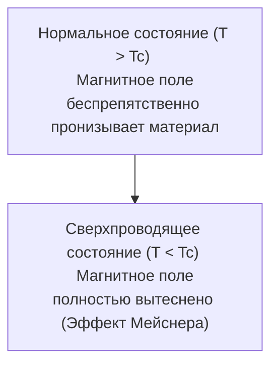

# Физика: Механизмы сверхпроводимости - От эффекта Мейснера до поездов на магнитной подушке и технологий будущего

Среди физических феноменов, способных преодолеть барьеры современных технологий, **сверхпроводимость** занимает исключительное место. Полное отсутствие электрического сопротивления и абсолютное выталкивание магнитных полей коренным образом преобразуют энергетические сети, высокоскоростной транспорт, медицинскую диагностику и [квантовые компьютеры следующего поколения](/p/technology-quantum-computer/).

В этой статье представлен детальный физический и научно-технический анализ сверхпроводимости: от исторического открытия в жидком гелии и электродинамики эффекта Мейснера до микроскопической теории БКШ с куперовскими парами, высокотемпературных купратов, промышленных применений (Maglev, МРТ, ITER) и поиска сверхпроводимости при комнатной температуре.

## 1. Что такое сверхпроводимость? История эпохального открытия

Сверхпроводимость представляет собой макроскопическое квантовое состояние определенных металлов, сплавов и керамических соединений, возникающее при охлаждении ниже характерной **критической температуры ($T_c$)**, при котором электрическое сопротивление постоянному току строго равно нулю.

В обычных металлических проводниках (таких как медь или золото) электроны проводимости сталкиваются с тепловыми колебаниями кристаллической решетки (фононами) и дефектами, рассеивая энергию в виде джоулева тепла. В сверхпроводящем состоянии ниже $T_c$ это сопротивление полностью исчезает ($R = 0$). Индуцированный в замкнутом сверхпроводящем кольце ток течет бесконечно долго без какого-либо внешнего источника энергии — это явление называется **незатухающим током**.

Этот феномен открыл в 1911 году нидерландский физик **Хейке Камерлинг-Оннес** в Лейденском университете. Научившись ожижать гелий при температуре 4,2 К ($-269^\circ\text{C}$), Оннес измерил сопротивление твердой ртути и обнаружил, что при 4,19 К оно мгновенно падает до абсолютного нуля. За это открытие Оннес был удостоен Нобелевской премии по физике в 1913 году.

## 2. Эффект Мейснера и идеальный диамагнетизм

Сверхпроводимость — это не просто идеальная электропроводность. В 1933 году немецкие физики **Вальтер Мейснер** и **Роберт Оксенфельд** открыли еще более глубокое фундаментальное свойство сверхпроводников: **идеальный диамагнетизм**, получивший название **эффекта Мейснера**.

Когда материал переходит в сверхпроводящее состояние в присутствии внешнего магнитного поля, он полностью выталкивает все силовые линии магнитного поля из своего объема. Магнитные линии огибают сверхпроводник снаружи.

```mermaid
flowchart TD
    A["Нормальное состояние (T > Tc) \n Магнитное поле беспрепятственно пронизывает материал"] --> B["Сверхпроводящее состояние (T < Tc) \n Магнитное поле полностью вытеснено (Эффект Мейснера)"]
```

Для математического описания этого явления братья Фриц и Хайнц Лондон в 1935 году вывели феноменологические **уравнения Лондонов**. Второе уравнение Лондонов напрямую связывает плотность сверхпроводящего тока $\mathbf{J}$ с магнитной индукцией $\mathbf{B}$:

$$ \nabla \times \mathbf{J} = -\frac{n_s e^2}{m} \mathbf{B} $$

Где:
- $\mathbf{J}$ — плотность сверхпроводящего тока.
- $n_s$ — концентрация сверхпроводящих носителей заряда.
- $e$ — элементарный заряд электрона.
- $m$ — масса электрона.
- $\mathbf{B}$ — вектор магнитной индукции.

В совокупности с уравнениями Максвелла это доказывает, что внешнее магнитное поле способно проникать лишь в тончайший приповерхностный слой сверхпроводника — на так называемую **лондоновскую глубину проникновения ($\lambda_L$)**:

$$ B(x) = B_0 e^{-x / \lambda_L} $$

В глубине сверхпроводника поле строго равно нулю ($\mathbf{B} = 0$). Если поместить постоянный магнит над охлажденным сверхпроводником, наведенные поверхностные экранирующие токи создадут равное по силе противоположное магнитное поле, обеспечивая поразительную **квантовую левитацию**.

## 3. Микроскопический механизм: Теория БКШ и куперовские пары

Почти полвека после открытия Оннеса природа сверхпроводимости оставалась главной загадкой физики. В 1957 году **Джон Бардин, Леон Купер и Джон Роберт Шриффер** создали микроскопическую **теорию БКШ** (Нобелевская премия по физике 1972 года).

Фундамент теории БКШ — образование **куперовских пар**. В вакууме электроны сильно отталкиваются из-за кулоновских сил. Однако при движении электрона сквозь кристаллическую решетку при сверхнизких температурах отрицательный заряд электрона притягивает положительные ионы кристаллической решетки, создавая локальное упругое искажение (виртуальный фонон). До того как решетка вернется в исходное состояние, этот положительный заряд притягивает второй электрон с противоположным спином и импульсом.

Благодаря этому фононному взаимодействию между электронами возникает эффективное притяжение:

$$ (\mathbf{k} \uparrow, -\mathbf{k} \downarrow) $$

Хотя изолированные электроны являются фермионами со спином $1/2$, объединяясь в куперовскую пару, они приобретают целый спин 0 и ведут себя подобно бозонам. Ниже $T_c$ миллиарды куперовских пар конденсируются в единое макроскопическое квантовое состояние (подобно конденсату Бозе-Эйнштейна). Все пары движутся синхронно под единой макроскопической волновой функцией. Чтобы разрушить это состояние, требуется затратить энергию, превышающую энергетическую щель ($\Delta$), поэтому тепловые колебания решетки и дефекты не могут рассеять электроны, что порождает нулевое электрическое сопротивление.

## 4. Высокотемпературная сверхпроводимость (ВТСП)

Традиционная теория БКШ предсказывала, что фононная сверхпроводимость не может существовать при температурах выше 30–40 К (предел Макмиллана / БКШ-предел).

Однако в 1986 году **Йоханнес Георг Беднорц** и **Карл Александр Мюллер** из исследовательской лаборатории IBM в Цюрихе открыли сверхпроводимость при 35 К в керамическом оксиде лантана-бария-меди (купрате), разрушив теоретический предел и получив Нобелевскую премию уже в 1987 году.

В 1987 году был синтезирован **YBCO (оксид иттрия-бария-меди)** с критической температурой 93 К. Это превысило **точку кипения жидкого азота (77 К / $-196^\circ\text{C}$)**. Жидкий азот дешев, безопасен и гораздо доступнее дефицитного жидкого гелия, что открыло дорогу для масштабного практического внедрения сверхпроводников.

Механизм высокотемпературных купратов выходит далеко за рамки классической теории БКШ: сильные электронные корреляции и антиферромагнитные спиновые флуктуации играют решающую роль, оставаясь одной из величайших нерешенных задач физики конденсированного состояния.

## 5. Практические применения, меняющие мир

Нулевое сопротивление и возможность создания гигантских магнитных полей без выделения тепла сделали сверхпроводники незаменимыми:

### 5.1 Поезда на магнитной подушке (SCMaglev)
Японская система **SCMaglev** использует бортовые сверхпроводящие магниты из ниобий-титана (NbTi), охлаждаемые жидким гелием. Незатухающие токи создают магнитные поля в несколько тесла, взаимодействующие с путевыми катушками. Поезд парит на высоте 10 см над полотном и развивает скорость свыше **500 км/ч (рекорд: 603 км/h)** в условиях полного отсутствия трения колес о рельсы.

### 5.2 Магнитно-резонансная томография (МРТ)
Медицинские томографы требуют мощного и сверхстабильного магнитного поля от 1,5 до 3,0 Тесла (и до 7 Тл в научных центрах). Сверхпроводящие соленоиды поддерживают это колоссальное поле годами без энергопотребления и нагрева, гарантируя непревзойденную детализацию срезов человеческих органов.

### 5.3 Ускорители частиц и термоядерные реакторы
В CERN **Большой адронный коллайдер (LHC)** использует более 1200 сверхпроводящих дипольных магнитов на 27-километровом кольце для разгона протонов до 99,999999% скорости света. В термоядерном реакторе **ITER** гигантские сверхпроводящие катушки из ниобий-олова ($Nb_3Sn$) создают 13-тесловую магнитную ловушку для удержания плазмы, нагретой до 100 миллионов градусов Цельсия.

### 5.4 Сверхпроводящие квантовые процессоры
Ведущие квантовые компьютеры (Google Sycamore, IBM Quantum) построены на базе сверхпроводящих микроволновых схем. Используя **джозефсоновские переходы** (наноразмерные диэлектрические барьеры между сверхпроводниками), инженеры создают искусственные квантовые биты (кубиты), управляемые микроволновыми импульсами при температурах в милликельвины.

## 6. Мечта науки: Комнатная сверхпроводимость

Главный сдерживающий фактор развития сверхпроводящих технологий — стоимость и громоздкость криогенного охлаждения.

Открытие **сверхпроводника при комнатной температуре и нормальном давлении ($T_c > 300\text{ K}$, $P = 1\text{ атм}$)** вызовет глобальную промышленную революцию:
- **Электросети без потерь**: Полная ликвидация потерь при транспортировке электроэнергии (сейчас это 5–10% всей вырабатываемой мощности на планете).
- **Электроника без нагрева**: Процессоры, свободные от термического троттлинга, способные работать на терагерцовых частотах.
- **Сверхкомпактные накопители энергии (SMES)**: Магнитные накопители гигаватт-часов энергии с КПД, стремящимся к 100%.

В последние годы в экспериментах с алмазными наковальнями при давлениях в миллионы атмосфер в гидридах ($H_3S$, $LaH_{10}$) была зафиксирована сверхпроводимость вплоть до 250 К ($-23^\circ\text{C}$). Задача ученых сегодня — найти материал, сохраняющий подобные свойства при нормальном атмосферном давлении.

## Заключение: Квантовое чудо в макромире

Сверхпроводимость — один из редчайших примеров, когда законы квантовой механики проявляются прямо перед нашими глазами в макроскопическом масштабе. От застывшей капли ртути Оннеса в 1911 году до термоядерных реакторов и квантовых чипов XXI века сверхпроводимость продолжает служить двигателем технологического прогресса человечества.
