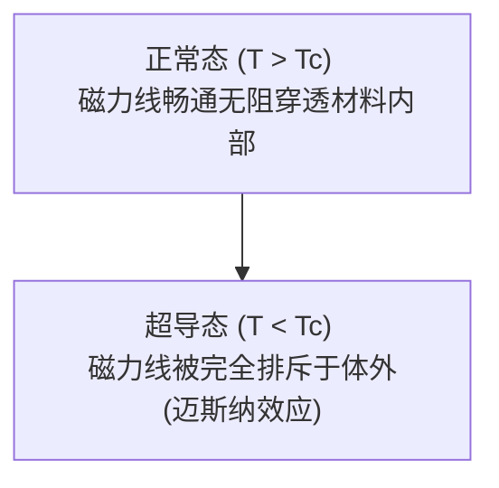

# 物理学：超导的底层机制 - 从迈斯纳效应到磁悬浮与未来科技

在足以颠覆现代工业与信息技术极限的物理学前沿中，很少有哪种现象能像 **超导（Superconductivity）** 那样充满科幻色彩与变革力量。完全零电阻导电与完全抗磁性（排斥一切内部磁力线）的神奇物理特质，正在全面重塑人类的能源传输、轨道交通、尖端医学成像以及[下一代量子计算机](/p/technology-quantum-computer/)的计算范式。

本文将从专业物理学与工程应用视角，全方位拆解超导现象：从昂内斯液氦实验的传奇发现、迈斯纳效应与伦敦方程的唯象描述，到 BCS 理论与库珀对的微观量子凝聚、高温铜氧化物超导体的未解之谜，再到超导磁悬浮列车、核聚变托卡马克托聚腔以及室温超导的终极追求。

## 1. 什么是超导？一段波澜壮阔的实验物理传奇

超导是指特定金属、合金或陶瓷化合物在冷却至某一 **临界温度（$T_c$）** 以下时，直流电阻瞬间完全归零的宏观量子物理现象。

在普通导体（如铜、铝或银）中，自由电子在电场驱动下流动时，会不可避免地与晶格的热振动（声子）以及材料杂质发生碰撞散射，将电能转化为焦耳热耗散。而在超导态下，电子流动时的散射阻力彻底消失（$R = 0$）。这意味着，如果在一个闭合的超导环中感应出电流，即便切断一切外部电源，环内的电流也将永远流转不息，这被称为 **持久电流（Persistent Current）** 。

这一惊人现象由荷兰莱顿大学物理学家 **海克·卡末林·昂内斯（Heike Kamerlingh Onnes）** 于 1911 年首次发现。昂内斯利用自己发明的液氦低温制冷技术（将温度降低至 4.2 K，即约零下 269 摄氏度），在测量固态汞的电阻时，惊讶地发现其电阻在 4.19 K 处发生断崖式暴跌至仪器无法检测的零值。昂内斯凭借这一里程碑突破荣获 1913 年诺贝尔物理学奖。

## 2. 迈斯纳效应与完全抗磁性

超导不仅仅是“零电阻理想导体”，它拥有更为深刻的独立电磁属性。1933 年，德国物理学家 **瓦尔特·迈斯纳（Walther Meissner）** 与 **罗伯特·奥克森费尔德（Robert Ochsenfeld）** 发现了超导体的另一个核心标志——**迈斯纳效应（Meissner effect）** ，即 **完全抗磁性** 。

当外加磁场存在时，只要物体温度降至临界温度以下转变为超导态，物体内部的磁感应强度将被完全排斥到体外，磁力线只能贴着超导体表面绕行。

为了对迈斯纳效应进行数学唯象描述，弗里茨·伦敦与海因茨·伦敦兄弟于 1935 年提出了著名的 **伦敦方程（London equations）** 。其中第二伦敦方程给出了超导电流密度 $\mathbf{J}$ 与磁感应强度 $\mathbf{B}$ 的本质约束：

$$ \nabla \times \mathbf{J} = -\frac{n_s e^2}{m} \mathbf{B} $$

式中：
- $\mathbf{J}$ 为超导电流密度；
- $n_s$ 为超导载流子（超导电子）的数密度；
- $e$ 为基本电荷；
- $m$ 为电子质量；
- $\mathbf{B}$ 为磁通量密度。

结合麦克斯韦方程组可以严格证明，外加磁场只能渗入超导体表面极浅的一层（即 **伦敦穿透深度 $\lambda_L$** ，通常仅为数十至数百纳米），在超导体深处，磁场呈指数级衰减至严格为零：

$$ B(x) = B_0 e^{-x / \lambda_L} $$

正是因为完全抗磁性的存在，当把一块强磁铁置于超导体上方时，超导体表面会感应出完美的屏蔽超导电流，产生大小相等、方向相反的强磁场排斥力，使磁铁稳稳漂浮于半空之中，形成震撼人心的 **量子磁悬浮** 。

## 3. 超导的微观成因：BCS 理论与库珀对

在昂内斯发现超导后的近半个世纪里，超导的微观量子本质始终是凝聚态物理学界的最大悬案。直到 1957 年， **约翰·巴丁（John Bardeen）** 、 **利昂·库珀（Leon Cooper）** 和 **约翰·罗伯特·施里弗（John Robert Schrieffer）** 共同建立了微观量子理论——**BCS 理论** ，三人因此荣获 1972 年诺贝尔物理学奖。

BCS 理论的核心支柱是 **库珀对（Cooper pairs）** 的凝聚。在真空中，同带负电的两个电子会产生极强的库仑静电排斥。然而在低温晶格中，带负电的电子穿过正离子晶格阵列时，会轻微吸引周围带正电的原子核，使晶格发生微小形变（诱发晶格振动量子——声子）。晶格形变瞬间在局部形成微弱的正电荷富集区，在晶格弹性恢复之前，这个正电荷区会迅速吸引另一个自旋与动量相反的电子。

通过晶格声子媒介的间接吸引势，两个电子克服了库仑排斥力，结成了稳定的束缚态对：

$$ (\mathbf{k} \uparrow, -\mathbf{k} \downarrow) $$

单个电子是自旋为 $1/2$ 的费米子，必须遵循泡利不相容原理；但两个电子结合成的库珀对，其总自旋为整数 0，表现出类似玻色子的性质。在临界温度以下，数以亿计的库珀对凝聚到一个宏观单一量子基态（类似于玻色-爱因斯坦凝聚）。所有电子对以高度同步的单一宏观波函数向前流动。破坏这种协同运动需要跃迁跨越一个有限大小的能隙（$\Delta$），因此只要热扰动能小于能隙，晶格热振动和杂质就完全无法散射库珀对，零电阻导电由此产生。

## 4. 高温超导体（HTS）的突破与物理新迷思

经典 BCS 理论曾给出一个令人沮丧的理论预言：基于常规声子媒介配对的超导相变存在约 30 K 到 40 K 的物理上限（即著名的麦克米兰极限 / BCS 极限）。

然而在 1986 年，IBM 苏黎世实验室的 **约翰内斯·格奥尔格·贝德诺尔茨（Johannes Georg Bednorz）** 与 **卡尔·亚历山大·缪勒（Karl Alexander Müller）** 在镧钡铜氧（La-Ba-Cu-O）陶瓷材料中测得了 35 K 的超导相变，彻底打破了麦克米兰极限，两人次年即斩获诺贝尔物理学奖。

紧接着在 1987 年，科学家合成了超导转变温度高达 93 K 的 **钇钡铜氧（YBCO）** 材料，一举跨越了 **液氮沸点（77 K / 零下 196 摄氏度）** 。液氮廉价易得且无毒安全，相比极端昂贵且稀缺的液氦，高温超导体的出现为超导技术走向规模化工业实用化打开了突破口。

然而，铜氧化物高温超导机制无法被常规单声子交换的 BCS 理论解释。强关联电子相互作用、反铁磁自旋涨落等被认为深度介入了配对机制，这成为凝聚态物理学界至今未被彻底攻克的“珠穆朗玛峰”。

## 5. 改变人类文明的工业应用

完全零电阻与极高电流密度下产生的超强磁场，使超导技术成为驱动尖端工业的基石：

### 5.1 超导磁悬浮列车（SCMaglev）
日本中央新干线采用的“超导磁悬浮（SCMaglev）”系统是其代表杰作。列车车载超导磁体通入闭环持久电流，产生数特斯拉的稳定强磁场，与地面铺设的 8 字形悬浮线圈相互作用，将整列列车悬浮抬升约 10 厘米，并在非接触状态下以超过 **500 km/h（试验最高纪录 603 km/h）** 的时速呼啸飞驰，杜绝了轮轨摩擦损耗与机械噪音。

### 5.2 医疗磁共振成像（MRI）
医院诊断核心的核磁共振检查（MRI）必须依靠超导电磁线圈。为了呈现人体软组织毫米级的超高精细切片断层影像，需要 1.5 到 3.0 特斯拉（科研级甚至高达 7T）的高均匀度超强稳恒磁场。超导线圈能在零发热损耗的前提下常年维持这一庞大磁场。

### 5.3 大型粒子对撞机与可控核聚变托卡马克
欧洲核子研究中心（CERN）的 **大型强子对撞机（LHC）** 在长达 27 公里的地下环形隧道中部署了上千台铌钛（NbTi）超导偶极磁体，将质子加速至光速的 99.999999% 以揭示物质本源。而在被誉为终极清洁能源的国际热核聚变实验堆（ **ITER** ）中，十余米高的巨大铌三锡（$Nb_3Sn$）超导环向场线圈承担着产生 13 特斯拉强磁约束笼、将 1 亿度核聚变等离子体凭空“悬空囚禁”的神圣使命。

### 5.4 超导量子计算机芯片
当前全球最顶尖的量子计算机（如 Google Sycamore、IBM Eagle 等）均构建于超导微波电路上。科学家利用超导薄膜中的 **约瑟夫森结（Josephson Junction）** 构建非线性人工原子，实现对超导量子比特（qubit）能级的精确微波相干操控，在特定组合优化算法上已展示出超越传统超级计算机亿万倍的“量子优越性”。

## 6. 终极科学圣杯：室温超导的求索之路

制约当前超导技术全面走进千家万户的唯一桎梏，是 **制冷维持成本** 。

如果人类能够合成出在 **常温常压（$T_c > 300\text{ K}$, $P = 1\text{ atm}$）** 下保持超导态的物质，将直接引爆新一轮工业革命：
- **全球零损耗超级电网** ：终结长距离高压输电中 5%~10% 的电能损耗；
- **无发热超高主频芯片** ：摆脱硅基芯片散热瓶颈，算力几何级数提升；
- **超小型无损储能装置（SMES）** ：以极高充放电效率储存吉瓦时级清洁电力。

近年来，物理学家利用金刚石对顶砧在数百万大气压的极端超高压下，于富氢氢化物（如 $H_3S$、$LaH_{10}$）中成功将临界温度推升至接近 250 K（零下 23 度）。寻找能够在常压下亚稳保存的室温超导体，已成为当今材料科学与物理界竞争最激烈的圣杯。

## 结语：宏观世界的量子神迹

超导现象是微观量子相干性直接投射到人类宏观世界的罕见物理奇观。从 1911 年昂内斯在液氦中注视那一滴液态水银电阻归零开始，人类便打开了通向零阻抗新世界的大门。

无论是贴地飞行的磁悬浮列车、洞察生命的 MRI、囚禁恒星之火的核聚变反应堆，还是探索宇宙终极法则的量子处理器，超导技术正在一步步重塑文明的边界。随着凝聚态理论的不断突破，室温超导的曙光终将照亮人类科技更辉煌的未来。
