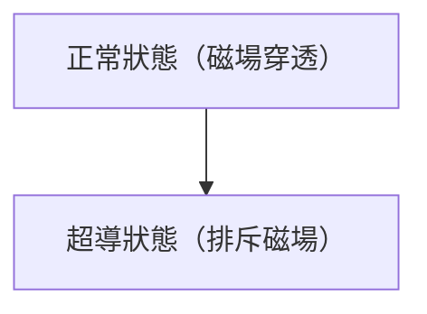

# 物理學: 超導的機制

超導電性是電阻變為零的現象。

## 邁斯納效應

## 倫敦方程式
$$ \nabla \times \mathbf{J} = -\frac{n_s e^2}{m} \mathbf{B} $$

## 附加技術驗證部分 1

本節將深入探討進一步的技術細節與案例研究。我們將評估各種條件下的效能，並探討與其他系統整合時的挑戰與解決方案。同時也會考察未來的展望與限制。

