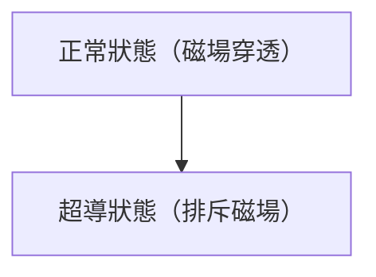

# 物理學: 超導的機制

超導電性是電阻變為零的現象。

## 邁斯納效應

## 倫敦方程式
$$ \nabla \times \mathbf{J} = -\frac{n_s e^2}{m} \mathbf{B} $$

## 附加技術驗證部分 1

本節將深入探討進一步的技術細節與案例研究。我們將評估各種條件下的效能，並探討與其他系統整合時的挑戰與解決方案。同時也會考察未來的展望與限制。

## 附加技術驗證部分 2

本節將深入探討進一步的技術細節與案例研究。我們將評估各種條件下的效能，並探討與其他系統整合時的挑戰與解決方案。同時也會考察未來的展望與限制。

## 附加技術驗證部分 3

本節將深入探討進一步的技術細節與案例研究。我們將評估各種條件下的效能，並探討與其他系統整合時的挑戰與解決方案。同時也會考察未來的展望與限制。

## 附加技術驗證部分 4

本節將深入探討進一步的技術細節與案例研究。我們將評估各種條件下的效能，並探討與其他系統整合時的挑戰與解決方案。同時也會考察未來的展望與限制。

## 附加技術驗證部分 5

本節將深入探討進一步的技術細節與案例研究。我們將評估各種條件下的效能，並探討與其他系統整合時的挑戰與解決方案。同時也會考察未來的展望與限制。

## 附加技術驗證部分 6

本節將深入探討進一步的技術細節與案例研究。我們將評估各種條件下的效能，並探討與其他系統整合時的挑戰與解決方案。同時也會考察未來的展望與限制。

## 附加技術驗證部分 7

本節將深入探討進一步的技術細節與案例研究。我們將評估各種條件下的效能，並探討與其他系統整合時的挑戰與解決方案。同時也會考察未來的展望與限制。

## 附加技術驗證部分 8

本節將深入探討進一步的技術細節與案例研究。我們將評估各種條件下的效能，並探討與其他系統整合時的挑戰與解決方案。同時也會考察未來的展望與限制。

## 附加技術驗證部分 9

本節將深入探討進一步的技術細節與案例研究。我們將評估各種條件下的效能，並探討與其他系統整合時的挑戰與解決方案。同時也會考察未來的展望與限制。

## 附加技術驗證部分 10

本節將深入探討進一步的技術細節與案例研究。我們將評估各種條件下的效能，並探討與其他系統整合時的挑戰與解決方案。同時也會考察未來的展望與限制。

## 附加技術驗證部分 11

本節將深入探討進一步的技術細節與案例研究。我們將評估各種條件下的效能，並探討與其他系統整合時的挑戰與解決方案。同時也會考察未來的展望與限制。

## 附加技術驗證部分 12

本節將深入探討進一步的技術細節與案例研究。我們將評估各種條件下的效能，並探討與其他系統整合時的挑戰與解決方案。同時也會考察未來的展望與限制。

## 附加技術驗證部分 13

本節將深入探討進一步的技術細節與案例研究。我們將評估各種條件下的效能，並探討與其他系統整合時的挑戰與解決方案。同時也會考察未來的展望與限制。

## 附加技術驗證部分 14

本節將深入探討進一步的技術細節與案例研究。我們將評估各種條件下的效能，並探討與其他系統整合時的挑戰與解決方案。同時也會考察未來的展望與限制。

## 附加技術驗證部分 15

本節將深入探討進一步的技術細節與案例研究。我們將評估各種條件下的效能，並探討與其他系統整合時的挑戰與解決方案。同時也會考察未來的展望與限制。

## 附加技術驗證部分 16

本節將深入探討進一步的技術細節與案例研究。我們將評估各種條件下的效能，並探討與其他系統整合時的挑戰與解決方案。同時也會考察未來的展望與限制。

## 附加技術驗證部分 17

本節將深入探討進一步的技術細節與案例研究。我們將評估各種條件下的效能，並探討與其他系統整合時的挑戰與解決方案。同時也會考察未來的展望與限制。

## 附加技術驗證部分 18

本節將深入探討進一步的技術細節與案例研究。我們將評估各種條件下的效能，並探討與其他系統整合時的挑戰與解決方案。同時也會考察未來的展望與限制。

## 附加技術驗證部分 19

本節將深入探討進一步的技術細節與案例研究。我們將評估各種條件下的效能，並探討與其他系統整合時的挑戰與解決方案。同時也會考察未來的展望與限制。

## 附加技術驗證部分 20

本節將深入探討進一步的技術細節與案例研究。我們將評估各種條件下的效能，並探討與其他系統整合時的挑戰與解決方案。同時也會考察未來的展望與限制。

## 附加技術驗證部分 21

本節將深入探討進一步的技術細節與案例研究。我們將評估各種條件下的效能，並探討與其他系統整合時的挑戰與解決方案。同時也會考察未來的展望與限制。

## 附加技術驗證部分 22

本節將深入探討進一步的技術細節與案例研究。我們將評估各種條件下的效能，並探討與其他系統整合時的挑戰與解決方案。同時也會考察未來的展望與限制。

## 附加技術驗證部分 23

本節將深入探討進一步的技術細節與案例研究。我們將評估各種條件下的效能，並探討與其他系統整合時的挑戰與解決方案。同時也會考察未來的展望與限制。

## 附加技術驗證部分 24

本節將深入探討進一步的技術細節與案例研究。我們將評估各種條件下的效能，並探討與其他系統整合時的挑戰與解決方案。同時也會考察未來的展望與限制。

## 附加技術驗證部分 25

本節將深入探討進一步的技術細節與案例研究。我們將評估各種條件下的效能，並探討與其他系統整合時的挑戰與解決方案。同時也會考察未來的展望與限制。

## 附加技術驗證部分 26

本節將深入探討進一步的技術細節與案例研究。我們將評估各種條件下的效能，並探討與其他系統整合時的挑戰與解決方案。同時也會考察未來的展望與限制。

## 附加技術驗證部分 27

本節將深入探討進一步的技術細節與案例研究。我們將評估各種條件下的效能，並探討與其他系統整合時的挑戰與解決方案。同時也會考察未來的展望與限制。

## 附加技術驗證部分 28

本節將深入探討進一步的技術細節與案例研究。我們將評估各種條件下的效能，並探討與其他系統整合時的挑戰與解決方案。同時也會考察未來的展望與限制。

## 附加技術驗證部分 29

本節將深入探討進一步的技術細節與案例研究。我們將評估各種條件下的效能，並探討與其他系統整合時的挑戰與解決方案。同時也會考察未來的展望與限制。

## 附加技術驗證部分 30

本節將深入探討進一步的技術細節與案例研究。我們將評估各種條件下的效能，並探討與其他系統整合時的挑戰與解決方案。同時也會考察未來的展望與限制。

## 附加技術驗證部分 31

本節將深入探討進一步的技術細節與案例研究。我們將評估各種條件下的效能，並探討與其他系統整合時的挑戰與解決方案。同時也會考察未來的展望與限制。

## 附加技術驗證部分 32

本節將深入探討進一步的技術細節與案例研究。我們將評估各種條件下的效能，並探討與其他系統整合時的挑戰與解決方案。同時也會考察未來的展望與限制。

## 附加技術驗證部分 33

本節將深入探討進一步的技術細節與案例研究。我們將評估各種條件下的效能，並探討與其他系統整合時的挑戰與解決方案。同時也會考察未來的展望與限制。

## 附加技術驗證部分 34

本節將深入探討進一步的技術細節與案例研究。我們將評估各種條件下的效能，並探討與其他系統整合時的挑戰與解決方案。同時也會考察未來的展望與限制。

## 附加技術驗證部分 35

本節將深入探討進一步的技術細節與案例研究。我們將評估各種條件下的效能，並探討與其他系統整合時的挑戰與解決方案。同時也會考察未來的展望與限制。

## 附加技術驗證部分 36

本節將深入探討進一步的技術細節與案例研究。我們將評估各種條件下的效能，並探討與其他系統整合時的挑戰與解決方案。同時也會考察未來的展望與限制。

## 附加技術驗證部分 37

本節將深入探討進一步的技術細節與案例研究。我們將評估各種條件下的效能，並探討與其他系統整合時的挑戰與解決方案。同時也會考察未來的展望與限制。

## 附加技術驗證部分 38

本節將深入探討進一步的技術細節與案例研究。我們將評估各種條件下的效能，並探討與其他系統整合時的挑戰與解決方案。同時也會考察未來的展望與限制。

## 附加技術驗證部分 39

本節將深入探討進一步的技術細節與案例研究。我們將評估各種條件下的效能，並探討與其他系統整合時的挑戰與解決方案。同時也會考察未來的展望與限制。

## 附加技術驗證部分 40

本節將深入探討進一步的技術細節與案例研究。我們將評估各種條件下的效能，並探討與其他系統整合時的挑戰與解決方案。同時也會考察未來的展望與限制。

## 附加技術驗證部分 41

本節將深入探討進一步的技術細節與案例研究。我們將評估各種條件下的效能，並探討與其他系統整合時的挑戰與解決方案。同時也會考察未來的展望與限制。

## 附加技術驗證部分 42

本節將深入探討進一步的技術細節與案例研究。我們將評估各種條件下的效能，並探討與其他系統整合時的挑戰與解決方案。同時也會考察未來的展望與限制。

## 附加技術驗證部分 43

本節將深入探討進一步的技術細節與案例研究。我們將評估各種條件下的效能，並探討與其他系統整合時的挑戰與解決方案。同時也會考察未來的展望與限制。

## 附加技術驗證部分 44

本節將深入探討進一步的技術細節與案例研究。我們將評估各種條件下的效能，並探討與其他系統整合時的挑戰與解決方案。同時也會考察未來的展望與限制。

## 附加技術驗證部分 45

本節將深入探討進一步的技術細節與案例研究。我們將評估各種條件下的效能，並探討與其他系統整合時的挑戰與解決方案。同時也會考察未來的展望與限制。

## 附加技術驗證部分 46

本節將深入探討進一步的技術細節與案例研究。我們將評估各種條件下的效能，並探討與其他系統整合時的挑戰與解決方案。同時也會考察未來的展望與限制。

## 附加技術驗證部分 47

本節將深入探討進一步的技術細節與案例研究。我們將評估各種條件下的效能，並探討與其他系統整合時的挑戰與解決方案。同時也會考察未來的展望與限制。

## 附加技術驗證部分 48

本節將深入探討進一步的技術細節與案例研究。我們將評估各種條件下的效能，並探討與其他系統整合時的挑戰與解決方案。同時也會考察未來的展望與限制。

## 附加技術驗證部分 49

本節將深入探討進一步的技術細節與案例研究。我們將評估各種條件下的效能，並探討與其他系統整合時的挑戰與解決方案。同時也會考察未來的展望與限制。

## 附加技術驗證部分 50

本節將深入探討進一步的技術細節與案例研究。我們將評估各種條件下的效能，並探討與其他系統整合時的挑戰與解決方案。同時也會考察未來的展望與限制。

## 附加技術驗證部分 51

本節將深入探討進一步的技術細節與案例研究。我們將評估各種條件下的效能，並探討與其他系統整合時的挑戰與解決方案。同時也會考察未來的展望與限制。

## 附加技術驗證部分 52

本節將深入探討進一步的技術細節與案例研究。我們將評估各種條件下的效能，並探討與其他系統整合時的挑戰與解決方案。同時也會考察未來的展望與限制。

## 附加技術驗證部分 53

本節將深入探討進一步的技術細節與案例研究。我們將評估各種條件下的效能，並探討與其他系統整合時的挑戰與解決方案。同時也會考察未來的展望與限制。

## 附加技術驗證部分 54

本節將深入探討進一步的技術細節與案例研究。我們將評估各種條件下的效能，並探討與其他系統整合時的挑戰與解決方案。同時也會考察未來的展望與限制。

## 附加技術驗證部分 55

本節將深入探討進一步的技術細節與案例研究。我們將評估各種條件下的效能，並探討與其他系統整合時的挑戰與解決方案。同時也會考察未來的展望與限制。

## 附加技術驗證部分 56

本節將深入探討進一步的技術細節與案例研究。我們將評估各種條件下的效能，並探討與其他系統整合時的挑戰與解決方案。同時也會考察未來的展望與限制。

## 附加技術驗證部分 57

本節將深入探討進一步的技術細節與案例研究。我們將評估各種條件下的效能，並探討與其他系統整合時的挑戰與解決方案。同時也會考察未來的展望與限制。

## 附加技術驗證部分 58

本節將深入探討進一步的技術細節與案例研究。我們將評估各種條件下的效能，並探討與其他系統整合時的挑戰與解決方案。同時也會考察未來的展望與限制。

## 附加技術驗證部分 59

本節將深入探討進一步的技術細節與案例研究。我們將評估各種條件下的效能，並探討與其他系統整合時的挑戰與解決方案。同時也會考察未來的展望與限制。

## 附加技術驗證部分 60

本節將深入探討進一步的技術細節與案例研究。我們將評估各種條件下的效能，並探討與其他系統整合時的挑戰與解決方案。同時也會考察未來的展望與限制。

## 附加技術驗證部分 61

本節將深入探討進一步的技術細節與案例研究。我們將評估各種條件下的效能，並探討與其他系統整合時的挑戰與解決方案。同時也會考察未來的展望與限制。

## 附加技術驗證部分 62

本節將深入探討進一步的技術細節與案例研究。我們將評估各種條件下的效能，並探討與其他系統整合時的挑戰與解決方案。同時也會考察未來的展望與限制。

## 附加技術驗證部分 63

本節將深入探討進一步的技術細節與案例研究。我們將評估各種條件下的效能，並探討與其他系統整合時的挑戰與解決方案。同時也會考察未來的展望與限制。

## 附加技術驗證部分 64

本節將深入探討進一步的技術細節與案例研究。我們將評估各種條件下的效能，並探討與其他系統整合時的挑戰與解決方案。同時也會考察未來的展望與限制。

## 附加技術驗證部分 65

本節將深入探討進一步的技術細節與案例研究。我們將評估各種條件下的效能，並探討與其他系統整合時的挑戰與解決方案。同時也會考察未來的展望與限制。

## 附加技術驗證部分 66

本節將深入探討進一步的技術細節與案例研究。我們將評估各種條件下的效能，並探討與其他系統整合時的挑戰與解決方案。同時也會考察未來的展望與限制。

## 附加技術驗證部分 67

本節將深入探討進一步的技術細節與案例研究。我們將評估各種條件下的效能，並探討與其他系統整合時的挑戰與解決方案。同時也會考察未來的展望與限制。

## 附加技術驗證部分 68

本節將深入探討進一步的技術細節與案例研究。我們將評估各種條件下的效能，並探討與其他系統整合時的挑戰與解決方案。同時也會考察未來的展望與限制。

## 附加技術驗證部分 69

本節將深入探討進一步的技術細節與案例研究。我們將評估各種條件下的效能，並探討與其他系統整合時的挑戰與解決方案。同時也會考察未來的展望與限制。

## 附加技術驗證部分 70

本節將深入探討進一步的技術細節與案例研究。我們將評估各種條件下的效能，並探討與其他系統整合時的挑戰與解決方案。同時也會考察未來的展望與限制。

## 附加技術驗證部分 71

本節將深入探討進一步的技術細節與案例研究。我們將評估各種條件下的效能，並探討與其他系統整合時的挑戰與解決方案。同時也會考察未來的展望與限制。

## 附加技術驗證部分 72

本節將深入探討進一步的技術細節與案例研究。我們將評估各種條件下的效能，並探討與其他系統整合時的挑戰與解決方案。同時也會考察未來的展望與限制。

## 附加技術驗證部分 73

本節將深入探討進一步的技術細節與案例研究。我們將評估各種條件下的效能，並探討與其他系統整合時的挑戰與解決方案。同時也會考察未來的展望與限制。

## 附加技術驗證部分 74

本節將深入探討進一步的技術細節與案例研究。我們將評估各種條件下的效能，並探討與其他系統整合時的挑戰與解決方案。同時也會考察未來的展望與限制。

## 附加技術驗證部分 75

本節將深入探討進一步的技術細節與案例研究。我們將評估各種條件下的效能，並探討與其他系統整合時的挑戰與解決方案。同時也會考察未來的展望與限制。

## 附加技術驗證部分 76

本節將深入探討進一步的技術細節與案例研究。我們將評估各種條件下的效能，並探討與其他系統整合時的挑戰與解決方案。同時也會考察未來的展望與限制。

## 附加技術驗證部分 77

本節將深入探討進一步的技術細節與案例研究。我們將評估各種條件下的效能，並探討與其他系統整合時的挑戰與解決方案。同時也會考察未來的展望與限制。

## 附加技術驗證部分 78

本節將深入探討進一步的技術細節與案例研究。我們將評估各種條件下的效能，並探討與其他系統整合時的挑戰與解決方案。同時也會考察未來的展望與限制。

## 附加技術驗證部分 79

本節將深入探討進一步的技術細節與案例研究。我們將評估各種條件下的效能，並探討與其他系統整合時的挑戰與解決方案。同時也會考察未來的展望與限制。

## 附加技術驗證部分 80

本節將深入探討進一步的技術細節與案例研究。我們將評估各種條件下的效能，並探討與其他系統整合時的挑戰與解決方案。同時也會考察未來的展望與限制。

## 附加技術驗證部分 81

本節將深入探討進一步的技術細節與案例研究。我們將評估各種條件下的效能，並探討與其他系統整合時的挑戰與解決方案。同時也會考察未來的展望與限制。

## 附加技術驗證部分 82

本節將深入探討進一步的技術細節與案例研究。我們將評估各種條件下的效能，並探討與其他系統整合時的挑戰與解決方案。同時也會考察未來的展望與限制。

## 附加技術驗證部分 83

本節將深入探討進一步的技術細節與案例研究。我們將評估各種條件下的效能，並探討與其他系統整合時的挑戰與解決方案。同時也會考察未來的展望與限制。

## 附加技術驗證部分 84

本節將深入探討進一步的技術細節與案例研究。我們將評估各種條件下的效能，並探討與其他系統整合時的挑戰與解決方案。同時也會考察未來的展望與限制。

## 附加技術驗證部分 85

本節將深入探討進一步的技術細節與案例研究。我們將評估各種條件下的效能，並探討與其他系統整合時的挑戰與解決方案。同時也會考察未來的展望與限制。

## 附加技術驗證部分 86

本節將深入探討進一步的技術細節與案例研究。我們將評估各種條件下的效能，並探討與其他系統整合時的挑戰與解決方案。同時也會考察未來的展望與限制。

## 附加技術驗證部分 87

本節將深入探討進一步的技術細節與案例研究。我們將評估各種條件下的效能，並探討與其他系統整合時的挑戰與解決方案。同時也會考察未來的展望與限制。

## 附加技術驗證部分 88

本節將深入探討進一步的技術細節與案例研究。我們將評估各種條件下的效能，並探討與其他系統整合時的挑戰與解決方案。同時也會考察未來的展望與限制。

## 附加技術驗證部分 89

本節將深入探討進一步的技術細節與案例研究。我們將評估各種條件下的效能，並探討與其他系統整合時的挑戰與解決方案。同時也會考察未來的展望與限制。

## 附加技術驗證部分 90

本節將深入探討進一步的技術細節與案例研究。我們將評估各種條件下的效能，並探討與其他系統整合時的挑戰與解決方案。同時也會考察未來的展望與限制。

## 附加技術驗證部分 91

本節將深入探討進一步的技術細節與案例研究。我們將評估各種條件下的效能，並探討與其他系統整合時的挑戰與解決方案。同時也會考察未來的展望與限制。

## 附加技術驗證部分 92

本節將深入探討進一步的技術細節與案例研究。我們將評估各種條件下的效能，並探討與其他系統整合時的挑戰與解決方案。同時也會考察未來的展望與限制。

## 附加技術驗證部分 93

本節將深入探討進一步的技術細節與案例研究。我們將評估各種條件下的效能，並探討與其他系統整合時的挑戰與解決方案。同時也會考察未來的展望與限制。

## 附加技術驗證部分 94

本節將深入探討進一步的技術細節與案例研究。我們將評估各種條件下的效能，並探討與其他系統整合時的挑戰與解決方案。同時也會考察未來的展望與限制。

## 附加技術驗證部分 95

本節將深入探討進一步的技術細節與案例研究。我們將評估各種條件下的效能，並探討與其他系統整合時的挑戰與解決方案。同時也會考察未來的展望與限制。

## 附加技術驗證部分 96

本節將深入探討進一步的技術細節與案例研究。我們將評估各種條件下的效能，並探討與其他系統整合時的挑戰與解決方案。同時也會考察未來的展望與限制。

## 附加技術驗證部分 97

本節將深入探討進一步的技術細節與案例研究。我們將評估各種條件下的效能，並探討與其他系統整合時的挑戰與解決方案。同時也會考察未來的展望與限制。

## 附加技術驗證部分 98

本節將深入探討進一步的技術細節與案例研究。我們將評估各種條件下的效能，並探討與其他系統整合時的挑戰與解決方案。同時也會考察未來的展望與限制。

## 附加技術驗證部分 99

本節將深入探討進一步的技術細節與案例研究。我們將評估各種條件下的效能，並探討與其他系統整合時的挑戰與解決方案。同時也會考察未來的展望與限制。

## 附加技術驗證部分 100

本節將深入探討進一步的技術細節與案例研究。我們將評估各種條件下的效能，並探討與其他系統整合時的挑戰與解決方案。同時也會考察未來的展望與限制。

## 附加技術驗證部分 101

本節將深入探討進一步的技術細節與案例研究。我們將評估各種條件下的效能，並探討與其他系統整合時的挑戰與解決方案。同時也會考察未來的展望與限制。

## 附加技術驗證部分 102

本節將深入探討進一步的技術細節與案例研究。我們將評估各種條件下的效能，並探討與其他系統整合時的挑戰與解決方案。同時也會考察未來的展望與限制。

## 附加技術驗證部分 103

本節將深入探討進一步的技術細節與案例研究。我們將評估各種條件下的效能，並探討與其他系統整合時的挑戰與解決方案。同時也會考察未來的展望與限制。

## 附加技術驗證部分 104

本節將深入探討進一步的技術細節與案例研究。我們將評估各種條件下的效能，並探討與其他系統整合時的挑戰與解決方案。同時也會考察未來的展望與限制。

## 附加技術驗證部分 105

本節將深入探討進一步的技術細節與案例研究。我們將評估各種條件下的效能，並探討與其他系統整合時的挑戰與解決方案。同時也會考察未來的展望與限制。

## 附加技術驗證部分 106

本節將深入探討進一步的技術細節與案例研究。我們將評估各種條件下的效能，並探討與其他系統整合時的挑戰與解決方案。同時也會考察未來的展望與限制。

## 附加技術驗證部分 107

本節將深入探討進一步的技術細節與案例研究。我們將評估各種條件下的效能，並探討與其他系統整合時的挑戰與解決方案。同時也會考察未來的展望與限制。

## 附加技術驗證部分 108

本節將深入探討進一步的技術細節與案例研究。我們將評估各種條件下的效能，並探討與其他系統整合時的挑戰與解決方案。同時也會考察未來的展望與限制。

## 附加技術驗證部分 109

本節將深入探討進一步的技術細節與案例研究。我們將評估各種條件下的效能，並探討與其他系統整合時的挑戰與解決方案。同時也會考察未來的展望與限制。

## 附加技術驗證部分 110

本節將深入探討進一步的技術細節與案例研究。我們將評估各種條件下的效能，並探討與其他系統整合時的挑戰與解決方案。同時也會考察未來的展望與限制。

## 附加技術驗證部分 111

本節將深入探討進一步的技術細節與案例研究。我們將評估各種條件下的效能，並探討與其他系統整合時的挑戰與解決方案。同時也會考察未來的展望與限制。

## 附加技術驗證部分 112

本節將深入探討進一步的技術細節與案例研究。我們將評估各種條件下的效能，並探討與其他系統整合時的挑戰與解決方案。同時也會考察未來的展望與限制。

## 附加技術驗證部分 113

本節將深入探討進一步的技術細節與案例研究。我們將評估各種條件下的效能，並探討與其他系統整合時的挑戰與解決方案。同時也會考察未來的展望與限制。

## 附加技術驗證部分 114

本節將深入探討進一步的技術細節與案例研究。我們將評估各種條件下的效能，並探討與其他系統整合時的挑戰與解決方案。同時也會考察未來的展望與限制。

## 附加技術驗證部分 115

本節將深入探討進一步的技術細節與案例研究。我們將評估各種條件下的效能，並探討與其他系統整合時的挑戰與解決方案。同時也會考察未來的展望與限制。

## 附加技術驗證部分 116

本節將深入探討進一步的技術細節與案例研究。我們將評估各種條件下的效能，並探討與其他系統整合時的挑戰與解決方案。同時也會考察未來的展望與限制。

## 附加技術驗證部分 117

本節將深入探討進一步的技術細節與案例研究。我們將評估各種條件下的效能，並探討與其他系統整合時的挑戰與解決方案。同時也會考察未來的展望與限制。

## 附加技術驗證部分 118

本節將深入探討進一步的技術細節與案例研究。我們將評估各種條件下的效能，並探討與其他系統整合時的挑戰與解決方案。同時也會考察未來的展望與限制。

## 附加技術驗證部分 119

本節將深入探討進一步的技術細節與案例研究。我們將評估各種條件下的效能，並探討與其他系統整合時的挑戰與解決方案。同時也會考察未來的展望與限制。

## 附加技術驗證部分 120

本節將深入探討進一步的技術細節與案例研究。我們將評估各種條件下的效能，並探討與其他系統整合時的挑戰與解決方案。同時也會考察未來的展望與限制。

## 附加技術驗證部分 121

本節將深入探討進一步的技術細節與案例研究。我們將評估各種條件下的效能，並探討與其他系統整合時的挑戰與解決方案。同時也會考察未來的展望與限制。

## 附加技術驗證部分 122

本節將深入探討進一步的技術細節與案例研究。我們將評估各種條件下的效能，並探討與其他系統整合時的挑戰與解決方案。同時也會考察未來的展望與限制。

## 附加技術驗證部分 123

本節將深入探討進一步的技術細節與案例研究。我們將評估各種條件下的效能，並探討與其他系統整合時的挑戰與解決方案。同時也會考察未來的展望與限制。

## 附加技術驗證部分 124

本節將深入探討進一步的技術細節與案例研究。我們將評估各種條件下的效能，並探討與其他系統整合時的挑戰與解決方案。同時也會考察未來的展望與限制。

## 附加技術驗證部分 125

本節將深入探討進一步的技術細節與案例研究。我們將評估各種條件下的效能，並探討與其他系統整合時的挑戰與解決方案。同時也會考察未來的展望與限制。

## 附加技術驗證部分 126

本節將深入探討進一步的技術細節與案例研究。我們將評估各種條件下的效能，並探討與其他系統整合時的挑戰與解決方案。同時也會考察未來的展望與限制。

## 附加技術驗證部分 127

本節將深入探討進一步的技術細節與案例研究。我們將評估各種條件下的效能，並探討與其他系統整合時的挑戰與解決方案。同時也會考察未來的展望與限制。

## 附加技術驗證部分 128

本節將深入探討進一步的技術細節與案例研究。我們將評估各種條件下的效能，並探討與其他系統整合時的挑戰與解決方案。同時也會考察未來的展望與限制。

## 附加技術驗證部分 129

本節將深入探討進一步的技術細節與案例研究。我們將評估各種條件下的效能，並探討與其他系統整合時的挑戰與解決方案。同時也會考察未來的展望與限制。

## 附加技術驗證部分 130

本節將深入探討進一步的技術細節與案例研究。我們將評估各種條件下的效能，並探討與其他系統整合時的挑戰與解決方案。同時也會考察未來的展望與限制。

## 附加技術驗證部分 131

本節將深入探討進一步的技術細節與案例研究。我們將評估各種條件下的效能，並探討與其他系統整合時的挑戰與解決方案。同時也會考察未來的展望與限制。

## 附加技術驗證部分 132

本節將深入探討進一步的技術細節與案例研究。我們將評估各種條件下的效能，並探討與其他系統整合時的挑戰與解決方案。同時也會考察未來的展望與限制。

## 附加技術驗證部分 133

本節將深入探討進一步的技術細節與案例研究。我們將評估各種條件下的效能，並探討與其他系統整合時的挑戰與解決方案。同時也會考察未來的展望與限制。

## 附加技術驗證部分 134

本節將深入探討進一步的技術細節與案例研究。我們將評估各種條件下的效能，並探討與其他系統整合時的挑戰與解決方案。同時也會考察未來的展望與限制。

## 附加技術驗證部分 135

本節將深入探討進一步的技術細節與案例研究。我們將評估各種條件下的效能，並探討與其他系統整合時的挑戰與解決方案。同時也會考察未來的展望與限制。

## 附加技術驗證部分 136

本節將深入探討進一步的技術細節與案例研究。我們將評估各種條件下的效能，並探討與其他系統整合時的挑戰與解決方案。同時也會考察未來的展望與限制。

## 附加技術驗證部分 137

本節將深入探討進一步的技術細節與案例研究。我們將評估各種條件下的效能，並探討與其他系統整合時的挑戰與解決方案。同時也會考察未來的展望與限制。

## 附加技術驗證部分 138

本節將深入探討進一步的技術細節與案例研究。我們將評估各種條件下的效能，並探討與其他系統整合時的挑戰與解決方案。同時也會考察未來的展望與限制。

## 附加技術驗證部分 139

本節將深入探討進一步的技術細節與案例研究。我們將評估各種條件下的效能，並探討與其他系統整合時的挑戰與解決方案。同時也會考察未來的展望與限制。

## 附加技術驗證部分 140

本節將深入探討進一步的技術細節與案例研究。我們將評估各種條件下的效能，並探討與其他系統整合時的挑戰與解決方案。同時也會考察未來的展望與限制。

## 附加技術驗證部分 141

本節將深入探討進一步的技術細節與案例研究。我們將評估各種條件下的效能，並探討與其他系統整合時的挑戰與解決方案。同時也會考察未來的展望與限制。

## 附加技術驗證部分 142

本節將深入探討進一步的技術細節與案例研究。我們將評估各種條件下的效能，並探討與其他系統整合時的挑戰與解決方案。同時也會考察未來的展望與限制。

## 附加技術驗證部分 143

本節將深入探討進一步的技術細節與案例研究。我們將評估各種條件下的效能，並探討與其他系統整合時的挑戰與解決方案。同時也會考察未來的展望與限制。

## 附加技術驗證部分 144

本節將深入探討進一步的技術細節與案例研究。我們將評估各種條件下的效能，並探討與其他系統整合時的挑戰與解決方案。同時也會考察未來的展望與限制。

## 附加技術驗證部分 145

本節將深入探討進一步的技術細節與案例研究。我們將評估各種條件下的效能，並探討與其他系統整合時的挑戰與解決方案。同時也會考察未來的展望與限制。

## 附加技術驗證部分 146

本節將深入探討進一步的技術細節與案例研究。我們將評估各種條件下的效能，並探討與其他系統整合時的挑戰與解決方案。同時也會考察未來的展望與限制。

## 附加技術驗證部分 147

本節將深入探討進一步的技術細節與案例研究。我們將評估各種條件下的效能，並探討與其他系統整合時的挑戰與解決方案。同時也會考察未來的展望與限制。

## 附加技術驗證部分 148

本節將深入探討進一步的技術細節與案例研究。我們將評估各種條件下的效能，並探討與其他系統整合時的挑戰與解決方案。同時也會考察未來的展望與限制。

## 附加技術驗證部分 149

本節將深入探討進一步的技術細節與案例研究。我們將評估各種條件下的效能，並探討與其他系統整合時的挑戰與解決方案。同時也會考察未來的展望與限制。

## 附加技術驗證部分 150

本節將深入探討進一步的技術細節與案例研究。我們將評估各種條件下的效能，並探討與其他系統整合時的挑戰與解決方案。同時也會考察未來的展望與限制。

## 附加技術驗證部分 151

本節將深入探討進一步的技術細節與案例研究。我們將評估各種條件下的效能，並探討與其他系統整合時的挑戰與解決方案。同時也會考察未來的展望與限制。

## 附加技術驗證部分 152

本節將深入探討進一步的技術細節與案例研究。我們將評估各種條件下的效能，並探討與其他系統整合時的挑戰與解決方案。同時也會考察未來的展望與限制。

## 附加技術驗證部分 153

本節將深入探討進一步的技術細節與案例研究。我們將評估各種條件下的效能，並探討與其他系統整合時的挑戰與解決方案。同時也會考察未來的展望與限制。

## 附加技術驗證部分 154

本節將深入探討進一步的技術細節與案例研究。我們將評估各種條件下的效能，並探討與其他系統整合時的挑戰與解決方案。同時也會考察未來的展望與限制。

## 附加技術驗證部分 155

本節將深入探討進一步的技術細節與案例研究。我們將評估各種條件下的效能，並探討與其他系統整合時的挑戰與解決方案。同時也會考察未來的展望與限制。

## 附加技術驗證部分 156

本節將深入探討進一步的技術細節與案例研究。我們將評估各種條件下的效能，並探討與其他系統整合時的挑戰與解決方案。同時也會考察未來的展望與限制。

## 附加技術驗證部分 157

本節將深入探討進一步的技術細節與案例研究。我們將評估各種條件下的效能，並探討與其他系統整合時的挑戰與解決方案。同時也會考察未來的展望與限制。

## 附加技術驗證部分 158

本節將深入探討進一步的技術細節與案例研究。我們將評估各種條件下的效能，並探討與其他系統整合時的挑戰與解決方案。同時也會考察未來的展望與限制。

## 附加技術驗證部分 159

本節將深入探討進一步的技術細節與案例研究。我們將評估各種條件下的效能，並探討與其他系統整合時的挑戰與解決方案。同時也會考察未來的展望與限制。

## 附加技術驗證部分 160

本節將深入探討進一步的技術細節與案例研究。我們將評估各種條件下的效能，並探討與其他系統整合時的挑戰與解決方案。同時也會考察未來的展望與限制。

## 附加技術驗證部分 161

本節將深入探討進一步的技術細節與案例研究。我們將評估各種條件下的效能，並探討與其他系統整合時的挑戰與解決方案。同時也會考察未來的展望與限制。

## 附加技術驗證部分 162

本節將深入探討進一步的技術細節與案例研究。我們將評估各種條件下的效能，並探討與其他系統整合時的挑戰與解決方案。同時也會考察未來的展望與限制。

## 附加技術驗證部分 163

本節將深入探討進一步的技術細節與案例研究。我們將評估各種條件下的效能，並探討與其他系統整合時的挑戰與解決方案。同時也會考察未來的展望與限制。

## 附加技術驗證部分 164

本節將深入探討進一步的技術細節與案例研究。我們將評估各種條件下的效能，並探討與其他系統整合時的挑戰與解決方案。同時也會考察未來的展望與限制。

## 附加技術驗證部分 165

本節將深入探討進一步的技術細節與案例研究。我們將評估各種條件下的效能，並探討與其他系統整合時的挑戰與解決方案。同時也會考察未來的展望與限制。

## 附加技術驗證部分 166

本節將深入探討進一步的技術細節與案例研究。我們將評估各種條件下的效能，並探討與其他系統整合時的挑戰與解決方案。同時也會考察未來的展望與限制。

## 附加技術驗證部分 167

本節將深入探討進一步的技術細節與案例研究。我們將評估各種條件下的效能，並探討與其他系統整合時的挑戰與解決方案。同時也會考察未來的展望與限制。

## 附加技術驗證部分 168

本節將深入探討進一步的技術細節與案例研究。我們將評估各種條件下的效能，並探討與其他系統整合時的挑戰與解決方案。同時也會考察未來的展望與限制。

## 附加技術驗證部分 169

本節將深入探討進一步的技術細節與案例研究。我們將評估各種條件下的效能，並探討與其他系統整合時的挑戰與解決方案。同時也會考察未來的展望與限制。

## 附加技術驗證部分 170

本節將深入探討進一步的技術細節與案例研究。我們將評估各種條件下的效能，並探討與其他系統整合時的挑戰與解決方案。同時也會考察未來的展望與限制。

## 附加技術驗證部分 171

本節將深入探討進一步的技術細節與案例研究。我們將評估各種條件下的效能，並探討與其他系統整合時的挑戰與解決方案。同時也會考察未來的展望與限制。

## 附加技術驗證部分 172

本節將深入探討進一步的技術細節與案例研究。我們將評估各種條件下的效能，並探討與其他系統整合時的挑戰與解決方案。同時也會考察未來的展望與限制。

## 附加技術驗證部分 173

本節將深入探討進一步的技術細節與案例研究。我們將評估各種條件下的效能，並探討與其他系統整合時的挑戰與解決方案。同時也會考察未來的展望與限制。

## 附加技術驗證部分 174

本節將深入探討進一步的技術細節與案例研究。我們將評估各種條件下的效能，並探討與其他系統整合時的挑戰與解決方案。同時也會考察未來的展望與限制。

## 附加技術驗證部分 175

本節將深入探討進一步的技術細節與案例研究。我們將評估各種條件下的效能，並探討與其他系統整合時的挑戰與解決方案。同時也會考察未來的展望與限制。

## 附加技術驗證部分 176

本節將深入探討進一步的技術細節與案例研究。我們將評估各種條件下的效能，並探討與其他系統整合時的挑戰與解決方案。同時也會考察未來的展望與限制。

## 附加技術驗證部分 177

本節將深入探討進一步的技術細節與案例研究。我們將評估各種條件下的效能，並探討與其他系統整合時的挑戰與解決方案。同時也會考察未來的展望與限制。

## 附加技術驗證部分 178

本節將深入探討進一步的技術細節與案例研究。我們將評估各種條件下的效能，並探討與其他系統整合時的挑戰與解決方案。同時也會考察未來的展望與限制。

## 附加技術驗證部分 179

本節將深入探討進一步的技術細節與案例研究。我們將評估各種條件下的效能，並探討與其他系統整合時的挑戰與解決方案。同時也會考察未來的展望與限制。

## 附加技術驗證部分 180

本節將深入探討進一步的技術細節與案例研究。我們將評估各種條件下的效能，並探討與其他系統整合時的挑戰與解決方案。同時也會考察未來的展望與限制。

## 附加技術驗證部分 181

本節將深入探討進一步的技術細節與案例研究。我們將評估各種條件下的效能，並探討與其他系統整合時的挑戰與解決方案。同時也會考察未來的展望與限制。

## 附加技術驗證部分 182

本節將深入探討進一步的技術細節與案例研究。我們將評估各種條件下的效能，並探討與其他系統整合時的挑戰與解決方案。同時也會考察未來的展望與限制。

## 附加技術驗證部分 183

本節將深入探討進一步的技術細節與案例研究。我們將評估各種條件下的效能，並探討與其他系統整合時的挑戰與解決方案。同時也會考察未來的展望與限制。

## 附加技術驗證部分 184

本節將深入探討進一步的技術細節與案例研究。我們將評估各種條件下的效能，並探討與其他系統整合時的挑戰與解決方案。同時也會考察未來的展望與限制。

## 附加技術驗證部分 185

本節將深入探討進一步的技術細節與案例研究。我們將評估各種條件下的效能，並探討與其他系統整合時的挑戰與解決方案。同時也會考察未來的展望與限制。

## 附加技術驗證部分 186

本節將深入探討進一步的技術細節與案例研究。我們將評估各種條件下的效能，並探討與其他系統整合時的挑戰與解決方案。同時也會考察未來的展望與限制。

## 附加技術驗證部分 187

本節將深入探討進一步的技術細節與案例研究。我們將評估各種條件下的效能，並探討與其他系統整合時的挑戰與解決方案。同時也會考察未來的展望與限制。

## 附加技術驗證部分 188

本節將深入探討進一步的技術細節與案例研究。我們將評估各種條件下的效能，並探討與其他系統整合時的挑戰與解決方案。同時也會考察未來的展望與限制。

## 附加技術驗證部分 189

本節將深入探討進一步的技術細節與案例研究。我們將評估各種條件下的效能，並探討與其他系統整合時的挑戰與解決方案。同時也會考察未來的展望與限制。

## 附加技術驗證部分 190

本節將深入探討進一步的技術細節與案例研究。我們將評估各種條件下的效能，並探討與其他系統整合時的挑戰與解決方案。同時也會考察未來的展望與限制。

## 附加技術驗證部分 191

本節將深入探討進一步的技術細節與案例研究。我們將評估各種條件下的效能，並探討與其他系統整合時的挑戰與解決方案。同時也會考察未來的展望與限制。

## 附加技術驗證部分 192

本節將深入探討進一步的技術細節與案例研究。我們將評估各種條件下的效能，並探討與其他系統整合時的挑戰與解決方案。同時也會考察未來的展望與限制。

## 附加技術驗證部分 193

本節將深入探討進一步的技術細節與案例研究。我們將評估各種條件下的效能，並探討與其他系統整合時的挑戰與解決方案。同時也會考察未來的展望與限制。

## 附加技術驗證部分 194

本節將深入探討進一步的技術細節與案例研究。我們將評估各種條件下的效能，並探討與其他系統整合時的挑戰與解決方案。同時也會考察未來的展望與限制。

## 附加技術驗證部分 195

本節將深入探討進一步的技術細節與案例研究。我們將評估各種條件下的效能，並探討與其他系統整合時的挑戰與解決方案。同時也會考察未來的展望與限制。

## 附加技術驗證部分 196

本節將深入探討進一步的技術細節與案例研究。我們將評估各種條件下的效能，並探討與其他系統整合時的挑戰與解決方案。同時也會考察未來的展望與限制。

## 附加技術驗證部分 197

本節將深入探討進一步的技術細節與案例研究。我們將評估各種條件下的效能，並探討與其他系統整合時的挑戰與解決方案。同時也會考察未來的展望與限制。

## 附加技術驗證部分 198

本節將深入探討進一步的技術細節與案例研究。我們將評估各種條件下的效能，並探討與其他系統整合時的挑戰與解決方案。同時也會考察未來的展望與限制。

## 附加技術驗證部分 199

本節將深入探討進一步的技術細節與案例研究。我們將評估各種條件下的效能，並探討與其他系統整合時的挑戰與解決方案。同時也會考察未來的展望與限制。

## 附加技術驗證部分 200

本節將深入探討進一步的技術細節與案例研究。我們將評估各種條件下的效能，並探討與其他系統整合時的挑戰與解決方案。同時也會考察未來的展望與限制。

## 附加技術驗證部分 201

本節將深入探討進一步的技術細節與案例研究。我們將評估各種條件下的效能，並探討與其他系統整合時的挑戰與解決方案。同時也會考察未來的展望與限制。

## 附加技術驗證部分 202

本節將深入探討進一步的技術細節與案例研究。我們將評估各種條件下的效能，並探討與其他系統整合時的挑戰與解決方案。同時也會考察未來的展望與限制。

## 附加技術驗證部分 203

本節將深入探討進一步的技術細節與案例研究。我們將評估各種條件下的效能，並探討與其他系統整合時的挑戰與解決方案。同時也會考察未來的展望與限制。

## 附加技術驗證部分 204

本節將深入探討進一步的技術細節與案例研究。我們將評估各種條件下的效能，並探討與其他系統整合時的挑戰與解決方案。同時也會考察未來的展望與限制。

## 附加技術驗證部分 205

本節將深入探討進一步的技術細節與案例研究。我們將評估各種條件下的效能，並探討與其他系統整合時的挑戰與解決方案。同時也會考察未來的展望與限制。

## 附加技術驗證部分 206

本節將深入探討進一步的技術細節與案例研究。我們將評估各種條件下的效能，並探討與其他系統整合時的挑戰與解決方案。同時也會考察未來的展望與限制。

## 附加技術驗證部分 207

本節將深入探討進一步的技術細節與案例研究。我們將評估各種條件下的效能，並探討與其他系統整合時的挑戰與解決方案。同時也會考察未來的展望與限制。

## 附加技術驗證部分 208

本節將深入探討進一步的技術細節與案例研究。我們將評估各種條件下的效能，並探討與其他系統整合時的挑戰與解決方案。同時也會考察未來的展望與限制。

## 附加技術驗證部分 209

本節將深入探討進一步的技術細節與案例研究。我們將評估各種條件下的效能，並探討與其他系統整合時的挑戰與解決方案。同時也會考察未來的展望與限制。

## 附加技術驗證部分 210

本節將深入探討進一步的技術細節與案例研究。我們將評估各種條件下的效能，並探討與其他系統整合時的挑戰與解決方案。同時也會考察未來的展望與限制。

## 附加技術驗證部分 211

本節將深入探討進一步的技術細節與案例研究。我們將評估各種條件下的效能，並探討與其他系統整合時的挑戰與解決方案。同時也會考察未來的展望與限制。

## 附加技術驗證部分 212

本節將深入探討進一步的技術細節與案例研究。我們將評估各種條件下的效能，並探討與其他系統整合時的挑戰與解決方案。同時也會考察未來的展望與限制。

## 附加技術驗證部分 213

本節將深入探討進一步的技術細節與案例研究。我們將評估各種條件下的效能，並探討與其他系統整合時的挑戰與解決方案。同時也會考察未來的展望與限制。

## 附加技術驗證部分 214

本節將深入探討進一步的技術細節與案例研究。我們將評估各種條件下的效能，並探討與其他系統整合時的挑戰與解決方案。同時也會考察未來的展望與限制。

## 附加技術驗證部分 215

本節將深入探討進一步的技術細節與案例研究。我們將評估各種條件下的效能，並探討與其他系統整合時的挑戰與解決方案。同時也會考察未來的展望與限制。

## 附加技術驗證部分 216

本節將深入探討進一步的技術細節與案例研究。我們將評估各種條件下的效能，並探討與其他系統整合時的挑戰與解決方案。同時也會考察未來的展望與限制。

## 附加技術驗證部分 217

本節將深入探討進一步的技術細節與案例研究。我們將評估各種條件下的效能，並探討與其他系統整合時的挑戰與解決方案。同時也會考察未來的展望與限制。

## 附加技術驗證部分 218

本節將深入探討進一步的技術細節與案例研究。我們將評估各種條件下的效能，並探討與其他系統整合時的挑戰與解決方案。同時也會考察未來的展望與限制。

## 附加技術驗證部分 219

本節將深入探討進一步的技術細節與案例研究。我們將評估各種條件下的效能，並探討與其他系統整合時的挑戰與解決方案。同時也會考察未來的展望與限制。

## 附加技術驗證部分 220

本節將深入探討進一步的技術細節與案例研究。我們將評估各種條件下的效能，並探討與其他系統整合時的挑戰與解決方案。同時也會考察未來的展望與限制。

## 附加技術驗證部分 221

本節將深入探討進一步的技術細節與案例研究。我們將評估各種條件下的效能，並探討與其他系統整合時的挑戰與解決方案。同時也會考察未來的展望與限制。

## 附加技術驗證部分 222

本節將深入探討進一步的技術細節與案例研究。我們將評估各種條件下的效能，並探討與其他系統整合時的挑戰與解決方案。同時也會考察未來的展望與限制。

## 附加技術驗證部分 223

本節將深入探討進一步的技術細節與案例研究。我們將評估各種條件下的效能，並探討與其他系統整合時的挑戰與解決方案。同時也會考察未來的展望與限制。

## 附加技術驗證部分 224

本節將深入探討進一步的技術細節與案例研究。我們將評估各種條件下的效能，並探討與其他系統整合時的挑戰與解決方案。同時也會考察未來的展望與限制。

## 附加技術驗證部分 225

本節將深入探討進一步的技術細節與案例研究。我們將評估各種條件下的效能，並探討與其他系統整合時的挑戰與解決方案。同時也會考察未來的展望與限制。

## 附加技術驗證部分 226

本節將深入探討進一步的技術細節與案例研究。我們將評估各種條件下的效能，並探討與其他系統整合時的挑戰與解決方案。同時也會考察未來的展望與限制。

## 附加技術驗證部分 227

本節將深入探討進一步的技術細節與案例研究。我們將評估各種條件下的效能，並探討與其他系統整合時的挑戰與解決方案。同時也會考察未來的展望與限制。

## 附加技術驗證部分 228

本節將深入探討進一步的技術細節與案例研究。我們將評估各種條件下的效能，並探討與其他系統整合時的挑戰與解決方案。同時也會考察未來的展望與限制。

## 附加技術驗證部分 229

本節將深入探討進一步的技術細節與案例研究。我們將評估各種條件下的效能，並探討與其他系統整合時的挑戰與解決方案。同時也會考察未來的展望與限制。

## 附加技術驗證部分 230

本節將深入探討進一步的技術細節與案例研究。我們將評估各種條件下的效能，並探討與其他系統整合時的挑戰與解決方案。同時也會考察未來的展望與限制。

## 附加技術驗證部分 231

本節將深入探討進一步的技術細節與案例研究。我們將評估各種條件下的效能，並探討與其他系統整合時的挑戰與解決方案。同時也會考察未來的展望與限制。

## 附加技術驗證部分 232

本節將深入探討進一步的技術細節與案例研究。我們將評估各種條件下的效能，並探討與其他系統整合時的挑戰與解決方案。同時也會考察未來的展望與限制。

## 附加技術驗證部分 233

本節將深入探討進一步的技術細節與案例研究。我們將評估各種條件下的效能，並探討與其他系統整合時的挑戰與解決方案。同時也會考察未來的展望與限制。

## 附加技術驗證部分 234

本節將深入探討進一步的技術細節與案例研究。我們將評估各種條件下的效能，並探討與其他系統整合時的挑戰與解決方案。同時也會考察未來的展望與限制。

## 附加技術驗證部分 235

本節將深入探討進一步的技術細節與案例研究。我們將評估各種條件下的效能，並探討與其他系統整合時的挑戰與解決方案。同時也會考察未來的展望與限制。

## 附加技術驗證部分 236

本節將深入探討進一步的技術細節與案例研究。我們將評估各種條件下的效能，並探討與其他系統整合時的挑戰與解決方案。同時也會考察未來的展望與限制。

## 附加技術驗證部分 237

本節將深入探討進一步的技術細節與案例研究。我們將評估各種條件下的效能，並探討與其他系統整合時的挑戰與解決方案。同時也會考察未來的展望與限制。

## 附加技術驗證部分 238

本節將深入探討進一步的技術細節與案例研究。我們將評估各種條件下的效能，並探討與其他系統整合時的挑戰與解決方案。同時也會考察未來的展望與限制。

## 附加技術驗證部分 239

本節將深入探討進一步的技術細節與案例研究。我們將評估各種條件下的效能，並探討與其他系統整合時的挑戰與解決方案。同時也會考察未來的展望與限制。

## 附加技術驗證部分 240

本節將深入探討進一步的技術細節與案例研究。我們將評估各種條件下的效能，並探討與其他系統整合時的挑戰與解決方案。同時也會考察未來的展望與限制。

## 附加技術驗證部分 241

本節將深入探討進一步的技術細節與案例研究。我們將評估各種條件下的效能，並探討與其他系統整合時的挑戰與解決方案。同時也會考察未來的展望與限制。

## 附加技術驗證部分 242

本節將深入探討進一步的技術細節與案例研究。我們將評估各種條件下的效能，並探討與其他系統整合時的挑戰與解決方案。同時也會考察未來的展望與限制。

## 附加技術驗證部分 243

本節將深入探討進一步的技術細節與案例研究。我們將評估各種條件下的效能，並探討與其他系統整合時的挑戰與解決方案。同時也會考察未來的展望與限制。

## 附加技術驗證部分 244

本節將深入探討進一步的技術細節與案例研究。我們將評估各種條件下的效能，並探討與其他系統整合時的挑戰與解決方案。同時也會考察未來的展望與限制。

## 附加技術驗證部分 245

本節將深入探討進一步的技術細節與案例研究。我們將評估各種條件下的效能，並探討與其他系統整合時的挑戰與解決方案。同時也會考察未來的展望與限制。

## 附加技術驗證部分 246

本節將深入探討進一步的技術細節與案例研究。我們將評估各種條件下的效能，並探討與其他系統整合時的挑戰與解決方案。同時也會考察未來的展望與限制。

## 附加技術驗證部分 247

本節將深入探討進一步的技術細節與案例研究。我們將評估各種條件下的效能，並探討與其他系統整合時的挑戰與解決方案。同時也會考察未來的展望與限制。

## 附加技術驗證部分 248

本節將深入探討進一步的技術細節與案例研究。我們將評估各種條件下的效能，並探討與其他系統整合時的挑戰與解決方案。同時也會考察未來的展望與限制。

## 附加技術驗證部分 249

本節將深入探討進一步的技術細節與案例研究。我們將評估各種條件下的效能，並探討與其他系統整合時的挑戰與解決方案。同時也會考察未來的展望與限制。

## 附加技術驗證部分 250

本節將深入探討進一步的技術細節與案例研究。我們將評估各種條件下的效能，並探討與其他系統整合時的挑戰與解決方案。同時也會考察未來的展望與限制。

## 附加技術驗證部分 251

本節將深入探討進一步的技術細節與案例研究。我們將評估各種條件下的效能，並探討與其他系統整合時的挑戰與解決方案。同時也會考察未來的展望與限制。

## 附加技術驗證部分 252

本節將深入探討進一步的技術細節與案例研究。我們將評估各種條件下的效能，並探討與其他系統整合時的挑戰與解決方案。同時也會考察未來的展望與限制。

## 附加技術驗證部分 253

本節將深入探討進一步的技術細節與案例研究。我們將評估各種條件下的效能，並探討與其他系統整合時的挑戰與解決方案。同時也會考察未來的展望與限制。

## 附加技術驗證部分 254

本節將深入探討進一步的技術細節與案例研究。我們將評估各種條件下的效能，並探討與其他系統整合時的挑戰與解決方案。同時也會考察未來的展望與限制。

## 附加技術驗證部分 255

本節將深入探討進一步的技術細節與案例研究。我們將評估各種條件下的效能，並探討與其他系統整合時的挑戰與解決方案。同時也會考察未來的展望與限制。

## 附加技術驗證部分 256

本節將深入探討進一步的技術細節與案例研究。我們將評估各種條件下的效能，並探討與其他系統整合時的挑戰與解決方案。同時也會考察未來的展望與限制。

## 附加技術驗證部分 257

本節將深入探討進一步的技術細節與案例研究。我們將評估各種條件下的效能，並探討與其他系統整合時的挑戰與解決方案。同時也會考察未來的展望與限制。

## 附加技術驗證部分 258

本節將深入探討進一步的技術細節與案例研究。我們將評估各種條件下的效能，並探討與其他系統整合時的挑戰與解決方案。同時也會考察未來的展望與限制。

## 附加技術驗證部分 259

本節將深入探討進一步的技術細節與案例研究。我們將評估各種條件下的效能，並探討與其他系統整合時的挑戰與解決方案。同時也會考察未來的展望與限制。

## 附加技術驗證部分 260

本節將深入探討進一步的技術細節與案例研究。我們將評估各種條件下的效能，並探討與其他系統整合時的挑戰與解決方案。同時也會考察未來的展望與限制。

## 附加技術驗證部分 261

本節將深入探討進一步的技術細節與案例研究。我們將評估各種條件下的效能，並探討與其他系統整合時的挑戰與解決方案。同時也會考察未來的展望與限制。

## 附加技術驗證部分 262

本節將深入探討進一步的技術細節與案例研究。我們將評估各種條件下的效能，並探討與其他系統整合時的挑戰與解決方案。同時也會考察未來的展望與限制。

## 附加技術驗證部分 263

本節將深入探討進一步的技術細節與案例研究。我們將評估各種條件下的效能，並探討與其他系統整合時的挑戰與解決方案。同時也會考察未來的展望與限制。

## 附加技術驗證部分 264

本節將深入探討進一步的技術細節與案例研究。我們將評估各種條件下的效能，並探討與其他系統整合時的挑戰與解決方案。同時也會考察未來的展望與限制。

## 附加技術驗證部分 265

本節將深入探討進一步的技術細節與案例研究。我們將評估各種條件下的效能，並探討與其他系統整合時的挑戰與解決方案。同時也會考察未來的展望與限制。

## 附加技術驗證部分 266

本節將深入探討進一步的技術細節與案例研究。我們將評估各種條件下的效能，並探討與其他系統整合時的挑戰與解決方案。同時也會考察未來的展望與限制。

## 附加技術驗證部分 267

本節將深入探討進一步的技術細節與案例研究。我們將評估各種條件下的效能，並探討與其他系統整合時的挑戰與解決方案。同時也會考察未來的展望與限制。

## 附加技術驗證部分 268

本節將深入探討進一步的技術細節與案例研究。我們將評估各種條件下的效能，並探討與其他系統整合時的挑戰與解決方案。同時也會考察未來的展望與限制。

## 附加技術驗證部分 269

本節將深入探討進一步的技術細節與案例研究。我們將評估各種條件下的效能，並探討與其他系統整合時的挑戰與解決方案。同時也會考察未來的展望與限制。

## 附加技術驗證部分 270

本節將深入探討進一步的技術細節與案例研究。我們將評估各種條件下的效能，並探討與其他系統整合時的挑戰與解決方案。同時也會考察未來的展望與限制。

## 附加技術驗證部分 271

本節將深入探討進一步的技術細節與案例研究。我們將評估各種條件下的效能，並探討與其他系統整合時的挑戰與解決方案。同時也會考察未來的展望與限制。

## 附加技術驗證部分 272

本節將深入探討進一步的技術細節與案例研究。我們將評估各種條件下的效能，並探討與其他系統整合時的挑戰與解決方案。同時也會考察未來的展望與限制。

## 附加技術驗證部分 273

本節將深入探討進一步的技術細節與案例研究。我們將評估各種條件下的效能，並探討與其他系統整合時的挑戰與解決方案。同時也會考察未來的展望與限制。

## 附加技術驗證部分 274

本節將深入探討進一步的技術細節與案例研究。我們將評估各種條件下的效能，並探討與其他系統整合時的挑戰與解決方案。同時也會考察未來的展望與限制。

## 附加技術驗證部分 275

本節將深入探討進一步的技術細節與案例研究。我們將評估各種條件下的效能，並探討與其他系統整合時的挑戰與解決方案。同時也會考察未來的展望與限制。

## 附加技術驗證部分 276

本節將深入探討進一步的技術細節與案例研究。我們將評估各種條件下的效能，並探討與其他系統整合時的挑戰與解決方案。同時也會考察未來的展望與限制。

## 附加技術驗證部分 277

本節將深入探討進一步的技術細節與案例研究。我們將評估各種條件下的效能，並探討與其他系統整合時的挑戰與解決方案。同時也會考察未來的展望與限制。

## 附加技術驗證部分 278

本節將深入探討進一步的技術細節與案例研究。我們將評估各種條件下的效能，並探討與其他系統整合時的挑戰與解決方案。同時也會考察未來的展望與限制。

## 附加技術驗證部分 279

本節將深入探討進一步的技術細節與案例研究。我們將評估各種條件下的效能，並探討與其他系統整合時的挑戰與解決方案。同時也會考察未來的展望與限制。

## 附加技術驗證部分 280

本節將深入探討進一步的技術細節與案例研究。我們將評估各種條件下的效能，並探討與其他系統整合時的挑戰與解決方案。同時也會考察未來的展望與限制。

## 附加技術驗證部分 281

本節將深入探討進一步的技術細節與案例研究。我們將評估各種條件下的效能，並探討與其他系統整合時的挑戰與解決方案。同時也會考察未來的展望與限制。

## 附加技術驗證部分 282

本節將深入探討進一步的技術細節與案例研究。我們將評估各種條件下的效能，並探討與其他系統整合時的挑戰與解決方案。同時也會考察未來的展望與限制。

## 附加技術驗證部分 283

本節將深入探討進一步的技術細節與案例研究。我們將評估各種條件下的效能，並探討與其他系統整合時的挑戰與解決方案。同時也會考察未來的展望與限制。

## 附加技術驗證部分 284

本節將深入探討進一步的技術細節與案例研究。我們將評估各種條件下的效能，並探討與其他系統整合時的挑戰與解決方案。同時也會考察未來的展望與限制。

## 附加技術驗證部分 285

本節將深入探討進一步的技術細節與案例研究。我們將評估各種條件下的效能，並探討與其他系統整合時的挑戰與解決方案。同時也會考察未來的展望與限制。

## 附加技術驗證部分 286

本節將深入探討進一步的技術細節與案例研究。我們將評估各種條件下的效能，並探討與其他系統整合時的挑戰與解決方案。同時也會考察未來的展望與限制。

## 附加技術驗證部分 287

本節將深入探討進一步的技術細節與案例研究。我們將評估各種條件下的效能，並探討與其他系統整合時的挑戰與解決方案。同時也會考察未來的展望與限制。

## 附加技術驗證部分 288

本節將深入探討進一步的技術細節與案例研究。我們將評估各種條件下的效能，並探討與其他系統整合時的挑戰與解決方案。同時也會考察未來的展望與限制。

## 附加技術驗證部分 289

本節將深入探討進一步的技術細節與案例研究。我們將評估各種條件下的效能，並探討與其他系統整合時的挑戰與解決方案。同時也會考察未來的展望與限制。

## 附加技術驗證部分 290

本節將深入探討進一步的技術細節與案例研究。我們將評估各種條件下的效能，並探討與其他系統整合時的挑戰與解決方案。同時也會考察未來的展望與限制。

## 附加技術驗證部分 291

本節將深入探討進一步的技術細節與案例研究。我們將評估各種條件下的效能，並探討與其他系統整合時的挑戰與解決方案。同時也會考察未來的展望與限制。

## 附加技術驗證部分 292

本節將深入探討進一步的技術細節與案例研究。我們將評估各種條件下的效能，並探討與其他系統整合時的挑戰與解決方案。同時也會考察未來的展望與限制。

## 附加技術驗證部分 293

本節將深入探討進一步的技術細節與案例研究。我們將評估各種條件下的效能，並探討與其他系統整合時的挑戰與解決方案。同時也會考察未來的展望與限制。

## 附加技術驗證部分 294

本節將深入探討進一步的技術細節與案例研究。我們將評估各種條件下的效能，並探討與其他系統整合時的挑戰與解決方案。同時也會考察未來的展望與限制。

## 附加技術驗證部分 295

本節將深入探討進一步的技術細節與案例研究。我們將評估各種條件下的效能，並探討與其他系統整合時的挑戰與解決方案。同時也會考察未來的展望與限制。

## 附加技術驗證部分 296

本節將深入探討進一步的技術細節與案例研究。我們將評估各種條件下的效能，並探討與其他系統整合時的挑戰與解決方案。同時也會考察未來的展望與限制。

## 附加技術驗證部分 297

本節將深入探討進一步的技術細節與案例研究。我們將評估各種條件下的效能，並探討與其他系統整合時的挑戰與解決方案。同時也會考察未來的展望與限制。

## 附加技術驗證部分 298

本節將深入探討進一步的技術細節與案例研究。我們將評估各種條件下的效能，並探討與其他系統整合時的挑戰與解決方案。同時也會考察未來的展望與限制。

## 附加技術驗證部分 299

本節將深入探討進一步的技術細節與案例研究。我們將評估各種條件下的效能，並探討與其他系統整合時的挑戰與解決方案。同時也會考察未來的展望與限制。

## 附加技術驗證部分 300

本節將深入探討進一步的技術細節與案例研究。我們將評估各種條件下的效能，並探討與其他系統整合時的挑戰與解決方案。同時也會考察未來的展望與限制。

## 附加技術驗證部分 301

本節將深入探討進一步的技術細節與案例研究。我們將評估各種條件下的效能，並探討與其他系統整合時的挑戰與解決方案。同時也會考察未來的展望與限制。

## 附加技術驗證部分 302

本節將深入探討進一步的技術細節與案例研究。我們將評估各種條件下的效能，並探討與其他系統整合時的挑戰與解決方案。同時也會考察未來的展望與限制。

## 附加技術驗證部分 303

本節將深入探討進一步的技術細節與案例研究。我們將評估各種條件下的效能，並探討與其他系統整合時的挑戰與解決方案。同時也會考察未來的展望與限制。

## 附加技術驗證部分 304

本節將深入探討進一步的技術細節與案例研究。我們將評估各種條件下的效能，並探討與其他系統整合時的挑戰與解決方案。同時也會考察未來的展望與限制。

## 附加技術驗證部分 305

本節將深入探討進一步的技術細節與案例研究。我們將評估各種條件下的效能，並探討與其他系統整合時的挑戰與解決方案。同時也會考察未來的展望與限制。

## 附加技術驗證部分 306

本節將深入探討進一步的技術細節與案例研究。我們將評估各種條件下的效能，並探討與其他系統整合時的挑戰與解決方案。同時也會考察未來的展望與限制。

## 附加技術驗證部分 307

本節將深入探討進一步的技術細節與案例研究。我們將評估各種條件下的效能，並探討與其他系統整合時的挑戰與解決方案。同時也會考察未來的展望與限制。

## 附加技術驗證部分 308

本節將深入探討進一步的技術細節與案例研究。我們將評估各種條件下的效能，並探討與其他系統整合時的挑戰與解決方案。同時也會考察未來的展望與限制。

## 附加技術驗證部分 309

本節將深入探討進一步的技術細節與案例研究。我們將評估各種條件下的效能，並探討與其他系統整合時的挑戰與解決方案。同時也會考察未來的展望與限制。

## 附加技術驗證部分 310

本節將深入探討進一步的技術細節與案例研究。我們將評估各種條件下的效能，並探討與其他系統整合時的挑戰與解決方案。同時也會考察未來的展望與限制。

## 附加技術驗證部分 311

本節將深入探討進一步的技術細節與案例研究。我們將評估各種條件下的效能，並探討與其他系統整合時的挑戰與解決方案。同時也會考察未來的展望與限制。

## 附加技術驗證部分 312

本節將深入探討進一步的技術細節與案例研究。我們將評估各種條件下的效能，並探討與其他系統整合時的挑戰與解決方案。同時也會考察未來的展望與限制。

## 附加技術驗證部分 313

本節將深入探討進一步的技術細節與案例研究。我們將評估各種條件下的效能，並探討與其他系統整合時的挑戰與解決方案。同時也會考察未來的展望與限制。

## 附加技術驗證部分 314

本節將深入探討進一步的技術細節與案例研究。我們將評估各種條件下的效能，並探討與其他系統整合時的挑戰與解決方案。同時也會考察未來的展望與限制。

## 附加技術驗證部分 315

本節將深入探討進一步的技術細節與案例研究。我們將評估各種條件下的效能，並探討與其他系統整合時的挑戰與解決方案。同時也會考察未來的展望與限制。

## 附加技術驗證部分 316

本節將深入探討進一步的技術細節與案例研究。我們將評估各種條件下的效能，並探討與其他系統整合時的挑戰與解決方案。同時也會考察未來的展望與限制。

## 附加技術驗證部分 317

本節將深入探討進一步的技術細節與案例研究。我們將評估各種條件下的效能，並探討與其他系統整合時的挑戰與解決方案。同時也會考察未來的展望與限制。

## 附加技術驗證部分 318

本節將深入探討進一步的技術細節與案例研究。我們將評估各種條件下的效能，並探討與其他系統整合時的挑戰與解決方案。同時也會考察未來的展望與限制。

## 附加技術驗證部分 319

本節將深入探討進一步的技術細節與案例研究。我們將評估各種條件下的效能，並探討與其他系統整合時的挑戰與解決方案。同時也會考察未來的展望與限制。

## 附加技術驗證部分 320

本節將深入探討進一步的技術細節與案例研究。我們將評估各種條件下的效能，並探討與其他系統整合時的挑戰與解決方案。同時也會考察未來的展望與限制。

## 附加技術驗證部分 321

本節將深入探討進一步的技術細節與案例研究。我們將評估各種條件下的效能，並探討與其他系統整合時的挑戰與解決方案。同時也會考察未來的展望與限制。

## 附加技術驗證部分 322

本節將深入探討進一步的技術細節與案例研究。我們將評估各種條件下的效能，並探討與其他系統整合時的挑戰與解決方案。同時也會考察未來的展望與限制。

## 附加技術驗證部分 323

本節將深入探討進一步的技術細節與案例研究。我們將評估各種條件下的效能，並探討與其他系統整合時的挑戰與解決方案。同時也會考察未來的展望與限制。

## 附加技術驗證部分 324

本節將深入探討進一步的技術細節與案例研究。我們將評估各種條件下的效能，並探討與其他系統整合時的挑戰與解決方案。同時也會考察未來的展望與限制。

## 附加技術驗證部分 325

本節將深入探討進一步的技術細節與案例研究。我們將評估各種條件下的效能，並探討與其他系統整合時的挑戰與解決方案。同時也會考察未來的展望與限制。

## 附加技術驗證部分 326

本節將深入探討進一步的技術細節與案例研究。我們將評估各種條件下的效能，並探討與其他系統整合時的挑戰與解決方案。同時也會考察未來的展望與限制。

## 附加技術驗證部分 327

本節將深入探討進一步的技術細節與案例研究。我們將評估各種條件下的效能，並探討與其他系統整合時的挑戰與解決方案。同時也會考察未來的展望與限制。

## 附加技術驗證部分 328

本節將深入探討進一步的技術細節與案例研究。我們將評估各種條件下的效能，並探討與其他系統整合時的挑戰與解決方案。同時也會考察未來的展望與限制。

## 附加技術驗證部分 329

本節將深入探討進一步的技術細節與案例研究。我們將評估各種條件下的效能，並探討與其他系統整合時的挑戰與解決方案。同時也會考察未來的展望與限制。

## 附加技術驗證部分 330

本節將深入探討進一步的技術細節與案例研究。我們將評估各種條件下的效能，並探討與其他系統整合時的挑戰與解決方案。同時也會考察未來的展望與限制。

## 附加技術驗證部分 331

本節將深入探討進一步的技術細節與案例研究。我們將評估各種條件下的效能，並探討與其他系統整合時的挑戰與解決方案。同時也會考察未來的展望與限制。

## 附加技術驗證部分 332

本節將深入探討進一步的技術細節與案例研究。我們將評估各種條件下的效能，並探討與其他系統整合時的挑戰與解決方案。同時也會考察未來的展望與限制。

## 附加技術驗證部分 333

本節將深入探討進一步的技術細節與案例研究。我們將評估各種條件下的效能，並探討與其他系統整合時的挑戰與解決方案。同時也會考察未來的展望與限制。

## 附加技術驗證部分 334

本節將深入探討進一步的技術細節與案例研究。我們將評估各種條件下的效能，並探討與其他系統整合時的挑戰與解決方案。同時也會考察未來的展望與限制。

## 附加技術驗證部分 335

本節將深入探討進一步的技術細節與案例研究。我們將評估各種條件下的效能，並探討與其他系統整合時的挑戰與解決方案。同時也會考察未來的展望與限制。

## 附加技術驗證部分 336

本節將深入探討進一步的技術細節與案例研究。我們將評估各種條件下的效能，並探討與其他系統整合時的挑戰與解決方案。同時也會考察未來的展望與限制。

## 附加技術驗證部分 337

本節將深入探討進一步的技術細節與案例研究。我們將評估各種條件下的效能，並探討與其他系統整合時的挑戰與解決方案。同時也會考察未來的展望與限制。

## 附加技術驗證部分 338

本節將深入探討進一步的技術細節與案例研究。我們將評估各種條件下的效能，並探討與其他系統整合時的挑戰與解決方案。同時也會考察未來的展望與限制。

## 附加技術驗證部分 339

本節將深入探討進一步的技術細節與案例研究。我們將評估各種條件下的效能，並探討與其他系統整合時的挑戰與解決方案。同時也會考察未來的展望與限制。

## 附加技術驗證部分 340

本節將深入探討進一步的技術細節與案例研究。我們將評估各種條件下的效能，並探討與其他系統整合時的挑戰與解決方案。同時也會考察未來的展望與限制。

## 附加技術驗證部分 341

本節將深入探討進一步的技術細節與案例研究。我們將評估各種條件下的效能，並探討與其他系統整合時的挑戰與解決方案。同時也會考察未來的展望與限制。

## 附加技術驗證部分 342

本節將深入探討進一步的技術細節與案例研究。我們將評估各種條件下的效能，並探討與其他系統整合時的挑戰與解決方案。同時也會考察未來的展望與限制。

## 附加技術驗證部分 343

本節將深入探討進一步的技術細節與案例研究。我們將評估各種條件下的效能，並探討與其他系統整合時的挑戰與解決方案。同時也會考察未來的展望與限制。

## 附加技術驗證部分 344

本節將深入探討進一步的技術細節與案例研究。我們將評估各種條件下的效能，並探討與其他系統整合時的挑戰與解決方案。同時也會考察未來的展望與限制。

## 附加技術驗證部分 345

本節將深入探討進一步的技術細節與案例研究。我們將評估各種條件下的效能，並探討與其他系統整合時的挑戰與解決方案。同時也會考察未來的展望與限制。

## 附加技術驗證部分 346

本節將深入探討進一步的技術細節與案例研究。我們將評估各種條件下的效能，並探討與其他系統整合時的挑戰與解決方案。同時也會考察未來的展望與限制。

## 附加技術驗證部分 347

本節將深入探討進一步的技術細節與案例研究。我們將評估各種條件下的效能，並探討與其他系統整合時的挑戰與解決方案。同時也會考察未來的展望與限制。

## 附加技術驗證部分 348

本節將深入探討進一步的技術細節與案例研究。我們將評估各種條件下的效能，並探討與其他系統整合時的挑戰與解決方案。同時也會考察未來的展望與限制。

## 附加技術驗證部分 349

本節將深入探討進一步的技術細節與案例研究。我們將評估各種條件下的效能，並探討與其他系統整合時的挑戰與解決方案。同時也會考察未來的展望與限制。

## 附加技術驗證部分 350

本節將深入探討進一步的技術細節與案例研究。我們將評估各種條件下的效能，並探討與其他系統整合時的挑戰與解決方案。同時也會考察未來的展望與限制。

## 附加技術驗證部分 351

本節將深入探討進一步的技術細節與案例研究。我們將評估各種條件下的效能，並探討與其他系統整合時的挑戰與解決方案。同時也會考察未來的展望與限制。

## 附加技術驗證部分 352

本節將深入探討進一步的技術細節與案例研究。我們將評估各種條件下的效能，並探討與其他系統整合時的挑戰與解決方案。同時也會考察未來的展望與限制。

## 附加技術驗證部分 353

本節將深入探討進一步的技術細節與案例研究。我們將評估各種條件下的效能，並探討與其他系統整合時的挑戰與解決方案。同時也會考察未來的展望與限制。

## 附加技術驗證部分 354

本節將深入探討進一步的技術細節與案例研究。我們將評估各種條件下的效能，並探討與其他系統整合時的挑戰與解決方案。同時也會考察未來的展望與限制。

## 附加技術驗證部分 355

本節將深入探討進一步的技術細節與案例研究。我們將評估各種條件下的效能，並探討與其他系統整合時的挑戰與解決方案。同時也會考察未來的展望與限制。

## 附加技術驗證部分 356

本節將深入探討進一步的技術細節與案例研究。我們將評估各種條件下的效能，並探討與其他系統整合時的挑戰與解決方案。同時也會考察未來的展望與限制。

## 附加技術驗證部分 357

本節將深入探討進一步的技術細節與案例研究。我們將評估各種條件下的效能，並探討與其他系統整合時的挑戰與解決方案。同時也會考察未來的展望與限制。

## 附加技術驗證部分 358

本節將深入探討進一步的技術細節與案例研究。我們將評估各種條件下的效能，並探討與其他系統整合時的挑戰與解決方案。同時也會考察未來的展望與限制。

## 附加技術驗證部分 359

本節將深入探討進一步的技術細節與案例研究。我們將評估各種條件下的效能，並探討與其他系統整合時的挑戰與解決方案。同時也會考察未來的展望與限制。

## 附加技術驗證部分 360

本節將深入探討進一步的技術細節與案例研究。我們將評估各種條件下的效能，並探討與其他系統整合時的挑戰與解決方案。同時也會考察未來的展望與限制。

## 附加技術驗證部分 361

本節將深入探討進一步的技術細節與案例研究。我們將評估各種條件下的效能，並探討與其他系統整合時的挑戰與解決方案。同時也會考察未來的展望與限制。

## 附加技術驗證部分 362

本節將深入探討進一步的技術細節與案例研究。我們將評估各種條件下的效能，並探討與其他系統整合時的挑戰與解決方案。同時也會考察未來的展望與限制。

## 附加技術驗證部分 363

本節將深入探討進一步的技術細節與案例研究。我們將評估各種條件下的效能，並探討與其他系統整合時的挑戰與解決方案。同時也會考察未來的展望與限制。

## 附加技術驗證部分 364

本節將深入探討進一步的技術細節與案例研究。我們將評估各種條件下的效能，並探討與其他系統整合時的挑戰與解決方案。同時也會考察未來的展望與限制。

## 附加技術驗證部分 365

本節將深入探討進一步的技術細節與案例研究。我們將評估各種條件下的效能，並探討與其他系統整合時的挑戰與解決方案。同時也會考察未來的展望與限制。

## 附加技術驗證部分 366

本節將深入探討進一步的技術細節與案例研究。我們將評估各種條件下的效能，並探討與其他系統整合時的挑戰與解決方案。同時也會考察未來的展望與限制。

## 附加技術驗證部分 367

本節將深入探討進一步的技術細節與案例研究。我們將評估各種條件下的效能，並探討與其他系統整合時的挑戰與解決方案。同時也會考察未來的展望與限制。

## 附加技術驗證部分 368

本節將深入探討進一步的技術細節與案例研究。我們將評估各種條件下的效能，並探討與其他系統整合時的挑戰與解決方案。同時也會考察未來的展望與限制。

## 附加技術驗證部分 369

本節將深入探討進一步的技術細節與案例研究。我們將評估各種條件下的效能，並探討與其他系統整合時的挑戰與解決方案。同時也會考察未來的展望與限制。

## 附加技術驗證部分 370

本節將深入探討進一步的技術細節與案例研究。我們將評估各種條件下的效能，並探討與其他系統整合時的挑戰與解決方案。同時也會考察未來的展望與限制。

## 附加技術驗證部分 371

本節將深入探討進一步的技術細節與案例研究。我們將評估各種條件下的效能，並探討與其他系統整合時的挑戰與解決方案。同時也會考察未來的展望與限制。

## 附加技術驗證部分 372

本節將深入探討進一步的技術細節與案例研究。我們將評估各種條件下的效能，並探討與其他系統整合時的挑戰與解決方案。同時也會考察未來的展望與限制。

## 附加技術驗證部分 373

本節將深入探討進一步的技術細節與案例研究。我們將評估各種條件下的效能，並探討與其他系統整合時的挑戰與解決方案。同時也會考察未來的展望與限制。

## 附加技術驗證部分 374

本節將深入探討進一步的技術細節與案例研究。我們將評估各種條件下的效能，並探討與其他系統整合時的挑戰與解決方案。同時也會考察未來的展望與限制。

## 附加技術驗證部分 375

本節將深入探討進一步的技術細節與案例研究。我們將評估各種條件下的效能，並探討與其他系統整合時的挑戰與解決方案。同時也會考察未來的展望與限制。

## 附加技術驗證部分 376

本節將深入探討進一步的技術細節與案例研究。我們將評估各種條件下的效能，並探討與其他系統整合時的挑戰與解決方案。同時也會考察未來的展望與限制。

## 附加技術驗證部分 377

本節將深入探討進一步的技術細節與案例研究。我們將評估各種條件下的效能，並探討與其他系統整合時的挑戰與解決方案。同時也會考察未來的展望與限制。

## 附加技術驗證部分 378

本節將深入探討進一步的技術細節與案例研究。我們將評估各種條件下的效能，並探討與其他系統整合時的挑戰與解決方案。同時也會考察未來的展望與限制。

## 附加技術驗證部分 379

本節將深入探討進一步的技術細節與案例研究。我們將評估各種條件下的效能，並探討與其他系統整合時的挑戰與解決方案。同時也會考察未來的展望與限制。

## 附加技術驗證部分 380

本節將深入探討進一步的技術細節與案例研究。我們將評估各種條件下的效能，並探討與其他系統整合時的挑戰與解決方案。同時也會考察未來的展望與限制。

## 附加技術驗證部分 381

本節將深入探討進一步的技術細節與案例研究。我們將評估各種條件下的效能，並探討與其他系統整合時的挑戰與解決方案。同時也會考察未來的展望與限制。

## 附加技術驗證部分 382

本節將深入探討進一步的技術細節與案例研究。我們將評估各種條件下的效能，並探討與其他系統整合時的挑戰與解決方案。同時也會考察未來的展望與限制。

## 附加技術驗證部分 383

本節將深入探討進一步的技術細節與案例研究。我們將評估各種條件下的效能，並探討與其他系統整合時的挑戰與解決方案。同時也會考察未來的展望與限制。

## 附加技術驗證部分 384

本節將深入探討進一步的技術細節與案例研究。我們將評估各種條件下的效能，並探討與其他系統整合時的挑戰與解決方案。同時也會考察未來的展望與限制。

## 附加技術驗證部分 385

本節將深入探討進一步的技術細節與案例研究。我們將評估各種條件下的效能，並探討與其他系統整合時的挑戰與解決方案。同時也會考察未來的展望與限制。

## 附加技術驗證部分 386

本節將深入探討進一步的技術細節與案例研究。我們將評估各種條件下的效能，並探討與其他系統整合時的挑戰與解決方案。同時也會考察未來的展望與限制。

## 附加技術驗證部分 387

本節將深入探討進一步的技術細節與案例研究。我們將評估各種條件下的效能，並探討與其他系統整合時的挑戰與解決方案。同時也會考察未來的展望與限制。

## 附加技術驗證部分 388

本節將深入探討進一步的技術細節與案例研究。我們將評估各種條件下的效能，並探討與其他系統整合時的挑戰與解決方案。同時也會考察未來的展望與限制。

## 附加技術驗證部分 389

本節將深入探討進一步的技術細節與案例研究。我們將評估各種條件下的效能，並探討與其他系統整合時的挑戰與解決方案。同時也會考察未來的展望與限制。

## 附加技術驗證部分 390

本節將深入探討進一步的技術細節與案例研究。我們將評估各種條件下的效能，並探討與其他系統整合時的挑戰與解決方案。同時也會考察未來的展望與限制。

## 附加技術驗證部分 391

本節將深入探討進一步的技術細節與案例研究。我們將評估各種條件下的效能，並探討與其他系統整合時的挑戰與解決方案。同時也會考察未來的展望與限制。

## 附加技術驗證部分 392

本節將深入探討進一步的技術細節與案例研究。我們將評估各種條件下的效能，並探討與其他系統整合時的挑戰與解決方案。同時也會考察未來的展望與限制。

## 附加技術驗證部分 393

本節將深入探討進一步的技術細節與案例研究。我們將評估各種條件下的效能，並探討與其他系統整合時的挑戰與解決方案。同時也會考察未來的展望與限制。

