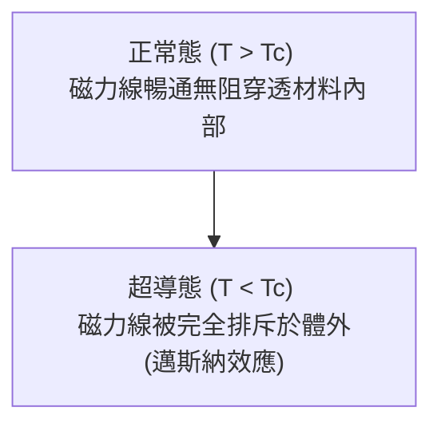

# 物理學：超導的底層機制 - 從邁斯納效應到磁浮與未來科技

在足以顛覆現代工業與資訊技術極限的物理學前沿中，很少有哪種現象能像 **超導（Superconductivity）** 那樣充滿科幻色彩與變革力量。完全零電阻導電與完全抗磁性（排斥一切內部磁力線）的神奇物理特質，正在全面重構人類的能源傳輸、軌道交通、尖端醫學成像以及[下一代量子電腦](/p/technology-quantum-computer/)的運算範式。

本文將從專業物理學與工程應用視角，全方位拆解超導現象：從昂內斯液氦實驗的傳奇發現、邁斯納效應與倫敦方程式的唯象描述，到 BCS 理論與庫珀對的微觀量子凝聚、高溫銅氧化物超導體的未解之謎，再到超導磁浮列車、核融合托卡馬克磁場以及室溫超導的終極追求。

## 1. 什麼是超導？一段波瀾壯闊的實驗物理傳奇

超導是指特定金屬、合金或陶瓷化合物在冷卻至某一 **臨界溫度（$T_c$）** 以下時，直流電阻瞬間完全歸零的巨觀量子物理現象。

在普通導體（如銅、鋁或銀）中，自由電子在電場驅動下流動時，會不可避免地與晶格的熱振動（聲子）以及材料雜質發生碰撞散射，將電能轉化為焦耳熱耗散。而在超導態下，電子流動時的散射阻力徹底消失（$R = 0$）。這意味著，如果在一條閉合的超導環中感應出電流，即便切斷一切外部電源，環內的電流也將永遠流轉不息，這被稱為 **持久電流（Persistent Current）** 。

這一驚人現象由荷蘭萊頓大學物理學家 **海克·卡末林·昂內斯（Heike Kamerlingh Onnes）** 於 1911 年首次發現。昂內斯利用自己發明的液氦低溫製冷技術（將溫度降低至 4.2 K，即約零下 269 攝氏度），在測量固態汞的電阻時，驚訝地發現其電阻在 4.19 K 處發生斷崖式暴跌至儀器無法檢測的零值。昂內斯憑藉這一里程碑突破榮獲 1913 年諾貝爾物理學獎。

## 2. 邁斯納效應與完全抗磁性

超導不僅僅是「零電阻理想導體」，它擁有更為深刻的獨立電磁屬性。1933 年，德國物理學家 **瓦爾特·邁斯納（Walther Meissner）** 與 **羅伯特·奧克森費爾德（Robert Ochsenfeld）** 發現了超導體的另一個核心標誌——**邁斯納效應（Meissner effect）** ，即 **完全抗磁性** 。

當外加磁場存在時，只要物體溫度降至臨界溫度以下轉變為超導態，物體內部的磁感應強度將被完全排斥到體外，磁力線只能貼著超導體表面繞行。

```mermaid
flowchart TD
    A["正常態 (T > Tc) \n 磁力線暢通無阻穿透材料內部"] --> B["超導態 (T < Tc) \n 磁力線被完全排斥於體外 (邁斯納效應)"]
```

為了對邁斯納效應進行數學唯象描述，弗里茨·倫敦與海因茨·倫敦兄弟於 1935 年提出了著名的 **倫敦方程式（London equations）** 。其中第二倫敦方程式給出了超導電流密度 $\mathbf{J}$ 與磁感應強度 $\mathbf{B}$ 的本質約束：

$$ \nabla \times \mathbf{J} = -\frac{n_s e^2}{m} \mathbf{B} $$

式中：
- $\mathbf{J}$ 為超導電流密度；
- $n_s$ 為超導載流子（超導電子）的數密度；
- $e$ 為基本電荷；
- $m$ 為電子質量；
- $\mathbf{B}$ 為磁通量密度。

結合馬克士威方程組可以嚴格證明，外加磁場只能滲入超導體表面極淺的一層（即 **倫敦穿透深度 $\lambda_L$** ，通常僅為數十至數百奈米），在超導體深處，磁場呈指數級衰減至嚴格為零：

$$ B(x) = B_0 e^{-x / \lambda_L} $$

正是因為完全抗磁性的存在，當把一塊強磁鐵置於超導體上方時，超導體表面會感應出完美的屏蔽超導電流，產生大小相等、方向相反的強磁場排斥力，使磁鐵穩穩漂浮於半空之中，形成震撼人心的 **量子磁浮** 。

## 3. 超導的微觀成因：BCS 理論與庫珀對

在昂內斯發現超導後的近半個世紀裡，超導的微觀量子本質始終是凝態物理學界的最大懸案。直到 1957 年， **約翰·巴丁（John Bardeen）** 、 **利昂·庫珀（Leon Cooper）** 和 **約翰·羅伯特·施里弗（John Robert Schrieffer）** 共同建立了微觀量子理論——**BCS 理論** ，三人因此榮獲 1972 年諾貝爾物理學獎。

BCS 理論的核心支柱是 **庫珀對（Cooper pairs）** 的凝聚。在真空中，同帶負電的兩個電子會產生極強的庫侖靜電排斥。然而在低溫晶格中，帶負電的電子穿過正離子晶格陣列時，會輕微吸引周圍帶正電的原子核，使晶格發生微小形變（誘發晶格振動量子——聲子）。晶格形變瞬間在局部形成微弱的正電荷富集區，在晶格彈性恢復之前，這個正電荷區會迅速吸引另一個自旋與動量相反的電子。

透過晶格聲子媒介的間接吸引勢，兩個電子克服了庫侖排斥力，結成了穩定的束縛態對：

$$ (\mathbf{k} \uparrow, -\mathbf{k} \downarrow) $$

單個電子是自旋為 $1/2$ 的費米子，必須遵循包立不相容原理；但兩個電子結合成的庫珀對，其總自旋為整數 0，表現出類似玻色子的性質。在臨界溫度以下，數以億計的庫珀對凝聚到一個巨觀單一量子基態（類似於玻色-愛因斯坦凝聚）。所有電子對以高度同步的單一巨觀波函數向前流動。破壞這種協同運動需要躍遷跨越一個有限大小的能隙（$\Delta$），因此只要熱擾動能小於能隙，晶格熱振動和雜質就完全無法散射庫珀對，零電阻導電由此產生。

## 4. 高溫超導體（HTS）的突破與物理新迷思

經典 BCS 理論曾給出一個令人沮喪的理論預言：基於常規聲子媒介配對的超導相變存在約 30 K 到 40 K 的物理上限（即著名的麥克米蘭極限 / BCS 極限）。

然而在 1986 年，IBM 蘇黎世實驗室的 **約翰內斯·格奧爾格·貝德諾爾茨（Johannes Georg Bednorz）** 與 **卡爾·亞歷山大·繆勒（Karl Alexander Müller）** 在鑭鋇銅氧（La-Ba-Cu-O）陶瓷材料中測得了 35 K 的超導相變，徹底打破了麥克米蘭極限，兩人次年即斬獲諾貝爾物理學獎。

緊接著在 1987 年，科學家合成了超導轉變溫度高達 93 K 的 **釔鋇銅氧（YBCO）** 材料，一舉跨越了 **液氮沸點（77 K / 零下 196 攝氏度）** 。液氮廉價易得且無毒安全，相比極端昂貴且稀缺的液氦，高溫超導體的出現為超導技術走向規模化工業實用化打開了突破口。

然而，銅氧化物高溫超導機制無法被常規單聲子交換的 BCS 理論解釋。強關聯電子交互作用、反鐵磁自旋漲落等被認為深度介入了配對機制，這成為凝態物理學界至今未被徹底攻克的「聖母峰」。

## 5. 改變人類文明的工業應用

完全零電阻與極高電流密度下產生的超強磁場，使超導技術成為驅動尖端工業的基石：

### 5.1 超導磁浮列車（SCMaglev）
日本中央新幹線採用的「超導磁浮（SCMaglev）」系統是其代表傑作。列車車載超導磁體通入閉環持久電流，產生數特斯拉的穩定強磁場，與地面鋪設的 8 字形懸浮線圈相互作用，將整列列車懸浮抬升約 10 公分，並在非接觸狀態下以超過 **500 km/h（試驗最高紀錄 603 km/h）** 的時速呼嘯飛馳，杜絕了輪軌摩擦損耗與機械噪音。

### 5.2 醫療磁振造影（MRI）
醫院診斷核心的核磁共振檢查（MRI）必須依靠超導電磁線圈。為了呈現人體軟組織公釐級的超高精細切片斷層影像，需要 1.5 到 3.0 特斯拉（科研級甚至高達 7T）的高均勻度超強穩恆磁場。超導線圈能在零發熱損耗的前提下常年維持這一龐大磁場。

### 5.3 大型粒子對撞機與可控核融合托卡馬克
歐洲核子研究組織（CERN）的 **大型強子對撞機（LHC）** 在長達 27 公里的地下環形隧道中部署了上千台鈮鈦（NbTi）超導偶極磁體，將質子加速至光速的 99.999999% 以揭示物質本源。而在被譽為終極清潔能源的國際熱核融合實驗堆（ **ITER** ）中，十餘公尺高的巨大鈮三錫（$Nb_3Sn$）超導環向場線圈承擔著產生 13 特斯拉強磁約束籠、將 1 億度核融合電漿憑空「懸空囚禁」的神聖使命。

### 5.4 超導量子電腦晶片
當前全球最頂尖的量子電腦（如 Google Sycamore、IBM Eagle 等）均構建於超導微波電路上。科學家利用超導薄膜中的 **約瑟夫森結（Josephson Junction）** 構建非線性人工原子，實現對超導量子位元（qubit）能階的精確微波同調操控，在特定組合最佳化演算法上已展示出超越傳統超級電腦億萬倍的「量子霸權」。

## 6. 終極科學聖杯：室溫超導的求索之路

制約當前超導技術全面走進千家萬戶的唯一桎梏，是 **製冷維持成本** 。

如果人類能夠合成出在 **常溫常壓（$T_c > 300\text{ K}$, $P = 1\text{ atm}$）** 下保持超導態的物質，將直接引爆新一輪工業革命：
- **全球零損耗超級電網** ：終結長距離高壓輸電中 5%~10% 的電能損耗；
- **無發熱超高主頻晶片** ：擺脫矽基晶片散熱瓶頸，運算能力幾何級數提升；
- **超小型無損儲能裝置（SMES）** ：以極高充放電效率儲存百萬度級清潔電力。

近年來，物理學家利用金剛石對頂砧在數百萬大氣壓的極端超高壓下，於富氫氫化物（如 $H_3S$、$LaH_{10}$）中成功將臨界溫度推升至接近 250 K（零下 23 度）。尋找能夠在常壓下亞穩保存的室溫超導體，已成為當今材料科學與物理界競爭最激烈的聖杯。

## 結語：巨觀世界的量子神蹟

超導現象是微觀量子同調性直接投射到人類巨觀世界的罕見物理奇觀。從 1911 年昂內斯在液氦中注視那一滴液態水銀電阻歸零開始，人類便打開了通向零阻抗新世界的大門。

無論是貼地飛行的磁浮列車、洞察生命的 MRI、囚禁恆星之火的核融合反應爐，還是探索宇宙終極法則的量子處理器，超導技術正在一步步重塑文明的邊界。隨著凝態理論的不斷突破，室溫超導的曙光終將照亮人類科技更輝煌的未來。
