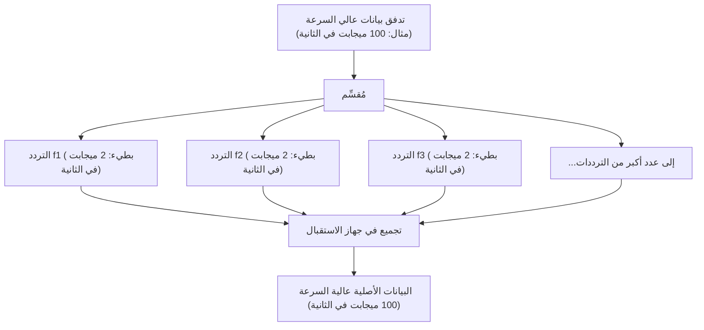

## 1. شبكة المعلومات غير المرئية التي تتطاير في الهواء

نحن نشاهد يوميًا مقاطع فيديو عالية الجودة على يوتيوب عبر هواتفنا الذكية، ونقوم بتنزيل ملفات ثقيلة، ونستمتع بالألعاب عبر الإنترنت. ومع ذلك، لا يوجد كابل واحد متصل بهذا الهاتف.
تنتقل جميع البيانات عبر موجات غير مرئية تُعرف باسم "الواي فاي (الشبكة المحلية اللاسلكية)"، محلقة في الفضاء الجوي، ليتم امتصاصها في جهاز التوجيه (الراوتر).

كيف تتحول مقاطع الفيديو والصور، التي هي عبارة عن مجموعة من البيانات الرقمية (البتات) المكونة من 0 و 1، إلى "موجات راديو"، وتخترق الجدران، وتصل بدقة دون أن تختلط بالموجات الأخرى؟ هنا يكمن المظهر المطلق لهندسة الاتصالات، حيث تندمج الأشكال الموجية الفيزيائية التناظرية مع النظريات الحسابية الرقمية ببراعة.

## 2. "تضمين" المعلومات في الموجات: التضمين (Modulation)

موجات الراديو هي نوع من "الموجات الكهرومغناطيسية" مثل الضوء والأشعة السينية. إنها مجرد موجات من الطاقة تتقدم بينما تتموج في الفضاء.
تُسمى عملية إعطاء "معنى (معلومات)" لهذه الموجات بـ "**التضمين (Modulation)**".

التضمين الأكثر بدائية يشبه "شفرة مورس"، حيث يتم إرسال الموجات وإيقافها. ولكن هذا بطيء للغاية. يتحكم الواي فاي الحديث في خصائص الموجات بدقة متناهية لجمع كميات هائلة من البيانات. تتضمن خصائص الموجات الثلاثة ما يلي:

1. **السعة (Amplitude)**: ارتفاع الموجة. كبيرة أم صغيرة.
2. **التردد (Frequency)**: سرعة الموجة (الفاصل الزمني). متقاربة أم متباعدة.
3. **الطور (Phase)**: توقيت الموجة. هل موضع بداية الموجة مُزاح.

في أحدث تقنيات الواي فاي (واي فاي 5، 6، 7، وما إلى ذلك)، تُستخدم تقنية متقدمة تُسمى "**QAM (تضمين السعة المتعامد: Quadrature Amplitude Modulation)**" بشكل أساسي.
هذه تقنية تعبر عن مجموعات متعددة من 0 و 1 في اهتزاز موجة واحدة عن طريق تغيير كل من "السعة (الارتفاع)" و "الطور (الإزاحة)" للموجة في وقت واحد.

على سبيل المثال، في معيار يُسمى "256-QAM"، يتم تحديد 256 نمطًا ($2^8$) لمجموعات ارتفاع الموجة وإزاحتها. بعبارة أخرى، من خلال وصول الموجة مرة واحدة فقط، يمكنها نقل 8 بتات (1 بايت) من البيانات مثل "00110101" في وقت واحد. في أحدث واي فاي 7، وصل إلى "4096-QAM"، وينقل ما يصل إلى 12 بتًا من البيانات في موجة واحدة.

## 3. سر مقاومة العوائق: OFDM (تعدد الإرسال بتقسيم التردد المتعامد)

تتقدم موجات الواي فاي وتصطدم بالجدران والأثاث وجسم الإنسان داخل المنزل.
تصل الموجات التي تنعكس على الجدران إلى الهوائي بتأخير طفيف عن الموجات التي تصل مباشرة (ظاهرة المسار المتعدد). نتيجة لذلك، تتداخل الموجة المتأخرة مع الموجة التي تصل مباشرة، مما يؤدي إلى تدمير شكل الموجة بالكامل. إنها نفس الظاهرة عندما تصرخ "ياهو" في الجبل، وتسمع أصواتًا منعكسة متأخرة من اتجاهات مختلفة، فلا تفهم ما يُقال.

ما تغلب على نقطة الضعف القاتلة هذه هو نهج رياضي مذهل يُسمى "**OFDM (تعدد الإرسال بتقسيم التردد المتعامد: Orthogonal Frequency Division Multiplexing)**".

يقوم OFDM بتقسيم تدفق بيانات واحد سريع جدًا إلى **العديد من تدفقات البيانات البطيئة**، ويرسلها في وقت واحد عن طريق وضع كل منها على تردد مختلف قليلاً (ناقل فرعي).

إذا شبهناها بتوصيل الطرود، فبدلاً من تحميل جميع الطرود في سيارة فيراري واحدة (سريعة ولكنها عرضة للحوادث) وجعلها تنطلق بأقصى سرعة، فإن الأمر يشبه توزيع الطرود على 50 شاحنة (بطيئة ولكنها مستقرة) وجعلها تنطلق في نفس الوقت.
نظرًا لأن سرعة كل موجة فردية تصبح أبطأ، فحتى إذا اختلطت الموجات (الصدى) التي تنعكس على الجدار وتصل متأخرة قليلاً، فإن احتمال التداخل مع البيانات السابقة واللاحقة ينخفض بشكل كبير، مما يتيح استعادتها دون أخطاء.

## 4. الاختلافات في الخصائص الفيزيائية بين نطاق 2.4 جيجاهرتز ونطاق 5 جيجاهرتز

عند شراء جهاز توجيه (راوتر) واي فاي، ستلاحظ دائمًا وجود شبكتين: "2.4 جيجاهرتز" و "5 جيجاهرتز" (و 6 جيجاهرتز مؤخرًا). نظرًا للاختلافات في الخصائص الفيزيائية للموجات الكهرومغناطيسية، فإن لكل منها نقاط قوة وضعف واضحة.

* **نطاق 2.4 جيجاهرتز (طول موجي طويل)**
  * **المزايا**: نظرًا لأن الطول الموجي طويل، فإنه يتمتع بخاصية قوية للالتفاف حول العوائق (الجدران والأرضيات) (الحيود)، مما يسهل وصول الموجات إلى مسافات بعيدة في المنزل.
  * **العيوب**: هناك العديد من الأجهزة التي تستخدم نفس التردد، مثل البلوتوث وأفران الميكروويف، مما يجعلها عرضة لانخفاض السرعة أو الانقطاع بسبب التداخل.

* **نطاق 5 جيجاهرتز (طول موجي قصير)**
  * **المزايا**: النطاق (عرض الطريق) القابل للاستخدام واسع، ونظرًا لأنه نطاق مخصص تقريبًا للواي فاي، فإن التداخل قليل ويتيح اتصالات عالية السرعة بشكل مذهل.
  * **العيوب**: نظرًا لقصر الطول الموجي، فإنه يتمتع بمسار مستقيم عالٍ ويميل إلى أن يتم امتصاصه أو عكسه بواسطة العوائق مثل الجدران. تضعف الموجات بشكل حاد عند الانتقال إلى غرف بعيدة عن جهاز التوجيه أو عبر الطوابق.

يعد الاستخدام السليم لهذه النطاقات وفقًا للغرض (أو ترك جهاز التوجيه يقوم بالتبديل تلقائيًا) أساسًا لبناء بيئة واي فاي مريحة.

## 5. تقنية "MIMO" لمضاعفة السرعة باستخدام هوائيات متعددة

إن وجود العديد من الهوائيات (أو دمجها) في أجهزة التوجيه الحديثة ليس لمجرد إرسال الموجات لمسافات أبعد. بل لاستخدام تقنية سحرية تُسمى "**MIMO (مايمو: Multiple-Input and Multiple-Output)**".

في الماضي، حتى لو كانت هناك هوائيات متعددة، كان يمكن استخدامها فقط لدرجة إرسال نفس البيانات وتقليل الأخطاء (التنوع).
ومع ذلك، تستفيد تقنية MIMO من خصائص الفضاء (تنعكس الموجات على الجدران وتتخذ مسارات مختلفة) وبدلاً من ذلك تقوم بـ **إرسال بيانات مختلفة تمامًا من هوائيات مختلفة في نفس الوقت على نفس التردد**.

في العادة، قد تتداخل وتصبح فوضوية، ولكن من خلال الهوائيات المتعددة في الجانب المستقبل والمعالجة الحسابية المتقدمة، يتم فصل واستخراج الموجات المختلطة مكانيًا كما لو كانت تُحل معادلات متزامنة. نتيجة لذلك، دون توسيع نطاق التردد (عرض الطريق)، يمكن زيادة سرعة الاتصال ماديًا إلى الضعف أو أربعة أضعاف ببساطة عن طريق زيادة عدد الهوائيات إلى 2 ثم 4.

## 6. الخلاصة: نحو عصر حساب الفضاء

إن الواي فاي الذي نستخدمه عادة دون تفكير يعتمد على تضافر حكمة البشرية: "تقنية التضمين التي تغير شكل الموجات الكهرومغناطيسية (QAM)"، "المعالجة الرياضية لتقسيم الموجات ومنع التداخل (OFDM)"، و "تقنية الهوائي التي تضاعف سعة الاتصال باستخدام انعكاس الفضاء (MIMO)".

تستمر معايير الواي فاي في التطور من واي فاي 4 (11n) إلى واي فاي 5 (11ac)، واي فاي 6 (11ax)، ثم واي فاي 7 (11be)، وقد تطورت سرعة الاتصال بعشرات الآلاف من المرات، من بضعة ميجابت في الثانية في البداية إلى عشرات الجيجابت في الثانية.
تقطيع الفضاء غير المرئي بدقة باستخدام الرياضيات والفيزياء، ونشر المعلومات ونقلها. الواي فاي هو تقنية تستحق حقًا أن تُسمى سحر العصر الحديث.
