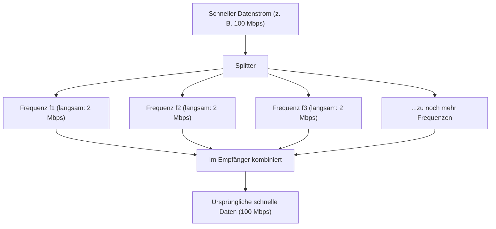

## 1. Das unsichtbare Informationsnetzwerk, das durch die Luft fliegt

Jeden Tag schauen wir hochauflösende YouTube-Videos auf unseren Smartphones, laden riesige Dateien herunter oder genießen Online-Spiele. Dennoch ist nicht ein einziges Kabel mit dem Smartphone verbunden.
Alle Daten reisen auf unsichtbaren Funkwellen namens "Wi-Fi (WLAN)" durch die Luft und werden in den Router gesaugt.

Wie werden Videos und Bilder, die eine Ansammlung von digitalen Daten (Bits) aus 0 und 1 sind, in "Funkwellen" umgewandelt, passieren Wände und kommen präzise an, ohne sich mit anderen Funkwellen zu vermischen? Darin liegt die ultimative Form der Nachrichtentechnik, in der sich analoge physikalische Wellenformen und digitale Berechnungen perfekt vereinen.

## 2. Informationen auf Funkwellen "aufbringen": Modulation

Funkwellen sind eine Art "elektromagnetischer Wellen", genau wie Licht oder Röntgenstrahlen. Sie sind bloß Energiewellen, die wellenartig durch den Raum reisen.
Der Vorgang, dieser Welle "Bedeutung (Information)" zu verleihen, wird als "**Modulation**" bezeichnet.

Die primitivste Modulation ist wie ein "Morsecode", der Wellen aussendet oder stoppt. Aber das ist viel zu langsam. Modernes Wi-Fi packt eine überwältigende Datenmenge hinein, indem es die Eigenschaften von Wellen extrem präzise kontrolliert. Es gibt die folgenden drei Eigenschaften von Wellen:

1. **Amplitude**: Die Höhe der Welle. Ist sie groß oder klein?
2. **Frequenz**: Die Geschwindigkeit der Welle (Abstand). Sind sie dicht gedrängt oder weit auseinander?
3. **Phase**: Das Timing der Welle. Ist die Startposition der Welle verschoben?

Das neueste Wi-Fi (Wi-Fi 5, 6, 7 usw.) nutzt hauptsächlich eine fortschrittliche Technologie namens "**QAM (Quadraturamplitudenmodulation)**".
Dies ist eine Technologie, die eine Kombination von mehreren Nullen und Einsen innerhalb einer einzigen Schwingung der Welle darstellt, indem sie gleichzeitig zwei Dinge verändert: die "Amplitude (Höhe)" und die "Phase (Verschiebung)" der Welle.

Zum Beispiel definiert der Standard namens "256-QAM" 256 Muster ($2^8$) von Kombinationen aus Wellenhöhe und -verschiebung. Das bedeutet, dass eine einzige Welle, die ankommt, sofort 8 Bit (1 Byte) an Daten wie "00110101" transportieren kann. Das neueste Wi-Fi 7 erreicht "4096-QAM" und überträgt beeindruckende 12 Bit an Daten mit einer einzigen Welle.

## 3. Das Geheimnis der Widerstandsfähigkeit gegen Hindernisse: OFDM (Orthogonales Frequenzmultiplexverfahren)

Wi-Fi-Funkwellen bewegen sich vorwärts, während sie mit Wänden, Möbeln und menschlichen Körpern im Haus kollidieren.
Funkwellen, die von Wänden reflektiert werden, erreichen die Antenne etwas später als Funkwellen, die direkt ankommen (Mehrwegeausbreitung). Dann interferieren die verzögerten Wellen und die direkt ankommenden Wellen miteinander, und die Wellenform wird völlig zerstört. Es ist das gleiche Phänomen, wie wenn man auf einem Berg "Hallo" ruft und das reflektierte Echo zeitversetzt aus verschiedenen Richtungen zurückkommt, sodass man nicht mehr verstehen kann, was gesagt wird.

Diese fatale Schwäche wurde durch einen erstaunlichen mathematischen Ansatz namens "**OFDM (Orthogonal Frequency Division Multiplexing)**" überwunden.

OFDM teilt einen einzigen, sehr schnellen Datenstrom in **zahlreiche langsame Datenströme** auf, legt jeden auf eine leicht unterschiedliche Frequenz (Unterträger) und überträgt sie gleichzeitig.

Wenn man es mit der Paketzustellung vergleicht, ist es, als würde man nicht alle Pakete auf einen einzigen Ferrari laden (der zwar schnell, aber unfallanfällig ist) und mit Vollgas losfahren, sondern die Pakete auf 50 Lastwagen verteilen (die zwar langsam, aber stabil sind) und sie gleichzeitig losfahren lassen.
Da die Geschwindigkeit der einzelnen Wellen langsam wird, sinkt die Wahrscheinlichkeit drastisch, dass sie sich mit den vorherigen oder nachfolgenden Daten überschneiden, selbst wenn sich leicht verzögerte Wellen (Echos), die von Wänden reflektiert wurden, einmischen, wodurch sie fehlerfrei wiederhergestellt werden können.

## 4. Physische Unterschiede zwischen dem 2,4-GHz- und dem 5-GHz-Band

Wenn Sie einen Wi-Fi-Router kaufen, werden Sie immer feststellen, dass es zwei Netzwerke gibt: "2,4 GHz" und "5 GHz" (und in letzter Zeit auch 6 GHz). Diese haben klare Stärken und Schwächen aufgrund von Unterschieden in den physikalischen Eigenschaften elektromagnetischer Wellen.

* **2,4-GHz-Band (lange Wellenlänge)**
  * **Vorteile**: Da die Wellenlänge lang ist, hat es eine starke Eigenschaft (Beugung), Hindernisse (Wände und Böden) zu umgehen, und die Funkwellen können leicht große Entfernungen im ganzen Haus erreichen.
  * **Nachteile**: Es gibt extrem viele Geräte, die die gleiche Frequenz nutzen, wie Bluetooth und Mikrowellen, wodurch es leicht zu Geschwindigkeitsabfällen und Verbindungsabbrüchen aufgrund von Interferenzen kommen kann.

* **5-GHz-Band (kurze Wellenlänge)**
  * **Vorteile**: Die nutzbare Bandbreite (Straßenbreite) ist groß und es handelt sich fast um ein reines Wi-Fi-Band, wodurch es weniger Interferenzen gibt und überwältigend schnelle Kommunikation ermöglicht wird.
  * **Nachteile**: Da die Wellenlänge kurz ist, ist die Geradlinigkeit hoch, und sie werden leicht von Hindernissen wie Wänden absorbiert oder reflektiert. Die Funkwellen werden schnell schwächer, wenn Sie sich in einen vom Router entfernten Raum bewegen oder Stockwerke wechseln.

Die Grundlage für den Aufbau einer komfortablen Wi-Fi-Umgebung besteht darin, diese je nach Zweck richtig einzusetzen (oder den Router sie automatisch umschalten zu lassen).

## 5. "MIMO" verdoppelt die Geschwindigkeit mit mehreren Antennen

Der Grund, warum moderne Router mit vielen Antennen (oder eingebauten Antennen) ausgestattet sind, ist nicht nur, um die Funkwellen weiter fliegen zu lassen. Es ist, um eine magische Technologie namens "**MIMO (Multiple-Input and Multiple-Output)**" zu nutzen.

In der Vergangenheit konnten mehrere Antennen, selbst wenn sie vorhanden waren, nur dazu verwendet werden, dieselben Daten zu senden, um Fehler zu reduzieren (Diversität).
MIMO nutzt jedoch die Eigenschaften des Raums (die Tatsache, dass Funkwellen von Wänden reflektiert werden und verschiedene Pfade nehmen) und **sendet gleichzeitig völlig unterschiedliche Daten von verschiedenen Antennen auf derselben Frequenz**.

Normalerweise würde dies zu Interferenzen führen und ein Durcheinander verursachen, aber die mehreren Antennen auf der Empfängerseite und die hochmoderne Rechenverarbeitung trennen und extrahieren die räumlich vermischten Wellen, ähnlich wie beim Lösen von simultanen Gleichungen. Dadurch kann die Kommunikationsgeschwindigkeit physisch verdoppelt oder vervierfacht werden, indem einfach die Anzahl der Antennen auf zwei oder vier erhöht wird, ohne das Frequenzband (die Straßenbreite) zu erweitern.

## 6. Fazit: Eintritt in das Zeitalter der Berechnung des Raums

Das Wi-Fi, das wir täglich ganz beiläufig nutzen, besteht aus der gebündelten Weisheit der Menschheit: "Modulationstechnologie (QAM), die die Wellenform elektromagnetischer Wellen verändert", "mathematische Verarbeitung (OFDM), die Wellen aufteilt, um Interferenzen zu verhindern" und "Antennentechnologie (MIMO), die die Kommunikationsmenge verdoppelt, indem sie die Reflexionen im Raum nutzt".

Die Wi-Fi-Standards entwickeln sich kontinuierlich weiter von Wi-Fi 4 (11n) zu Wi-Fi 5 (11ac), Wi-Fi 6 (11ax) und Wi-Fi 7 (11be), und die Kommunikationsgeschwindigkeit hat sich drastisch weiterentwickelt – von wenigen Mbps in den Anfängen zu dutzenden Gbps, einer zigtausendfachen Verbesserung.
Der unsichtbare Raum wird durch Mathematik und Physik präzise zerlegt, um Informationen eng gepackt zu transportieren. Wi-Fi ist wirklich eine Technologie, die es verdient, als moderne Magie bezeichnet zu werden.
