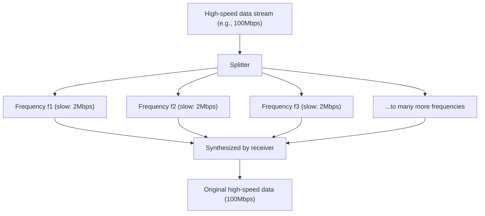

## 1. The Invisible Information Network Flying Through the Air

Every day, we watch high-quality YouTube videos, download heavy files, and enjoy online games on our smartphones. Yet, there is not a single cable connected to that smartphone.
All data rides on invisible radio waves called "Wi-Fi (Wireless LAN)", flying through the air, and getting sucked into the router.

How are videos and images, which are collections of digital data (bits) of 0s and 1s, converted into "radio waves", pass through walls, and arrive accurately without mixing with other radio waves? Here lies the ultimate form of communication engineering, a magnificent fusion of analog physical waveforms and digital computational theory.

## 2. "Riding" Information on Radio Waves: Modulation

Radio waves are a type of "electromagnetic wave", just like light and X-rays. They are simply waves of energy that travel while undulating through space.
The process of giving "meaning (information)" to these waves is called "**Modulation**".

The most primitive modulation is like "Morse code", which sends out or stops waves. However, that is far too slow. Modern Wi-Fi packs an overwhelming amount of data by controlling the properties of waves with extreme precision. The properties of waves include the following three:

1. **Amplitude**: The height of the wave. Is it large or small?
2. **Frequency**: The speed (interval) of the wave. Is it packed or spread out?
3. **Phase**: The timing of the wave. Is the starting position of the wave shifted?

Latest Wi-Fi (Wi-Fi 5, 6, 7, etc.) primarily uses an advanced technology called "**QAM (Quadrature Amplitude Modulation)**".
This is a technology that simultaneously changes both the "amplitude (height)" and "phase (shift)" of a wave to represent multiple combinations of 0s and 1s in a single wave oscillation.

For example, in a standard called "256-QAM", 256 patterns ($2^8$) of combinations of wave height and shift are defined. This means that a single wave arrival can carry 8 bits (1 byte) of data, such as "00110101", all at once. The latest Wi-Fi 7 reaches "4096-QAM", carrying a massive 12 bits of data in a single wave.

## 3. The Secret to Resistance Against Obstacles: OFDM (Orthogonal Frequency Division Multiplexing)

Wi-Fi radio waves travel while bouncing off walls, furniture, human bodies, etc. in a house.
Radio waves reflected off walls arrive at the antenna slightly later than those that arrived straight (multipath phenomenon). Then, the delayed wave and the direct wave interfere with each other, completely destroying the waveform. It is the same phenomenon as shouting "Yahoo" in the mountains, where reflected sounds arrive shifted from various directions, making it impossible to understand what is being said.

This fatal weakness was overcome by an astonishing mathematical approach called "**OFDM (Orthogonal Frequency Division Multiplexing)**".

OFDM divides a single very fast data stream into **many slow data streams**, and transmits them simultaneously by placing each on slightly different frequencies (subcarriers).

To compare it to package delivery, instead of loading all the packages onto a single Ferrari (fast but prone to accidents) and driving at full speed, it is like distributing the packages among 50 trucks (slow but stable) and having them depart at the same time.
Because the speed of individual waves is slow, even if waves that bounce off walls and arrive slightly late (echoes) get mixed in, the probability of them overlapping with the preceding and succeeding data drops dramatically, making it possible to restore them without errors.

## 4. Differences in Physical Characteristics Between 2.4GHz and 5GHz Bands

When you buy a Wi-Fi router, you will notice that there are always two networks: "2.4GHz" and "5GHz" (and recently 6GHz as well). Due to differences in the physical properties of electromagnetic waves, these have distinct strengths and weaknesses.

* **2.4GHz Band (Long Wavelength)**
  * **Pros**: Because the wavelength is long, it has a strong property (diffraction) to travel around obstacles (walls and floors), making it easy for the radio waves to reach far corners of the house.
  * **Cons**: There are many devices that use the same frequency, such as Bluetooth and microwave ovens, making it prone to speed drops and disconnections due to interference.

* **5GHz Band (Short Wavelength)**
  * **Pros**: The available bandwidth (road width) is wide, and because it is an almost dedicated Wi-Fi band, there is little interference, enabling overwhelmingly high-speed communication.
  * **Cons**: Because the wavelength is short, it travels straight and is easily absorbed or reflected by obstacles like walls. The radio waves weaken rapidly when crossing rooms or floors away from the router.

Using these properly according to the purpose (or letting the router switch automatically) is the foundation of building a comfortable Wi-Fi environment.

## 5. "MIMO": Doubling Speed with Multiple Antennas

The reason modern routers have multiple antennas standing (or built-in) is not simply to fly radio waves further. It is to use a magical technology called "**MIMO (Multiple-Input and Multiple-Output)**".

Conventionally, even with multiple antennas, they could only be used to transmit the same data to reduce errors (diversity).
However, MIMO turns the characteristics of space (the fact that radio waves bounce off walls and take various paths) to its advantage, and **simultaneously transmits completely different data from different antennas on the same frequency**.

Normally, this would cause interference and a mess, but through multiple antennas on the receiving side and advanced arithmetic processing, the spatially mixed waves are separated and extracted as if solving simultaneous equations. As a result, by simply increasing the number of antennas to 2 or 4, the communication speed can physically be doubled or quadrupled without widening the frequency band (road width).

## 6. Conclusion: Entering the Era of Calculating Space

The Wi-Fi we casually use every day is built upon the culmination of human wisdom: "modulation technology that transforms electromagnetic waveforms (QAM)", "mathematical processing that divides waves to prevent interference (OFDM)", and "antenna technology that uses spatial reflections to multiply communication volume (MIMO)".

Wi-Fi standards continue to evolve from Wi-Fi 4 (11n) to Wi-Fi 5 (11ac), Wi-Fi 6 (11ax), and Wi-Fi 7 (11be), and the communication speed has evolved tens of thousands of times from a few Mbps in the early days to tens of Gbps.
Accurately cutting invisible space with mathematics and physics, and laying out information to carry it. Wi-Fi is truly a technology worthy of being called modern magic.
