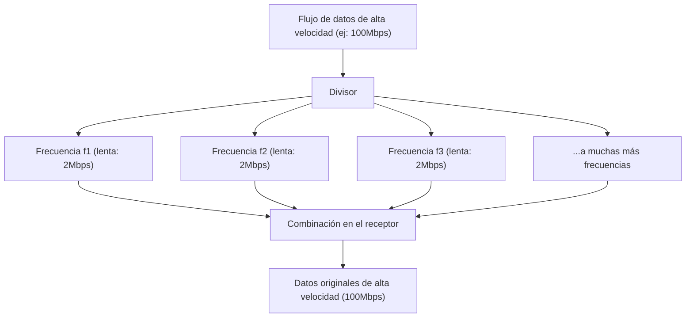

## 1. Una red de información invisible que vuela por el aire

Todos los días, vemos videos de YouTube en alta definición, descargamos archivos pesados y disfrutamos de juegos en línea en nuestros smartphones. Sin embargo, no hay ni un solo cable conectado a ese teléfono.
Todos los datos viajan por el espacio en el aire montados sobre ondas de radio invisibles llamadas "Wi-Fi (LAN inalámbrica)" y son absorbidos por el router.

¿Cómo es que los videos y las imágenes, que son un conjunto de datos digitales (bits) de 0s y 1s, se convierten en "ondas de radio", atraviesan las paredes y llegan con precisión sin mezclarse con otras ondas de radio? Allí se encuentra la forma suprema de la ingeniería de telecomunicaciones, donde la forma de onda física analógica y la teoría de cálculo digital se fusionan de manera brillante.

## 2. "Montar" la información en las ondas de radio: Modulación (Modulation)

Las ondas de radio son un tipo de "onda electromagnética", al igual que la luz y los rayos X. Son simplemente ondas de energía que avanzan ondulando a través del espacio.
El proceso de dar "significado (información)" a estas ondas se llama "**Modulación (Modulation)**".

La modulación más primitiva es algo así como el "código Morse", que emite y detiene las ondas. Sin embargo, eso es demasiado lento. El Wi-Fi moderno empaqueta una cantidad abrumadora de datos al controlar las propiedades de las ondas de manera extremadamente precisa. Hay tres propiedades de las ondas:

1. **Amplitud (Amplitude)**: La altura de la onda. Si es grande o pequeña.
2. **Frecuencia (Frequency)**: La velocidad (intervalo) de la onda. Si están juntas o separadas.
3. **Fase (Phase)**: El tiempo de la onda. Si la posición de inicio de la onda está desplazada.

En el Wi-Fi más reciente (Wi-Fi 5, 6, 7, etc.), se utiliza principalmente una tecnología avanzada llamada "**QAM (Modulación de Amplitud en Cuadratura: Quadrature Amplitude Modulation)**".
Esta es una tecnología que expresa múltiples combinaciones de 0s y 1s dentro de una sola oscilación de la onda cambiando dos cosas simultáneamente: la "amplitud (altura)" y la "fase (desplazamiento)" de la onda.

Por ejemplo, en el estándar llamado "256-QAM", se definen 256 patrones ($2^8$) de combinaciones de altura y desplazamiento de la onda. Es decir, con la llegada de una sola onda, se pueden transportar 8 bits (1 byte) de datos como "00110101" a la vez. El último Wi-Fi 7 alcanza "4096-QAM" y transporta hasta 12 bits de datos en una sola onda.

## 3. El secreto para resistir a los obstáculos: OFDM (Multiplexación por División de Frecuencias Ortogonales)

Las ondas de radio del Wi-Fi avanzan mientras chocan con paredes, muebles, cuerpos humanos, etc. en la casa.
Las ondas de radio que se reflejan en la pared llegan a la antena un poco más tarde que las ondas de radio que llegan directamente (fenómeno multicamino). Entonces, las ondas retrasadas y las ondas que llegan directamente interfieren entre sí, y la forma de onda se destruye y se vuelve un desastre. Es el mismo fenómeno que cuando gritas "¡Hola!" en las montañas y escuchas sonidos reflejados desfasados desde varias direcciones, lo que hace que no entiendas lo que se dice.

Lo que superó esta debilidad fatal fue un enfoque matemático asombroso llamado "**OFDM (Orthogonal Frequency Division Multiplexing)**".

OFDM divide un flujo de datos extremadamente rápido en **múltiples flujos de datos lentos**, los coloca en frecuencias ligeramente diferentes (subportadoras) y los transmite simultáneamente.

Si lo comparamos con la entrega de paquetes, en lugar de cargar todos los paquetes en un solo Ferrari (rápido pero propenso a accidentes) y correr a toda velocidad, es como distribuir los paquetes en 50 camiones (lentos pero estables) y hacer que partan al mismo tiempo.
Dado que la velocidad de cada onda individual se vuelve lenta, incluso si se mezclan las ondas (ecos) que llegan un poco más tarde después de rebotar en las paredes, la probabilidad de que se superpongan con los datos anteriores y posteriores se reduce drásticamente, lo que permite restaurarlos sin errores.

## 4. Diferencias en las características físicas entre las bandas de 2.4GHz y 5GHz

Cuando compras un router Wi-Fi, siempre notarás que hay dos redes: "2.4GHz" y "5GHz" (y recientemente también 6GHz). Estos tienen fortalezas y debilidades claras debido a la diferencia en las propiedades físicas de las ondas electromagnéticas.

* **Banda de 2.4GHz (Longitud de onda larga)**
  * **Ventajas**: Debido a que la longitud de onda es larga, tiene una fuerte propiedad (difracción) para rodear obstáculos (paredes y pisos), y las ondas de radio pueden llegar fácilmente lejos en toda la casa.
  * **Desventajas**: Hay muchos dispositivos que usan la misma frecuencia, como el Bluetooth y los hornos microondas, por lo que las reducciones de velocidad y las desconexiones debidas a interferencias ocurren fácilmente.

* **Banda de 5GHz (Longitud de onda corta)**
  * **Ventajas**: El ancho de banda (ancho de la carretera) utilizable es amplio, y dado que es una banda casi exclusiva para Wi-Fi, hay poca interferencia y es posible una comunicación a una velocidad abrumadora.
  * **Desventajas**: Debido a que la longitud de onda es corta, tiene una alta rectitud y es fácilmente absorbida y reflejada por obstáculos como paredes. Cuando te alejas del router a otras habitaciones o pasas a otras plantas, la señal se debilita rápidamente.

Usarlos adecuadamente según el propósito (o dejar que el router cambie automáticamente) es la base para construir un entorno Wi-Fi cómodo.

## 5. "MIMO": Duplicando la velocidad con múltiples antenas

El hecho de que haya muchas antenas en los routers modernos (o incorporadas) no es solo para enviar ondas de radio más lejos. Es para usar una tecnología mágica llamada "**MIMO (Múltiple Entrada, Múltiple Salida: Multiple-Input and Multiple-Output)**".

Anteriormente, incluso con múltiples antenas, solo se podían usar para reducir errores enviando los mismos datos (diversidad).
Sin embargo, MIMO aprovecha las características del espacio (el hecho de que las ondas de radio se reflejan en las paredes y toman varios caminos) y **transmite datos completamente diferentes desde diferentes antenas al mismo tiempo en la misma frecuencia**.

Normalmente, esto causaría interferencias y sería un desastre, pero con múltiples antenas en el lado del receptor y un procesamiento de cálculo avanzado, las ondas que se han mezclado espacialmente se separan y extraen como si se resolvieran ecuaciones simultáneas. Como resultado, sin ampliar la banda de frecuencia (ancho de la carretera), con solo aumentar el número de antenas a 2 o 4, se puede aumentar físicamente la velocidad de comunicación a 2 o 4 veces.

## 6. Resumen: Hacia una era de calcular el espacio

El Wi-Fi que usamos casualmente todos los días se basa en la cristalización de la sabiduría humana: "tecnología de modulación que deforma la forma de onda de las ondas electromagnéticas (QAM)", "procesamiento matemático que divide la onda para evitar interferencias (OFDM)" y "tecnología de antena que duplica la cantidad de comunicación aprovechando el reflejo del espacio (MIMO)".

Los estándares de Wi-Fi continúan evolucionando de Wi-Fi 4 (11n) a Wi-Fi 5 (11ac), Wi-Fi 6 (11ax) y luego a Wi-Fi 7 (11be), y la velocidad de comunicación ha evolucionado decenas de miles de veces, desde unos pocos Mbps al principio hasta decenas de Gbps.
Cortar con precisión el espacio invisible con las matemáticas y la física, y llenarlo de información para transportarla. El Wi-Fi es verdaderamente una tecnología digna de ser llamada la magia moderna.
