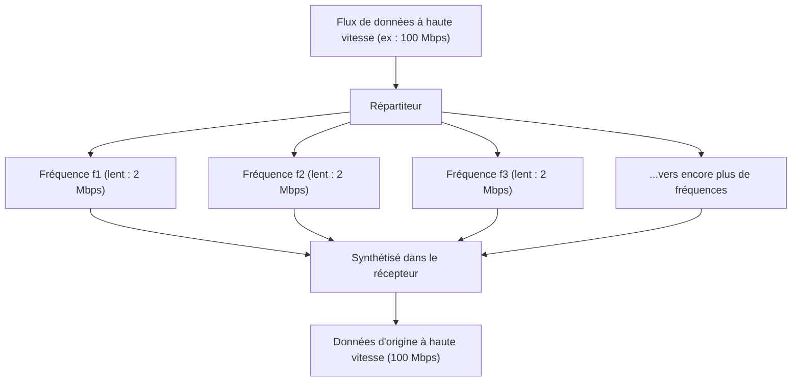

## 1. Un réseau d'informations invisible volant dans les airs

Chaque jour, nous regardons des vidéos YouTube en haute définition, téléchargeons des fichiers lourds et jouons à des jeux en ligne sur nos smartphones. Pourtant, aucun câble n'y est branché.
Toutes les données voyagent dans l'espace sous la forme d'ondes invisibles appelées « Wi-Fi (réseau local sans fil) » et sont captées par le routeur.

Comment des vidéos ou des images, qui sont des assemblages de données numériques (bits) de 0 et de 1, sont-elles converties en « ondes radio », traversent-elles les murs et arrivent-elles avec précision sans se mélanger à d'autres ondes ? On y trouve la forme ultime de l'ingénierie des télécommunications, où les formes d'ondes physiques analogiques et la théorie de calcul numérique s'entremêlent avec brio.

## 2. « Porter » l'information sur les ondes : la modulation

Les ondes radio sont une forme d'« ondes électromagnétiques », au même titre que la lumière ou les rayons X. Ce ne sont que des ondes d'énergie qui se propagent dans l'espace en ondulant.
Le processus consistant à donner un « sens (information) » à ces ondes s'appelle la **modulation**.

La modulation la plus basique s'apparente au « code Morse », qui consiste à émettre ou interrompre l'onde. Cependant, cette méthode est beaucoup trop lente. Le Wi-Fi moderne emballe des quantités impressionnantes de données en contrôlant très précisément les propriétés des ondes. Ces propriétés sont les trois suivantes :

1. **Amplitude** : la hauteur de l'onde. Grande ou petite.
2. **Fréquence** : la vitesse de l'onde (l'intervalle). Rapprochée ou espacée.
3. **Phase** : le décalage temporel de l'onde. Le point de départ de l'onde est-il décalé ?

Dans les normes Wi-Fi les plus récentes (Wi-Fi 5, 6, 7, etc.), on utilise principalement une technologie avancée appelée **QAM (Quadrature Amplitude Modulation, ou modulation d'amplitude en quadrature)**.
Il s'agit d'une technologie qui représente de multiples combinaisons de 0 et de 1 dans une seule oscillation de l'onde en modifiant simultanément deux paramètres : l'« amplitude (la hauteur) » et la « phase (le décalage) ».

Par exemple, la norme « 256-QAM » définit 256 combinaisons ($2^8$) de hauteur et de décalage de l'onde. En d'autres termes, une seule arrivée d'onde peut transporter en une fois 8 bits (1 octet) de données telles que « 00110101 ». Le tout dernier Wi-Fi 7 atteint « 4096-QAM », transportant jusqu'à 12 bits de données dans une seule onde.

## 3. Le secret de la résistance aux obstacles : l'OFDM (Multiplexage par répartition orthogonale de la fréquence)

Les ondes radio du Wi-Fi se propagent en rebondissant sur les murs, les meubles ou même le corps humain.
Les ondes réfléchies par les murs atteignent l'antenne avec un léger retard par rapport à celles qui arrivent directement (phénomène de trajets multiples). Ensuite, les ondes retardées et les ondes directes interfèrent, détruisant complètement la forme de l'onde. C'est le même phénomène que si vous criez « Ohé ! » dans la montagne : les sons réfléchis vous parviennent de différentes directions avec un décalage, rendant le tout incompréhensible.

Ce défaut majeur a été surmonté grâce à une approche mathématique incroyable appelée **OFDM (Orthogonal Frequency Division Multiplexing)**.

L'OFDM divise un flux de données très rapide en **plusieurs flux de données plus lents**, puis les place sur des fréquences légèrement différentes (sous-porteuses) et les transmet simultanément.

Si l'on fait la comparaison avec la livraison de colis, plutôt que de charger tous les colis dans une seule Ferrari (rapide mais très exposée aux accidents) et de la faire rouler à toute vitesse, il s'agit de répartir les colis dans 50 camions (lents mais stables) et de les faire partir en même temps.
Comme la vitesse de chaque onde individuelle ralentit, même si les ondes qui se reflètent sur le mur et arrivent avec un léger retard (échos) se mélangent, la probabilité qu'elles chevauchent les données précédentes et suivantes diminue drastiquement, permettant de les restaurer sans la moindre erreur.

## 4. Différences de propriétés physiques entre les bandes 2,4 GHz et 5 GHz

Lorsque vous achetez un routeur Wi-Fi, vous remarquez toujours qu'il existe deux réseaux, « 2,4 GHz » et « 5 GHz » (ainsi que 6 GHz plus récemment). Ces deux bandes présentent des forces et des faiblesses évidentes en raison des différences dans les propriétés physiques de leurs ondes électromagnétiques.

* **Bande des 2,4 GHz (onde plus longue)**
  * **Avantages** : sa longue longueur d'onde lui confère une forte propension à contourner les obstacles (murs et sols) par diffraction, ce qui permet aux ondes de se propager facilement loin dans la maison.
  * **Inconvénients** : un très grand nombre d'appareils, tels que le Bluetooth et les fours à micro-ondes, utilisent cette même fréquence. Cela entraîne souvent des baisses de vitesse et des déconnexions dues aux interférences.

* **Bande des 5 GHz (onde plus courte)**
  * **Avantages** : la bande passante (largeur de la route) exploitable est large et presque exclusivement dédiée au Wi-Fi, ce qui réduit considérablement les interférences et permet des communications à très haut débit.
  * **Inconvénients** : en raison de sa longueur d'onde courte, sa propagation est très linéaire, de sorte qu'elle est facilement absorbée et réfléchie par les obstacles tels que les murs. Le signal s'affaiblit de manière drastique dès que l'on se trouve dans une pièce éloignée du routeur ou à un étage différent.

Utiliser correctement ces bandes selon la situation (ou laisser le routeur basculer de l'une à l'autre automatiquement) est la clé pour mettre en place un réseau Wi-Fi de qualité.

## 5. « MIMO » : doubler la vitesse grâce à de multiples antennes

Si les routeurs modernes comportent plusieurs antennes (ou en intègrent plusieurs), ce n'est pas seulement pour envoyer les ondes radio plus loin. C'est pour exploiter une technologie quasi magique appelée **MIMO (Multiple-Input and Multiple-Output)**.

Auparavant, même si l'on disposait de plusieurs antennes, on ne pouvait que transmettre les mêmes données afin de limiter les erreurs (diversité).
Cependant, le MIMO tire parti des caractéristiques spatiales (le fait que les ondes radio se reflètent sur les murs et empruntent des chemins différents) pour transmettre **simultanément des données complètement différentes depuis diverses antennes, sur la même fréquence**.

En temps normal, cela provoquerait des interférences chaotiques. Or, grâce aux multiples antennes de réception et à un traitement mathématique poussé, les ondes mélangées spatialement sont triées et extraites, un peu comme si l'on résolvait des systèmes d'équations. De ce fait, sans même élargir la bande de fréquences (largeur de la route), le simple fait de passer à 2 ou 4 antennes permet de doubler ou de quadrupler physiquement la vitesse de communication.

## 6. En résumé : vers une ère de calcul spatial

Le Wi-Fi, que nous utilisons si naturellement au quotidien, repose sur un condensé de l'intelligence humaine : la « technologie de modulation (QAM) pour modifier la forme des ondes électromagnétiques », le « traitement mathématique (OFDM) pour diviser les ondes et prévenir les interférences », et la « technologie d'antenne (MIMO) qui exploite les réflexions spatiales pour multiplier le volume de données échangé ».

Les normes Wi-Fi ne cessent d'évoluer, passant du Wi-Fi 4 (11n) au Wi-Fi 5 (11ac), puis au Wi-Fi 6 (11ax) et au Wi-Fi 7 (11be). Les vitesses de communication ont connu une évolution prodigieuse, passant de quelques Mbps à leurs débuts à des dizaines de Gbps aujourd'hui, soit des dizaines de milliers de fois plus vite.
Découper l'espace invisible avec précision à l'aide des mathématiques et de la physique, le tapisser d'informations pour les transporter : le Wi-Fi est bel et bien une technologie digne d'être qualifiée de magie des temps modernes.
