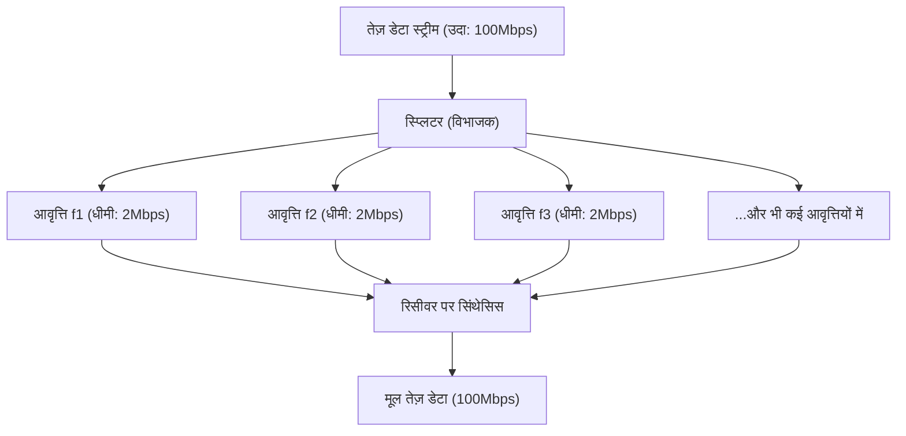

## 1. हवा में तैरता अदृश्य सूचना जाल

हम हर दिन अपने स्मार्टफोन पर उच्च गुणवत्ता वाले YouTube वीडियो देखते हैं, भारी फाइलें डाउनलोड करते हैं, और ऑनलाइन गेम का आनंद लेते हैं। हालाँकि, उन स्मार्टफ़ोन से कोई केबल नहीं जुड़ी होती है।
सारा डेटा "वाई-फाई (वायरलेस लैन)" नामक अदृश्य रेडियो तरंगों पर सवार होकर हवा में उड़ता है और राउटर में समा जाता है।

0 और 1 के डिजिटल डेटा (बिट्स) का संग्रह होने के नाते, वीडियो और चित्र कैसे "रेडियो तरंगों" में परिवर्तित होते हैं, दीवारों से गुजरते हैं, और अन्य तरंगों के साथ बिना मिले सटीक रूप से पहुंचते हैं? यहां संचार इंजीनियरिंग का वह चरम रूप देखने को मिलता है, जिसमें एनालॉग भौतिक तरंगों और डिजिटल कंप्यूटिंग का अद्भुत संगम होता है।

## 2. रेडियो तरंगों पर सूचना "सवार" करना: मॉड्यूलेशन (Modulation)

रेडियो तरंगें प्रकाश और एक्स-रे की तरह "विद्युत चुम्बकीय तरंगों (Electromagnetic waves)" का एक प्रकार हैं। ये केवल ऊर्जा की तरंगें हैं जो अंतरिक्ष में लहरों के रूप में आगे बढ़ती हैं।
इन तरंगों को "अर्थ (सूचना)" प्रदान करने की प्रक्रिया को "**मॉड्यूलेशन (Modulation)**" कहा जाता है।

सबसे प्रारंभिक मॉड्यूलेशन "मोर्स कोड" की तरह है जो तरंगों को उत्सर्जित करता है और रोकता है। लेकिन वह बहुत धीमा है। आधुनिक वाई-फाई तरंगों के गुणों को अत्यंत सटीकता के साथ नियंत्रित करके भारी मात्रा में डेटा पैक करता है। तरंगों के तीन मुख्य गुण होते हैं:

1. **आयाम (Amplitude)**: तरंग की ऊंचाई। बड़ी है या छोटी।
2. **आवृत्ति (Frequency)**: तरंग की गति (अंतराल)। सघन है या फैली हुई।
3. **कला (Phase)**: तरंग का समय। क्या तरंग की प्रारंभिक स्थिति में कोई बदलाव (Shift) है।

नवीनतम वाई-फाई (जैसे वाई-फाई 5, 6, 7) मुख्य रूप से "**QAM (क्वाड्रेचर एम्प्लिट्यूड मॉड्यूलेशन: Quadrature Amplitude Modulation)**" नामक उन्नत तकनीक का उपयोग करते हैं।
यह एक ऐसी तकनीक है जो एक ही समय में तरंग के "आयाम (ऊंचाई)" और "कला (बदलाव)" दोनों को बदलकर, तरंग के एक दोलन में 0 और 1 के कई संयोजनों को व्यक्त करती है।

उदाहरण के लिए, "256-QAM" मानक, तरंग की ऊंचाई और बदलाव के संयोजनों के 256 पैटर्न ($2^8$) को परिभाषित करता है। दूसरे शब्दों में, तरंग के सिर्फ एक बार पहुंचने से एक साथ "00110101" जैसे 8 बिट (1 बाइट) डेटा को ले जाया जा सकता है। नवीनतम वाई-फाई 7 "4096-QAM" तक पहुंच गया है, जो एक ही तरंग में 12 बिट डेटा ले जाता है।

## 3. बाधाओं के प्रति प्रतिरोध का रहस्य: OFDM (ऑर्थोगोनल फ्रीक्वेंसी डिवीजन मल्टीप्लेक्सिंग)

वाई-फाई रेडियो तरंगें घर की दीवारों, फर्नीचर और मानव शरीर से टकराते हुए आगे बढ़ती हैं।
दीवारों से परावर्तित होने वाली रेडियो तरंगें सीधे पहुंचने वाली तरंगों की तुलना में थोड़ी देर से एंटेना तक पहुंचती हैं (मल्टीपाथ घटना)। इससे, देर से आने वाली तरंगें और सीधे पहुंचने वाली तरंगें एक दूसरे के साथ हस्तक्षेप करती हैं, जिससे तरंग का आकार पूरी तरह से बिगड़ जाता है। यह उसी घटना के समान है जैसे पहाड़ों में "याहू" चिल्लाने पर अलग-अलग दिशाओं से परावर्तित ध्वनियाँ अलग-अलग समय पर सुनाई देती हैं, जिससे यह समझना मुश्किल हो जाता है कि क्या कहा जा रहा है।

इस गंभीर कमजोरी को "**OFDM (Orthogonal Frequency Division Multiplexing)**" नामक एक अद्भुत गणितीय दृष्टिकोण से दूर किया गया।

OFDM एक बहुत तेज़ डेटा प्रवाह को **कई धीमे डेटा प्रवाहों में विभाजित** करता है, और उन्हें थोड़ी अलग आवृत्तियों (सबकैरियर्स) पर रखकर एक साथ संचारित करता है।

पैकेज डिलीवरी के उदाहरण से समझें, तो यह ऐसा है जैसे एक फेरारी (तेज़ लेकिन दुर्घटना-प्रवण) में सारे पैकेज भरकर तेज़ गति से दौड़ाने के बजाय 50 ट्रकों (धीमे लेकिन स्थिर) में पैकेज बाँटकर उन्हें एक साथ रवाना कर दिया जाए।
चूंकि प्रत्येक तरंग की गति धीमी हो जाती है, इसलिए यदि दीवारों से परावर्तित होकर थोड़ी देर से पहुंचने वाली तरंग (प्रतिध्वनि या इको) मिल भी जाए, तो आगे-पीछे के डेटा के ओवरलैप होने की संभावना नाटकीय रूप से कम हो जाती है, और इसे बिना किसी त्रुटि के पुनर्प्राप्त किया जा सकता है।

## 4. 2.4GHz बैंड और 5GHz बैंड की भौतिक विशेषताओं में अंतर

जब आप एक वाई-फाई राउटर खरीदते हैं, तो आप ध्यान देंगे कि हमेशा "2.4GHz" और "5GHz" (और हाल ही में 6GHz भी) के दो नेटवर्क मौजूद होते हैं। विद्युत चुम्बकीय तरंगों के भौतिक गुणों में अंतर के कारण, इनके अपने अलग-अलग स्पष्ट फायदे और नुकसान हैं।

* **2.4GHz बैंड (लंबी तरंग दैर्ध्य)**
  * **फायदे**: चूंकि तरंग दैर्ध्य लंबी होती है, इसलिए इसमें बाधाओं (दीवारों और फर्श) के चारों ओर मुड़ने (विवर्तन) की मजबूत प्रवृत्ति होती है, जिससे रेडियो तरंगों का पूरे घर में दूर तक पहुंचना आसान हो जाता है।
  * **नुकसान**: ब्लूटूथ और माइक्रोवेव ओवन जैसे कई उपकरण समान आवृत्ति का उपयोग करते हैं, जिससे हस्तक्षेप के कारण गति धीमी होने या कनेक्शन कटने का खतरा रहता है।

* **5GHz बैंड (छोटी तरंग दैर्ध्य)**
  * **फायदे**: प्रयोग करने योग्य बैंडविड्थ (रास्ते की चौड़ाई) विस्तृत है और यह लगभग वाई-फाई के लिए ही समर्पित बैंड है, इसलिए हस्तक्षेप बहुत कम होता है और अत्यधिक उच्च गति वाला संचार संभव होता है।
  * **नुकसान**: छोटी तरंग दैर्ध्य के कारण, इसकी सीधी रेखा में चलने की प्रवृत्ति उच्च होती है, और यह आसानी से दीवारों जैसी बाधाओं से अवशोषित या परावर्तित हो जाती है। जब आप राउटर से दूर किसी कमरे में या किसी अन्य मंजिल पर जाते हैं तो रेडियो तरंगें तेजी से कमजोर हो जाती हैं।

उद्देश्य के अनुसार उचित रूप से इनका उपयोग करना (या राउटर को स्वचालित रूप से इन्हें स्विच करने देना) एक आरामदायक वाई-फाई वातावरण बनाने का आधार है।

## 5. "MIMO" - मल्टीपल एंटेना के साथ गति को दोगुना करना

आधुनिक राउटर में कई एंटेना लगे होने (या अंतर्निहित होने) का कारण केवल रेडियो तरंगों को दूर तक भेजना नहीं है। यह "**MIMO (माईमो: Multiple-Input and Multiple-Output)**" नामक एक जादुई तकनीक का उपयोग करने के लिए है।

अतीत में, भले ही कई एंटेना होते थे, उनका उपयोग मुख्य रूप से एक ही डेटा संचारित करके त्रुटियों को कम करने (डाइवर्सिटी) के लिए ही किया जा सकता था।
लेकिन MIMO अंतरिक्ष की विशेषताओं (दीवारों से रेडियो तरंगों का परावर्तित होना और अलग-अलग रास्तों से गुजरना) का फायदा उठाता है, और **एक ही समय में एक ही आवृत्ति पर विभिन्न एंटेना से पूरी तरह से अलग डेटा संचारित करता है**।

सामान्य तौर पर इससे हस्तक्षेप होगा और सब कुछ गड़बड़ हो जाएगा, लेकिन रिसीवर की ओर मौजूद कई एंटेना और उन्नत कम्प्यूटेशनल प्रोसेसिंग की मदद से, स्थानिक रूप से मिश्रित तरंगों को युगपत समीकरणों को हल करने की तरह अलग और निकाला जाता है। इसके परिणामस्वरूप, फ्रीक्वेंसी बैंडविड्थ (रास्ते की चौड़ाई) का विस्तार किए बिना, केवल एंटेना की संख्या को 2 से 4 तक बढ़ाकर, संचार की गति को भौतिक रूप से 2 या 4 गुना तक बढ़ाया जा सकता है।

## 6. निष्कर्ष: अंतरिक्ष की गणना का युग

जिस वाई-फाई का हम आमतौर पर अनजाने में उपयोग करते हैं, वह मानव ज्ञान के एकीकरण पर बना है: "विद्युत चुम्बकीय तरंगों के आकार को बदलने की मॉड्यूलेशन तकनीक (QAM)," "तरंगों को विभाजित करके हस्तक्षेप को रोकने के लिए गणितीय प्रसंस्करण (OFDM)," और "अंतरिक्ष के परावर्तन का उपयोग करके संचार की मात्रा को दोगुना करने वाली एंटीना तकनीक (MIMO)।"

वाई-फाई मानक वाई-फाई 4 (11n) से वाई-फाई 5 (11ac), वाई-फाई 6 (11ax), और अंततः वाई-फाई 7 (11be) के रूप में विकसित होते रहे हैं, और संचार गति शुरुआती कुछ Mbps से बढ़कर अब दसियों Gbps तक पहुंच गई है, जो कि दसियों हज़ार गुना वृद्धि है।
अदृश्य स्थान को गणित और भौतिकी के साथ सटीकता से विभाजित करके उसमें जानकारी भरकर ले जाना। वाई-फाई वास्तव में एक ऐसी तकनीक है जिसे आधुनिक युग का जादू कहा जा सकता है。
