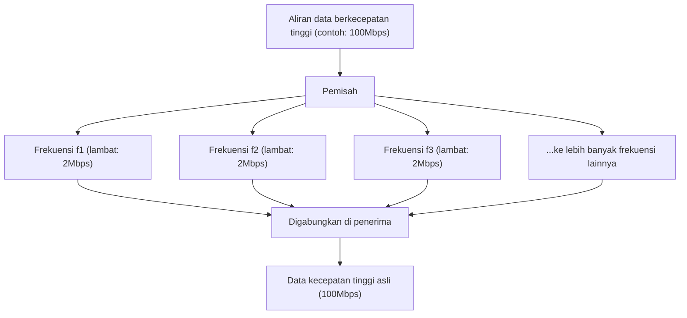

## 1. Jaringan Informasi Tak Terlihat yang Melayang di Udara

Setiap hari, kita menonton video YouTube berkualitas tinggi, mengunduh file besar, dan menikmati game online di ponsel pintar kita. Namun, tidak ada satu kabel pun yang terhubung ke ponsel tersebut.
Semua data menaiki gelombang radio tak terlihat yang disebut "Wi-Fi (Wireless LAN)", beterbangan di udara, dan tersedot ke dalam router.

Bagaimana video dan gambar, yang merupakan kumpulan data digital (bit) 0 dan 1, diubah menjadi "gelombang radio", menembus dinding, dan tiba secara akurat tanpa bercampur dengan gelombang radio lainnya? Di situlah terletak bentuk pamungkas dari teknik komunikasi, di mana bentuk gelombang fisik analog dan teori komputasi digital menyatu dengan indah.

## 2. "Menumpangkan" Informasi pada Gelombang Radio: Modulasi (Modulation)

Gelombang radio adalah sejenis "gelombang elektromagnetik", sama seperti cahaya dan sinar-X. Mereka hanyalah gelombang energi yang merambat sambil bergelombang di udara.
Proses memberikan "makna (informasi)" pada gelombang ini disebut "**Modulasi (Modulation)**".

Modulasi yang paling primitif mirip dengan "kode Morse", yang memancarkan dan menghentikan gelombang. Namun, hal itu terlalu lambat. Wi-Fi modern mengemas jumlah data yang sangat besar dengan mengontrol sifat-sifat gelombang secara presisi. Terdapat 3 sifat gelombang:

1. **Amplitudo (Amplitude)**: Tinggi gelombang. Besar atau kecil.
2. **Frekuensi (Frequency)**: Kecepatan gelombang (interval). Rapat atau renggang.
3. **Fase (Phase)**: Waktu gelombang. Apakah titik awal gelombang bergeser.

Pada Wi-Fi terbaru (seperti Wi-Fi 5, 6, 7), teknologi canggih yang disebut "**QAM (Modulasi Amplitudo Kuadratur: Quadrature Amplitude Modulation)**" sering digunakan.
Ini adalah teknologi yang mengekspresikan beberapa kombinasi 0 dan 1 dalam satu ayunan gelombang dengan mengubah "amplitudo (tinggi)" dan "fase (pergeseran)" gelombang secara bersamaan.

Misalnya, standar "256-QAM" mendefinisikan 256 pola ($2^8$) kombinasi tinggi dan pergeseran gelombang. Artinya, hanya dengan satu kedatangan gelombang, data 8-bit (1 byte) seperti "00110101" dapat dikirim sekaligus. Wi-Fi 7 terbaru telah mencapai "4096-QAM", membawa data sebanyak 12-bit dalam satu gelombang.

## 3. Rahasia Tahan Terhadap Rintangan: OFDM (Orthogonal Frequency Division Multiplexing)

Gelombang radio Wi-Fi merambat sambil menabrak dinding, furnitur, dan tubuh manusia di dalam rumah.
Gelombang radio yang dipantulkan dari dinding mencapai antena sedikit lebih lambat daripada gelombang radio yang tiba secara langsung (fenomena multipath). Akibatnya, gelombang yang datang terlambat dan gelombang yang datang langsung saling berinterferensi, dan bentuk gelombang menjadi hancur berantakan. Ini adalah fenomena yang sama dengan ketika Anda berteriak "Halo" di gunung, suara pantulan terdengar tertunda dari berbagai arah, sehingga Anda tidak dapat memahami apa yang dikatakan.

Kelemahan fatal ini diatasi oleh pendekatan matematis yang luar biasa yang disebut "**OFDM (Orthogonal Frequency Division Multiplexing)**".

OFDM membagi satu aliran data yang sangat cepat menjadi **banyak aliran data yang lebih lambat**, dan mengirimkannya secara bersamaan dengan menumpangkannya pada frekuensi (subcarrier) yang sedikit berbeda satu sama lain.

Jika diibaratkan dengan pengiriman paket, alih-alih memuat semua paket ke dalam satu Ferrari (cepat tetapi rentan kecelakaan) dan memacunya, itu seperti mendistribusikan paket ke dalam 50 truk (lambat tetapi stabil) dan memberangkatkannya secara bersamaan.
Karena kecepatan setiap gelombang melambat, bahkan jika gelombang yang dipantulkan dari dinding tiba dengan sedikit keterlambatan (gema) dan bercampur, kemungkinan tumpang tindih dengan data sebelum dan sesudahnya menurun drastis, sehingga dapat dipulihkan tanpa kesalahan.

## 4. Perbedaan Karakteristik Fisik Antara Pita 2.4GHz dan 5GHz

Ketika Anda membeli router Wi-Fi, Anda akan selalu menyadari bahwa ada dua jaringan yang tersedia: "2.4GHz" dan "5GHz" (dan baru-baru ini 6GHz). Mereka memiliki kelebihan dan kekurangan yang jelas tergantung pada perbedaan sifat fisik gelombang elektromagnetik.

* **Pita 2.4GHz (Panjang gelombang panjang)**
  * **Kelebihan**: Karena panjang gelombangnya panjang, ia memiliki sifat yang kuat untuk melentur di sekitar rintangan (dinding atau lantai) (difraksi), sehingga gelombang radio mudah menjangkau jauh ke seluruh bagian rumah.
  * **Kekurangan**: Ada sangat banyak perangkat yang menggunakan frekuensi yang sama, seperti Bluetooth dan oven microwave, sehingga rentan mengalami penurunan kecepatan atau terputus akibat interferensi.

* **Pita 5GHz (Panjang gelombang pendek)**
  * **Kelebihan**: Pita (lebar jalan) yang dapat digunakan lebar, dan karena ini adalah pita yang hampir khusus untuk Wi-Fi, interferensinya lebih sedikit dan kecepatan komunikasinya sangat tinggi.
  * **Kekurangan**: Karena panjang gelombangnya pendek, tingkat kelurusannya sangat tinggi sehingga mudah diserap atau dipantulkan oleh rintangan seperti dinding. Ketika Anda menjauh dari router ke ruangan lain atau melintasi lantai, gelombang radio akan melemah secara drastis.

Menggunakan ini dengan bijak (atau membiarkan router beralih secara otomatis) sesuai dengan tujuan Anda merupakan dasar dalam membangun lingkungan Wi-Fi yang nyaman.

## 5. Menggandakan Kecepatan dengan Berbagai Antena: "MIMO"

Alasan mengapa router modern memiliki banyak antena (atau terpasang di dalamnya) bukan hanya untuk memancarkan gelombang radio lebih jauh. Ini untuk menggunakan teknologi ajaib yang disebut "**MIMO (Multiple-Input and Multiple-Output)**".

Di masa lalu, meskipun ada banyak antena, hal itu hanya dapat digunakan untuk mengirim data yang sama untuk mengurangi kesalahan (diversity).
Namun, MIMO memanfaatkan karakteristik ruang sebaliknya (fakta bahwa gelombang radio dipantulkan dari dinding dan mengambil berbagai rute) untuk **mengirimkan data yang sama sekali berbeda dari antena yang berbeda pada saat yang sama dan pada frekuensi yang sama**.

Biasanya hal ini akan menyebabkan interferensi dan kekacauan, tetapi melalui beberapa antena di sisi penerima dan pemrosesan komputasi tingkat lanjut, gelombang yang bercampur secara spasial dipisahkan dan diekstraksi seolah-olah menyelesaikan persamaan simultan. Dengan ini, hanya dengan menambah jumlah antena menjadi 2 atau 4 tanpa memperlebar pita frekuensi (lebar jalan), kecepatan komunikasi dapat ditingkatkan secara fisik menjadi 2 atau 4 kali lipat.

## 6. Kesimpulan: Memasuki Era Komputasi Ruang

Wi-Fi, yang sering kita gunakan dengan santai, dibangun berdasarkan gabungan kebijaksanaan manusia: "teknologi modulasi (QAM) yang mengubah bentuk gelombang elektromagnetik", "pemrosesan matematis (OFDM) yang membagi gelombang untuk mencegah interferensi", dan "teknologi antena (MIMO) yang menggandakan volume komunikasi menggunakan pantulan spasial".

Standar Wi-Fi terus berkembang dari Wi-Fi 4 (11n) ke Wi-Fi 5 (11ac), Wi-Fi 6 (11ax), dan Wi-Fi 7 (11be), dengan kecepatan komunikasi yang meningkat puluhan ribu kali lipat dari beberapa Mbps pada tahap awal menjadi puluhan Gbps.
Memotong ruang tak terlihat secara akurat dengan matematika dan fisika, serta mengemas informasi untuk membawanya. Wi-Fi benar-benar sebuah teknologi yang layak disebut sebagai keajaiban modern.
