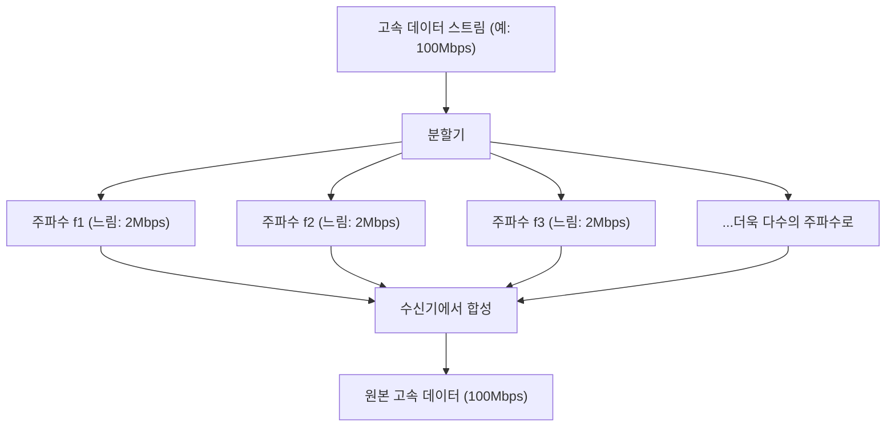

## 1. 공중을 오가는 눈에 보이지 않는 정보망

우리는 매일 스마트폰으로 고화질 유튜브 영상을 보거나 무거운 파일을 다운로드하고, 온라인 게임을 즐깁니다. 하지만 그 스마트폰에는 케이블이 단 한 줄도 연결되어 있지 않습니다.
모든 데이터는 '와이파이(무선 LAN)'라는 보이지 않는 전파를 타고 공중의 공간을 날아다니며 라우터로 빨려 들어갑니다.

0과 1의 디지털 데이터(비트)의 집합체인 영상이나 이미지가 어떻게 '전파의 파동'으로 변환되어 벽을 통과하고, 다른 전파와 섞이지 않고 정확하게 도착할 수 있을까요? 그곳에는 아날로그의 물리 파형과 디지털의 계산론이 훌륭하게 융합된 통신 공학의 궁극적인 모습이 있습니다.

## 2. 전파에 정보를 '싣다': 변조(Modulation)

전파는 빛이나 X선과 같은 '전자기파'의 일종입니다. 그저 공간을 파도치며 나아가는 에너지의 파동일 뿐입니다.
이 파동에 '의미(정보)'를 부여하는 작업을 **변조(Modulation)** 라고 부릅니다.

가장 원시적인 변조는 파동을 내거나 멈추는 '모스 부호'와 같은 것입니다. 하지만 그것으로는 너무 느립니다. 현대의 와이파이는 파동의 성질을 매우 정교하게 제어함으로써 압도적인 데이터 양을 채워 넣고 있습니다. 파동의 성질에는 다음의 3가지가 있습니다.

1. **진폭(Amplitude)** : 파동의 높이. 큰지 작은지.
2. **주파수(Frequency)** : 파동의 속도(간격). 빽빽한지, 퍼져 있는지.
3. **위상(Phase)** : 파동의 타이밍. 파동의 시작 위치가 어긋나 있는지.

최신 와이파이(Wi-Fi 5, 6, 7 등)에서는 주로 **QAM(직교 진폭 변조: Quadrature Amplitude Modulation)** 이라는 고도화된 기술이 사용되고 있습니다.
이는 파동의 '진폭(높이)'과 '위상(어긋남)'의 두 가지를 동시에 변화시킴으로써 1번의 파동 흔들림 속에 여러 개의 0과 1의 조합을 표현하는 기술입니다.

예를 들어 '256-QAM'이라는 규격에서는 파동의 높이와 어긋남의 조합을 256가지 패턴($2^8$)으로 정의하고 있습니다. 즉, 파동이 1번 도착하는 것만으로 '00110101'과 같은 8비트(1바이트)의 데이터를 한 번에 운반할 수 있는 것입니다. 최신 와이파이 7에서는 '4096-QAM'에 달하며, 1번의 파동으로 12비트의 데이터를 운반하고 있습니다.

## 3. 장애물에 강한 비밀: OFDM(직교 주파수 분할 다중 방식)

와이파이 전파는 집 안의 벽, 가구, 인체 등에 부딪히며 나아갑니다.
벽에 반사된 전파는 곧장 도착한 전파보다 조금 늦게 안테나에 도달합니다(다중 경로 현상). 그러면 늦게 온 파동과 직접 도착한 파동이 서로 간섭하여 파형이 엉망으로 부서지게 됩니다. 산에서 '야호' 하고 외치면 다양한 방향에서 반사음이 어긋나게 들려와서 무슨 말을 하는지 알 수 없게 되는 것과 같은 현상입니다.

이 치명적인 약점을 극복한 것이 **OFDM(Orthogonal Frequency Division Multiplexing)** 이라는 경이로운 수학적 접근입니다.

OFDM은 1개의 매우 빠른 데이터 흐름을 **다수의 느린 데이터 흐름으로 분할** 하고, 각각을 조금씩 다른 주파수(서브캐리어)에 실어 동시에 전송합니다.

화물 배달에 비유하자면, 1대의 페라리(고속이지만 사고에 취약함)에 모든 화물을 싣고 질주하게 하는 것이 아니라, 50대의 트럭(저속이지만 안정적임)에 화물을 분산시켜 동시에 출발시키는 것과 같습니다.
개별 파동의 속도가 느려지기 때문에 벽에 반사되어 조금 늦게 도착하는 파동(에코)이 섞이더라도 앞뒤 데이터와 겹칠 확률이 극적으로 낮아져 오류 없이 복원할 수 있게 됩니다.

## 4. 2.4GHz 대역과 5GHz 대역의 물리적 특성 차이

와이파이 라우터를 사면 반드시 '2.4GHz'와 '5GHz'(최근에는 6GHz도)의 2가지 네트워크가 존재한다는 것을 알게 됩니다. 이들은 전자기파의 물리적인 성질 차이로 인해 명확한 장단점이 있습니다.

* **2.4GHz 대역(파장이 긺)** 
  * **장점** : 파장이 길기 때문에 장애물(벽이나 바닥)을 돌아서 나아가는 성질(회절)이 강해 집 안 멀리까지 전파가 닿기 쉽다.
  * **단점** : 블루투스나 전자레인지 등 같은 주파수를 사용하는 기기가 매우 많아, 혼선으로 인한 속도 저하나 끊김이 발생하기 쉽다.

* **5GHz 대역(파장이 짧음)** 
  * **장점** : 사용할 수 있는 대역(도로 폭)이 넓고, 와이파이 전용에 가까운 대역이기 때문에 혼선이 적어 압도적인 고속 통신이 가능하다.
  * **단점** : 파장이 짧기 때문에 직진성이 강해 벽 등 장애물에 흡수 및 반사되기 쉽다. 라우터에서 떨어진 방이나 층을 건너면 급격하게 전파가 약해진다.

목적에 따라 이들을 구분해서 사용하는(또는 라우터가 자동으로 전환하게 하는) 것이 쾌적한 와이파이 환경 구축의 기본이 됩니다.

## 5. 다중 안테나로 속도를 배증시키는 'MIMO'

현대의 라우터에 여러 개의 안테나가 세워져 있는(또는 내장되어 있는) 것은 단순히 전파를 멀리 날려 보내기 위해서만이 아닙니다. **MIMO(마이모: Multiple-Input and Multiple-Output)** 라는 마법 같은 기술을 사용하기 위해서입니다.

기존에는 안테나가 여러 개 있어도 같은 데이터를 전송하여 오류를 줄이는(다이버시티) 정도로밖에 사용할 수 없었습니다.
하지만 MIMO는 공간의 특성(전파가 벽에 반사되어 다양한 경로를 통과하는 것)을 역이용하여 **다른 안테나에서 전혀 다른 데이터를 동시에 같은 주파수로 전송** 합니다.

보통이라면 혼선되어 엉망이 되겠지만, 수신 측의 다중 안테나와 고도의 연산 처리를 통해 공간적으로 섞인 파동을 연립방정식을 풀듯이 분리 및 추출합니다. 이를 통해 주파수 대역(도로 폭)을 넓히지 않고도 안테나의 수를 2개, 4개로 늘리는 것만으로 통신 속도를 물리적으로 2배, 4배로 끌어올릴 수 있는 것입니다.

## 6. 요약: 공간을 계산하는 시대로

우리가 평소 무심코 이용하는 와이파이는 '전자기파의 파형을 변형시키는 변조 기술(QAM)', '파동을 분할하여 간섭을 방지하는 수학적 처리(OFDM)', '공간의 반사를 이용하여 통신량을 배증시키는 안테나 기술(MIMO)'이라는 인류 영지의 결집으로 이루어져 있습니다.

와이파이 규격은 Wi-Fi 4(11n)에서 Wi-Fi 5(11ac), Wi-Fi 6(11ax), 그리고 Wi-Fi 7(11be)로 계속 진화하고 있으며, 통신 속도는 초기의 수 Mbps에서 수십 Gbps로 수만 배의 진화를 이루었습니다.
보이지 않는 공간을 수학과 물리로 정확하게 잘라내고, 정보를 빽빽하게 깔아 운반한다. 와이파이는 그야말로 현대의 마법이라 부르기에 손색이 없는 기술인 것입니다.
