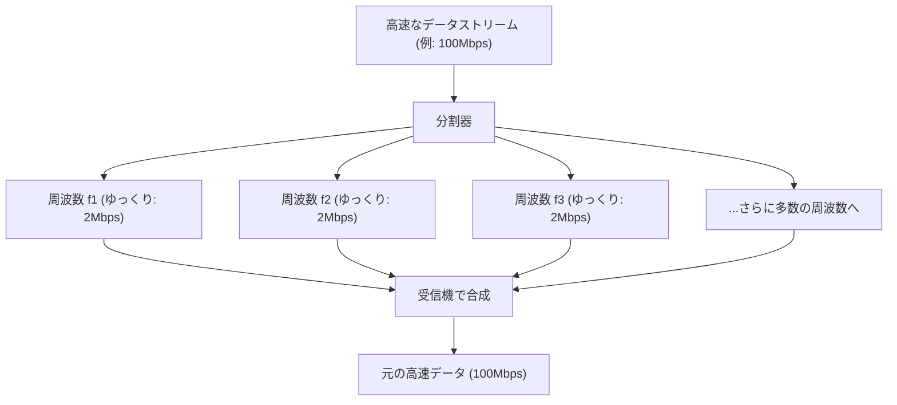

## 1. 空中を飛び交う目に見えない情報網

私たちは毎日、スマートフォンで高画質のYouTube動画を見たり、重いファイルをダウンロードしたり、オンラインゲームを楽しんだりしています。しかし、そのスマホにはケーブルが1本も繋がっていません。
すべてのデータは「Wi-Fi（無線LAN）」という見えない電波に乗って、空中の空間を飛び交い、ルーターへと吸い込まれていきます。

0と1のデジタルデータ（ビット）の集合体である動画や画像が、どのようにして「電波の波」に変換され、壁をすり抜け、他の電波と混ざることなく正確に届くのでしょうか。そこには、アナログの物理波形とデジタルの計算論が見事に融合した、通信工学の究極の姿があります。

## 2. 電波に情報を「乗せる」：変調（Modulation）

電波は、光やX線と同じ「電磁波」の一種です。ただ空間を波打ちながら進むだけのエネルギーの波にすぎません。
この波に「意味（情報）」を持たせる作業を「**変調（Modulation）**」と呼びます。

最も原始的な変調は、波を出したり止めたりする「モールス信号」のようなものです。しかし、それではあまりにも遅すぎます。現代のWi-Fiは、波の性質を極めて精緻にコントロールすることで、圧倒的なデータ量を詰め込んでいます。波の性質には以下の3つがあります。

1. **振幅（Amplitude）**：波の高さ。大きいか小さいか。
2. **周波数（Frequency）**：波の速さ（間隔）。詰まっているか、広がっているか。
3. **位相（Phase）**：波のタイミング。波のスタート位置がズレているか。

最新のWi-Fi（Wi-Fi 5, 6, 7など）では、主に「**QAM（直交振幅変調：Quadrature Amplitude Modulation）**」という高度な技術が使われています。
これは、波の「振幅（高さ）」と「位相（ズレ）」の2つを同時に変化させることで、1回の波の揺れの中に複数の0と1の組み合わせを表現する技術です。

たとえば「256-QAM」という規格では、波の高さとズレの組み合わせを256パターン（$2^8$）定義しています。つまり、波が1回届くだけで「00110101」のような8ビット（1バイト）のデータを一度に運ぶことができるのです。最新のWi-Fi 7では「4096-QAM」に達し、1回の波で12ビットものデータを運んでいます。

## 3. 障害物に強い秘密：OFDM（直交周波数分割多重方式）

Wi-Fiの電波は、家の中の壁、家具、人体などにぶつかりながら進みます。
壁に反射した電波は、真っ直ぐ届いた電波よりも少し遅れてアンテナに到達します（マルチパス現象）。すると、遅れてきた波と直接届いた波が干渉し合い、波形がグチャグチャに壊れてしまいます。山で「ヤッホー」と叫ぶと、様々な方向から反射音がズレて聞こえてきて、何を言っているか分からなくなるのと同じ現象です。

この致命的な弱点を克服したのが「**OFDM（Orthogonal Frequency Division Multiplexing）**」という驚異的な数学的アプローチです。

OFDMは、1つの非常に速いデータの流れを、**多数のゆっくりとしたデータの流れに分割**し、それぞれを少しずつ異なる周波数（サブキャリア）に乗せて同時に送信します。

荷物の配達に例えるなら、1台のフェラーリ（高速だが事故に弱い）に全ての荷物を積んで爆走させるのではなく、50台のトラック（低速だが安定）に荷物を分散させて同時に出発させるようなものです。
個々の波の速度がゆっくりになるため、壁に反射して少し遅れて届く波（エコー）が混ざっても、前後のデータと被る確率が劇的に下がり、エラーなく復元できるようになります。

## 4. 2.4GHz帯と5GHz帯の物理的特性の違い

Wi-Fiルーターを買うと、必ず「2.4GHz」と「5GHz」（最近では6GHzも）の2つのネットワークが存在することに気づきます。これらは電磁波の物理的な性質の違いによって、明確な得意・不得意があります。

* **2.4GHz帯（波長が長い）**
  * **メリット**：波長が長いため、障害物（壁や床）を回り込んで進む性質（回折）が強く、家中の遠くまで電波が届きやすい。
  * **デメリット**：Bluetoothや電子レンジなど、同じ周波数を使う機器が非常に多く、混信による速度低下や切断が起きやすい。

* **5GHz帯（波長が短い）**
  * **メリット**：使える帯域（道幅）が広く、Wi-Fi専用に近い帯域であるため、混信が少なく圧倒的な高速通信が可能。
  * **デメリット**：波長が短いため直進性が高く、壁などの障害物に吸収・反射されやすい。ルーターから離れた部屋や階を跨ぐと急激に電波が弱くなる。

目的に応じてこれらを使い分ける（あるいはルーターに自動で切り替えさせる）ことが、快適なWi-Fi環境構築の基本となります。

## 5. 複数アンテナで速度を倍増させる「MIMO」

現代のルーターに何本ものアンテナが立っている（または内蔵されている）のは、単に電波を遠くに飛ばすためだけではありません。「**MIMO（マイモ：Multiple-Input and Multiple-Output）**」という魔法のような技術を使うためです。

従来は、アンテナが複数あっても、同じデータを送信してエラーを減らす（ダイバーシティ）程度にしか使えませんでした。
しかしMIMOは、空間の特性（電波が壁に反射して様々な経路を通ること）を逆手に取り、**異なるアンテナから全く別のデータを同時に同じ周波数で送信**します。

通常なら混信してグチャグチャになるところですが、受信側の複数アンテナと高度な演算処理により、空間的に混ざり合った波を連立方程式を解くようにして分離・抽出します。これにより、周波数の帯域（道幅）を広げることなく、アンテナの数を2本、4本と増やすだけで、通信速度を物理的に2倍、4倍へと引き上げることができるのです。

## 6. まとめ：空間を計算する時代へ

私たちが普段何気なく利用しているWi-Fiは、「電磁波の波形を変形させる変調技術（QAM）」「波を分割して干渉を防ぐ数学的処理（OFDM）」「空間の反射を利用して通信量を倍増させるアンテナ技術（MIMO）」という、人類の英知の結集によって成り立っています。

Wi-Fiの規格は、Wi-Fi 4(11n)からWi-Fi 5(11ac)、Wi-Fi 6(11ax)、そしてWi-Fi 7(11be)へと進化を続けており、通信速度は初期の数Mbpsから、数十Gbpsへと、数万倍もの進化を遂げました。
見えない空間を数学と物理で正確に切り刻み、情報を敷き詰めて運ぶ。Wi-Fiは、まさに現代の魔法と呼ぶにふさわしいテクノロジーなのです。