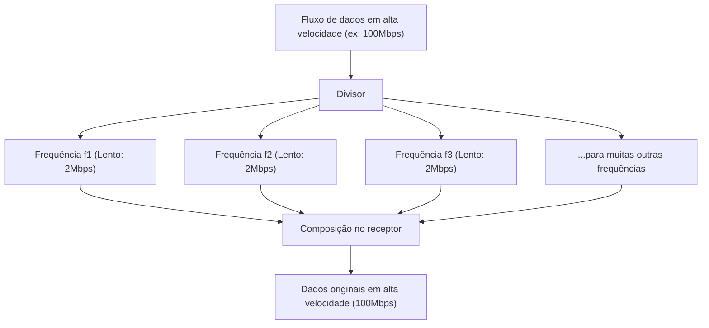

## 1. A Rede de Informação Invisível Voando pelo Ar

Todos os dias, assistimos a vídeos de alta qualidade no YouTube em nossos smartphones, baixamos arquivos pesados e jogamos online. No entanto, não há um único cabo conectado ao smartphone.
Todos os dados circulam pelo espaço no ar em ondas de rádio invisíveis chamadas "Wi-Fi (Wireless LAN)" e são sugados pelo roteador.

Como vídeos e imagens, que são conjuntos de dados digitais (bits) de 0 e 1, são convertidos em "ondas de rádio", atravessam paredes e chegam com precisão sem se misturar com outras ondas de rádio? Aí está a forma definitiva da engenharia de telecomunicações, onde as formas de onda físicas analógicas e a teoria da computação digital estão maravilhosamente fundidas.

## 2. "Colocando" Informação nas Ondas de Rádio: Modulação (Modulation)

Ondas de rádio são um tipo de "onda eletromagnética", assim como a luz e os raios-X. Elas são apenas ondas de energia que avançam ondulando pelo espaço.
O processo de dar "significado (informação)" a essa onda é chamado de "**Modulação (Modulation)**".

A modulação mais primitiva é como o "código Morse", que emite e para as ondas. Porém, isso é lento demais. O Wi-Fi moderno empacota quantidades esmagadoras de dados controlando de forma extremamente precisa as propriedades das ondas. Existem as seguintes três propriedades das ondas:

1. **Amplitude (Amplitude)**: A altura da onda. Se é grande ou pequena.
2. **Frequência (Frequency)**: A velocidade (intervalo) da onda. Se estão próximas ou espalhadas.
3. **Fase (Phase)**: O tempo da onda. Se a posição inicial da onda está deslocada.

O Wi-Fi mais recente (como Wi-Fi 5, 6, 7) usa principalmente uma tecnologia avançada chamada "**QAM (Modulação de Amplitude em Quadratura: Quadrature Amplitude Modulation)**".
Esta é uma tecnologia que representa várias combinações de 0 e 1 dentro de uma única oscilação de onda, alterando simultaneamente a "amplitude (altura)" e a "fase (deslocamento)" da onda.

Por exemplo, em um padrão chamado "256-QAM", 256 padrões ($2^8$) de combinações de altura e deslocamento da onda são definidos. Em outras palavras, apenas a chegada de uma onda pode transportar de uma só vez dados de 8 bits (1 byte) como "00110101". O mais recente Wi-Fi 7 atinge "4096-QAM", transportando incríveis 12 bits de dados em uma única onda.

## 3. O Segredo da Resistência aos Obstáculos: OFDM (Multiplexação por Divisão de Frequências Ortogonais)

As ondas de rádio do Wi-Fi viajam enquanto esbarram em paredes, móveis, corpos humanos, etc. dentro de casa.
Ondas de rádio refletidas em uma parede atingem a antena um pouco mais tarde do que aquelas que chegam diretamente (fenômeno de múltiplos caminhos). Como resultado, a onda atrasada e a onda direta interferem uma na outra, e a forma de onda é totalmente destruída. É o mesmo fenômeno de quando você grita "Yoo-hoo!" em uma montanha, e os sons refletidos vêm de várias direções de forma assíncrona, tornando impossível entender o que foi dito.

Esse ponto fraco fatal foi superado por uma abordagem matemática fenomenal chamada "**OFDM (Orthogonal Frequency Division Multiplexing)**".

O OFDM **divide um único fluxo de dados muito rápido em vários fluxos de dados mais lentos** e os transmite simultaneamente sobre frequências levemente diferentes (subportadoras).

Usando uma analogia de entrega de pacotes, em vez de carregar todos os pacotes em uma única Ferrari (rápida, mas propensa a acidentes) e dirigir a toda velocidade, os pacotes são distribuídos em 50 caminhões (lentos, mas estáveis) que partem ao mesmo tempo.
Como a velocidade das ondas individuais se torna mais lenta, mesmo que uma onda refletida da parede que chega com um leve atraso (eco) se misture, a probabilidade de se sobrepor aos dados anteriores e posteriores cai drasticamente, permitindo a restauração sem erros.

## 4. Diferenças nas Propriedades Físicas das Bandas de 2.4GHz e 5GHz

Ao comprar um roteador Wi-Fi, você notará invariavelmente a existência de duas redes: "2.4GHz" e "5GHz" (recentemente, também 6GHz). Devido às diferenças em suas propriedades físicas como ondas eletromagnéticas, elas possuem vantagens e desvantagens distintas.

* **Banda de 2.4GHz (Comprimento de onda longo)**
  * **Vantagens**: Devido ao comprimento de onda longo, possui forte capacidade de contornar obstáculos (paredes e pisos) através da difração, facilitando o alcance do rádio longe em toda a casa.
  * **Desvantagens**: Há um número enorme de dispositivos usando a mesma frequência, como Bluetooth e fornos de micro-ondas, tornando-o propenso a quedas de velocidade e desconexões devido a interferências.

* **Banda de 5GHz (Comprimento de onda curto)**
  * **Vantagens**: Uma largura de banda (largura da via) utilizável maior e por ser uma banda quase exclusiva para Wi-Fi, apresenta pouca interferência e permite comunicações em altíssima velocidade.
  * **Desvantagens**: O comprimento de onda curto resulta em alta direcionalidade, sendo facilmente absorvido e refletido por obstáculos como paredes. As ondas de rádio enfraquecem rapidamente ao ir para salas distantes do roteador ou ao cruzar andares.

Usá-las de forma seletiva com base no propósito (ou deixar o roteador alternar automaticamente) é fundamental para construir um ambiente Wi-Fi confortável.

## 5. "MIMO": Dobrando a Velocidade com Múltiplas Antenas

A razão pela qual os roteadores modernos têm tantas antenas instaladas (ou embutidas) não é apenas para enviar ondas de rádio mais longe. É para usar uma tecnologia mágica chamada "**MIMO (Multiple-Input and Multiple-Output)**".

No passado, mesmo com múltiplas antenas, elas eram usadas, na melhor das hipóteses, para enviar os mesmos dados e reduzir erros (diversidade).
Porém, o MIMO aproveita a característica espacial (as ondas de rádio refletindo nas paredes e tomando várias rotas) para **transmitir simultaneamente dados completamente diferentes de diferentes antenas na mesma frequência**.

Normalmente, isso resultaria em interferência e bagunça, mas graças a múltiplas antenas no lado receptor e processamento aritmético avançado, as ondas espacialmente misturadas são separadas e extraídas como na resolução de equações simultâneas. Como resultado, sem expandir a banda de frequência (a largura da via), as velocidades de comunicação podem ser fisicamente aumentadas 2 a 4 vezes simplesmente aumentando o número de antenas para 2 ou 4.

## 6. Conclusão: Rumo a Uma Era de Computação Espacial

O Wi-Fi que usamos casualmente no nosso cotidiano é sustentado por uma combinação de sabedoria humana: "técnicas de modulação que alteram formas de onda eletromagnéticas (QAM)", "processamento matemático que divide ondas para prevenir interferências (OFDM)" e "tecnologia de antenas que dobra o tráfego usando a reflexão no espaço (MIMO)".

Os padrões Wi-Fi continuam a evoluir do Wi-Fi 4 (11n) para o Wi-Fi 5 (11ac), Wi-Fi 6 (11ax) e Wi-Fi 7 (11be), alcançando uma evolução de dezenas de milhares de vezes nas velocidades de comunicação, passando de alguns Mbps nos primórdios para dezenas de Gbps.
Dividindo o espaço invisível de forma precisa com matemática e física, e compactando e transportando informações, o Wi-Fi é uma tecnologia verdadeiramente digna de ser chamada de magia moderna.
