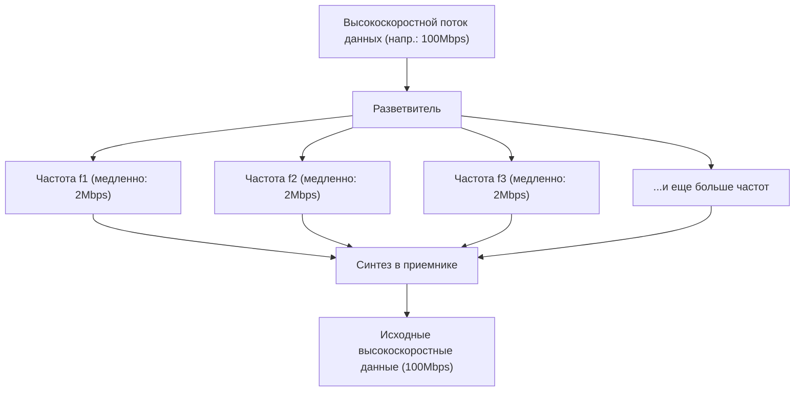

## 1. Невидимая информационная сеть, парящая в воздухе

Каждый день мы смотрим высококачественные видео на YouTube, скачиваем тяжелые файлы или наслаждаемся онлайн-играми на наших смартфонах. Однако к смартфону не подключено ни единого кабеля.
Все данные в виде невидимых радиоволн, называемых «Wi-Fi» (беспроводная локальная сеть), перемещаются в пространстве и поглощаются роутерами.

Как видео и изображения, представляющие собой совокупность цифровых данных (битов) из 0 и 1, преобразуются в «радиоволны», проходят сквозь стены и доходят с точностью, не смешиваясь с другими радиоволнами? За этим стоит высшая форма телекоммуникационной инженерии — идеальное слияние аналоговых физических сигналов и цифровой вычислительной теории.

## 2. «Посадка» информации на радиоволны: Модуляция (Modulation)

Радиоволны — это тип «электромагнитных волн», так же как свет или рентгеновские лучи. По сути, это просто волны энергии, которые распространяются в пространстве.
Процесс придания «смысла (информации)» этим волнам называется «**модуляцией (Modulation)**».

Самая примитивная модуляция подобна «азбуке Морзе», где волна включается и выключается. Но для наших целей это слишком медленно. В современном Wi-Fi огромные объемы данных упаковываются благодаря чрезвычайно точному контролю свойств волны. У волны есть три основных свойства:

1. **Амплитуда (Amplitude)**: Высота волны. Большая или маленькая.
2. **Частота (Frequency)**: Скорость (интервал) волн. Плотно сжатые или разнесенные.
3. **Фаза (Phase)**: Тайминг волны. Сдвинута ли начальная позиция волны.

В новейших стандартах Wi-Fi (Wi-Fi 5, 6, 7 и др.) в основном используется передовая технология «**QAM (Квадратурная амплитудная модуляция: Quadrature Amplitude Modulation)**».
Эта технология одновременно изменяет и «амплитуду (высоту)», и «фазу (сдвиг)» волны, что позволяет выразить несколько комбинаций 0 и 1 за одно колебание волны.

Например, в стандарте «256-QAM» определено 256 паттернов ($2^8$) комбинаций высоты и сдвига волны. Это означает, что одно получение волны позволяет сразу передать 8 битов (1 байт) данных, например «00110101». В новейшем стандарте Wi-Fi 7 достигается «4096-QAM», что позволяет передавать до 12 битов данных за одну волну.

## 3. Секрет устойчивости к препятствиям: OFDM (Мультиплексирование с ортогональным частотным разделением каналов)

Радиоволны Wi-Fi распространяются, сталкиваясь со стенами, мебелью и человеческими телами внутри дома.
Волны, отраженные от стен, достигают антенны с небольшим опозданием по сравнению с волнами, идущими напрямую (явление многолучевого распространения). В результате задержавшиеся и прямые волны интерферируют друг с другом, разрушая форму волны и превращая её в беспорядок. Это похоже на явление в горах: когда вы кричите «Ау!», эхо доносится с разных сторон с задержкой, и становится непонятно, что именно было сказано.

Эта критическая слабость была преодолена благодаря поразительному математическому подходу под названием «**OFDM (Orthogonal Frequency Division Multiplexing)**».

OFDM разделяет один очень быстрый поток данных на **множество медленных потоков данных**, каждый из которых передается одновременно на слегка отличающихся частотах (поднесущих).

Если сравнить это с доставкой посылок: вместо того чтобы загрузить все посылки в одну Ferrari (очень быструю, но склонную к авариям) и мчаться на полной скорости, вы распределяете посылки по 50 грузовикам (медленным, но стабильным), которые отправляются одновременно.
Поскольку скорость каждой отдельной волны невелика, даже если к ней примешивается волна (эхо), отразившаяся от стены и пришедшая с небольшим опозданием, вероятность перекрытия с предыдущими или последующими данными резко снижается, и данные могут быть восстановлены без ошибок.

## 4. Различия физических свойств диапазонов 2.4GHz и 5GHz

При покупке Wi-Fi роутера вы обязательно заметите, что существуют две сети: «2.4GHz» и «5GHz» (а в последнее время и 6GHz). Из-за различий в физических свойствах электромагнитных волн у них есть четкие сильные и слабые стороны.

* **Диапазон 2.4GHz (длинные волны)**
  * **Преимущества**: Из-за большой длины волны эти радиоволны обладают сильной способностью огибать препятствия (стены и полы), то есть высокой дифракцией, и легко распространяются на большие расстояния по всему дому.
  * **Недостатки**: Очень много устройств, таких как Bluetooth и микроволновые печи, используют ту же частоту, поэтому часто происходят снижение скорости и разрывы соединения из-за помех.

* **Диапазон 5GHz (короткие волны)**
  * **Преимущества**: Используемая полоса пропускания (ширина дороги) шире и почти полностью предназначена для Wi-Fi, что обеспечивает значительно меньше помех и подавляюще высокую скорость связи.
  * **Недостатки**: Из-за короткой длины волны они обладают высокой прямолинейностью и легко поглощаются или отражаются препятствиями, такими как стены. Радиосигнал резко слабеет в комнатах, удаленных от роутера, или при переходе между этажами.

Грамотное использование обоих диапазонов в зависимости от целей (или предоставление роутеру возможности автоматического переключения) является основой для создания комфортной среды Wi-Fi.

## 5. «MIMO», удваивающая скорость с помощью нескольких антенн

Наличие множества антенн (внешних или встроенных) на современных роутерах служит не только для передачи радиоволн на большие расстояния. Это сделано для использования магической технологии под названием «**MIMO (Маймо: Multiple-Input and Multiple-Output)**».

Раньше, даже при наличии нескольких антенн, их можно было использовать лишь для передачи одних и тех же данных с целью уменьшения ошибок (разнесение).
Однако MIMO, наоборот, использует свойства пространства (то, что радиоволны отражаются от стен и проходят разными путями) для **одновременной передачи совершенно разных данных с разных антенн на одной и той же частоте**.

В обычных условиях это привело бы к помехам и хаосу, но благодаря нескольким приемным антеннам и сложной вычислительной обработке, пространственно смешанные волны разделяются и извлекаются подобно решению системы линейных уравнений. В результате, не расширяя частотный диапазон (ширину дороги), просто увеличив количество антенн до 2 или 4, можно физически повысить скорость связи в 2 или 4 раза.

## 6. Заключение: В эпоху вычисления пространства

Wi-Fi, которым мы каждый день пользуемся не задумываясь, основан на мобилизации человеческого интеллекта: «технологии модуляции (QAM), изменяющей форму электромагнитных волн», «математической обработке (OFDM), разделяющей волны для предотвращения помех» и «антенной технологии (MIMO), удваивающей объем связи за счет использования отражений в пространстве».

Стандарты Wi-Fi продолжают развиваться — от Wi-Fi 4 (11n) до Wi-Fi 5 (11ac), Wi-Fi 6 (11ax) и Wi-Fi 7 (11be), а скорость связи выросла в десятки тысяч раз: с нескольких мегабит в секунду на ранних этапах до десятков гигабит в секунду сегодня.
Точно разделяя невидимое пространство с помощью математики и физики и плотно упаковывая его информацией, Wi-Fi по праву можно назвать настоящей магией современности.
