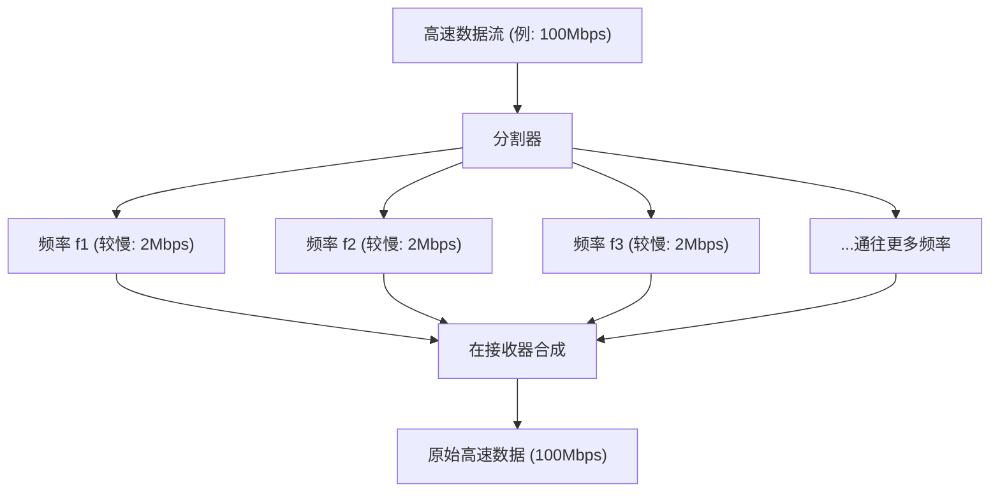

## 1. 在空中交织的无形信息网

我们每天都在智能手机上观看高清YouTube视频、下载大文件、享受在线游戏。然而，这些手机上却没有连接一根线缆。
所有数据都搭载在一种名为“Wi-Fi（无线局域网）”的无形电波上，在空中飞速穿梭，并被吸入路由器中。

视频和图像作为0和1的数字数据（比特）集合体，是如何被转换为“电波的波形”、穿过墙壁，并在不与其他电波混合的情况下准确送达的呢？在这里，模拟的物理波形与数字的计算理论完美融合，展现了通信工程的终极形态。

## 2. 将信息“搭载”在电波上：调制（Modulation）

电波与光和X射线一样，是“电磁波”的一种。它仅仅是一种在空间中起伏前进的能量波。
赋予这种波“意义（信息）”的操作被称为“ **调制（Modulation）** ”。

最原始的调制类似于通过发出或停止波来进行的“摩尔斯电码”。然而，那样的速度实在太慢了。现代的Wi-Fi通过极其精确地控制波的特性，塞入了海量的数据。波的特性包括以下三个：

1. **振幅（Amplitude）** ：波的高度。大或小。
2. **频率（Frequency）** ：波的速度（间隔）。密集或稀疏。
3. **相位（Phase）** ：波的时机。波的起始位置是否有偏移。

在最新的Wi-Fi（如Wi-Fi 5、6、7等）中，主要使用了名为“ **QAM（正交振幅调制：Quadrature Amplitude Modulation）** ”的高级技术。
这是一种通过同时改变波的“振幅（高度）”和“相位（偏移）”，在一次波的振荡中表现多种0和1组合的技术。

例如，在“256-QAM”标准中，定义了256种（$2^8$）波的高度和偏移的组合。也就是说，只需波到达一次，就可以同时传输诸如“00110101”这样的8比特（1字节）数据。在最新的Wi-Fi 7中已达到“4096-QAM”，一次波就能传输多达12比特的数据。

## 3. 抵抗障碍物的秘密：OFDM（正交频分复用）

Wi-Fi电波在前进过程中会碰撞家里的墙壁、家具、人体等。
被墙壁反射的电波到达天线的时间会比直接到达的电波稍晚（多径效应）。这样一来，晚到的波与直接到达的波就会相互干扰，导致波形被破坏得一塌糊涂。这就像在山里喊“喂——”时，各种方向的反射音错位地传回来，让人听不清到底在说什么，是同样的现象。

克服这个致命弱点的是一种名为“ **OFDM（Orthogonal Frequency Division Multiplexing）** ”的惊人数学方法。

OFDM将一个非常快速的数据流， **分割成大量较慢的数据流** ，并将它们分别搭载在略微不同的频率（子载波）上同时发送。

用送快递来比喻的话，与其把所有包裹都装在一辆法拉利上（速度快但容易出事故）狂飙，不如将包裹分散装到50辆卡车上（速度慢但稳定）同时出发。
因为每个波的速度变慢了，所以即使混入了被墙壁反射、稍晚到达的波（回声），与前后数据重叠的概率也会急剧下降，从而实现无误差的复原。

## 4. 2.4GHz频段与5GHz频段的物理特性差异

购买Wi-Fi路由器后，你会发现肯定存在“2.4GHz”和“5GHz”（最近还有6GHz）这两个网络。由于电磁波物理性质的不同，它们有着明确的优缺点。

* **2.4GHz频段（波长较长）**
  * **优点** ：由于波长较长，绕过障碍物（墙壁或地板）前进的性质（衍射）很强，电波容易覆盖到家里更远的地方。
  * **缺点** ：使用相同频率的设备（如蓝牙、微波炉等）非常多，容易因信号干扰导致速度下降或连接断开。

* **5GHz频段（波长较短）**
  * **优点** ：可用的频宽（道路宽度）很广，由于几乎是Wi-Fi专用频段，干扰少，可实现压倒性的高速通信。
  * **缺点** ：由于波长较短，直线传播性强，容易被墙壁等障碍物吸收或反射。一旦距离路由器较远的房间或跨越楼层，电波就会急剧减弱。

根据目的来分别使用它们（或者让路由器自动切换），是构建舒适Wi-Fi环境的基础。

## 5. 用多根天线让速度倍增的“MIMO”

现代路由器上竖立（或内置）着许多根天线，这不仅仅是为了让电波传得更远。而是为了使用一种名为“ **MIMO（多输入多输出：Multiple-Input and Multiple-Output）** ”的魔术般的技术。

过去，即使有多根天线，也只能用来发送相同的数据以减少错误（分集技术）。
然而，MIMO反向利用了空间特性（电波在墙壁反射并通过各种路径传播）， **从不同的天线在相同的频率上同时发送完全不同的数据** 。

在通常情况下这会导致信号干扰变得一塌糊涂，但通过接收端的多根天线和高级运算处理，像解联立方程一样将空间中混合的波形分离并提取出来。这样一来，无需扩大频率带（道路宽度），只需将天线数量增加到2根、4根，就能在物理上将通信速度提升至2倍、4倍。

## 6. 总结：迈入计算空间的时代

我们平时漫不经心使用的Wi-Fi，是“改变电磁波波形的调制技术（QAM）”、“分割波以防止干扰的数学处理（OFDM）”、“利用空间反射使通信量倍增的天线技术（MIMO）”等人类智慧结晶的产物。

Wi-Fi标准从Wi-Fi 4(11n)不断进化到Wi-Fi 5(11ac)、Wi-Fi 6(11ax)，再到Wi-Fi 7(11be)，通信速度从最初的几Mbps跃升至几十Gbps，实现了数万倍的进化。
用数学和物理学将看不见的空间精确切割，并将信息铺满传输。Wi-Fi无疑是一项堪称现代魔法的技术。
