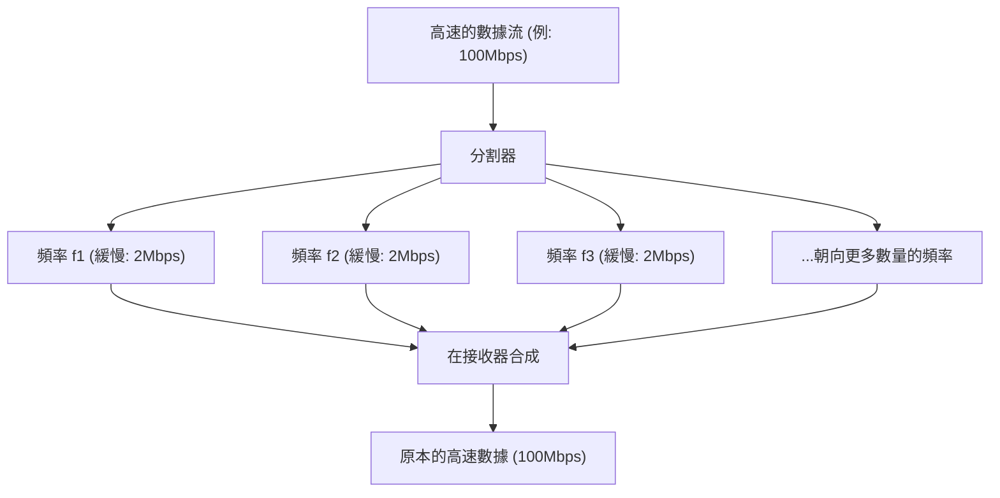

## 1. 在空中交織的無形資訊網

我們每天都在用智慧型手機觀看高畫質的YouTube影片、下載龐大的檔案，或享受線上遊戲的樂趣。然而，手機上卻沒有連接任何一根實體纜線。
所有的數據都是乘載著被稱為「Wi-Fi（無線區域網路）」的隱形電波，在空中交織穿梭，最後被吸入路由器中。

由0和1的數位數據（位元）集合而成的影片或圖片，是如何被轉換成「電波的波形」，穿透牆壁，並且不會與其他電波混雜而精準地送達呢？其中展現了類比的物理波形與數位的計算理論完美融合，這正是通訊工程的極致樣貌。

## 2. 將資訊「乘載」於電波：調變（Modulation）

電波與光或X射線相同，都是「電磁波」的一種。它不過是在空間中呈波浪狀前進的能量波而已。
賦予這個波「意義（資訊）」的作業便稱為「 **調變（Modulation）** 」。

最原始的調變，是像「摩斯密碼」那樣發出或停止波形。然而，那樣的速度實在太慢了。現代的Wi-Fi則是藉由極度精密地控制波的性質，將壓倒性龐大的數據量塞入其中。波的性質包含以下3種：

1. **振幅（Amplitude）** ：波的高度。是大還是小。
2. **頻率（Frequency）** ：波的速度（間隔）。是緊密還是寬鬆。
3. **相位（Phase）** ：波的時機。波的起始位置是否有偏差。

在最新的Wi-Fi（如Wi-Fi 5, 6, 7等）中，主要使用了一項名為「 **QAM（正交振幅調變：Quadrature Amplitude Modulation）** 」的高階技術。
這是一項藉由同時改變波的「振幅（高度）」與「相位（偏差）」兩者，在一次波的起伏中表現多個0與1組合的技術。

舉例來說，在「256-QAM」這個規格中，定義了256種（$2^8$）波的高度與偏差的組合模式。也就是說，只要波送達一次，就能一次傳遞如「00110101」這樣8位元（1位元組）的數據。在最新的Wi-Fi 7中已達到了「4096-QAM」，能夠以一次的波傳遞多達12位元的數據。

## 3. 抵抗障礙物的秘密：OFDM（正交頻分多工）

Wi-Fi的電波會在碰撞屋內的牆壁、家具、人體等障礙物的情況下前進。
反射在牆壁上的電波，會比直線抵達的電波稍微晚一點到達天線（多重路徑現象）。這麼一來，延遲到達的波就會與直接抵達的波互相干擾，導致波形變得雜亂無章而被破壞。這就如同在山上大喊「呀呼」時，會從各個方向聽到時間錯開的反射音，進而變得聽不懂在說什麼是一樣的現象。

克服了這個致命弱點的，是一項名為「 **OFDM（Orthogonal Frequency Division Multiplexing）** 」之驚人的數學方法。

OFDM會將1個非常快速的數據流， **分割成許多緩慢的數據流** ，並將它們各自乘載於些微不同的頻率（次載波）上同時傳送。

如果用包裹配送來比喻，這就像不是將所有的包裹裝載在1輛法拉利（速度快但容易發生事故）上狂飆，而是將包裹分散到50輛卡車（速度慢但穩定）上同時出發一樣。
由於各個波的速度變得緩慢，即使混入了撞擊牆壁反射後稍微延遲到達的波（回音），與前後數據重疊的機率也會大幅降低，進而能夠無誤差地進行復原。

## 4. 2.4GHz頻段與5GHz頻段的物理特性差異

購買Wi-Fi路由器時，您一定會注意到存在著「2.4GHz」與「5GHz」（最近也有6GHz）這兩種網路。這些頻段會根據電磁波物理性質的不同，而有明確的優缺點。

* **2.4GHz頻段（波長較長）**
  * **優點** ：因為波長較長，所以繞過障礙物（牆壁或地板）前進的性質（繞射）較強，電波容易傳達至家中的遠處。
  * **缺點** ：藍牙與微波爐等使用相同頻率的設備非常多，容易因混頻干擾而導致速度下降或斷線。

* **5GHz頻段（波長較短）**
  * **優點** ：可用的頻寬（路寬）較廣，且屬於接近Wi-Fi專用的頻段，因此混頻干擾少，能夠實現壓倒性的高速通訊。
  * **缺點** ：因為波長較短而具有高直進性，容易被牆壁等障礙物吸收或反射。一旦跨越了距離路由器較遠的房間或樓層，電波就會急遽減弱。

根據使用目的來區分使用這些頻段（或者讓路由器自動進行切換），便是建構舒適Wi-Fi環境的基本原則。

## 5. 以多天線讓速度倍增的「MIMO」

現代路由器上會豎立著（或內建）好幾根天線，並不單純只是為了讓電波飛得更遠而已。這是為了使用一項名為「 **MIMO（多輸入多輸出：Multiple-Input and Multiple-Output）** 」之宛如魔法般的技術。

在過去，即使有多根天線，也只能用於傳送相同數據以減少誤差（分集技術）的程度而已。
然而MIMO卻反過來利用了空間的特性（電波會反射在牆壁上並通過各種路徑）， **從不同的天線同時以相同的頻率傳送完全不同的數據** 。

一般情況下這會導致混頻干擾而變得雜亂無章，但透過接收端的多根天線與高階的運算處理，能夠像解聯立方程式一樣，將在空間中混合的波形分離並萃取出來。如此一來，不需要擴增頻率的頻寬（路寬），只要將天線數量增加為2根、4根，就能夠在物理上將通訊速度提升為2倍、4倍。

## 6. 總結：邁向計算空間的時代

我們平時若無其事地在使用的Wi-Fi，是集結了人類智慧所成立的技術，其中包含了「改變電磁波波形的調變技術（QAM）」、「分割波形以防止干擾的數學處理（OFDM）」以及「利用空間反射使通訊量倍增的天線技術（MIMO）」。

Wi-Fi的規格從Wi-Fi 4(11n)持續進化到Wi-Fi 5(11ac)、Wi-Fi 6(11ax)以及Wi-Fi 7(11be)，通訊速度也從初期的數Mbps達到了數十Gbps，實現了數萬倍的進化。
以數學和物理學精確地切割看不見的空間，並將資訊鋪滿其中進行傳遞。Wi-Fi確實是一項配得上被稱為現代魔法的科技。
