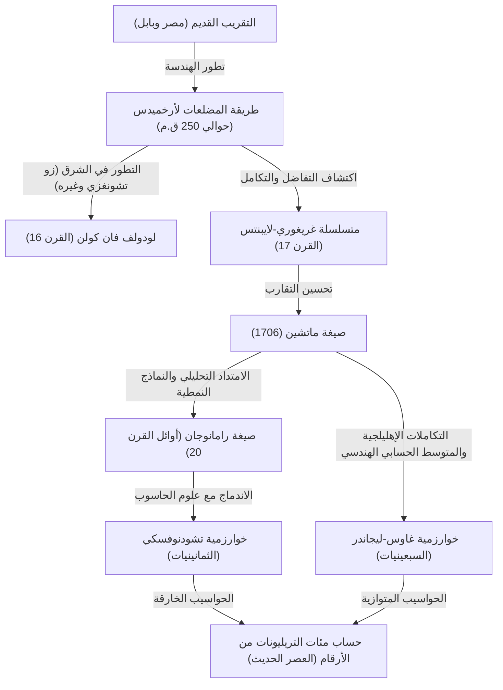

# 1. مقدمة: الثابت الساحر باي

في تاريخ البشرية والرياضيات، ربما لا يوجد رقم جذب انتباه الكثير من علماء الرياضيات وعلماء الحاسوب واستمر حسابه مثل باي ($\pi$). هذا الثابت البسيط، الذي يُعرّف بأنه نسبة محيط الدائرة إلى قطرها، له خصائص عميقة كونه رقماً غير نسبي ورقماً متسامياً أيضاً. لا يمكن التعبير عنه ككسر من أعداد صحيحة، ولا يمكن أن يكون جذراً لأي معادلة جبرية بمعاملات نسبية، ولا يكشف عن صورته الكاملة إلا كسلسلة لا نهائية وغير منتظمة من الأرقام العشرية.

في هذا المقال، سنشرح بشكل شامل تاريخ كيفية تحسين البشرية لدقة حساب باي، من العصور القديمة وصولاً إلى الحواسيب الخارقة الحديثة، بالإضافة إلى النظريات الرياضية وراء هذه الطرق. بدءاً من الأساليب الهندسية القديمة، مروراً بالمتسلسلات اللانهائية باستخدام التفاضل والتكامل، وصولاً إلى الخوارزميات المذهلة التي تدعم الحسابات فائقة الدقة اليوم، سنتعمق في كل منها مع تقديم الصيغ وأكواد بايثون (Python) للتنفيذ.

ليس من المبالغة القول إن تاريخ حساب باي هو نفسه تاريخ تطور الرياضيات وعلوم الحاسوب للبشرية. مع كل اكتشاف لمفاهيم رياضية جديدة، تحسنت دقة حساب باي بشكل كبير. دعونا ننطلق في رحلة الاستكشاف التي لا نهاية لها.



# 2. التقريبات القديمة وطريقة المضلعات لأرخميدس (النهج الهندسي)

## 2.1 إدراك باي في الحضارات القديمة

حوالي عام 2000 قبل الميلاد، كان مفهوم باي معروفاً بالفعل في بابل القديمة ومصر القديمة. استخدم البابليون تقريباً يبلغ $3 + 1/8 = 3.125$، مستفيدين من حقيقة أن محيط الدائرة أطول قليلاً من محيط السداسي المنتظم. علاوة على ذلك، في "بردية ريند الرياضية" المصرية، توجد طريقة مسجلة لاستخدام مربع $8/9$ من القطر عند حساب مساحة الدائرة، والتي تعطي قيمة باي كـ $(16/9)^2 \approx 3.16049$. كانت هذه القيم دقيقة بما يكفي للأغراض العملية، لكنها كانت مجرد تقريبات بناءً على قواعد تجريبية.

## 2.2 الأسلوب الهندسي لأرخميدس

أول من صاغ حساب باي بطريقة رياضية دقيقة كان عالم الرياضيات اليوناني العظيم أرخميدس (287 ق.م - 212 ق.م). باستخدام مضلعات منتظمة محاطة بالدائرة ومضلعات منتظمة محيطة بها، أثبت أن القيمة الحقيقية لباي تقع بين محيطي هذين المضلعين (طريقة الاستنفاد).

بدأ أرخميدس بسداسي منتظم، وضاعف عدد الأضلاع تدريجياً ليحسب لمضلع ذي 12 ضلعاً، ثم 24، ثم 48، وصولاً في النهاية إلى مضلع ذي 96 ضلعاً. كلما زاد عدد الأضلاع، يقترب محيط المضلع من محيط الدائرة.

بفرض أن نصف قطر الدائرة هو $r=1$. محيط الدائرة هو $2\pi$.
إذا كان محيط المضلع المنتظم المحاط ذي $n$ ضلع هو $p_n$، ومحيط المضلع المنتظم المحيط ذي $n$ ضلع هو $P_n$، تتحقق المتباينة التالية:

$$ p_n < 2\pi < P_n $$

لحساب طول ضلع المضلع ذي $n$ ضلع، استخدم أرخميدس بشكل متكرر نظريات هندسية تعادل الدوال المثلثية الحديثة (نظرية فيثاغورس ونظرية منصف الزاوية). بالتعبير عنها بالرموز الحديثة، طول الضلع للمضلع المحاط ذي $n$ ضلع هو $2 \sin(\pi/n)$، وللمحيط هو $2 \tan(\pi/n)$. بناءً على ذلك، باستخدام نصف المحيط، نحصل على:

$$ n \sin\left(\frac{\pi}{n}\right) < \pi < n \tan\left(\frac{\pi}{n}\right) $$

علاقة التكرار لنصف محيط المضلعات المحاطة والمحيطة (نرمز لها بـ $s_n, S_n$ على التوالي) عند مضاعفة عدد الأضلاع إلى $2n$ هي كالتالي:
(حيث $s_n = n \sin(\pi/n), S_n = n \tan(\pi/n)$)

$$ S_{2n} = \frac{2 s_n S_n}{s_n + S_n} $$
$$ s_{2n} = \sqrt{s_n S_{2n}} $$

استخدم أرخميدس حسابات الجذور التربيعية (التي كانت تتم يدوياً باستخدام تقريبات كسرية للأعداد النسبية في ذلك الوقت) واستنتج من حساب المضلع ذي 96 ضلعاً المتباينة الشهيرة التالية:

$$ 3 \frac{10}{71} < \pi < 3 \frac{1}{7} $$
(بالأرقام العشرية $3.1408... < \pi < 3.1428...$)

ظل هذا "النهج الأرخميدي" الطريقة الأساسية لحساب باي لما يقرب من 2000 عام، حتى اختراع التفاضل والتكامل في القرن السابع عشر. استخدم عالم الرياضيات الهولندي لودولف فان كولن في القرن السادس عشر هذه الطريقة لحساب مضلع ذي $2^{62}$ ضلعاً، وحصل على قيمة باي حتى 35 رقماً عشرياً.

## 2.3 محاكاة طريقة أرخميدس باستخدام بايثون (Python)

دعونا نستخدم وحدة `decimal` في بايثون لتنفيذ هذه العلاقة التكرارية الهندسية وحساب باي بدقة عشرات الأرقام.

```python
from decimal import Decimal, getcontext

def archimedes_pi(iterations: int, precision: int = 50) -> tuple[Decimal, Decimal]:
    '''
    حساب باي باستخدام طريقة المضلعات لأرخميدس.
    iterations: عدد مرات مضاعفة الأضلاع
    precision: دقة الحساب (عدد الأرقام بعد الفاصلة العشرية)
    '''
    getcontext().prec = precision + 5  # إضافة هامش لمنع أخطاء التقريب الوسيطة

    # القيم الأولية: سداسي منتظم (n=6)
    # سداسي منتظم لدائرة نصف قطرها 1
    n = 6
    s_n = Decimal('3')               # نصف محيط السداسي المنتظم المحاط (6 * sin(pi/6) = 3)
    S_n = Decimal('6') / Decimal('3').sqrt() # نصف محيط السداسي المنتظم المحيط (6 * tan(pi/6) = 2*sqrt(3))

    for _ in range(iterations):
        # التحديث بناءً على علاقة التكرار
        S_2n = (Decimal('2') * s_n * S_n) / (s_n + S_n)
        s_2n = (s_n * S_2n).sqrt()
        
        s_n, S_n = s_2n, S_2n
        n *= 2

    return s_n, S_n

if __name__ == '__main__':
    inner, outer = archimedes_pi(100, 50)
    print('طريقة أرخميدس (100 تكرار)')
    print(f'تقريب المضلع المحاط: {inner}')
    print(f'تقريب المضلع المحيط: {outer}')
```

هذه العلاقة التكرارية تتسم ببطء التقارب (تقارب خطي)، حيث تتحسن الدقة بمقدار بت واحد فقط (في النظام الثنائي) مع كل تكرار. بحثاً عن طرق حساب أسرع، بدأ علماء الرياضيات في استكشاف نُهج جديدة.

# 3. فجر التفاضل والتكامل: نهج المتسلسلات اللانهائية

مع دخول القرن السابع عشر، بفضل اكتشاف حساب التفاضل والتكامل من قبل نيوتن ولايبنتس، خضعت الأساليب الرياضية لتطور جذري. حدث تحول نوعي من طرق الحساب برسم الأشكال الهندسية إلى الحساب باستخدام "المتسلسلات اللانهائية" الجبرية.

## 3.1 متسلسلة غريغوري-لايبنتس

تم اكتشاف التوسع في المتسلسلة اللانهائية لدالة الظل العكسية (آرك تانجينت) من قبل عالم الرياضيات الاسكتلندي جيمس غريغوري في عام 1671، وأعيد اكتشافها بشكل مستقل من قبل عالم الرياضيات الألماني غوتفريد لايبنتس في عام 1674.

$$ \arctan(x) = x - \frac{x^3}{3} + \frac{x^5}{5} - \frac{x^7}{7} + \cdots = \sum_{k=0}^{\infty} \frac{(-1)^k x^{2k+1}}{2k+1} $$

من خلال تعويض $x = 1$ في هذه الصيغة، وبما أن $\arctan(1) = \pi/4$، نحصل على صيغة جميلة يمكنها حساب باي مباشرة. يُطلق على هذه الصيغة "متسلسلة غريغوري-لايبنتس".

$$ \frac{\pi}{4} = 1 - \frac{1}{3} + \frac{1}{5} - \frac{1}{7} + \frac{1}{9} - \cdots $$

تكمن جمالية هذه المتسلسلة في إمكانية إيجاد باي ببساطة عن طريق جمع وطرح مقلوبات الأعداد الفردية بالتناوب. ورغم أن هذه الصيغة قوبلت بدهشة رياضية كبيرة، إلا أنها كانت تعاني من عيب قاتل من المنظور العملي لحساب باي: "تقاربها بطيء للغاية".

على سبيل المثال، للحصول على دقة لرقمين عشريين (3.14)، يتطلب الأمر حساب مئات الحدود. وللحصول على دقة لـ 10 أرقام عشرية، يتطلب الأمر جمع أكثر من 5 مليارات حد. لذلك، لم تُستخدم هذه الصيغة كما هي لتحديث سجلات عدد أرقام باي. ومع ذلك، أصبحت فكرة استخدام التوسع في متسلسلة آرك تانجينت بحد ذاتها الأساس لطرق الحساب الأسرع التي ظهرت لاحقاً.

# 4. صيغة ماتشين وتطور التحليل الرياضي

## 4.1 نظرية الجمع لآرك تانجينت وصيغة ماتشين

للتغلب على التقارب البطيء لمتسلسلة غريغوري-لايبنتس، كان من الضروري تعويض قيم لـ $x$ أصغر من $x=1$ في متسلسلة آرك تانجينت (لأنه كلما صغرت قيمة $x$، صغرت قيمة $x^{2k+1}$ بسرعة، وتزايدت سرعة التقارب).

في عام 1706، استغل عالم الرياضيات الإنجليزي جون ماتشين ببراعة نظرية الجمع لآرك تانجينت لاكتشاف صيغة رائدة.

نظرية الجمع لآرك تانجينت هي كالتالي:
$$ \arctan(x) + \arctan(y) = \arctan\left(\frac{x+y}{1-xy}\right) $$

ركز ماتشين على القيمة $\arctan(1/5)$. لأن الحساب باستخدام $x=1/5$ سهل (مجرد الضرب في 2 وإزاحة فاصلة عشرية واحدة). بتطبيق نظرية الجمع لمضاعفة الزاوية:
$$ 2 \arctan\left(\frac{1}{5}\right) = \arctan\left(\frac{5/12}{1}\right) = \arctan\left(\frac{120}{119}\right) $$

بمضاعفة هذا مرة أخرى، نحصل على $4 \arctan(1/5)$. بمواصلة الحسابات، نجد أن هذه القيمة قريبة جداً من $\arctan(1) = \pi/4$. وبإيجاد الفرق:

$$ 4 \arctan\left(\frac{1}{5}\right) - \frac{\pi}{4} = \arctan\left(\frac{1}{239}\right) $$

بإعادة الترتيب، نحصل على "صيغة ماتشين" الشهيرة.

$$ \frac{\pi}{4} = 4 \arctan\left(\frac{1}{5}\right) - \arctan\left(\frac{1}{239}\right) $$

النقطة الرائعة في هذه الصيغة هي أنها تعوض قيماً صغيرة نسبياً مثل $x=1/5$ و $x=1/239$ في متسلسلة غريغوري-لايبنتس، مما يؤدي إلى التقارب بسرعة هائلة. استخدم ماتشين نفسه هذه الصيغة لحساب باي يدوياً حتى 100 رقم عشري في دفعة واحدة.

بعد ذلك، تم اكتشاف نُهج مماثلة (طرق تستخدم تركيبات خطية أكثر تعقيداً من آرك تانجينت) واحدة تلو الأخرى، وحتى ظهور الحواسيب الإلكترونية في منتصف القرن العشرين، استمر كسر الأرقام القياسية لحساب باي باستخدام الصيغ من نوع ماتشين.

## 4.2 تنفيذ صيغة ماتشين باستخدام بايثون

دعونا ننفذ صيغة ماتشين باستخدام وحدة `decimal` في بايثون.

```python
from decimal import Decimal, getcontext

def arctan(x_inv: int, precision: int) -> Decimal:
    '''
    حساب arctan(1/x) باستخدام متسلسلة غريغوري
    '''
    getcontext().prec = precision + 10
    x_inv_dec = Decimal(x_inv)
    x_squared = x_inv_dec * x_inv_dec
    
    term = Decimal(1) / x_inv_dec
    total = term
    k = 1
    
    while True:
        term = term / x_squared
        current_term = term / Decimal(2*k + 1)
        if current_term == 0:
            break
            
        if k % 2 == 1:
            total -= current_term
        else:
            total += current_term
        k += 1
        
    return total

def machin_pi(precision: int = 100) -> Decimal:
    '''
    حساب باي باستخدام صيغة ماتشين
    '''
    getcontext().prec = precision + 10
    pi_over_4 = 4 * arctan(5, precision) - arctan(239, precision)
    pi = 4 * pi_over_4
    getcontext().prec = precision
    return +pi

if __name__ == '__main__':
    print('الحساب لـ 100 رقم بصيغة ماتشين:')
    print(machin_pi(100))
```
عند تشغيل هذا الكود، يتم حساب 100 رقم من باي بدقة في وقت قصير جداً.

# 5. صيغ رامانوجان المذهلة والنماذج النمطية

في أوائل القرن العشرين، قدم عالم الرياضيات الهندي العبقري سرينيفاسا رامانوجان نهجاً جديداً كلياً لحساب باي. بفضل حدسه العميق في التكاملات الإهليلجية والمعادلات النمطية، اكتشف العديد من المتسلسلات المعقدة وغير التقليدية مثل هذه:

$$ \frac{1}{\pi} = \frac{2\sqrt{2}}{9801} \sum_{k=0}^{\infty} \frac{(4k)! (1103 + 26390k)}{(k!)^4 396^{4k}} $$

لوهلة الأولى، تبدو هذه الصيغة معقدة للغاية لدرجة أنه يصعب تخيل من أين اُستمدت، لكن سرعة تقاربها مذهلة، حيث تضيف كل زيادة في حساب حد واحد دقة تبلغ حوالي 8 أرقام إلى قيمة باي.

شكلت صيغ رامانوجان تحولاً كبيراً في طرق حساب باي من "متسلسلات دوال الظل العكسية" إلى "المتسلسلات الهندسية الفائقة والنماذج النمطية". نظراً لعدم وجود حواسيب في ذلك الوقت، لم تُظهر صيغه كامل إمكاناتها، ولكن في الثمانينيات، مع احتدام المنافسة في حساب باي باستخدام الحواسيب الخارقة، تم ابتكار العديد من الخوارزميات الجديدة بناءً على نظرياته.

# 6. الحساب فائق الدقة الحديث: خوارزمية تشودنوفسكي

تم دفع نهج رامانوجان إلى الأمام بواسطة "خوارزمية تشودنوفسكي"، التي نشرها الأخوان تشودنوفسكي (ديفيد تشودنوفسكي وغريغوري تشودنوفسكي) في عام 1988.

$$ \frac{1}{\pi} = 12 \sum_{k=0}^{\infty} \frac{(-1)^k (6k)! (13591409 + 545140134k)}{(3k)!(k!)^3 640320^{3k + 3/2}} $$

لا تزال هذه الخوارزمية هي الطريقة القياسية والأوسع استخداماً اليوم لتحديث الرقم القياسي العالمي لحساب باي (الذي وصل حالياً إلى 100 تريليون رقم) باستخدام الحواسيب الخارقة أو الحواسيب الشخصية.

السبب في ذلك هو أن الدقة تتحسن بمعدل مذهل يبلغ حوالي 14 رقماً مع كل حساب لحد جديد. علاوة على ذلك، فهي تتوافق بشكل ممتاز مع التحسينات في علوم الحاسوب (مثل حسابات التقسيم والسيطرة للكسور الضخمة باستخدام طريقة الانقسام الثنائي)، وتظهر أداءً عالياً للغاية عند تشغيلها على الحواسيب المتوازية.

## 6.1 تنفيذ خوارزمية تشودنوفسكي باستخدام بايثون

دعونا ننفذ هذه الخوارزمية المذهلة باستخدام وحدة `decimal` في بايثون.

```python
from decimal import Decimal, getcontext
import math

def chudnovsky_pi(precision: int = 100) -> Decimal:
    '''
    حساب باي باستخدام خوارزمية تشودنوفسكي
    '''
    getcontext().prec = precision + 10
    
    C = 640320
    C3_OVER_24 = C**3 // 24
    
    total = Decimal(0)
    k = 0
    M = 1
    L = 13591409
    X = 1
    
    # عدد الحدود المطلوبة (حوالي 14 رقماً لكل حد)
    max_k = precision // 14 + 1
    
    for k in range(max_k):
        term = Decimal(M * L) / X
        if k % 2 != 0:
            total -= term
        else:
            total += term
            
        # التحديث للحد التالي
        k_next = k + 1
        L += 545140134
        X *= C3_OVER_24
        M = (M * (12 * k_next - 10) * (12 * k_next - 6) * (12 * k_next - 2)) // (k_next**3)
        
    pi_inverse = Decimal(12) * total / Decimal(C**3).sqrt()
    getcontext().prec = precision
    return Decimal(1) / pi_inverse

if __name__ == '__main__':
    print('الحساب لـ 100 رقم بخوارزمية تشودنوفسكي:')
    print(chudnovsky_pi(100))
```
عند تشغيل الكود أعلاه، يتم حساب باي بسرعة لا تصدق. يصل إلى دقة 100 رقم في بضع تكرارات فقط (`max_k`).

# 7. خوارزمية غاوس-ليجاندر (طريقة المتوسط الحسابي الهندسي)

في طرق حساب باي، هناك خوارزمية ثورية أخرى لا ينبغي نسيانها وهي "خوارزمية غاوس-ليجاندر". تم اكتشافها بشكل مستقل في عام 1975 بواسطة ريتشارد برينت ويوجين سالامين.

تعتمد هذه الخوارزمية على "المتوسط الحسابي الهندسي (AGM)" ونظرية التكاملات الإهليلجية التي درسها كارل فريدريش غاوس.

عند إعطاء رقمين $a_0, b_0$، نقوم بتطبيق المتوسط الحسابي (متوسط الجمع) والمتوسط الهندسي (متوسط الضرب) بشكل متكرر لإنشاء متتالية كالتالي:

$$ a_{n+1} = \frac{a_n + b_n}{2} $$
$$ b_{n+1} = \sqrt{a_n b_n} $$

تتقارب هاتان المتتاليتان بسرعة كبيرة نحو نفس القيمة (المتوسط الحسابي الهندسي). من خلال الجمع بين هذه الخاصية وعلاقة ليجاندر للتكاملات الإهليلجية الكاملة، تم استنتاج خوارزمية لحساب باي.

نحدد القيم الأولية كالتالي:
$$ a_0 = 1, \quad b_0 = \frac{1}{\sqrt{2}}, \quad t_0 = \frac{1}{4}, \quad p_0 = 1 $$

ثم نكرر علاقات التكرار التالية:
$$ a_{n+1} = \frac{a_n + b_n}{2} $$
$$ b_{n+1} = \sqrt{a_n b_n} $$
$$ t_{n+1} = t_n - p_n (a_n - a_{n+1})^2 $$
$$ p_{n+1} = 2 p_n $$

التقريب $\pi_n$ لباي في الخطوة $n$ يُحسب كالتالي:
$$ \pi_n = \frac{(a_n + b_n)^2}{4 t_n} $$

أكبر ميزة لهذه الخوارزمية هي أنها ذات "تقارب تربيعي". بعبارة أخرى، تمتلك خاصية مذهلة حيث "يتضاعف عدد الأرقام الصحيحة" مع كل تكرار. على سبيل المثال، 100 رقم، 200 رقم، 400 رقم، 800 رقم، وهكذا تتحسن الدقة بسرعة انفجارية. استُخدمت هذه الخوارزمية عندما نجح فريق البروفيسور ياسوماسا كانادا من جامعة طوكيو في حساب 206 مليار رقم في عام 1999.

## 7.1 تنفيذ طريقة غاوس-ليجاندر باستخدام بايثون

```python
from decimal import Decimal, getcontext

def gauss_legendre_pi(iterations: int, precision: int = 100) -> Decimal:
    '''
    حساب باي باستخدام خوارزمية غاوس-ليجاندر
    '''
    getcontext().prec = precision + 10
    
    a = Decimal(1)
    b = Decimal(1) / Decimal(2).sqrt()
    t = Decimal(1) / Decimal(4)
    p = Decimal(1)
    
    for _ in range(iterations):
        a_next = (a + b) / 2
        b_next = (a * b).sqrt()
        t_next = t - p * (a - a_next)**2
        p_next = 2 * p
        
        a, b, t, p = a_next, b_next, t_next, p_next
        
    pi_approx = ((a + b)**2) / (4 * t)
    getcontext().prec = precision
    return +pi_approx

if __name__ == '__main__':
    # يمكن الحصول على دقة أكثر من 100 رقم في 7 تكرارات فقط
    print('الحساب بطريقة غاوس-ليجاندر:')
    print(gauss_legendre_pi(7, 100))
```

# 8. الخاتمة: بحث لا نهاية له

بدأت حسابات باي من مضلع رسمه علماء الرياضيات القدماء على الرمال، وتطورت إلى متسلسلات لانهائية بفضل الأداة القوية المتمثلة في التفاضل والتكامل، وفي العصر الحديث، بفضل النظريات الرياضية المتقدمة مثل النماذج النمطية والمتوسط الحسابي الهندسي إلى جانب القوة الحسابية للحواسيب الخارقة، وصلت إلى دقة هائلة تبلغ 100 تريليون رقم.

المنافسة لحساب باي ليست مجرد لعبة للبحث عن سلسلة من الأرقام. الخوارزميات وطرق الحساب التي تم تطويرها هناك (مثل الانقسام الثنائي وضرب الأعداد الضخمة باستخدام تحويل فورييه السريع) تلعب دوراً هاماً في مجموعة واسعة من المجالات مثل نظرية التشفير الحديثة، والتحليل العددي، وتقييم أداء معمارية الحواسيب.

نظراً لأن باي هو رقم غير نسبي، فإن سلسلته من الأرقام لا تنتهي أبداً. طالما استمرت حكمة البشرية وتطور الحواسيب، فإن الرحلة التي لا نهاية لها للعثور على باي لن تنتهي أبداً أيضاً.
