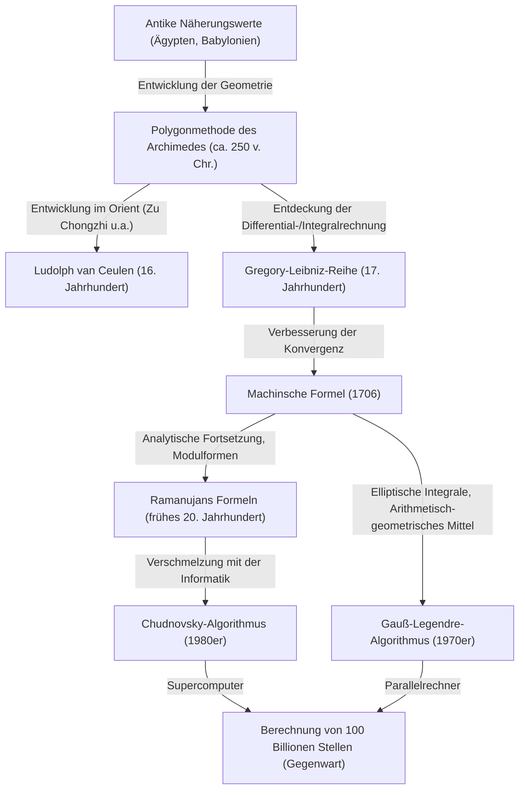

# 1. Einleitung: Die faszinierende Konstante Pi (Kreiszahl)

In der Geschichte der Menschheit und der Mathematik gibt es wohl keine andere Zahl, die so viele Mathematiker und Informatiker in ihren Bann gezogen hat und immer wieder berechnet wurde wie Pi ($\pi$). Diese einfache Konstante, definiert als das Verhältnis des Umfangs eines Kreises zu seinem Durchmesser, besitzt tiefgreifende Eigenschaften: Sie ist sowohl eine irrationale als auch eine transzendente Zahl. Sie kann nicht als Bruch rationaler Zahlen ausgedrückt werden und ist keine Wurzel irgendeiner algebraischen Gleichung mit rationalen Koeffizienten. Diese Zahl offenbart ihr gesamtes Wesen nur als eine unendlich fortschreitende, unregelmäßige Folge von Dezimalstellen.

In diesem Artikel werden wir im Detail beleuchten, wie die Menschheit von der Antike bis zu den heutigen Supercomputern die Präzision von Pi erhöht hat, und wir werden die Geschichte der Berechnungsmethoden sowie die zugrunde liegende mathematische Theorie ausführlich erklären. Angefangen bei den geometrischen Ansätzen der Antike, über unendliche Reihen mittels Differential- und Integralrechnung, bis hin zu den erstaunlichen Algorithmen, die moderne hochpräzise Berechnungen unterstützen – wir werden tief in die jeweilige Formel und deren Implementierung in Python eintauchen.

Es ist keine Übertreibung zu sagen, dass die Geschichte der Berechnung von Pi ein Spiegelbild der Entwicklungsgeschichte von Mathematik und Informatik der Menschheit ist. Mit jeder Entdeckung neuer mathematischer Konzepte hat sich die Genauigkeit der Pi-Berechnung dramatisch verbessert. Begeben wir uns nun auf diese endlose Entdeckungsreise.



# 2. Antike Näherungen und die Polygonmethode des Archimedes (Geometrischer Ansatz)

## 2.1 Das Wissen um Pi in antiken Zivilisationen

Bereits um 2000 v. Chr., im antiken Babylonien und im alten Ägypten, war das Konzept von Pi bekannt. Die Babylonier nutzten die Tatsache, dass der Umfang eines Kreises etwas länger als der Umfang eines regelmäßigen Sechsecks ist, und verwendeten den Näherungswert $3 + 1/8 = 3.125$. Zudem beschreibt der ägyptische "Papyrus Rhind" eine Methode zur Berechnung der Kreisfläche, bei der das Quadrat von $8/9$ des Durchmessers verwendet wird, was zu einem Pi-Wert von $(16/9)^2 \approx 3.16049$ führt. Diese Werte boten eine für praktische Zwecke ausreichende Genauigkeit, waren aber lediglich auf Erfahrungswerten basierende Näherungen.

## 2.2 Der geometrische Ansatz des Archimedes

Der Erste, der die Berechnung von Pi auf eine mathematisch rigorose Methode stützte, war der große antike griechische Mathematiker Archimedes (287 v. Chr. – 212 v. Chr.). Er zeigte mit Hilfe eines in den Kreis einbeschriebenen und eines dem Kreis umbeschriebenen regelmäßigen Polygons, dass der wahre Wert von Pi zwischen den Umfängen dieser beiden Polygone liegt (Exhaustionsmethode).

Archimedes begann mit einem regelmäßigen Sechseck und verdoppelte die Anzahl der Seiten schrittweise, wobei er Berechnungen für das 12-Eck, das 24-Eck, das 48-Eck und schließlich das 96-Eck durchführte. Mit zunehmender Seitenanzahl nähert sich der Umfang des Polygons dem Umfang des Kreises an.

Sei der Radius des Kreises $r=1$. Der Kreisumfang beträgt $2\pi$.
Wenn der Umfang des einbeschriebenen regulären $n$-Ecks $p_n$ und der Umfang des umbeschriebenen regulären $n$-Ecks $P_n$ ist, gilt folgende Ungleichung:

$$ p_n < 2\pi < P_n $$

Um die Seitenlängen des regulären $n$-Ecks zu berechnen, wendete Archimedes wiederholt geometrische Theoreme (wie den Satz des [Pythagoras](/de/p/pythagoras/) oder den Winkelhalbierungssatz) an, die den heutigen trigonometrischen Funktionen entsprechen. In moderner Schreibweise beträgt die Seitenlänge des einbeschriebenen regulären $n$-Ecks $2 \sin(\pi/n)$ und die des umbeschriebenen regulären $n$-Ecks $2 \tan(\pi/n)$. Unter Verwendung des halben Umfangs ergibt sich daher:

$$ n \sin\left(\frac{\pi}{n}\right) < \pi < n \tan\left(\frac{\pi}{n}\right) $$

Die Rekursionsformeln für den halben Umfang des ein- und umbeschriebenen Polygons (bezeichnet als $s_n$ bzw. $S_n$) bei Verdoppelung der Seitenanzahl auf $2n$ lauten wie folgt:
(Hier entspricht $s_n = n \sin(\pi/n)$ und $S_n = n \tan(\pi/n)$)

$$ S_{2n} = \frac{2 s_n S_n}{s_n + S_n} $$
$$ s_{2n} = \sqrt{s_n S_{2n}} $$

Archimedes nutzte intensiv die Berechnung von Quadratwurzeln (damals per Hand mithilfe rationaler Bruchnäherungen) und leitete aus den Berechnungen für das 96-Eck die folgende berühmte Ungleichung ab:

$$ 3 \frac{10}{71} < \pi < 3 \frac{1}{7} $$
(Als Dezimalzahl: $3.1408... < \pi < 3.1428...$)

Dieser "archimedische Ansatz" blieb fast 2000 Jahre lang, bis zur Erfindung der Differential- und Integralrechnung im 17. Jahrhundert, die grundlegende Methode zur Berechnung von Pi. Der niederländische Mathematiker Ludolph van Ceulen nutzte diese Methode im 16. Jahrhundert, um das reguläre $2^{62}$-Eck zu berechnen, und bestimmte Pi auf 35 Dezimalstellen.

## 2.3 Simulation der Archimedes-Methode mit Python

Lassen Sie uns das Modul `decimal` in Python verwenden, um diese geometrische Rekursion zu implementieren und Pi mit einer Genauigkeit von Dutzenden von Stellen zu berechnen.

```python
from decimal import Decimal, getcontext

def archimedes_pi(iterations: int, precision: int = 50) -> tuple[Decimal, Decimal]:
    '''
    Berechnet Pi mit der Polygonmethode des Archimedes.
    iterations: Anzahl der Verdoppelungen der Seitenanzahl
    precision: Berechnungsgenauigkeit (Anzahl der Nachkommastellen)
    '''
    getcontext().prec = precision + 5  # Puffer einbauen, um Rundungsfehler zu vermeiden

    # Anfangswerte: Reguläres Sechseck (n=6)
    # Reguläres Sechseck für einen Kreis mit Radius 1
    n = 6
    s_n = Decimal('3')               # Halber Umfang des einbeschriebenen Sechsecks (6 * sin(pi/6) = 3)
    S_n = Decimal('6') / Decimal('3').sqrt() # Halber Umfang des umbeschriebenen Sechsecks (6 * tan(pi/6) = 2*sqrt(3))

    for _ in range(iterations):
        # Aktualisierung basierend auf der Rekursionsformel
        S_2n = (Decimal('2') * s_n * S_n) / (s_n + S_n)
        s_2n = (s_n * S_2n).sqrt()
        
        s_n, S_n = s_2n, S_2n
        n *= 2

    return s_n, S_n

if __name__ == '__main__':
    inner, outer = archimedes_pi(100, 50)
    print('Archimedes-Methode (100 Iterationen)')
    print(f'Näherung des einbeschriebenen Polygons: {inner}')
    print(f'Näherung des umbeschriebenen Polygons: {outer}')
```

Diese Rekursionsformel hat die Eigenschaft, dass sich die Genauigkeit bei jeder Iteration nur um etwa 1 Bit im Binärsystem verbessert, wodurch die Konvergenz sehr langsam ist (lineare Konvergenz). Auf der Suche nach schnelleren Berechnungsmethoden begannen Mathematiker, neue Ansätze zu erforschen.


# 3. Das Zeitalter der Infinitesimalrechnung: Der Ansatz der unendlichen Reihen

Mit Beginn des 17. Jahrhunderts erfuhr die Mathematik durch die Entdeckung der Differential- und Integralrechnung durch Newton und Leibniz eine dramatische Entwicklung. Es fand ein Paradigmenwechsel statt – von der Berechnung durch das Zeichnen geometrischer Figuren hin zur algebraischen Berechnung mittels "unendlicher Reihen".

## 3.1 Die Gregory-Leibniz-Reihe

Die Entwicklung des Arkustangens als unendliche Reihe wurde 1671 vom schottischen Mathematiker James Gregory entdeckt und 1674 unabhängig davon vom deutschen Mathematiker Gottfried Wilhelm Leibniz wiederentdeckt.

$$ \arctan(x) = x - \frac{x^3}{3} + \frac{x^5}{5} - \frac{x^7}{7} + \cdots = \sum_{k=0}^{\infty} \frac{(-1)^k x^{2k+1}}{2k+1} $$

Setzt man $x = 1$ in diese Formel ein, erhält man aufgrund von $\arctan(1) = \pi/4$ eine elegante Formel, mit der man Pi direkt berechnen kann. Dies wird die "Gregory-Leibniz-Reihe" genannt.

$$ \frac{\pi}{4} = 1 - \frac{1}{3} + \frac{1}{5} - \frac{1}{7} + \frac{1}{9} - \cdots $$

Die Schönheit dieser Reihe liegt darin, dass Pi durch abwechselndes Addieren und Subtrahieren der Kehrwerte der ungeraden Zahlen ermittelt werden kann. Obwohl diese Formel mit mathematischem Erstaunen aufgenommen wurde, hatte sie aus praktischer Sicht für die Berechnung von Pi einen fatalen Fehler: Die "Konvergenz ist hoffnungslos langsam".

Um beispielsweise eine Genauigkeit von nur 2 Dezimalstellen (3.14) zu erreichen, müssen Hunderte von Termen berechnet werden. Um eine Genauigkeit von 10 Dezimalstellen zu erzielen, müssen unglaubliche 5 Milliarden Terme aufsummiert werden. Daher wurde diese Gleichung in ihrer ursprünglichen Form nie genutzt, um neue Rekorde bei der Berechnung von Pi-Stellen aufzustellen. Die Idee der Reihenentwicklung des Arkustangens selbst bildete jedoch die Grundlage für spätere, schnellere Berechnungsmethoden.

# 4. Die Machinsche Formel und die Entwicklung der Analysis

## 4.1 Das Additionstheorem des Arkustangens und die Machinsche Formel

Um die langsame Konvergenz der Gregory-Leibniz-Reihe zu überwinden, müssen kleinere Werte für $x$ anstelle von $x=1$ in die Arkustangens-Reihe eingesetzt werden (je kleiner $x$, desto schneller wird $x^{2k+1}$ klein, was zu einer schnelleren Konvergenz führt).

Im Jahr 1706 entdeckte der englische Mathematiker John Machin eine bahnbrechende Formel, indem er geschickt das Additionstheorem des Arkustangens nutzte.

Das Additionstheorem des Arkustangens lautet wie folgt:
$$ \arctan(x) + \arctan(y) = \arctan\left(\frac{x+y}{1-xy}\right) $$

Machin konzentrierte sich auf den Wert $\arctan(1/5)$. $x=1/5$ lässt sich leicht berechnen (einfach verdoppeln und um eine Dezimalstelle verschieben). Wenn man dies mit dem Additionstheorem verdoppelt:
$$ 2 \arctan\left(\frac{1}{5}\right) = \arctan\left(\frac{5/12}{1}\right) = \arctan\left(\frac{120}{119}\right) $$

Wenn man dies erneut verdoppelt, erhält man $4 \arctan(1/5)$. Führt man die Berechnung durch, sieht man, dass dieser Wert sehr nahe an $\arctan(1) = \pi/4$ liegt. Berechnet man die Differenz:

$$ 4 \arctan\left(\frac{1}{5}\right) - \frac{\pi}{4} = \arctan\left(\frac{1}{239}\right) $$

Stellt man dies um, erhält man die berühmte "Machinsche Formel".

$$ \frac{\pi}{4} = 4 \arctan\left(\frac{1}{5}\right) - \arctan\left(\frac{1}{239}\right) $$

Das Großartige an dieser Formel ist, dass sie dramatisch schnell konvergiert, da relativ kleine Werte ($x=1/5$ und $x=1/239$) in die Gregory-Leibniz-Reihe eingesetzt werden. Machin selbst berechnete mit dieser Formel manuell auf einen Schlag 100 Nachkommastellen von Pi.

In der Folgezeit wurden nacheinander ähnliche Ansätze (Methoden, die komplexere Linearkombinationen von Arkustangens verwenden) entdeckt. Bis Mitte des 20. Jahrhunderts, als elektronische Computer aufkamen, wurden die Rekorde für die Anzahl der berechneten Pi-Stellen durch Formeln vom Machin-Typ immer wieder gebrochen.

## 4.2 Implementierung der Machinschen Formel mit Python

Lassen Sie uns das Modul `decimal` in Python verwenden, um die Machinsche Formel zu implementieren.

```python
from decimal import Decimal, getcontext

def arctan(x_inv: int, precision: int) -> Decimal:
    '''
    Berechnet arctan(1/x) mit der Gregory-Reihe
    '''
    getcontext().prec = precision + 10
    x_inv_dec = Decimal(x_inv)
    x_squared = x_inv_dec * x_inv_dec
    
    term = Decimal(1) / x_inv_dec
    total = term
    k = 1
    
    while True:
        term = term / x_squared
        current_term = term / Decimal(2*k + 1)
        if current_term == 0:
            break
            
        if k % 2 == 1:
            total -= current_term
        else:
            total += current_term
        k += 1
        
    return total

def machin_pi(precision: int = 100) -> Decimal:
    '''
    Berechnet Pi mit der Machinschen Formel
    '''
    getcontext().prec = precision + 10
    pi_over_4 = 4 * arctan(5, precision) - arctan(239, precision)
    pi = 4 * pi_over_4
    getcontext().prec = precision
    return +pi

if __name__ == '__main__':
    print('Berechnung von 100 Stellen mit der Machinschen Formel:')
    print(machin_pi(100))
```
Wenn Sie diesen Code ausführen, werden in kürzester Zeit 100 Stellen von Pi genau berechnet.

# 5. Ramanujans erstaunliche Formeln und Modulformen

Zu Beginn des 20. Jahrhunderts präsentierte der geniale indische Mathematiker Srinivasa Ramanujan einen völlig neuen Ansatz für Pi. Er besaß eine tiefgreifende Intuition bezüglich elliptischer Integrale und modularer Gleichungen und entdeckte mehrere solch außergewöhnlicher und komplexer Reihen:

$$ \frac{1}{\pi} = \frac{2\sqrt{2}}{9801} \sum_{k=0}^{\infty} \frac{(4k)! (1103 + 26390k)}{(k!)^4 396^{4k}} $$

Auf den ersten Blick ist diese Formel so komplex, dass unklar ist, woher sie überhaupt stammt. Ihre Konvergenzgeschwindigkeit ist jedoch gewaltig: Mit jedem berechneten Term erhöht sich die Genauigkeit von Pi um etwa 8 Dezimalstellen.

Ramanujans Formeln markierten einen großen Wendepunkt in den Methoden zur Berechnung von Pi, weg von den "Arkustangens-Reihen" hin zu "hypergeometrischen Reihen und Modulformen". Da es zu seiner Zeit keine Computer gab, entfalteten seine Formeln nicht ihr wahres Potenzial. In den 1980er Jahren jedoch, als der Wettbewerb um die Berechnung von Pi mithilfe von Supercomputern intensiver wurde, entstanden auf der Grundlage seiner Theorien nacheinander neue Algorithmen.

# 6. Moderne hochpräzise Berechnungen: Der Chudnovsky-Algorithmus

Der Ansatz von Ramanujan wurde durch den "Chudnovsky-Algorithmus", der 1988 von den Brüdern Chudnovsky (David Chudnovsky und Gregory Chudnovsky) veröffentlicht wurde, noch weiter vorangetrieben.

$$ \frac{1}{\pi} = 12 \sum_{k=0}^{\infty} \frac{(-1)^k (6k)! (13591409 + 545140134k)}{(3k)!(k!)^3 640320^{3k + 3/2}} $$

Dieser Algorithmus ist die heute am weitesten verbreitete Standard-Berechnungsmethode, die verwendet wird, um den Weltrekord für Pi (derzeit bei 100 Billionen Stellen) mit Supercomputern oder Personal Computern zu brechen.

Der Grund dafür liegt in seiner erstaunlichen Konvergenzrate: Mit jedem berechneten Term erhöht sich die Genauigkeit um etwa 14 Dezimalstellen. Darüber hinaus lässt er sich extrem gut mit computergestützten Optimierungen (wie dem Binary-Splitting-Verfahren für die Divide-and-Conquer-Berechnung riesiger Brüche) kombinieren und erzielt bei der Ausführung auf Parallelrechnern eine extrem hohe Leistung.

## 6.1 Implementierung des Chudnovsky-Algorithmus mit Python

Lassen Sie uns das Modul `decimal` in Python verwenden, um diesen erstaunlichen Algorithmus zu implementieren.

```python
from decimal import Decimal, getcontext
import math

def chudnovsky_pi(precision: int = 100) -> Decimal:
    '''
    Berechnet Pi mit dem Chudnovsky-Algorithmus
    '''
    getcontext().prec = precision + 10
    
    C = 640320
    C3_OVER_24 = C**3 // 24
    
    total = Decimal(0)
    k = 0
    M = 1
    L = 13591409
    X = 1
    
    # Benötigte Anzahl von Termen (ca. 14 Stellen pro Term)
    max_k = precision // 14 + 1
    
    for k in range(max_k):
        term = Decimal(M * L) / X
        if k % 2 != 0:
            total -= term
        else:
            total += term
            
        # Aktualisierung für den nächsten Term
        k_next = k + 1
        L += 545140134
        X *= C3_OVER_24
        M = (M * (12 * k_next - 10) * (12 * k_next - 6) * (12 * k_next - 2)) // (k_next**3)
        
    pi_inverse = Decimal(12) * total / Decimal(C**3).sqrt()
    getcontext().prec = precision
    return Decimal(1) / pi_inverse

if __name__ == '__main__':
    print('Berechnung von 100 Stellen mit dem Chudnovsky-Algorithmus:')
    print(chudnovsky_pi(100))
```
Wenn Sie den obigen Code ausführen, erhalten Sie Pi unglaublich schnell. Nach nur wenigen Schleifendurchläufen (`max_k`) wird eine Genauigkeit von 100 Dezimalstellen erreicht.

# 7. Der Gauß-Legendre-Algorithmus (Verfahren des arithmetisch-geometrischen Mittels)

Ein weiterer revolutionärer Algorithmus zur Berechnung von Pi, der nicht vergessen werden darf, ist der "Gauß-Legendre-Algorithmus". Dieser wurde 1975 unabhängig voneinander von Richard Brent und Eugene Salamin entdeckt.

Die Grundlage dieses Algorithmus bilden das "Arithmetisch-geometrische Mittel" (Arithmetic-Geometric Mean, AGM) und die Theorie elliptischer Integrale, die von [Carl Friedrich Gauß](/de/p/gauss/) untersucht wurden.

Wenn zwei Zahlen $a_0, b_0$ gegeben sind, wendet man wiederholt das arithmetische Mittel und das geometrische Mittel wie folgt an, um Folgen zu erstellen:

$$ a_{n+1} = \frac{a_n + b_n}{2} $$
$$ b_{n+1} = \sqrt{a_n b_n} $$

Diese beiden Folgen konvergieren extrem schnell gegen denselben Wert (das arithmetisch-geometrische Mittel). Durch die Kombination dieser Eigenschaft mit Legendres Relation für vollständige elliptische Integrale wurde ein Algorithmus zur Berechnung von Pi abgeleitet.

Die Anfangswerte werden wie folgt gesetzt:
$$ a_0 = 1, \quad b_0 = \frac{1}{\sqrt{2}}, \quad t_0 = \frac{1}{4}, \quad p_0 = 1 $$

Dann werden die folgenden Rekursionsformeln iteriert:
$$ a_{n+1} = \frac{a_n + b_n}{2} $$
$$ b_{n+1} = \sqrt{a_n b_n} $$
$$ t_{n+1} = t_n - p_n (a_n - a_{n+1})^2 $$
$$ p_{n+1} = 2 p_n $$

Der Näherungswert $\pi_n$ für Pi im Schritt $n$ wird wie folgt berechnet:
$$ \pi_n = \frac{(a_n + b_n)^2}{4 t_n} $$

Das bemerkenswerteste Merkmal dieses Algorithmus ist, dass er "quadratisch konvergiert". Das heißt, er besitzt die erstaunliche Eigenschaft, dass sich die "Anzahl der korrekten Stellen bei jeder Iteration verdoppelt". Zum Beispiel steigt die Genauigkeit mit explosiver Geschwindigkeit an: 100 Stellen, 200 Stellen, 400 Stellen, 800 Stellen und so weiter. Dieser Algorithmus wurde auch verwendet, als das Team von Professor Yasumasa Kanada von der Universität Tokio im Jahr 1999 erfolgreich 206,1 Milliarden Stellen berechnete.

## 7.1 Implementierung des Gauß-Legendre-Algorithmus mit Python

```python
from decimal import Decimal, getcontext

def gauss_legendre_pi(iterations: int, precision: int = 100) -> Decimal:
    '''
    Berechnet Pi mit dem Gauß-Legendre-Algorithmus
    '''
    getcontext().prec = precision + 10
    
    a = Decimal(1)
    b = Decimal(1) / Decimal(2).sqrt()
    t = Decimal(1) / Decimal(4)
    p = Decimal(1)
    
    for _ in range(iterations):
        a_next = (a + b) / 2
        b_next = (a * b).sqrt()
        t_next = t - p * (a - a_next)**2
        p_next = 2 * p
        
        a, b, t, p = a_next, b_next, t_next, p_next
        
    pi_approx = ((a + b)**2) / (4 * t)
    getcontext().prec = precision
    return +pi_approx

if __name__ == '__main__':
    # Mit nur 7 Iterationen wird eine Genauigkeit von über 100 Stellen erreicht
    print('Berechnung mit der Gauß-Legendre-Methode:')
    print(gauss_legendre_pi(7, 100))
```

# 8. Fazit: Eine endlose Suche

Die Berechnung von Pi, die mit Polygonen begann, die antike Mathematiker in den Sand zeichneten, hat sich durch die mächtige Waffe der Differential- und Integralrechnung zu unendlichen Reihen entwickelt. In der Neuzeit hat sie, angetrieben von fortgeschrittenen mathematischen Theorien wie Modulformen und dem arithmetisch-geometrischen Mittel sowie der Rechenleistung von Supercomputern, eine astronomische Genauigkeit von 100 Billionen Stellen erreicht.

Der Wettbewerb zur Berechnung von Pi ist kein bloßes Spiel, um eine Reihe von Zahlen zu erhalten. Die dabei entwickelten Algorithmen und Berechnungsmethoden (wie das Binary-Splitting oder die Multiplikation riesiger Zahlen mittels schneller Fourier-Transformation) spielen in vielen Bereichen eine wichtige Rolle, darunter in der modernen Kryptographie, der numerischen Analysis und der Leistungsbewertung von Computerarchitekturen.

Da Pi eine irrationale Zahl ist, endet seine Ziffernfolge niemals. Solange der menschliche Intellekt und die Entwicklung von Computern andauern, wird auch die endlose Reise zur Berechnung von Pi niemals enden.
