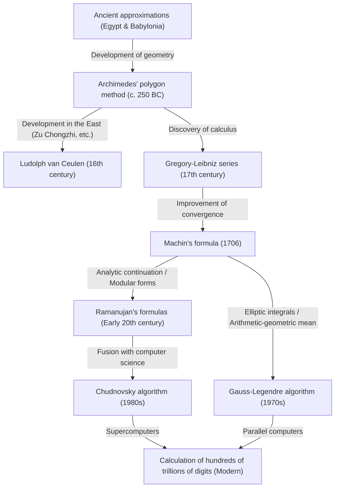

# 1. Introduction: The Fascinating Constant of Pi

In the history of humanity and mathematics, there is perhaps no other number that has captivated as many mathematicians and computer scientists, and has been continuously calculated, as pi ($\pi$). This simple constant, defined as the ratio of a circle's circumference to its diameter, possesses the profound properties of being both an irrational and transcendental number. It cannot be expressed as a fraction of rational numbers, nor can it be the root of any algebraic equation with rational coefficients. Its full picture can only be revealed as an endlessly continuing, irregular sequence of decimals.

In this article, we will thoroughly explain how humanity has improved the precision of pi from antiquity to modern supercomputers, delving into the history of calculation methods and the mathematical theories behind them. Starting with ancient geometric approaches, moving on to infinite series using calculus, and finally reaching the astonishing algorithms that support modern ultra-high-precision calculations, we will explore each deeply, accompanied by mathematical formulas and implementation codes in Python.

It is no exaggeration to say that the history of calculating pi is synonymous with the history of the development of human mathematics and computer science. Every time a new mathematical concept was discovered, the precision of calculating pi improved dramatically. Now, let us embark on this endless journey of exploration.



# 2. Ancient Approximations and Archimedes' Polygon Method (Geometric Approach)

## 2.1 The Understanding of Pi in Ancient Civilizations

The concept of pi was already known in ancient Babylonia and ancient Egypt around 2000 BC. The Babylonians used the fact that a circle's circumference is slightly longer than that of a regular hexagon, employing an approximation of $3 + 1/8 = 3.125$. In Egypt, the "Rhind Mathematical Papyrus" describes a method for calculating the area of a circle using the square of $8/9$ of the diameter, from which the derived pi is $(16/9)^2 \approx 3.16049$. While these values were sufficiently accurate for practical purposes, they were merely approximations based on empirical rules.

## 2.2 Archimedes' Geometric Method

The first person to formulate the calculation of pi using a mathematically rigorous method was the great ancient Greek mathematician Archimedes (287 BC - 212 BC). Using regular polygons inscribed in and circumscribed around a circle, he showed that the true value of pi lies between the perimeters of these two polygons (the method of exhaustion).

Archimedes started with a regular hexagon and progressively doubled the number of sides, calculating for a regular 12-gon, 24-gon, 48-gon, and finally a regular 96-gon. As the number of sides increases, the perimeter of the polygon approaches the circumference of the circle.

Let the radius of the circle be $r=1$. The circumference of the circle is $2\pi$.
Let $p_n$ be the perimeter of the inscribed regular $n$-gon, and $P_n$ be the perimeter of the circumscribed regular $n$-gon. The following inequality holds:

$$ p_n < 2\pi < P_n $$

To calculate the side length of a regular $n$-gon, Archimedes repeatedly used geometric theorems equivalent to what we now call trigonometric functions (the Pythagorean theorem and the angle bisector theorem). Expressed in modern notation, the length of one side of an inscribed regular $n$-gon is $2 \sin(\pi/n)$, and that of a circumscribed regular $n$-gon is $2 \tan(\pi/n)$. Therefore, using semi-perimeters, we get:

$$ n \sin\left(\frac{\pi}{n}\right) < \pi < n \tan\left(\frac{\pi}{n}\right) $$

When the number of sides is doubled to $2n$, the recurrence relations for the semi-perimeters of the inscribed and circumscribed polygons (let's call them $s_n$ and $S_n$, respectively) are as follows:
(Here, $s_n = n \sin(\pi/n)$ and $S_n = n \tan(\pi/n)$)

$$ S_{2n} = \frac{2 s_n S_n}{s_n + S_n} $$
$$ s_{2n} = \sqrt{s_n S_{2n}} $$

Archimedes made full use of square root calculations (which were done by hand at the time using rational fractional approximations) and derived the following famous inequality from the calculations of the regular 96-gon:

$$ 3 \frac{10}{71} < \pi < 3 \frac{1}{7} $$
(In decimals, this is $3.1408... < \pi < 3.1428...$)

This "Archimedean approach" remained the basic method for calculating pi for nearly 2000 years until the invention of calculus in the 17th century. In the 16th century, the Dutch mathematician Ludolph van Ceulen used this method to calculate a regular $2^{62}$-gon, determining pi to 35 decimal places.

## 2.3 Simulating Archimedes' Method in Python

Let's use Python's `decimal` module to implement this geometric recurrence relation and calculate pi to a precision of several dozen digits.

```python
from decimal import Decimal, getcontext

def archimedes_pi(iterations: int, precision: int = 50) -> tuple[Decimal, Decimal]:
    '''
    Calculate pi using Archimedes' polygon method.
    iterations: The number of times the number of sides is doubled
    precision: Calculation precision (number of digits after the decimal point)
    '''
    getcontext().prec = precision + 5  # Allow extra precision to prevent intermediate rounding errors

    # Initial values: Regular hexagon (n=6)
    # For a circle of radius 1
    n = 6
    s_n = Decimal('3')               # Semi-perimeter of inscribed regular hexagon (6 * sin(pi/6) = 3)
    S_n = Decimal('6') / Decimal('3').sqrt() # Semi-perimeter of circumscribed regular hexagon (6 * tan(pi/6) = 2*sqrt(3))

    for _ in range(iterations):
        # Update based on the recurrence relation
        S_2n = (Decimal('2') * s_n * S_n) / (s_n + S_n)
        s_2n = (s_n * S_2n).sqrt()
        
        s_n, S_n = s_2n, S_2n
        n *= 2

    return s_n, S_n

if __name__ == '__main__':
    inner, outer = archimedes_pi(100, 50)
    print('Archimedes\' method (100 iterations)')
    print(f'Inscribed polygon approximation: {inner}')
    print(f'Circumscribed polygon approximation: {outer}')
```

Because this recurrence relation only improves precision by about 1 bit (in binary) per iteration, it is characterized by very slow convergence (linear convergence). Seeking faster methods of calculation, mathematicians began exploring new approaches.


# 3. The Dawn of Calculus: Approaches Using Infinite Series

Entering the 17th century, the discovery of calculus by Newton and Leibniz led to a dramatic evolution in mathematical methods. A paradigm shift occurred, moving from calculations by drawing geometric figures to algebraic calculations using "infinite series."

## 3.1 The Gregory-Leibniz Series

Discovered in 1671 by the Scottish mathematician James Gregory and independently rediscovered in 1674 by the German mathematician Gottfried Leibniz, this is the infinite series expansion of the arctangent function.

$$ \arctan(x) = x - \frac{x^3}{3} + \frac{x^5}{5} - \frac{x^7}{7} + \cdots = \sum_{k=0}^{\infty} \frac{(-1)^k x^{2k+1}}{2k+1} $$

By substituting $x = 1$ into this formula, since $\arctan(1) = \pi/4$, we obtain a beautiful formula that allows us to directly calculate pi. This is called the "Gregory-Leibniz series."

$$ \frac{\pi}{4} = 1 - \frac{1}{3} + \frac{1}{5} - \frac{1}{7} + \frac{1}{9} - \cdots $$

The beauty of this series lies in the fact that pi can be found simply by alternately adding and subtracting the reciprocals of odd numbers. Although this formula was received with mathematical astonishment, from a practical standpoint of actually calculating pi, it had a fatal flaw: its convergence is desperately slow.

For example, to get a precision of just 2 decimal places (3.14), hundreds of terms must be calculated. To get a precision of 10 decimal places, a staggering 5 billion terms must be added together. Therefore, this formula itself was never used to break records for the number of digits of pi. However, the very idea of expanding the arctangent into a series became the foundation for faster calculation methods that would appear later.

# 4. Machin's Formula and the Development of Analysis

## 4.1 The Addition Theorem of Arctangent and Machin's Formula

To overcome the slow convergence of the Gregory-Leibniz series, values of $x$ smaller than $x=1$ must be substituted into the arctangent series (because the smaller $x$ is, the faster $x^{2k+1}$ becomes small, leading to quicker convergence).

In 1706, the English mathematician John Machin cleverly utilized the addition theorem of the arctangent to discover a groundbreaking formula.

The addition theorem of the arctangent is as follows:
$$ \arctan(x) + \arctan(y) = \arctan\left(\frac{x+y}{1-xy}\right) $$

Machin focused on the value of $\arctan(1/5)$. This is because $x=1/5$ is easy to calculate (you just double it and shift the decimal point one place). By doubling this using the addition theorem:
$$ 2 \arctan\left(\frac{1}{5}\right) = \arctan\left(\frac{5/12}{1}\right) = \arctan\left(\frac{120}{119}\right) $$

Doubling this again gives $4 \arctan(1/5)$. Proceeding with the calculation, it turns out that this value is very close to $\arctan(1) = \pi/4$. Finding the difference:

$$ 4 \arctan\left(\frac{1}{5}\right) - \frac{\pi}{4} = \arctan\left(\frac{1}{239}\right) $$

Rearranging this yields the famous "Machin's formula":

$$ \frac{\pi}{4} = 4 \arctan\left(\frac{1}{5}\right) - \arctan\left(\frac{1}{239}\right) $$

The brilliant point of this formula is that substituting the relatively small values of $x=1/5$ and $x=1/239$ into the Gregory-Leibniz series results in a dramatic speed of convergence. Machin himself used this formula to calculate 100 digits of pi by hand in one go.

Subsequently, similar approaches (methods using more complex linear combinations of arctangents) were discovered one after another, and until the mid-20th century when electronic computers appeared, records for the digits of pi were broken using Machin-like formulas.

## 4.2 Implementing Machin's Formula in Python

Let's implement Machin's formula using Python's `decimal`.

```python
from decimal import Decimal, getcontext

def arctan(x_inv: int, precision: int) -> Decimal:
    '''
    Calculate arctan(1/x) using the Gregory series
    '''
    getcontext().prec = precision + 10
    x_inv_dec = Decimal(x_inv)
    x_squared = x_inv_dec * x_inv_dec
    
    term = Decimal(1) / x_inv_dec
    total = term
    k = 1
    
    while True:
        term = term / x_squared
        current_term = term / Decimal(2*k + 1)
        if current_term == 0:
            break
            
        if k % 2 == 1:
            total -= current_term
        else:
            total += current_term
        k += 1
        
    return total

def machin_pi(precision: int = 100) -> Decimal:
    '''
    Calculate pi using Machin's formula
    '''
    getcontext().prec = precision + 10
    pi_over_4 = 4 * arctan(5, precision) - arctan(239, precision)
    pi = 4 * pi_over_4
    getcontext().prec = precision
    return +pi

if __name__ == '__main__':
    print('Calculation of 100 digits using Machin\'s formula:')
    print(machin_pi(100))
```
By running this code, 100 digits of pi can be calculated accurately in a fraction of a second.

# 5. Ramanujan's Astounding Formulas and Modular Forms

In the early 20th century, the genius Indian mathematician Srinivasa Ramanujan presented a completely new kind of approach to calculating pi. With deep intuition regarding elliptic integrals and modular equations, he discovered several extremely complex series that defied common sense, such as the following:

$$ \frac{1}{\pi} = \frac{2\sqrt{2}}{9801} \sum_{k=0}^{\infty} \frac{(4k)! (1103 + 26390k)}{(k!)^4 396^{4k}} $$

At first glance, this formula is so complex that one has no idea where it came from, but its convergence speed is incredible. Every time one term is calculated, the precision of pi is extended by about 8 digits.

Ramanujan's formulas represented a major shift in pi calculation methods from "series of inverse trigonometric functions" to "hypergeometric series and modular forms." Because computers did not exist at the time, his formulas did not show their true potential. However, when the competition to calculate pi using supercomputers intensified in the 1980s, new algorithms based on his theories were created one after another.

# 6. Modern Ultra-High-Precision Calculation: The Chudnovsky Algorithm

Taking Ramanujan's approach even further was the "Chudnovsky algorithm," published in 1988 by the Chudnovsky brothers (David Chudnovsky and Gregory Chudnovsky).

$$ \frac{1}{\pi} = 12 \sum_{k=0}^{\infty} \frac{(-1)^k (6k)! (13591409 + 545140134k)}{(3k)!(k!)^3 640320^{3k + 3/2}} $$

This algorithm is currently the standard calculation method most widely used when updating the world record for pi (which currently stands at 100 trillion digits) using supercomputers or personal PCs.

The reason for this is that precision improves at an astonishing pace of about 14 digits per term calculated. Furthermore, it is extremely compatible with computer science optimizations (such as divide-and-conquer computation of massive fractions via binary splitting), demonstrating exceptionally high performance when executed on parallel computers.

## 6.1 Implementing the Chudnovsky Algorithm in Python

Let's implement this astonishing algorithm using Python's `decimal`.

```python
from decimal import Decimal, getcontext
import math

def chudnovsky_pi(precision: int = 100) -> Decimal:
    '''
    Calculate pi using the Chudnovsky algorithm
    '''
    getcontext().prec = precision + 10
    
    C = 640320
    C3_OVER_24 = C**3 // 24
    
    total = Decimal(0)
    k = 0
    M = 1
    L = 13591409
    X = 1
    
    # Required number of terms (approx. 14 digits per term)
    max_k = precision // 14 + 1
    
    for k in range(max_k):
        term = Decimal(M * L) / X
        if k % 2 != 0:
            total -= term
        else:
            total += term
            
        # Update for the next term
        k_next = k + 1
        L += 545140134
        X *= C3_OVER_24
        M = (M * (12 * k_next - 10) * (12 * k_next - 6) * (12 * k_next - 2)) // (k_next**3)
        
    pi_inverse = Decimal(12) * total / Decimal(C**3).sqrt()
    getcontext().prec = precision
    return Decimal(1) / pi_inverse

if __name__ == '__main__':
    print('Calculation of 100 digits using the Chudnovsky algorithm:')
    print(chudnovsky_pi(100))
```
Executing the code above finds pi at unbelievable speed. It reaches 100 digits of precision in just a few loops (`max_k`).

# 7. The Gauss-Legendre Algorithm (Arithmetic-Geometric Mean Method)

When discussing pi calculation methods, another innovative algorithm that must not be forgotten is the "Gauss-Legendre algorithm." This was discovered independently by Richard Brent and Eugene Salamin in 1975.

The foundation of this algorithm is the theory of the "Arithmetic-Geometric Mean (AGM)" and elliptic integrals studied by Carl Friedrich Gauss.

Given two numbers $a_0$ and $b_0$, we create a sequence by repeatedly applying the arithmetic mean and the geometric mean as follows:

$$ a_{n+1} = \frac{a_n + b_n}{2} $$
$$ b_{n+1} = \sqrt{a_n b_n} $$

These two sequences converge very rapidly to the same value (the arithmetic-geometric mean). By combining this property with Legendre's relation for complete elliptic integrals, an algorithm for calculating pi was derived.

The initial values are set as follows:
$$ a_0 = 1, \quad b_0 = \frac{1}{\sqrt{2}}, \quad t_0 = \frac{1}{4}, \quad p_0 = 1 $$

Then, the following recurrence relations are iterated:
$$ a_{n+1} = \frac{a_n + b_n}{2} $$
$$ b_{n+1} = \sqrt{a_n b_n} $$
$$ t_{n+1} = t_n - p_n (a_n - a_{n+1})^2 $$
$$ p_{n+1} = 2 p_n $$

The approximation of pi at step $n$, $\pi_n$, is calculated as follows:
$$ \pi_n = \frac{(a_n + b_n)^2}{4 t_n} $$

The most prominent feature of this algorithm is its "quadratic convergence." This means it possesses the astonishing property that "the number of correct digits doubles" with each iteration. For example, precision improves at an explosive speed: 100 digits, 200 digits, 400 digits, 800 digits, and so on. When Professor Yasumasa Kanada's team at the University of Tokyo successfully calculated 206.1 billion digits in 1999, they used this algorithm.

## 7.1 Implementing the Gauss-Legendre Method in Python

```python
from decimal import Decimal, getcontext

def gauss_legendre_pi(iterations: int, precision: int = 100) -> Decimal:
    '''
    Calculate pi using the Gauss-Legendre algorithm
    '''
    getcontext().prec = precision + 10
    
    a = Decimal(1)
    b = Decimal(1) / Decimal(2).sqrt()
    t = Decimal(1) / Decimal(4)
    p = Decimal(1)
    
    for _ in range(iterations):
        a_next = (a + b) / 2
        b_next = (a * b).sqrt()
        t_next = t - p * (a - a_next)**2
        p_next = 2 * p
        
        a, b, t, p = a_next, b_next, t_next, p_next
        
    pi_approx = ((a + b)**2) / (4 * t)
    getcontext().prec = precision
    return +pi_approx

if __name__ == '__main__':
    # Over 100 digits of precision can be obtained with just 7 iterations
    print('Calculation using the Gauss-Legendre method:')
    print(gauss_legendre_pi(7, 100))
```

# 8. Conclusion: An Endless Quest

The calculation of pi, which began with ancient mathematicians drawing polygons in the sand, evolved into infinite series with the powerful weapon of calculus. Today, through advanced mathematical theories like modular forms and the arithmetic-geometric mean, combined with the computing power of supercomputers, it has reached an unfathomable precision of 100 trillion digits.

The competition to calculate pi is not just a game of seeking a sequence of numbers. The algorithms and computational techniques cultivated there (such as binary splitting and the multiplication of massive numbers using the Fast Fourier Transform) play crucial roles in a wide range of fields, including modern cryptography, numerical analysis, and the performance evaluation of computer architectures.

Because pi is an irrational number, its sequence of digits will never end. As long as human wisdom and the evolution of computers continue, the endless journey to find pi will also never end.
