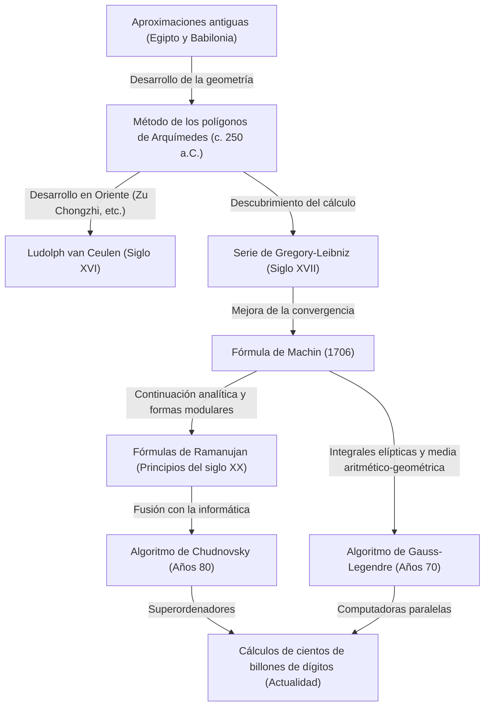

# 1. Introducción: La fascinante constante que es Pi

En la historia de la humanidad y las matemáticas, probablemente ningún otro número ha cautivado a tantos matemáticos y científicos de la computación, ni ha sido calculado con tanta persistencia, como Pi ($\pi$). Esta constante tan simple, definida como la razón entre la circunferencia de un círculo y su diámetro, posee profundas propiedades: es un número irracional y también trascendental. No puede expresarse como una fracción de números enteros, ni es la raíz de ninguna ecuación algebraica con coeficientes racionales, revelándose únicamente como una secuencia infinita e irregular de decimales.

En este artículo, exploraremos a fondo la historia y las teorías matemáticas detrás de los métodos de cálculo que la humanidad ha utilizado para mejorar la precisión de Pi, desde la antigüedad hasta los superordenadores modernos. Comenzando con el enfoque geométrico antiguo, pasando por las series infinitas usando cálculo, hasta llegar a los algoritmos asombrosos que respaldan los cálculos de ultra alta precisión de hoy en día. Profundizaremos en cada paso con fórmulas y código de implementación en Python.

No es exagerado decir que la historia del cálculo de Pi es la historia del desarrollo de las matemáticas y la informática de la humanidad. Cada vez que se ha descubierto un nuevo concepto matemático, la precisión del cálculo de Pi ha mejorado drásticamente. Así que, embarquémonos en este interminable viaje de descubrimiento.



# 2. Aproximaciones antiguas y el método de los polígonos de Arquímedes (Enfoque geométrico)

## 2.1 El conocimiento de Pi en las civilizaciones antiguas

El concepto de Pi ya era conocido en la antigua Babilonia y en el antiguo Egipto alrededor del 2000 a.C. Los babilonios usaban una aproximación de $3 + 1/8 = 3.125$, basándose en que la circunferencia de un círculo es un poco más larga que el perímetro de un hexágono regular. Además, el "Papiro Matemático Rhind" egipcio registra un método para calcular el área de un círculo utilizando el cuadrado de $8/9$ del diámetro, lo que lleva a un valor de Pi de $(16/9)^2 \approx 3.16049$. Aunque estos valores eran suficientemente precisos para propósitos prácticos, seguían siendo simples aproximaciones basadas en reglas empíricas.

## 2.2 El enfoque geométrico de Arquímedes

El gran matemático de la antigua Grecia, Arquímedes (287 a.C. - 212 a.C.), fue el primero en formular el cálculo de Pi mediante un método matemático riguroso. Utilizó polígonos regulares inscritos y circunscritos en un círculo para demostrar que el valor real de Pi se encuentra entre los perímetros de esos dos polígonos (el método de exhaución).

Comenzando con un hexágono regular y duplicando el número de lados, Arquímedes calculó para polígonos de 12, 24, 48 y, finalmente, 96 lados. A medida que aumenta el número de lados, el perímetro del polígono se acerca a la circunferencia del círculo.

Supongamos que el radio del círculo es $r=1$. Su circunferencia es $2\pi$.
Si el perímetro de un polígono regular inscrito de $n$ lados es $p_n$ y el perímetro del polígono regular circunscrito de $n$ lados es $P_n$, entonces se cumple la siguiente desigualdad:

$$ p_n < 2\pi < P_n $$

Para calcular la longitud de los lados de un polígono de $n$ lados, Arquímedes aplicó repetidamente teoremas geométricos equivalentes a las funciones trigonométricas modernas (el teorema de Pitágoras y el teorema de la bisectriz del ángulo). Expresado en notación moderna, la longitud de un lado del polígono regular inscrito de $n$ lados es $2 \sin(\pi/n)$, y la longitud de un lado del polígono regular circunscrito de $n$ lados es $2 \tan(\pi/n)$. Por lo tanto, utilizando el semiperímetro obtenemos:

$$ n \sin\left(\frac{\pi}{n}\right) < \pi < n \tan\left(\frac{\pi}{n}\right) $$

Las relaciones de recurrencia para los semiperímetros de los polígonos inscritos y circunscritos (denotados como $s_n$ y $S_n$ respectivamente) al duplicar el número de lados a $2n$ son las siguientes:
(Aquí, $s_n$ equivale a $n \sin(\pi/n)$ y $S_n$ a $n \tan(\pi/n)$)

$$ S_{2n} = \frac{2 s_n S_n}{s_n + S_n} $$
$$ s_{2n} = \sqrt{s_n S_{2n}} $$

Al calcular raíces cuadradas (lo que en su época se hacía manualmente utilizando aproximaciones con fracciones de números enteros), Arquímedes derivó la siguiente famosa desigualdad a partir de su cálculo con el polígono de 96 lados:

$$ 3 \frac{10}{71} < \pi < 3 \frac{1}{7} $$
(En decimales: $3.1408... < \pi < 3.1428...$)

Este "enfoque de Arquímedes" fue el método principal para calcular Pi durante casi 2000 años, hasta la invención del cálculo en el siglo XVII. El matemático holandés del siglo XVI Ludolph van Ceulen usó este método para calcular un polígono de $2^{62}$ lados y determinó Pi con 35 dígitos de precisión.

## 2.3 Simulación del método de Arquímedes en Python

Usemos el módulo `decimal` de Python para implementar esta relación de recurrencia geométrica y calcular Pi con decenas de dígitos de precisión.

```python
from decimal import Decimal, getcontext

def archimedes_pi(iterations: int, precision: int = 50) -> tuple[Decimal, Decimal]:
    '''
    Calcula Pi usando el método de los polígonos de Arquímedes.
    iterations: Número de veces que se duplica el número de lados.
    precision: Precisión del cálculo (número de lugares decimales).
    '''
    getcontext().prec = precision + 5  # Margen para evitar errores de redondeo intermedios

    # Valor inicial: Hexágono regular (n=6)
    # Para un círculo de radio 1
    n = 6
    s_n = Decimal('3')               # Semiperímetro del hexágono inscrito (6 * sin(pi/6) = 3)
    S_n = Decimal('6') / Decimal('3').sqrt() # Semiperímetro del hexágono circunscrito (6 * tan(pi/6) = 2*sqrt(3))

    for _ in range(iterations):
        # Actualización según la relación de recurrencia
        S_2n = (Decimal('2') * s_n * S_n) / (s_n + S_n)
        s_2n = (s_n * S_2n).sqrt()
        
        s_n, S_n = s_2n, S_2n
        n *= 2

    return s_n, S_n

if __name__ == '__main__':
    inner, outer = archimedes_pi(100, 50)
    print('Método de Arquímedes (100 iteraciones)')
    print(f'Aproximación por polígono inscrito: {inner}')
    print(f'Aproximación por polígono circunscrito: {outer}')
```

Dado que esta relación de recurrencia mejora la precisión en aproximadamente solo 1 bit en sistema binario con cada iteración, una de sus características es que la convergencia es extremadamente lenta (convergencia lineal). Buscando métodos de cálculo más rápidos, los matemáticos comenzaron a explorar nuevos enfoques.


# 3. El amanecer del cálculo: El enfoque con series infinitas

En el siglo XVII, el descubrimiento del cálculo por Newton y Leibniz provocó una evolución dramática en los métodos matemáticos. Ocurrió un cambio de paradigma desde los métodos de cálculo basados en el dibujo de figuras geométricas, a los cálculos algebraicos utilizando "series infinitas".

## 3.1 La serie de Gregory-Leibniz

La expansión en serie infinita de la función arcotangente fue descubierta en 1671 por el matemático escocés James Gregory e independientemente redescubierta en 1674 por el matemático alemán Gottfried Wilhelm Leibniz.

$$ \arctan(x) = x - \frac{x^3}{3} + \frac{x^5}{5} - \frac{x^7}{7} + \cdots = \sum_{k=0}^{\infty} \frac{(-1)^k x^{2k+1}}{2k+1} $$

Al sustituir $x = 1$ en esta fórmula, dado que $\arctan(1) = \pi/4$, obtenemos una hermosa ecuación que nos permite calcular Pi directamente. A esto se le llama la "serie de Gregory-Leibniz".

$$ \frac{\pi}{4} = 1 - \frac{1}{3} + \frac{1}{5} - \frac{1}{7} + \frac{1}{9} - \cdots $$

La belleza de esta serie radica en que Pi se puede encontrar simplemente sumando y restando alternativamente los recíprocos de los números impares. Si bien fue recibida con sorpresa matemática, desde una perspectiva práctica para calcular Pi, tenía un defecto fatal: "la convergencia es desesperadamente lenta".

Por ejemplo, incluso para obtener solo dos decimales de precisión (3.14), se necesitan cientos de términos. Para lograr una precisión de 10 lugares decimales, ¡se requiere sumar asombrosamente más de 5 mil millones de términos! En consecuencia, esta ecuación exacta nunca se utilizó para batir los récords de dígitos de Pi. Sin embargo, la idea misma de la expansión en serie de la arcotangente se convirtió en la base para métodos de cálculo mucho más rápidos que surgieron después.

# 4. La fórmula de Machin y el desarrollo del análisis matemático

## 4.1 El teorema de la adición de la arcotangente y la fórmula de Machin

Para superar la lenta convergencia de la serie de Gregory-Leibniz, en lugar de $x=1$, es necesario introducir valores más pequeños de $x$ en la serie de la arcotangente (porque cuanto menor sea $x$, más rápidamente disminuye $x^{2k+1}$ y más rápido converge).

En 1706, el matemático británico John Machin descubrió una fórmula innovadora utilizando inteligentemente el teorema de la adición de la arcotangente.

El teorema de la adición para la arcotangente es el siguiente:
$$ \arctan(x) + \arctan(y) = \arctan\left(\frac{x+y}{1-xy}\right) $$

Machin se centró en el valor $\arctan(1/5)$. Esto se debe a que el cálculo con $x=1/5$ es sencillo (solo implica multiplicar por 2 y desplazar un dígito). Si duplicamos esto usando el teorema de la adición:
$$ 2 \arctan\left(\frac{1}{5}\right) = \arctan\left(\frac{5/12}{1}\right) = \arctan\left(\frac{120}{119}\right) $$

Duplicando esto nuevamente, obtenemos $4 \arctan(1/5)$. Al continuar el cálculo, nos damos cuenta de que este valor es muy cercano a $\arctan(1) = \pi/4$. Calculando la diferencia:

$$ 4 \arctan\left(\frac{1}{5}\right) - \frac{\pi}{4} = \arctan\left(\frac{1}{239}\right) $$

Al reorganizar esto, obtenemos la famosa "fórmula de Machin":

$$ \frac{\pi}{4} = 4 \arctan\left(\frac{1}{5}\right) - \arctan\left(\frac{1}{239}\right) $$

El aspecto brillante de esta fórmula es que al introducir valores relativamente pequeños de $x=1/5$ y $x=1/239$ en la serie de Gregory-Leibniz, converge a una velocidad espectacular. El propio Machin usó esta fórmula para calcular a mano los primeros 100 dígitos de Pi de una vez.

Más tarde, se descubrieron de forma sucesiva enfoques similares (métodos usando combinaciones lineales más complejas de arcotangentes), y hasta mediados del siglo XX con la llegada de las calculadoras electrónicas, los récords de los dígitos de Pi se fueron rompiendo gracias a las fórmulas tipo Machin.

## 4.2 Implementación de la fórmula de Machin en Python

Usemos `decimal` de Python para implementar la fórmula de Machin.

```python
from decimal import Decimal, getcontext

def arctan(x_inv: int, precision: int) -> Decimal:
    '''
    Calcula arctan(1/x) usando la serie de Gregory
    '''
    getcontext().prec = precision + 10
    x_inv_dec = Decimal(x_inv)
    x_squared = x_inv_dec * x_inv_dec
    
    term = Decimal(1) / x_inv_dec
    total = term
    k = 1
    
    while True:
        term = term / x_squared
        current_term = term / Decimal(2*k + 1)
        if current_term == 0:
            break
            
        if k % 2 == 1:
            total -= current_term
        else:
            total += current_term
        k += 1
        
    return total

def machin_pi(precision: int = 100) -> Decimal:
    '''
    Calcula Pi usando la fórmula de Machin
    '''
    getcontext().prec = precision + 10
    pi_over_4 = 4 * arctan(5, precision) - arctan(239, precision)
    pi = 4 * pi_over_4
    getcontext().prec = precision
    return +pi

if __name__ == '__main__':
    print('Cálculo de 100 dígitos con la fórmula de Machin:')
    print(machin_pi(100))
```
Si ejecutas este código, calculará los primeros 100 dígitos de Pi de forma precisa en una fracción de segundo.

# 5. La asombrosa fórmula de Ramanujan y las formas modulares

A principios del siglo XX, el brillante matemático indio Srinivasa Ramanujan presentó un enfoque completamente nuevo con respecto a Pi. Con una intuición profunda en integrales elípticas y ecuaciones modulares, descubrió numerosas series increíblemente complejas e inusuales como la siguiente:

$$ \frac{1}{\pi} = \frac{2\sqrt{2}}{9801} \sum_{k=0}^{\infty} \frac{(4k)! (1103 + 26390k)}{(k!)^4 396^{4k}} $$

A simple vista, es imposible deducir de dónde provino esta fórmula, pero su velocidad de convergencia es fenomenal; por cada término calculado, añade aproximadamente 8 dígitos de precisión a Pi.

Las fórmulas de Ramanujan provocaron un gran cambio en los métodos de cálculo de Pi, pasando de "series de la función arcotangente" a "series hipergeométricas y formas modulares". Como no existían las computadoras en ese momento, sus fórmulas no alcanzaron todo su potencial, pero en la década de 1980, con la intensificación de la competencia para calcular Pi utilizando superordenadores, se desarrollaron rápidamente nuevos algoritmos basados en sus teorías.

# 6. Cálculo moderno de ultra alta precisión: El algoritmo de Chudnovsky

Llevando el enfoque de Ramanujan aún más lejos está el "algoritmo de Chudnovsky", publicado en 1988 por los hermanos Chudnovsky (David Chudnovsky y Gregory Chudnovsky).

$$ \frac{1}{\pi} = 12 \sum_{k=0}^{\infty} \frac{(-1)^k (6k)! (13591409 + 545140134k)}{(3k)!(k!)^3 640320^{3k + 3/2}} $$

Este algoritmo sigue siendo el método estándar más utilizado en la actualidad al establecer nuevos récords mundiales para Pi (ahora alcanzando los 100 billones de dígitos), ya sea utilizando supercomputadoras o PC personales.

La razón de esto es su asombrosa tasa de mejora de precisión de unos 14 dígitos con cada término calculado. Además, se adapta excepcionalmente bien a la optimización computacional (como los cálculos masivos de divide y vencerás de fracciones mediante el método de partición binaria), demostrando un rendimiento extremadamente alto en computadoras paralelas.

## 6.1 Implementación del algoritmo de Chudnovsky en Python

Implementemos este asombroso algoritmo usando `decimal` en Python.

```python
from decimal import Decimal, getcontext
import math

def chudnovsky_pi(precision: int = 100) -> Decimal:
    '''
    Calcula Pi usando el algoritmo de Chudnovsky
    '''
    getcontext().prec = precision + 10
    
    C = 640320
    C3_OVER_24 = C**3 // 24
    
    total = Decimal(0)
    k = 0
    M = 1
    L = 13591409
    X = 1
    
    # Número de términos requeridos (aproximadamente 14 dígitos por término)
    max_k = precision // 14 + 1
    
    for k in range(max_k):
        term = Decimal(M * L) / X
        if k % 2 != 0:
            total -= term
        else:
            total += term
            
        # Actualización para el siguiente término
        k_next = k + 1
        L += 545140134
        X *= C3_OVER_24
        M = (M * (12 * k_next - 10) * (12 * k_next - 6) * (12 * k_next - 2)) // (k_next**3)
        
    pi_inverse = Decimal(12) * total / Decimal(C**3).sqrt()
    getcontext().prec = precision
    return Decimal(1) / pi_inverse

if __name__ == '__main__':
    print('Cálculo de 100 dígitos con el algoritmo de Chudnovsky:')
    print(chudnovsky_pi(100))
```
Al ejecutar el código anterior, calculará Pi con una velocidad increíble. Alcanza una precisión de 100 dígitos con tan solo unos pocos bucles (`max_k`).

# 7. El algoritmo de Gauss-Legendre (Método de la media aritmético-geométrica)

En cuanto a los métodos de cálculo de Pi, otro algoritmo innovador que no debemos olvidar es el "algoritmo de Gauss-Legendre". Fue descubierto independientemente por Richard Brent y Eugene Salamin en 1975.

La base de este algoritmo es la teoría de la "media aritmético-geométrica" (AGM) y las integrales elípticas, estudiadas por Carl Friedrich Gauss.

Dados dos números $a_0, b_0$, aplicamos repetidamente la media aritmética y la media geométrica para crear dos secuencias de la siguiente manera:

$$ a_{n+1} = \frac{a_n + b_n}{2} $$
$$ b_{n+1} = \sqrt{a_n b_n} $$

Estas dos secuencias convergen muy rápidamente al mismo valor (la media aritmético-geométrica). Al combinar esta propiedad con la relación de Legendre para integrales elípticas completas, se obtuvo un algoritmo para calcular Pi.

Establecemos los valores iniciales de la siguiente manera:
$$ a_0 = 1, \quad b_0 = \frac{1}{\sqrt{2}}, \quad t_0 = \frac{1}{4}, \quad p_0 = 1 $$

Y luego iteramos con las siguientes relaciones de recurrencia:
$$ a_{n+1} = \frac{a_n + b_n}{2} $$
$$ b_{n+1} = \sqrt{a_n b_n} $$
$$ t_{n+1} = t_n - p_n (a_n - a_{n+1})^2 $$
$$ p_{n+1} = 2 p_n $$

El valor aproximado de Pi en el paso $n$, denotado como $\pi_n$, se calcula así:
$$ \pi_n = \frac{(a_n + b_n)^2}{4 t_n} $$

La característica principal de este algoritmo es su "convergencia cuadrática". Esto significa que posee la asombrosa propiedad de que "el número de dígitos correctos se duplica" con cada iteración. Por ejemplo, de 100 dígitos, salta a 200, 400, 800, mejorando la precisión a una velocidad explosiva. Este algoritmo también fue el que usó el equipo del profesor Yasumasa Kanada de la Universidad de Tokio en 1999 cuando lograron calcular 206,100 millones de dígitos.

## 7.1 Implementación del método de Gauss-Legendre en Python

```python
from decimal import Decimal, getcontext

def gauss_legendre_pi(iterations: int, precision: int = 100) -> Decimal:
    '''
    Calcula Pi usando el algoritmo de Gauss-Legendre
    '''
    getcontext().prec = precision + 10
    
    a = Decimal(1)
    b = Decimal(1) / Decimal(2).sqrt()
    t = Decimal(1) / Decimal(4)
    p = Decimal(1)
    
    for _ in range(iterations):
        a_next = (a + b) / 2
        b_next = (a * b).sqrt()
        t_next = t - p * (a - a_next)**2
        p_next = 2 * p
        
        a, b, t, p = a_next, b_next, t_next, p_next
        
    pi_approx = ((a + b)**2) / (4 * t)
    getcontext().prec = precision
    return +pi_approx

if __name__ == '__main__':
    # Se obtienen más de 100 dígitos de precisión con solo 7 iteraciones
    print('Cálculo con el método de Gauss-Legendre:')
    print(gauss_legendre_pi(7, 100))
```

# 8. Conclusión: Una búsqueda sin fin

El cálculo de Pi, que comenzó con los polígonos trazados en la arena por los antiguos matemáticos, evolucionó hacia las series infinitas armado con la poderosa herramienta del cálculo, y en la actualidad, a través de teorías matemáticas avanzadas como las formas modulares y la media aritmético-geométrica combinadas con el inmenso poder computacional de los superordenadores, ha alcanzado la absurda precisión de 100 billones de dígitos.

La carrera por calcular Pi no es un simple juego de encontrar secuencias de números. Los algoritmos y técnicas computacionales desarrolladas a lo largo de este camino (como la partición binaria y las multiplicaciones de números gigantes mediante transformadas rápidas de Fourier) juegan roles cruciales en una amplia variedad de campos modernos, como la criptografía, el análisis numérico y la evaluación del rendimiento de la arquitectura informática.

Puesto que Pi es un número irracional, su secuencia de dígitos nunca terminará. Mientras el intelecto humano y la evolución de los ordenadores continúen, este interminable viaje para buscar a Pi tampoco llegará a su fin.
