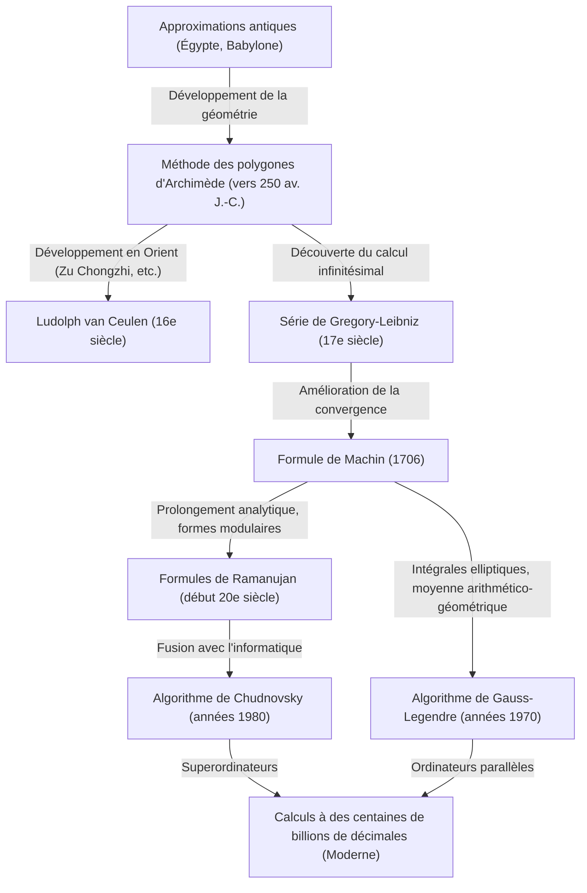

# 1. Introduction : La constante fascinante qu'est Pi

Dans toute l'histoire des mathématiques et de l'humanité, il n'y a probablement aucun autre nombre qui ait autant fasciné les mathématiciens et les informaticiens que Pi ($\pi$). Cette constante simple, définie comme le rapport de la circonférence d'un cercle à son diamètre, possède de profondes propriétés, étant à la fois un nombre irrationnel et transcendant. Incapable d'être exprimée comme une fraction de nombres entiers (rationnels) ou d'être la racine d'une équation algébrique à coefficients rationnels, elle ne révèle sa véritable nature que sous la forme d'une suite infinie et irrégulière de décimales.

Dans cet article, nous explorerons en détail comment l'humanité a amélioré la précision de Pi, de l'Antiquité aux superordinateurs modernes, en analysant l'histoire de ces méthodes de calcul et la théorie mathématique qui les sous-tend. En commençant par les approches géométriques antiques, en passant par les séries infinies du calcul infinitésimal, jusqu'aux algorithmes modernes époustouflants qui soutiennent les calculs d'ultra-haute précision, nous examinerons chaque étape en profondeur avec des formules et du code d'implémentation en Python.

Il n'est pas exagéré de dire que l'histoire du calcul de Pi est l'histoire du développement des mathématiques et de l'informatique. À chaque fois qu'un nouveau concept mathématique a été découvert, la précision du calcul de Pi a fait un bond spectaculaire. Embarquons ensemble dans cette quête sans fin.



# 2. Approximations antiques et méthode des polygones d'Archimède (Approche géométrique)

## 2.1 La perception de Pi dans les civilisations antiques

Dès l'an 2000 avant J.-C., dans la Babylone et l'Égypte antiques, le concept de Pi était déjà connu. Les Babyloniens, sachant que la circonférence d'un cercle était légèrement plus longue que celle d'un hexagone régulier, utilisaient l'approximation $3 + 1/8 = 3.125$. De plus, le "Papyrus Rhind" égyptien décrit une méthode pour calculer l'aire d'un cercle en élevant au carré les $8/9$ de son diamètre, ce qui donne un Pi équivalent à $(16/9)^2 \approx 3.16049$. Ces valeurs étaient suffisamment précises pour des applications pratiques, mais restaient des approximations basées sur l'expérience.

## 2.2 La méthode géométrique d'Archimède

Le grand mathématicien de la Grèce antique, Archimède (287 av. J.-C. - 212 av. J.-C.), fut le premier à formuler une méthode mathématiquement rigoureuse pour calculer Pi. En utilisant des polygones réguliers inscrits et circonscrits à un cercle, il a démontré que la vraie valeur de Pi se situait entre les périmètres de ces deux polygones (méthode d'exhaustion).

Archimède a commencé avec un hexagone régulier et a continuellement doublé le nombre de côtés, passant à des polygones à 12, 24, 48 et finalement 96 côtés. À mesure que le nombre de côtés augmente, le périmètre du polygone se rapproche de la circonférence du cercle.

Soit un cercle de rayon $r=1$. La circonférence du cercle est $2\pi$.
Soit $p_n$ le périmètre du polygone régulier inscrit à $n$ côtés, et $P_n$ le périmètre du polygone régulier circonscrit à $n$ côtés. L'inégalité suivante s'applique :

$$ p_n < 2\pi < P_n $$

Pour calculer la longueur des côtés des polygones à $n$ côtés, Archimède a utilisé de manière répétitive des théorèmes géométriques équivalant aux fonctions trigonométriques modernes (le théorème de [Pythagore](/fr/p/pythagoras/) et le théorème de la bissectrice). Dans la notation moderne, la longueur d'un côté du polygone régulier inscrit à $n$ côtés est $2 \sin(\pi/n)$, et celle du polygone régulier circonscrit à $n$ côtés est $2 \tan(\pi/n)$. Ainsi, en utilisant le demi-périmètre, nous obtenons :

$$ n \sin\left(\frac{\pi}{n}\right) < \pi < n \tan\left(\frac{\pi}{n}\right) $$

La relation de récurrence pour les demi-périmètres des polygones inscrits et circonscrits lorsque le nombre de côtés double à $2n$ (notés respectivement $s_n, S_n$) est la suivante :
(Où $s_n = n \sin(\pi/n), S_n = n \tan(\pi/n)$)

$$ S_{2n} = \frac{2 s_n S_n}{s_n + S_n} $$
$$ s_{2n} = \sqrt{s_n S_{2n}} $$

Archimède a utilisé des calculs de racines carrées (à l'époque effectués à la main à l'aide d'approximations fractionnaires rationnelles) et, à partir de ses calculs pour un polygone à 96 côtés, a dérivé la célèbre inégalité suivante :

$$ 3 \frac{10}{71} < \pi < 3 \frac{1}{7} $$
(Sous forme décimale, $3.1408... < \pi < 3.1428...$)

Cette "approche d'Archimède" est restée la méthode fondamentale pour calculer Pi pendant près de 2000 ans, jusqu'à l'invention du calcul infinitésimal au 17e siècle. Au 16e siècle, le mathématicien néerlandais Ludolph van Ceulen a utilisé cette méthode pour calculer un polygone à $2^{62}$ côtés, déterminant Pi jusqu'à 35 décimales.

## 2.3 Simulation de la méthode d'Archimède en Python

Utilisons le module `decimal` de Python pour implémenter cette relation de récurrence géométrique et calculer Pi à plusieurs dizaines de décimales.

```python
from decimal import Decimal, getcontext

def archimedes_pi(iterations: int, precision: int = 50) -> tuple[Decimal, Decimal]:
    '''
    Calcule Pi en utilisant la méthode des polygones d'Archimède.
    iterations: Nombre de fois où le nombre de côtés est doublé
    precision: Précision du calcul (nombre de décimales)
    '''
    getcontext().prec = precision + 5  # Marge pour éviter les erreurs d'arrondi intermédiaires

    # Valeur initiale : hexagone régulier (n=6)
    # Hexagone régulier pour un cercle de rayon 1
    n = 6
    s_n = Decimal('3')               # Demi-périmètre de l'hexagone régulier inscrit (6 * sin(pi/6) = 3)
    S_n = Decimal('6') / Decimal('3').sqrt() # Demi-périmètre de l'hexagone régulier circonscrit (6 * tan(pi/6) = 2*sqrt(3))

    for _ in range(iterations):
        # Mise à jour basée sur la relation de récurrence
        S_2n = (Decimal('2') * s_n * S_n) / (s_n + S_n)
        s_2n = (s_n * S_2n).sqrt()
        
        s_n, S_n = s_2n, S_2n
        n *= 2

    return s_n, S_n

if __name__ == '__main__':
    inner, outer = archimedes_pi(100, 50)
    print("Méthode d'Archimède (100 itérations)")
    print(f'Approximation par polygone inscrit : {inner}')
    print(f'Approximation par polygone circonscrit : {outer}')
```

Cette relation de récurrence présente une caractéristique de convergence très lente (convergence linéaire) car chaque itération n'améliore la précision que d'environ un bit en binaire. À la recherche de méthodes plus rapides, les mathématiciens ont commencé à explorer de nouvelles approches.


# 3. L'aube du calcul infinitésimal : Approche par séries infinies

Au 17e siècle, avec la découverte du calcul infinitésimal par Newton et Leibniz, les méthodes mathématiques ont connu une évolution spectaculaire. Un changement de paradigme s'est produit, passant du tracé de figures géométriques à l'utilisation algébrique des "séries infinies".

## 3.1 Série de Gregory-Leibniz

En 1671, le mathématicien écossais James Gregory a découvert, et le mathématicien allemand [Gottfried Leibniz](/fr/p/leibniz/) a redécouvert indépendamment en 1674, le développement en série infinie de la fonction arc tangente (arctangente).

$$ \arctan(x) = x - \frac{x^3}{3} + \frac{x^5}{5} - \frac{x^7}{7} + \cdots = \sum_{k=0}^{\infty} \frac{(-1)^k x^{2k+1}}{2k+1} $$

En substituant $x = 1$ dans cette formule, sachant que $\arctan(1) = \pi/4$, on obtient une magnifique formule pour calculer Pi directement. C'est ce qu'on appelle la "série de Gregory-Leibniz".

$$ \frac{\pi}{4} = 1 - \frac{1}{3} + \frac{1}{5} - \frac{1}{7} + \frac{1}{9} - \cdots $$

La beauté de cette série réside dans le fait que Pi peut être calculé en additionnant et soustrayant simplement les inverses des nombres impairs. Accueillie avec un émerveillement mathématique, cette formule avait cependant un défaut majeur pour le calcul pratique de Pi : sa convergence est "désespérément lente".

Par exemple, pour obtenir ne serait-ce que deux décimales de précision (3.14), il faut calculer des centaines de termes. Pour atteindre 10 décimales de précision, plus de 5 milliards de termes doivent être additionnés. Par conséquent, cette formule n'a jamais été utilisée en l'état pour battre des records de calcul des décimales de Pi. Cependant, l'idée même du développement en série de l'arctangente a servi de base à des méthodes de calcul beaucoup plus rapides apparues plus tard.

# 4. Formule de Machin et développement de l'analyse

## 4.1 Formule d'addition pour l'arctangente et formule de Machin

Pour surmonter la lenteur de la convergence de la série de Gregory-Leibniz, il était nécessaire de substituer une valeur de $x$ beaucoup plus petite que $x=1$ dans la série de l'arctangente (car plus $x$ est petit, plus $x^{2k+1}$ diminue rapidement et plus la série converge vite).

En 1706, le mathématicien anglais John Machin a utilisé intelligemment la formule d'addition de l'arctangente pour découvrir une formule révolutionnaire.

La formule d'addition de l'arctangente est la suivante :
$$ \arctan(x) + \arctan(y) = \arctan\left(\frac{x+y}{1-xy}\right) $$

Machin s'est concentré sur la valeur de $\arctan(1/5)$. Il a choisi $x=1/5$ car il est facile à calculer (il suffit de multiplier par 2 et de décaler d'une décimale). En utilisant la formule de l'angle double de l'addition :
$$ 2 \arctan\left(\frac{1}{5}\right) = \arctan\left(\frac{5/12}{1}\right) = \arctan\left(\frac{120}{119}\right) $$

En doublant encore cet angle, on obtient $4 \arctan(1/5)$. En poursuivant le calcul, on s'aperçoit que cette valeur est extrêmement proche de $\arctan(1) = \pi/4$. En calculant la différence :

$$ 4 \arctan\left(\frac{1}{5}\right) - \frac{\pi}{4} = \arctan\left(\frac{1}{239}\right) $$

En réorganisant cela, on obtient la célèbre "formule de Machin".

$$ \frac{\pi}{4} = 4 \arctan\left(\frac{1}{5}\right) - \arctan\left(\frac{1}{239}\right) $$

La grandeur de cette formule réside dans le fait que $x=1/5$ et $x=1/239$, des valeurs relativement petites, sont substituées dans la série de Gregory-Leibniz, ce qui entraîne une convergence extrêmement rapide. Machin lui-même a utilisé cette formule pour calculer à la main 100 décimales de Pi d'un seul coup.

Par la suite, des approches similaires (utilisant des combinaisons linéaires plus complexes d'arctangentes) ont été découvertes l'une après l'autre, et jusqu'à l'avènement des calculatrices électroniques au milieu du 20e siècle, les records du nombre de décimales de Pi étaient sans cesse battus grâce à des formules de type Machin.

## 4.2 Implémentation de la formule de Machin en Python

Implémentons la formule de Machin à l'aide de `decimal` en Python.

```python
from decimal import Decimal, getcontext

def arctan(x_inv: int, precision: int) -> Decimal:
    '''
    Calcule arctan(1/x) à l'aide de la série de Gregory
    '''
    getcontext().prec = precision + 10
    x_inv_dec = Decimal(x_inv)
    x_squared = x_inv_dec * x_inv_dec
    
    term = Decimal(1) / x_inv_dec
    total = term
    k = 1
    
    while True:
        term = term / x_squared
        current_term = term / Decimal(2*k + 1)
        if current_term == 0:
            break
            
        if k % 2 == 1:
            total -= current_term
        else:
            total += current_term
        k += 1
        
    return total

def machin_pi(precision: int = 100) -> Decimal:
    '''
    Calcule Pi à l'aide de la formule de Machin
    '''
    getcontext().prec = precision + 10
    pi_over_4 = 4 * arctan(5, precision) - arctan(239, precision)
    pi = 4 * pi_over_4
    getcontext().prec = precision
    return +pi

if __name__ == '__main__':
    print('Calcul à 100 décimales avec la formule de Machin :')
    print(machin_pi(100))
```
L'exécution de ce code permet de trouver avec précision les 100 premières décimales de Pi en une fraction de seconde.

# 5. Les merveilleuses formules de Ramanujan et les formes modulaires

Au début du 20e siècle, le génie mathématique indien Srinivasa Ramanujan a proposé un tout nouveau type d'approche pour Pi. Il avait une profonde intuition concernant les intégrales elliptiques et les équations modulaires, et a découvert plusieurs séries étonnamment complexes et peu conventionnelles telles que :

$$ \frac{1}{\pi} = \frac{2\sqrt{2}}{9801} \sum_{k=0}^{\infty} \frac{(4k)! (1103 + 26390k)}{(k!)^4 396^{4k}} $$

À première vue, cette formule est si complexe qu'il est difficile de voir d'où elle provient, mais sa vitesse de convergence est stupéfiante, ajoutant environ 8 décimales de précision à Pi pour chaque terme calculé.

Les formules de Ramanujan ont constitué un changement majeur dans le calcul de Pi, passant des "séries de la fonction arc tangente" aux "séries hypergéométriques et formes modulaires". Ses formules n'ont pas révélé leur véritable potentiel à l'époque car les ordinateurs n'existaient pas, mais dans les années 1980, lorsque la compétition pour calculer Pi avec des superordinateurs s'est intensifiée, de nouveaux algorithmes basés sur sa théorie ont vu le jour.

# 6. Calcul moderne d'ultra-haute précision : Algorithme de Chudnovsky

L'approche de Ramanujan a été poussée encore plus loin par l'algorithme de Chudnovsky, publié en 1988 par les frères Chudnovsky (David Chudnovsky et Gregory Chudnovsky).

$$ \frac{1}{\pi} = 12 \sum_{k=0}^{\infty} \frac{(-1)^k (6k)! (13591409 + 545140134k)}{(3k)!(k!)^3 640320^{3k + 3/2}} $$

Cet algorithme est encore aujourd'hui la méthode de calcul standard la plus largement utilisée pour battre les records mondiaux de calcul de Pi (actuellement à 100 billions de décimales) sur des superordinateurs et même sur des PC personnels.

La raison en est qu'il améliore la précision d'un rythme incroyable d'environ 14 décimales pour chaque terme calculé. De plus, il est très compatible avec les optimisations de l'informatique (comme le calcul diviser-pour-régner de fractions géantes en utilisant la méthode d'éclatement binaire) et démontre des performances extrêmement élevées lorsqu'il est exécuté sur des ordinateurs parallèles.

## 6.1 Implémentation de l'algorithme de Chudnovsky en Python

Implémentons cet algorithme époustouflant à l'aide de `decimal` en Python.

```python
from decimal import Decimal, getcontext
import math

def chudnovsky_pi(precision: int = 100) -> Decimal:
    '''
    Calcule Pi à l'aide de l'algorithme de Chudnovsky
    '''
    getcontext().prec = precision + 10
    
    C = 640320
    C3_OVER_24 = C**3 // 24
    
    total = Decimal(0)
    k = 0
    M = 1
    L = 13591409
    X = 1
    
    # Nombre de termes requis (environ 14 décimales par terme)
    max_k = precision // 14 + 1
    
    for k in range(max_k):
        term = Decimal(M * L) / X
        if k % 2 != 0:
            total -= term
        else:
            total += term
            
        # Mise à jour pour le terme suivant
        k_next = k + 1
        L += 545140134
        X *= C3_OVER_24
        M = (M * (12 * k_next - 10) * (12 * k_next - 6) * (12 * k_next - 2)) // (k_next**3)
        
    pi_inverse = Decimal(12) * total / Decimal(C**3).sqrt()
    getcontext().prec = precision
    return Decimal(1) / pi_inverse

if __name__ == '__main__':
    print('Calcul à 100 décimales avec l\'algorithme de Chudnovsky :')
    print(chudnovsky_pi(100))
```
Lors de l'exécution du code ci-dessus, Pi est calculé à une vitesse incroyable. Il atteint 100 décimales de précision en quelques boucles seulement (`max_k`).

# 7. Algorithme de Gauss-Legendre (Méthode de la moyenne arithmético-géométrique)

Un autre algorithme innovant qui ne doit pas être oublié dans les méthodes de calcul de Pi est l'"algorithme de Gauss-Legendre". Il a été découvert indépendamment en 1975 par Richard Brent et Eugene Salamin.

Cet algorithme est basé sur la théorie de la "moyenne arithmético-géométrique (MAG)" et des intégrales elliptiques étudiées par [Carl Friedrich Gauss](/fr/p/gauss/).

Étant donné deux nombres $a_0, b_0$, on crée une suite en appliquant répétitivement la moyenne arithmétique et la moyenne géométrique de la manière suivante :

$$ a_{n+1} = \frac{a_n + b_n}{2} $$
$$ b_{n+1} = \sqrt{a_n b_n} $$

Ces deux suites convergent très rapidement vers la même valeur (la moyenne arithmético-géométrique). En combinant cette propriété avec la relation de Legendre pour les intégrales elliptiques complètes, un algorithme pour calculer Pi a été dérivé.

Les valeurs initiales sont définies comme suit :
$$ a_0 = 1, \quad b_0 = \frac{1}{\sqrt{2}}, \quad t_0 = \frac{1}{4}, \quad p_0 = 1 $$

Puis, la récurrence suivante est itérée :
$$ a_{n+1} = \frac{a_n + b_n}{2} $$
$$ b_{n+1} = \sqrt{a_n b_n} $$
$$ t_{n+1} = t_n - p_n (a_n - a_{n+1})^2 $$
$$ p_{n+1} = 2 p_n $$

L'approximation de Pi à l'étape $n$, notée $\pi_n$, se calcule ainsi :
$$ \pi_n = \frac{(a_n + b_n)^2}{4 t_n} $$

La plus grande caractéristique de cet algorithme est sa "convergence quadratique". En d'autres termes, il possède la propriété étonnante que "le nombre de chiffres corrects double" à chaque itération. Par exemple, la précision s'améliore à une vitesse explosive : 100 chiffres, 200 chiffres, 400 chiffres, 800 chiffres. Cet algorithme a également été utilisé en 1999 lorsque l'équipe du professeur Yasumasa Kanada de l'Université de Tokyo a réussi à calculer 206,1 milliards de décimales.

## 7.1 Implémentation de la méthode de Gauss-Legendre en Python

```python
from decimal import Decimal, getcontext

def gauss_legendre_pi(iterations: int, precision: int = 100) -> Decimal:
    '''
    Calcule Pi avec l'algorithme de Gauss-Legendre
    '''
    getcontext().prec = precision + 10
    
    a = Decimal(1)
    b = Decimal(1) / Decimal(2).sqrt()
    t = Decimal(1) / Decimal(4)
    p = Decimal(1)
    
    for _ in range(iterations):
        a_next = (a + b) / 2
        b_next = (a * b).sqrt()
        t_next = t - p * (a - a_next)**2
        p_next = 2 * p
        
        a, b, t, p = a_next, b_next, t_next, p_next
        
    pi_approx = ((a + b)**2) / (4 * t)
    getcontext().prec = precision
    return +pi_approx

if __name__ == '__main__':
    # Plus de 100 décimales de précision obtenues en seulement 7 itérations
    print('Calcul par la méthode de Gauss-Legendre :')
    print(gauss_legendre_pi(7, 100))
```

# 8. Conclusion : Une quête sans fin

Le calcul de Pi, qui a commencé par les polygones tracés dans le sable par les mathématiciens de l'Antiquité, a évolué vers les séries infinies avec la puissante arme du calcul infinitésimal. Aujourd'hui, il a atteint une précision faramineuse de 100 billions de décimales grâce à des théories mathématiques avancées telles que les formes modulaires et la moyenne arithmético-géométrique, combinées à la puissance de calcul des superordinateurs.

La compétition pour calculer Pi n'est pas qu'un simple passe-temps visant à trouver une longue suite de nombres. Les algorithmes et les méthodes de calcul développés au cours de cette démarche (comme la division binaire et la multiplication de nombres géants via la transformée de Fourier rapide) jouent un rôle crucial dans divers domaines tels que la cryptographie moderne, l'analyse numérique et l'évaluation des performances des architectures informatiques.

Puisque Pi est un nombre irrationnel, sa séquence de chiffres ne finira jamais. Tant que la sagesse humaine et l'évolution des ordinateurs se poursuivront, la quête sans fin pour calculer Pi ne s'achèvera jamais non plus.
