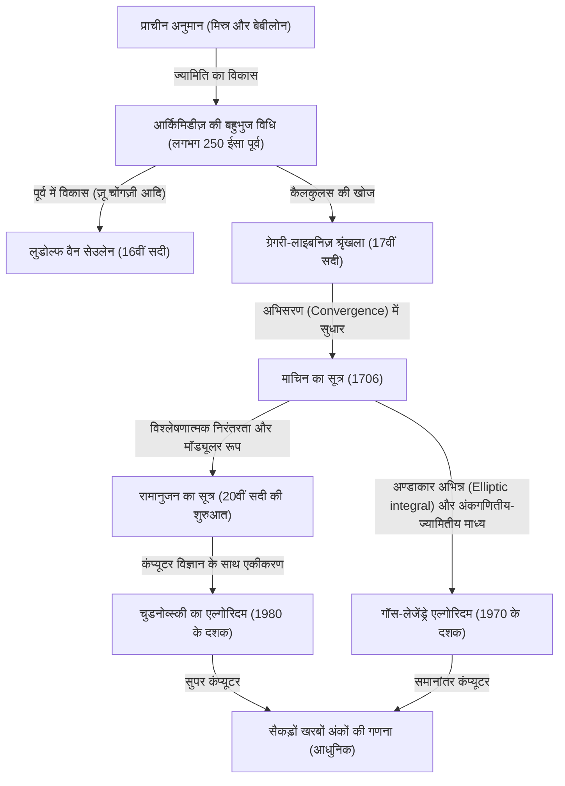

# 1. परिचय: पाय (Pi) नामक आकर्षक स्थिरांक

मानवता और गणित के इतिहास में, शायद ही कोई अन्य संख्या होगी जिसने पाय ($\pi$) जितना गणितज्ञों और कंप्यूटर वैज्ञानिकों को आकर्षित किया हो और जिसकी इतनी गणना की गई हो। वृत्त की परिधि और उसके व्यास के अनुपात के रूप में परिभाषित यह सरल स्थिरांक एक अपरिमेय (irrational) और साथ ही एक पारलौकिक (transcendental) संख्या होने का गहरा गुण रखता है। इसे परिमेय संख्याओं के भिन्न के रूप में व्यक्त नहीं किया जा सकता है, और यह किसी भी परिमेय गुणांक वाले बीजीय समीकरण का मूल (root) नहीं बन सकता। यह संख्या केवल अनंत तक चलने वाले अनियमित दशमलव अनुक्रम के रूप में अपना पूरा रूप दिखाती है।

इस लेख में, हम गहराई से चर्चा करेंगे कि प्राचीन काल से लेकर आधुनिक सुपर कंप्यूटरों तक, मानवता ने पाय (Pi) की सटीकता को कैसे बढ़ाया है, इसकी गणना विधियों का इतिहास क्या है, और इसके पीछे का गणितीय सिद्धांत क्या है। प्राचीन ज्यामितीय दृष्टिकोण से शुरू करके, कैलकुलस का उपयोग करने वाली अनंत श्रृंखलाओं (infinite series), और यहाँ तक कि आधुनिक अति-सटीक गणनाओं का समर्थन करने वाले आश्चर्यजनक एल्गोरिदम तक, हम प्रत्येक गणितीय सूत्र और पायथन (Python) का उपयोग करके उनके कार्यान्वयन कोड के साथ इसकी गहराई में जाएंगे।

पाय की गणना का इतिहास कहना अतिशयोक्ति नहीं होगी कि यह मानव गणित और कंप्यूटर विज्ञान के विकास का ही इतिहास है। हर बार जब कोई नई गणितीय अवधारणा खोजी गई, तो पाय की गणना की सटीकता में नाटकीय रूप से सुधार हुआ। तो चलिए, इस अंतहीन खोज की यात्रा पर चलते हैं।



# 2. प्राचीन अनुमान और आर्किमिडीज़ की बहुभुज विधि (ज्यामितीय दृष्टिकोण)

## 2.1 प्राचीन सभ्यताओं में पाय (Pi) की मान्यता

लगभग 2000 ईसा पूर्व प्राचीन बेबीलोन और प्राचीन मिस्र में, पाय की अवधारणा पहले से ही ज्ञात थी। बेबीलोनियों ने इस तथ्य का उपयोग किया कि वृत्त की परिधि एक सम षट्भुज (regular hexagon) की परिधि से थोड़ी लंबी होती है, और $3 + 1/8 = 3.125$ के अनुमानित मान का उपयोग किया। इसके अलावा, मिस्र के 'राइंड गणितीय पेपिरस' (Rhind Mathematical Papyrus) में, वृत्त के क्षेत्रफल की गणना करते समय व्यास के $8/9$ के वर्ग का उपयोग करने की विधि दर्ज है, जिससे प्राप्त पाय का मान $(16/9)^2 \approx 3.16049$ होता है। हालांकि ये मान व्यावहारिक उपयोग के लिए पर्याप्त सटीकता रखते थे, लेकिन ये केवल अनुभवजन्य नियमों (rules of thumb) पर आधारित अनुमान थे।

## 2.2 आर्किमिडीज़ का ज्यामितीय दृष्टिकोण

पाय की गणना को पहली बार गणितीय रूप से कठोर तरीके से तैयार करने वाले व्यक्ति प्राचीन यूनान के महान गणितज्ञ आर्किमिडीज़ (287 ईसा पूर्व - 212 ईसा पूर्व) थे। उन्होंने एक वृत्त के अंदर खुदे हुए (inscribed) सम बहुभुज और बाहर बने (circumscribed) सम बहुभुज का उपयोग करके यह दिखाया कि पाय का सही मान उन दो सम बहुभुजों की परिधियों के बीच होता है (एक्जॉस्शन की विधि - method of exhaustion)।

आर्किमिडीज़ ने एक सम षट्भुज (hexagon) से शुरुआत की और भुजाओं की संख्या को दोगुना करते हुए, 12-भुजाओं वाले, 24-भुजाओं वाले, 48-भुजाओं वाले, और अंततः 96-भुजाओं वाले सम बहुभुज (regular 96-gon) तक गणना की। जैसे-जैसे भुजाओं की संख्या बढ़ती है, बहुभुज की परिधि वृत्त की परिधि के करीब आती जाती है।

मान लें कि वृत्त की त्रिज्या $r=1$ है। वृत्त की परिधि $2\pi$ है।
यदि खुदे हुए सम $n$-बहुभुज की परिधि $p_n$ है, और बाहर बने सम $n$-बहुभुज की परिधि $P_n$ है, तो निम्नलिखित असमानता (inequality) सत्य है:

$$ p_n < 2\pi < P_n $$

सम $n$-बहुभुज की भुजा की लंबाई की गणना करने के लिए, आर्किमिडीज़ ने ज्यामितीय प्रमेयों ([पाइथागोरस](/hi/p/pythagoras/) का प्रमेय और कोण द्विभाजक प्रमेय) का बार-बार उपयोग किया, जो आधुनिक त्रिकोणमितीय कार्यों के समतुल्य हैं। आधुनिक संकेतन में व्यक्त करने पर, खुदे हुए सम $n$-बहुभुज की एक भुजा की लंबाई $2 \sin(\pi/n)$ है, और बाहर बने सम $n$-बहुभुज की एक भुजा की लंबाई $2 \tan(\pi/n)$ है। इसलिए, अर्ध-परिधि (semi-perimeter) का उपयोग करने पर यह निम्न प्रकार होता है:

$$ n \sin\left(\frac{\pi}{n}\right) < \pi < n \tan\left(\frac{\pi}{n}\right) $$

जब भुजाओं की संख्या दोगुनी होकर $2n$ हो जाती है, तो खुदे हुए और बाहर बने बहुभुज की अर्ध-परिधियों (क्रमशः $s_n$ और $S_n$) के लिए पुनरावृत्ति संबंध (recurrence relation) निम्नलिखित है:
(यहाँ $s_n = n \sin(\pi/n)$ और $S_n = n \tan(\pi/n)$ के समतुल्य है)

$$ S_{2n} = \frac{2 s_n S_n}{s_n + S_n} $$
$$ s_{2n} = \sqrt{s_n S_{2n}} $$

आर्किमिडीज़ ने वर्गमूल (square root) की गणना का कुशल उपयोग किया (उस समय हाथ से गणना करके परिमेय भिन्नों के सन्निकटन का उपयोग किया जाता था) और 96-भुजाओं वाले सम बहुभुज की गणना से निम्नलिखित प्रसिद्ध असमानता निकाली:

$$ 3 \frac{10}{71} < \pi < 3 \frac{1}{7} $$
(दशमलव में $3.1408... < \pi < 3.1428...$)

यह "आर्किमिडीज़ का दृष्टिकोण" 17वीं सदी में कैलकुलस के आविष्कार तक, लगभग 2000 वर्षों तक पाय की गणना की मूल विधि बना रहा। 16वीं सदी में डच गणितज्ञ लुडोल्फ वैन सेउलेन ने इस विधि का उपयोग करके सम $2^{62}$-बहुभुज की गणना की और 35 दशमलव स्थानों तक पाय का मान ज्ञात किया।

## 2.3 पायथन (Python) के साथ आर्किमिडीज़ विधि का अनुकरण (Simulation)

आइए Python के `decimal` मॉड्यूल का उपयोग करके इस ज्यामितीय पुनरावृत्ति संबंध को लागू करें और दर्जनों दशमलव स्थानों की सटीकता के साथ पाय की गणना करें।

```python
from decimal import Decimal, getcontext

def archimedes_pi(iterations: int, precision: int = 50) -> tuple[Decimal, Decimal]:
    '''
    आर्किमिडीज़ की बहुभुज विधि का उपयोग करके पाय की गणना करें।
    iterations: भुजाओं की संख्या को दोगुना करने की संख्या
    precision: गणना सटीकता (दशमलव स्थानों की संख्या)
    '''
    getcontext().prec = precision + 5  # बीच में होने वाली राउंडिंग त्रुटियों से बचने के लिए कुछ अतिरिक्त मार्जिन रखें

    # प्रारंभिक मान: सम षट्भुज (n=6)
    # त्रिज्या 1 वाले वृत्त के लिए सम षट्भुज
    n = 6
    s_n = Decimal('3')               # खुदे हुए सम षट्भुज की अर्ध-परिधि (6 * sin(pi/6) = 3)
    S_n = Decimal('6') / Decimal('3').sqrt() # बाहर बने सम षट्भुज की अर्ध-परिधि (6 * tan(pi/6) = 2*sqrt(3))

    for _ in range(iterations):
        # पुनरावृत्ति संबंध के आधार पर अपडेट
        S_2n = (Decimal('2') * s_n * S_n) / (s_n + S_n)
        s_2n = (s_n * S_2n).sqrt()
        
        s_n, S_n = s_2n, S_2n
        n *= 2

    return s_n, S_n

if __name__ == '__main__':
    inner, outer = archimedes_pi(100, 50)
    print('आर्किमिडीज़ की विधि (100 पुनरावृत्तियाँ)')
    print(f'खुदे हुए बहुभुज का सन्निकटन: {inner}')
    print(f'बाहर बने बहुभुज का सन्निकटन: {outer}')
```

इस पुनरावृत्ति संबंध की विशेषता यह है कि यह बहुत धीमी गति से अभिसरण (कन्वर्ज) करता है (रैखिक अभिसरण - linear convergence), क्योंकि प्रत्येक पुनरावृत्ति (iteration) के साथ सटीकता में केवल लगभग 1 बिट (बाइनरी में) का सुधार होता है। तेज़ गणना विधियों की तलाश में, गणितज्ञों ने नए दृष्टिकोण तलाशने शुरू कर दिए।


# 3. कैलकुलस का उदय: अनंत श्रृंखला (Infinite Series) द्वारा दृष्टिकोण

17वीं सदी में प्रवेश करते ही, न्यूटन और लाइबनिज़ द्वारा कैलकुलस (calculus) की खोज के कारण गणितीय विधियों में नाटकीय विकास हुआ। ज्यामितीय आकृतियाँ बनाकर गणना करने के तरीके से बीजगणितीय "अनंत श्रृंखला" का उपयोग करके गणना करने की दिशा में एक प्रतिमान बदलाव (paradigm shift) हुआ।

## 3.1 ग्रेगरी-लाइबनिज़ श्रृंखला

1671 में स्कॉटिश गणितज्ञ जेम्स ग्रेगरी द्वारा खोजी गई और 1674 में जर्मन गणितज्ञ [गॉटफ्रीड लाइबनिज़](/hi/p/leibniz/) द्वारा स्वतंत्र रूप से फिर से खोजी गई, उल्टे स्पर्शज्या फलन (inverse tangent function या arctangent) की अनंत श्रृंखला विस्तार है।

$$ \arctan(x) = x - \frac{x^3}{3} + \frac{x^5}{5} - \frac{x^7}{7} + \cdots = \sum_{k=0}^{\infty} \frac{(-1)^k x^{2k+1}}{2k+1} $$

यदि हम इस सूत्र में $x = 1$ रखते हैं, चूँकि $\arctan(1) = \pi/4$ है, हमें एक सुंदर सूत्र प्राप्त होता है जो सीधे पाय की गणना कर सकता है। इसे "ग्रेगरी-लाइबनिज़ श्रृंखला" कहा जाता है।

$$ \frac{\pi}{4} = 1 - \frac{1}{3} + \frac{1}{5} - \frac{1}{7} + \frac{1}{9} - \cdots $$

इस श्रृंखला की सुंदरता इस तथ्य में निहित है कि पाय केवल विषम संख्याओं के व्युत्क्रम (reciprocal) को बारी-बारी से जोड़ने और घटाने से प्राप्त किया जा सकता है। हालाँकि इस सूत्र का गणितीय रूप से आश्चर्य के साथ स्वागत किया गया था, लेकिन व्यावहारिक दृष्टिकोण से पाय की गणना करने के लिए इसमें एक बड़ी खामी थी। वह यह कि "अभिसरण (convergence) निराशाजनक रूप से धीमा है।"

उदाहरण के लिए, केवल दो दशमलव स्थानों (3.14) की सटीकता प्राप्त करने के लिए भी, सैकड़ों पदों (terms) की गणना करना आवश्यक है। 10 दशमलव स्थानों की सटीकता प्राप्त करने के लिए, आश्चर्यजनक रूप से 5 अरब (5 बिलियन) से अधिक पदों को जोड़ना आवश्यक है। इसलिए, इस सूत्र का उपयोग सीधे पाय के अंकों के रिकॉर्ड को अपडेट करने के लिए नहीं किया गया था। हालाँकि, यह आर्कटेंजेंट (arctangent) श्रृंखला विस्तार का विचार ही बाद में आने वाले बहुत तेज़ गणना विधियों का आधार बना।

# 4. माचिन का सूत्र और गणितीय विश्लेषण का विकास

## 4.1 आर्कटेंजेंट का योग प्रमेय और माचिन का सूत्र

ग्रेगरी-लाइबनिज़ श्रृंखला के धीमे अभिसरण को दूर करने के लिए, आर्कटेंजेंट श्रृंखला में $x=1$ के बजाय एक छोटे $x$ मान को प्रतिस्थापित करना आवश्यक है (क्योंकि जितना छोटा $x$ होगा, $x^{2k+1}$ उतनी ही तेजी से छोटा होगा, और उतनी ही जल्दी अभिसरण करेगा)।

1706 में, ब्रिटिश गणितज्ञ जॉन माचिन ने आर्कटेंजेंट के योग प्रमेय (addition theorem) का चतुराई से उपयोग करके एक युगांतकारी सूत्र खोजा।

आर्कटेंजेंट का योग प्रमेय इस प्रकार है:
$$ \arctan(x) + \arctan(y) = \arctan\left(\frac{x+y}{1-xy}\right) $$

माचिन ने $\arctan(1/5)$ के मान पर ध्यान केंद्रित किया। ऐसा इसलिए क्योंकि $x=1/5$ की गणना करना आसान है (बस 2 से गुणा करें और दशमलव को 1 स्थान खिसकाएं)। यदि इसे योग प्रमेय का उपयोग करके दोगुना किया जाए:
$$ 2 \arctan\left(\frac{1}{5}\right) = \arctan\left(\frac{5/12}{1}\right) = \arctan\left(\frac{120}{119}\right) $$

यदि इसे फिर से दोगुना किया जाए, तो यह $4 \arctan(1/5)$ हो जाता है। गणना को आगे बढ़ाने पर, यह देखा जा सकता है कि यह मान $\arctan(1) = \pi/4$ के बहुत करीब है। यदि हम उनके बीच का अंतर ज्ञात करें:

$$ 4 \arctan\left(\frac{1}{5}\right) - \frac{\pi}{4} = \arctan\left(\frac{1}{239}\right) $$

इसे व्यवस्थित करने पर, प्रसिद्ध "माचिन का सूत्र" प्राप्त होता है:

$$ \frac{\pi}{4} = 4 \arctan\left(\frac{1}{5}\right) - \arctan\left(\frac{1}{239}\right) $$

इस सूत्र की सबसे बड़ी बात यह है कि क्योंकि इसमें ग्रेगरी-लाइबनिज़ श्रृंखला में $x=1/5$ और $x=1/239$ जैसे अपेक्षाकृत छोटे मान रखे जाते हैं, यह नाटकीय गति से अभिसरण (converge) करता है। माचिन ने स्वयं इस सूत्र का उपयोग करके हाथ से गणना करके एक ही बार में पाय के 100 अंकों की गणना की थी।

उसके बाद, इसी तरह के दृष्टिकोण (आर्कटेंजेंट के अधिक जटिल रैखिक संयोजन - linear combinations - का उपयोग करने वाली विधियाँ) एक के बाद एक खोजे गए, और 20वीं सदी के मध्य में इलेक्ट्रॉनिक कंप्यूटरों के आने तक, पाय के अंकों के रिकॉर्ड को माचिन-प्रकार के सूत्रों द्वारा तोड़ा जाता रहा।

## 4.2 पायथन (Python) के साथ माचिन के सूत्र का कार्यान्वयन

आइए Python के `decimal` का उपयोग करके माचिन के सूत्र को लागू करें।

```python
from decimal import Decimal, getcontext

def arctan(x_inv: int, precision: int) -> Decimal:
    '''
    ग्रेगरी श्रृंखला के साथ arctan(1/x) की गणना करें
    '''
    getcontext().prec = precision + 10
    x_inv_dec = Decimal(x_inv)
    x_squared = x_inv_dec * x_inv_dec
    
    term = Decimal(1) / x_inv_dec
    total = term
    k = 1
    
    while True:
        term = term / x_squared
        current_term = term / Decimal(2*k + 1)
        if current_term == 0:
            break
            
        if k % 2 == 1:
            total -= current_term
        else:
            total += current_term
        k += 1
        
    return total

def machin_pi(precision: int = 100) -> Decimal:
    '''
    माचिन के सूत्र का उपयोग करके पाय (Pi) की गणना करें
    '''
    getcontext().prec = precision + 10
    pi_over_4 = 4 * arctan(5, precision) - arctan(239, precision)
    pi = 4 * pi_over_4
    getcontext().prec = precision
    return +pi

if __name__ == '__main__':
    print('माचिन के सूत्र का उपयोग करके 100 अंकों की गणना:')
    print(machin_pi(100))
```
इस कोड को निष्पादित (execute) करने पर, पाय के 100 अंक बहुत ही कम समय में सटीक रूप से प्राप्त हो जाएंगे।

# 5. रामानुजन के अद्भुत सूत्र और मॉड्यूलर रूप (Modular Forms)

20वीं सदी की शुरुआत में, भारतीय गणितीय प्रतिभाशाली श्रीनिवास रामानुजन ने पाय से संबंधित गणना के लिए एक पूरी तरह से नए प्रकार का दृष्टिकोण प्रस्तुत किया। उनके पास अण्डाकार अभिन्न (elliptic integrals) और मॉड्यूलर समीकरणों (modular equations) के बारे में गहरी अंतर्ज्ञान (intuition) थी, और उन्होंने कई ऐसी अजीबोगरीब और जटिल श्रृंखलाओं की खोज की जो सामान्य ज्ञान से परे थीं:

$$ \frac{1}{\pi} = \frac{2\sqrt{2}}{9801} \sum_{k=0}^{\infty} \frac{(4k)! (1103 + 26390k)}{(k!)^4 396^{4k}} $$

पहली नज़र में, यह पता लगाना असंभव है कि यह सूत्र कहाँ से लिया गया है, यह इतना जटिल है, लेकिन इसकी अभिसरण गति (convergence speed) जबरदस्त है, और गणना किए गए प्रत्येक पद (term) के साथ पाय की सटीकता में लगभग 8 अंक जुड़ जाते हैं।

रामानुजन के सूत्रों ने पाय की गणना के तरीके को "उल्टे स्पर्शज्या फलन की श्रृंखला" (inverse tangent series) से "हाइपरज्यामितीय श्रृंखला और मॉड्यूलर रूपों" (hypergeometric series and modular forms) में भारी रूप से बदल दिया। क्योंकि उस समय कंप्यूटर मौजूद नहीं थे, उनके सूत्रों ने अपनी वास्तविक क्षमता नहीं दिखाई, लेकिन 1980 के दशक में, जब सुपर कंप्यूटरों का उपयोग करके पाय गणना प्रतियोगिता तीव्र हो गई, तो उनके सिद्धांतों पर आधारित नए एल्गोरिदम एक के बाद एक बनाए गए।

# 6. आधुनिक अति-सटीक गणना: चुडनोव्स्की का एल्गोरिदम

रामानुजन के दृष्टिकोण को और आगे बढ़ाते हुए, 1988 में चुडनोव्स्की भाइयों (डेविड चुडनोव्स्की और ग्रेगरी चुडनोव्स्की) द्वारा "चुडनोव्स्की एल्गोरिदम" प्रकाशित किया गया था।

$$ \frac{1}{\pi} = 12 \sum_{k=0}^{\infty} \frac{(-1)^k (6k)! (13591409 + 545140134k)}{(3k)!(k!)^3 640320^{3k + 3/2}} $$

यह एल्गोरिदम आज भी सबसे व्यापक रूप से इस्तेमाल की जाने वाली मानक गणना पद्धति है जब सुपर कंप्यूटर या व्यक्तिगत पीसी (PC) का उपयोग करके पाय के विश्व रिकॉर्ड (जो अब 100 ट्रिलियन (खरब) अंकों तक पहुंच गया है) को अपडेट किया जाता है।

इसका कारण यह है कि हर बार जब एक पद (term) की गणना की जाती है, तो सटीकता में लगभग 14 अंकों की आश्चर्यजनक दर से सुधार होता है। इसके अलावा, यह कंप्यूटर विज्ञान अनुकूलन (जैसे कि बाइनरी स्प्लिटिंग विधि के माध्यम से विशाल भिन्नों (fractions) की फूट डालो और राज करो - divide-and-conquer - गणना) के साथ बहुत अच्छी तरह से संगत है, और समानांतर कंप्यूटरों (parallel computers) पर निष्पादित होने पर बहुत उच्च प्रदर्शन (performance) दिखाता है।

## 6.1 पायथन (Python) के साथ चुडनोव्स्की एल्गोरिदम का कार्यान्वयन

आइए Python के `decimal` का उपयोग करके इस अद्भुत एल्गोरिदम को लागू करें।

```python
from decimal import Decimal, getcontext
import math

def chudnovsky_pi(precision: int = 100) -> Decimal:
    '''
    चुडनोव्स्की एल्गोरिदम का उपयोग करके पाय की गणना करें
    '''
    getcontext().prec = precision + 10
    
    C = 640320
    C3_OVER_24 = C**3 // 24
    
    total = Decimal(0)
    k = 0
    M = 1
    L = 13591409
    X = 1
    
    # आवश्यक पदों की संख्या (प्रति पद लगभग 14 अंक)
    max_k = precision // 14 + 1
    
    for k in range(max_k):
        term = Decimal(M * L) / X
        if k % 2 != 0:
            total -= term
        else:
            total += term
            
        # अगले पद के लिए अपडेट
        k_next = k + 1
        L += 545140134
        X *= C3_OVER_24
        M = (M * (12 * k_next - 10) * (12 * k_next - 6) * (12 * k_next - 2)) // (k_next**3)
        
    pi_inverse = Decimal(12) * total / Decimal(C**3).sqrt()
    getcontext().prec = precision
    return Decimal(1) / pi_inverse

if __name__ == '__main__':
    print('चुडनोव्स्की एल्गोरिदम का उपयोग करके 100 अंकों की गणना:')
    print(chudnovsky_pi(100))
```
उपरोक्त कोड को निष्पादित करने पर, पाय अविश्वसनीय गति से प्राप्त होता है। केवल कुछ लूप (`max_k`) के साथ, यह 100 अंकों की सटीकता तक पहुंच जाता है।

# 7. गॉस-लेजेंड्रे एल्गोरिदम (अंकगणितीय-ज्यामितीय माध्य विधि)

पाय गणना विधियों में, एक और अभिनव (innovative) एल्गोरिदम जिसे भुलाया नहीं जाना चाहिए, वह है "गॉस-लेजेंड्रे एल्गोरिदम"। यह 1975 में रिचर्ड ब्रेंट और यूजीन सलाम द्वारा स्वतंत्र रूप से खोजा गया था।

यह एल्गोरिदम "अंकगणितीय-ज्यामितीय माध्य" (Arithmetic-Geometric Mean, AGM) और [कार्ल फ्रेडरिक गॉस](/hi/p/gauss/) द्वारा अध्ययन किए गए अण्डाकार अभिन्न (elliptic integrals) के सिद्धांत पर आधारित है।

जब दो संख्याएँ $a_0, b_0$ दी जाती हैं, तो हम अंकगणितीय माध्य (arithmetic mean) और ज्यामितीय माध्य (geometric mean) को बार-बार लागू करके एक अनुक्रम बनाते हैं:

$$ a_{n+1} = \frac{a_n + b_n}{2} $$
$$ b_{n+1} = \sqrt{a_n b_n} $$

ये दोनों अनुक्रम बहुत तेज़ी से एक ही मान (अंकगणितीय-ज्यामितीय माध्य) पर अभिसरण (converge) करते हैं। इस गुण और पूर्ण अण्डाकार अभिन्न के लेजेंड्रे संबंध (Legendre's relation) को मिलाकर, पाय खोजने के लिए एक एल्गोरिदम निकाला गया था।

प्रारंभिक मान निम्नानुसार सेट किए गए हैं:
$$ a_0 = 1, \quad b_0 = \frac{1}{\sqrt{2}}, \quad t_0 = \frac{1}{4}, \quad p_0 = 1 $$

और फिर निम्नलिखित पुनरावृत्ति (recurrence) को दोहराया जाता है:
$$ a_{n+1} = \frac{a_n + b_n}{2} $$
$$ b_{n+1} = \sqrt{a_n b_n} $$
$$ t_{n+1} = t_n - p_n (a_n - a_{n+1})^2 $$
$$ p_{n+1} = 2 p_n $$

चरण $n$ में पाय का अनुमानित मान $\pi_n$ इस प्रकार गिना जाता है:
$$ \pi_n = \frac{(a_n + b_n)^2}{4 t_n} $$

इस एल्गोरिदम की सबसे बड़ी विशेषता यह है कि यह "द्विघात रूप से अभिसरण (quadratic convergence)" करता है। दूसरे शब्दों में, इसमें एक आश्चर्यजनक गुण है कि "सही अंकों की संख्या प्रत्येक पुनरावृत्ति (iteration) के साथ दोगुनी हो जाती है।" उदाहरण के लिए, सटीकता एक विस्फोटक गति से सुधरती है: 100 अंक, 200 अंक, 400 अंक, 800 अंक और इसी तरह। 1999 में, जब टोक्यो विश्वविद्यालय के प्रोफेसर यासुमासा कनादा की टीम 206.1 बिलियन अंकों की सफलतापूर्वक गणना करने में सफल रही, तब भी इस एल्गोरिदम का उपयोग किया गया था।

## 7.1 पायथन (Python) के साथ गॉस-लेजेंड्रे विधि का कार्यान्वयन

```python
from decimal import Decimal, getcontext

def gauss_legendre_pi(iterations: int, precision: int = 100) -> Decimal:
    '''
    गॉस-लेजेंड्रे एल्गोरिदम के साथ पाय की गणना करें
    '''
    getcontext().prec = precision + 10
    
    a = Decimal(1)
    b = Decimal(1) / Decimal(2).sqrt()
    t = Decimal(1) / Decimal(4)
    p = Decimal(1)
    
    for _ in range(iterations):
        a_next = (a + b) / 2
        b_next = (a * b).sqrt()
        t_next = t - p * (a - a_next)**2
        p_next = 2 * p
        
        a, b, t, p = a_next, b_next, t_next, p_next
        
    pi_approx = ((a + b)**2) / (4 * t)
    getcontext().prec = precision
    return +pi_approx

if __name__ == '__main__':
    # केवल 7 पुनरावृत्तियों में 100 से अधिक अंकों की सटीकता प्राप्त की जाती है
    print('गॉस-लेजेंड्रे विधि द्वारा गणना:')
    print(gauss_legendre_pi(7, 100))
```

# 8. निष्कर्ष: एक अंतहीन खोज

पाय की गणना, जो प्राचीन गणितज्ञों द्वारा रेत पर खींचे गए बहुभुजों से शुरू हुई थी, कैलकुलस नामक एक शक्तिशाली हथियार प्राप्त करके अनंत श्रृंखलाओं में विकसित हुई, और आधुनिक समय में, मॉड्यूलर रूप और अंकगणितीय-ज्यामितीय माध्य जैसे उन्नत गणितीय सिद्धांतों और सुपर कंप्यूटरों की गणना शक्ति के साथ, यह 100 ट्रिलियन अंकों की अविश्वसनीय सटीकता तक पहुँच गई है।

पाय की गणना की प्रतियोगिता केवल संख्याओं का क्रम खोजने का खेल नहीं है। वहां विकसित एल्गोरिदम और गणना के तरीके (जैसे बाइनरी स्प्लिटिंग और [फास्ट फूरियर ट्रांसफॉर्म](/hi/p/fast-fourier-transform-algorithm/) का उपयोग करके बड़ी संख्याओं का गुणन) आधुनिक क्रिप्टोग्राफी, संख्यात्मक विश्लेषण और कंप्यूटर आर्किटेक्चर के प्रदर्शन मूल्यांकन (performance evaluation) जैसे विभिन्न क्षेत्रों में महत्वपूर्ण भूमिका निभा रहे हैं।

चूँकि पाय एक अपरिमेय संख्या है, इसके अंकों का क्रम कभी समाप्त नहीं होता है। जब तक मानव ज्ञान और कंप्यूटर का विकास जारी रहेगा, पाय खोजने की अंतहीन यात्रा भी कभी समाप्त नहीं होगी।
