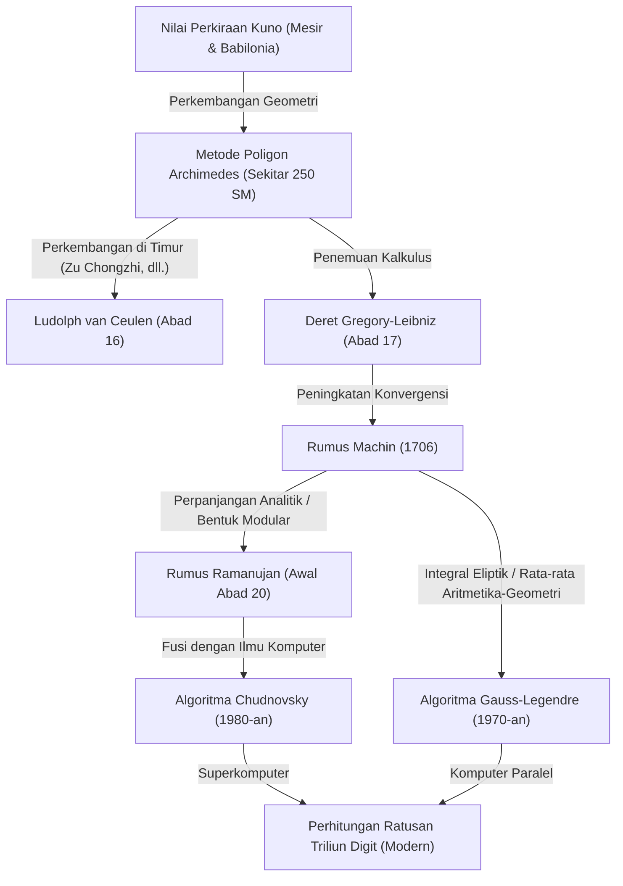

# 1. Pendahuluan: Konstanta Memukau Bernama Pi

Dalam sejarah umat manusia dan matematika, mungkin tidak ada angka lain yang begitu memikat banyak matematikawan dan ilmuwan komputer, serta terus dihitung selain Pi ($\pi$). Konstanta sederhana ini, yang didefinisikan sebagai perbandingan antara keliling lingkaran dengan diameternya, memiliki sifat mendalam karena merupakan bilangan irasional sekaligus bilangan transenden. Bilangan ini tidak dapat dinyatakan sebagai pecahan bilangan rasional, dan tidak akan pernah menjadi akar dari persamaan aljabar dengan koefisien rasional; ia hanya mengungkapkan wujud penuhnya sebagai deretan desimal tak beraturan yang berlanjut tanpa batas.

Artikel ini akan mengupas tuntas bagaimana umat manusia meningkatkan ketepatan perhitungan Pi, dari zaman kuno hingga era superkomputer modern, termasuk sejarah metode perhitungan dan teori matematika di baliknya. Mulai dari pendekatan geometris kuno, deret tak terhingga menggunakan kalkulus, hingga algoritma menakjubkan yang mendukung komputasi presisi sangat tinggi di era modern, kita akan menyelaminya lebih dalam dengan rumus dan implementasi kode menggunakan Python.

Sejarah perhitungan Pi bisa dikatakan sejajar dengan sejarah perkembangan matematika dan ilmu komputer umat manusia. Setiap kali konsep matematika baru ditemukan, akurasi perhitungan Pi meningkat secara drastis. Kalau begitu, mari kita mulai perjalanan pencarian yang tak berujung ini.



# 2. Pendekatan Kuno dan Metode Poligon Archimedes (Pendekatan Geometris)

## 2.1 Pemahaman Pi dalam Peradaban Kuno

Pada peradaban Babilonia dan Mesir kuno sekitar tahun 2000 SM, konsep Pi sudah dikenal. Bangsa Babilonia menggunakan fakta bahwa keliling lingkaran sedikit lebih panjang dari keliling segi enam beraturan, menggunakan nilai perkiraan $3 + 1/8 = 3.125$. Selain itu, "Papirus Matematika Rhind" dari Mesir menyebutkan metode perhitungan luas lingkaran dengan mengkuadratkan $8/9$ dari diameternya, yang menghasilkan nilai Pi sekitar $(16/9)^2 \approx 3.16049$. Nilai-nilai ini cukup akurat untuk penggunaan praktis saat itu, namun hanya berupa nilai hampiran yang didasarkan pada aturan praktis.

## 2.2 Pendekatan Geometris Archimedes

Orang pertama yang merumuskan perhitungan Pi dengan metode matematika yang ketat adalah matematikawan besar Yunani kuno, Archimedes (287 SM - 212 SM). Ia menggunakan poligon beraturan yang tertulis di dalam (inscribed) dan dibatasi di luar (circumscribed) lingkaran untuk menunjukkan bahwa nilai Pi yang sebenarnya berada di antara keliling kedua poligon tersebut (Metode Exhaustion / Pengurasan).

Archimedes mulai dengan segi enam beraturan, menggandakan jumlah sisinya menjadi poligon 12 sisi, 24 sisi, 48 sisi, hingga akhirnya menghitung poligon beraturan 96 sisi. Setiap kali jumlah sisi ditambah, keliling poligon semakin mendekati keliling lingkaran.

Misalkan jari-jari lingkaran adalah $r=1$. Keliling lingkaran adalah $2\pi$.
Jika keliling poligon beraturan segi-$n$ di dalam lingkaran adalah $p_n$, dan keliling poligon beraturan segi-$n$ di luar lingkaran adalah $P_n$, maka ketidaksamaan berikut berlaku:

$$ p_n < 2\pi < P_n $$

Untuk menghitung panjang sisi poligon segi-$n$, Archimedes berulang kali menggunakan teorema geometris (Teorema [Pythagoras](/id/p/pythagoras/) dan teorema bisektor sudut) yang sekarang setara dengan fungsi trigonometri. Dalam notasi modern, panjang satu sisi poligon segi-$n$ di dalam adalah $2 \sin(\pi/n)$, sedangkan panjang sisi poligon segi-$n$ di luar adalah $2 \tan(\pi/n)$. Dengan demikian, jika kita menggunakan setengah kelilingnya:

$$ n \sin\left(\frac{\pi}{n}\right) < \pi < n \tan\left(\frac{\pi}{n}\right) $$

Ketika jumlah sisi digandakan menjadi $2n$, relasi rekursif untuk setengah keliling poligon dalam dan luar (sebut saja $s_n, S_n$) adalah sebagai berikut:
(Di sini setara dengan $s_n = n \sin(\pi/n), S_n = n \tan(\pi/n)$)

$$ S_{2n} = \frac{2 s_n S_n}{s_n + S_n} $$
$$ s_{2n} = \sqrt{s_n S_{2n}} $$

Archimedes menggunakan perhitungan akar kuadrat (yang saat itu menggunakan pendekatan pecahan rasional secara manual) dan berhasil menurunkan ketidaksamaan terkenal berikut dari perhitungan poligon segi-96:

$$ 3 \frac{10}{71} < \pi < 3 \frac{1}{7} $$
(Dalam desimal, $3.1408... < \pi < 3.1428...$)

"Pendekatan Archimedes" ini terus menjadi metode dasar perhitungan Pi selama hampir 2000 tahun, sampai kalkulus ditemukan pada abad ke-17. Ludolph van Ceulen, matematikawan Belanda pada abad ke-16, menggunakan metode ini untuk menghitung poligon beraturan $2^{62}$ sisi dan mendapatkan nilai Pi hingga 35 digit desimal.

## 2.3 Simulasi Metode Archimedes dengan Python

Mari kita implementasikan relasi rekursif geometris ini menggunakan modul `decimal` di Python untuk menghitung Pi dengan presisi puluhan digit.

```python
from decimal import Decimal, getcontext

def archimedes_pi(iterations: int, precision: int = 50) -> tuple[Decimal, Decimal]:
    '''
    Menghitung Pi menggunakan metode poligon Archimedes.
    iterations: Jumlah pengulangan untuk menggandakan sisi
    precision: Akurasi perhitungan (jumlah digit di belakang koma)
    '''
    getcontext().prec = precision + 5  # Memberi ruang untuk mencegah kesalahan pembulatan di tengah jalan

    # Nilai awal: Segi enam beraturan (n=6)
    # Segi enam beraturan untuk lingkaran dengan jari-jari 1
    n = 6
    s_n = Decimal('3')               # Setengah keliling segi enam beraturan dalam (6 * sin(pi/6) = 3)
    S_n = Decimal('6') / Decimal('3').sqrt() # Setengah keliling segi enam beraturan luar (6 * tan(pi/6) = 2*sqrt(3))

    for _ in range(iterations):
        # Pembaruan berdasarkan rumus rekursif
        S_2n = (Decimal('2') * s_n * S_n) / (s_n + S_n)
        s_2n = (s_n * S_2n).sqrt()
        
        s_n, S_n = s_2n, S_2n
        n *= 2

    return s_n, S_n

if __name__ == '__main__':
    inner, outer = archimedes_pi(100, 50)
    print('Metode Archimedes (100 iterasi)')
    print(f'Hampiran poligon dalam: {inner}')
    print(f'Hampiran poligon luar: {outer}')
```

Rumus rekursif ini memiliki karakteristik konvergensi yang sangat lambat (konvergensi linear), di mana ketepatannya hanya meningkat sekitar 1 bit bilangan biner setiap iterasinya. Karena mencari metode komputasi yang lebih cepat, para matematikawan mulai merambah pendekatan baru.


# 3. Fajar Kalkulus: Pendekatan Deret Tak Terhingga

Memasuki abad ke-17, penemuan kalkulus oleh Newton dan Leibniz menyebabkan evolusi dramatis dalam metode matematika. Terjadi pergeseran paradigma dari metode komputasi berbasis gambar geometris ke komputasi berbasis aljabar yang memanfaatkan "deret tak terhingga".

## 3.1 Deret Gregory-Leibniz

Pada tahun 1671, matematikawan Skotlandia James Gregory menemukan, dan pada tahun 1674 matematikawan Jerman [Gottfried Leibniz](/id/p/leibniz/) secara mandiri menemukan kembali perluasan deret tak terhingga untuk fungsi tangen invers (arctangen).

$$ \arctan(x) = x - \frac{x^3}{3} + \frac{x^5}{5} - \frac{x^7}{7} + \cdots = \sum_{k=0}^{\infty} \frac{(-1)^k x^{2k+1}}{2k+1} $$

Jika kita mensubstitusikan $x = 1$ pada rumus ini, karena $\arctan(1) = \pi/4$, kita memperoleh rumus indah yang dapat menghitung nilai Pi secara langsung. Ini disebut "Deret Gregory-Leibniz".

$$ \frac{\pi}{4} = 1 - \frac{1}{3} + \frac{1}{5} - \frac{1}{7} + \frac{1}{9} - \cdots $$

Keindahan deret ini terletak pada kenyataan bahwa Pi dapat dicari hanya dengan menambah dan mengurangi kebalikan dari bilangan ganjil secara bergantian. Meskipun disambut dengan kekaguman dalam dunia matematika, dari sudut pandang perhitungan praktis, rumus ini memiliki kelemahan yang fatal: "konvergensinya sangat lambat".

Sebagai contoh, hanya untuk mendapatkan akurasi 2 angka di belakang koma (3.14), diperlukan ratusan suku perhitungan. Untuk mendapatkan akurasi 10 digit, diperlukan penambahan lebih dari 5 miliar suku. Oleh karena itu, rumus ini tidak pernah digunakan apa adanya untuk memecahkan rekor jumlah digit Pi. Namun, ide menggunakan perluasan deret arctangen itu sendiri menjadi dasar bagi metode perhitungan yang lebih cepat yang muncul belakangan.

# 4. Rumus Machin dan Perkembangan Analisis

## 4.1 Teorema Penambahan Arctangen dan Rumus Machin

Untuk mengatasi lambatnya konvergensi deret Gregory-Leibniz, daripada menggunakan $x=1$, kita perlu memasukkan nilai $x$ yang lebih kecil ke dalam deret arctangen (karena semakin kecil nilai $x$, nilai $x^{2k+1}$ akan menyusut lebih cepat, sehingga konvergensi lebih cepat).

Pada tahun 1706, matematikawan Inggris John Machin menemukan rumus inovatif dengan memanfaatkan teorema penambahan arctangen secara cerdik.

Teorema penambahan arctangen adalah sebagai berikut:
$$ \arctan(x) + \arctan(y) = \arctan\left(\frac{x+y}{1-xy}\right) $$

Machin memusatkan perhatian pada nilai $\arctan(1/5)$. Hal ini karena $x=1/5$ mudah dihitung (hanya kalikan 2 dan geser satu digit). Dengan menggandakan sudut menggunakan teorema penambahan ini:
$$ 2 \arctan\left(\frac{1}{5}\right) = \arctan\left(\frac{5/12}{1}\right) = \arctan\left(\frac{120}{119}\right) $$

Jika digandakan lagi, kita mendapatkan $4 \arctan(1/5)$. Ketika perhitungan dilanjutkan, terlihat bahwa nilai ini sangat dekat dengan $\arctan(1) = \pi/4$. Jika kita mencari selisihnya:

$$ 4 \arctan\left(\frac{1}{5}\right) - \frac{\pi}{4} = \arctan\left(\frac{1}{239}\right) $$

Dengan menyusun ulang rumus ini, kita mendapatkan "Rumus Machin" yang terkenal.

$$ \frac{\pi}{4} = 4 \arctan\left(\frac{1}{5}\right) - \arctan\left(\frac{1}{239}\right) $$

Kelebihan utama rumus ini adalah konvergensinya yang dramatis, karena kita memasukkan nilai yang relatif kecil, yaitu $x=1/5$ dan $x=1/239$ ke dalam deret Gregory-Leibniz. Machin sendiri berhasil menghitung Pi hingga 100 digit secara manual menggunakan rumus ini.

Setelah itu, pendekatan serupa (metode menggunakan kombinasi linear arctangen yang lebih kompleks) terus ditemukan, dan rekor perhitungan digit Pi terus dipecahkan oleh rumus tipe Machin hingga pertengahan abad ke-20, saat komputer elektronik mulai bermunculan.

## 4.2 Implementasi Rumus Machin dengan Python

Mari kita implementasikan Rumus Machin menggunakan `decimal` di Python.

```python
from decimal import Decimal, getcontext

def arctan(x_inv: int, precision: int) -> Decimal:
    '''
    Menghitung arctan(1/x) menggunakan deret Gregory
    '''
    getcontext().prec = precision + 10
    x_inv_dec = Decimal(x_inv)
    x_squared = x_inv_dec * x_inv_dec
    
    term = Decimal(1) / x_inv_dec
    total = term
    k = 1
    
    while True:
        term = term / x_squared
        current_term = term / Decimal(2*k + 1)
        if current_term == 0:
            break
            
        if k % 2 == 1:
            total -= current_term
        else:
            total += current_term
        k += 1
        
    return total

def machin_pi(precision: int = 100) -> Decimal:
    '''
    Menghitung Pi menggunakan Rumus Machin
    '''
    getcontext().prec = precision + 10
    pi_over_4 = 4 * arctan(5, precision) - arctan(239, precision)
    pi = 4 * pi_over_4
    getcontext().prec = precision
    return +pi

if __name__ == '__main__':
    print('Perhitungan 100 digit menggunakan Rumus Machin:')
    print(machin_pi(100))
```
Jika kita menjalankan kode ini, Pi sepanjang 100 digit dapat dihitung dengan presisi tepat dalam waktu yang sangat singkat.

# 5. Rumus Ajaib Ramanujan dan Bentuk Modular

Pada awal abad ke-20, Srinivasa Ramanujan, matematikawan jenius asal India, mempresentasikan pendekatan jenis baru untuk menghitung Pi. Ia memiliki intuisi yang mendalam mengenai integral eliptik dan persamaan modular, dan menemukan beberapa deret kompleks tak lazim seperti ini:

$$ \frac{1}{\pi} = \frac{2\sqrt{2}}{9801} \sum_{k=0}^{\infty} \frac{(4k)! (1103 + 26390k)}{(k!)^4 396^{4k}} $$

Pada pandangan pertama, sangat membingungkan dari mana rumus ini diturunkan, namun kecepatan konvergensinya luar biasa; setiap suku yang dihitung memberikan akurasi tambahan sekitar 8 digit untuk Pi.

Rumus Ramanujan menggeser secara signifikan metode komputasi Pi dari "deret fungsi tangen invers" ke "deret hipergeometrik dan bentuk modular". Karena belum adanya komputer pada saat itu, potensi sejati dari rumusnya tidak langsung terwujud. Namun, pada tahun 1980-an ketika kompetisi perhitungan Pi menggunakan superkomputer memanas, algoritma-algoritma baru yang didasarkan pada teorinya mulai bermunculan satu demi satu.

# 6. Komputasi Presisi Sangat Tinggi Modern: Algoritma Chudnovsky

Pendekatan Ramanujan didorong lebih jauh oleh "Algoritma Chudnovsky", yang diterbitkan oleh Chudnovsky bersaudara (David Chudnovsky dan Gregory Chudnovsky) pada tahun 1988.

$$ \frac{1}{\pi} = 12 \sum_{k=0}^{\infty} \frac{(-1)^k (6k)! (13591409 + 545140134k)}{(3k)!(k!)^3 640320^{3k + 3/2}} $$

Bahkan hingga saat ini, algoritma ini adalah metode komputasi standar yang paling luas digunakan untuk memecahkan rekor dunia perhitungan Pi (saat ini telah mencapai 100 triliun digit) baik dengan superkomputer maupun PC pribadi.

Alasannya adalah setiap kali satu suku dihitung, akurasinya meningkat dengan kecepatan yang mencengangkan, yaitu sekitar 14 digit. Selain itu, algoritma ini sangat kompatibel dengan optimasi ilmu komputer (seperti perhitungan pecah-belah (divide and conquer) pada pecahan raksasa menggunakan metode *binary splitting*), yang menunjukkan performa sangat tinggi pada eksekusi dengan komputer paralel.

## 6.1 Implementasi Algoritma Chudnovsky dengan Python

Mari kita implementasikan algoritma luar biasa ini menggunakan `decimal` di Python.

```python
from decimal import Decimal, getcontext
import math

def chudnovsky_pi(precision: int = 100) -> Decimal:
    '''
    Menghitung Pi menggunakan Algoritma Chudnovsky
    '''
    getcontext().prec = precision + 10
    
    C = 640320
    C3_OVER_24 = C**3 // 24
    
    total = Decimal(0)
    k = 0
    M = 1
    L = 13591409
    X = 1
    
    # Suku yang dibutuhkan (sekitar 14 digit per suku)
    max_k = precision // 14 + 1
    
    for k in range(max_k):
        term = Decimal(M * L) / X
        if k % 2 != 0:
            total -= term
        else:
            total += term
            
        # Pembaruan untuk suku berikutnya
        k_next = k + 1
        L += 545140134
        X *= C3_OVER_24
        M = (M * (12 * k_next - 10) * (12 * k_next - 6) * (12 * k_next - 2)) // (k_next**3)
        
    pi_inverse = Decimal(12) * total / Decimal(C**3).sqrt()
    getcontext().prec = precision
    return Decimal(1) / pi_inverse

if __name__ == '__main__':
    print('Perhitungan 100 digit menggunakan Algoritma Chudnovsky:')
    print(chudnovsky_pi(100))
```
Menjalankan kode di atas akan menghasilkan Pi dengan kecepatan luar biasa. Hanya dalam beberapa iterasi loop (`max_k`), akurasi 100 digit dapat dicapai.

# 7. Algoritma Gauss-Legendre (Metode Rata-rata Aritmetika-Geometri)

Satu lagi algoritma revolusioner dalam metode perhitungan Pi yang tak boleh dilupakan adalah "Algoritma Gauss-Legendre". Algoritma ini ditemukan secara mandiri oleh Richard Brent dan Eugene Salamin pada tahun 1975.

Dasar dari algoritma ini adalah teori "Rata-rata Aritmetika-Geometri (Arithmetic-Geometric Mean, AGM)" dan integral eliptik yang diteliti oleh [Carl Friedrich Gauss](/id/p/gauss/).

Ketika diberikan dua bilangan $a_0, b_0$, barisan dibuat dengan menerapkan rata-rata aritmetika (rata-rata hitung) dan rata-rata geometri (rata-rata ukur) secara berulang sebagai berikut:

$$ a_{n+1} = \frac{a_n + b_n}{2} $$
$$ b_{n+1} = \sqrt{a_n b_n} $$

Kedua barisan ini menyatu sangat cepat pada nilai yang sama (rata-rata aritmetika-geometri). Dengan menggabungkan sifat ini dengan persamaan relasi Legendre dari integral eliptik lengkap, sebuah algoritma untuk mencari nilai Pi berhasil diturunkan.

Nilai awalnya ditetapkan sebagai berikut:
$$ a_0 = 1, \quad b_0 = \frac{1}{\sqrt{2}}, \quad t_0 = \frac{1}{4}, \quad p_0 = 1 $$

Kemudian, relasi rekursif berikut diiterasikan:
$$ a_{n+1} = \frac{a_n + b_n}{2} $$
$$ b_{n+1} = \sqrt{a_n b_n} $$
$$ t_{n+1} = t_n - p_n (a_n - a_{n+1})^2 $$
$$ p_{n+1} = 2 p_n $$

Nilai perkiraan Pi, $\pi_n$, pada langkah $n$ dihitung sebagai berikut:
$$ \pi_n = \frac{(a_n + b_n)^2}{4 t_n} $$

Karakteristik terbesar dari algoritma ini adalah ia memiliki "konvergensi kuadratik". Artinya, ia memiliki sifat luar biasa di mana "jumlah digit yang benar menjadi dua kali lipat" pada setiap iterasi. Misalnya, 100 digit, 200 digit, 400 digit, 800 digit; akurasinya meningkat dengan kecepatan eksplosif. Ketika tim Profesor Yasumasa Kanada dari Universitas Tokyo sukses menghitung 206,1 miliar digit pada tahun 1999, algoritma ini yang digunakan.

## 7.1 Implementasi Metode Gauss-Legendre dengan Python

```python
from decimal import Decimal, getcontext

def gauss_legendre_pi(iterations: int, precision: int = 100) -> Decimal:
    '''
    Menghitung Pi menggunakan Algoritma Gauss-Legendre
    '''
    getcontext().prec = precision + 10
    
    a = Decimal(1)
    b = Decimal(1) / Decimal(2).sqrt()
    t = Decimal(1) / Decimal(4)
    p = Decimal(1)
    
    for _ in range(iterations):
        a_next = (a + b) / 2
        b_next = (a * b).sqrt()
        t_next = t - p * (a - a_next)**2
        p_next = 2 * p
        
        a, b, t, p = a_next, b_next, t_next, p_next
        
    pi_approx = ((a + b)**2) / (4 * t)
    getcontext().prec = precision
    return +pi_approx

if __name__ == '__main__':
    # Akurasi lebih dari 100 digit diperoleh hanya dengan 7 iterasi
    print('Perhitungan menggunakan Metode Gauss-Legendre:')
    print(gauss_legendre_pi(7, 100))
```

# 8. Penutup: Pencarian Tanpa Akhir

Perhitungan Pi yang berawal dari poligon yang digambar di atas pasir oleh matematikawan kuno telah berevolusi menjadi deret tak terhingga melalui senjata ampuh bernama kalkulus. Kini di era modern, berkat teori matematika canggih seperti bentuk modular dan rata-rata aritmetika-geometri serta kekuatan komputasi superkomputer, perhitungan ini telah mencapai tingkat presisi luar biasa yaitu 100 triliun digit.

Kompetisi perhitungan Pi bukanlah sekadar permainan menyusun deretan angka belaka. Algoritma dan teknik komputasi yang dikembangkan di dalamnya (seperti pembelahan biner/binary splitting dan perkalian bilangan raksasa melalui [Transformasi Fourier Cepat](/id/p/fast-fourier-transform-algorithm/)/Fast Fourier Transform) memainkan peran penting dalam berbagai bidang seperti teori kriptografi modern, analisis numerik, dan evaluasi performa arsitektur komputer.

Karena Pi adalah bilangan irasional, deretan angkanya tidak akan pernah berakhir. Selama kebijaksanaan manusia dan evolusi komputer terus berlanjut, perjalanan tak berujung untuk mencari nilai Pi juga tidak akan pernah usai.
