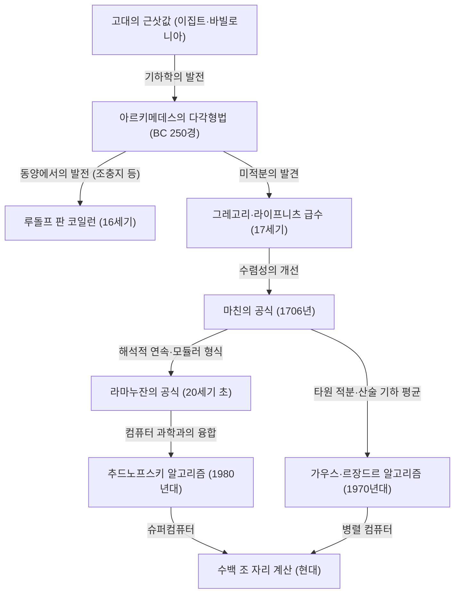

# 1. 서론: 원주율이라는 매혹적인 상수

인류와 수학의 역사에서 원주율($\pi$)만큼 많은 수학자와 컴퓨터 과학자들을 매료시키고, 계속해서 계산되어 온 수는 달리 없을 것입니다. 원의 둘레와 지름의 비율로 정의되는 이 단순한 상수는 무리수이자 초월수라는 깊은 성질을 가지고 있습니다. 유리수의 분수로 나타낼 수 없고, 어떠한 유리수 계수 대수 방정식의 근도 되지 않는 이 수는 무한히 이어지는 불규칙한 소수의 나열로만 그 전체 모습을 드러냅니다.

본 기사에서는 고대부터 현대의 슈퍼컴퓨터에 이르기까지 인류가 어떻게 원주율의 정밀도를 높여왔는지, 그 계산 기법의 역사와 배경에 있는 수학적 이론을 철저히 해설합니다. 고대의 기하학적 접근에서 시작하여 미적분을 이용한 무한급수, 나아가 현대의 초고정밀 계산을 뒷받침하는 경이로운 알고리즘까지, 각각의 수식과 Python을 이용한 구현 코드를 섞어가며 깊이 파헤쳐 보겠습니다.

원주율 계산의 역사는 그대로 인류의 수학과 컴퓨터 과학 발전의 역사라고 해도 과언이 아닙니다. 새로운 수학적 개념이 발견될 때마다 원주율의 계산 정밀도는 비약적으로 향상되어 왔습니다. 그러면 이 끝없는 탐구의 여정으로 출발해 봅시다.



# 2. 고대의 근사와 아르키메데스의 다각형법 (기하학적 접근)

## 2.1 고대 문명에서의 원주율에 대한 인식

기원전 2000년경의 고대 바빌로니아나 고대 이집트에서는 이미 원주율의 개념이 알려져 있었습니다. 바빌로니아인들은 원의 둘레가 정육각형의 둘레보다 조금 더 길다는 점을 이용하여 $3 + 1/8 = 3.125$라는 근삿값을 사용했습니다. 또한 이집트의 '린드 수학 파피루스'에는 원의 넓이를 계산할 때 지름의 $8/9$의 제곱을 사용하는 방법이 기록되어 있으며, 이로부터 도출되는 원주율은 $(16/9)^2 \approx 3.16049$가 됩니다. 이러한 값들은 실용상으로는 충분한 정밀도를 가지고 있었지만, 어디까지나 경험 법칙에 기반한 근삿값에 불과했습니다.

## 2.2 아르키메데스의 기하학적 기법

원주율 계산을 처음으로 수학적으로 엄밀한 방법으로 정식화한 사람이 고대 그리스의 위대한 수학자 아르키메데스(기원전 287년 - 기원전 212년)입니다. 그는 원에 내접하는 정다각형과 외접하는 정다각형을 이용하여 원주율의 참값이 그 두 정다각형의 둘레 사이에 있음을 보였습니다 (실진법/착출법).

아르키메데스는 정육각형에서 출발하여 변의 수를 두 배로 늘려가는 방식으로 정12각형, 정24각형, 정48각형, 그리고 최종적으로 정96각형까지 계산을 수행했습니다. 변의 수를 늘릴 때마다 다각형의 둘레는 원의 둘레에 가까워집니다.

원의 반지름을 $r=1$이라 합시다. 원의 둘레는 $2\pi$입니다.
내접 정 $n$ 각형의 둘레를 $p_n$, 외접 정 $n$ 각형의 둘레를 $P_n$이라고 하면 다음과 같은 부등식이 성립합니다.

$$ p_n < 2\pi < P_n $$

정 $n$ 각형의 변의 길이를 계산하기 위해 아르키메데스는 현대의 삼각함수에 해당하는 기하학적인 정리([피타고라스](/ko/p/pythagoras/)의 정리나 각의 이등분선 정리)를 반복해서 사용했습니다. 현대의 표기법으로 나타내면, 내접 정 $n$ 각형의 한 변의 길이는 $2 \sin(\pi/n)$이고, 외접 정 $n$ 각형의 한 변의 길이는 $2 \tan(\pi/n)$입니다. 따라서 반둘레(half-perimeter)를 사용하면 다음과 같이 됩니다.

$$ n \sin\left(\frac{\pi}{n}\right) < \pi < n \tan\left(\frac{\pi}{n}\right) $$

변의 수를 $2n$으로 배증시켰을 때 내접·외접 다각형의 반둘레(각각 $s_n, S_n$이라 함)의 점화식은 다음과 같습니다.
(여기서 $s_n = n \sin(\pi/n), S_n = n \tan(\pi/n)$에 해당합니다)

$$ S_{2n} = \frac{2 s_n S_n}{s_n + S_n} $$
$$ s_{2n} = \sqrt{s_n S_{2n}} $$

아르키메데스는 제곱근 계산(당시에는 수계산으로 유리수의 분수 근사를 사용했음)을 구사하여, 정96각형의 계산으로부터 다음의 유명한 부등식을 이끌어냈습니다.

$$ 3 \frac{10}{71} < \pi < 3 \frac{1}{7} $$
(소수로 나타내면 $3.1408... < \pi < 3.1428...$)

이 '아르키메데스의 접근법'은 17세기에 미적분이 발명될 때까지 약 2000년 동안 원주율 계산의 기본 기법으로 계속 사용되었습니다. 16세기 네덜란드의 수학자 루돌프 판 코일런은 이 방법을 사용하여 정 $2^{62}$ 각형을 계산하여 원주율을 35자리까지 구했습니다.

## 2.3 Python을 이용한 아르키메데스법 시뮬레이션

Python의 `decimal` 모듈을 사용하여 이 기하학적 점화식을 구현하고, 수십 자리의 정밀도로 원주율을 구해보겠습니다.

```python
from decimal import Decimal, getcontext

def archimedes_pi(iterations: int, precision: int = 50) -> tuple[Decimal, Decimal]:
    '''
    아르키메데스의 다각형법을 사용하여 원주율을 계산한다.
    iterations: 변의 수를 두 배로 늘리는 횟수
    precision: 계산 정밀도 (소수점 이하 자릿수)
    '''
    getcontext().prec = precision + 5  # 중간의 반올림 오차를 방지하기 위해 여유를 둠

    # 초기값: 정육각형 (n=6)
    # 반지름 1인 원에 대한 정육각형
    n = 6
    s_n = Decimal('3')               # 내접 정육각형의 반둘레 (6 * sin(pi/6) = 3)
    S_n = Decimal('6') / Decimal('3').sqrt() # 외접 정육각형의 반둘레 (6 * tan(pi/6) = 2*sqrt(3))

    for _ in range(iterations):
        # 점화식에 기반한 업데이트
        S_2n = (Decimal('2') * s_n * S_n) / (s_n + S_n)
        s_2n = (s_n * S_2n).sqrt()
        
        s_n, S_n = s_2n, S_2n
        n *= 2

    return s_n, S_n

if __name__ == '__main__':
    inner, outer = archimedes_pi(100, 50)
    print('아르키메데스의 방법 (100회 반복)')
    print(f'내접 다각형 근사: {inner}')
    print(f'외접 다각형 근사: {outer}')
```

이 점화식은 반복할 때마다 정밀도가 2진수로 약 1비트씩밖에 향상되지 않기 때문에 수렴이 매우 느리다는(선형 수렴) 특징이 있습니다. 더 빠른 계산 방법을 찾기 위해 수학자들은 새로운 접근법을 모색하기 시작했습니다.


# 3. 미적분의 여명: 무한급수에 의한 접근

17세기에 들어서며 뉴턴과 라이프니츠에 의한 미적분학의 발견으로 수학적 기법은 극적인 진화를 이룩했습니다. 기하학적인 도형을 그려 계산하는 방법에서 대수적인 '무한급수'를 사용한 계산으로 패러다임 전환이 일어난 것입니다.

## 3.1 그레고리·라이프니츠 급수

1671년 스코틀랜드의 수학자 제임스 그레고리가 발견하고, 1674년 독일의 수학자 [고트프리트 라이프니츠](/ko/p/leibniz/)가 독립적으로 재발견한 것이 역탄젠트 함수(아크탄젠트)의 무한급수 전개입니다.

$$ \arctan(x) = x - \frac{x^3}{3} + \frac{x^5}{5} - \frac{x^7}{7} + \cdots = \sum_{k=0}^{\infty} \frac{(-1)^k x^{2k+1}}{2k+1} $$

이 공식에 $x = 1$을 대입하면 $\arctan(1) = \pi/4$이므로 원주율을 직접 구할 수 있는 아름다운 공식이 얻어집니다. 이를 '그레고리·라이프니츠 급수'라고 부릅니다.

$$ \frac{\pi}{4} = 1 - \frac{1}{3} + \frac{1}{5} - \frac{1}{7} + \frac{1}{9} - \cdots $$

이 급수의 아름다움은 홀수의 역수를 번갈아 더하고 빼는 것만으로 원주율을 구할 수 있다는 점에 있습니다. 수학적인 놀라움으로 받아들여진 이 공식이지만, 실제로 원주율을 계산한다는 실용적인 관점에서는 치명적인 단점이 있었습니다. 그것은 '수렴이 절망적으로 느리다'는 것입니다.

예를 들어 소수점 이하 2자리 정밀도(3.14)를 얻는 데만 수백 항의 계산이 필요합니다. 소수점 이하 10자리 정밀도를 얻기 위해서는 무려 50억 항 이상의 덧셈이 필요합니다. 따라서 이 식이 그대로 원주율 자릿수 기록 경신에 사용되지는 않았습니다. 하지만 이 아크탄젠트의 급수 전개라는 아이디어 자체는 나중에 등장하는 더 빠른 계산 기법의 기초가 되었습니다.

# 4. 마친의 공식과 해석학의 발전

## 4.1 아크탄젠트의 덧셈 정리와 마친의 공식

그레고리·라이프니츠 급수의 느린 수렴을 극복하기 위해서는 $x=1$이 아니라 더 작은 $x$ 값을 아크탄젠트 급수에 대입해야 합니다 ($x$가 작을수록 $x^{2k+1}$은 급격히 작아져 빠르게 수렴하기 때문입니다).

1706년, 영국의 수학자 존 마친은 아크탄젠트의 덧셈 정리를 교묘하게 이용하여 획기적인 공식을 발견했습니다.

아크탄젠트의 덧셈 정리는 다음과 같습니다.
$$ \arctan(x) + \arctan(y) = \arctan\left(\frac{x+y}{1-xy}\right) $$

마친은 $\arctan(1/5)$라는 값에 주목했습니다. $x=1/5$는 계산이 용이(2배하여 1자리 옮기기만 하면 됨)하기 때문입니다. 이를 덧셈 정리로 배각해 나가면:
$$ 2 \arctan\left(\frac{1}{5}\right) = \arctan\left(\frac{5/12}{1}\right) = \arctan\left(\frac{120}{119}\right) $$

이것을 다시 배각하면 $4 \arctan(1/5)$가 됩니다. 계산을 진행하면 이 값이 $\arctan(1) = \pi/4$에 매우 가깝다는 것을 알 수 있습니다. 그 차이를 구하면:

$$ 4 \arctan\left(\frac{1}{5}\right) - \frac{\pi}{4} = \arctan\left(\frac{1}{239}\right) $$

이것을 정리하면 유명한 '마친의 공식'을 얻을 수 있습니다.

$$ \frac{\pi}{4} = 4 \arctan\left(\frac{1}{5}\right) - \arctan\left(\frac{1}{239}\right) $$

이 공식의 훌륭한 점은 $x=1/5$와 $x=1/239$라는 비교적 작은 값을 그레고리·라이프니츠 급수에 대입하기 때문에 극적인 속도로 수렴한다는 것입니다. 마친 자신은 이 공식을 사용하여 수계산으로 단숨에 100자리의 원주율을 계산했습니다.

그 후 유사한 접근법(더 복잡한 아크탄젠트의 선형 결합을 사용하는 방법)이 차례차례 발견되었고, 전자계산기가 등장하는 20세기 중반까지 원주율의 자릿수 기록은 마친형 공식에 의해 경신되어 갔습니다.

## 4.2 Python을 이용한 마친의 공식 구현

Python의 `decimal`을 사용하여 마친의 공식을 구현해 보겠습니다.

```python
from decimal import Decimal, getcontext

def arctan(x_inv: int, precision: int) -> Decimal:
    '''
    arctan(1/x) 를 그레고리 급수로 계산한다
    '''
    getcontext().prec = precision + 10
    x_inv_dec = Decimal(x_inv)
    x_squared = x_inv_dec * x_inv_dec
    
    term = Decimal(1) / x_inv_dec
    total = term
    k = 1
    
    while True:
        term = term / x_squared
        current_term = term / Decimal(2*k + 1)
        if current_term == 0:
            break
            
        if k % 2 == 1:
            total -= current_term
        else:
            total += current_term
        k += 1
        
    return total

def machin_pi(precision: int = 100) -> Decimal:
    '''
    마친의 공식을 사용하여 원주율을 계산
    '''
    getcontext().prec = precision + 10
    pi_over_4 = 4 * arctan(5, precision) - arctan(239, precision)
    pi = 4 * pi_over_4
    getcontext().prec = precision
    return +pi

if __name__ == '__main__':
    print('마친의 공식에 의한 100자리 계산:')
    print(machin_pi(100))
```
이 코드를 실행하면 순식간에 100자리의 원주율을 정확히 구할 수 있습니다.

# 5. 라마누잔의 경이로운 공식과 모듈러 형식

20세기 초, 인도의 천재 수학자 스리니바사 라마누잔은 원주율에 관한 전혀 새로운 종류의 접근법을 제시했습니다. 그는 타원 적분이나 모듈러 방정식에 대한 깊은 직관을 가지고, 다음과 같은 상식을 벗어난 복잡한 급수를 여러 개 발견했습니다.

$$ \frac{1}{\pi} = \frac{2\sqrt{2}}{9801} \sum_{k=0}^{\infty} \frac{(4k)! (1103 + 26390k)}{(k!)^4 396^{4k}} $$

이 공식은 언뜻 보면 어디서 도출되었는지 짐작조차 할 수 없을 정도로 복잡하지만, 그 수렴 속도는 엄청나서 항을 하나 계산할 때마다 원주율의 정밀도가 약 8자리씩 추가됩니다.

라마누잔의 공식은 원주율의 계산 기법을 '역탄젠트 함수의 급수'에서 '초기하급수와 모듈러 형식'으로 크게 전환시키는 것이었습니다. 그의 공식은 당시에는 컴퓨터가 없었기 때문에 진정한 잠재력을 발휘하지는 못했지만, 1980년대에 들어와 슈퍼컴퓨터에 의한 원주율 계산경쟁이 격화되면서 그의 이론을 바탕으로 한 새로운 알고리즘들이 속속 만들어졌습니다.

# 6. 현대의 초고정밀 계산: 추드노프스키 알고리즘

라마누잔의 접근법을 더욱 발전시킨 것이 1988년 추드노프스키 형제(데이비드 추드노프스키와 그레고리 추드노프스키)가 발표한 '추드노프스키 알고리즘'입니다.

$$ \frac{1}{\pi} = 12 \sum_{k=0}^{\infty} \frac{(-1)^k (6k)! (13591409 + 545140134k)}{(3k)!(k!)^3 640320^{3k + 3/2}} $$

이 알고리즘은 현재에도 슈퍼컴퓨터나 개인 PC를 사용하여 원주율의 세계 기록(현재는 100조 자리에 도달했습니다)을 경신할 때 가장 널리 사용되는 표준적인 계산 기법입니다.

그 이유는 항을 하나 계산할 때마다 약 14자리라는 경이로운 속도로 정밀도가 향상되기 때문입니다. 게다가 컴퓨터 과학적인 최적화(이진 분할법을 이용한 거대 분수의 분할 정복 계산 등)와 매우 궁합이 잘 맞아, 병렬 컴퓨터에서의 실행에 있어 극히 높은 퍼포먼스를 발휘합니다.

## 6.1 Python을 이용한 추드노프스키 알고리즘 구현

Python의 `decimal`을 사용하여 이 경이로운 알고리즘을 구현해 보겠습니다.

```python
from decimal import Decimal, getcontext
import math

def chudnovsky_pi(precision: int = 100) -> Decimal:
    '''
    추드노프스키 알고리즘을 사용하여 원주율을 계산
    '''
    getcontext().prec = precision + 10
    
    C = 640320
    C3_OVER_24 = C**3 // 24
    
    total = Decimal(0)
    k = 0
    M = 1
    L = 13591409
    X = 1
    
    # 필요한 항의 수 (1항당 약 14자리)
    max_k = precision // 14 + 1
    
    for k in range(max_k):
        term = Decimal(M * L) / X
        if k % 2 != 0:
            total -= term
        else:
            total += term
            
        # 다음 항을 위한 업데이트
        k_next = k + 1
        L += 545140134
        X *= C3_OVER_24
        M = (M * (12 * k_next - 10) * (12 * k_next - 6) * (12 * k_next - 2)) // (k_next**3)
        
    pi_inverse = Decimal(12) * total / Decimal(C**3).sqrt()
    getcontext().prec = precision
    return Decimal(1) / pi_inverse

if __name__ == '__main__':
    print('추드노프스키 알고리즘에 의한 100자리 계산:')
    print(chudnovsky_pi(100))
```
위 코드를 실행하면 믿을 수 없을 정도의 속도로 원주율이 구해집니다. 단 몇 번의 루프(`max_k`)만으로 100자리의 정밀도에 도달합니다.

# 7. 가우스·르장드르 알고리즘 (산술 기하 평균법)

원주율 계산 기법에서 또 하나 잊어서는 안 될 혁신적인 알고리즘이 '가우스·르장드르 알고리즘'입니다. 이것은 1975년에 리처드 브렌트와 유진 살라민에 의해 독립적으로 발견되었습니다.

이 알고리즘의 기반이 되는 것은 [카를 프리드리히 가우스](/ko/p/gauss/)가 연구한 '산술 기하 평균(Arithmetic-Geometric Mean, AGM)'과 타원 적분의 이론입니다.

두 수 $a_0, b_0$가 주어졌을 때, 다음과 같이 산술 평균(상가 평균)과 기하 평균(상승 평균)을 반복 적용하여 수열을 만듭니다.

$$ a_{n+1} = \frac{a_n + b_n}{2} $$
$$ b_{n+1} = \sqrt{a_n b_n} $$

이 두 수열은 매우 급속히 같은 값(산술 기하 평균)으로 수렴합니다. 이 성질과 완전 타원 적분의 르장드르 관계식을 조합함으로써 원주율을 구하는 알고리즘이 도출되었습니다.

초기값을 다음과 같이 설정합니다.
$$ a_0 = 1, \quad b_0 = \frac{1}{\sqrt{2}}, \quad t_0 = \frac{1}{4}, \quad p_0 = 1 $$

그리고 다음 점화식을 반복합니다.
$$ a_{n+1} = \frac{a_n + b_n}{2} $$
$$ b_{n+1} = \sqrt{a_n b_n} $$
$$ t_{n+1} = t_n - p_n (a_n - a_{n+1})^2 $$
$$ p_{n+1} = 2 p_n $$

단계 $n$에서의 원주율의 근삿값 $\pi_n$은 다음과 같이 계산됩니다.
$$ \pi_n = \frac{(a_n + b_n)^2}{4 t_n} $$

이 알고리즘의 가장 큰 특징은 '이차 수렴'을 한다는 것입니다. 즉, 1회 반복할 때마다 '정확한 자릿수가 2배가 된다'는 경이로운 성질을 가지고 있습니다. 예를 들어 100자리, 200자리, 400자리, 800자리와 같이 폭발적인 속도로 정밀도가 향상됩니다. 1999년에 도쿄 대학의 가네다 야스마사 교수팀이 2061억 자리 계산에 성공했을 때도 이 알고리즘이 사용되었습니다.

## 7.1 Python을 이용한 가우스·르장드르법 구현

```python
from decimal import Decimal, getcontext

def gauss_legendre_pi(iterations: int, precision: int = 100) -> Decimal:
    '''
    가우스·르장드르 알고리즘으로 원주율을 계산
    '''
    getcontext().prec = precision + 10
    
    a = Decimal(1)
    b = Decimal(1) / Decimal(2).sqrt()
    t = Decimal(1) / Decimal(4)
    p = Decimal(1)
    
    for _ in range(iterations):
        a_next = (a + b) / 2
        b_next = (a * b).sqrt()
        t_next = t - p * (a - a_next)**2
        p_next = 2 * p
        
        a, b, t, p = a_next, b_next, t_next, p_next
        
    pi_approx = ((a + b)**2) / (4 * t)
    getcontext().prec = precision
    return +pi_approx

if __name__ == '__main__':
    # 불과 7번의 반복으로 100자리 이상의 정밀도를 얻을 수 있음
    print('가우스·르장드르법에 의한 계산:')
    print(gauss_legendre_pi(7, 100))
```

# 8. 맺음말: 끝나지 않는 탐구

고대의 수학자들이 모래 위에 그렸던 다각형에서 시작된 원주율의 계산은 미적분이라는 강력한 무기를 얻어 무한급수로 진화했고, 현대에는 모듈러 형식이나 산술 기하 평균과 같은 고도의 수학 이론과 슈퍼컴퓨터의 계산 능력에 힘입어 100조 자리라는 터무니없는 정밀도에 도달했습니다.

원주율 계산 경쟁은 단순한 숫자의 나열을 구하는 장난이 아닙니다. 거기서 배양된 알고리즘이나 계산 기법(이진 분할법이나 [고속 푸리에 변환](/ko/p/fast-fourier-transform-algorithm/)에 의한 거대 수의 곱셈 등)은 현대의 암호 이론, 수치 해석, 컴퓨터 아키텍처의 성능 평가 등 다방면에 걸친 분야에서 중요한 역할을 수행하고 있습니다.

원주율은 무리수이기 때문에 그 숫자의 나열이 영원히 끝나는 일은 없습니다. 인류의 지혜와 컴퓨터의 진화가 계속되는 한, 원주율을 구하는 끝없는 여정 또한 끝나지 않을 것입니다.
