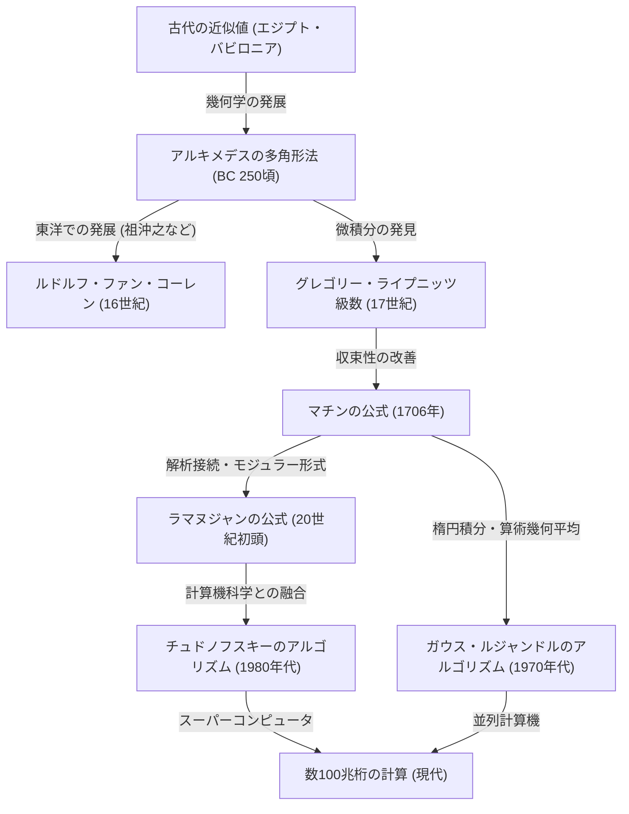

# 1. はじめに：円周率という魅惑の定数

人類と数学の歴史において、円周率（$\pi$）ほど多くの数学者や計算機科学者を魅了し、計算され続けてきた数は他にないでしょう。円の周長と直径の比として定義されるこの単純な定数は、無理数であり、超越数でもあるという深い性質を持っています。有理数の分数として表すことができず、いかなる有理数係数の代数方程式の根にもならないこの数は、無限に続く不規則な小数の列としてしかその全貌を表しません。

本記事では、古代から現代のスーパーコンピュータに至るまで、人類がどのようにして円周率の精度を高めてきたのか、その計算手法の歴史と背後にある数学的な理論を徹底的に解説します。古代の幾何学的アプローチから始まり、微積分を用いた無限級数、さらには現代の超高精度計算を支える驚異的なアルゴリズムまで、それぞれの数式とPythonを用いた実装コードを交えながら深く掘り下げていきます。

円周率の計算の歴史は、そのまま人類の数学と計算機科学の発展の歴史と言っても過言ではありません。新しい数学的概念が発見されるたびに、円周率の計算精度は飛躍的に向上してきました。それでは、この果てしない探求の旅に出発しましょう。



# 2. 古代の近似とアルキメデスの多角形法（幾何学的アプローチ）

## 2.1 古代文明における円周率の認識

紀元前2000年頃の古代バビロニアや古代エジプトにおいて、すでに円周率の概念は知られていました。バビロニア人は、円の周長が正六角形の周長より少し長いことを利用し、$3 + 1/8 = 3.125$ という近似値を用いていました。また、エジプトの「リンド数学パピルス」には、円の面積を計算する際に直径の $8/9$ の平方を用いる方法が記されており、これから導かれる円周率は $(16/9)^2 \approx 3.16049$ となります。これらの値は、実用上は十分な精度を持っていましたが、あくまで経験則に基づく近似値に過ぎませんでした。

## 2.2 アルキメデスの幾何学的手法

円周率の計算を初めて数学的に厳密な方法で定式化したのが、古代ギリシャの偉大な数学者アルキメデス（紀元前287年 - 紀元前212年）です。彼は、円に内接する正多角形と外接する正多角形を用いて、円周率の真の値がそれら2つの正多角形の周長の間にあることを示しました（取り尽くし法）。

アルキメデスは正六角形から出発し、辺の数を倍に増やしていくことで、正12角形、正24角形、正48角形、そして最終的に正96角形まで計算を行いました。辺の数を増やすごとに、多角形の周長は円の周長に近づいていきます。

円の半径を $r=1$ とします。円の周長は $2\pi$ です。
内接正 $n$ 角形の周長を $p_n$、外接正 $n$ 角形の周長を $P_n$ とすると、次のような不等式が成り立ちます。

$$ p_n < 2\pi < P_n $$

正 $n$ 角形の辺の長さを計算するために、アルキメデスは現代でいうところの三角関数に相当する幾何学的な定理（[ピタゴラスの定理](/p/diverse-proofs-of-pythagorean-theorem/)や角の二等分線の定理）を繰り返し用いました。現代の記法で表すと、内接正 $n$ 角形の1辺の長さは $2 \sin(\pi/n)$ であり、外接正 $n$ 角形の1辺の長さは $2 \tan(\pi/n)$ です。したがって、半周長を用いると以下のようになります。

$$ n \sin\left(\frac{\pi}{n}\right) < \pi < n \tan\left(\frac{\pi}{n}\right) $$

辺の数を $2n$ に倍増させたときの内接・外接多角形の半周長（それぞれ $s_n, S_n$ とする）の漸化式は以下の通りです。
（ここで $s_n = n \sin(\pi/n), S_n = n \tan(\pi/n)$ に相当します）

$$ S_{2n} = \frac{2 s_n S_n}{s_n + S_n} $$
$$ s_{2n} = \sqrt{s_n S_{2n}} $$

アルキメデスは平方根の計算（当時は手計算で有理数の分数近似を用いていた）を駆使し、正96角形の計算から次の有名な不等式を導き出しました。

$$ 3 \frac{10}{71} < \pi < 3 \frac{1}{7} $$
（小数にすると $3.1408... < \pi < 3.1428...$）

この「アルキメデスのアプローチ」は、17世紀に微積分が発明されるまで、ほぼ2000年間にわたり円周率計算の基本手法であり続けました。16世紀のオランダの数学者ルドルフ・ファン・コーレンは、この方法を用いて正 $2^{62}$ 角形を計算し、円周率を35桁まで求めました。

## 2.3 Pythonによるアルキメデス法のシミュレーション

Pythonの `decimal` モジュールを用いて、この幾何学的漸化式を実装し、数十桁の精度で円周率を求めてみましょう。

```python
from decimal import Decimal, getcontext

def archimedes_pi(iterations: int, precision: int = 50) -> tuple[Decimal, Decimal]:
    '''
    アルキメデスの多角形法を用いて円周率を計算する。
    iterations: 辺の数を倍にする回数
    precision: 計算精度（小数点以下の桁数）
    '''
    getcontext().prec = precision + 5  # 途中の丸め誤差を防ぐため余裕を持たせる

    # 初期値：正六角形 (n=6)
    # 半径1の円に対する正六角形
    n = 6
    s_n = Decimal('3')               # 内接正六角形の半周長 (6 * sin(pi/6) = 3)
    S_n = Decimal('6') / Decimal('3').sqrt() # 外接正六角形の半周長 (6 * tan(pi/6) = 2*sqrt(3))

    for _ in range(iterations):
        # 漸化式に基づく更新
        S_2n = (Decimal('2') * s_n * S_n) / (s_n + S_n)
        s_2n = (s_n * S_2n).sqrt()
        
        s_n, S_n = s_2n, S_2n
        n *= 2

    return s_n, S_n

if __name__ == '__main__':
    inner, outer = archimedes_pi(100, 50)
    print('アルキメデスの方法 (100回反復)')
    print(f'内接多角形近似: {inner}')
    print(f'外接多角形近似: {outer}')
```

この漸化式は、反復のたびに精度が約2進数で1ビットずつしか向上しないため、収束は非常に遅い（線形収束）という特徴があります。より速い計算方法を求めて、数学者たちは新しいアプローチを模索し始めました。


# 3. 微積分の夜明け：無限級数によるアプローチ

17世紀に入ると、ニュートンやライプニッツによる微積分学の発見により、数学の手法は劇的な進化を遂げました。幾何学的な図形を描いて計算する方法から、代数的な「無限級数」を用いた計算へのパラダイムシフトが起こったのです。

## 3.1 グレゴリー・ライプニッツ級数

1671年にスコットランドの数学者ジェームス・グレゴリーが発見し、1674年にドイツの数学者[ゴットフリート・ライプニッツ](/p/leibniz/)が独立に再発見したのが、逆正接関数（アークタンジェント）の無限級数展開です。

$$ \arctan(x) = x - \frac{x^3}{3} + \frac{x^5}{5} - \frac{x^7}{7} + \cdots = \sum_{k=0}^{\infty} \frac{(-1)^k x^{2k+1}}{2k+1} $$

この公式に $x = 1$ を代入すると、$\arctan(1) = \pi/4$ であることから、円周率を直接求めることができる美しい公式が得られます。これを「グレゴリー・ライプニッツ級数」と呼びます。

$$ \frac{\pi}{4} = 1 - \frac{1}{3} + \frac{1}{5} - \frac{1}{7} + \frac{1}{9} - \cdots $$

この級数の美しさは、奇数の逆数を交互に足し引きするだけで円周率が求まるという点にあります。数学的な驚きをもって迎えられたこの公式ですが、実際に円周率を計算するという実用的な観点からは、致命的な欠点がありました。それは「収束が絶望的に遅い」ということです。

例えば、小数点以下2桁の精度（3.14）を得るだけでも、数百項の計算が必要です。小数点以下10桁の精度を得るためには、なんと50億項以上の足し合わせが必要になります。したがって、この式がそのまま円周率の桁数記録の更新に使われることはありませんでした。しかし、このアークタンジェントの級数展開というアイデア自体は、後に登場するより高速な計算手法の基礎となりました。

# 4. マチンの公式と解析学の発展

## 4.1 アークタンジェントの加法定理とマチンの公式

グレゴリー・ライプニッツ級数の収束の遅さを克服するためには、$x=1$ ではなく、より小さな $x$ の値をアークタンジェントの級数に代入する必要があります（$x$ が小さいほど $x^{2k+1}$ は急速に小さくなり、早く収束するからです）。

1706年、イギリスの数学者ジョン・マチンは、アークタンジェントの加法定理を巧妙に利用して画期的な公式を発見しました。

アークタンジェントの加法定理は以下の通りです。
$$ \arctan(x) + \arctan(y) = \arctan\left(\frac{x+y}{1-xy}\right) $$

マチンは、$\arctan(1/5)$ という値に注目しました。$x=1/5$ は計算が容易（2倍して1桁ずらすだけ）だからです。これを加法定理で倍角していくと：
$$ 2 \arctan\left(\frac{1}{5}\right) = \arctan\left(\frac{5/12}{1}\right) = \arctan\left(\frac{120}{119}\right) $$

これをさらに倍角すると、$4 \arctan(1/5)$ となります。計算を進めると、この値が $\arctan(1) = \pi/4$ に非常に近いことがわかります。その差を求めると：

$$ 4 \arctan\left(\frac{1}{5}\right) - \frac{\pi}{4} = \arctan\left(\frac{1}{239}\right) $$

これを整理すると、有名な「マチンの公式」が得られます。

$$ \frac{\pi}{4} = 4 \arctan\left(\frac{1}{5}\right) - \arctan\left(\frac{1}{239}\right) $$

この公式の素晴らしい点は、$x=1/5$ と $x=1/239$ という比較的小さな値をグレゴリー・ライプニッツ級数に代入するため、劇的な速度で収束することです。マチン自身はこの公式を用いて、手計算で一気に100桁の円周率を計算しました。

その後、同様のアプローチ（より複雑なアークタンジェントの線形結合を用いる方法）が次々と発見され、電子計算機が登場する20世紀中盤まで、円周率の桁数記録はマチン型の公式によって塗り替えられていきました。

## 4.2 Pythonによるマチンの公式の実装

Pythonの `decimal` を用いて、マチンの公式を実装してみましょう。

```python
from decimal import Decimal, getcontext

def arctan(x_inv: int, precision: int) -> Decimal:
    '''
    arctan(1/x) をグレゴリー級数で計算する
    '''
    getcontext().prec = precision + 10
    x_inv_dec = Decimal(x_inv)
    x_squared = x_inv_dec * x_inv_dec
    
    term = Decimal(1) / x_inv_dec
    total = term
    k = 1
    
    while True:
        term = term / x_squared
        current_term = term / Decimal(2*k + 1)
        if current_term == 0:
            break
            
        if k % 2 == 1:
            total -= current_term
        else:
            total += current_term
        k += 1
        
    return total

def machin_pi(precision: int = 100) -> Decimal:
    '''
    マチンの公式を用いて円周率を計算
    '''
    getcontext().prec = precision + 10
    pi_over_4 = 4 * arctan(5, precision) - arctan(239, precision)
    pi = 4 * pi_over_4
    getcontext().prec = precision
    return +pi

if __name__ == '__main__':
    print('マチンの公式による100桁の計算:')
    print(machin_pi(100))
```
このコードを実行すると、わずかな時間で100桁の円周率が正確に求まります。

# 5. ラマヌジャンの驚異の公式とモジュラー形式

20世紀初頭、インドの天才数学者シュリニヴァーサ・ラマヌジャンは、円周率に関する全く新しい種類のアプローチを提示しました。彼は、楕円積分やモジュラー方程式に関する深い直観を持ち、次のような常識外れで複雑な級数をいくつも発見しました。

$$ \frac{1}{\pi} = \frac{2\sqrt{2}}{9801} \sum_{k=0}^{\infty} \frac{(4k)! (1103 + 26390k)}{(k!)^4 396^{4k}} $$

この公式は、一見するとどこから導かれたのか見当もつかないほど複雑ですが、その収束速度は凄まじく、項を1つ計算するごとに円周率の精度が約8桁ずつ追加されていきます。

ラマヌジャンの公式は、円周率の計算手法を「逆正接関数の級数」から「超幾何級数とモジュラー形式」へと大きく転換させるものでした。彼の公式は当時は計算機がなかったため、真のポテンシャルを発揮することはありませんでしたが、1980年代になってスーパーコンピュータによる円周率計算競争が激化すると、彼の理論をベースにした新しいアルゴリズムが次々と生み出されました。

# 6. 現代の超高精度計算：チュドノフスキーのアルゴリズム

ラマヌジャンのアプローチをさらに推し進めたのが、1988年にチュドノフスキー兄弟（デビッド・チュドノフスキーとグレゴリー・チュドノフスキー）によって発表された「チュドノフスキーのアルゴリズム」です。

$$ \frac{1}{\pi} = 12 \sum_{k=0}^{\infty} \frac{(-1)^k (6k)! (13591409 + 545140134k)}{(3k)!(k!)^3 640320^{3k + 3/2}} $$

このアルゴリズムは、現在でもスーパーコンピュータや個人のPCを用いて円周率の世界記録（現在は100兆桁に達しています）を更新する際に最も広く使われている標準的な計算手法です。

その理由は、項を1つ計算するたびに約14桁という驚異的なペースで精度が向上することにあります。さらに、計算機科学的な最適化（バイナリ・スプリッティング法による巨大な分数の分割統治計算など）と非常に相性が良く、並列計算機での実行において極めて高いパフォーマンスを発揮します。

## 6.1 Pythonによるチュドノフスキー・アルゴリズムの実装

Pythonの `decimal` を用いて、この驚異的なアルゴリズムを実装してみましょう。

```python
from decimal import Decimal, getcontext
import math

def chudnovsky_pi(precision: int = 100) -> Decimal:
    '''
    チュドノフスキーのアルゴリズムを用いて円周率を計算
    '''
    getcontext().prec = precision + 10
    
    C = 640320
    C3_OVER_24 = C**3 // 24
    
    total = Decimal(0)
    k = 0
    M = 1
    L = 13591409
    X = 1
    
    # 必要な項数（1項につき約14桁）
    max_k = precision // 14 + 1
    
    for k in range(max_k):
        term = Decimal(M * L) / X
        if k % 2 != 0:
            total -= term
        else:
            total += term
            
        # 次の項のための更新
        k_next = k + 1
        L += 545140134
        X *= C3_OVER_24
        M = (M * (12 * k_next - 10) * (12 * k_next - 6) * (12 * k_next - 2)) // (k_next**3)
        
    pi_inverse = Decimal(12) * total / Decimal(C**3).sqrt()
    getcontext().prec = precision
    return Decimal(1) / pi_inverse

if __name__ == '__main__':
    print('チュドノフスキー・アルゴリズムによる100桁の計算:')
    print(chudnovsky_pi(100))
```
上記のコードを実行すると、信じられないほどの速さで円周率が求まります。たった数回のループ（`max_k`）で100桁の精度に到達します。

# 7. ガウス・ルジャンドルのアルゴリズム（算術幾何平均法）

円周率の計算手法において、もう1つ忘れてはならない革新的なアルゴリズムが「ガウス・ルジャンドルのアルゴリズム」です。これは1975年にリチャード・ブレントとユージン・サラミンによって独立に発見されました。

このアルゴリズムの基盤となっているのは、[カール・フリードリヒ・ガウス](/p/gauss/)が研究した「算術幾何平均（Arithmetic-Geometric Mean, AGM）」と楕円積分の理論です。

2つの数 $a_0, b_0$ が与えられたとき、次のように算術平均（相加平均）と幾何平均（相乗平均）を繰り返し適用して数列を作ります。

$$ a_{n+1} = \frac{a_n + b_n}{2} $$
$$ b_{n+1} = \sqrt{a_n b_n} $$

この2つの数列は、非常に急速に同じ値（算術幾何平均）へと収束します。この性質と、完全楕円積分のルジャンドルの関係式を組み合わせることで、円周率を求めるアルゴリズムが導き出されました。

初期値を以下のように設定します。
$$ a_0 = 1, \quad b_0 = \frac{1}{\sqrt{2}}, \quad t_0 = \frac{1}{4}, \quad p_0 = 1 $$

そして、以下の漸化式を反復します。
$$ a_{n+1} = \frac{a_n + b_n}{2} $$
$$ b_{n+1} = \sqrt{a_n b_n} $$
$$ t_{n+1} = t_n - p_n (a_n - a_{n+1})^2 $$
$$ p_{n+1} = 2 p_n $$

ステップ $n$ における円周率の近似値 $\pi_n$ は次のように計算されます。
$$ \pi_n = \frac{(a_n + b_n)^2}{4 t_n} $$

このアルゴリズムの最大の特徴は「二次収束」することです。つまり、1回の反復ごとに「正しい桁数が2倍になる」という驚異的な性質を持っています。例えば、100桁、200桁、400桁、800桁というように、爆発的なスピードで精度が向上します。1999年に東京大学の金田康正教授のチームが2061億桁の計算に成功した際にも、このアルゴリズムが用いられました。

## 7.1 Pythonによるガウス・ルジャンドル法の実装

```python
from decimal import Decimal, getcontext

def gauss_legendre_pi(iterations: int, precision: int = 100) -> Decimal:
    '''
    ガウス・ルジャンドルのアルゴリズムで円周率を計算
    '''
    getcontext().prec = precision + 10
    
    a = Decimal(1)
    b = Decimal(1) / Decimal(2).sqrt()
    t = Decimal(1) / Decimal(4)
    p = Decimal(1)
    
    for _ in range(iterations):
        a_next = (a + b) / 2
        b_next = (a * b).sqrt()
        t_next = t - p * (a - a_next)**2
        p_next = 2 * p
        
        a, b, t, p = a_next, b_next, t_next, p_next
        
    pi_approx = ((a + b)**2) / (4 * t)
    getcontext().prec = precision
    return +pi_approx

if __name__ == '__main__':
    # わずか7回の反復で100桁以上の精度が得られる
    print('ガウス・ルジャンドル法による計算:')
    print(gauss_legendre_pi(7, 100))
```

# 8. おわりに：終わりのない探求

古代の数学者たちが砂の上に描いた多角形から始まった円周率の計算は、微積分という強力な武器を得て無限級数へと進化し、現代ではモジュラー形式や算術幾何平均といった高度な数学理論とスーパーコンピュータの計算力によって、100兆桁という途方もない精度に到達しました。

円周率の計算競争は、単なる数字の羅列を求める遊びではありません。そこで培われたアルゴリズムや計算手法（バイナリ・スプリッティングや[高速フーリエ変換](/p/fast-fourier-transform-algorithm/)による巨大数の乗算など）は、現代の暗号理論、数値解析、計算機アーキテクチャの性能評価など、多岐にわたる分野で重要な役割を果たしています。

円周率は無理数であるため、その数字の列が永遠に終わることはありません。人類の知恵と計算機の進化が続く限り、円周率を求める果てしない旅もまた、終わることはないでしょう。
