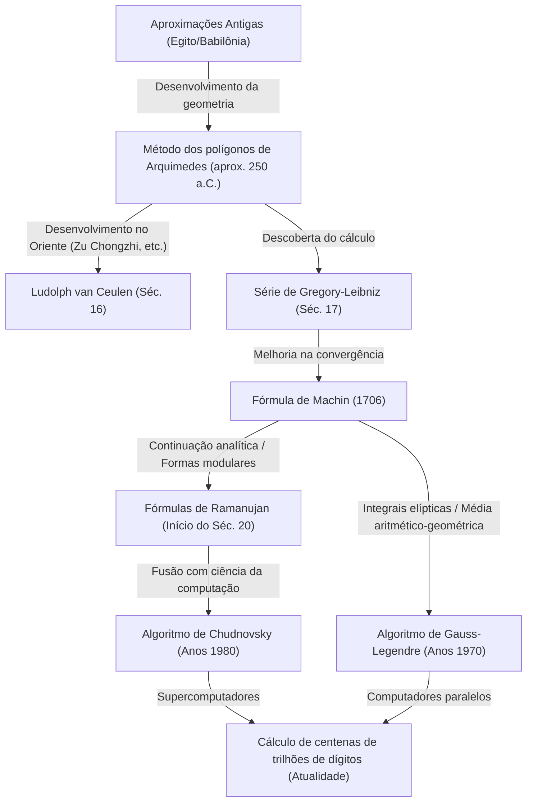

# 1. Introdução: A fascinante constante do Pi

Na história da humanidade e da matemática, talvez não haja outro número que tenha fascinado tantos matemáticos e cientistas da computação, e que tenha sido tão continuamente calculado, quanto o Pi ($\pi$). Esta constante simples, definida como a razão entre a circunferência de um círculo e o seu diâmetro, possui a profunda propriedade de ser tanto um número irracional quanto transcendental. Incapaz de ser expresso como uma fração de números inteiros, e nunca sendo raiz de nenhuma equação algébrica com coeficientes racionais, esse número revela sua totalidade apenas como uma sequência infinita e irregular de casas decimais.

Neste artigo, explicaremos em detalhes como a humanidade tem aumentado a precisão do Pi desde os tempos antigos até os supercomputadores modernos, a história de seus métodos de cálculo e a teoria matemática por trás deles. Começando com a abordagem geométrica antiga, passando pelas séries infinitas usando cálculo e, por fim, os algoritmos impressionantes que sustentam o cálculo de altíssima precisão de hoje, vamos nos aprofundar em cada um, intercalando fórmulas e implementações de código em Python.

Não é exagero dizer que a história do cálculo do Pi é também a história do desenvolvimento da matemática e da ciência da computação da humanidade. Cada vez que um novo conceito matemático era descoberto, a precisão do cálculo do Pi melhorava drasticamente. Então, vamos embarcar nesta jornada de exploração sem fim.



# 2. Aproximações Antigas e o Método dos Polígonos de Arquimedes (Abordagem Geométrica)

## 2.1 O reconhecimento do Pi nas antigas civilizações

O conceito do Pi já era conhecido na antiga Babilônia e no antigo Egito por volta de 2000 a.C. Os babilônios usavam a aproximação $3 + 1/8 = 3.125$, valendo-se do fato de que o perímetro de um círculo é um pouco maior que o de um hexágono regular. Além disso, no "Papiro Matemático de Rhind" egípcio, registra-se um método para calcular a área de um círculo usando o quadrado de $8/9$ do diâmetro, o que resulta em um Pi de $(16/9)^2 \approx 3.16049$. Embora esses valores fossem precisos o suficiente para fins práticos, eles eram apenas aproximações baseadas em regras empíricas.

## 2.2 A abordagem geométrica de Arquimedes

Foi o grande matemático grego antigo Arquimedes (287 a.C. – 212 a.C.) quem primeiro formulou o cálculo do Pi usando um método matematicamente rigoroso. Ele demonstrou que o verdadeiro valor do Pi situa-se entre os perímetros dos polígonos regulares inscritos e circunscritos em um círculo (método da exaustão).

Arquimedes começou com um hexágono regular e dobrou o número de lados, calculando para polígonos regulares de 12, 24, 48 e, finalmente, 96 lados. À medida que o número de lados aumenta, os perímetros dos polígonos se aproximam da circunferência do círculo.

Assumamos que o raio do círculo é $r=1$. A circunferência do círculo é $2\pi$.
Se o perímetro de um polígono regular inscrito de $n$ lados for $p_n$, e o perímetro do polígono regular circunscrito correspondente for $P_n$, a seguinte inequação se sustenta:

$$ p_n < 2\pi < P_n $$

Para calcular o comprimento dos lados de um polígono regular de $n$ lados, Arquimedes usou repetidamente teoremas geométricos equivalentes às funções trigonométricas modernas (teorema de [Pitágoras](/pt/p/pythagoras/) e o teorema da bissetriz de um ângulo). Expressando isso em notação moderna, o comprimento de um lado do polígono regular inscrito de $n$ lados é $2 \sin(\pi/n)$, e o comprimento do lado do polígono regular circunscrito correspondente é $2 \tan(\pi/n)$. Portanto, usando o semiperímetro, temos:

$$ n \sin\left(\frac{\pi}{n}\right) < \pi < n \tan\left(\frac{\pi}{n}\right) $$

A relação de recorrência para os semiperímetros dos polígonos inscritos e circunscritos (sendo eles $s_n$ e $S_n$ respectivamente) quando o número de lados dobra para $2n$ é a seguinte:
(Aqui equivale a $s_n = n \sin(\pi/n)$ e $S_n = n \tan(\pi/n)$)

$$ S_{2n} = \frac{2 s_n S_n}{s_n + S_n} $$
$$ s_{2n} = \sqrt{s_n S_{2n}} $$

Usando cálculos de raiz quadrada (que na época eram feitos à mão usando aproximações fracionárias racionais), Arquimedes derivou a seguinte inequação famosa do cálculo do polígono regular de 96 lados:

$$ 3 \frac{10}{71} < \pi < 3 \frac{1}{7} $$
(Em decimais: $3.1408... < \pi < 3.1428...$)

Essa "Abordagem de Arquimedes" permaneceu como o método básico para calcular o Pi por quase 2000 anos, até a invenção do cálculo no século XVII. O matemático holandês do século XVI Ludolph van Ceulen usou este método para calcular um polígono regular de $2^{62}$ lados, encontrando o valor do Pi até a 35ª casa decimal.

## 2.3 Simulação do método de Arquimedes em Python

Vamos usar o módulo `decimal` do Python para implementar essa relação de recorrência geométrica e calcular o Pi com várias dezenas de dígitos de precisão.

```python
from decimal import Decimal, getcontext

def archimedes_pi(iterations: int, precision: int = 50) -> tuple[Decimal, Decimal]:
    '''
    Calcula o Pi usando o método dos polígonos de Arquimedes.
    iterations: número de vezes para dobrar o número de lados
    precision: precisão do cálculo (número de casas decimais)
    '''
    getcontext().prec = precision + 5  # margem para evitar erros de arredondamento intermediário

    # Valores iniciais: Hexágono regular (n=6)
    # Para um círculo de raio 1
    n = 6
    s_n = Decimal('3')               # Semiperímetro do hexágono regular inscrito (6 * sin(pi/6) = 3)
    S_n = Decimal('6') / Decimal('3').sqrt() # Semiperímetro do hexágono regular circunscrito (6 * tan(pi/6) = 2*sqrt(3))

    for _ in range(iterations):
        # Atualização baseada na relação de recorrência
        S_2n = (Decimal('2') * s_n * S_n) / (s_n + S_n)
        s_2n = (s_n * S_2n).sqrt()
        
        s_n, S_n = s_2n, S_2n
        n *= 2

    return s_n, S_n

if __name__ == '__main__':
    inner, outer = archimedes_pi(100, 50)
    print('Método de Arquimedes (100 iterações)')
    print(f'Aproximação por polígono inscrito: {inner}')
    print(f'Aproximação por polígono circunscrito: {outer}')
```

Uma vez que esta relação de recorrência melhora a precisão em apenas cerca de 1 bit binário a cada iteração, ela se caracteriza por ter uma convergência muito lenta (convergência linear). Em busca de métodos de cálculo mais rápidos, os matemáticos começaram a procurar por novas abordagens.


# 3. O Alvorecer do Cálculo: A Abordagem pelas Séries Infinitas

No século XVII, com a descoberta do cálculo por Newton e Leibniz, os métodos matemáticos evoluíram drasticamente. Ocorreu uma mudança de paradigma, saindo dos métodos que envolviam desenhar formas geométricas para o cálculo algébrico utilizando "séries infinitas".

## 3.1 Série de Gregory-Leibniz

Foi a expansão em série infinita da função arco-tangente (arctan) que foi descoberta pelo matemático escocês James Gregory em 1671 e redescoberta independentemente pelo matemático alemão [Gottfried Leibniz](/pt/p/leibniz/) em 1674.

$$ \arctan(x) = x - \frac{x^3}{3} + \frac{x^5}{5} - \frac{x^7}{7} + \cdots = \sum_{k=0}^{\infty} \frac{(-1)^k x^{2k+1}}{2k+1} $$

Substituindo $x = 1$ nesta fórmula, obtemos uma bela equação que nos permite calcular diretamente o Pi, pois $\arctan(1) = \pi/4$. Esta é conhecida como "Série de Gregory-Leibniz".

$$ \frac{\pi}{4} = 1 - \frac{1}{3} + \frac{1}{5} - \frac{1}{7} + \frac{1}{9} - \cdots $$

A beleza dessa série reside no fato de que o Pi pode ser obtido apenas adicionando e subtraindo alternadamente os recíprocos dos números ímpares. No entanto, embora essa fórmula tenha sido recebida com surpresa matemática, do ponto de vista prático de calcular o Pi, ela tinha uma falha fatal: a sua "convergência era desesperadoramente lenta".

Por exemplo, para obter uma precisão de apenas duas casas decimais (3.14), são necessários várias centenas de termos. Para obter dez casas decimais, é surpreendente que precisemos de mais de cinco bilhões de termos adicionados. Portanto, esta fórmula, na sua forma pura, nunca foi usada para quebrar recordes de precisão do Pi. No entanto, a própria ideia da expansão em série do arco-tangente tornou-se a base de métodos de cálculo mais rápidos que surgiriam posteriormente.

# 4. A Fórmula de Machin e o Desenvolvimento da Análise

## 4.1 Teorema da adição da arco-tangente e a fórmula de Machin

Para superar a lentidão da convergência da série de Gregory-Leibniz, em vez de $x=1$, precisamos substituir valores muito menores de $x$ na série da arco-tangente (pois quanto menor for $x$, mais rápido $x^{2k+1}$ diminuirá, levando a uma convergência mais rápida).

Em 1706, o matemático inglês John Machin fez uso engenhoso do teorema da adição da arco-tangente e descobriu uma fórmula inovadora.

O teorema da adição da arco-tangente é o seguinte:
$$ \arctan(x) + \arctan(y) = \arctan\left(\frac{x+y}{1-xy}\right) $$

Machin focou-se no valor de $\arctan(1/5)$. Isso porque $x=1/5$ é fácil de calcular (apenas multiplique por 2 e desloque um dígito). Aplicando a duplicação usando o teorema da adição, temos:
$$ 2 \arctan\left(\frac{1}{5}\right) = \arctan\left(\frac{5/12}{1}\right) = \arctan\left(\frac{120}{119}\right) $$

Dobrando novamente, temos $4 \arctan(1/5)$. Avançando no cálculo, descobrimos que esse valor é muito próximo de $\arctan(1) = \pi/4$. Se procurarmos a diferença:

$$ 4 \arctan\left(\frac{1}{5}\right) - \frac{\pi}{4} = \arctan\left(\frac{1}{239}\right) $$

Rearranjando isso, obtemos a famosa "Fórmula de Machin":

$$ \frac{\pi}{4} = 4 \arctan\left(\frac{1}{5}\right) - \arctan\left(\frac{1}{239}\right) $$

O aspecto notável desta fórmula é que, ao inserir os valores relativamente pequenos de $x=1/5$ e $x=1/239$ na série de Gregory-Leibniz, ela converge a uma velocidade dramática. O próprio Machin usou essa fórmula para calcular manualmente o Pi com 100 casas decimais de uma só vez.

Posteriormente, abordagens semelhantes (métodos usando combinações lineares mais complexas de arco-tangentes) foram descobertas uma após a outra, e os recordes de precisão do Pi continuaram a ser batidos por fórmulas do tipo Machin até o surgimento dos computadores eletrônicos em meados do século XX.

## 4.2 Implementação da fórmula de Machin em Python

Vamos usar o módulo `decimal` do Python para implementar a fórmula de Machin.

```python
from decimal import Decimal, getcontext

def arctan(x_inv: int, precision: int) -> Decimal:
    '''
    Calcula arctan(1/x) usando a série de Gregory
    '''
    getcontext().prec = precision + 10
    x_inv_dec = Decimal(x_inv)
    x_squared = x_inv_dec * x_inv_dec
    
    term = Decimal(1) / x_inv_dec
    total = term
    k = 1
    
    while True:
        term = term / x_squared
        current_term = term / Decimal(2*k + 1)
        if current_term == 0:
            break
            
        if k % 2 == 1:
            total -= current_term
        else:
            total += current_term
        k += 1
        
    return total

def machin_pi(precision: int = 100) -> Decimal:
    '''
    Calcula o Pi usando a fórmula de Machin
    '''
    getcontext().prec = precision + 10
    pi_over_4 = 4 * arctan(5, precision) - arctan(239, precision)
    pi = 4 * pi_over_4
    getcontext().prec = precision
    return +pi

if __name__ == '__main__':
    print('Cálculo de 100 dígitos com a fórmula de Machin:')
    print(machin_pi(100))
```
Ao executar este código, o Pi pode ser calculado com precisão de 100 casas decimais em um piscar de olhos.

# 5. A Maravilhosa Fórmula de Ramanujan e Formas Modulares

No início do século XX, o gênio matemático indiano Srinivasa Ramanujan introduziu uma abordagem completamente nova relacionada ao Pi. Ele tinha uma profunda intuição sobre integrais elípticas e equações modulares, descobrindo uma série de fórmulas complexas que desafiavam o senso comum.

$$ \frac{1}{\pi} = \frac{2\sqrt{2}}{9801} \sum_{k=0}^{\infty} \frac{(4k)! (1103 + 26390k)}{(k!)^4 396^{4k}} $$

À primeira vista, essa fórmula parece tão complexa que não se sabe de onde foi derivada, mas sua taxa de convergência é tremenda; a cada novo termo calculado, cerca de 8 novos dígitos de precisão do Pi são adicionados.

A fórmula de Ramanujan mudou drasticamente os métodos de cálculo do Pi de "séries da função arco-tangente" para "séries hipergeométricas e formas modulares". Naquela época, como os computadores não existiam, suas fórmulas nunca alcançaram seu verdadeiro potencial; mas, na década de 1980, quando a corrida para calcular o Pi com supercomputadores se intensificou, novos algoritmos baseados em suas teorias foram criados um após o outro.

# 6. O Cálculo Moderno de Ultra-Alta Precisão: Algoritmo de Chudnovsky

O "Algoritmo de Chudnovsky", publicado pelos irmãos Chudnovsky (David Chudnovsky e Gregory Chudnovsky) em 1988, impulsionou a abordagem de Ramanujan ainda mais longe.

$$ \frac{1}{\pi} = 12 \sum_{k=0}^{\infty} \frac{(-1)^k (6k)! (13591409 + 545140134k)}{(3k)!(k!)^3 640320^{3k + 3/2}} $$

Este algoritmo continua a ser o método padrão mais utilizado na atualidade para quebrar os recordes mundiais do Pi (que já chegaram a 100 trilhões de dígitos) usando supercomputadores e computadores pessoais.

A razão é que, com o cálculo de cada termo, a precisão aumenta no ritmo espantoso de aproximadamente 14 dígitos. Além disso, ele é incrivelmente compatível com as otimizações da ciência da computação (como cálculos de divisão e conquista de grandes frações usando o método de divisão binária), demonstrando altíssima performance quando executado em computadores paralelos.

## 6.1 Implementação do algoritmo de Chudnovsky em Python

Vamos usar o módulo `decimal` do Python para implementar este algoritmo impressionante.

```python
from decimal import Decimal, getcontext
import math

def chudnovsky_pi(precision: int = 100) -> Decimal:
    '''
    Calcula o Pi usando o algoritmo de Chudnovsky
    '''
    getcontext().prec = precision + 10
    
    C = 640320
    C3_OVER_24 = C**3 // 24
    
    total = Decimal(0)
    k = 0
    M = 1
    L = 13591409
    X = 1
    
    # Número necessário de termos (aprox. 14 dígitos por termo)
    max_k = precision // 14 + 1
    
    for k in range(max_k):
        term = Decimal(M * L) / X
        if k % 2 != 0:
            total -= term
        else:
            total += term
            
        # Atualização para o próximo termo
        k_next = k + 1
        L += 545140134
        X *= C3_OVER_24
        M = (M * (12 * k_next - 10) * (12 * k_next - 6) * (12 * k_next - 2)) // (k_next**3)
        
    pi_inverse = Decimal(12) * total / Decimal(C**3).sqrt()
    getcontext().prec = precision
    return Decimal(1) / pi_inverse

if __name__ == '__main__':
    print('Cálculo de 100 dígitos pelo algoritmo de Chudnovsky:')
    print(chudnovsky_pi(100))
```
Quando o código acima é executado, o Pi é calculado a uma velocidade inacreditável. A precisão de 100 dígitos é alcançada com apenas algumas iterações do laço (`max_k`).

# 7. O Algoritmo de Gauss-Legendre (Método da Média Aritmético-Geométrica)

Outro algoritmo inovador que não deve ser esquecido no cálculo do Pi é o "Algoritmo de Gauss-Legendre". Este método foi descoberto de forma independente por Richard Brent e Eugene Salamin em 1975.

O alicerce deste algoritmo é a teoria da "Média Aritmético-Geométrica (AGM)" e as integrais elípticas, estudadas por [Carl Friedrich Gauss](/pt/p/gauss/).

Dados dois números $a_0, b_0$, cria-se uma sequência de valores aplicando repetidamente a média aritmética (média aditiva) e a média geométrica (média multiplicativa), como segue:

$$ a_{n+1} = \frac{a_n + b_n}{2} $$
$$ b_{n+1} = \sqrt{a_n b_n} $$

Essas duas sequências convergem de forma incrivelmente rápida para o mesmo valor (a média aritmético-geométrica). A combinação dessa propriedade com a relação de Legendre para integrais elípticas completas deu origem a um algoritmo para o cálculo do Pi.

Valores iniciais definidos como a seguir:
$$ a_0 = 1, \quad b_0 = \frac{1}{\sqrt{2}}, \quad t_0 = \frac{1}{4}, \quad p_0 = 1 $$

Então, itera-se a seguinte relação de recorrência:
$$ a_{n+1} = \frac{a_n + b_n}{2} $$
$$ b_{n+1} = \sqrt{a_n b_n} $$
$$ t_{n+1} = t_n - p_n (a_n - a_{n+1})^2 $$
$$ p_{n+1} = 2 p_n $$

O valor aproximado do Pi $\pi_n$ na iteração $n$ é calculado como:
$$ \pi_n = \frac{(a_n + b_n)^2}{4 t_n} $$

A característica mais impressionante deste algoritmo é que ele possui "convergência quadrática". Em outras palavras, tem a notável propriedade de que "o número de dígitos corretos dobra" a cada iteração. Por exemplo, a precisão melhora a uma taxa explosiva: 100 dígitos, 200 dígitos, 400 dígitos, 800 dígitos. Este algoritmo também foi usado quando a equipe do professor Yasumasa Kanada, da Universidade de Tóquio, calculou com sucesso 206 bilhões de dígitos em 1999.

## 7.1 Implementação do Método de Gauss-Legendre em Python

```python
from decimal import Decimal, getcontext

def gauss_legendre_pi(iterations: int, precision: int = 100) -> Decimal:
    '''
    Calcula o Pi usando o algoritmo de Gauss-Legendre
    '''
    getcontext().prec = precision + 10
    
    a = Decimal(1)
    b = Decimal(1) / Decimal(2).sqrt()
    t = Decimal(1) / Decimal(4)
    p = Decimal(1)
    
    for _ in range(iterations):
        a_next = (a + b) / 2
        b_next = (a * b).sqrt()
        t_next = t - p * (a - a_next)**2
        p_next = 2 * p
        
        a, b, t, p = a_next, b_next, t_next, p_next
        
    pi_approx = ((a + b)**2) / (4 * t)
    getcontext().prec = precision
    return +pi_approx

if __name__ == '__main__':
    # Com apenas 7 iterações, obtém-se uma precisão de mais de 100 dígitos
    print('Cálculo com o método de Gauss-Legendre:')
    print(gauss_legendre_pi(7, 100))
```

# 8. Conclusão: Uma Busca Infindável

O cálculo do Pi, que começou com os polígonos desenhados na areia por matemáticos antigos, evoluiu para séries infinitas com as poderosas ferramentas do cálculo e, na atualidade, atingiu a precisão formidável de 100 trilhões de dígitos, valendo-se do poder de cálculo de supercomputadores e teorias matemáticas avançadas como as formas modulares e a média aritmético-geométrica.

A corrida para calcular o Pi não é apenas um passatempo em busca de números. Os algoritmos e técnicas de computação desenvolvidos ali (como a multiplicação de números gigantescos usando divisão binária e a [Transformada Rápida de Fourier](/pt/p/fast-fourier-transform-algorithm/)) desempenham papéis vitais em uma ampla gama de campos, como a criptografia moderna, a análise numérica e a avaliação do desempenho de arquiteturas de computadores.

Como o Pi é um número irracional, a sequência dos seus dígitos nunca chegará ao fim. Enquanto houver sabedoria humana e o desenvolvimento dos computadores continuar, a jornada sem fim para calcular o Pi também nunca acabará.
