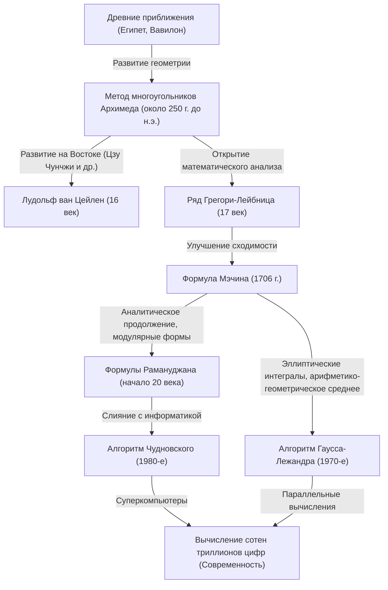

# 1. Введение: Очаровательная константа — число пи

В истории человечества и математики, пожалуй, нет другого такого числа, как число пи ($pi$), которое очаровало бы столько математиков и ученых в области вычислительной техники и которое бы вычисляли так долго. Эта простая константа, определяемая как отношение длины окружности к ее диаметру, обладает глубоким свойством быть иррациональным и трансцендентным числом. Невозможно выразить его в виде дроби рациональных чисел, и оно не может быть корнем любого алгебраического уравнения с рациональными коэффициентами. Это число раскрывает свою полную форму только в виде бесконечной нерегулярной последовательности десятичных знаков.

В этой статье мы подробно рассмотрим историю того, как человечество повышало точность вычисления числа пи, начиная с древних времен и заканчивая современными суперкомпьютерами, а также стоящую за этим математическую теорию. Мы углубимся в историю, начиная с древних геометрических подходов, переходя к бесконечным рядам, использующим математический анализ, и заканчивая поразительными алгоритмами, поддерживающими современные сверхвысокоточные вычисления, сопровождая каждый подход формулами и примерами кода на Python.

Можно без преувеличения сказать, что история вычисления числа пи — это история развития математики и информатики человечества. С каждым открытием новой математической концепции точность вычисления числа пи резко возрастала. Итак, давайте отправимся в это бесконечное путешествие исследователей.



# 2. Древние приближения и метод многоугольников Архимеда (геометрический подход)

## 2.1 Представление о числе пи в древних цивилизациях

Около 2000 года до н.э. в Древнем Вавилоне и Древнем Египте концепция числа пи была уже известна. Вавилоняне использовали тот факт, что длина окружности немного больше периметра правильного шестиугольника, и применяли приближенное значение $3 + 1/8 = 3.125$. В египетском «Математическом папирусе Ринда» описан метод вычисления площади круга с использованием квадрата $8/9$ его диаметра, что дает значение числа пи, равное $(16/9)^2 \approx 3.16049$. Эти значения имели достаточную для практического применения точность, но оставались всего лишь эмпирическими приближениями.

## 2.2 Геометрический метод Архимеда

Первым, кто сформулировал вычисление числа пи строго математическим методом, был великий древнегреческий математик Архимед (287–212 гг. до н.э.). Он показал, используя правильные многоугольники, вписанные в окружность и описанные вокруг нее, что истинное значение числа пи находится между периметрами этих двух многоугольников (метод исчерпывания).

Архимед начал с правильного шестиугольника и, удваивая количество сторон, вычислил периметры правильных 12-, 24-, 48- и, наконец, 96-угольников. С увеличением числа сторон периметр многоугольника приближался к длине окружности.

Пусть радиус окружности равен $r=1$. Тогда длина окружности равна $2pi$.
Если $p_n$ — периметр вписанного правильного $n$-угольника, а $P_n$ — периметр описанного правильного $n$-угольника, выполняется следующее неравенство:

$$ p_n < 2pi < P_n $$

Чтобы вычислить длину стороны правильного $n$-угольника, Архимед многократно применял геометрические теоремы (теорему Пифагора и теорему о биссектрисе угла), которые эквивалентны современным тригонометрическим функциям. В современной нотации длина стороны вписанного правильного $n$-угольника равна $2 \sin(pi/n)$, а длина стороны описанного правильного $n$-угольника — $2 \tan(pi/n)$. Таким образом, используя полупериметры, получаем следующее:

$$ n \sin\left(\frac{pi}{n}\right) < pi < n \tan\left(\frac{pi}{n}\right) $$

Рекуррентные соотношения для полупериметров вписанного и описанного многоугольников при удвоении числа сторон до $2n$ (пусть они равны $s_n$ и $S_n$ соответственно) выглядят следующим образом:
（Здесь $s_n = n \sin(pi/n), S_n = n \tan(pi/n)$)

$$ S_{2n} = \frac{2 s_n S_n}{s_n + S_n} $$
$$ s_{2n} = \sqrt{s_n S_{2n}} $$

Архимед, мастерски вычисляя квадратные корни (в то время для ручных вычислений применялись рациональные дробные приближения), из вычислений для правильного 96-угольника вывел следующее знаменитое неравенство:

$$ 3 \frac{10}{71} < pi < 3 \frac{1}{7} $$
（В десятичном виде это $3.1408... < pi < 3.1428...$）

Этот «подход Архимеда» оставался основным методом вычисления числа пи на протяжении почти 2000 лет вплоть до открытия математического анализа в 17 веке. Нидерландский математик 16 века Лудольф ван Цейлен с помощью этого метода вычислил правильный $2^{62}$-угольник и нашел значение числа пи с точностью до 35 знаков.

## 2.3 Моделирование метода Архимеда на Python

Давайте реализуем это геометрическое рекуррентное соотношение с использованием модуля `decimal` в Python и вычислим число пи с точностью в несколько десятков знаков.

```python
from decimal import Decimal, getcontext

def archimedes_pi(iterations: int, precision: int = 50) -> tuple[Decimal, Decimal]:
    '''
    Вычисляет число пи с использованием метода многоугольников Архимеда.
    iterations: Количество удвоений числа сторон
    precision: Точность вычислений (количество знаков после запятой)
    '''
    getcontext().prec = precision + 5  # Запас, чтобы избежать ошибок округления

    # Начальное значение: правильный шестиугольник (n=6)
    # Правильный шестиугольник для окружности радиуса 1
    n = 6
    s_n = Decimal('3')               # Полупериметр вписанного шестиугольника (6 * sin(pi/6) = 3)
    S_n = Decimal('6') / Decimal('3').sqrt() # Полупериметр описанного шестиугольника (6 * tan(pi/6) = 2*sqrt(3))

    for _ in range(iterations):
        # Обновление на основе рекуррентного соотношения
        S_2n = (Decimal('2') * s_n * S_n) / (s_n + S_n)
        s_2n = (s_n * S_2n).sqrt()
        
        s_n, S_n = s_2n, S_2n
        n *= 2

    return s_n, S_n

if __name__ == '__main__':
    inner, outer = archimedes_pi(100, 50)
    print('Метод Архимеда (100 итераций)')
    print(f'Приближение вписанным многоугольником: {inner}')
    print(f'Приближение описанным многоугольником: {outer}')
```

Этот рекуррентный алгоритм сходится очень медленно (линейная сходимость), поскольку с каждой итерацией точность увеличивается всего примерно на 1 бит в двоичной системе. В поисках более быстрого метода вычислений математики начали исследовать новые подходы.


# 3. Рассвет математического анализа: Подход с бесконечными рядами

В 17 веке, благодаря открытию Ньютоном и Лейбницем дифференциального и интегрального исчисления, математические методы претерпели резкую эволюцию. Произошел сдвиг парадигмы от вычислений с рисованием геометрических фигур к алгебраическим вычислениям с использованием «бесконечных рядов».

## 3.1 Ряд Грегори-Лейбница

В 1671 году шотландский математик Джеймс Грегори открыл, а в 1674 году немецкий математик Готфрид Лейбниц независимо переоткрыл разложение функции арктангенса в бесконечный ряд:

$$ \arctan(x) = x - \frac{x^3}{3} + \frac{x^5}{5} - \frac{x^7}{7} + \cdots = \sum_{k=0}^{\infty} \frac{(-1)^k x^{2k+1}}{2k+1} $$

Если подставить $x = 1$ в эту формулу, то, поскольку $\arctan(1) = pi/4$, получается красивая формула, позволяющая напрямую вычислить число пи. Это называется «рядом Грегори-Лейбница».

$$ \frac{pi}{4} = 1 - \frac{1}{3} + \frac{1}{5} - \frac{1}{7} + \frac{1}{9} - \cdots $$

Прелесть этого ряда заключается в том, что число пи можно найти простым чередованием сложения и вычитания обратных величин нечетных чисел. Хотя эта формула была встречена с математическим изумлением, с практической точки зрения вычисления числа пи у нее был фатальный недостаток: «сходимость безнадежно медленная».

Например, чтобы получить точность даже до 2 знаков после запятой (3.14), необходимо вычислить сотни членов ряда. А для получения точности в 10 знаков после запятой требуется сложить более 5 миллиардов членов. По этой причине данная формула никогда не использовалась напрямую для побития рекордов вычисления числа пи. Однако сама идея разложения арктангенса в ряд послужила основой для появившихся позже более быстрых методов вычисления.

# 4. Формула Мэчина и развитие математического анализа

## 4.1 Теорема сложения арктангенсов и формула Мэчина

Чтобы преодолеть медленную сходимость ряда Грегори-Лейбница, необходимо было подставлять в ряд арктангенса меньшие значения $x$, а не $x=1$ (чем меньше $x$, тем быстрее убывает $x^{2k+1}$ и тем быстрее происходит сходимость).

В 1706 году английский математик Джон Мэчин хитроумно использовал теорему сложения арктангенсов и открыл революционную формулу.

Теорема сложения арктангенсов выглядит следующим образом:
$$ \arctan(x) + \arctan(y) = \arctan\left(\frac{x+y}{1-xy}\right) $$

Мэчин обратил внимание на значение $\arctan(1/5)$. Вычислять с $x=1/5$ легко (достаточно умножить на 2 и сдвинуть на один знак). Удвоив этот угол с помощью теоремы сложения:
$$ 2 \arctan\left(\frac{1}{5}\right) = \arctan\left(\frac{5/12}{1}\right) = \arctan\left(\frac{120}{119}\right) $$

Удвоив его еще раз, получаем $4 \arctan(1/5)$. При продолжении расчетов выясняется, что это значение очень близко к $\arctan(1) = pi/4$. Находя разницу:

$$ 4 \arctan\left(\frac{1}{5}\right) - \frac{pi}{4} = \arctan\left(\frac{1}{239}\right) $$

Преобразовав это выражение, мы получаем знаменитую «формулу Мэчина»:

$$ \frac{pi}{4} = 4 \arctan\left(\frac{1}{5}\right) - \arctan\left(\frac{1}{239}\right) $$

Преимущество этой формулы в том, что в ряд Грегори-Лейбница подставляются относительно небольшие значения $x=1/5$ и $x=1/239$, что обеспечивает огромную скорость сходимости. Сам Мэчин, используя эту формулу, вручную за один раз вычислил 100 знаков числа пи.

Впоследствии один за другим были открыты аналогичные подходы (методы, использующие более сложные линейные комбинации арктангенсов), и вплоть до появления электронных компьютеров в середине 20 века рекорды количества цифр числа пи устанавливались с помощью формул типа Мэчина.

## 4.2 Реализация формулы Мэчина на Python

Давайте реализуем формулу Мэчина с использованием модуля `decimal` в Python.

```python
from decimal import Decimal, getcontext

def arctan(x_inv: int, precision: int) -> Decimal:
    '''
    Вычисляет arctan(1/x) с помощью ряда Грегори
    '''
    getcontext().prec = precision + 10
    x_inv_dec = Decimal(x_inv)
    x_squared = x_inv_dec * x_inv_dec
    
    term = Decimal(1) / x_inv_dec
    total = term
    k = 1
    
    while True:
        term = term / x_squared
        current_term = term / Decimal(2*k + 1)
        if current_term == 0:
            break
            
        if k % 2 == 1:
            total -= current_term
        else:
            total += current_term
        k += 1
        
    return total

def machin_pi(precision: int = 100) -> Decimal:
    '''
    Вычисляет число пи с использованием формулы Мэчина
    '''
    getcontext().prec = precision + 10
    pi_over_4 = 4 * arctan(5, precision) - arctan(239, precision)
    pi = 4 * pi_over_4
    getcontext().prec = precision
    return +pi

if __name__ == '__main__':
    print('Вычисление 100 знаков по формуле Мэчина:')
    print(machin_pi(100))
```
При запуске этого кода 100 знаков числа пи вычисляются точно и за долю секунды.

# 5. Удивительные формулы Рамануджана и модулярные формы

В начале 20 века гениальный индийский математик Сриниваса Рамануджан предложил совершенно новый подход к вычислению числа пи. Обладая глубокой интуицией в отношении эллиптических интегралов и модулярных уравнений, он открыл несколько невероятно сложных рядов, противоречащих здравому смыслу, таких как:

$$ \frac{1}{pi} = \frac{2\sqrt{2}}{9801} \sum_{k=0}^{\infty} \frac{(4k)! (1103 + 26390k)}{(k!)^4 396^{4k}} $$

На первый взгляд невозможно понять, откуда взялась эта сложнейшая формула, но скорость ее сходимости поразительна: с каждым вычисленным членом точность числа пи увеличивается примерно на 8 цифр.

Формулы Рамануджана ознаменовали значительный переход в методах вычисления числа пи от «рядов арктангенса» к «гипергеометрическим рядам и модулярным формам». В его время, из-за отсутствия компьютеров, эти формулы не раскрыли свой истинный потенциал. Однако в 1980-х годах, когда обострилась гонка в вычислении числа пи на суперкомпьютерах, на базе его теории один за другим стали появляться новые алгоритмы.

# 6. Современные сверхвысокоточные вычисления: Алгоритм Чудновского

Подход Рамануджана получил дальнейшее развитие в «алгоритме Чудновского», который в 1988 году опубликовали братья Чудновские (Дэвид и Григорий Чудновские).

$$ \frac{1}{pi} = 12 \sum_{k=0}^{\infty} \frac{(-1)^k (6k)! (13591409 + 545140134k)}{(3k)!(k!)^3 640320^{3k + 3/2}} $$

Этот алгоритм и по сей день является стандартным и наиболее широко используемым методом для обновления мировых рекордов по вычислению числа пи (на данный момент рекорд достигает 100 триллионов цифр) с помощью суперкомпьютеров и персональных ПК.

Причина кроется в том, что с вычислением каждого члена точность увеличивается с феноменальной скоростью — примерно на 14 знаков. Кроме того, этот алгоритм прекрасно совместим с информационными методами оптимизации (такими как вычисление огромных дробей «разделяй и властвуй» методом бинарного расщепления) и демонстрирует исключительно высокую производительность при запуске на параллельных вычислительных системах.

## 6.1 Реализация алгоритма Чудновского на Python

Давайте реализуем этот поразительный алгоритм на Python с использованием модуля `decimal`.

```python
from decimal import Decimal, getcontext
import math

def chudnovsky_pi(precision: int = 100) -> Decimal:
    '''
    Вычисляет число пи с использованием алгоритма Чудновского
    '''
    getcontext().prec = precision + 10
    
    C = 640320
    C3_OVER_24 = C**3 // 24
    
    total = Decimal(0)
    k = 0
    M = 1
    L = 13591409
    X = 1
    
    # Необходимое количество членов (около 14 знаков на член)
    max_k = precision // 14 + 1
    
    for k in range(max_k):
        term = Decimal(M * L) / X
        if k % 2 != 0:
            total -= term
        else:
            total += term
            
        # Обновление для следующего члена
        k_next = k + 1
        L += 545140134
        X *= C3_OVER_24
        M = (M * (12 * k_next - 10) * (12 * k_next - 6) * (12 * k_next - 2)) // (k_next**3)
        
    pi_inverse = Decimal(12) * total / Decimal(C**3).sqrt()
    getcontext().prec = precision
    return Decimal(1) / pi_inverse

if __name__ == '__main__':
    print('Вычисление 100 знаков алгоритмом Чудновского:')
    print(chudnovsky_pi(100))
```
Запустив приведенный выше код, можно получить число пи с невероятной скоростью. Точность в 100 знаков достигается всего за несколько циклов (`max_k`).

# 7. Алгоритм Гаусса-Лежандра (метод арифметико-геометрического среднего)

В методах вычисления числа пи есть еще один инновационный алгоритм, о котором нельзя забывать — «алгоритм Гаусса-Лежандра». Он был независимо открыт в 1975 году Ричардом Брентом и Юджином Саламином.

Основой этого алгоритма является «арифметико-геометрическое среднее (AGM)» и теория эллиптических интегралов, исследованные Карлом Фридрихом Гауссом.

Если даны два числа $a_0, b_0$, то путем многократного применения арифметического (среднего арифметического) и геометрического (среднего геометрического) средних мы создаем последовательности:

$$ a_{n+1} = \frac{a_n + b_n}{2} $$
$$ b_{n+1} = \sqrt{a_n b_n} $$

Эти две последовательности чрезвычайно быстро сходятся к одному и тому же значению (арифметико-геометрическому среднему). Путем объединения этого свойства с отношением Лежандра для полных эллиптических интегралов был выведен алгоритм вычисления числа пи.

Начальные значения задаются следующим образом:
$$ a_0 = 1, \quad b_0 = \frac{1}{\sqrt{2}}, \quad t_0 = \frac{1}{4}, \quad p_0 = 1 $$

Затем итеративно применяются следующие рекуррентные соотношения:
$$ a_{n+1} = \frac{a_n + b_n}{2} $$
$$ b_{n+1} = \sqrt{a_n b_n} $$
$$ t_{n+1} = t_n - p_n (a_n - a_{n+1})^2 $$
$$ p_{n+1} = 2 p_n $$

Приближенное значение числа пи $pi_n$ на шаге $n$ вычисляется следующим образом:
$$ pi_n = \frac{(a_n + b_n)^2}{4 t_n} $$

Самая большая особенность этого алгоритма заключается в его «квадратичной сходимости». Это означает, что с каждой итерацией «количество правильных цифр удваивается», что является поразительным свойством. Точность возрастает со взрывной скоростью — например, от 100 к 200, 400 и 800 знакам. Когда в 1999 году команда профессора Ясумасы Канады из Токийского университета успешно вычислила 206,1 миллиарда знаков, использовался именно этот алгоритм.

## 7.1 Реализация метода Гаусса-Лежандра на Python

```python
from decimal import Decimal, getcontext

def gauss_legendre_pi(iterations: int, precision: int = 100) -> Decimal:
    '''
    Вычисляет число пи с использованием алгоритма Гаусса-Лежандра
    '''
    getcontext().prec = precision + 10
    
    a = Decimal(1)
    b = Decimal(1) / Decimal(2).sqrt()
    t = Decimal(1) / Decimal(4)
    p = Decimal(1)
    
    for _ in range(iterations):
        a_next = (a + b) / 2
        b_next = (a * b).sqrt()
        t_next = t - p * (a - a_next)**2
        p_next = 2 * p
        
        a, b, t, p = a_next, b_next, t_next, p_next
        
    pi_approx = ((a + b)**2) / (4 * t)
    getcontext().prec = precision
    return +pi_approx

if __name__ == '__main__':
    # Точность более 100 знаков достигается всего за 7 итераций
    print('Вычисление методом Гаусса-Лежандра:')
    print(gauss_legendre_pi(7, 100))
```

# 8. Заключение: Бесконечное исследование

Вычисление числа пи, начавшееся с многоугольников, нарисованных античными математиками на песке, эволюционировало в бесконечные ряды с приобретением мощного инструмента в виде математического анализа. В наши дни, благодаря передовым математическим теориям, таким как модулярные формы и арифметико-геометрическое среднее, а также вычислительной мощи суперкомпьютеров, оно достигло невероятной точности в 100 триллионов цифр.

Гонка по вычислению числа пи — это не просто игра в поиск ряда чисел. Разработанные там алгоритмы и вычислительные методы (такие как бинарное расщепление и умножение огромных чисел с помощью быстрого преобразования Фурье) играют важную роль в различных областях, включая современную теорию криптографии, численный анализ и оценку производительности компьютерной архитектуры.

Поскольку число пи является иррациональным числом, его последовательность цифр никогда не закончится. Пока продолжается эволюция человеческой мудрости и компьютеров, бесконечное путешествие к вычислению числа пи также никогда не завершится.
