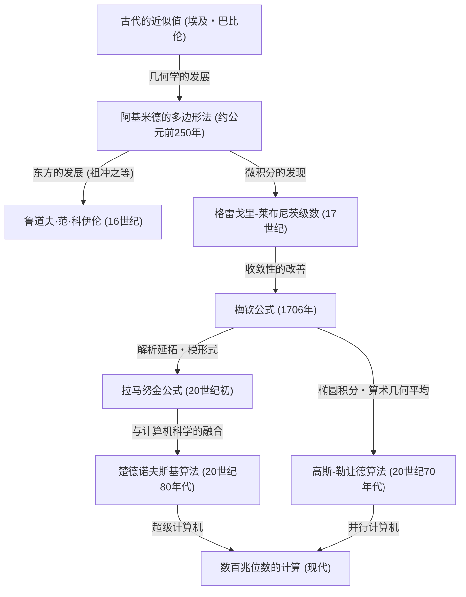

# 1. 引言：圆周率这个迷人的常数

在人类与数学的历史中，恐怕没有哪个数字能像圆周率（$\pi$）那样，吸引如此多的数学家和计算机科学家，并被持续不断地计算。这个定义为圆的周长与直径之比的简单常数，同时具有无理数和超越数这样深刻的性质。它无法表示为有理数的分数，也不能成为任何有理系数代数方程的根，只能作为无限延续且不规则的小数序列来展现它的全貌。

本文将深入探讨从古代到现代超级计算机，人类是如何提高圆周率精度的，详细解析其计算方法的历史及背后的数学理论。从古代的几何学方法开始，到使用微积分的无穷级数，再到支撑现代超高精度计算的惊人算法，我们将结合各个数学公式和使用 Python 的实现代码进行深入挖掘。

圆周率的计算历史，毫不夸张地说，就是人类数学与计算机科学的发展史。每当发现新的数学概念，圆周率的计算精度就会产生飞跃性的提高。那么，让我们踏上这场无尽的探索之旅吧。



# 2. 古代的近似与阿基米德的多边形法（几何学方法）

## 2.1 古代文明对圆周率的认识

在公元前2000年左右的古巴比伦和古埃及，人们就已经知道了圆周率的概念。巴比伦人利用圆的周长比正六边形的周长稍长这一点，使用了 $3 + 1/8 = 3.125$ 的近似值。另外，埃及的《莱因德数学纸草书》中记载，在计算圆面积时使用了直径的 $8/9$ 的平方的方法，由此推导出的圆周率为 $(16/9)^2 \approx 3.16049$。这些数值在实际上已经具备了足够的精度，但终究只是基于经验法则的近似值而已。

## 2.2 阿基米德的几何学方法

首次用数学上严格的方法对圆周率的计算进行公式化定义的，是古希腊伟大的数学家阿基米德（公元前287年 - 公元前212年）。他使用了圆的内接正多边形和外切正多边形，证明了圆周率的真实值介于这两个正多边形的周长之间（穷竭法）。

阿基米德从正六边形出发，通过将边数翻倍，计算了正12边形、正24边形、正48边形，最终计算到了正96边形。随着边数的增加，多边形的周长就越接近圆的周长。

设圆的半径为 $r=1$。圆的周长为 $2\pi$。
设内接正 $n$ 边形的周长为 $p_n$，外切正 $n$ 边形的周长为 $P_n$，则成立以下不等式：

$$ p_n < 2\pi < P_n $$

为了计算正 $n$ 边形的边长，阿基米德反复使用了相当于现代三角函数的几何学定理（[勾股定理](/zh-cn/p/diverse-proofs-of-pythagorean-theorem/)和角平分线定理）。用现代的记法表示，内接正 $n$ 边形的单边长为 $2 \sin(\pi/n)$，外切正 $n$ 边形的单边长为 $2 \tan(\pi/n)$。因此，使用半周长的话如下所示：

$$ n \sin\left(\frac{\pi}{n}\right) < \pi < n \tan\left(\frac{\pi}{n}\right) $$

当边数倍增为 $2n$ 时，内接、外切多边形的半周长（分别设为 $s_n, S_n$）的递推公式如下：
（这里相当于 $s_n = n \sin(\pi/n), S_n = n \tan(\pi/n)$）

$$ S_{2n} = \frac{2 s_n S_n}{s_n + S_n} $$
$$ s_{2n} = \sqrt{s_n S_{2n}} $$

阿基米德充分利用平方根的计算（当时是用有理数的分数近似进行手算），从正96边形的计算中推导出了以下著名的不等式：

$$ 3 \frac{10}{71} < \pi < 3 \frac{1}{7} $$
（化为小数则为 $3.1408... < \pi < 3.1428...$）

这种“阿基米德的方法”直到17世纪微积分被发明为止，在将近2000年的时间里一直是圆周率计算的基本方法。16世纪荷兰的数学家鲁道夫·范·科伊伦使用了这种方法计算到了正 $2^{62}$ 边形，将圆周率求到了35位。

## 2.3 使用 Python 模拟阿基米德法

让我们使用 Python 的 `decimal` 模块来实现这个几何递推公式，并以数十位的精度来求出圆周率吧。

```python
from decimal import Decimal, getcontext

def archimedes_pi(iterations: int, precision: int = 50) -> tuple[Decimal, Decimal]:
    '''
    使用阿基米德的多边形法计算圆周率。
    iterations: 边数翻倍的次数
    precision: 计算精度（小数点后的位数）
    '''
    getcontext().prec = precision + 5  # 为了防止中间的舍入误差，留出余量

    # 初始值：正六边形 (n=6)
    # 对应半径为1的圆的正六边形
    n = 6
    s_n = Decimal('3')               # 内接正六边形的半周长 (6 * sin(pi/6) = 3)
    S_n = Decimal('6') / Decimal('3').sqrt() # 外切正六边形的半周长 (6 * tan(pi/6) = 2*sqrt(3))

    for _ in range(iterations):
        # 基于递推公式的更新
        S_2n = (Decimal('2') * s_n * S_n) / (s_n + S_n)
        s_2n = (s_n * S_2n).sqrt()
        
        s_n, S_n = s_2n, S_2n
        n *= 2

    return s_n, S_n

if __name__ == '__main__':
    inner, outer = archimedes_pi(100, 50)
    print('阿基米德的方法 (迭代100次)')
    print(f'内接多边形近似: {inner}')
    print(f'外切多边形近似: {outer}')
```

这种递推公式的特点是，每次迭代只能以约等于二进制1比特的速度提高精度，因此收敛非常缓慢（线性收敛）。为了寻求更快的计算方法，数学家们开始探索新的路径。


# 3. 微积分的黎明：基于无穷级数的方法

进入17世纪，随着牛顿和莱布尼茨发现微积分学，数学的方法取得了戏剧性的进展。从绘制几何图形进行计算的方法，发生了向使用代数“无穷级数”进行计算的范式转移。

## 3.1 格雷戈里-莱布尼茨级数

1671年苏格兰数学家詹姆斯·格雷戈里发现，并在1674年德国数学家[戈特弗里德·莱布尼茨](/zh-cn/p/leibniz/)独立重新发现的，是反正切函数的无穷级数展开：

$$ \arctan(x) = x - \frac{x^3}{3} + \frac{x^5}{5} - \frac{x^7}{7} + \cdots = \sum_{k=0}^{\infty} \frac{(-1)^k x^{2k+1}}{2k+1} $$

如果在这个公式中代入 $x = 1$，由于 $\arctan(1) = \pi/4$，就可以得到一个可以直接求出圆周率的优美公式。这被称为“格雷戈里-莱布尼茨级数”。

$$ \frac{\pi}{4} = 1 - \frac{1}{3} + \frac{1}{5} - \frac{1}{7} + \frac{1}{9} - \cdots $$

这个级数的美妙之处在于，只需交替加减奇数的倒数就能求出圆周率。尽管这个公式在数学上令人惊叹，但从实际计算圆周率的实用角度来看，它存在一个致命的缺点。那就是“收敛速度令人绝望地缓慢”。

例如，仅仅为了获得小数点后2位的精度（3.14），就需要计算数百项。为了获得小数点后10位的精度，竟然需要将50亿项以上相加。因此，这个公式并没有被直接用于打破圆周率位数的记录。但是，反正切函数级数展开这一思路本身，成为了后来出现的更高速计算方法的基础。

# 4. 梅钦公式与分析学的发展

## 4.1 反正切的加法定理与梅钦公式

为了克服格雷戈里-莱布尼茨级数收敛缓慢的问题，必须将更小的 $x$ 值（而不是 $x=1$）代入反正切的级数中（因为 $x$ 越小，$x^{2k+1}$ 就会越快地变小，从而更快地收敛）。

1706年，英国数学家约翰·梅钦巧妙地利用反正切的加法定理，发现了一个突破性的公式。

反正切的加法定理如下：
$$ \arctan(x) + \arctan(y) = \arctan\left(\frac{x+y}{1-xy}\right) $$

梅钦注意到了 $\arctan(1/5)$ 这个值。这是因为 $x=1/5$ 很容易计算（只需乘以2再移一位）。利用加法定理将其求倍角：
$$ 2 \arctan\left(\frac{1}{5}\right) = \arctan\left(\frac{5/12}{1}\right) = \arctan\left(\frac{120}{119}\right) $$

将其再次求倍角，就变成了 $4 \arctan(1/5)$。经过计算发现，这个值非常接近 $\arctan(1) = \pi/4$。求出它们的差值：

$$ 4 \arctan\left(\frac{1}{5}\right) - \frac{\pi}{4} = \arctan\left(\frac{1}{239}\right) $$

整理后就得到了著名的“梅钦公式”：

$$ \frac{\pi}{4} = 4 \arctan\left(\frac{1}{5}\right) - \arctan\left(\frac{1}{239}\right) $$

这个公式的绝妙之处在于，因为将 $x=1/5$ 和 $x=1/239$ 这样比较小的值代入格雷戈里-莱布尼茨级数中，所以它能以惊人的速度收敛。梅钦本人就是用这个公式，通过手算一口气算出了100位的圆周率。

此后，类似的方法（使用更复杂的反正切线性组合的方法）接连被发现，直到20世纪中叶电子计算机出现之前，圆周率的位数记录一直被梅钦类型的公式不断刷新。

## 4.2 使用 Python 实现梅钦公式

让我们使用 Python 的 `decimal` 来实现梅钦公式。

```python
from decimal import Decimal, getcontext

def arctan(x_inv: int, precision: int) -> Decimal:
    '''
    使用格雷戈里级数计算 arctan(1/x)
    '''
    getcontext().prec = precision + 10
    x_inv_dec = Decimal(x_inv)
    x_squared = x_inv_dec * x_inv_dec
    
    term = Decimal(1) / x_inv_dec
    total = term
    k = 1
    
    while True:
        term = term / x_squared
        current_term = term / Decimal(2*k + 1)
        if current_term == 0:
            break
            
        if k % 2 == 1:
            total -= current_term
        else:
            total += current_term
        k += 1
        
    return total

def machin_pi(precision: int = 100) -> Decimal:
    '''
    使用梅钦公式计算圆周率
    '''
    getcontext().prec = precision + 10
    pi_over_4 = 4 * arctan(5, precision) - arctan(239, precision)
    pi = 4 * pi_over_4
    getcontext().prec = precision
    return +pi

if __name__ == '__main__':
    print('通过梅钦公式计算的100位结果:')
    print(machin_pi(100))
```
运行这段代码，在极短的时间内就能准确求出100位的圆周率。

# 5. 拉马努金的惊人公式与模形式

20世纪初，印度天才数学家斯里尼瓦瑟·拉马努金提出了一种关于圆周率的全新方法。他对椭圆积分和模方程有着深刻的直觉，发现了几十个常识之外的复杂级数，如下所示：

$$ \frac{1}{\pi} = \frac{2\sqrt{2}}{9801} \sum_{k=0}^{\infty} \frac{(4k)! (1103 + 26390k)}{(k!)^4 396^{4k}} $$

这个公式乍一看非常复杂，甚至不知道它是从哪里推导出来的，但它的收敛速度却极其惊人，每计算一项，圆周率的精度就会增加大约8位。

拉马努金的公式将圆周率的计算方法从“反正切函数的级数”大幅度转变为“超几何级数与模形式”。由于当时没有计算机，他的公式未能发挥出真正的潜力，但到了20世纪80年代，随着超级计算机对圆周率计算竞争的激化，基于他理论的新算法不断涌现。

# 6. 现代的超高精度计算：楚德诺夫斯基算法

将拉马努金的方法进一步推向高潮的，是1988年由楚德诺夫斯基兄弟（大卫·楚德诺夫斯基和格雷戈里·楚德诺夫斯基）发表的“楚德诺夫斯基算法”：

$$ \frac{1}{\pi} = 12 \sum_{k=0}^{\infty} \frac{(-1)^k (6k)! (13591409 + 545140134k)}{(3k)!(k!)^3 640320^{3k + 3/2}} $$

这个算法即使在今天，也是在使用超级计算机或个人PC刷新圆周率世界纪录（目前已达100兆位）时最广泛使用的标准计算方法。

其原因在于，每计算一项，精度就能以约14位的惊人速度提升。此外，它与计算机科学层面的优化（如通过二进制拆分法对巨大分数进行分治计算等）非常契合，在并行计算机上的执行能够发挥出极高的性能。

## 6.1 使用 Python 实现楚德诺夫斯基算法

让我们使用 Python 的 `decimal` 来实现这个惊人的算法。

```python
from decimal import Decimal, getcontext
import math

def chudnovsky_pi(precision: int = 100) -> Decimal:
    '''
    使用楚德诺夫斯基算法计算圆周率
    '''
    getcontext().prec = precision + 10
    
    C = 640320
    C3_OVER_24 = C**3 // 24
    
    total = Decimal(0)
    k = 0
    M = 1
    L = 13591409
    X = 1
    
    # 需要的项数（每项约14位）
    max_k = precision // 14 + 1
    
    for k in range(max_k):
        term = Decimal(M * L) / X
        if k % 2 != 0:
            total -= term
        else:
            total += term
            
        # 为下一项更新
        k_next = k + 1
        L += 545140134
        X *= C3_OVER_24
        M = (M * (12 * k_next - 10) * (12 * k_next - 6) * (12 * k_next - 2)) // (k_next**3)
        
    pi_inverse = Decimal(12) * total / Decimal(C**3).sqrt()
    getcontext().prec = precision
    return Decimal(1) / pi_inverse

if __name__ == '__main__':
    print('通过楚德诺夫斯基算法计算的100位结果:')
    print(chudnovsky_pi(100))
```
运行上述代码，就能以难以置信的速度求出圆周率。仅仅几次循环（`max_k`）就能达到100位的精度。

# 7. 高斯-勒让德算法（算术几何平均法）

在圆周率的计算方法中，还有一个不容忘记的创新算法，那就是“高斯-勒让德算法”。这是在1975年由理查德·布伦特和尤金·萨拉明独立发现的。

支撑这个算法的基础是[卡尔·弗里德里希·高斯](/zh-cn/p/gauss/)所研究的“算术几何平均 (Arithmetic-Geometric Mean, AGM)”与椭圆积分理论。

给定两个数 $a_0, b_0$，如下所示反复应用算术平均（相加平均）和几何平均（相乘平均）可以生成一个数列：

$$ a_{n+1} = \frac{a_n + b_n}{2} $$
$$ b_{n+1} = \sqrt{a_n b_n} $$

这两个数列会非常迅速地收敛到同一个值（算术几何平均）。通过结合这个性质与完全椭圆积分的勒让德关系式，推导出了求解圆周率的算法。

初始值设定如下：
$$ a_0 = 1, \quad b_0 = \frac{1}{\sqrt{2}}, \quad t_0 = \frac{1}{4}, \quad p_0 = 1 $$

然后，迭代以下递推公式：
$$ a_{n+1} = \frac{a_n + b_n}{2} $$
$$ b_{n+1} = \sqrt{a_n b_n} $$
$$ t_{n+1} = t_n - p_n (a_n - a_{n+1})^2 $$
$$ p_{n+1} = 2 p_n $$

在步骤 $n$ 中的圆周率近似值 $\pi_n$ 计算如下：
$$ \pi_n = \frac{(a_n + b_n)^2}{4 t_n} $$

这个算法最大的特点是“二次收敛”。也就是说，它有着每一次迭代都能让“正确的位数翻倍”这一惊人的特性。例如100位、200位、400位、800位这样，精度以爆发性的速度提升。1999年东京大学金田康正教授的团队在成功计算2061亿位时，也使用了这个算法。

## 7.1 使用 Python 实现高斯-勒让德法

```python
from decimal import Decimal, getcontext

def gauss_legendre_pi(iterations: int, precision: int = 100) -> Decimal:
    '''
    使用高斯-勒让德算法计算圆周率
    '''
    getcontext().prec = precision + 10
    
    a = Decimal(1)
    b = Decimal(1) / Decimal(2).sqrt()
    t = Decimal(1) / Decimal(4)
    p = Decimal(1)
    
    for _ in range(iterations):
        a_next = (a + b) / 2
        b_next = (a * b).sqrt()
        t_next = t - p * (a - a_next)**2
        p_next = 2 * p
        
        a, b, t, p = a_next, b_next, t_next, p_next
        
    pi_approx = ((a + b)**2) / (4 * t)
    getcontext().prec = precision
    return +pi_approx

if __name__ == '__main__':
    # 仅仅7次迭代就能获得100位以上的精度
    print('高斯-勒让德法的计算结果:')
    print(gauss_legendre_pi(7, 100))
```

# 8. 结语：无尽的探索

从古代数学家们在沙子上画出的多边形开始的圆周率计算，获得了微积分这一强大的武器从而进化为无穷级数，在现代则借助模形式和算术几何平均等高深的数学理论以及超级计算机的计算能力，达到了100兆位这样令人难以想象的精度。

圆周率的计算竞争，绝不仅仅是追求数字排列的儿戏。在其中培养出的算法和计算方法（例如通过二进制拆分或[快速傅里叶变换](/zh-cn/p/fast-fourier-transform-algorithm/)进行巨大数字的乘法等），在现代的密码学理论、数值分析、计算机架构的性能评估等众多领域都发挥着重要的作用。

因为圆周率是无理数，所以它的数字序列永远不会结束。只要人类的智慧和计算机的进化还在继续，那场探索圆周率的无尽之旅也将永不落幕。
