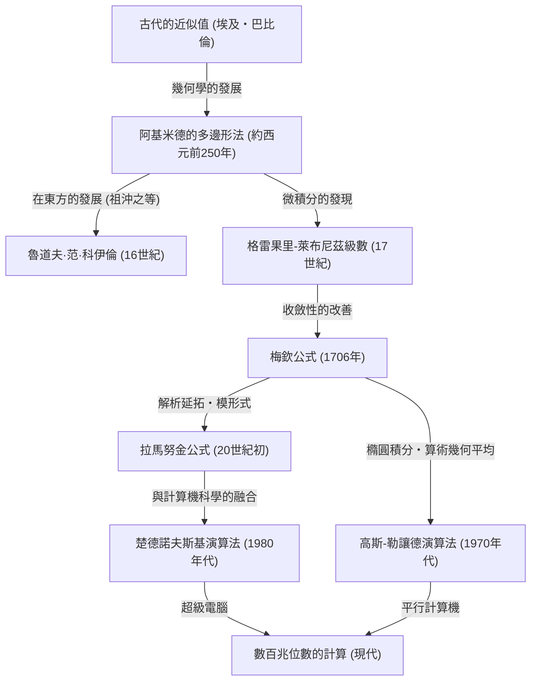

# 1. 前言：圓周率這個迷人的常數

在人類與數學的歷史中，也許沒有其他數字能像圓周率（$\pi$）這樣，吸引如此多數學家和計算機科學家，並不斷被計算。這個被定義為圓的周長與直徑之比的簡單常數，具有無理數和超越數的深奧性質。它不能表示為有理數的分數，也不能成為任何有理數係數代數方程式的根，這個數字只能以無限且不規則的連續小數來展現其全貌。

本文將徹底解說從古代到現代的超級電腦，人類是如何提高圓周率的精度，以及其計算方法的歷史與背後的數學理論。從古代的幾何學方法開始，到使用微積分的無窮級數，再到支撐現代超高精度計算的驚人演算法，我們將結合各個數學公式與使用 Python 的實作程式碼來進行深入探討。

可以毫不誇張地說，計算圓周率的歷史，正是人類數學與計算機科學發展的歷史。每當發現新的數學概念時，圓周率的計算精度都會有飛躍性的提升。那麼，讓我們出發前往這趟無盡的探索之旅吧。



# 2. 古代的近似與阿基米德的多邊形法（幾何學方法）

## 2.1 古代文明對圓周率的認識

在西元前 2000 年左右的古代巴比倫和古代埃及，人們就已經知道了圓周率的概念。巴比倫人利用圓周長略長於正六邊形周長這一點，使用了 $3 + 1/8 = 3.125$ 的近似值。另外，在埃及的「萊因德數學紙草書」中，記載了在計算圓面積時使用直徑的 $8/9$ 的平方的方法，由此推導出的圓周率為 $(16/9)^2 \approx 3.16049$。這些值在實用上具有足夠的精度，但終究只是基於經驗法則的近似值而已。

## 2.2 阿基米德的幾何學手法

古希臘偉大的數學家阿基米德（西元前 287 年 - 西元前 212 年）首次以數學上嚴謹的方法將圓周率的計算公式化。他利用圓的內接正多邊形和外切正多邊形，證明了圓周率的真實值介於這兩個正多邊形的周長之間（逼近法）。

阿基米德從正六邊形開始，透過將邊數加倍，計算了正 12 邊形、正 24 邊形、正 48 邊形，最終計算到了正 96 邊形。隨著邊數的增加，多邊形的周長會越來越接近圓的周長。

假設圓的半徑為 $r=1$。圓的周長即為 $2\pi$。
若設內接正 $n$ 邊形的周長為 $p_n$，外切正 $n$ 邊形的周長為 $P_n$，則下列不等式成立：

$$ p_n < 2\pi < P_n $$

為了計算正 $n$ 邊形的邊長，阿基米德反覆使用了相當於現代三角函數的幾何學定理（畢氏定理和角平分線定理）。以現代記法表示，內接正 $n$ 邊形的邊長為 $2 \sin(\pi/n)$，外切正 $n$ 邊形的邊長為 $2 \tan(\pi/n)$。因此，使用半周長可得如下式子：

$$ n \sin\left(\frac{\pi}{n}\right) < \pi < n \tan\left(\frac{\pi}{n}\right) $$

當邊數倍增為 $2n$ 時，內接與外切多邊形的半周長（分別設為 $s_n, S_n$）的遞迴公式如下：
（這裡相當於 $s_n = n \sin(\pi/n), S_n = n \tan(\pi/n)$）

$$ S_{2n} = \frac{2 s_n S_n}{s_n + S_n} $$
$$ s_{2n} = \sqrt{s_n S_{2n}} $$

阿基米德運用平方根的計算（當時是靠手算使用有理數的分數近似），從正 96 邊形的計算中推導出以下著名的不等式：

$$ 3 \frac{10}{71} < \pi < 3 \frac{1}{7} $$
（化為小數為 $3.1408... < \pi < 3.1428...$）

直到 17 世紀微積分發明為止，這種「阿基米德方法」在將近兩千年的時間裡，一直是計算圓周率的基本方法。16 世紀的荷蘭數學家魯道夫·范·科伊倫利用這種方法計算到了正 $2^{62}$ 邊形，將圓周率求到了小數點後 35 位。

## 2.3 使用 Python 模擬阿基米德法

讓我們使用 Python 的 `decimal` 模組來實作這個幾何遞迴公式，並以數十位數的精度來求圓周率。

```python
from decimal import Decimal, getcontext

def archimedes_pi(iterations: int, precision: int = 50) -> tuple[Decimal, Decimal]:
    '''
    使用阿基米德的多邊形法計算圓周率。
    iterations: 將邊數加倍的次數
    precision: 計算精度（小數點後的位數）
    '''
    getcontext().prec = precision + 5  # 為了防止計算過程中的捨入誤差，預留一些空間

    # 初始值：正六邊形 (n=6)
    # 針對半徑為1的圓的正六邊形
    n = 6
    s_n = Decimal('3')               # 內接正六邊形的半周長 (6 * sin(pi/6) = 3)
    S_n = Decimal('6') / Decimal('3').sqrt() # 外切正六邊形的半周長 (6 * tan(pi/6) = 2*sqrt(3))

    for _ in range(iterations):
        # 基於遞迴公式的更新
        S_2n = (Decimal('2') * s_n * S_n) / (s_n + S_n)
        s_2n = (s_n * S_2n).sqrt()
        
        s_n, S_n = s_2n, S_2n
        n *= 2

    return s_n, S_n

if __name__ == '__main__':
    inner, outer = archimedes_pi(100, 50)
    print('阿基米德的方法 (100次迭代)')
    print(f'內接多邊形近似值: {inner}')
    print(f'外切多邊形近似值: {outer}')
```

這個遞迴公式的特點是，每次迭代精度只會提高約 1 位二進位數，因此收斂速度非常慢（線性收斂）。為了尋求更快的計算方法，數學家們開始探索新的途徑。

# 3. 微積分的黎明：基於無窮級數的方法

進入 17 世紀，隨著牛頓和萊布尼茲發現微積分學，數學方法取得了戲劇性的進展。發生了從繪製幾何圖形進行計算的方法，到使用代數的「無窮級數」進行計算的典範轉移。

## 3.1 格雷果里-萊布尼茲級數

由蘇格蘭數學家詹姆斯·格雷果里於 1671 年發現，並由德國數學家戈特弗里德·萊布尼茲於 1674 年獨立重新發現的，正是反正切函數（arctan）的無窮級數展開。

$$ \arctan(x) = x - \frac{x^3}{3} + \frac{x^5}{5} - \frac{x^7}{7} + \cdots = \sum_{k=0}^{\infty} \frac{(-1)^k x^{2k+1}}{2k+1} $$

將 $x = 1$ 代入這個公式中，因為 $\arctan(1) = \pi/4$，我們便得到了一個可以直接求出圓周率的優美公式。這被稱為「格雷果里-萊布尼茲級數」。

$$ \frac{\pi}{4} = 1 - \frac{1}{3} + \frac{1}{5} - \frac{1}{7} + \frac{1}{9} - \cdots $$

這個級數的美妙之處在於，只需交替對奇數的倒數進行加減，就能求出圓周率。雖然這個公式帶來了數學上的驚喜，但從實際計算圓周率的角度來看，它有一個致命的缺點。那就是「收斂速度令人絕望地慢」。

例如，僅僅為了獲得小數點後兩位（3.14）的精度，就需要進行數百項的計算。為了獲得小數點後十位的精度，居然需要相加超過 50 億項。因此，這個公式並沒有被直接用來打破圓周率位數的紀錄。然而，這個反正切級數展開的想法本身，成為了後來出現的更快計算方法的基礎。

# 4. 梅欽公式與分析學的發展

## 4.1 反正切的加法定理與梅欽公式

為了解決格雷果里-萊布尼茲級數收斂過慢的問題，需要將更小的 $x$ 值（而不是 $x=1$）代入反正切級數中（因為 $x$ 越小，$x^{2k+1}$ 縮小的速度就越快，收斂得也越快）。

1706 年，英國數學家約翰·梅欽巧妙地利用反正切的加法定理，發現了一個突破性的公式。

反正切的加法定理如下：
$$ \arctan(x) + \arctan(y) = \arctan\left(\frac{x+y}{1-xy}\right) $$

梅欽注意到了 $\arctan(1/5)$ 這個值。因為 $x=1/5$ 容易計算（只要乘以 2 再將位數平移即可）。利用加法定理將其進行倍角計算：
$$ 2 \arctan\left(\frac{1}{5}\right) = \arctan\left(\frac{5/12}{1}\right) = \arctan\left(\frac{120}{119}\right) $$

將其再次倍角，得到 $4 \arctan(1/5)$。繼續計算，會發現這個值非常接近 $\arctan(1) = \pi/4$。求出它們之間的差值：

$$ 4 \arctan\left(\frac{1}{5}\right) - \frac{\pi}{4} = \arctan\left(\frac{1}{239}\right) $$

將其整理後，就得到了著名的「梅欽公式」。

$$ \frac{\pi}{4} = 4 \arctan\left(\frac{1}{5}\right) - \arctan\left(\frac{1}{239}\right) $$

這個公式的絕妙之處在於，將 $x=1/5$ 和 $x=1/239$ 這兩個相對較小的值代入格雷果里-萊布尼茲級數，因此收斂速度戲劇性地提升。梅欽本人就是利用這個公式，靠手算一口氣計算出了 100 位的圓周率。

此後，類似的方法（使用更複雜的反正切線性組合的方法）接連被發現，直到 20 世紀中葉電子計算機出現為止，圓周率位數的紀錄一直被梅欽型公式不斷刷新。

## 4.2 使用 Python 實作梅欽公式

讓我們使用 Python 的 `decimal` 來實作梅欽公式。

```python
from decimal import Decimal, getcontext

def arctan(x_inv: int, precision: int) -> Decimal:
    '''
    使用格雷果里級數計算 arctan(1/x)
    '''
    getcontext().prec = precision + 10
    x_inv_dec = Decimal(x_inv)
    x_squared = x_inv_dec * x_inv_dec
    
    term = Decimal(1) / x_inv_dec
    total = term
    k = 1
    
    while True:
        term = term / x_squared
        current_term = term / Decimal(2*k + 1)
        if current_term == 0:
            break
            
        if k % 2 == 1:
            total -= current_term
        else:
            total += current_term
        k += 1
        
    return total

def machin_pi(precision: int = 100) -> Decimal:
    '''
    使用梅欽公式計算圓周率
    '''
    getcontext().prec = precision + 10
    pi_over_4 = 4 * arctan(5, precision) - arctan(239, precision)
    pi = 4 * pi_over_4
    getcontext().prec = precision
    return +pi

if __name__ == '__main__':
    print('使用梅欽公式計算100位:')
    print(machin_pi(100))
```
執行這段程式碼，能在極短的時間內精確求出 100 位的圓周率。

# 5. 拉馬努金的驚人公式與模形式

20 世紀初，印度的天才數學家斯里尼瓦瑟·拉馬努金提出了一種關於圓周率的全新方法。他對橢圓積分和模方程式有著深刻的直覺，並發現了許多看似超乎常理且極其複雜的級數，如下所示：

$$ \frac{1}{\pi} = \frac{2\sqrt{2}}{9801} \sum_{k=0}^{\infty} \frac{(4k)! (1103 + 26390k)}{(k!)^4 396^{4k}} $$

這個公式乍看之下，根本讓人摸不著頭緒是從哪裡推導出來的，但它的收斂速度極其驚人，每計算一項，圓周率的精度就會增加約 8 位。

拉馬努金的公式將圓周率的計算方法，從「反正切函數的級數」大幅轉變為「超幾何級數與模形式」。由於當時沒有計算機，他的公式未能發揮其真正的潛力，但到了 1980 年代，隨著使用超級電腦進行圓周率計算競爭的白熱化，以他的理論為基礎的新演算法接連誕生。

# 6. 現代的超高精度計算：楚德諾夫斯基演算法

將拉馬努金的方法進一步推進的，是楚德諾夫斯基兄弟（大衛·楚德諾夫斯基和格雷果里·楚德諾夫斯基）於 1988 年發表的「楚德諾夫斯基演算法」。

$$ \frac{1}{\pi} = 12 \sum_{k=0}^{\infty} \frac{(-1)^k (6k)! (13591409 + 545140134k)}{(3k)!(k!)^3 640320^{3k + 3/2}} $$

這個演算法至今仍是使用超級電腦或個人電腦更新圓周率世界紀錄（目前已達到 100 兆位）時最廣泛使用的標準計算方法。

其原因在於，每計算一項，精度就會以驚人的速度提升約 14 位。此外，它與計算機科學領域的最佳化技術（如使用二元分裂法進行巨大分數的分治計算等）非常契合，在平行計算機上執行時能展現極高的效能。

## 6.1 使用 Python 實作楚德諾夫斯基演算法

讓我們使用 Python 的 `decimal` 來實作這個驚人的演算法。

```python
from decimal import Decimal, getcontext
import math

def chudnovsky_pi(precision: int = 100) -> Decimal:
    '''
    使用楚德諾夫斯基演算法計算圓周率
    '''
    getcontext().prec = precision + 10
    
    C = 640320
    C3_OVER_24 = C**3 // 24
    
    total = Decimal(0)
    k = 0
    M = 1
    L = 13591409
    X = 1
    
    # 需要的項數（每項約貢獻14位）
    max_k = precision // 14 + 1
    
    for k in range(max_k):
        term = Decimal(M * L) / X
        if k % 2 != 0:
            total -= term
        else:
            total += term
            
        # 為了計算下一項進行更新
        k_next = k + 1
        L += 545140134
        X *= C3_OVER_24
        M = (M * (12 * k_next - 10) * (12 * k_next - 6) * (12 * k_next - 2)) // (k_next**3)
        
    pi_inverse = Decimal(12) * total / Decimal(C**3).sqrt()
    getcontext().prec = precision
    return Decimal(1) / pi_inverse

if __name__ == '__main__':
    print('使用楚德諾夫斯基演算法計算100位:')
    print(chudnovsky_pi(100))
```
執行上述程式碼，將以令人難以置信的速度求出圓周率。只需短短幾次的迴圈（`max_k`）就能達到 100 位的精度。

# 7. 高斯-勒讓德演算法（算術幾何平均法）

在圓周率的計算方法中，還有一個不容忘記的創新演算法，那就是「高斯-勒讓德演算法」。它是由理查德·布倫特和尤金·薩拉明在 1975 年獨立發現的。

這個演算法的基礎，是卡爾·弗里德里希·高斯所研究的「算術幾何平均（Arithmetic-Geometric Mean, AGM）」以及橢圓積分的理論。

給定兩個數 $a_0, b_0$，如下反覆應用算術平均（相加平均）和幾何平均（相乘平均）來建立數列：

$$ a_{n+1} = \frac{a_n + b_n}{2} $$
$$ b_{n+1} = \sqrt{a_n b_n} $$

這兩個數列會非常迅速地收斂到相同的值（算術幾何平均）。將這個性質與完全橢圓積分的勒讓德關係式結合，就推導出了計算圓周率的演算法。

初始值設定如下：
$$ a_0 = 1, \quad b_0 = \frac{1}{\sqrt{2}}, \quad t_0 = \frac{1}{4}, \quad p_0 = 1 $$

接著，反覆執行以下的遞迴公式：
$$ a_{n+1} = \frac{a_n + b_n}{2} $$
$$ b_{n+1} = \sqrt{a_n b_n} $$
$$ t_{n+1} = t_n - p_n (a_n - a_{n+1})^2 $$
$$ p_{n+1} = 2 p_n $$

在第 $n$ 步中的圓周率近似值 $\pi_n$ 計算如下：
$$ \pi_n = \frac{(a_n + b_n)^2}{4 t_n} $$

這個演算法最大的特點是「二次收斂」。也就是說，每次迭代「正確的位數會翻倍」，這是一個極其驚人的性質。例如，從 100 位、200 位、400 位、800 位，精度以爆發性的速度提升。1999 年東京大學金田康正教授的團隊成功計算出 2061 億位時，也使用了這個演算法。

## 7.1 使用 Python 實作高斯-勒讓德法

```python
from decimal import Decimal, getcontext

def gauss_legendre_pi(iterations: int, precision: int = 100) -> Decimal:
    '''
    使用高斯-勒讓德演算法計算圓周率
    '''
    getcontext().prec = precision + 10
    
    a = Decimal(1)
    b = Decimal(1) / Decimal(2).sqrt()
    t = Decimal(1) / Decimal(4)
    p = Decimal(1)
    
    for _ in range(iterations):
        a_next = (a + b) / 2
        b_next = (a * b).sqrt()
        t_next = t - p * (a - a_next)**2
        p_next = 2 * p
        
        a, b, t, p = a_next, b_next, t_next, p_next
        
    pi_approx = ((a + b)**2) / (4 * t)
    getcontext().prec = precision
    return +pi_approx

if __name__ == '__main__':
    # 僅需7次迭代即可獲得超過100位的精度
    print('使用高斯-勒讓德法進行計算:')
    print(gauss_legendre_pi(7, 100))
```

# 8. 結語：無盡的探索

從古代數學家在沙地上畫出的多邊形開始，圓周率的計算藉由微積分這個強大武器演變為無窮級數，在現代則憑藉著模形式和算術幾何平均等高深的數學理論以及超級電腦的計算能力，達到了 100 兆位這種令人難以想像的精度。

圓周率的計算競爭，絕非單純為了追求一連串數字的遊戲。在其中孕育出的演算法與計算手法（如二元分裂法，以及利用快速傅立葉變換進行大數乘法等），在現代的密碼學理論、數值分析、計算機架構效能評估等多個領域中，都扮演著重要的角色。

由於圓周率是無理數，所以它的數字序列永遠不會結束。只要人類的智慧與計算機的進化持續進行，這趟尋求圓周率的無盡之旅，也將永遠不會有終結的一天。
