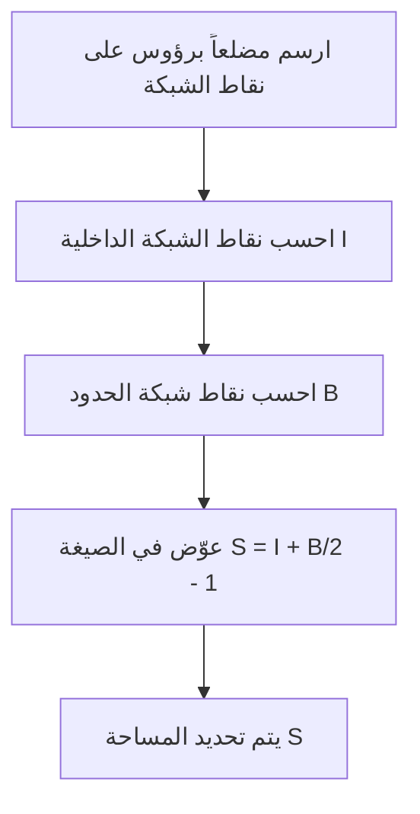
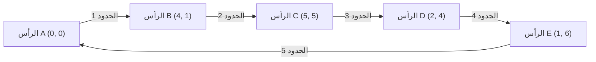

## 1. مقدمة

في مجال الهندسة في الرياضيات، تمت دراسة موضوع إيجاد مساحة شكل ما من قبل العديد من علماء الرياضيات منذ عصر اليونان القديمة. في فصول المدرسة، نتعلم طرقاً مختلفة، بدءاً من الصيغة الأساسية لمساحة المثلث "القاعدة $\times$ الارتفاع $\div 2$"، وصولاً إلى صيغ المساحة باستخدام النسب المثلثية في رياضيات المدارس الثانوية، وقاعدة ساروس (Sarrus' rule) باستخدام الضرب الاتجاهي للمتجهات على مستوى إحداثي، وحتى صيغة هيرون التي تستنتج المساحة بناءً على أطوال الأضلاع الثلاثة فقط.

ومع ذلك، إذا كانت جميع رؤوس مضلع تقع على **نقاط شبكة** (نقاط حيث يكون كل من الإحداثيين $x$ و $y$ أعداداً صحيحة)، فهناك صيغة سحرية تتيح لك حساب المساحة باستخدام عمليات حسابية بسيطة للغاية، دون قياس الأطوال أو إجراء عمليات ضرب معقدة أو حسابات الجذور التربيعية. هذه هي **[مبرهنة بيك](https://kenji.blog/ar/p/picks-theorem/) ([Pick's Theorem](https://kenji.blog/ar/p/picks-theorem/))** ، والتي سنشرحها بالتفصيل هذه المرة.

[مبرهنة بيك](https://kenji.blog/ar/p/picks-theorem/) ليست مجرد "صيغة مريحة وغامضة لإيجاد المساحة بسهولة"، بل لها خلفية عميقة جداً ترتبط بالطوبولوجيا، ونظرية المخططات، والهندسة الجبرية في الرياضيات الحديثة. في هذا المقال، سنتعمق في [مبرهنة بيك](https://kenji.blog/ar/p/picks-theorem/) من زوايا متعددة، بدءاً من كيفية استخدامها بشكل أساسي، إلى البرهان الرياضي لسبب صحة مثل هذه الصيغة البسيطة، وخلفيتها التاريخية، وحتى حدود المبرهنة وإمكانية امتدادها إلى الأبعاد الثلاثية (3D).

## 2. جورج ألكسندر بيك والخلفية التاريخية

قبل شرح [مبرهنة بيك](https://kenji.blog/ar/p/picks-theorem/) بالكامل، لنتطرق باختصار إلى الشخص الذي اكتشف هذه المبرهنة الجميلة وخلفيتها التاريخية.

نُشرت هذه المبرهنة في عام 1899 من قبل عالم الرياضيات النمساوي المولد **جورج ألكسندر بيك (1859-1942)** . درس الرياضيات في جامعة فيينا، وعمل لاحقاً كأستاذ لسنوات عديدة في الجامعة الألمانية في براغ (الآن جامعة تشارلز في براغ).

من المثير للاهتمام أن بيك كانت له صلة عميقة بألبرت أينشتاين الشهير. عندما تولى أينشتاين منصباً في الجامعة في براغ عام 1911، رحب به بيك بحرارة، وبنيا صداقة وثيقة، ليس فقط في الانخراط في مناقشات أكاديمية بل وأيضاً في العزف على الكمان معاً. يُقال إن بيك كان أحد الأشخاص الذين أوصوا أينشتاين بشدة بدراسة "حساب الموترات" و "هندسة ريمان"، والتي أصبحت ضرورية لبناء النظرية النسبية العامة.

ومع ذلك، كانت سنوات بيك الأخيرة مأساوية للغاية. كونه من أصل يهودي، واجه الاضطهاد مع صعود ألمانيا النازية. في عام 1942، تم إرساله إلى معسكر اعتقال تيريزينشتات، حيث توفي بعد أسبوعين فقط عن عمر يناهز 82 عاماً. على الرغم من أن حياته لاقت نهاية حزينة، إلا أن "[مبرهنة بيك](https://kenji.blog/ar/p/picks-theorem/)" التي تركها وراءه لا تزال محبوبة في تعليم الرياضيات في جميع أنحاء العالم اليوم بسبب جمالها وبساطتها.

## 3. ما هي [مبرهنة بيك](https://kenji.blog/ar/p/picks-theorem/)؟

الآن، دعونا نصل إلى جوهر [مبرهنة بيك](https://kenji.blog/ar/p/picks-theorem/). ادعاء المبرهنة بسيط بشكل مدهش ويمكن حتى لطلاب المدارس الابتدائية فهمه.

لنفترض أن هناك نقاط شبكة (مثل التقاطعات على ورق الرسم البياني) مصطفة رأسياً وأفقياً على فترات متساوية على مستوى. لنفترض أننا نربط بعض نقاط الشبكة هذه بخطوط مستقيمة لرسم "مضلع بلا فجوات وبدون تقاطع ذاتي (مضلع بسيط)". في هذا الوقت، يتم تحديد المساحة $S$ للمضلع المرسوم بالكامل فقط من خلال **عدد نقاط الشبكة داخل** المضلع و **عدد نقاط الشبكة على خط الحدود** ، وهو ما تنص عليه المبرهنة.

يتم التعبير عنها كصيغة رياضية على النحو التالي:

$$
S = I + \frac{B}{2} - 1
$$

- $S$ : مساحة المضلع
- $I$ (النقاط الداخلية): **عدد نقاط الشبكة داخل** المضلع
- $B$ (نقاط الحدود): **عدد نقاط الشبكة على خط الحدود** للمضلع (بالطبع، يتم تضمين الرؤوس نفسها في هذا)

النقطة الأكثر إثارة للدهشة في هذه الصيغة هي حقيقة أنه بغض النظر عن مدى تعقيد شكل المضلع (على سبيل المثال، شكل نجمة مسننة أو شكل ممدود للغاية)، طالما أن الرؤوس تقع على نقاط الشبكة ولا توجد تقاطعات ذاتية أو فجوات، فإنها **صحيحة دائماً بلا استثناء** . لها جاذبية غامضة تبدو وكأنها تتعارض مع الحدس من حيث أنه لا توجد حاجة على الإطلاق لمراعاة زوايا الشكل أو أطوال الأضلاع.

يوضح المخطط الانسيابي أدناه بصرياً إجراء إيجاد المساحة باستخدام [مبرهنة بيك](https://kenji.blog/ar/p/picks-theorem/).



## 4. تأكيد قوة المبرهنة بالأمثلة

قد يكون من الصعب الحصول على إحساس حقيقي بمجرد النظر إلى الصيغة. دعونا نتحقق فعلياً باستخدام بعض الأشكال المحددة مما إذا كانت [مبرهنة بيك](https://kenji.blog/ar/p/picks-theorem/) يمكن أن تستنتج المساحة الصحيحة حقاً.

### المثال 1: مستطيل بسيط

كأبسط شكل، دعونا نعتبر مستطيلاً تقع رؤوسه عند $(0, 0), (5, 0), (5, 3), (0, 3)$.

- **حساب المساحة باستخدام طريقة عامة** : بما أن العرض هو $5$ والارتفاع هو $3$، فإن المساحة هي $5 \times 3 = 15$.
- **عدد نقاط الشبكة الداخلية $I$** : النقاط داخل المستطيل هي مجموعات حيث يكون الإحداثي $x$ هو $1, 2, 3, 4$ والإحداثي $y$ هو $1, 2$. لذلك، هناك $4 \times 2 = 8$ نقاط في الداخل ( $I = 8$ ).
- **عدد نقاط شبكة الحدود $B$** : هناك $6$ نقاط على الحافة السفلية (بما في ذلك كلا الطرفين) و $6$ نقاط على الحافة العلوية. على الحواف اليسرى واليمنى، باستثناء الرؤوس الزاوية الأربعة، هناك نقطتان لكل منهما. بجمعها، هناك $6 + 6 + 2 + 2 = 16$ نقطة ( $B = 16$ ).

دعونا نطبق هذا على صيغة [مبرهنة بيك](https://kenji.blog/ar/p/picks-theorem/).

$$
S = 8 + \frac{16}{2} - 1 = 8 + 8 - 1 = 15
$$

لقد تطابق تماماً مع نتيجة الحساب المعتادة البالغة $15$.

### المثال 2: مثلث قائم الزاوية

بعد ذلك، لنجرب مثلثاً قائم الزاوية يتضمن مقاربة قطرية. هذا مثلث قائم الزاوية برؤوس عند $(0, 0), (6, 0), (0, 4)$.

- **حساب المساحة باستخدام طريقة عامة** : بما أن القاعدة هي $6$ والارتفاع هو $4$، فإن المساحة هي $\frac{6 \times 4}{2} = 12$.
- **عدد نقاط الشبكة الداخلية $I$** : إذا قمت برسم مخطط وحسابها بعناية، فهناك ما مجموعه $7$ نقاط شبكة داخل المثلث، مثل $(1, 1), (1, 2), (2, 1), (2, 2), (3, 1), (4, 1)$ ( $I = 7$ ).
- **عدد نقاط شبكة الحدود $B$** : هناك $7$ نقاط على القاعدة (من $(0,0)$ إلى $(6,0)$)، و $5$ نقاط على حافة الارتفاع (من $(0,0)$ إلى $(0,4)$). الوتر هو القطعة المستقيمة التي تصل بين النقطتين $(0, 4)$ و $(6, 0)$. تمر نقاط الشبكة على هذه القطعة المستقيمة عبر نقطة شبكة مثل $(3, 2)$ لأن $y$ ينقص بمقدار $2$ في كل مرة يزداد فيها $x$ بمقدار $3$. إذا حسبناها بعناية لتجنب التكرار في الزوايا الأربع، فهناك ما مجموعه $12$ نقطة على خط الحدود ( $B = 12$ ).

بالتطبيق على الصيغة،

$$
S = 7 + \frac{12}{2} - 1 = 7 + 6 - 1 = 12
$$

مرة أخرى، يتطابق تماماً.

### المثال 3: مضلع معقد به فجوات متداخلة

تُظهر [مبرهنة بيك](https://kenji.blog/ar/p/picks-theorem/) قوتها حتى مع المضلعات الأكثر تعقيداً ذات التجاويف.



في حالة مثل هذا الشكل المعقد، تتطلب طرق الحساب التقليدية عملاً مملاً للغاية، مثل تقسيم الشكل إلى عدة مثلثات ومستطيلات، أو طرح مساحة الأجزاء الزائدة من مستطيل كبير يحيط بالشكل بأكمله تماماً. من المحتمل أيضاً حدوث أخطاء في الحساب.

ومع ذلك، إذا استخدمت [مبرهنة بيك](https://kenji.blog/ar/p/picks-theorem/)، فيمكنك حساب المساحة الدقيقة على الفور فقط عن طريق عد النقاط داخل الشكل وعد النقاط على خط الحدود. يمكن القول حقاً إن هذا استثنائي.

## 5. البرهان باستخدام [صيغة أويلر للمجسمات](https://kenji.blog/ar/p/eulers-polyhedron-formula/)

لماذا تصح مثل هذه الصيغة السحرية؟ هناك عدة طرق لإثبات [مبرهنة بيك](https://kenji.blog/ar/p/picks-theorem/)، ولكن هنا سنقدم فكرة برهان أنيقة باستخدام مبرهنة مشهورة في نظرية المخططات، وهي **[صيغة أويلر للمجسمات](https://kenji.blog/ar/p/eulers-polyhedron-formula/)**.

وفقاً لمبرهنة أويلر، بالنسبة لمخطط متصل (شبكة) مرسوم على مستوى، إذا كان عدد الرؤوس هو $V$ ، وعدد الحواف هو $E$ ، وعدد الوجوه هو $F$ ، فإن العلاقة التالية صحيحة:

$$
V - E + F = 2
$$

(في هذا الـ $F$ ، يتم أيضاً حساب المنطقة اللانهائية الكبيرة التي تنتشر خارج المخطط كوجه واحد).

### تقسيم المضلع إلى مثلثات

أولاً، ضع في اعتبارك المضلع المستهدف $P$ الذي تريد إيجاد مساحته. بأخذ جميع نقاط الشبكة داخل وعلى حدود هذا المضلع كرؤوس، وربط نقاط الشبكة ببعضها البعض، نقوم بتقسيم (تثليث) الجزء الداخلي من المضلع $P$ بحيث يمتلئ تماماً بـ "مثلثات أولية" صغيرة.
المثلث الأولي هو مثلث لا يحتوي على أي نقاط شبكة بخلاف رؤوسه، سواء بداخله أو على حوافه على حدوده. مساحة مثل هذه المثلثات الأولية، بلا استثناء، جميعها $\frac{1}{2}$.

نحن نعتبر النمط الشبكي الناتج عن هذا التقسيم كمخطط مستوٍ واحد. بالنسبة لهذا المخطط، نحدد الرموز التالية:
- $I$ : عدد نقاط الشبكة داخل المضلع
- $B$ : عدد نقاط الشبكة على حدود المضلع
- $V$ : العدد الإجمالي للرؤوس في المخطط. من الواضح أن $V = I + B$.
- $E$ : العدد الإجمالي للحواف في المخطط.
- $f$ : عدد وجوه المثلثات الأولية المتكونة داخل المضلع.
- نظراً لأننا ندرج الوجه الخارجي (وجه $1$)، فإن العدد الإجمالي للوجوه في مبرهنة أويلر هو $F = f + 1$.

بتطبيق صيغة أويلر على هذا المخطط، نحصل على
$$
(I + B) - E + (f + 1) = 2
$$
أَيْ،
$$
I + B - E + f = 1 \quad \text{--- (المعادلة 1)}
$$

### التركيز على مجموع الزوايا الداخلية

بعد ذلك، نحسب مجموع الزوايا الداخلية لجميع المثلثات في المخطط بطريقتين مختلفتين ( $2$ ) وننشئ معادلة.

**الطريقة 1: الحساب من عدد المثلثات**
يتم تقسيم المضلع $P$ إلى $f$ من المثلثات الأولية. مجموع الزوايا الداخلية لمثلث واحد هو $180^\circ$ ( $\pi$ راديان). لذلك، فإن المجموع الكلي للزوايا الداخلية لجميع المثلثات الأولية هو $f \times \pi$.

**الطريقة 2: الحساب من الزوايا حول الرؤوس**
نعيد حساب مجموع الزوايا الداخلية كمجموع الزوايا المتجمعة عند كل رأس.
- **نقاط الشبكة الداخلية (نقاط $I$)** : حول كل نقطة، تتجمع زوايا بقيمة إجمالية قدرها $360^\circ$ ( $2\pi$ راديان). وبالتالي فإن المجموع هو $2\pi \times I$.
- **نقاط شبكة الحدود (نقاط $B$)** : ما هو مجموع الزوايا الداخلية للمضلع عند النقاط على الحدود؟ مجموع الزوايا الداخلية لأي مضلع ذي $n$ أضلاع هو $(n - 2) \times \pi$. هنا، نظراً لوجود $B$ نقطة على الحدود، يمكن اعتبار هذا مضلعاً ذا $B$ أضلاع، ومجموع زواياه الداخلية هو $(B - 2) \times \pi$.

بما أن المجموع الكلي للزوايا الذي تم إيجاده بهاتين الطريقتين يجب أن يكون متساوياً، فإن المعادلة التالية صحيحة.

$$
f \times \pi = 2\pi \times I + (B - 2) \times \pi
$$

بقسمة كلا الطرفين على $\pi$ ، نحصل على معادلة بسيطة للغاية.

$$
f = 2I + B - 2 \quad \text{--- (المعادلة 2)}
$$

### حساب المساحة

كما ذكرنا في البداية، فإن مساحة جميع المثلثات الأولية البالغ عددها $f$ هي $\frac{1}{2}$. لذلك، فإن المساحة الإجمالية $S$ للمضلع هي مجموع مساحات المثلثات الأولية، ويمكن التعبير عنها على النحو التالي:

$$
S = \frac{f}{2}
$$

بتعويض (المعادلة 2) التي تم إيجادها سابقاً في هذا، نحصل على

$$
S = \frac{2I + B - 2}{2} = I + \frac{B}{2} - 1
$$

تم استنتاج [مبرهنة بيك](https://kenji.blog/ar/p/picks-theorem/) ببراعة! تندمج مبرهنة أويلر، أساس الطوبولوجيا، ومجموع الزوايا الداخلية، أساس الهندسة، بشكل مثالي لإثبات هذه الصيغة الجميلة.

## 6. التطبيق على المضلعات ذات الفجوات

تفترض [مبرهنة بيك](https://kenji.blog/ar/p/picks-theorem/) "مضلعاً بسيطاً بلا فجوات"، ولكن ماذا يحدث إذا كانت هناك فجوة في المضلع؟

على سبيل المثال، تخيل شكلاً مثل كعكة الدونات، حيث يتم تجويف مضلع داخلي (فجوة) محتوى بالكامل داخل المضلع الخارجي. بالنسبة لمثل هذه الأشكال، لا تصح صيغة بيك كما هي. ومع ذلك، من الممكن إيجاد المساحة عن طريق تصحيح المبرهنة وفقاً لعدد الفجوات.

إذا كان هناك $h$ فجوة مستقلة داخل المضلع، فإن صيغة [مبرهنة بيك](https://kenji.blog/ar/p/picks-theorem/) المعممة هي كما يلي:

$$
S = I + \frac{B}{2} - 1 + h
$$

هنا، يحسب $I$ فقط نقاط الشبكة داخل المضلع (الجزء الصلب باستثناء أجزاء الفجوة). أيضاً، يمثل $B$ مجموع ليس فقط نقاط الشبكة على خط الحدود الخارجية ولكن أيضاً جميع نقاط الشبكة على خط الحدود الداخلية للفجوات.

الخاصية المتمثلة في إضافة $+1$ إلى نهاية الصيغة في كل مرة تزيد فيها فجوة ترتبط ارتباطاً وثيقاً بمميزة أويلر في الهندسة، ولها معنى مهم جداً في التشوه المستمر للمكان (الطوبولوجيا).

## 7. الامتداد إلى الأبعاد الثلاثية (3D) وكثيرات حدود إيرهارت

إذا كانت مثل هذه الصيغة الجميلة والقوية موجودة على مستوى (2D)، فمن الطبيعي جداً كعالم رياضيات أن يفكر، "ألا توجد صيغة يمكنها حساب حجم شكل صلب ثلاثي الأبعاد (متعدد السطوح) فقط من عدد نقاط الشبكة في الداخل وعلى السطح؟".

ومع ذلك، والمثير للدهشة، فقد ثبت أن **الامتداد المباشر ل[مبرهنة بيك](https://kenji.blog/ar/p/picks-theorem/) لا يوجد في الفضاء ثلاثي الأبعاد** . بمعنى آخر، من المستحيل إنشاء صيغة رياضية تحدد الحجم بشكل فريد فقط من عدد نقاط الشبكة الداخلية وعدد نقاط الشبكة السطحية.

### مثال مضاد: رباعي الأوجه لريف (Reeve tetrahedron)

كان الدليل على هذه الاستحالة هو مثال مضاد يُدعى "رباعي الأوجه لريف" والذي قدمه عالم الرياضيات البريطاني جون ريف في عام 1957.
اعتبر ريف رباعي أوجه (هرماً ثلاثياً) له الرؤوس الـ 4 التالية:

- الرأس 1: $(0, 0, 0)$
- الرأس 2: $(1, 0, 0)$
- الرأس 3: $(0, 1, 0)$
- الرأس 4: $(1, 1, r)$ (حيث $r$ هو أي عدد صحيح موجب)

عند فحص رباعي الأوجه هذا، فإن عدد نقاط الشبكة بالداخل يكون دائماً $0$. بالإضافة إلى ذلك، لا توجد نقاط شبكة على السطح على الإطلاق باستثناء النقاط الأربع التي تمثل الرؤوس. بمعنى، سواء كان $r$ هو $1$ أو $100$ أو $10000$، فإن العدد الإجمالي لنقاط الشبكة الموجودة في رباعي الأوجه هذا هو دائماً وباستمرار "$4$ نقاط".

ومع ذلك، يُحسب حجم رباعي الأوجه هذا على أنه $\frac{r}{6}$.
هذا يعني أنه حتى لو كان عدد نقاط الشبكة هو نفسه تماماً، فمن الممكن جعل الحجم كبيراً بشكل لا نهائي عن طريق تغيير قيمة $r$. لذلك، ثبت أنه من المستحيل نظرياً حساب "الحجم" بشكل عكسي فقط من معلومات "عدد نقاط الشبكة".

### التسامي إلى كثيرات حدود إيرهارت

على الرغم من أنه لا يمكن توسيع [مبرهنة بيك](https://kenji.blog/ar/p/picks-theorem/) مباشرة إلى 3D، إلا أن هذه المشكلة لم تنته بأي حال من الأحوال هنا. أسس عالم الرياضيات الفرنسي أوجين إيرهارت نظرية جديدة بتغيير نهجه.

درس "كيف يتغير عدد نقاط الشبكة الموجودة في شكل ما عندما يتم تكبير حجم الشكل بمعامل صحيح $t$". عندما يكون $L(P, t)$ هو عدد نقاط الشبكة الموجودة في شكل $tP$ تم الحصول عليه من خلال توسيع متعدد السطوح ذي البعد $d$ والذي تقع رؤوسه على نقاط الشبكة بـ $t$ مرة، أثبت إيرهارت أن هذا الـ $L(P, t)$ يصبح متعدد حدود من الدرجة $d$ لـ $t$. هذا هو **كثير حدود إيرهارت (Ehrhart polynomial)** .

كثير حدود إيرهارت في الحالة ثنائية الأبعاد هو بالضبط الشكل المعمم ل[مبرهنة بيك](https://kenji.blog/ar/p/picks-theorem/) نفسها، وتتم دراسته بنشاط في الهندسة الجبرية الحديثة والتوافقيات كأداة مهمة للغاية لكشف العلاقة بين نقاط الشبكة والحجم في المساحات عالية الأبعاد من 3 أبعاد وما فوق.

## 8. التنفيذ بواسطة برنامج

دعونا ننفذ برنامجاً بسيطاً بلغة بايثون (Python) يحسب المساحة باستخدام [مبرهنة بيك](https://kenji.blog/ar/p/picks-theorem/). في الواقع، عند إعطاء إحداثيات رؤوس مضلع، من الضروري حساب نقاط شبكة الحدود $B$ ونقاط الشبكة الداخلية $I$.

يمكن إيجاد عدد نقاط الشبكة على القطع المستقيمة على الحدود باستخدام **القاسم المشترك الأكبر (GCD)** للقيمة المطلقة للفرق في إحداثيات $x$ والقيمة المطلقة للفرق في إحداثيات $y$ لطرفي القطعة المستقيمة.

```python
import math

def get_boundary_points(polygon):
    """
    يتلقى قائمة بإحداثيات رؤوس مضلع ويعيد عدد نقاط شبكة الحدود B.
    polygon: [(x1, y1), (x2, y2), ..., (xn, yn)]
    """
    B = 0
    n = len(polygon)
    for i in range(n):
        x1, y1 = polygon[i]
        x2, y2 = polygon[(i + 1) % n]  # الرأس التالي (يعود إلى الأول في النهاية)
        
        # عدد نقاط الشبكة على القطعة يساوي القاسم المشترك الأكبر لـ dx و dy (بما في ذلك إحدى نقطتي النهاية)
        dx = abs(x1 - x2)
        dy = abs(y1 - y2)
        B += math.gcd(dx, dy)
        
    return B

# لإيجاد المساحة، تحتاج إلى حساب المساحة الإجمالية بشكل منفصل باستخدام الضرب الاتجاهي وما إلى ذلك،
# أو حساب I بشكل ساذج.
# هنا، كمثال، نعرض دالة تحسب المساحة عن طريق تحديد I و B مباشرة.

def picks_theorem(I, B):
    """
    يحسب المساحة S من نقاط الشبكة الداخلية I ونقاط شبكة الحدود B
    """
    return I + B / 2.0 - 1.0

# مثال تنفيذي
interior_points = 7
boundary_points = 12
area = picks_theorem(interior_points, boundary_points)
print(f"النقاط الداخلية: {interior_points}، نقاط الحدود: {boundary_points}")
print(f"المساحة المحسوبة: {area}")
```

بهذه الطريقة، حتى عند تفصيلها كخوارزمية، يتم التعبير عن صيغة [مبرهنة بيك](https://kenji.blog/ar/p/picks-theorem/) نفسها كصيغة حسابية بسيطة للغاية.

## 9. الخاتمة

[مبرهنة بيك](https://kenji.blog/ar/p/picks-theorem/) هي مبرهنة رياضية جميلة ذات الميزات المذهلة التالية:

1. **صيغة بسيطة للغاية** : يمكن إيجاد المساحة بمعادلة تتكون فقط من الجمع والقسمة، $S = I + \frac{B}{2} - 1$.
2. **لا حاجة لقياس الطول** : مقياس المسطرة أو المنقلة لقياس الزوايا غير ضروري على الإطلاق، ويتم تحديد المساحة فقط من خلال الفعل البدائي المتمثل في "عد النقاط".
3. **خلفية رياضية عميقة** : يمكن استنتاجها من مبرهنة أويلر، وتعمل أيضاً كمدخل للرياضيات الحديثة المتقدمة المسماة كثيرات حدود إيرهارت.

عندما ترسم مضلعاً على ورق رسم بياني أو دفتر ملاحظات نقطي، يرجى تذكر هذه المبرهنة ومحاولة حساب المساحة عن طريق عد النقاط فعلياً. اللحظة التي ترتبط فيها "نقاط الشبكة" و "المساحة"، والتي تبدو غير ذات صلة للوهلة الأولى، بشكل جميل ستقدم لنا بوضوح المتعة الشبيهة بحل الألغاز والعمق الذي تتمتع به دراسة الرياضيات.
