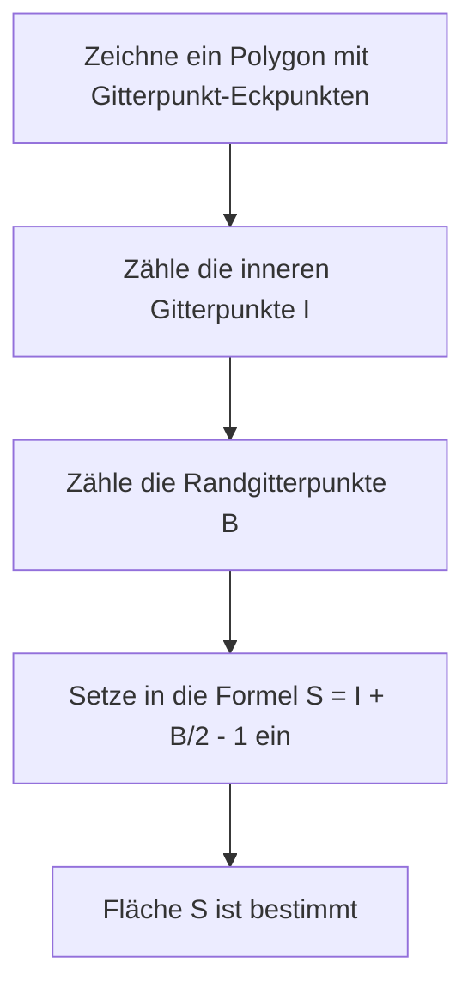

## 1. Einleitung

Im Bereich der Geometrie in der Mathematik wird das Thema der Flächenberechnung einer Form seit der Zeit der alten Griechen von vielen Mathematikern studiert. Im Schulunterricht lernen wir verschiedene Ansätze, angefangen bei der Grundformel für die Fläche eines Dreiecks, "Grundseite $\times$ Höhe $\div 2$", über Flächenformeln mit trigonometrischen Verhältnissen in der Oberstufenmathematik, die Regel von Sarrus mit dem Kreuzprodukt von Vektoren in einer Koordinatenebene bis hin zur Formel von Heron, die die Fläche ausschließlich aus den Längen der drei Seiten ableitet.

Wenn jedoch alle Eckpunkte eines Polygons auf **Gitterpunkten** liegen (Punkten, bei denen sowohl die $x$- als auch die $y$-Koordinate ganze Zahlen sind), gibt es eine magische Formel, mit der Sie die Fläche nur mit extrem einfachen arithmetischen Operationen berechnen können, ohne Längen zu messen oder komplexe Multiplikationen oder Quadratwurzelberechnungen durchzuführen. Das ist der **[Satz von Pick](https://kenji.blog/de/p/picks-theorem/)**, den wir diesmal im Detail erklären werden.

Der [Satz von Pick](https://kenji.blog/de/p/picks-theorem/) ist nicht nur eine "bequeme und mysteriöse Formel zum einfachen Finden der Fläche", sondern er hat einen sehr tiefen Hintergrund, der mit Topologie, Graphentheorie und algebraischer Geometrie in der modernen Mathematik verbunden ist. In diesem Artikel werden wir den [Satz von Pick](https://kenji.blog/de/p/picks-theorem/) aus verschiedenen Blickwinkeln eingehend betrachten, angefangen bei seiner grundlegenden Verwendung bis hin zum mathematischen Beweis, warum eine so einfache Formel gilt, seinem historischen Hintergrund und sogar den Grenzen des Satzes und der Möglichkeit seiner Erweiterung auf 3D.

## 2. Georg Alexander Pick und der historische Hintergrund

Bevor wir den [Satz von Pick](https://kenji.blog/de/p/picks-theorem/) vollständig erklären, wollen wir kurz auf die Person eingehen, die diesen schönen Satz entdeckt hat, und auf seinen historischen Hintergrund.

Dieser Satz wurde 1899 von dem in Österreich geborenen Mathematiker **Georg Alexander Pick (1859-1942)** veröffentlicht. Er studierte Mathematik an der Universität Wien und war später viele Jahre als Professor an der Deutschen Universität Prag (heute Karls-Universität Prag) tätig.

Interessanterweise hatte Pick eine tiefe Verbindung zu dem berühmten Albert Einstein. Als Einstein 1911 eine Stelle an der Universität in Prag antrat, hieß Pick ihn herzlich willkommen, und sie bauten eine enge Freundschaft auf, führten nicht nur akademische Diskussionen, sondern spielten auch gemeinsam Violine. Es wird gesagt, dass Pick einer derjenigen war, die Einstein nachdrücklich empfahlen, "Tensoranalysis" und "[Riemann](https://kenji.blog/de/p/riemann/)sche Geometrie" zu studieren, die für die Konstruktion der allgemeinen Relativitätstheorie unerlässlich wurden.

Picks spätere Jahre waren jedoch sehr tragisch. Da er jüdischer Abstammung war, war er mit dem Aufstieg des nationalsozialistischen Deutschlands Verfolgungen ausgesetzt. 1942 wurde er in das Konzentrationslager Theresienstadt deportiert, wo er nur zwei Wochen später im Alter von 82 Jahren verstarb. Obwohl sein Leben ein trauriges Ende nahm, wird der "[Satz von Pick](https://kenji.blog/de/p/picks-theorem/)", den er hinterließ, aufgrund seiner Schönheit und Einfachheit bis heute im Mathematikunterricht auf der ganzen Welt geliebt.

## 3. Was ist der [Satz von Pick](https://kenji.blog/de/p/picks-theorem/)?

Kommen wir nun zum Kern des Satzes von Pick. Die Aussage des Satzes ist erstaunlich einfach und kann sogar von Grundschülern verstanden werden.

Angenommen, es gibt Gitterpunkte (wie die Schnittpunkte auf Millimeterpapier), die vertikal und horizontal in gleichen Abständen auf einer Ebene aufgereiht sind. Angenommen, wir verbinden einige dieser Gitterpunkte mit geraden Linien, um ein "lochfreies Polygon ohne Selbstdurchdringung (einfaches Polygon)" zu zeichnen. Zu diesem Zeitpunkt wird die Fläche $S$ des gezeichneten Polygons vollständig nur durch die **Anzahl der Gitterpunkte im Inneren** des Polygons und die **Anzahl der Gitterpunkte auf der Randlinie** bestimmt, was der Satz besagt.

Als mathematische Formel ausgedrückt, sieht dies wie folgt aus:

$$
S = I + \frac{B}{2} - 1
$$

- $S$ : Fläche des Polygons
- $I$ (Interior, Inneres) : **Anzahl der Gitterpunkte im Inneren** des Polygons
- $B$ (Boundary, Rand) : **Anzahl der Gitterpunkte auf der Randlinie** des Polygons (natürlich sind die Eckpunkte selbst darin enthalten)

Der überraschendste Punkt dieser Formel ist die Tatsache, dass unabhängig davon, wie komplex die Form des Polygons ist (zum Beispiel eine gezackte Sternform oder eine extrem längliche Form), solange die Eckpunkte auf Gitterpunkten liegen und es keine Selbstdurchdringungen oder Löcher gibt, sie **immer ohne Ausnahme gilt**. Es hat einen mysteriösen Reiz, der kontraintuitiv erscheint, insofern als dass die Winkel der Form oder die Längen der Seiten überhaupt nicht berücksichtigt werden müssen.

Das folgende Flussdiagramm zeigt visuell das Verfahren zur Flächenberechnung mit dem [Satz von Pick](https://kenji.blog/de/p/picks-theorem/).



## 4. Bestätigung der Kraft des Satzes an Beispielen

Es könnte schwierig sein, ein echtes Gefühl dafür zu bekommen, nur indem man die Formel betrachtet. Überprüfen wir doch einmal an einigen konkreten Formen, ob der [Satz von Pick](https://kenji.blog/de/p/picks-theorem/) wirklich die richtige Fläche ableiten kann.

### Beispiel 1: Ein einfaches Rechteck

Betrachten wir als einfachste Form ein Rechteck, dessen Eckpunkte bei $(0, 0), (5, 0), (5, 3), (0, 3)$ liegen.

- **Flächenberechnung mit einer allgemeinen Methode** : Da die Breite $5$ und die Höhe $3$ beträgt, ist die Fläche $5 \times 3 = 15$.
- **Anzahl der inneren Gitterpunkte $I$** : Die Punkte innerhalb des Rechtecks sind Kombinationen, bei denen die $x$-Koordinate $1, 2, 3, 4$ und die $y$-Koordinate $1, 2$ ist. Daher gibt es $4 \times 2 = 8$ Punkte im Inneren ( $I = 8$ ).
- **Anzahl der Randgitterpunkte $B$** : Es gibt $6$ Punkte an der Unterkante (einschließlich beider Enden) und $6$ Punkte an der Oberkante. Am linken und rechten Rand gibt es, ohne die vier Eckpunkte, jeweils $2$ Punkte. Zusammengezählt gibt es $6 + 6 + 2 + 2 = 16$ Punkte ( $B = 16$ ).

Wenden wir dies auf die Formel des Satzes von Pick an.

$$
S = 8 + \frac{16}{2} - 1 = 8 + 8 - 1 = 15
$$

Es entsprach perfekt dem üblichen Berechnungsergebnis von $15$.

### Beispiel 2: Rechtwinkliges Dreieck

Als nächstes versuchen wir es mit einem rechtwinkligen Dreieck, das einen diagonalen Ansatz beinhaltet. Dies ist ein rechtwinkliges Dreieck mit den Eckpunkten $(0, 0), (6, 0), (0, 4)$.

- **Flächenberechnung mit einer allgemeinen Methode** : Da die Grundseite $6$ und die Höhe $4$ beträgt, ist die Fläche $\frac{6 \times 4}{2} = 12$.
- **Anzahl der inneren Gitterpunkte $I$** : Wenn Sie ein Diagramm zeichnen und diese sorgfältig zählen, gibt es insgesamt $7$ Gitterpunkte innerhalb des Dreiecks, wie z. B. $(1, 1), (1, 2), (2, 1), (2, 2), (3, 1), (4, 1)$ ( $I = 7$ ).
- **Anzahl der Randgitterpunkte $B$** : Es gibt $7$ Punkte auf der Grundseite (von $(0,0)$ bis $(6,0)$) und $5$ Punkte auf der Höhenkante (von $(0,0)$ bis $(0,4)$). Die Hypotenuse ist das Liniensegment, das die Punkte $(0, 4)$ und $(6, 0)$ verbindet. Die Gitterpunkte auf diesem Liniensegment verlaufen durch einen Gitterpunkt wie $(3, 2)$, weil $y$ jedes Mal um $2$ abnimmt, wenn $x$ um $3$ zunimmt. Wenn wir diese sorgfältig zählen und Überschneidungen an den vier Ecken vermeiden, gibt es insgesamt $12$ Punkte auf der Randlinie ( $B = 12$ ).

Anwendung auf die Formel:

$$
S = 7 + \frac{12}{2} - 1 = 7 + 6 - 1 = 12
$$

Auch hier stimmt es genau überein.

### Beispiel 3: Komplexes Polygon mit Einbuchtungen

Der [Satz von Pick](https://kenji.blog/de/p/picks-theorem/) zeigt seine Kraft auch bei komplexeren Polygonen mit Einbuchtungen.


Bei einer so komplexen Form erfordern herkömmliche Berechnungsmethoden eine sehr langwierige Arbeit, wie z. B. das Unterteilen der Form in mehrere Dreiecke und Rechtecke oder das Subtrahieren der Fläche überschüssiger Teile von einem großen Rechteck, das die gesamte Form vollständig umschließt. Rechenfehler können dabei ebenfalls leicht auftreten.

Wenn Sie jedoch den [Satz von Pick](https://kenji.blog/de/p/picks-theorem/) verwenden, können Sie die genaue Fläche im Handumdrehen berechnen, indem Sie einfach die Punkte innerhalb der Form zählen und die Punkte auf der Randlinie zählen. Man kann wirklich sagen, dass dies phänomenal ist.

## 5. Beweis mit Eulerschem Polyedersatz

Warum gilt eine so magische Formel? Es gibt mehrere Möglichkeiten, den [Satz von Pick](https://kenji.blog/de/p/picks-theorem/) zu beweisen, aber hier werden wir eine elegante Beweisidee vorstellen, die einen berühmten Satz aus der Graphentheorie verwendet, die **Eulersche Polyederformel**.

Nach dem eulerschen Polyedersatz gilt für einen zusammenhängenden Graphen (Netzwerk), der auf einer Ebene gezeichnet ist, folgende Beziehung, wenn die Anzahl der Eckpunkte $V$, die Anzahl der Kanten $E$ und die Anzahl der Flächen $F$ ist:

$$
V - E + F = 2
$$

(In diesem $F$ wird auch der unendlich große Bereich, der sich außerhalb des Graphen erstreckt, als eine Fläche gezählt).

### Unterteilen des Polygons in Dreiecke

Betrachten Sie zunächst das Zielpolygon $P$, dessen Fläche Sie ermitteln möchten. Wir nehmen alle Gitterpunkte im Inneren und auf dem Rand dieses Polygons als Eckpunkte und verbinden die Gitterpunkte miteinander, wir unterteilen (triangulieren) das Innere des Polygons $P$ so, dass es vollständig mit kleinen "primitiven Dreiecken" gefüllt ist.
Ein primitives Dreieck ist ein Dreieck, das weder in seinem Inneren noch auf seinen Randkanten außer seinen Eckpunkten weitere Gitterpunkte enthält. Die Fläche solcher primitiven Dreiecke beträgt ausnahmslos alle $\frac{1}{2}$.

Wir betrachten das durch diese Unterteilung entstandene Gittermuster als einen einzigen planaren Graphen. Für diesen Graphen definieren wir folgende Symbole:
- $I$ : Anzahl der Gitterpunkte im Inneren des Polygons
- $B$ : Anzahl der Gitterpunkte auf dem Rand des Polygons
- $V$ : Gesamtzahl der Eckpunkte im Graphen. Offensichtlich $V = I + B$.
- $E$ : Gesamtzahl der Kanten im Graphen.
- $f$ : Anzahl der Flächen der primitiven Dreiecke, die innerhalb des Polygons gebildet wurden.
- Da wir die Außenfläche ($1$ Fläche) einbeziehen, ist die Gesamtzahl der Flächen im eulerschen Polyedersatz $F = f + 1$.

Durch Anwenden der eulerschen Formel auf diesen Graphen erhalten wir
$$
(I + B) - E + (f + 1) = 2
$$
Das heißt,
$$
I + B - E + f = 1 \quad \text{--- (Gleichung 1)}
$$

### Fokussierung auf die Summe der Innenwinkel

Als nächstes berechnen wir die Summe der Innenwinkel aller Dreiecke im Graphen auf $2$ verschiedene Arten und erstellen eine Gleichung.

**Methode 1: Berechnung aus der Anzahl der Dreiecke**
Das Polygon $P$ ist in $f$ primitive Dreiecke unterteilt. Die Summe der Innenwinkel eines Dreiecks beträgt $180^\circ$ ( $\pi$ Radiant). Daher ist die Gesamtsumme der Innenwinkel aller primitiven Dreiecke $f \times \pi$.

**Methode 2: Berechnung aus den Winkeln um die Eckpunkte**
Wir zählen die Summe der Innenwinkel als Summe der Winkel neu, die sich an jedem Eckpunkt versammeln.
- **Innere Gitterpunkte ($I$ Punkte)** : Um jeden Punkt herum sind Winkel von insgesamt $360^\circ$ ( $2\pi$ Radiant) versammelt. Somit beträgt die Summe $2\pi \times I$.
- **Randgitterpunkte ($B$ Punkte)** : Wie groß ist die Summe der Innenwinkel des Polygons an den Punkten auf dem Rand? Die Summe der Innenwinkel eines beliebigen $n$-Ecks ist $(n - 2) \times \pi$. Da sich hier $B$ Punkte auf dem Rand befinden, kann dies als $B$-Eck betrachtet werden, und die Summe seiner Innenwinkel ist $(B - 2) \times \pi$.

Da die nach diesen beiden Methoden gefundene Winkelsumme gleich sein muss, gilt folgende Gleichung.

$$
f \times \pi = 2\pi \times I + (B - 2) \times \pi
$$

Indem wir beide Seiten durch $\pi$ dividieren, erhalten wir eine sehr einfache Gleichung.

$$
f = 2I + B - 2 \quad \text{--- (Gleichung 2)}
$$

### Berechnung der Fläche

Wie zu Beginn erwähnt, beträgt die Fläche aller $f$ primitiven Dreiecke $\frac{1}{2}$. Daher ist die Gesamtfläche $S$ des Polygons die Summe der Flächen der primitiven Dreiecke und kann wie folgt ausgedrückt werden:

$$
S = \frac{f}{2}
$$

Setzen wir die zuvor gefundene (Gleichung 2) hierin ein, erhalten wir

$$
S = \frac{2I + B - 2}{2} = I + \frac{B}{2} - 1
$$

Der [Satz von Pick](https://kenji.blog/de/p/picks-theorem/) ist brillant hergeleitet! Der eulersche Polyedersatz, die Grundlage der Topologie, und die Summe der Innenwinkel, die Grundlage der Geometrie, verschmelzen perfekt, um diese schöne Formel zu beweisen.

## 6. Anwendung auf Polygone mit Löchern

Der [Satz von Pick](https://kenji.blog/de/p/picks-theorem/) geht von einem "lochfreien einfachen Polygon" aus, aber was passiert, wenn sich ein Loch im Polygon befindet?

Stellen Sie sich zum Beispiel eine Form wie einen Donut vor, bei der ein inneres Polygon (Loch), das vollständig im äußeren Polygon enthalten ist, ausgehöhlt ist. Für solche Formen gilt Picks Formel nicht so wie sie ist. Es ist jedoch möglich, die Fläche zu ermitteln, indem man den Satz entsprechend der Anzahl der Löcher korrigiert.

Gibt es $h$ unabhängige Löcher innerhalb des Polygons, lautet die Formel für den verallgemeinerten [Satz von Pick](https://kenji.blog/de/p/picks-theorem/) wie folgt:

$$
S = I + \frac{B}{2} - 1 + h
$$

Hier zählt $I$ nur die Gitterpunkte innerhalb des Polygons (der feste Teil abzüglich der Lochteile). Außerdem repräsentiert $B$ die Summe nicht nur der Gitterpunkte auf der äußeren Randlinie, sondern auch aller Gitterpunkte auf der inneren Randlinie der Löcher.

Die Eigenschaft, dass $+1$ jedes Mal an das Ende der Formel angehängt wird, wenn ein Loch hinzukommt, ist tief mit der Euler-Charakteristik in der Geometrie verbunden und hat eine sehr wichtige Bedeutung bei der kontinuierlichen Verformung des Raums (Topologie).

## 7. Erweiterung auf 3D und Ehrhart-Polynome

Wenn eine so schöne und leistungsstarke Formel auf einer Ebene (2D) existiert, ist es für einen Mathematiker äußerst natürlich zu denken: "Gibt es nicht eine Formel, mit der das Volumen eines 3D-Körpers (Polyeders) nur aus der Anzahl der Gitterpunkte im Inneren und auf der Oberfläche berechnet werden kann?".

Überraschenderweise wurde jedoch bewiesen, dass **eine direkte Erweiterung des Satzes von Pick im dreidimensionalen Raum nicht existiert**. Mit anderen Worten, es ist unmöglich, eine mathematische Formel zu erstellen, die das Volumen nur anhand der Anzahl der inneren Gitterpunkte und der Anzahl der Oberflächengitterpunkte eindeutig bestimmt.

### Gegenbeispiel: Das Reeve-Tetraeder

Der Beweis dieser Unmöglichkeit war ein Gegenbeispiel namens "Reeve-Tetraeder", das der britische Mathematiker John Reeve 1957 präsentierte.
Reeve betrachtete ein Tetraeder (dreiseitige Pyramide) mit den folgenden 4 Eckpunkten:

- Eckpunkt 1: $(0, 0, 0)$
- Eckpunkt 2: $(1, 0, 0)$
- Eckpunkt 3: $(0, 1, 0)$
- Eckpunkt 4: $(1, 1, r)$ (wobei $r$ eine beliebige positive ganze Zahl ist)

Bei der Untersuchung dieses Tetraeders ist die Anzahl der Gitterpunkte im Inneren immer $0$. Außerdem gibt es absolut keine Gitterpunkte auf der Oberfläche außer den 4 Punkten, die die Eckpunkte sind. Das heißt, ob $r$ nun $1$, $100$ oder $10000$ ist, die Gesamtzahl der in diesem Tetraeder enthaltenen Gitterpunkte ist immer konstant "$4$ Punkte".

Das Volumen dieses Tetraeders berechnet sich jedoch zu $\frac{r}{6}$.
Dies bedeutet, dass es möglich ist, das Volumen unendlich groß zu machen, indem man den Wert von $r$ ändert, selbst wenn die Anzahl der Gitterpunkte genau gleich ist. Somit wurde bewiesen, dass es theoretisch unmöglich ist, das "Volumen" nur aus der Information der "Anzahl der Gitterpunkte" zurückzurechnen.

### Sublimierung zu Ehrhart-Polynomen

Obwohl der [Satz von Pick](https://kenji.blog/de/p/picks-theorem/) nicht direkt auf 3D erweitert werden konnte, endete dieses Problem hier keineswegs. Der französische Mathematiker Eugène Ehrhart begründete durch einen Ansatzwechsel eine neue Theorie.

Er untersuchte, "wie sich die Anzahl der in einer Form enthaltenen Gitterpunkte ändert, wenn die Größe der Form um einen ganzzahligen Faktor $t$ vergrößert wird". Wenn $L(P, t)$ die Anzahl der Gitterpunkte ist, die in einer Form $tP$ enthalten sind, die durch $t$-fache Vergrößerung eines $d$-dimensionalen Polyeders $P$, dessen Eckpunkte auf Gitterpunkten liegen, erhalten wird, so bewies Ehrhart, dass dieses $L(P, t)$ ein Polynom vom Grad $d$ für $t$ wird. Dies ist das **Ehrhart-Polynom**.

Das Ehrhart-Polynom im zweidimensionalen Fall ist genau die verallgemeinerte Form des Satzes von Pick selbst und wird in der modernen algebraischen Geometrie und Kombinatorik aktiv als ein äußerst wichtiges Werkzeug studiert, um die Beziehung zwischen Gitterpunkten und Volumen in hochdimensionalen Räumen von 3 Dimensionen und mehr zu entschlüsseln.

## 8. Implementierung per Programm

Implementieren wir ein einfaches Programm in Python, das die Fläche mit dem [Satz von Pick](https://kenji.blog/de/p/picks-theorem/) berechnet. Wenn die Eckpunktkoordinaten eines Polygons gegeben sind, müssen tatsächlich die Randgitterpunkte $B$ und die inneren Gitterpunkte $I$ gezählt werden.

Die Anzahl der Gitterpunkte auf den Liniensegmenten am Rand kann mit dem **größten gemeinsamen Teiler (ggT)** des Absolutwerts der Differenz der $x$-Koordinaten und des Absolutwerts der Differenz der $y$-Koordinaten der beiden Enden des Liniensegments ermittelt werden.

```python
import math

def get_boundary_points(polygon):
    """
    Empfängt eine Liste von Eckpunktkoordinaten eines Polygons und gibt die Anzahl der Randgitterpunkte B zurück.
    polygon: [(x1, y1), (x2, y2), ..., (xn, yn)]
    """
    B = 0
    n = len(polygon)
    for i in range(n):
        x1, y1 = polygon[i]
        x2, y2 = polygon[(i + 1) % n]  # Nächster Eckpunkt (kehrt am Ende zum ersten zurück)
        
        # Die Anzahl der Gitterpunkte auf dem Segment entspricht dem größten gemeinsamen Teiler von dx und dy (einschließlich eines der Endpunkte)
        dx = abs(x1 - x2)
        dy = abs(y1 - y2)
        B += math.gcd(dx, dy)
        
    return B

# Um die Fläche zu ermitteln, müssen Sie die Gesamtfläche separat berechnen (z.B. mit dem Kreuzprodukt),
# oder naiv I zählen.
# Hier zeigen wir als Beispiel eine Funktion, die die Fläche durch direkte Angabe von I und B berechnet.

def picks_theorem(I, B):
    """
    Berechnet die Fläche S aus den inneren Gitterpunkten I und den Randgitterpunkten B
    """
    return I + B / 2.0 - 1.0

# Ausführungsbeispiel
interior_points = 7
boundary_points = 12
area = picks_theorem(interior_points, boundary_points)
print(f"Innere Punkte: {interior_points}, Randpunkte: {boundary_points}")
print(f"Berechnete Fläche: {area}")
```

Auf diese Weise wird die Formel des Satzes von Pick selbst, auch wenn sie als Algorithmus heruntergebrochen wird, als eine äußerst einfache Berechnungsformel ausgedrückt.

## 9. Fazit

Der [Satz von Pick](https://kenji.blog/de/p/picks-theorem/) ist ein wunderschöner mathematischer Satz mit folgenden erstaunlichen Eigenschaften:

1. **Extrem einfache Formel** : Die Fläche kann mit einer Gleichung gefunden werden, die nur aus Addition und Division besteht, $S = I + \frac{B}{2} - 1$.
2. **Kein Längenmessen nötig** : Die Skala eines Lineals oder ein Winkelmesser zum Messen von Winkeln ist absolut unnötig, und die Fläche wird nur durch den primitiven Akt des "Punktezählens" bestimmt.
3. **Tiefer mathematischer Hintergrund** : Er lässt sich aus dem eulerschen Polyedersatz ableiten und dient auch als Einstieg in die fortgeschrittene moderne Mathematik, die Ehrhart-Polynome genannt wird.

Wenn Sie ein Polygon auf Millimeterpapier oder einem Punktnotizbuch zeichnen, erinnern Sie sich bitte an diesen Satz und versuchen Sie, die Fläche zu berechnen, indem Sie tatsächlich die Punkte zählen. Der Moment, in dem "Gitterpunkte" und "Fläche", die auf den ersten Blick ohne Beziehung zueinander zu stehen scheinen, wunderschön miteinander verbunden werden, wird uns anschaulich den rätselhaften Spaß und die Tiefe vor Augen führen, die das Studium der Mathematik in sich birgt.
