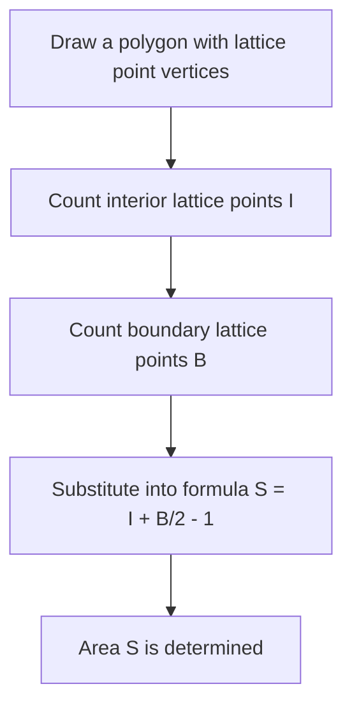
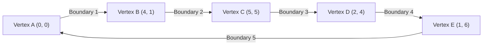

## 1. Introduction

In the field of geometry in mathematics, the theme of finding the area of a shape has been studied by many mathematicians since ancient Greek times. In school classes, we learn various approaches, starting from the basic formula for the area of a triangle, "base $\times$ height $\div 2$", to area formulas using trigonometric ratios in high school mathematics, Sarrus' rule using the cross product of vectors on a coordinate plane, and even Heron's formula, which derives the area solely from the lengths of the three sides.

However, if all the vertices of a polygon lie on **lattice points** (points where both the $x$ and $y$ coordinates are integers), there is a magical formula that allows you to calculate the area using only extremely simple arithmetic operations, without measuring lengths or performing complex multiplications or square root calculations. That is **[Pick's Theorem](https://kenji.blog/en/p/picks-theorem/)**, which we will explain in detail this time.

Pick's theorem is not just a "convenient and mysterious formula for easily finding area", but it has a very deep background that connects to topology, graph theory, and algebraic geometry in modern mathematics. In this article, we will delve deeply into Pick's theorem from multiple angles, from how to use it basically, to the mathematical proof of why such a simple formula holds, its historical background, and even the limitations of the theorem and the possibility of its extension to 3D.

## 2. Georg Alexander Pick and Historical Background

Before fully explaining Pick's theorem, let's briefly touch upon the person who discovered this beautiful theorem and his historical background.

This theorem was published in 1899 by the Austrian-born mathematician **Georg Alexander Pick (1859-1942)**. He studied mathematics at the University of Vienna and later served as a professor for many years at the German University of Prague (now Charles University in Prague).

Interestingly, Pick had a deep connection with the famous Albert Einstein. When Einstein took up a position at the university in Prague in 1911, Pick warmly welcomed him, and they built a close friendship, not only engaging in academic discussions but also playing the violin together. It is said that Pick was one of the people who strongly recommended Einstein to study "tensor analysis" and "[Riemann](https://kenji.blog/en/p/riemann/)ian geometry", which became essential for constructing the general theory of relativity.

However, Pick's later years were very tragic. Being of Jewish descent, he faced persecution with the rise of Nazi Germany. In 1942, he was sent to the Theresienstadt concentration camp, where he passed away just two weeks later at the age of 82. Although his life met a sad end, "Pick's theorem," which he left behind, continues to be loved in mathematics education around the world today because of its beauty and simplicity.

## 3. What is [Pick's Theorem](https://kenji.blog/en/p/picks-theorem/)?

Now, let's get to the core of Pick's theorem. The claim of the theorem is surprisingly simple and can be understood even by elementary school students.

Suppose there are lattice points (like the intersections on graph paper) lined up vertically and horizontally at equal intervals on a plane. Suppose we connect some of these lattice points with straight lines to draw a "hole-less polygon without self-intersection (simple polygon)". At this time, the area $S$ of the drawn polygon is completely determined only by the **number of lattice points inside** the polygon and the **number of lattice points on the boundary line**, which is what the theorem states.

Expressed as a mathematical formula, it is as follows:

$$
S = I + \frac{B}{2} - 1
$$

- $S$ : Area of the polygon
- $I$ (Interior) : **Number of lattice points inside** the polygon
- $B$ (Boundary) : **Number of lattice points on the boundary line** of the polygon (of course, the vertices themselves are included in this)

The most surprising point of this formula is the fact that no matter how complex the shape of the polygon is (for example, a jagged star shape or an extremely elongated shape), as long as the vertices are on lattice points and there are no self-intersections or holes, it **always holds without exception**. It has a mysterious appeal that seems counterintuitive in that there is no need to consider the angles of the shape or the lengths of the sides at all.

The flowchart below visually shows the procedure for finding the area using Pick's theorem.



## 4. Confirming the Power of the Theorem with Examples

It might be hard to get a real sense just by looking at the formula. Let's actually check with a few specific shapes if Pick's theorem can really derive the correct area.

### Example 1: A Simple Rectangle

As the most basic shape, let's consider a rectangle whose vertices are at $(0, 0), (5, 0), (5, 3), (0, 3)$.

- **Area calculation using a general method** : Since the width is $5$ and the height is $3$, the area is $5 \times 3 = 15$.
- **Number of interior lattice points $I$** : The points inside the rectangle are combinations where the $x$ coordinate is $1, 2, 3, 4$ and the $y$ coordinate is $1, 2$. Therefore, there are $4 \times 2 = 8$ points inside ( $I = 8$ ).
- **Number of boundary lattice points $B$** : There are $6$ points on the bottom edge (including both ends) and $6$ points on the top edge. On the left and right edges, excluding the four corner vertices, there are $2$ points each. Adding them up, there are $6 + 6 + 2 + 2 = 16$ points ( $B = 16$ ).

Let's apply this to Pick's theorem formula.

$$
S = 8 + \frac{16}{2} - 1 = 8 + 8 - 1 = 15
$$

It perfectly matched the usual calculation result of $15$.

### Example 2: Right Triangle

Next, let's try a right triangle that includes a diagonal approach. This is a right triangle with vertices at $(0, 0), (6, 0), (0, 4)$.

- **Area calculation using a general method** : Since the base is $6$ and the height is $4$, the area is $\frac{6 \times 4}{2} = 12$.
- **Number of interior lattice points $I$** : If you draw a diagram and carefully count them, there are a total of $7$ lattice points inside the triangle, such as $(1, 1), (1, 2), (2, 1), (2, 2), (3, 1), (4, 1)$ ( $I = 7$ ).
- **Number of boundary lattice points $B$** : There are $7$ points on the base (from $(0,0)$ to $(6,0)$), and $5$ points on the height edge (from $(0,0)$ to $(0,4)$). The hypotenuse is the line segment connecting points $(0, 4)$ and $(6, 0)$. The lattice points on this line segment pass through a lattice point like $(3, 2)$ because $y$ decreases by $2$ every time $x$ increases by $3$. If we carefully count them avoiding duplication at the four corners, there are a total of $12$ points on the boundary line ( $B = 12$ ).

Applying to the formula,

$$
S = 7 + \frac{12}{2} - 1 = 7 + 6 - 1 = 12
$$

Again, it matches exactly.

### Example 3: Complex Polygon with Dents

Pick's theorem shows its power even with more complex polygons with dents.



In the case of such a complex shape, conventional calculation methods require very tedious work, such as dividing the shape into multiple triangles and rectangles, or subtracting the area of excess parts from a large rectangle that completely encloses the entire shape. Calculation mistakes are also likely to occur.

However, if you use Pick's theorem, you can instantly calculate the exact area just by counting the points inside the shape and counting the points on the boundary line. This can truly be said to be phenomenal.

## 5. Proof Using Euler's Polyhedral Formula

Why does such a magical formula hold? There are several ways to prove Pick's theorem, but here we will introduce an elegant proof idea using a famous theorem in graph theory, **Euler's Polyhedral Formula**.

According to Euler's theorem, for a connected graph (network) drawn on a plane, if the number of vertices is $V$, the number of edges is $E$, and the number of faces is $F$, the following relational expression holds:

$$
V - E + F = 2
$$

(In this $F$, the infinitely large region spreading outside the graph is also counted as one face.)

### Dividing the Polygon into Triangles

First, consider the target polygon $P$ whose area you want to find. Taking all the lattice points inside and on the boundary of this polygon as vertices, and connecting the lattice points to each other, we divide (triangulate) the inside of polygon $P$ so that it is completely filled with small "primitive triangles".
A primitive triangle is a triangle that does not contain any lattice points other than its vertices, either inside or on the edges on its boundary. The area of such primitive triangles is, without exception, all $\frac{1}{2}$.

We consider the mesh pattern created by this division as a single planar graph. For this graph, we define the following symbols:
- $I$ : Number of lattice points inside the polygon
- $B$ : Number of lattice points on the polygon boundary
- $V$ : Total number of vertices in the graph. Obviously $V = I + B$.
- $E$ : Total number of edges in the graph.
- $f$ : Number of primitive triangle faces formed inside the polygon.
- Since we include the outside face ($1$ face), the total number of faces in Euler's theorem is $F = f + 1$.

Applying Euler's formula to this graph, we get
$$
(I + B) - E + (f + 1) = 2
$$
That is,
$$
I + B - E + f = 1 \quad \text{--- (Equation 1)}
$$

### Focusing on the Sum of Interior Angles

Next, we calculate the sum of the interior angles of all the triangles in the graph in $2$ different ways and create an equation.

**Method 1: Calculate from the number of triangles**
The polygon $P$ is divided into $f$ primitive triangles. The sum of the interior angles of one triangle is $180^\circ$ ( $\pi$ radians). Therefore, the total sum of the interior angles of all primitive triangles is $f \times \pi$.

**Method 2: Calculate from the angles around the vertices**
We recount the sum of interior angles as the sum of angles gathering at each vertex.
- **Interior lattice points ($I$ points)** : Around each point, angles worth a full $360^\circ$ ( $2\pi$ radians) are gathered. Thus the total is $2\pi \times I$.
- **Boundary lattice points ($B$ points)** : What is the sum of the inner angles of the polygon at the points on the boundary? The sum of interior angles of an arbitrary $n$-gon is $(n - 2) \times \pi$. Here, since there are $B$ points on the boundary, this can be considered a $B$-gon, and the sum of its interior angles is $(B - 2) \times \pi$.

Since the total sum of angles found by these two methods must be equal, the following equation holds.

$$
f \times \pi = 2\pi \times I + (B - 2) \times \pi
$$

Dividing both sides by $\pi$, we obtain a very simple equation.

$$
f = 2I + B - 2 \quad \text{--- (Equation 2)}
$$

### Calculation of Area

As stated at the beginning, the area of all $f$ primitive triangles is $\frac{1}{2}$. Therefore, the total area $S$ of the polygon is the sum of the areas of the primitive triangles, and can be expressed as follows:

$$
S = \frac{f}{2}
$$

Substituting the previously found (Equation 2) into this, we get

$$
S = \frac{2I + B - 2}{2} = I + \frac{B}{2} - 1
$$

Pick's theorem is brilliantly derived! Euler's theorem, the foundation of topology, and the sum of interior angles, the foundation of geometry, perfectly fuse to prove this beautiful formula.

## 6. Application to Polygons with Holes

Pick's theorem assumes a "hole-less simple polygon", but what happens if there is a hole in the polygon?

For example, imagine a shape like a donut, where an inner polygon (hole) completely contained within the outer polygon is hollowed out. For such shapes, Pick's formula does not hold as it is. However, it is possible to find the area by correcting the theorem according to the number of holes.

If there are $h$ independent holes inside the polygon, the formula for the generalized Pick's theorem is as follows:

$$
S = I + \frac{B}{2} - 1 + h
$$

Here, $I$ counts only the lattice points inside the polygon (the solid part excluding the hole parts). Also, $B$ represents the sum of not only the lattice points on the outer boundary line but also all the lattice points on the inner boundary line of the holes.

The property that $+1$ is added to the end of the formula every time a hole increases is deeply related to the Euler characteristic in geometry, and has a very important meaning in the continuous deformation of space (topology).

## 7. Extension to 3D and Ehrhart Polynomials

If such a beautiful and powerful formula exists on a plane (2D), it is extremely natural as a mathematician to think, "Isn't there a formula that can calculate the volume of a 3D solid figure (polyhedron) only from the number of lattice points inside and on the surface?"

However, surprisingly, it has been proven that **a direct extension of Pick's theorem does not exist in 3-dimensional space**. In other words, it is impossible to create a mathematical formula that uniquely determines the volume only from the number of internal lattice points and the number of surface lattice points.

### Counterexample: Reeve tetrahedron

The proof of this impossibility was a counterexample called the "Reeve tetrahedron" presented by British mathematician John Reeve in 1957.
Reeve considered a tetrahedron (triangular pyramid) having the following 4 vertices:

- Vertex 1: $(0, 0, 0)$
- Vertex 2: $(1, 0, 0)$
- Vertex 3: $(0, 1, 0)$
- Vertex 4: $(1, 1, r)$ (where $r$ is an arbitrary positive integer)

When investigating this tetrahedron, the number of lattice points inside is always $0$. Also, there are absolutely no lattice points on the surface except for the 4 points that are the vertices. That is, whether $r$ is $1$, $100$, or $10000$, the total number of lattice points contained in this tetrahedron is always constantly "$4$ points".

However, the volume of this tetrahedron calculates to $\frac{r}{6}$.
This means that even if the number of lattice points is exactly the same, it is possible to make the volume infinitely large by changing the value of $r$. Therefore, it was proved that it is theoretically impossible to calculate backward the "volume" only from the information of the "number of lattice points".

### Sublimation to Ehrhart Polynomials

Although Pick's theorem could not be directly extended to 3D, this problem by no means ended here. French mathematician Eugène Ehrhart established a new theory by changing his approach.

He studied "how the number of lattice points contained in a figure changes when the size of the figure is enlarged by an integer factor $t$". When $L(P, t)$ is the number of lattice points contained in a figure $tP$ obtained by expanding a $d$-dimensional polyhedron $P$ whose vertices are on lattice points by $t$ times, Ehrhart proved that this $L(P, t)$ becomes a $d$-degree polynomial for $t$. This is the **Ehrhart polynomial**.

The Ehrhart polynomial in the 2-dimensional case is exactly the generalized form of Pick's theorem itself, and it is actively studied in modern algebraic geometry and combinatorics as an extremely important tool to unravel the relationship between lattice points and volume in high-dimensional spaces of 3 dimensions and above.

## 8. Implementation by Program

Let's implement a simple program in Python that calculates the area using Pick's theorem. Actually, when given the vertex coordinates of a polygon, it is necessary to count the boundary lattice points $B$ and interior lattice points $I$.

The number of lattice points on the line segments on the boundary can be found using the **greatest common divisor (GCD)** of the absolute value of the difference in the $x$ coordinates and the absolute value of the difference in the $y$ coordinates of the two ends of the line segment.

```python
import math

def get_boundary_points(polygon):
    """
    Receives a list of vertex coordinates of a polygon and returns the number of boundary lattice points B.
    polygon: [(x1, y1), (x2, y2), ..., (xn, yn)]
    """
    B = 0
    n = len(polygon)
    for i in range(n):
        x1, y1 = polygon[i]
        x2, y2 = polygon[(i + 1) % n]  # Next vertex (loops back to the first at the end)
        
        # The number of lattice points on the segment is equal to the greatest common divisor of dx and dy (including one of the endpoints)
        dx = abs(x1 - x2)
        dy = abs(y1 - y2)
        B += math.gcd(dx, dy)
        
    return B

# To find the area, you need to calculate the total area separately using cross product etc.,
# or naively count I.
# Here, as an example, we show a function that calculates the area by specifying I and B directly.

def picks_theorem(I, B):
    """
    Calculates area S from interior lattice points I and boundary lattice points B
    """
    return I + B / 2.0 - 1.0

# Execution example
interior_points = 7
boundary_points = 12
area = picks_theorem(interior_points, boundary_points)
print(f"Interior points: {interior_points}, Boundary points: {boundary_points}")
print(f"Calculated area: {area}")
```

In this way, even when breaking it down as an algorithm, the formula of Pick's theorem itself is expressed as an extremely simple calculation formula.

## 9. Conclusion

Pick's theorem is a beautiful mathematical theorem with the following amazing features:

1. **Extremely simple formula** : The area can be found with an equation consisting only of addition and division, $S = I + \frac{B}{2} - 1$.
2. **No need to measure length** : A ruler's scale or a protractor to measure angles is absolutely unnecessary, and the area is determined just by the primitive act of "counting points".
3. **Deep mathematical background** : It can be derived from Euler's theorem, and also serves as an entrance to advanced modern mathematics called Ehrhart polynomials.

When you draw a polygon on graph paper or a dot notebook, please remember this theorem and try calculating the area by actually counting the points. The moment when "lattice points" and "area", which seem unrelated at first glance, are beautifully connected will vividly present to us the puzzle-like fun and depth that the study of mathematics has.
