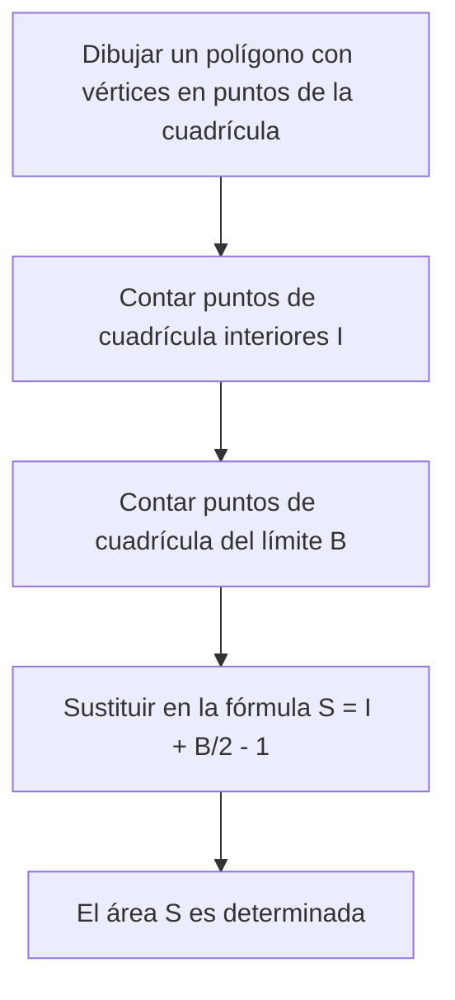
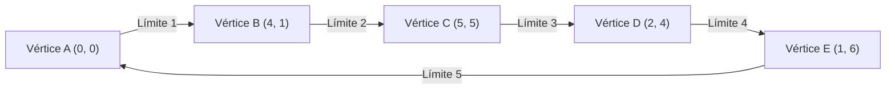

## 1. Introducción

En el campo de la geometría matemática, el tema de encontrar el área de una figura ha sido estudiado por muchos matemáticos desde la época de la antigua Grecia. En las clases escolares, aprendemos varios enfoques, comenzando desde la fórmula básica para el área de un triángulo, "base $\times$ altura $\div 2$", hasta las fórmulas de área utilizando razones trigonométricas en matemáticas de la escuela secundaria, la regla de Sarrus usando el producto cruz de vectores en un plano coordenado, e incluso la fórmula de Herón, que deriva el área basándose únicamente en las longitudes de los tres lados.

Sin embargo, si todos los vértices de un polígono se encuentran en **puntos de una cuadrícula** (puntos donde las coordenadas $x$ e $y$ son ambas números enteros), existe una fórmula mágica que le permite calcular el área utilizando solo operaciones aritméticas extremadamente simples, sin medir longitudes ni realizar multiplicaciones complejas o cálculos de raíces cuadradas. Ese es el **[Teorema de Pick](https://kenji.blog/es/p/picks-theorem/)**, que explicaremos en detalle esta vez.

El teorema de Pick no es solo una "fórmula conveniente y misteriosa para encontrar el área fácilmente", sino que tiene un trasfondo muy profundo que se conecta con la topología, la teoría de grafos y la geometría algebraica en las matemáticas modernas. En este artículo, profundizaremos en el teorema de Pick desde múltiples ángulos, desde cómo usarlo de manera básica, hasta la demostración matemática de por qué se cumple una fórmula tan simple, sus antecedentes históricos e incluso las limitaciones del teorema y la posibilidad de su extensión a 3D.

## 2. Georg Alexander Pick y los Antecedentes Históricos

Antes de explicar completamente el teorema de Pick, toquemos brevemente sobre la persona que descubrió este hermoso teorema y su contexto histórico.

Este teorema fue publicado en 1899 por el matemático de origen austríaco **Georg Alexander Pick (1859-1942)**. Estudió matemáticas en la Universidad de Viena y luego se desempeñó como profesor durante muchos años en la Universidad Alemana de Praga (ahora Universidad Carolina en Praga).

Curiosamente, Pick tenía una profunda conexión con el famoso Albert Einstein. Cuando Einstein asumió un puesto en la universidad en Praga en 1911, Pick le dio una cálida bienvenida y construyeron una estrecha amistad, no solo participando en discusiones académicas sino también tocando el violín juntos. Se dice que Pick fue una de las personas que recomendó encarecidamente a Einstein estudiar el "análisis tensorial" y la "geometría de Riemann", que se volvieron esenciales para la construcción de la teoría de la relatividad general.

Sin embargo, los últimos años de Pick fueron muy trágicos. Al ser de ascendencia judía, se enfrentó a la persecución con el surgimiento de la Alemania nazi. En 1942, fue enviado al campo de concentración de Theresienstadt, donde falleció solo dos semanas después a la edad de 82 años. Aunque su vida tuvo un triste final, el "[Teorema de Pick](https://kenji.blog/es/p/picks-theorem/)" que dejó atrás continúa siendo amado en la educación matemática en todo el mundo actual debido a su belleza y simplicidad.

## 3. ¿Qué es el [Teorema de Pick](https://kenji.blog/es/p/picks-theorem/)?

Ahora, vayamos al núcleo del teorema de Pick. La afirmación del teorema es sorprendentemente simple y puede ser comprendida incluso por estudiantes de escuela primaria.

Supongamos que hay puntos de una cuadrícula (como las intersecciones en papel cuadriculado) alineados vertical y horizontalmente a intervalos iguales en un plano. Supongamos que conectamos algunos de estos puntos de la cuadrícula con líneas rectas para dibujar un "polígono sin agujeros y sin autointersecciones (polígono simple)". En este momento, el área $S$ del polígono dibujado está completamente determinada solo por el **número de puntos de la cuadrícula en el interior** del polígono y el **número de puntos de la cuadrícula en la línea límite**, que es lo que afirma el teorema.

Expresado como una fórmula matemática, es de la siguiente manera:

$$
S = I + \frac{B}{2} - 1
$$

- $S$ : Área del polígono
- $I$ (Interior) : **Número de puntos de la cuadrícula en el interior** del polígono
- $B$ (Boundary, Límite) : **Número de puntos de la cuadrícula en la línea límite** del polígono (por supuesto, los vértices mismos están incluidos en esto)

El punto más sorprendente de esta fórmula es el hecho de que no importa cuán compleja sea la forma del polígono (por ejemplo, una forma de estrella irregular o una forma extremadamente alargada), siempre y cuando los vértices estén en los puntos de la cuadrícula y no haya autointersecciones o agujeros, **siempre se cumple sin excepción**. Tiene un atractivo misterioso que parece contradecir la intuición en el sentido de que no hay necesidad de considerar los ángulos de la forma o las longitudes de los lados en absoluto.

El diagrama de flujo a continuación muestra visualmente el procedimiento para encontrar el área usando el teorema de Pick.



## 4. Confirmar el Poder del Teorema con Ejemplos

Puede que sea difícil tener una idea real con solo mirar la fórmula. Comprobemos de hecho con algunas formas específicas si el teorema de Pick realmente puede derivar el área correcta.

### Ejemplo 1: Un Rectángulo Simple

Como la forma más básica, consideremos un rectángulo cuyos vértices se encuentran en $(0, 0), (5, 0), (5, 3), (0, 3)$.

- **Cálculo de área usando un método general** : Como el ancho es $5$ y la altura es $3$, el área es $5 \times 3 = 15$.
- **Número de puntos de la cuadrícula interiores $I$** : Los puntos dentro del rectángulo son combinaciones donde la coordenada $x$ es $1, 2, 3, 4$ y la coordenada $y$ es $1, 2$. Por lo tanto, hay $4 \times 2 = 8$ puntos en el interior ( $I = 8$ ).
- **Número de puntos de la cuadrícula del límite $B$** : Hay $6$ puntos en el borde inferior (incluidos ambos extremos) y $6$ puntos en el borde superior. En los bordes izquierdo y derecho, excluyendo los cuatro vértices de las esquinas, hay $2$ puntos cada uno. Sumándolos, hay $6 + 6 + 2 + 2 = 16$ puntos ( $B = 16$ ).

Apliquemos esto a la fórmula del teorema de Pick.

$$
S = 8 + \frac{16}{2} - 1 = 8 + 8 - 1 = 15
$$

Coincidió perfectamente con el resultado del cálculo habitual de $15$.

### Ejemplo 2: Triángulo Rectángulo

A continuación, intentemos con un triángulo rectángulo que incluye un enfoque diagonal. Este es un triángulo rectángulo con vértices en $(0, 0), (6, 0), (0, 4)$.

- **Cálculo del área usando un método general** : Como la base es $6$ y la altura es $4$, el área es $\frac{6 \times 4}{2} = 12$.
- **Número de puntos de la cuadrícula interiores $I$** : Si dibuja un diagrama y los cuenta con cuidado, hay un total de $7$ puntos de cuadrícula dentro del triángulo, como $(1, 1), (1, 2), (2, 1), (2, 2), (3, 1), (4, 1)$ ( $I = 7$ ).
- **Número de puntos de la cuadrícula del límite $B$** : Hay $7$ puntos en la base (de $(0,0)$ a $(6,0)$), y $5$ puntos en el borde de altura (de $(0,0)$ a $(0,4)$). La hipotenusa es el segmento de línea que conecta los puntos $(0, 4)$ y $(6, 0)$. Los puntos de la cuadrícula en este segmento de línea pasan a través de un punto de la cuadrícula como $(3, 2)$ porque $y$ disminuye en $2$ cada vez que $x$ aumenta en $3$. Si los contamos cuidadosamente evitando la duplicación en las cuatro esquinas, hay un total de $12$ puntos en la línea límite ( $B = 12$ ).

Aplicando a la fórmula,

$$
S = 7 + \frac{12}{2} - 1 = 7 + 6 - 1 = 12
$$

Una vez más, coincide exactamente.

### Ejemplo 3: Polígono Complejo con Hendiduras

El teorema de Pick muestra su poder incluso con polígonos más complejos con hendiduras.



En el caso de una forma tan compleja, los métodos de cálculo convencionales requieren un trabajo muy tedioso, como dividir la forma en múltiples triángulos y rectángulos, o restar el área de partes en exceso de un gran rectángulo que encierra por completo toda la forma. También es probable que ocurran errores de cálculo.

Sin embargo, si usa el teorema de Pick, puede calcular el área exacta al instante solo contando los puntos dentro de la forma y contando los puntos en la línea límite. Esto realmente se puede decir que es fenomenal.

## 5. Demostración Usando la Fórmula Poliédrica de Euler

¿Por qué se cumple una fórmula tan mágica? Existen varias formas de probar el teorema de Pick, pero aquí presentaremos una idea de demostración elegante usando un famoso teorema en la teoría de grafos, la **Fórmula Poliédrica de Euler**.

Según el teorema de Euler, para un grafo conexo (red) dibujado en un plano, si el número de vértices es $V$, el número de aristas es $E$ y el número de caras es $F$, se cumple la siguiente relación:

$$
V - E + F = 2
$$

(En esta $F$, la región infinitamente grande que se extiende fuera del grafo también se cuenta como una cara).

### Dividir el Polígono en Triángulos

Primero, considere el polígono objetivo $P$ cuya área desea encontrar. Tomando todos los puntos de la cuadrícula en el interior y en el límite de este polígono como vértices, y conectando los puntos de la cuadrícula entre sí, dividimos (triangulamos) el interior del polígono $P$ de modo que se llene por completo con pequeños "triángulos primitivos".
Un triángulo primitivo es un triángulo que no contiene ningún punto de cuadrícula aparte de sus vértices, ni en el interior ni en las aristas de su límite. El área de tales triángulos primitivos es, sin excepción, todas de $\frac{1}{2}$.

Consideramos el patrón de malla creado por esta división como un solo grafo plano. Para este grafo, definimos los siguientes símbolos:
- $I$ : Número de puntos de la cuadrícula en el interior del polígono
- $B$ : Número de puntos de la cuadrícula en el límite del polígono
- $V$ : Número total de vértices en el grafo. Obviamente $V = I + B$.
- $E$ : Número total de aristas en el grafo.
- $f$ : Número de caras de triángulos primitivos formadas dentro del polígono.
- Como incluimos la cara exterior ($1$ cara), el número total de caras en el teorema de Euler es $F = f + 1$.

Aplicando la fórmula de Euler a este grafo, obtenemos
$$
(I + B) - E + (f + 1) = 2
$$
Es decir,
$$
I + B - E + f = 1 \quad \text{--- (Ecuación 1)}
$$

### Centrándose en la Suma de los Ángulos Interiores

A continuación, calculamos la suma de los ángulos interiores de todos los triángulos del grafo de $2$ formas diferentes y creamos una ecuación.

**Método 1: Calcular a partir de la cantidad de triángulos**
El polígono $P$ se divide en $f$ triángulos primitivos. La suma de los ángulos interiores de un triángulo es de $180^\circ$ ( $\pi$ radianes). Por tanto, la suma total de los ángulos interiores de todos los triángulos primitivos es $f \times \pi$.

**Método 2: Calcular a partir de los ángulos alrededor de los vértices**
Volvemos a contar la suma de los ángulos interiores como la suma de los ángulos que se juntan en cada vértice.
- **Puntos de cuadrícula interiores ($I$ puntos)** : Alrededor de cada punto, se reúnen ángulos por un total de $360^\circ$ ( $2\pi$ radianes). Por lo tanto, el total es $2\pi \times I$.
- **Puntos de cuadrícula del límite ($B$ puntos)** : ¿Cuál es la suma de los ángulos interiores del polígono en los puntos del límite? La suma de los ángulos interiores de un $n$-ágono arbitrario es $(n - 2) \times \pi$. Aquí, dado que hay $B$ puntos en el límite, se puede considerar un $B$-ágono, y la suma de sus ángulos interiores es $(B - 2) \times \pi$.

Como la suma total de ángulos hallada por estos dos métodos debe ser igual, se cumple la siguiente ecuación.

$$
f \times \pi = 2\pi \times I + (B - 2) \times \pi
$$

Dividiendo ambos lados por $\pi$, obtenemos una ecuación muy simple.

$$
f = 2I + B - 2 \quad \text{--- (Ecuación 2)}
$$

### Cálculo del Área

Como se indicó al principio, el área de todos los $f$ triángulos primitivos es $\frac{1}{2}$. Por tanto, el área total $S$ del polígono es la suma de las áreas de los triángulos primitivos, y se puede expresar de la siguiente manera:

$$
S = \frac{f}{2}
$$

Sustituyendo la (Ecuación 2) encontrada previamente en esto, obtenemos

$$
S = \frac{2I + B - 2}{2} = I + \frac{B}{2} - 1
$$

¡El teorema de Pick se deriva brillantemente! El teorema de Euler, la base de la topología, y la suma de los ángulos interiores, la base de la geometría, se fusionan a la perfección para probar esta hermosa fórmula.

## 6. Aplicación a Polígonos con Agujeros

El teorema de Pick asume un "polígono simple sin agujeros", pero ¿qué pasa si hay un agujero en el polígono?

Por ejemplo, imagine una forma como una dona, en donde un polígono interior (agujero) completamente contenido dentro del polígono exterior está ahuecado. Para tales formas, la fórmula de Pick no se cumple tal como está. Sin embargo, es posible encontrar el área corrigiendo el teorema según el número de agujeros.

Si hay $h$ agujeros independientes dentro del polígono, la fórmula del teorema de Pick generalizado es la siguiente:

$$
S = I + \frac{B}{2} - 1 + h
$$

Aquí, $I$ cuenta solo los puntos de la cuadrícula dentro del polígono (la parte sólida excluyendo las partes del agujero). Además, $B$ representa la suma de no solo los puntos de la cuadrícula en la línea límite exterior sino también todos los puntos de la cuadrícula en la línea límite interior de los agujeros.

La propiedad de que se agrega $+1$ al final de la fórmula cada vez que aumenta un agujero está profundamente relacionada con la característica de Euler en geometría, y tiene un significado muy importante en la deformación continua del espacio (topología).

## 7. Extensión a 3D y Polinomios de Ehrhart

Si tal fórmula hermosa y poderosa existe en un plano (2D), es sumamente natural para un matemático pensar, "¿No existe una fórmula que pueda calcular el volumen de una figura sólida en 3D (poliedro) solo a partir del número de puntos de cuadrícula en el interior y en la superficie?".

Sin embargo, sorprendentemente, se ha demostrado que **una extensión directa del teorema de Pick no existe en el espacio tridimensional**. En otras palabras, es imposible crear una fórmula matemática que determine de manera única el volumen solo a partir del número de puntos de cuadrícula internos y el número de puntos de cuadrícula superficiales.

### Contraejemplo: Tetraedro de Reeve

La demostración de esta imposibilidad fue un contraejemplo llamado el "Tetraedro de Reeve" presentado por el matemático británico John Reeve en 1957.
Reeve consideró un tetraedro (pirámide triangular) que tiene los siguientes 4 vértices:

- Vértice 1: $(0, 0, 0)$
- Vértice 2: $(1, 0, 0)$
- Vértice 3: $(0, 1, 0)$
- Vértice 4: $(1, 1, r)$ (donde $r$ es un número entero positivo arbitrario)

Al investigar este tetraedro, el número de puntos de la cuadrícula en el interior siempre es $0$. Además, no hay en absoluto puntos de cuadrícula en la superficie excepto los 4 puntos que son los vértices. Es decir, sea $r$ $1$, $100$ o $10000$, el número total de puntos de cuadrícula contenidos en este tetraedro es siempre y constantemente de "$4$ puntos".

Sin embargo, el volumen de este tetraedro se calcula como $\frac{r}{6}$.
Esto significa que incluso si el número de puntos de la cuadrícula es exactamente el mismo, es posible hacer el volumen infinitamente grande cambiando el valor de $r$. Por lo tanto, se comprobó que es teóricamente imposible calcular retrospectivamente el "volumen" solo a partir de la información del "número de puntos de la cuadrícula".

### Sublimación a Polinomios de Ehrhart

Aunque el teorema de Pick no pudo extenderse directamente a 3D, este problema de ninguna manera terminó aquí. El matemático francés Eugène Ehrhart estableció una nueva teoría al cambiar su enfoque.

Estudió "cómo el número de puntos de la cuadrícula contenidos en una figura cambia cuando el tamaño de la figura se amplía en un factor entero $t$". Cuando $L(P, t)$ es el número de puntos de la cuadrícula contenidos en una figura $tP$ obtenida al expandir un poliedro de $d$-dimensiones $P$ cuyos vértices se encuentran en puntos de la cuadrícula en $t$ veces, Ehrhart demostró que este $L(P, t)$ se convierte en un polinomio de grado $d$ para $t$. Este es el **polinomio de Ehrhart**.

El polinomio de Ehrhart en el caso bidimensional es exactamente la forma generalizada del teorema de Pick en sí mismo, y se estudia activamente en la geometría algebraica moderna y la combinatoria como una herramienta extremadamente importante para desentrañar la relación entre los puntos de la cuadrícula y el volumen en espacios de alta dimensión de 3 dimensiones y superiores.

## 8. Implementación Mediante Programa

Implementemos un programa simple en Python que calcula el área usando el teorema de Pick. En realidad, cuando se dan las coordenadas de los vértices de un polígono, es necesario contar los puntos de la cuadrícula del límite $B$ y los puntos de la cuadrícula interiores $I$.

El número de puntos de la cuadrícula en los segmentos de línea en el límite se puede encontrar usando el **máximo común divisor (MCD)** del valor absoluto de la diferencia en las coordenadas $x$ y el valor absoluto de la diferencia en las coordenadas $y$ de los dos extremos del segmento de línea.

```python
import math

def get_boundary_points(polygon):
    """
    Recibe una lista de coordenadas de vértices de un polígono y devuelve el número de puntos de cuadrícula límite B.
    polygon: [(x1, y1), (x2, y2), ..., (xn, yn)]
    """
    B = 0
    n = len(polygon)
    for i in range(n):
        x1, y1 = polygon[i]
        x2, y2 = polygon[(i + 1) % n]  # Próximo vértice (vuelve al primero al final)
        
        # El número de puntos de cuadrícula en el segmento es igual al máximo común divisor de dx y dy (incluyendo uno de los extremos)
        dx = abs(x1 - x2)
        dy = abs(y1 - y2)
        B += math.gcd(dx, dy)
        
    return B

# Para encontrar el área, es necesario calcular el área total por separado usando producto vectorial etc.,
# o ingenuamente contar I.
# Aquí, como un ejemplo, mostramos una función que calcula el área al especificar I y B directamente.

def picks_theorem(I, B):
    """
    Calcula el área S a partir de los puntos de cuadrícula interiores I y los puntos de cuadrícula límite B
    """
    return I + B / 2.0 - 1.0

# Ejemplo de ejecución
interior_points = 7
boundary_points = 12
area = picks_theorem(interior_points, boundary_points)
print(f"Puntos interiores: {interior_points}, Puntos límite: {boundary_points}")
print(f"Área calculada: {area}")
```

De esta manera, incluso al desglosarlo como un algoritmo, la fórmula del teorema de Pick en sí se expresa como una fórmula de cálculo extremadamente simple.

## 9. Conclusión

El teorema de Pick es un hermoso teorema matemático con las siguientes características asombrosas:

1. **Fórmula extremadamente simple** : El área se puede encontrar con una ecuación que consta solo de suma y división, $S = I + \frac{B}{2} - 1$.
2. **No hay necesidad de medir longitud** : Una regla o un transportador para medir ángulos es absolutamente innecesario, y el área se determina solo por el acto primitivo de "contar puntos".
3. **Profundo trasfondo matemático** : Se puede derivar del teorema de Euler, y también sirve como una entrada a matemáticas modernas avanzadas llamadas polinomios de Ehrhart.

Cuando dibuje un polígono en papel cuadriculado o en un cuaderno de puntos, recuerde este teorema e intente calcular el área contando de hecho los puntos. El momento en que los "puntos de la cuadrícula" y el "área", que parecen no tener relación a primera vista, se conectan maravillosamente nos presentará de manera vívida la diversión estilo rompecabezas y la profundidad que tiene el estudio de las matemáticas.
