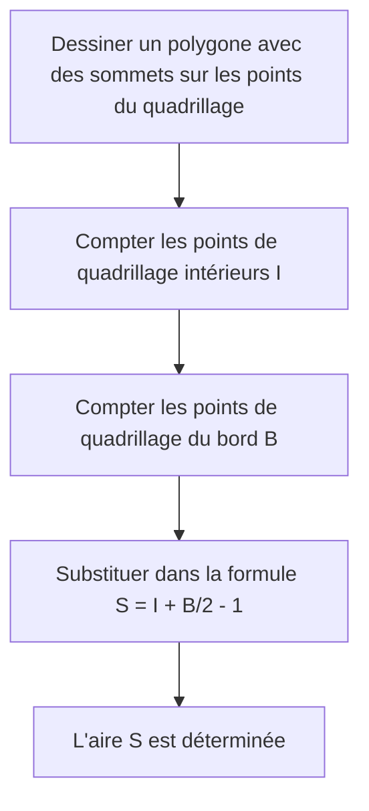

## 1. Introduction

Dans le domaine de la géométrie en mathématiques, le thème du calcul de l'aire d'une figure a été étudié par de nombreux mathématiciens depuis l'époque de la Grèce antique. Dans les cours d'école, nous apprenons diverses approches, en commençant par la formule de base pour l'aire d'un triangle, "base $\times$ hauteur $\div 2$", jusqu'aux formules d'aire utilisant les rapports trigonométriques au lycée, la règle de Sarrus utilisant le produit vectoriel dans un plan de coordonnées, et même la formule de Héron, qui dérive l'aire uniquement à partir des longueurs des trois côtés.

Cependant, si tous les sommets d'un polygone se trouvent sur des **points d'un quadrillage** (points où les coordonnées $x$ et $y$ sont toutes deux des nombres entiers), il existe une formule magique qui vous permet de calculer l'aire en utilisant uniquement des opérations arithmétiques extrêmement simples, sans mesurer de longueurs ni effectuer de multiplications complexes ou de calculs de racine carrée. C'est le **[Théorème de Pick](https://kenji.blog/fr/p/picks-theorem/)**, que nous allons expliquer en détail cette fois.

Le théorème de Pick n'est pas seulement une "formule pratique et mystérieuse pour trouver facilement l'aire", mais il possède un arrière-plan très profond qui se connecte à la topologie, à la théorie des graphes et à la géométrie algébrique dans les mathématiques modernes. Dans cet article, nous approfondirons le théorème de Pick sous plusieurs angles, de la façon de l'utiliser de base à la démonstration mathématique de la raison pour laquelle une formule aussi simple s'applique, son contexte historique, et même les limites du théorème et la possibilité de son extension en 3D.

## 2. Georg Alexander Pick et Contexte Historique

Avant d'expliquer complètement le théorème de Pick, abordons brièvement la personne qui a découvert ce beau théorème et son contexte historique.

Ce théorème a été publié en 1899 par le mathématicien d'origine autrichienne **Georg Alexander Pick (1859-1942)**. Il a étudié les mathématiques à l'Université de Vienne et a ensuite été professeur pendant de nombreuses années à l'Université allemande de Prague (aujourd'hui l'Université Charles de Prague).

Fait intéressant, Pick avait un lien profond avec le célèbre Albert Einstein. Lorsqu'Einstein a pris un poste à l'université de Prague en 1911, Pick l'a chaleureusement accueilli et ils ont noué une amitié étroite, non seulement en participant à des discussions académiques, mais aussi en jouant du violon ensemble. On dit que Pick fut l'une des personnes qui a fortement recommandé à Einstein d'étudier "l'analyse tensorielle" et la "géométrie riemannienne", qui sont devenues essentielles pour la construction de la théorie de la relativité générale.

Cependant, les dernières années de Pick ont été très tragiques. Étant d'origine juive, il a été confronté à la persécution avec la montée de l'Allemagne nazie. En 1942, il est envoyé au camp de concentration de Theresienstadt, où il décède à peine deux semaines plus tard à l'âge de 82 ans. Bien que sa vie ait connu une triste fin, le "[Théorème de Pick](https://kenji.blog/fr/p/picks-theorem/)" qu'il a laissé derrière lui continue d'être apprécié dans l'enseignement des mathématiques du monde entier aujourd'hui en raison de sa beauté et de sa simplicité.

## 3. Qu'est-ce que le [Théorème de Pick](https://kenji.blog/fr/p/picks-theorem/) ?

Maintenant, allons au cœur du théorème de Pick. L'affirmation du théorème est étonnamment simple et peut être comprise même par des élèves du primaire.

Supposons qu'il y ait des points de quadrillage (comme les intersections sur du papier quadrillé) alignés verticalement et horizontalement à intervalles égaux sur un plan. Supposons que nous relions certains de ces points du quadrillage avec des lignes droites pour dessiner un "polygone sans trou et sans auto-intersection (polygone simple)". À ce moment, l'aire $S$ du polygone dessiné est complètement déterminée uniquement par le **nombre de points de quadrillage à l'intérieur** du polygone et le **nombre de points de quadrillage sur la ligne de bord**, ce que le théorème affirme.

Exprimé sous forme de formule mathématique, cela donne ce qui suit :

$$
S = I + \frac{B}{2} - 1
$$

- $S$ : Aire du polygone
- $I$ (Intérieur) : **Nombre de points de quadrillage à l'intérieur** du polygone
- $B$ (Bord, Boundary) : **Nombre de points de quadrillage sur la ligne de bord** du polygone (bien sûr, les sommets eux-mêmes y sont inclus)

Le point le plus surprenant de cette formule est le fait que, quelle que soit la complexité de la forme du polygone (par exemple, une forme d'étoile dentelée ou une forme extrêmement allongée), tant que les sommets se trouvent sur des points du quadrillage et qu'il n'y a pas d'auto-intersections ou de trous, elle **s'applique toujours sans exception**. Il a un attrait mystérieux qui semble contredire l'intuition en ce sens qu'il n'est absolument pas nécessaire de considérer les angles de la forme ou les longueurs des côtés.

L'organigramme ci-dessous montre visuellement la procédure pour trouver l'aire à l'aide du théorème de Pick.



## 4. Confirmer la Puissance du Théorème avec des Exemples

Il peut être difficile d'avoir une idée réelle en regardant simplement la formule. Vérifions réellement avec quelques formes spécifiques si le théorème de Pick peut vraiment dériver l'aire correcte.

### Exemple 1 : Un Rectangle Simple

Comme forme la plus basique, considérons un rectangle dont les sommets sont situés à $(0, 0), (5, 0), (5, 3), (0, 3)$.

- **Calcul de l'aire à l'aide d'une méthode générale** : Puisque la largeur est de $5$ et la hauteur est de $3$, l'aire est $5 \times 3 = 15$.
- **Nombre de points de quadrillage intérieurs $I$** : Les points à l'intérieur du rectangle sont des combinaisons où la coordonnée $x$ est $1, 2, 3, 4$ et la coordonnée $y$ est $1, 2$. Par conséquent, il y a $4 \times 2 = 8$ points à l'intérieur ( $I = 8$ ).
- **Nombre de points de quadrillage du bord $B$** : Il y a $6$ points sur le bord inférieur (y compris les deux extrémités) et $6$ points sur le bord supérieur. Sur les bords gauche et droit, à l'exclusion des quatre sommets des coins, il y a $2$ points chacun. En les additionnant, il y a $6 + 6 + 2 + 2 = 16$ points ( $B = 16$ ).

Appliquons cela à la formule du théorème de Pick.

$$
S = 8 + \frac{16}{2} - 1 = 8 + 8 - 1 = 15
$$

Cela correspond parfaitement au résultat du calcul habituel de $15$.

### Exemple 2 : Triangle Rectangle

Ensuite, essayons avec un triangle rectangle qui inclut une approche diagonale. Il s'agit d'un triangle rectangle dont les sommets sont $(0, 0), (6, 0), (0, 4)$.

- **Calcul de l'aire à l'aide d'une méthode générale** : La base étant de $6$ et la hauteur de $4$, l'aire est de $\frac{6 \times 4}{2} = 12$.
- **Nombre de points de quadrillage intérieurs $I$** : Si vous dessinez un diagramme et que vous les comptez soigneusement, il y a un total de $7$ points de quadrillage à l'intérieur du triangle, tels que $(1, 1), (1, 2), (2, 1), (2, 2), (3, 1), (4, 1)$ ( $I = 7$ ).
- **Nombre de points de quadrillage du bord $B$** : Il y a $7$ points sur la base (de $(0,0)$ à $(6,0)$), et $5$ points sur le bord de la hauteur (de $(0,0)$ à $(0,4)$). L'hypoténuse est le segment de droite reliant les points $(0, 4)$ et $(6, 0)$. Les points de quadrillage sur ce segment de droite passent par un point de quadrillage comme $(3, 2)$ car $y$ diminue de $2$ à chaque fois que $x$ augmente de $3$. Si nous les comptons soigneusement en évitant les doublons aux quatre coins, il y a un total de $12$ points sur la ligne de bord ( $B = 12$ ).

En appliquant à la formule,

$$
S = 7 + \frac{12}{2} - 1 = 7 + 6 - 1 = 12
$$

Encore une fois, cela correspond exactement.

### Exemple 3 : Polygone Complexe avec des Creux

Le théorème de Pick montre sa puissance même avec des polygones plus complexes comportant des creux.


Dans le cas d'une forme aussi complexe, les méthodes de calcul conventionnelles nécessitent un travail très fastidieux, comme diviser la forme en plusieurs triangles et rectangles, ou soustraire l'aire des parties en excès d'un grand rectangle qui englobe complètement la forme entière. Des erreurs de calcul sont également susceptibles de se produire.

Cependant, si vous utilisez le théorème de Pick, vous pouvez calculer l'aire exacte instantanément simplement en comptant les points à l'intérieur de la forme et en comptant les points sur la ligne de bord. On peut vraiment dire que c'est phénoménal.

## 5. Démonstration à l'aide de la Formule Polyédrique d'Euler

Pourquoi une formule aussi magique fonctionne-t-elle ? Il existe plusieurs façons de prouver le théorème de Pick, mais nous présenterons ici une idée de preuve élégante utilisant un célèbre théorème de la théorie des graphes, la **Formule Polyédrique d'Euler**.

Selon le théorème d'Euler, pour un graphe connexe (réseau) tracé sur un plan, si le nombre de sommets est $V$, le nombre d'arêtes est $E$ et le nombre de faces est $F$, la relation suivante est vraie :

$$
V - E + F = 2
$$

(Dans ce $F$, la région infiniment grande s'étendant à l'extérieur du graphe est également comptée comme une face).

### Diviser le Polygone en Triangles

Tout d'abord, considérez le polygone cible $P$ dont vous voulez trouver l'aire. En prenant tous les points du quadrillage à l'intérieur et sur le bord de ce polygone comme sommets, et en reliant les points du quadrillage entre eux, nous divisons (triangulons) l'intérieur du polygone $P$ de sorte qu'il soit complètement rempli de petits "triangles primitifs".
Un triangle primitif est un triangle qui ne contient aucun point du quadrillage autre que ses sommets, ni à l'intérieur ni sur les arêtes de son bord. L'aire de tels triangles primitifs est, sans exception, toute de $\frac{1}{2}$.

Nous considérons le motif de maillage créé par cette division comme un seul graphe planaire. Pour ce graphe, nous définissons les symboles suivants :
- $I$ : Nombre de points du quadrillage à l'intérieur du polygone
- $B$ : Nombre de points du quadrillage sur le bord du polygone
- $V$ : Nombre total de sommets dans le graphe. De toute évidence, $V = I + B$.
- $E$ : Nombre total d'arêtes dans le graphe.
- $f$ : Nombre de faces de triangles primitifs formées à l'intérieur du polygone.
- Puisque nous incluons la face extérieure ($1$ face), le nombre total de faces dans le théorème d'Euler est $F = f + 1$.

En appliquant la formule d'Euler à ce graphe, nous obtenons
$$
(I + B) - E + (f + 1) = 2
$$
C'est-à-dire,
$$
I + B - E + f = 1 \quad \text{--- (Équation 1)}
$$

### Se Concentrer sur la Somme des Angles Intérieurs

Ensuite, nous calculons la somme des angles intérieurs de tous les triangles du graphe de $2$ manières différentes et créons une équation.

**Méthode 1 : Calculer à partir du nombre de triangles**
Le polygone $P$ est divisé en $f$ triangles primitifs. La somme des angles intérieurs d'un triangle est de $180^\circ$ ( $\pi$ radians). Par conséquent, la somme totale des angles intérieurs de tous les triangles primitifs est $f \times \pi$.

**Méthode 2 : Calculer à partir des angles autour des sommets**
Nous recomptons la somme des angles intérieurs comme la somme des angles se rassemblant à chaque sommet.
- **Points de quadrillage intérieurs (points $I$)** : Autour de chaque point, des angles valant un total de $360^\circ$ ( $2\pi$ radians) sont rassemblés. Ainsi le total est $2\pi \times I$.
- **Points de quadrillage du bord (points $B$)** : Quelle est la somme des angles intérieurs du polygone aux points sur le bord ? La somme des angles intérieurs d'un $n$-gone arbitraire est $(n - 2) \times \pi$. Ici, puisqu'il y a $B$ points sur le bord, cela peut être considéré comme un $B$-gone, et la somme de ses angles intérieurs est $(B - 2) \times \pi$.

Étant donné que la somme totale des angles trouvée par ces deux méthodes doit être égale, l'équation suivante est vraie.

$$
f \times \pi = 2\pi \times I + (B - 2) \times \pi
$$

En divisant les deux côtés par $\pi$, nous obtenons une équation très simple.

$$
f = 2I + B - 2 \quad \text{--- (Équation 2)}
$$

### Calcul de l'Aire

Comme indiqué au début, l'aire de tous les $f$ triangles primitifs est de $\frac{1}{2}$. Par conséquent, l'aire totale $S$ du polygone est la somme des aires des triangles primitifs, et peut être exprimée comme suit :

$$
S = \frac{f}{2}
$$

En y substituant (l'Équation 2) trouvée précédemment, nous obtenons

$$
S = \frac{2I + B - 2}{2} = I + \frac{B}{2} - 1
$$

Le théorème de Pick est brillamment dérivé ! Le théorème d'Euler, base de la topologie, et la somme des angles intérieurs, base de la géométrie, fusionnent parfaitement pour prouver cette belle formule.

## 6. Application aux Polygones avec Trous

Le théorème de Pick suppose un "polygone simple sans trou", mais que se passe-t-il s'il y a un trou dans le polygone ?

Par exemple, imaginez une forme de beignet, où un polygone intérieur (trou) complètement contenu dans le polygone extérieur est évidé. Pour de telles formes, la formule de Pick ne s'applique pas telle quelle. Cependant, il est possible de trouver l'aire en corrigeant le théorème selon le nombre de trous.

S'il y a $h$ trous indépendants à l'intérieur du polygone, la formule du théorème de Pick généralisé est la suivante :

$$
S = I + \frac{B}{2} - 1 + h
$$

Ici, $I$ ne compte que les points de quadrillage à l'intérieur du polygone (la partie pleine à l'exclusion des parties du trou). De plus, $B$ représente la somme non seulement des points de quadrillage sur la ligne de bord extérieure mais aussi de tous les points de quadrillage sur la ligne de bord intérieure des trous.

La propriété selon laquelle $+1$ est ajouté à la fin de la formule chaque fois qu'un trou augmente est profondément liée à la caractéristique d'Euler en géométrie, et a une signification très importante dans la déformation continue de l'espace (topologie).

## 7. Extension en 3D et Polynômes d'Ehrhart

Si une formule aussi belle et puissante existe sur un plan (2D), il est extrêmement naturel pour un mathématicien de penser : "N'y a-t-il pas une formule qui peut calculer le volume d'une figure solide 3D (polyèdre) uniquement à partir du nombre de points de quadrillage à l'intérieur et sur la surface ?".

Cependant, de manière surprenante, il a été prouvé qu'**une extension directe du théorème de Pick n'existe pas dans l'espace tridimensionnel**. En d'autres termes, il est impossible de créer une formule mathématique qui détermine de manière unique le volume uniquement à partir du nombre de points de quadrillage internes et du nombre de points de quadrillage de surface.

### Contre-exemple : Le Tétraèdre de Reeve

La preuve de cette impossibilité fut un contre-exemple appelé le "Tétraèdre de Reeve" présenté par le mathématicien britannique John Reeve en 1957.
Reeve a considéré un tétraèdre (pyramide triangulaire) ayant les 4 sommets suivants :

- Sommet 1 : $(0, 0, 0)$
- Sommet 2 : $(1, 0, 0)$
- Sommet 3 : $(0, 1, 0)$
- Sommet 4 : $(1, 1, r)$ (où $r$ est un entier positif arbitraire)

En étudiant ce tétraèdre, le nombre de points de quadrillage à l'intérieur est toujours $0$. De plus, il n'y a absolument aucun point de quadrillage sur la surface à l'exception des 4 points qui en sont les sommets. Autrement dit, que $r$ soit de $1$, $100$ ou $10000$, le nombre total de points de quadrillage contenus dans ce tétraèdre est toujours et constamment de "$4$ points".

Cependant, le volume de ce tétraèdre se calcule à $\frac{r}{6}$.
Cela signifie que même si le nombre de points de quadrillage est exactement le même, il est possible de rendre le volume infiniment grand en modifiant la valeur de $r$. Il a donc été prouvé qu'il est théoriquement impossible de calculer a posteriori le "volume" uniquement à partir de l'information du "nombre de points de quadrillage".

### Sublimation en Polynômes d'Ehrhart

Bien que le théorème de Pick n'ait pas pu être directement étendu à la 3D, ce problème ne s'est nullement arrêté là. Le mathématicien français Eugène Ehrhart a établi une nouvelle théorie en changeant d'approche.

Il a étudié "comment le nombre de points de quadrillage contenus dans une figure change lorsque la taille de la figure est agrandie d'un facteur entier $t$". Lorsque $L(P, t)$ est le nombre de points de quadrillage contenus dans une figure $tP$ obtenue en dilatant de $t$ fois un polyèdre de dimension $d$, $P$, dont les sommets sont sur des points de quadrillage, Ehrhart a prouvé que ce $L(P, t)$ devient un polynôme de degré $d$ pour $t$. C'est le **polynôme d'Ehrhart**.

Le polynôme d'Ehrhart dans le cas bidimensionnel est exactement la forme généralisée du théorème de Pick lui-même, et il est activement étudié en géométrie algébrique moderne et en combinatoire comme un outil extrêmement important pour démêler la relation entre les points de quadrillage et le volume dans les espaces de grande dimension de 3 dimensions et plus.

## 8. Implémentation par Programme

Implémentons un programme simple en Python qui calcule l'aire en utilisant le théorème de Pick. En fait, compte tenu des coordonnées des sommets d'un polygone, il est nécessaire de compter les points de quadrillage du bord $B$ et les points de quadrillage intérieurs $I$.

Le nombre de points de quadrillage sur les segments de droite sur le bord peut être trouvé en utilisant le **plus grand commun diviseur (PGCD)** de la valeur absolue de la différence des coordonnées $x$ et de la valeur absolue de la différence des coordonnées $y$ des deux extrémités du segment de droite.

```python
import math

def get_boundary_points(polygon):
    """
    Reçoit une liste des coordonnées des sommets d'un polygone et renvoie le nombre de points de quadrillage du bord B.
    polygon : [(x1, y1), (x2, y2), ..., (xn, yn)]
    """
    B = 0
    n = len(polygon)
    for i in range(n):
        x1, y1 = polygon[i]
        x2, y2 = polygon[(i + 1) % n]  # Sommet suivant (revient au premier à la fin)
        
        # Le nombre de points de quadrillage sur le segment est égal au plus grand commun diviseur de dx et dy (y compris l'une des extrémités)
        dx = abs(x1 - x2)
        dy = abs(y1 - y2)
        B += math.gcd(dx, dy)
        
    return B

# Pour trouver l'aire, vous devez calculer l'aire totale séparément en utilisant le produit vectoriel, etc.,
# ou compter naïvement I.
# Ici, à titre d'exemple, nous montrons une fonction qui calcule l'aire en spécifiant I et B directement.

def picks_theorem(I, B):
    """
    Calcule l'aire S à partir des points de quadrillage intérieurs I et des points de quadrillage du bord B
    """
    return I + B / 2.0 - 1.0

# Exemple d'exécution
interior_points = 7
boundary_points = 12
area = picks_theorem(interior_points, boundary_points)
print(f"Points intérieurs : {interior_points}, Points du bord : {boundary_points}")
print(f"Aire calculée : {area}")
```

De cette façon, même lorsqu'elle est décomposée sous forme d'algorithme, la formule du théorème de Pick elle-même s'exprime comme une formule de calcul extrêmement simple.

## 9. Conclusion

Le théorème de Pick est un beau théorème mathématique avec les caractéristiques étonnantes suivantes :

1. **Formule extrêmement simple** : L'aire peut être trouvée avec une équation ne comportant que des additions et des divisions, $S = I + \frac{B}{2} - 1$.
2. **Pas besoin de mesurer la longueur** : L'échelle d'une règle ou un rapporteur pour mesurer les angles est absolument inutile, et l'aire est déterminée uniquement par l'acte primitif de "compter des points".
3. **Profond contexte mathématique** : Il peut être dérivé du théorème d'Euler et sert également d'entrée aux mathématiques modernes avancées appelées polynômes d'Ehrhart.

Lorsque vous dessinez un polygone sur du papier quadrillé ou un carnet à points, souvenez-vous de ce théorème et essayez de calculer l'aire en comptant réellement les points. Le moment où les "points de quadrillage" et "l'aire", qui semblent n'avoir aucun rapport à première vue, sont magnifiquement liés nous présentera de manière éclatante le plaisir du type puzzle et la profondeur que possède l'étude des mathématiques.
