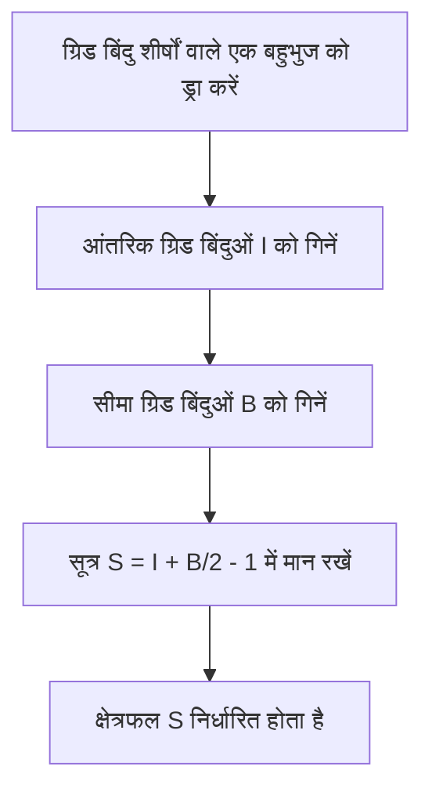
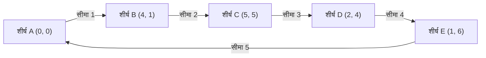

## 1. परिचय

गणित में ज्यामिति के क्षेत्र में, किसी आकृति का क्षेत्रफल ज्ञात करने के विषय का अध्ययन प्राचीन यूनानी काल से कई गणितज्ञों द्वारा किया गया है। स्कूली कक्षाओं में, हम त्रिभुज के क्षेत्रफल के मूल सूत्र, "आधार $\times$ ऊँचाई $\div 2$" से शुरू करते हुए, हाई स्कूल गणित में त्रिकोणमितीय अनुपातों का उपयोग करने वाले क्षेत्रफल सूत्र, एक समन्वय तल पर सदिशों के क्रॉस उत्पाद का उपयोग करते हुए सरस का नियम, और यहाँ तक कि हेरॉन का सूत्र, जो केवल तीनों भुजाओं की लंबाई के आधार पर क्षेत्रफल निकालता है, जैसे विभिन्न दृष्टिकोण सीखते हैं।

हालाँकि, यदि किसी बहुभुज के सभी शीर्ष **ग्रिड बिंदुओं** (वे बिंदु जहाँ $x$ और $y$ दोनों निर्देशांक पूर्णांक हैं) पर स्थित हैं, तो एक ऐसा जादुई सूत्र है जो आपको लंबाई मापने या जटिल गुणा या वर्गमूल गणना करने के बिना, केवल अत्यंत सरल अंकगणितीय संक्रियाओं का उपयोग करके क्षेत्रफल की गणना करने की अनुमति देता है। वह है **पिक का प्रमेय (Pick's Theorem)** , जिसे हम इस बार विस्तार से समझाएंगे।

पिक का प्रमेय केवल "आसानी से क्षेत्रफल ज्ञात करने के लिए एक सुविधाजनक और रहस्यमय सूत्र" नहीं है, बल्कि इसकी एक बहुत गहरी पृष्ठभूमि है जो आधुनिक गणित में टोपोलॉजी, ग्राफ सिद्धांत और बीजीय ज्यामिति से जुड़ती है। इस लेख में, हम पिक के प्रमेय को कई दृष्टिकोणों से गहराई से जानेंगे, इसे बुनियादी तौर पर कैसे उपयोग करें, इसके गणितीय प्रमाण तक कि इतना सरल सूत्र क्यों लागू होता है, इसकी ऐतिहासिक पृष्ठभूमि, और यहाँ तक कि प्रमेय की सीमाओं और 3D में इसके विस्तार की संभावना तक।

## 2. जॉर्ज अलेक्जेंडर पिक और ऐतिहासिक पृष्ठभूमि

पिक के प्रमेय को पूरी तरह से समझाने से पहले, आइए उस व्यक्ति के बारे में संक्षेप में जानें जिसने इस सुंदर प्रमेय की खोज की और उसकी ऐतिहासिक पृष्ठभूमि क्या है।

यह प्रमेय 1899 में ऑस्ट्रिया में जन्मे गणितज्ञ **जॉर्ज अलेक्जेंडर पिक (1859-1942)** द्वारा प्रकाशित किया गया था। उन्होंने वियना विश्वविद्यालय में गणित का अध्ययन किया और बाद में प्राग के जर्मन विश्वविद्यालय (अब प्राग में चार्ल्स विश्वविद्यालय) में कई वर्षों तक प्रोफेसर के रूप में कार्य किया।

दिलचस्प बात यह है कि पिक का प्रसिद्ध अल्बर्ट आइंस्टीन के साथ गहरा संबंध था। जब आइंस्टीन ने 1911 में प्राग के विश्वविद्यालय में एक पद ग्रहण किया, तो पिक ने उनका गर्मजोशी से स्वागत किया, और उन्होंने एक घनिष्ठ मित्रता बनाई, न केवल अकादमिक चर्चाओं में भाग लिया बल्कि एक साथ वायलिन भी बजाया। ऐसा कहा जाता है कि पिक उन लोगों में से एक थे जिन्होंने आइंस्टीन को "टेंसर विश्लेषण" और "रीमैनियन ज्यामिति" का अध्ययन करने की दृढ़ता से सिफारिश की थी, जो सामान्य सापेक्षता के सिद्धांत के निर्माण के लिए आवश्यक हो गए थे।

हालाँकि, पिक के बाद के वर्ष बहुत दुखद थे। यहूदी मूल के होने के कारण, उन्हें नाज़ी जर्मनी के उदय के साथ उत्पीड़न का सामना करना पड़ा। 1942 में, उन्हें थेरेसियनस्टेड एकाग्रता शिविर में भेज दिया गया, जहाँ केवल दो सप्ताह बाद 82 वर्ष की आयु में उनका निधन हो गया। यद्यपि उनके जीवन का अंत दुखद हुआ, लेकिन उनके द्वारा छोड़े गए "पिक के प्रमेय" को इसकी सुंदरता और सादगी के कारण आज भी दुनिया भर में गणित की शिक्षा में पसंद किया जाता है।

## 3. पिक का प्रमेय क्या है?

अब, पिक के प्रमेय के मूल पर आते हैं। प्रमेय का दावा आश्चर्यजनक रूप से सरल है और इसे प्राथमिक विद्यालय के छात्र भी समझ सकते हैं।

मान लीजिए कि एक तल पर समान अंतराल पर लंबवत और क्षैतिज रूप से ग्रिड बिंदु (जैसे ग्राफ पेपर पर चौराहे) संरेखित हैं। मान लीजिए कि हम एक "छिद्र-रहित बिना स्व-प्रतिच्छेदन वाला बहुभुज (सरल बहुभुज)" खींचने के लिए इनमें से कुछ ग्रिड बिंदुओं को सीधी रेखाओं से जोड़ते हैं। इस समय, खींचे गए बहुभुज का क्षेत्रफल $S$ पूरी तरह से केवल बहुभुज के **भीतर ग्रिड बिंदुओं की संख्या** और **सीमा रेखा पर ग्रिड बिंदुओं की संख्या** से निर्धारित होता है, यही यह प्रमेय बताता है।

इसे एक गणितीय सूत्र के रूप में निम्नानुसार व्यक्त किया गया है:

$$
S = I + \frac{B}{2} - 1
$$

- $S$ : बहुभुज का क्षेत्रफल
- $I$ (Interior, आंतरिक): बहुभुज के **भीतर ग्रिड बिंदुओं की संख्या**
- $B$ (Boundary, सीमा): बहुभुज की **सीमा रेखा पर ग्रिड बिंदुओं की संख्या** (निश्चित रूप से, शीर्ष स्वयं इसमें शामिल हैं)

इस सूत्र का सबसे आश्चर्यजनक बिंदु यह तथ्य है कि बहुभुज का आकार कितना भी जटिल क्यों न हो (उदाहरण के लिए, एक दांतेदार तारे का आकार या अत्यधिक लम्बा आकार), जब तक शीर्ष ग्रिड बिंदुओं पर हैं और कोई स्व-प्रतिच्छेदन या छिद्र नहीं हैं, यह **हमेशा बिना किसी अपवाद के लागू होता है** । इसका एक रहस्यमय आकर्षण है जो इस अर्थ में प्रति-सहज लगता है कि आकार के कोणों या भुजाओं की लंबाई पर विचार करने की कोई आवश्यकता नहीं है।

नीचे दिया गया फ़्लोचार्ट पिक के प्रमेय का उपयोग करके क्षेत्रफल ज्ञात करने की प्रक्रिया को दृश्य रूप से दिखाता है।



## 4. उदाहरणों के साथ प्रमेय की शक्ति की पुष्टि करना

केवल सूत्र को देखकर वास्तविक अर्थ प्राप्त करना कठिन हो सकता है। आइए वास्तव में कुछ विशिष्ट आकृतियों के साथ जाँच करें कि क्या पिक का प्रमेय वास्तव में सही क्षेत्रफल प्राप्त कर सकता है।

### उदाहरण 1: एक साधारण आयत

सबसे बुनियादी आकार के रूप में, आइए एक आयत पर विचार करें जिसके शीर्ष $(0, 0), (5, 0), (5, 3), (0, 3)$ पर हैं।

- **सामान्य विधि का उपयोग करके क्षेत्रफल की गणना** : चूंकि चौड़ाई $5$ है और ऊंचाई $3$ है, क्षेत्रफल $5 \times 3 = 15$ है।
- **आंतरिक ग्रिड बिंदुओं $I$ की संख्या** : आयत के अंदर के बिंदु ऐसे संयोजन हैं जहां $x$ निर्देशांक $1, 2, 3, 4$ है और $y$ निर्देशांक $1, 2$ है। इसलिए, अंदर $4 \times 2 = 8$ बिंदु हैं ( $I = 8$ )।
- **सीमा ग्रिड बिंदुओं $B$ की संख्या** : निचले किनारे पर $6$ बिंदु हैं (दोनों सिरों सहित) और ऊपरी किनारे पर $6$ बिंदु हैं। बाएं और दाएं किनारों पर, चार कोने वाले शीर्षों को छोड़कर, प्रत्येक में $2$ बिंदु हैं। उन्हें जोड़ने पर, $6 + 6 + 2 + 2 = 16$ बिंदु हैं ( $B = 16$ )।

आइए इसे पिक के प्रमेय सूत्र पर लागू करें।

$$
S = 8 + \frac{16}{2} - 1 = 8 + 8 - 1 = 15
$$

यह $15$ के सामान्य गणना परिणाम से पूरी तरह मेल खाता है।

### उदाहरण 2: समकोण त्रिभुज

इसके बाद, आइए एक समकोण त्रिभुज के साथ प्रयास करें जिसमें एक विकर्ण दृष्टिकोण शामिल है। यह $(0, 0), (6, 0), (0, 4)$ पर शीर्षों वाला एक समकोण त्रिभुज है।

- **सामान्य विधि का उपयोग करके क्षेत्रफल की गणना** : चूंकि आधार $6$ है और ऊंचाई $4$ है, क्षेत्रफल $\frac{6 \times 4}{2} = 12$ है।
- **आंतरिक ग्रिड बिंदुओं $I$ की संख्या** : यदि आप एक आरेख बनाते हैं और उन्हें ध्यान से गिनते हैं, तो त्रिभुज के अंदर कुल $7$ ग्रिड बिंदु हैं, जैसे $(1, 1), (1, 2), (2, 1), (2, 2), (3, 1), (4, 1)$ ( $I = 7$ )।
- **सीमा ग्रिड बिंदुओं $B$ की संख्या** : आधार पर $7$ बिंदु हैं ( $(0,0)$ से $(6,0)$ तक), और ऊंचाई के किनारे पर $5$ बिंदु हैं ( $(0,0)$ से $(0,4)$ तक)। कर्ण वह रेखा खंड है जो बिंदुओं $(0, 4)$ और $(6, 0)$ को जोड़ता है। इस रेखा खंड पर ग्रिड बिंदु $(3, 2)$ जैसे ग्रिड बिंदु से होकर गुजरते हैं क्योंकि $x$ के हर बार $3$ बढ़ने पर $y$ $2$ कम हो जाता है। यदि हम चारों कोनों पर दोहराव से बचने के लिए उन्हें ध्यान से गिनें, तो सीमा रेखा पर कुल $12$ बिंदु हैं ( $B = 12$ )।

सूत्र पर लागू करने पर,

$$
S = 7 + \frac{12}{2} - 1 = 7 + 6 - 1 = 12
$$

एक बार फिर, यह बिल्कुल मेल खाता है।

### उदाहरण 3: डेंट के साथ जटिल बहुभुज

पिक का प्रमेय इंडेंटेशन वाले अधिक जटिल बहुभुजों के साथ भी अपनी शक्ति दिखाता है।



इस तरह के जटिल आकार के मामले में, पारंपरिक गणना विधियों में बहुत थकाऊ काम की आवश्यकता होती है, जैसे आकार को कई त्रिभुजों और आयतों में विभाजित करना, या पूरे आकार को पूरी तरह से घेरने वाले बड़े आयत से अतिरिक्त भागों के क्षेत्रफल को घटाना। गणना की गलतियाँ होने की भी संभावना है।

हालाँकि, यदि आप पिक के प्रमेय का उपयोग करते हैं, तो आप केवल आकृति के अंदर के बिंदुओं को गिनकर और सीमा रेखा पर बिंदुओं को गिनकर तुरंत सटीक क्षेत्रफल की गणना कर सकते हैं। इसे वास्तव में अभूतपूर्व कहा जा सकता है।

## 5. यूलर के बहुफलक सूत्र का उपयोग करके प्रमाण

ऐसा जादुई सूत्र क्यों काम करता है? पिक के प्रमेय को सिद्ध करने के कई तरीके हैं, लेकिन यहाँ हम ग्राफ सिद्धांत में एक प्रसिद्ध प्रमेय, **यूलर के बहुफलक सूत्र (Euler's Polyhedral Formula)** का उपयोग करके एक सुरुचिपूर्ण प्रमाण विचार प्रस्तुत करेंगे।

यूलर के प्रमेय के अनुसार, एक तल पर खींचे गए एक जुड़े हुए ग्राफ (नेटवर्क) के लिए, यदि शीर्षों की संख्या $V$ है, किनारों की संख्या $E$ है, और फलकों की संख्या $F$ है, तो निम्नलिखित संबंध सत्य है:

$$
V - E + F = 2
$$

(इस $F$ में, ग्राफ के बाहर फैलने वाले असीम रूप से बड़े क्षेत्र को भी एक फलक के रूप में गिना जाता है)।

### बहुभुज को त्रिभुजों में विभाजित करना

सबसे पहले, लक्ष्य बहुभुज $P$ पर विचार करें जिसका क्षेत्रफल आप खोजना चाहते हैं। इस बहुभुज के अंदर और सीमा पर सभी ग्रिड बिंदुओं को शीर्षों के रूप में लेते हुए, और ग्रिड बिंदुओं को एक-दूसरे से जोड़ते हुए, हम बहुभुज $P$ के अंदर को विभाजित (त्रिकोणीय) करते हैं ताकि यह पूरी तरह से छोटे "आदिम त्रिभुजों" (primitive triangles) से भर जाए।
एक आदिम त्रिभुज एक ऐसा त्रिभुज होता है जिसमें अपने शीर्षों के अलावा कोई भी ग्रिड बिंदु शामिल नहीं होता है, न तो अंदर और न ही अपनी सीमा के किनारों पर। ऐसे आदिम त्रिभुजों का क्षेत्रफल, बिना किसी अपवाद के, सभी का $\frac{1}{2}$ होता है।

हम इस विभाजन द्वारा बनाए गए जाल पैटर्न को एक एकल तलीय ग्राफ मानते हैं। इस ग्राफ के लिए, हम निम्नलिखित प्रतीकों को परिभाषित करते हैं:
- $I$ : बहुभुज के अंदर ग्रिड बिंदुओं की संख्या
- $B$ : बहुभुज की सीमा पर ग्रिड बिंदुओं की संख्या
- $V$ : ग्राफ में शीर्षों की कुल संख्या। स्पष्ट रूप से $V = I + B$।
- $E$ : ग्राफ में किनारों की कुल संख्या।
- $f$ : बहुभुज के अंदर बने आदिम त्रिभुज फलकों की संख्या।
- चूंकि हम बाहरी फलक ($1$ फलक) को शामिल करते हैं, यूलर के प्रमेय में फलकों की कुल संख्या $F = f + 1$ है।

इस ग्राफ पर यूलर का सूत्र लागू करने पर, हमें प्राप्त होता है
$$
(I + B) - E + (f + 1) = 2
$$
अर्थात्,
$$
I + B - E + f = 1 \quad \text{--- (समीकरण 1)}
$$

### आंतरिक कोणों के योग पर ध्यान केंद्रित करना

इसके बाद, हम ग्राफ में सभी त्रिभुजों के आंतरिक कोणों के योग की $2$ अलग-अलग तरीकों से गणना करते हैं और एक समीकरण बनाते हैं।

**विधि 1: त्रिभुजों की संख्या से गणना करें**
बहुभुज $P$ को $f$ आदिम त्रिभुजों में विभाजित किया गया है। एक त्रिभुज के आंतरिक कोणों का योग $180^\circ$ ( $\pi$ रेडियन) होता है। इसलिए, सभी आदिम त्रिभुजों के आंतरिक कोणों का कुल योग $f \times \pi$ है।

**विधि 2: शीर्षों के चारों ओर के कोणों से गणना करें**
हम आंतरिक कोणों के योग को प्रत्येक शीर्ष पर एकत्र होने वाले कोणों के योग के रूप में फिर से गिनते हैं।
- **आंतरिक ग्रिड बिंदु ($I$ बिंदु)** : प्रत्येक बिंदु के चारों ओर, कुल $360^\circ$ ( $2\pi$ रेडियन) के कोण एकत्र होते हैं। इस प्रकार कुल $2\pi \times I$ है।
- **सीमा ग्रिड बिंदु ($B$ बिंदु)** : सीमा पर बिंदुओं पर बहुभुज के आंतरिक कोणों का योग क्या है? एक यादृच्छिक $n$-भुज के आंतरिक कोणों का योग $(n - 2) \times \pi$ होता है। यहाँ, चूँकि सीमा पर $B$ बिंदु हैं, इसे $B$-भुज माना जा सकता है, और इसके आंतरिक कोणों का योग $(B - 2) \times \pi$ है।

चूँकि इन दोनों विधियों से प्राप्त कोणों का कुल योग बराबर होना चाहिए, इसलिए निम्नलिखित समीकरण सत्य है।

$$
f \times \pi = 2\pi \times I + (B - 2) \times \pi
$$

दोनों पक्षों को $\pi$ से विभाजित करने पर, हमें एक बहुत ही सरल समीकरण प्राप्त होता है।

$$
f = 2I + B - 2 \quad \text{--- (समीकरण 2)}
$$

### क्षेत्रफल की गणना

जैसा कि शुरुआत में बताया गया है, सभी $f$ आदिम त्रिभुजों का क्षेत्रफल $\frac{1}{2}$ है। इसलिए, बहुभुज का कुल क्षेत्रफल $S$ आदिम त्रिभुजों के क्षेत्रफलों का योग है, और इसे निम्नानुसार व्यक्त किया जा सकता है:

$$
S = \frac{f}{2}
$$

इसमें पहले पाया गया (समीकरण 2) प्रतिस्थापित करने पर, हमें प्राप्त होता है

$$
S = \frac{2I + B - 2}{2} = I + \frac{B}{2} - 1
$$

पिक का प्रमेय शानदार ढंग से प्राप्त हुआ है! यूलर का प्रमेय, टोपोलॉजी की नींव, और आंतरिक कोणों का योग, ज्यामिति की नींव, इस सुंदर सूत्र को साबित करने के लिए पूरी तरह से विलीन हो जाते हैं।

## 6. छिद्र वाले बहुभुजों में अनुप्रयोग

पिक का प्रमेय एक "छिद्र-रहित सरल बहुभुज" मानता है, लेकिन क्या होगा यदि बहुभुज में कोई छिद्र हो?

उदाहरण के लिए, डोनट जैसे आकार की कल्पना करें, जहां बाहरी बहुभुज के भीतर पूरी तरह से निहित एक आंतरिक बहुभुज (छिद्र) खोखला हो। ऐसे आकारों के लिए, पिक का सूत्र वैसा ही लागू नहीं होता है। हालाँकि, छिद्रों की संख्या के अनुसार प्रमेय को ठीक करके क्षेत्रफल ज्ञात करना संभव है।

यदि बहुभुज के अंदर $h$ स्वतंत्र छिद्र हैं, तो सामान्यीकृत पिक के प्रमेय का सूत्र इस प्रकार है:

$$
S = I + \frac{B}{2} - 1 + h
$$

यहाँ, $I$ केवल बहुभुज के अंदर (छिद्र वाले हिस्सों को छोड़कर ठोस हिस्सा) ग्रिड बिंदुओं को गिनता है। साथ ही, $B$ न केवल बाहरी सीमा रेखा पर ग्रिड बिंदुओं के योग का प्रतिनिधित्व करता है बल्कि छिद्रों की आंतरिक सीमा रेखा पर भी सभी ग्रिड बिंदुओं का योग दर्शाता है।

वह गुण कि हर बार एक छिद्र बढ़ने पर सूत्र के अंत में $+1$ जोड़ा जाता है, ज्यामिति में यूलर विशेषता (Euler characteristic) से गहराई से संबंधित है, और अंतरिक्ष (टोपोलॉजी) के निरंतर विरूपण में इसका बहुत महत्वपूर्ण अर्थ है।

## 7. 3D में विस्तार और एर्हार्ट बहुपद (Ehrhart Polynomials)

यदि एक तल (2D) पर इतना सुंदर और शक्तिशाली सूत्र मौजूद है, तो एक गणितज्ञ के रूप में यह सोचना अत्यंत स्वाभाविक है, "क्या कोई ऐसा सूत्र नहीं है जो 3D ठोस आकृति (बहुफलक) के आयतन की गणना केवल अंदर और सतह पर ग्रिड बिंदुओं की संख्या से कर सके?"।

हालाँकि, आश्चर्यजनक रूप से, यह सिद्ध हो चुका है कि **त्रि-आयामी अंतरिक्ष में पिक के प्रमेय का प्रत्यक्ष विस्तार मौजूद नहीं है** । दूसरे शब्दों में, एक गणितीय सूत्र बनाना असंभव है जो केवल आंतरिक ग्रिड बिंदुओं की संख्या और सतह ग्रिड बिंदुओं की संख्या से विशिष्ट रूप से आयतन निर्धारित करता हो।

### प्रति-उदाहरण (Counterexample): रीव का चतुष्फलक (Reeve tetrahedron)

इस असंभवता का प्रमाण एक प्रति-उदाहरण था जिसे "रीव का चतुष्फलक" कहा जाता है जिसे 1957 में ब्रिटिश गणितज्ञ जॉन रीव ने प्रस्तुत किया था।
रीव ने निम्नलिखित 4 शीर्षों वाले एक चतुष्फलक (त्रिकोणीय पिरामिड) पर विचार किया:

- शीर्ष 1: $(0, 0, 0)$
- शीर्ष 2: $(1, 0, 0)$
- शीर्ष 3: $(0, 1, 0)$
- शीर्ष 4: $(1, 1, r)$ (जहां $r$ एक यादृच्छिक धनात्मक पूर्णांक है)

इस चतुष्फलक की जाँच करते समय, अंदर ग्रिड बिंदुओं की संख्या हमेशा $0$ होती है। इसके अलावा, सतह पर शीर्ष वाले 4 बिंदुओं को छोड़कर कोई ग्रिड बिंदु नहीं हैं। अर्थात्, चाहे $r$ $1$, $100$, या $10000$ हो, इस चतुष्फलक में समाहित ग्रिड बिंदुओं की कुल संख्या हमेशा लगातार "$4$ बिंदु" होती है।

हालाँकि, इस चतुष्फलक के आयतन की गणना $\frac{r}{6}$ की जाती है।
इसका अर्थ है कि भले ही ग्रिड बिंदुओं की संख्या बिल्कुल समान हो, $r$ का मान बदलकर आयतन को असीमित रूप से बड़ा बनाना संभव है। इसलिए, यह सिद्ध हो गया कि केवल "ग्रिड बिंदुओं की संख्या" की जानकारी से "आयतन" की पीछे की गणना करना सैद्धांतिक रूप से असंभव है।

### एर्हार्ट बहुपदों का उदात्तीकरण (Sublimation to Ehrhart Polynomials)

यद्यपि पिक के प्रमेय को सीधे 3D में विस्तारित नहीं किया जा सका, लेकिन यह समस्या किसी भी तरह से यहां समाप्त नहीं हुई। फ्रांसीसी गणितज्ञ यूजीन एर्हार्ट ने अपना दृष्टिकोण बदलकर एक नया सिद्धांत स्थापित किया।

उन्होंने अध्ययन किया कि "किसी आकृति में समाहित ग्रिड बिंदुओं की संख्या कैसे बदलती है जब आकृति का आकार पूर्णांक कारक $t$ से बड़ा हो जाता है"। जब $L(P, t)$ ग्रिड बिंदुओं की वह संख्या है जो $t$ गुना $d$-आयामी बहुफलक $P$ का विस्तार करके प्राप्त $tP$ आकृति में समाहित है, जिसके शीर्ष ग्रिड बिंदुओं पर हैं, तो एर्हार्ट ने साबित किया कि यह $L(P, t)$ $t$ के लिए $d$-डिग्री बहुपद बन जाता है। यह **एर्हार्ट बहुपद** है।

द्वि-आयामी मामले में एर्हार्ट बहुपद बिल्कुल पिक के प्रमेय का ही सामान्यीकृत रूप है, और इसका आधुनिक बीजीय ज्यामिति और संयोजन विज्ञान में 3 आयामों और उससे ऊपर के उच्च-आयामी रिक्त स्थान में ग्रिड बिंदुओं और आयतन के बीच संबंधों को उजागर करने के लिए एक अत्यंत महत्वपूर्ण उपकरण के रूप में सक्रिय रूप से अध्ययन किया जाता है।

## 8. प्रोग्राम द्वारा कार्यान्वयन

आइए पायथन (Python) में एक सरल प्रोग्राम लागू करें जो पिक के प्रमेय का उपयोग करके क्षेत्रफल की गणना करता है। दरअसल, जब बहुभुज के शीर्ष निर्देशांक दिए जाते हैं, तो सीमा ग्रिड बिंदुओं $B$ और आंतरिक ग्रिड बिंदुओं $I$ को गिनना आवश्यक होता है।

सीमा पर रेखा खंडों पर ग्रिड बिंदुओं की संख्या को रेखा खंड के दोनों सिरों के $x$ निर्देशांक में अंतर के पूर्ण मान और $y$ निर्देशांक में अंतर के पूर्ण मान के **महत्तम समापवर्तक (GCD)** का उपयोग करके पाया जा सकता है।

```python
import math

def get_boundary_points(polygon):
    """
    बहुभुज के शीर्ष निर्देशांक की एक सूची प्राप्त करता है और सीमा ग्रिड बिंदुओं B की संख्या देता है।
    polygon: [(x1, y1), (x2, y2), ..., (xn, yn)]
    """
    B = 0
    n = len(polygon)
    for i in range(n):
        x1, y1 = polygon[i]
        x2, y2 = polygon[(i + 1) % n]  # अगला शीर्ष (अंत में पहले पर वापस लूप करता है)
        
        # खंड पर ग्रिड बिंदुओं की संख्या dx और dy के महत्तम समापवर्तक के बराबर है (अंतिम बिंदुओं में से एक सहित)
        dx = abs(x1 - x2)
        dy = abs(y1 - y2)
        B += math.gcd(dx, dy)
        
    return B

# क्षेत्रफल ज्ञात करने के लिए, आपको अलग से क्रॉस उत्पाद आदि का उपयोग करके कुल क्षेत्रफल की गणना करने की आवश्यकता है,
# या अनुभवहीन रूप से I को गिनना होगा।
# यहाँ, एक उदाहरण के रूप में, हम एक फ़ंक्शन दिखाते हैं जो सीधे I और B निर्दिष्ट करके क्षेत्रफल की गणना करता है।

def picks_theorem(I, B):
    """
    आंतरिक ग्रिड बिंदुओं I और सीमा ग्रिड बिंदुओं B से क्षेत्रफल S की गणना करता है
    """
    return I + B / 2.0 - 1.0

# निष्पादन उदाहरण
interior_points = 7
boundary_points = 12
area = picks_theorem(interior_points, boundary_points)
print(f"आंतरिक बिंदु: {interior_points}, सीमा बिंदु: {boundary_points}")
print(f"गणित क्षेत्रफल: {area}")
```

इस तरह, एक एल्गोरिथ्म के रूप में विभाजित होने पर भी, पिक के प्रमेय का सूत्र स्वयं एक अत्यंत सरल गणना सूत्र के रूप में व्यक्त किया जाता है।

## 9. निष्कर्ष

पिक का प्रमेय निम्नलिखित अद्भुत विशेषताओं के साथ एक सुंदर गणितीय प्रमेय है:

1. **अत्यंत सरल सूत्र** : क्षेत्रफल को केवल जोड़ और भाग से युक्त एक समीकरण के साथ पाया जा सकता है, $S = I + \frac{B}{2} - 1$।
2. **लंबाई मापने की कोई आवश्यकता नहीं** : कोणों को मापने के लिए एक शासक (ruler) के पैमाने या चांदा (protractor) की बिल्कुल भी आवश्यकता नहीं है, और क्षेत्रफल केवल "बिंदुओं को गिनने" के आदिम कार्य द्वारा निर्धारित किया जाता है।
3. **गहरी गणितीय पृष्ठभूमि** : इसे यूलर के प्रमेय से प्राप्त किया जा सकता है, और यह उन्नत आधुनिक गणित के प्रवेश द्वार के रूप में भी कार्य करता है जिसे एर्हार्ट बहुपद कहा जाता है।

जब आप ग्राफ पेपर या डॉट नोटबुक पर बहुभुज खींचते हैं, तो कृपया इस प्रमेय को याद रखें और वास्तव में बिंदुओं को गिनकर क्षेत्रफल की गणना करने का प्रयास करें। वह क्षण जब पहली नज़र में असंबंधित लगने वाले "ग्रिड बिंदु" और "क्षेत्रफल" खूबसूरती से जुड़ जाते हैं, हमें स्पष्ट रूप से पहेली जैसा मज़ा और गहराई प्रस्तुत करेगा जो गणित के अध्ययन में है।
