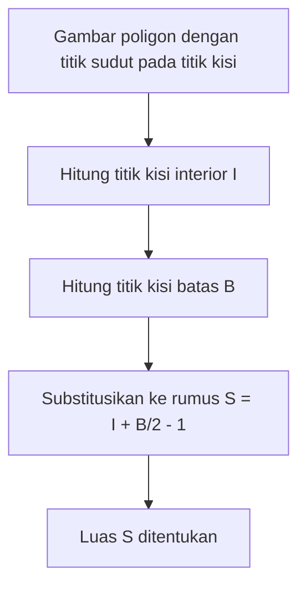
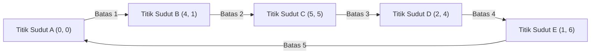

## 1. Pengantar

Di bidang geometri dalam matematika, tema mencari luas suatu bangun telah dipelajari oleh banyak matematikawan sejak zaman Yunani kuno. Di kelas sekolah, kita mempelajari berbagai pendekatan, mulai dari rumus dasar untuk luas segitiga, "alas $\times$ tinggi $\div 2$", hingga rumus luas yang menggunakan perbandingan trigonometri dalam matematika sekolah menengah, aturan Sarrus yang menggunakan perkalian silang vektor pada bidang koordinat, dan bahkan rumus Heron, yang memperoleh luas hanya berdasarkan panjang ketiga sisinya.

Namun, jika semua titik sudut dari suatu poligon terletak pada **titik kisi** (titik di mana koordinat $x$ dan $y$ keduanya adalah bilangan bulat), ada rumus ajaib yang memungkinkan Anda menghitung luas hanya dengan menggunakan operasi aritmatika yang sangat sederhana, tanpa mengukur panjang atau melakukan perkalian yang rumit atau perhitungan akar kuadrat. Itu adalah **[Teorema Pick](https://kenji.blog/id/p/picks-theorem/)**, yang akan kita jelaskan secara detail kali ini.

[Teorema Pick](https://kenji.blog/id/p/picks-theorem/) bukan sekadar "rumus yang nyaman dan misterius untuk menemukan luas dengan mudah", melainkan memiliki latar belakang yang sangat dalam yang menghubungkan topologi, [teori graf](/id/p/graph-theory-dijkstra-a-star/), dan geometri aljabar dalam matematika modern. Dalam artikel ini, kita akan menggali lebih dalam teorema Pick dari berbagai sudut, mulai dari cara menggunakannya pada dasarnya, hingga bukti matematis mengapa rumus sesederhana itu berlaku, latar belakang historisnya, dan bahkan keterbatasan teorema dan kemungkinan perluasannya ke 3D.

## 2. Georg Alexander Pick dan Latar Belakang Sejarah

Sebelum menjelaskan sepenuhnya teorema Pick, mari kita singgung secara singkat tentang orang yang menemukan teorema yang indah ini dan latar belakang sejarahnya.

Teorema ini diterbitkan pada tahun 1899 oleh matematikawan kelahiran Austria **Georg Alexander Pick (1859-1942)**. Beliau belajar matematika di Universitas Wina dan kemudian menjabat sebagai profesor selama bertahun-tahun di Universitas Jerman Praha (sekarang Universitas Charles di Praha).

Menariknya, Pick memiliki hubungan yang mendalam dengan Albert Einstein yang terkenal. Ketika Einstein mengambil posisi di universitas di Praha pada tahun 1911, Pick menyambutnya dengan hangat, dan mereka membangun persahabatan yang erat, tidak hanya terlibat dalam diskusi akademis tetapi juga bermain biola bersama. Dikatakan bahwa Pick adalah salah satu orang yang sangat merekomendasikan agar Einstein mempelajari "analisis tensor" dan "geometri [Riemann](https://kenji.blog/id/p/riemann/)", yang menjadi penting untuk membangun teori relativitas umum.

Namun, tahun-tahun terakhir Pick sangatlah tragis. Sebagai orang keturunan Yahudi, ia menghadapi penganiayaan dengan bangkitnya Nazi Jerman. Pada tahun 1942, ia dikirim ke kamp konsentrasi Theresienstadt, di mana ia meninggal dunia hanya dua minggu kemudian pada usia 82 tahun. Meskipun hidupnya menemui akhir yang menyedihkan, "[Teorema Pick](https://kenji.blog/id/p/picks-theorem/)" yang ditinggalkannya terus disukai dalam pendidikan matematika di seluruh dunia saat ini karena keindahan dan kesederhanaannya.

## 3. Apa itu [Teorema Pick](https://kenji.blog/id/p/picks-theorem/)?

Sekarang, mari kita masuk ke inti teorema Pick. Pernyataan teorema ini secara mengejutkan sangat sederhana dan dapat dipahami bahkan oleh siswa sekolah dasar.

Misalkan ada titik kisi (seperti persimpangan pada kertas grafik) yang berbaris secara vertikal dan horizontal pada interval yang sama pada suatu bidang. Misalkan kita menghubungkan beberapa titik kisi ini dengan garis lurus untuk menggambar "poligon tanpa lubang dan tanpa titik potong mandiri (poligon sederhana)". Pada saat ini, luas $S$ dari poligon yang digambar sepenuhnya ditentukan hanya oleh **jumlah titik kisi di dalam** poligon dan **jumlah titik kisi pada garis batas**, itulah yang dinyatakan oleh teorema tersebut.

Dinyatakan sebagai rumus matematika, adalah sebagai berikut:

$$
S = I + \frac{B}{2} - 1
$$

- $S$ : Luas poligon
- $I$ (Interior) : **Jumlah titik kisi di dalam** poligon
- $B$ (Boundary, Batas) : **Jumlah titik kisi pada garis batas** poligon (tentu saja, titik sudutnya sendiri termasuk dalam ini)

Poin yang paling mengejutkan dari rumus ini adalah fakta bahwa tidak peduli seberapa rumit bentuk poligonnya (misalnya, bentuk bintang yang bergerigi atau bentuk yang sangat memanjang), selama titik sudut berada di titik kisi dan tidak ada perpotongan mandiri atau lubang, ia **selalu berlaku tanpa kecuali**. Ia memiliki daya tarik misterius yang tampaknya berlawanan dengan intuisi dalam arti bahwa sama sekali tidak perlu mempertimbangkan sudut bentuk atau panjang sisi.

Diagram alur di bawah ini secara visual menunjukkan prosedur untuk menemukan luas menggunakan teorema Pick.



## 4. Mengkonfirmasi Kekuatan Teorema dengan Contoh

Mungkin sulit untuk mendapatkan gambaran nyata hanya dengan melihat rumusnya. Mari kita periksa secara nyata dengan beberapa bentuk spesifik apakah teorema Pick benar-benar dapat menurunkan luas yang tepat.

### Contoh 1: Persegi Panjang Sederhana

Sebagai bentuk paling dasar, mari pertimbangkan persegi panjang yang titik-titik sudutnya berada pada $(0, 0), (5, 0), (5, 3), (0, 3)$.

- **Perhitungan luas menggunakan metode umum** : Karena lebarnya $5$ dan tingginya $3$, luasnya adalah $5 \times 3 = 15$.
- **Jumlah titik kisi interior $I$** : Titik-titik di dalam persegi panjang adalah kombinasi di mana koordinat $x$ adalah $1, 2, 3, 4$ dan koordinat $y$ adalah $1, 2$. Oleh karena itu, ada $4 \times 2 = 8$ titik di dalam ( $I = 8$ ).
- **Jumlah titik kisi batas $B$** : Terdapat $6$ titik di tepi bawah (termasuk kedua ujungnya) dan $6$ titik di tepi atas. Pada tepi kiri dan kanan, tidak termasuk keempat titik sudut, masing-masing terdapat $2$ titik. Menjumlahkannya, terdapat $6 + 6 + 2 + 2 = 16$ titik ( $B = 16$ ).

Mari kita terapkan ini pada rumus teorema Pick.

$$
S = 8 + \frac{16}{2} - 1 = 8 + 8 - 1 = 15
$$

Ini sangat cocok dengan hasil perhitungan biasanya yaitu $15$.

### Contoh 2: Segitiga Siku-siku

Selanjutnya, mari kita coba segitiga siku-siku yang mencakup pendekatan diagonal. Ini adalah segitiga siku-siku dengan titik sudut pada $(0, 0), (6, 0), (0, 4)$.

- **Perhitungan luas menggunakan metode umum** : Karena alasnya $6$ dan tingginya $4$, luasnya adalah $\frac{6 \times 4}{2} = 12$.
- **Jumlah titik kisi interior $I$** : Jika Anda menggambar diagram dan menghitungnya dengan cermat, ada total $7$ titik kisi di dalam segitiga, seperti $(1, 1), (1, 2), (2, 1), (2, 2), (3, 1), (4, 1)$ ( $I = 7$ ).
- **Jumlah titik kisi batas $B$** : Terdapat $7$ titik di alas (dari $(0,0)$ hingga $(6,0)$), dan $5$ titik di tepi tinggi (dari $(0,0)$ hingga $(0,4)$). Sisi miring adalah ruas garis yang menghubungkan titik $(0, 4)$ dan $(6, 0)$. Titik kisi pada ruas garis ini melewati titik kisi seperti $(3, 2)$ karena $y$ berkurang $2$ setiap kali $x$ bertambah $3$. Jika kita menghitungnya dengan cermat untuk menghindari penghitungan ganda di empat sudut, ada total $12$ titik pada garis batas ( $B = 12$ ).

Menerapkannya ke rumus,

$$
S = 7 + \frac{12}{2} - 1 = 7 + 6 - 1 = 12
$$

Sekali lagi, cocok dengan tepat.

### Contoh 3: Poligon Kompleks dengan Lekukan

[Teorema Pick](https://kenji.blog/id/p/picks-theorem/) menunjukkan kekuatannya bahkan dengan poligon yang lebih kompleks yang memiliki lekukan.



Dalam hal bentuk yang begitu rumit, metode perhitungan konvensional memerlukan pekerjaan yang sangat membosankan, seperti membagi bentuk menjadi beberapa segitiga dan persegi panjang, atau mengurangkan luas bagian yang berlebih dari persegi panjang besar yang melingkupi keseluruhan bentuk. Kesalahan perhitungan juga kemungkinan besar akan terjadi.

Namun, jika Anda menggunakan teorema Pick, Anda dapat secara instan menghitung luas yang tepat hanya dengan menghitung titik di dalam bentuk dan menghitung titik di garis batas. Ini benar-benar dapat dikatakan sebagai fenomena luar biasa.

## 5. Pembuktian Menggunakan Rumus Polihedron Euler

Mengapa rumus ajaib seperti itu berlaku? Ada beberapa cara untuk membuktikan teorema Pick, tetapi di sini kita akan menyajikan gagasan pembuktian yang elegan dengan menggunakan teorema terkenal dalam [teori graf](/id/p/graph-theory-dijkstra-a-star/), **Rumus Polihedron Euler**.

Menurut teorema Euler, untuk graf terhubung (jaringan) yang digambar pada suatu bidang, jika jumlah titik sudut (simpul) adalah $V$, jumlah tepi (sisi) adalah $E$, dan jumlah muka (bidang) adalah $F$, maka hubungan berikut ini berlaku:

$$
V - E + F = 2
$$

(Dalam $F$ ini, daerah yang sangat besar tanpa batas yang menyebar di luar graf juga dihitung sebagai satu muka).

### Membagi Poligon menjadi Segitiga

Pertama, perhatikan poligon target $P$ yang luasnya ingin Anda temukan. Mengambil semua titik kisi di dalam dan di batas poligon ini sebagai titik sudut, dan menghubungkan titik-titik kisi tersebut satu sama lain, kita membagi (triangulasi) bagian dalam poligon $P$ sehingga seluruhnya terisi oleh "segitiga primitif" kecil.
Segitiga primitif adalah segitiga yang tidak mengandung titik kisi lain selain dari titik sudutnya, baik di dalam maupun pada tepi batasnya. Luas segitiga primitif tersebut, tanpa kecuali, semuanya $\frac{1}{2}$.

Kita menganggap pola jaring yang diciptakan oleh pembagian ini sebagai satu graf planar. Untuk graf ini, kita mendefinisikan simbol-simbol berikut:
- $I$ : Jumlah titik kisi di dalam poligon
- $B$ : Jumlah titik kisi pada batas poligon
- $V$ : Jumlah total titik sudut dalam graf. Jelas $V = I + B$.
- $E$ : Jumlah total tepi dalam graf.
- $f$ : Jumlah muka segitiga primitif yang terbentuk di dalam poligon.
- Karena kita menyertakan muka luar ($1$ muka), jumlah total muka dalam teorema Euler adalah $F = f + 1$.

Menerapkan rumus Euler ke graf ini, kita mendapatkan
$$
(I + B) - E + (f + 1) = 2
$$
Yaitu,
$$
I + B - E + f = 1 \quad \text{--- (Persamaan 1)}
$$

### Berfokus pada Jumlah Sudut Dalam

Selanjutnya, kita menghitung jumlah sudut dalam dari semua segitiga pada graf dalam $2$ cara berbeda dan membuat persamaan.

**Metode 1: Menghitung dari jumlah segitiga**
Poligon $P$ dibagi menjadi $f$ segitiga primitif. Jumlah sudut dalam dari satu segitiga adalah $180^\circ$ ( $\pi$ radian). Karena itu, jumlah total sudut dalam semua segitiga primitif adalah $f \times \pi$.

**Metode 2: Menghitung dari sudut di sekitar titik sudut**
Kita menghitung ulang jumlah sudut dalam sebagai jumlah sudut yang berkumpul di setiap titik sudut.
- **Titik kisi interior (titik $I$)** : Di sekitar setiap titik, terkumpul sudut sebesar total $360^\circ$ ( $2\pi$ radian). Jadi totalnya adalah $2\pi \times I$.
- **Titik kisi batas (titik $B$)** : Berapa jumlah sudut dalam poligon pada titik-titik di batas? Jumlah sudut dalam dari segi-$n$ sebarang adalah $(n - 2) \times \pi$. Di sini, karena ada $B$ titik pada batas, ini dapat dianggap sebagai segi-$B$, dan jumlah sudut dalamnya adalah $(B - 2) \times \pi$.

Karena jumlah total sudut yang ditemukan dengan kedua metode ini harus sama, persamaan berikut ini berlaku.

$$
f \times \pi = 2\pi \times I + (B - 2) \times \pi
$$

Membagi kedua ruas dengan $\pi$, kita memperoleh persamaan yang sangat sederhana.

$$
f = 2I + B - 2 \quad \text{--- (Persamaan 2)}
$$

### Perhitungan Luas

Seperti dinyatakan di awal, luas semua $f$ segitiga primitif adalah $\frac{1}{2}$. Oleh karena itu, luas total $S$ dari poligon adalah jumlah luas segitiga primitif, dan dapat dinyatakan sebagai berikut:

$$
S = \frac{f}{2}
$$

Dengan menyubstitusikan (Persamaan 2) yang ditemukan sebelumnya ke dalam ini, kita mendapatkan

$$
S = \frac{2I + B - 2}{2} = I + \frac{B}{2} - 1
$$

[Teorema Pick](https://kenji.blog/id/p/picks-theorem/) diturunkan dengan cemerlang! Teorema Euler, landasan topologi, dan jumlah sudut dalam, landasan geometri, berpadu sempurna untuk membuktikan rumus yang indah ini.

## 6. Penerapan pada Poligon dengan Lubang

[Teorema Pick](https://kenji.blog/id/p/picks-theorem/) mengasumsikan "poligon sederhana tanpa lubang", tetapi apa yang terjadi jika ada lubang pada poligon?

Misalnya, bayangkan sebuah bentuk seperti donat, di mana poligon dalam (lubang) yang sepenuhnya berada di dalam poligon luar dilubangi. Untuk bentuk seperti itu, rumus Pick tidak berlaku sebagaimana adanya. Akan tetapi, luasnya dapat dicari dengan mengoreksi teorema tersebut sesuai dengan jumlah lubangnya.

Jika terdapat $h$ lubang independen di dalam poligon, rumus untuk teorema Pick yang diperumum adalah sebagai berikut:

$$
S = I + \frac{B}{2} - 1 + h
$$

Di sini, $I$ hanya menghitung titik kisi di dalam poligon (bagian padat di luar bagian lubang). Selain itu, $B$ menyatakan jumlah tidak hanya titik kisi di garis batas luar, tetapi juga semua titik kisi di garis batas dalam lubang.

Sifat bahwa $+1$ ditambahkan pada akhir rumus setiap kali lubang bertambah terkait erat dengan karakteristik Euler dalam geometri, dan memiliki makna yang sangat penting dalam deformasi ruang secara kontinu (topologi).

## 7. Perluasan ke 3D dan Polinomial Ehrhart

Jika rumus yang begitu indah dan kuat ada pada sebuah bidang (2D), adalah sangat wajar jika seorang matematikawan berpikir, "Bukankah ada rumus yang dapat menghitung volume bangun ruang 3D (polihedron) hanya dari jumlah titik kisi di bagian dalam dan permukaannya?".

Namun secara mengejutkan, telah dibuktikan bahwa **perluasan langsung dari teorema Pick tidak ada dalam ruang 3 dimensi**. Dengan kata lain, mustahil untuk membuat rumus matematika yang secara unik menentukan volume hanya dari jumlah titik kisi internal dan jumlah titik kisi permukaan.

### Contoh Penyangkal: Tetrahedron Reeve

Buktinya kemustahilan ini adalah contoh penyangkal yang disebut "Tetrahedron Reeve", yang disajikan oleh matematikawan Inggris John Reeve pada tahun 1957.
Reeve memikirkan sebuah tetrahedron (limas segitiga) yang memiliki 4 titik sudut berikut:

- Titik Sudut 1: $(0, 0, 0)$
- Titik Sudut 2: $(1, 0, 0)$
- Titik Sudut 3: $(0, 1, 0)$
- Titik Sudut 4: $(1, 1, r)$ (dengan $r$ adalah sembarang bilangan bulat positif)

Saat menyelidiki tetrahedron ini, jumlah titik kisi di dalamnya selalu $0$. Selain itu, sama sekali tidak ada titik kisi di permukaannya kecuali keempat titik sudut tersebut. Artinya, apakah $r$ bernilai $1$, $100$, atau $10000$, jumlah keseluruhan titik kisi yang termuat dalam tetrahedron ini akan selalu dan selamanya konstan di angka "$4$ titik".

Namun, volume dari tetrahedron ini jika dihitung adalah $\frac{r}{6}$.
Hal ini berarti bahwa meskipun jumlah titik kisinya benar-benar sama, volumenya dimungkinkan untuk dibuat menjadi besar tak terhingga dengan mengubah nilai $r$. Oleh karena itu, telah dibuktikan bahwa secara teoretis tidak mungkin untuk menghitung kembali "volume" hanya dari informasi "jumlah titik kisi".

### Sublimasi menjadi Polinomial Ehrhart

Meskipun teorema Pick tidak dapat diperluas secara langsung ke 3D, masalah ini sama sekali tidak berakhir di sini. Matematikawan Prancis Eugène Ehrhart membangun sebuah teori baru dengan mengubah pendekatannya.

Beliau mempelajari "bagaimana jumlah titik kisi yang termuat dalam sebuah bangun berubah saat ukuran bangun diperbesar dengan faktor bilangan bulat $t$". Ketika $L(P, t)$ adalah jumlah titik kisi yang termuat dalam suatu bentuk $tP$ yang diperoleh dengan mengekspansi polihedron dimensi $d$ $P$ yang titik sudutnya terletak pada titik kisi sebanyak $t$ kali, Ehrhart membuktikan bahwa $L(P, t)$ ini menjadi suatu polinomial berderajat $d$ dalam suku $t$. Ini disebut sebagai **polinomial Ehrhart**.

Polinomial Ehrhart pada kasus 2 dimensi tepat merupakan bentuk perumuman dari teorema Pick itu sendiri, dan dipelajari secara aktif dalam geometri aljabar modern dan kombinatorika sebagai alat yang sangat penting untuk mengungkap hubungan antara titik kisi dan volume dalam ruang berdimensi tinggi, 3 dimensi ke atas.

## 8. Implementasi melalui Program

Mari kita mengimplementasikan program sederhana dengan Python untuk menghitung luas menggunakan teorema Pick. Sebenarnya, apabila diberikan koordinat titik-titik sudut sebuah poligon, diperlukan proses penghitungan batas titik kisi $B$ dan titik kisi interior $I$.

Banyaknya titik kisi pada garis batas dapat dicari menggunakan **Faktor Persekutuan Terbesar (FPB)** dari nilai mutlak selisih koordinat $x$ dengan nilai mutlak selisih koordinat $y$ pada kedua ujung ruas garis tersebut.

```python
import math

def get_boundary_points(polygon):
    """
    Menerima daftar koordinat titik sudut poligon dan mengembalikan jumlah titik kisi batas B.
    polygon: [(x1, y1), (x2, y2), ..., (xn, yn)]
    """
    B = 0
    n = len(polygon)
    for i in range(n):
        x1, y1 = polygon[i]
        x2, y2 = polygon[(i + 1) % n]  # Titik sudut berikutnya (kembali ke titik pertama pada akhirnya)
        
        # Jumlah titik kisi pada segmen sama dengan faktor persekutuan terbesar dari dx dan dy (termasuk salah satu titik ujungnya)
        dx = abs(x1 - x2)
        dy = abs(y1 - y2)
        B += math.gcd(dx, dy)
        
    return B

# Untuk mencari luas, Anda harus menghitung total luas secara terpisah menggunakan perkalian silang dsb.,
# atau secara naif menghitung I.
# Di sini, sebagai contoh, kami menunjukkan sebuah fungsi untuk menghitung luas dengan menspesifikasikan I dan B secara langsung.

def picks_theorem(I, B):
    """
    Menghitung luas S dari titik kisi interior I dan titik kisi batas B
    """
    return I + B / 2.0 - 1.0

# Contoh Eksekusi
interior_points = 7
boundary_points = 12
area = picks_theorem(interior_points, boundary_points)
print(f"Titik interior: {interior_points}, Titik batas: {boundary_points}")
print(f"Luas yang dihitung: {area}")
```

Dengan cara ini, meskipun jika diuraikan dalam bentuk algoritma, rumus teorema Pick itu sendiri dinyatakan sebagai sebuah persamaan hitung yang luar biasa sederhana.

## 9. Kesimpulan

[Teorema Pick](https://kenji.blog/id/p/picks-theorem/) adalah teorema matematika yang indah dengan berbagai karakteristik mengagumkan berikut ini:

1. **Rumus yang luar biasa sederhana** : Luas dapat ditemukan dengan persamaan yang hanya terdiri dari penjumlahan dan pembagian, $S = I + \frac{B}{2} - 1$.
2. **Tidak butuh mengukur panjang** : Skala dari penggaris maupun busur derajat untuk mengukur sudut sungguh tidak lagi dibutuhkan, melainkan hanya tindakan yang sebatas "menghitung titik" untuk bisa menemukan jawabannya.
3. **Latar Belakang Matematis yang Dalam** : Dapat diturunkan dari Teorema Euler, serta bertindak sebagai gerbang masuk bagi konsep matematika tingkat lanjut yakni polinomial Ehrhart.

Ketika Anda membuat sebuah poligon di kertas grafik, ingatlah selalu akan eksistensi dari rumus ini dan carilah luas areanya sendiri. Momen di saat "Titik Kisi" dengan "Luas Bangun" menjadi hal yang relevan walau tampak bertolak belakang, akan memberikan kegembiraan memecahkan teka-teki dan keseruan bagi orang-orang untuk menikmati pesona terdalam dari bidang keilmuan Matematika.
