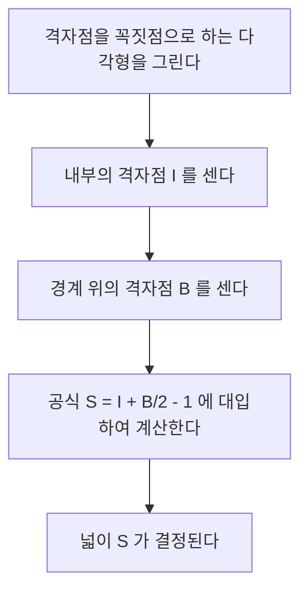
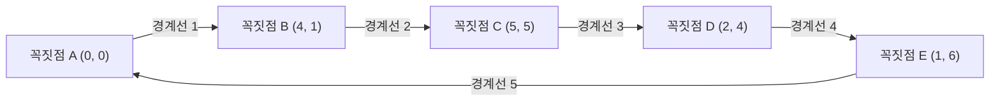

## 1. 머리말

수학의 기하학 분야에서 도형의 넓이를 구하는 주제는 고대 그리스 시대부터 수많은 수학자들에 의해 연구되어 왔습니다. 학교 수업에서는 삼각형의 넓이를 구하기 위한 "밑변 $\times$ 높이 $\div 2$"라는 기본적인 공식에서 시작하여, 고등학교 수학이 되면 삼각비를 이용한 넓이 공식, 좌표 평면상에서 벡터의 외적을 이용한 사선 공식, 나아가 세 변의 길이만으로 넓이를 도출하는 헤론의 공식 등 다양한 접근법을 배웁니다.

하지만 만약 다각형의 모든 꼭짓점이 **격자점** ( $x$ 좌표와 $y$ 좌표가 모두 정수인 점) 위에 존재한다면, 길이를 재거나 복잡한 곱셈이나 제곱근의 계산을 하지 않고도 극히 단순한 사칙연산만으로 넓이를 산출할 수 있는 마법 같은 공식이 존재합니다. 그것이 바로 이번에 자세히 해설할 **[픽의 정리](https://kenji.blog/ko/p/picks-theorem/) ([Pick's Theorem](https://kenji.blog/ko/p/picks-theorem/))** 입니다.

[픽의 정리](https://kenji.blog/ko/p/picks-theorem/)는 단순히 "넓이를 쉽게 구할 수 있는 편리하고 신기한 공식"일 뿐만 아니라, 현대 수학에서의 위상수학(토폴로지)이나 그래프 이론, 그리고 대수기하학으로 이어지는 매우 깊은 배경을 가지고 있습니다. 이 글에서는 [픽의 정리](https://kenji.blog/ko/p/picks-theorem/)의 기본적인 사용법부터, 왜 이런 단순한 공식이 성립하는지 그 수학적 증명, 역사적 배경, 그리고 정리가 가지는 한계와 3차원으로의 확장 가능성에 이르기까지 다각도로 깊이 있게 파헤쳐 해설해 보겠습니다.

## 2. 게오르그 알렉산더 픽과 역사적 배경

[픽의 정리](https://kenji.blog/ko/p/picks-theorem/)에 대해 본격적으로 해설하기 전에, 이 아름다운 정리를 발견한 인물과 그 시대적 배경에 대해 잠시 짚고 넘어갑시다.

이 정리는 오스트리아 출신의 수학자 **게오르그 알렉산더 픽 (Georg Alexander Pick, 1859-1942)** 에 의해 1899년에 발표되었습니다. 그는 빈 대학교에서 수학을 공부하고, 훗날 프라하의 독일 대학교(현재의 프라하 카렐 대학교)에서 오랫동안 교수로 재직했습니다.

흥미롭게도, 픽은 그 유명한 알베르트 아인슈타인과도 깊은 관계가 있었습니다. 아인슈타인이 1911년 프라하의 대학에 부임했을 때 그를 크게 환영했으며, 학문적인 논의뿐만 아니라 함께 바이올린을 연주하는 등 깊은 교우 관계를 맺은 것이 픽이었습니다. 픽은 아인슈타인에게 일반 상대성 이론을 구축하는 데 필수 불가결한 "텐서 해석"과 "리만 기하학"을 배우도록 강력히 권유한 인물 중 한 명이라고도 전해집니다.

하지만 픽의 말년은 매우 비극적이었습니다. 유대계였던 그는 나치 독일의 대두로 박해를 받아, 1942년 테레지엔슈타트 강제 수용소로 이송되었고, 그로부터 불과 2주일 후에 82세의 나이로 세상을 떠났습니다. 그의 생애는 슬픈 결말을 맞이했지만, 그가 남긴 "[픽의 정리](https://kenji.blog/ko/p/picks-theorem/)"는 그 아름다움과 단순함 덕분에 오늘날에도 전 세계의 수학 교육 현장에서 계속해서 사랑받고 있습니다.

## 3. [픽의 정리](https://kenji.blog/ko/p/picks-theorem/)란?

그러면 [픽의 정리](https://kenji.blog/ko/p/picks-theorem/)의 핵심으로 들어가 보겠습니다. 정리의 주장은 놀라울 정도로 단순하여, 초등학생도 이해할 수 있는 내용입니다.

평면상에 일정한 간격으로 가로세로로 늘어선 격자점(모눈종이의 교차점 같은 것)이 있다고 가정합시다. 그 격자점 중 몇 개를 직선으로 연결하여, 자기 교차가 없는 "구멍 없는 다각형 (단순 다각형)"을 그렸다고 합시다. 이때, 그려진 다각형의 넓이 $S$ 는 다각형의 **내부에 있는 격자점의 수** 와, **경계선 위에 있는 격자점의 수** 만으로 완전히 결정된다는 것이 정리의 내용입니다.

수식으로 표현하면 다음과 같습니다.

$$
S = I + \frac{B}{2} - 1
$$

- $S$ : 다각형의 넓이
- $I$ (Interior) : 다각형의 **내부에 있는 격자점의 수**
- $B$ (Boundary) : 다각형의 **경계선 위에 있는 격자점의 수** (물론, 꼭짓점 자신도 여기에 포함됩니다)

이 공식의 가장 놀라운 점은, 다각형이 아무리 복잡한 모양(예를 들어, 톱니 모양의 별형이나 극단적으로 가늘고 긴 형태)이더라도, 꼭짓점이 격자점 위에 있고 자기 교차나 구멍이 없기만 하면 **예외 없이 항상 성립한다** 는 사실입니다. 도형의 각도나 변의 길이를 전혀 고려할 필요가 없다는 점에서 직관에 반하는 듯한 신기한 매력을 가지고 있습니다.

아래의 플로차트는 [픽의 정리](https://kenji.blog/ko/p/picks-theorem/)를 이용하여 넓이를 구하는 절차를 시각적으로 보여줍니다.



## 4. 구체적인 예로 정리의 위력을 확인하다

수식만 보아서는 실감이 나지 않을 수도 있습니다. 실제로 몇 가지 구체적인 도형을 통해 [픽의 정리](https://kenji.blog/ko/p/picks-theorem/)가 정말로 올바른 넓이를 도출해 낼 수 있는지 확인해 봅시다.

### 구체적인 예 1: 단순한 직사각형

가장 기본적인 도형으로서, 꼭짓점이 $(0, 0), (5, 0), (5, 3), (0, 3)$ 에 있는 직사각형을 생각해 봅시다.

- **일반적인 방법을 통한 넓이 계산** : 가로의 길이가 $5$, 세로의 길이가 $3$ 이므로 넓이는 $5 \times 3 = 15$ 가 됩니다.
- **내부의 격자점 $I$ 의 수** : 직사각형의 내부에 있는 점은, $x$ 좌표가 $1, 2, 3, 4$ 이고 $y$ 좌표가 $1, 2$ 인 조합이 됩니다. 따라서 $4 \times 2 = 8$ 개의 점이 내부에 존재합니다 ( $I = 8$ ).
- **경계 위의 격자점 $B$ 의 수** : 아래쪽 변 위에 $6$ 개(양끝 포함), 위쪽 변 위에 $6$ 개. 좌우 변 위에는 네 모서리의 꼭짓점을 제외하면 각각 $2$ 개씩의 점이 있습니다. 합계하면 $6 + 6 + 2 + 2 = 16$ 개가 됩니다 ( $B = 16$ ).

이것을 [픽의 정리](https://kenji.blog/ko/p/picks-theorem/) 공식에 대입해 봅시다.

$$
S = 8 + \frac{16}{2} - 1 = 8 + 8 - 1 = 15
$$

일반적인 계산 결과인 $15$ 와 멋지게 일치했습니다.

### 구체적인 예 2: 직각삼각형

다음으로, 대각선 접근이 포함된 직각삼각형으로 시험해 보겠습니다. 꼭짓점이 $(0, 0), (6, 0), (0, 4)$ 에 있는 직각삼각형입니다.

- **일반적인 방법을 통한 넓이 계산** : 밑변이 $6$, 높이가 $4$ 이므로 넓이는 $\frac{6 \times 4}{2} = 12$ 입니다.
- **내부의 격자점 $I$ 의 수** : 그림을 그려 신중하게 세어보면, $(1, 1), (1, 2), (2, 1), (2, 2), (3, 1), (4, 1)$ 등 합계 $7$ 개의 격자점이 삼각형의 내부에 존재합니다 ( $I = 7$ ).
- **경계 위의 격자점 $B$ 의 수** : 밑변 위에 $7$ 개 ( $(0,0)$ 에서 $(6,0)$ 까지), 높이의 변 위에 $5$ 개 ( $(0,0)$ 에서 $(0,4)$ 까지). 빗변은 점 $(0, 4)$ 와 $(6, 0)$ 을 잇는 선분입니다. 이 선분 위의 격자점은, $x$ 가 $3$ 늘어날 때마다 $y$ 가 $2$ 줄어들기 때문에, $(3, 2)$ 라는 격자점을 통과합니다. 네 모서리 등의 중복을 피하여 정확하게 세어 올리면, 전부해서 $12$ 개의 점이 경계선 위에 있습니다 ( $B = 12$ ).

공식에 대입하면,

$$
S = 7 + \frac{12}{2} - 1 = 7 + 6 - 1 = 12
$$

역시 정확하게 일치합니다.

### 구체적인 예 3: 움푹 파인 복잡한 다각형

더욱 복잡한, 움푹 파인 곳이 있는 다각형에서도 [픽의 정리](https://kenji.blog/ko/p/picks-theorem/)는 위력을 발휘합니다.



이러한 복잡한 도형의 경우, 기존의 계산 방법으로는 도형을 여러 개의 삼각형이나 직사각형으로 분할하거나, 도형 전체를 푹 감싸는 큰 직사각형에서 남는 부분의 넓이를 빼는 등 매우 번거로운 작업이 필요하게 됩니다. 계산 실수도 일어나기 쉽습니다.

하지만 [픽의 정리](https://kenji.blog/ko/p/picks-theorem/)를 사용하면, 도형의 내부에 있는 점을 하나하나 세어 올리고, 경계선 위의 점을 세는 것만으로, 순식간에 정확한 넓이를 계산할 수 있는 것입니다. 이것은 그야말로 경이롭다고 할 수 있습니다.

## 5. [오일러의 다면체 정리](https://kenji.blog/ko/p/eulers-polyhedron-formula/)를 이용한 증명

왜 이처럼 마법 같은 공식이 성립하는 것일까요? [픽의 정리](https://kenji.blog/ko/p/picks-theorem/)의 증명에는 여러 가지 방법이 있지만, 여기에서는 그래프 이론의 유명한 정리인 **[오일러의 다면체 정리](https://kenji.blog/ko/p/eulers-polyhedron-formula/) (Euler's Polyhedral Formula)** 를 이용한, 매우 우아한 증명 아이디어를 소개합니다.

오일러의 정리에 따르면, 평면상에 그려진 연결된 그래프(네트워크)에 대해, 꼭짓점의 수를 $V$ , 변의 수를 $E$ , 면의 수를 $F$ 라고 했을 때, 다음의 관계식이 성립합니다.

$$
V - E + F = 2
$$

(여기서의 $F$ 에는 그래프의 바깥쪽으로 펼쳐지는 무한히 넓은 영역도 하나의 면으로 카운트됩니다.)

### 다각형을 삼각형으로 분할하기

먼저, 넓이를 구하고자 하는 대상 다각형 $P$ 를 생각합니다. 이 다각형의 내부 및 경계 위에 있는 모든 격자점을 꼭짓점으로 하고, 격자점끼리 선으로 연결하여, 다각형 $P$ 의 내부를 작은 "기본 삼각형"으로 가득 채우도록 분할(삼각 분할)합니다.
기본 삼각형이란, 그 내부에도 경계선 위의 변 위에도, 꼭짓점 이외의 격자점을 일절 포함하지 않는 삼각형을 말합니다. 이러한 기본 삼각형의 넓이는 예외 없이 모두 $\frac{1}{2}$ 이 됩니다.

이 분할에 의해 생긴 그물망 모양을 하나의 평면 그래프로 간주합니다. 이 그래프에 대해 다음의 기호를 정의합니다.
- $I$ : 다각형 내부의 격자점의 수
- $B$ : 다각형 경계 위의 격자점의 수
- $V$ : 그래프의 총 꼭짓점 수. 명백히 $V = I + B$ 입니다.
- $E$ : 그래프의 총 변의 수.
- $f$ : 다각형 내부에 생긴 기본 삼각형의 면의 수.
- 바깥쪽의 면 ( $1$ 개) 을 포함하기 때문에, 오일러의 정리에서의 면의 총수는 $F = f + 1$ 이 됩니다.

오일러의 공식을 이 그래프에 적용하면,
$$
(I + B) - E + (f + 1) = 2
$$
즉,
$$
I + B - E + f = 1 \quad \text{--- (식 1)}
$$
이 됩니다.

### 내각의 합에 주목하기

다음으로, 그래프 내의 모든 삼각형의 내각의 합을 $2$ 가지의 다른 방법으로 계산하여 등식을 만듭니다.

**방법 1: 삼각형의 수로부터 계산하기**
다각형 $P$ 는 $f$ 개의 기본 삼각형으로 분할되어 있습니다. 하나의 삼각형의 내각의 합은 $180^\circ$ ( $\pi$ 라디안) 입니다. 따라서 모든 기본 삼각형의 내각의 합의 총계는 $f \times \pi$ 가 됩니다.

**방법 2: 꼭짓점 주변의 각도로부터 계산하기**
내각의 합을, 각각의 꼭짓점에 모이는 각도의 합으로서 다시 집계합니다.
- **내부의 격자점 ( $I$ 개)** : 각 점의 주변에는 빙 둘러서 $360^\circ$ ( $2\pi$ 라디안) 분의 각도가 모여 있습니다. 따라서 합계는 $2\pi \times I$ 입니다.
- **경계 위의 격자점 ( $B$ 개)** : 경계 위의 점에서의 다각형 안쪽 각도의 합계는 얼마일까요? 임의의 $n$ 각형의 내각의 합은 $(n - 2) \times \pi$ 입니다. 여기서는 경계 위의 점이 $B$ 개 있으므로, 이것은 $B$ 각형으로 간주할 수 있고, 그 내각의 합은 $(B - 2) \times \pi$ 가 됩니다.

이 두 가지 방법으로 구한 각도의 총합은 같아야 하므로, 다음 식이 성립합니다.

$$
f \times \pi = 2\pi \times I + (B - 2) \times \pi
$$

양변을 $\pi$ 로 나누면, 매우 단순한 식을 얻을 수 있습니다.

$$
f = 2I + B - 2 \quad \text{--- (식 2)}
$$

### 넓이의 산출

처음에 말했듯이, $f$ 개의 기본 삼각형의 넓이는 모두 $\frac{1}{2}$ 입니다. 따라서 다각형 전체의 넓이 $S$ 는 기본 삼각형의 넓이의 합이며, 다음과 같이 나타낼 수 있습니다.

$$
S = \frac{f}{2}
$$

여기에 앞서 구한 (식 2) 를 대입하면,

$$
S = \frac{2I + B - 2}{2} = I + \frac{B}{2} - 1
$$

멋지게 [픽의 정리](https://kenji.blog/ko/p/picks-theorem/)가 도출되었습니다! 토폴로지의 기초인 오일러의 정리와, 기하학의 기초인 내각의 합이 멋지게 융합하여 이 아름다운 공식이 증명되는 것입니다.

## 6. 구멍이 있는 다각형으로의 응용

[픽의 정리](https://kenji.blog/ko/p/picks-theorem/)는 "구멍이 없는 단순 다각형"임을 전제로 하고 있지만, 만약 다각형 안에 구멍이 뚫려 있는 경우는 어떻게 될까요?

예를 들어, 도넛처럼 바깥쪽 다각형 안에 완전히 포함되는 안쪽 다각형(구멍)이 파여 있는 도형을 상상해 보십시오. 이러한 도형에 대해서는 픽의 공식을 그대로는 성립하지 않습니다. 하지만 구멍의 수에 따라 정리를 보정함으로써 넓이를 구하는 것이 가능합니다.

다각형 안에 독립된 구멍이 $h$ 개 있는 경우, 일반화된 [픽의 정리](https://kenji.blog/ko/p/picks-theorem/)의 공식은 다음과 같이 됩니다.

$$
S = I + \frac{B}{2} - 1 + h
$$

여기서의 $I$ 는, 다각형의 내부(구멍 부분은 포함하지 않는 실체 부분)에 있는 격자점만을 셉니다. 또한 $B$ 는 바깥쪽 경계선 위의 격자점뿐만 아니라, 구멍의 안쪽 경계선 위에 있는 격자점도 모두 합계한 수를 나타냅니다.

구멍이 $1$ 개 늘어날 때마다 공식의 마지막에 $+1$ 이 추가되어 간다는 성질은, 기하학에서의 오일러 표수(Euler characteristic)와 깊게 관계되어 있으며, 공간의 연속적인 변형(토폴로지)에서 매우 중요한 의미를 가지고 있습니다.

## 7. 3차원으로의 확장과 에르하르트 다항식

평면(2차원)에서 이토록 아름답고 강력한 공식이 존재한다면, "3차원 공간의 입체 도형(다면체)의 부피도 내부와 표면의 격자점의 수만으로 계산할 수 있는 공식이 있지 않을까?"라고 생각하는 것은 수학자로서 지극히 자연스러운 발상입니다.

하지만 놀랍게도, **3차원 공간에서 [픽의 정리](https://kenji.blog/ko/p/picks-theorem/)의 직접적인 확장은 존재하지 않는다** 는 것이 증명되어 있습니다. 즉, 내부의 격자점 수와 표면의 격자점 수만으로부터 부피를 유일하게 결정하는 수식을 만드는 것은 불가능한 것입니다.

### 반례: 리브의 사면체 (Reeve tetrahedron)

그 불가능함을 증명한 것이 1957년 영국의 수학자 존 리브가 제시한 "리브의 사면체"라는 반례입니다.
리브는 다음의 4개의 꼭짓점을 가지는 사면체(삼각뿔)를 생각했습니다.

- 꼭짓점 1: $(0, 0, 0)$
- 꼭짓점 2: $(1, 0, 0)$
- 꼭짓점 3: $(0, 1, 0)$
- 꼭짓점 4: $(1, 1, r)$ (여기서 $r$ 은 임의의 양의 정수)

이 사면체에 대해 조사해 보면, 내부의 격자점의 수는 항상 $0$ 입니다. 또한 표면 위의 격자점도, 꼭짓점인 4개의 점을 제외하고는 일절 존재하지 않습니다. 즉, $r$ 이 $1$ 이든 $100$ 이든 $10000$ 이든, 이 사면체가 포함하는 격자점의 총수는 항상 " $4$ 개"로 완전히 일정한 것입니다.

하지만 이 사면체의 부피를 계산하면 $\frac{r}{6}$ 이 됩니다.
이것은 격자점의 수가 완전히 동일하더라도 $r$ 의 값을 바꿈으로써 부피를 얼마든지 크게 할 수 있다는 것을 의미합니다. 따라서 "격자점의 수"라는 정보만으로 "부피"를 역산하는 것은 원리적으로 불가능함이 증명된 것입니다.

### 에르하르트 다항식으로의 승화

[픽의 정리](https://kenji.blog/ko/p/picks-theorem/)를 직접 3차원으로 확장할 수는 없었지만, 이 문제는 결코 여기서 끝나지 않았습니다. 프랑스의 수학자 외젠 에르하르트는 접근 방식을 바꿈으로써 새로운 이론을 수립했습니다.

그는 "도형의 크기를 정수 $t$ 배로 확대했을 때, 그 도형에 포함되는 격자점의 수가 어떻게 변화하는지"를 연구했습니다. 꼭짓점이 격자점 위에 있는 $d$ 차원의 다면체 $P$ 를 $t$ 배 확대하여 얻은 도형 $tP$ 에 포함되는 격자점의 수를 $L(P, t)$ 라고 했을 때, 에르하르트는 이 $L(P, t)$ 가 $t$ 에 대한 $d$ 차 다항식이 됨을 증명했습니다. 이것이 **에르하르트 다항식 (Ehrhart polynomial)** 입니다.

2차원인 경우의 에르하르트 다항식은 바로 [픽의 정리](https://kenji.blog/ko/p/picks-theorem/) 그 자체를 일반화한 형태가 되어 있으며, 3차원 이상의 고차원 공간에서의 격자점과 부피의 관계를 밝혀내기 위한 극히 중요한 도구로서, 현대의 대수기하학이나 조합론에서 활발하게 연구되고 있습니다.

## 8. 프로그램을 통한 구현

[픽의 정리](https://kenji.blog/ko/p/picks-theorem/)를 이용하여 넓이를 계산하는 단순한 프로그램을 Python 으로 구현해 보겠습니다. 실제로는 다각형의 꼭짓점 좌표가 주어졌을 때, 경계 위의 격자점 $B$ 와 내부의 격자점 $I$ 를 세어 올려야 합니다.

경계 위의 선분 상의 격자점의 수는 선분 양끝의 $x$ 좌표의 차이의 절댓값과 $y$ 좌표의 차이의 절댓값의 **최대공약수 (GCD)** 를 이용하여 구할 수 있습니다.

```python
import math

def get_boundary_points(polygon):
    """
    다각형의 꼭짓점 좌표의 리스트를 받아, 경계 위의 격자점의 수 B 를 반환한다.
    polygon: [(x1, y1), (x2, y2), ..., (xn, yn)]
    """
    B = 0
    n = len(polygon)
    for i in range(n):
        x1, y1 = polygon[i]
        x2, y2 = polygon[(i + 1) % n]  # 다음 꼭짓점 (마지막은 처음으로 돌아감)
        
        # 선분 위의 격자점 수는 dx 와 dy 의 최대공약수와 같다 (양끝점 중 하나를 포함)
        dx = abs(x1 - x2)
        dy = abs(y1 - y2)
        B += math.gcd(dx, dy)
        
    return B

# 넓이를 구하려면 별도로 전체의 넓이를 외적 등으로 구하거나,
# I 를 우직하게 카운트할 필요가 있습니다.
# 여기서는 예시로서 B 와 I 를 직접 지정하여 넓이를 계산하는 함수를 나타냅니다.

def picks_theorem(I, B):
    """
    내부의 격자점 I 와 경계 위의 격자점 B 로부터 넓이 S 를 계산한다
    """
    return I + B / 2.0 - 1.0

# 실행 예
interior_points = 7
boundary_points = 12
area = picks_theorem(interior_points, boundary_points)
print(f"내부의 점: {interior_points}, 경계의 점: {boundary_points}")
print(f"계산된 넓이: {area}")
```

이와 같이 알고리즘으로 구성할 때에도, [픽의 정리](https://kenji.blog/ko/p/picks-theorem/)의 공식 자체는 지극히 단순한 계산식으로 표현됩니다.

## 9. 마무리

[픽의 정리](https://kenji.blog/ko/p/picks-theorem/)는 다음과 같은 놀라운 특징을 가지는 아름다운 수학의 정리입니다.

1. **극한까지 단순한 공식** : $S = I + \frac{B}{2} - 1$ 이라는, 덧셈과 나눗셈만 있는 식 하나로 넓이를 구할 수 있습니다.
2. **길이를 잴 필요가 없다** : 자의 눈금이나 각도를 재는 각도기는 일절 불필요하며, 단지 "점을 센다"는 원시적인 행위만으로 넓이가 결정됩니다.
3. **깊은 수학적 배경** : 오일러의 정리로부터 도출 가능하며, 에르하르트 다항식이라는 고도의 현대 수학으로 들어가는 입구가 되기도 합니다.

모눈종이나 도트 노트에 다각형을 그렸을 때는, 꼭 이 정리를 떠올려서 실제로 점을 세어 넓이를 계산해 보시기 바랍니다. 언뜻 무관해 보이는 "격자점"과 "넓이"가 멋지게 연결되는 순간은, 수학이라는 학문이 가지는 퍼즐 같은 재미와 깊이를 우리에게 선명하게 제시해 줄 것입니다.
