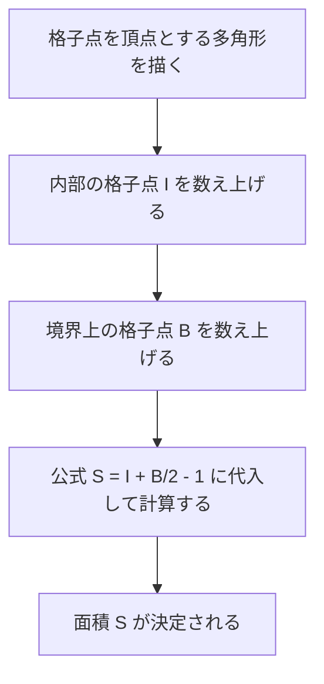
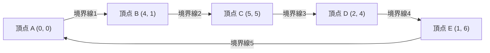

## 1. はじめに

数学における幾何学の分野において、図形の面積を求めるというテーマは、古代ギリシャの時代から数多くの数学者たちによって研究されてきました。学校の授業では、三角形の面積を求めるための「底辺 $\times$ 高さ $\div 2$」という基本的な公式から始まり、高校数学になると三角比を用いた面積公式、座標平面上でのベクトルの外積を用いたサラスの公式、さらには三辺の長さのみから面積を導き出すヘロンの公式など、多様なアプローチを学びます。

しかし、もし多角形の頂点がすべて **格子点** （ $x$ 座標と $y$ 座標がともに整数であるような点）上に存在する場合、長さを測ったり、複雑な掛け算や平方根の計算を行ったりすることなく、極めてシンプルな四則演算のみで面積を算出できる魔法のような公式が存在します。それが、今回詳しく解説する **ピックの定理 (Pick's Theorem)** です。

ピックの定理は、単に「面積を簡単に求められる便利で不思議な公式」というだけでなく、現代数学におけるトポロジー（位相幾何学）やグラフ理論、そして代数幾何学へとつながる非常に深い背景を持っています。この記事では、ピックの定理の基本的な使い方から、なぜこのような単純な公式が成り立つのかという数学的証明、歴史的背景、そして定理の持つ限界と3次元への拡張可能性に至るまで、多角的に深く掘り下げて解説していきます。

## 2. ゲオルグ・アレクサンダー・ピックと歴史的背景

ピックの定理について本格的に解説する前に、この美しい定理を発見した人物とその時代背景について少し触れておきましょう。

この定理は、オーストリア出身の数学者 **ゲオルグ・アレクサンダー・ピック (Georg Alexander Pick, 1859-1942)** によって1899年に発表されました。彼はウィーン大学で数学を学び、後にプラハのドイツ大学（現在のプラハ・カレル大学）で長年にわたり教授を務めました。

興味深いことに、ピックはあのアルベルト・アインシュタインとも深い関わりがありました。アインシュタインが1911年にプラハの大学に着任した際、彼を大いに歓迎し、学問的な議論だけでなく、共にヴァイオリンを演奏するなど親深い交友関係を築いたのがピックでした。ピックはアインシュタインに対して、一般相対性理論を構築するために必要不可欠となる「テンソル解析」や「リーマン幾何学」を学ぶよう強く勧めた人物の一人だとも言われています。

しかし、ピックの晩年は非常に悲劇的なものでした。ユダヤ系であった彼は、ナチス・ドイツの台頭により迫害を受け、1942年にテレージエンシュタット強制収容所へと送られ、そのわずか2週間後に82歳でこの世を去りました。彼の生涯は悲しい結末を迎えましたが、彼が残した「ピックの定理」は、その美しさとシンプルさゆえに、今日でも世界中の数学教育の現場で愛され続けています。

## 3. ピックの定理とは

それでは、ピックの定理の核心に入っていきましょう。定理の主張は驚くほどシンプルで、小学生でも理解できる内容です。

平面上に等間隔で縦横に並んだ格子点（グラフ用紙の交点のようなもの）があるとします。その格子点のいくつかを直線で結び、自己交差を持たない「穴のない多角形（単純多角形）」を描いたとします。このとき、描かれた多角形の面積 $S$ は、多角形の **内部にある格子点の数** と、 **境界線上にある格子点の数** だけで完全に決定される、というのが定理の内容です。

数式で表すと以下のようになります。

$$
S = I + \frac{B}{2} - 1
$$

- $S$ ：多角形の面積 (Area)
- $I$ （Interior）：多角形の **内部にある格子点の数**
- $B$ （Boundary）：多角形の **境界線上にある格子点の数** （もちろん、頂点自身もこれに含まれます）

この公式の最も驚くべき点は、多角形がどれほど複雑な形状（例えば、ギザギザした星型や、極端に細長い形状）であっても、頂点が格子点上にあり、自己交差や穴がなければ、 **例外なく常に成立する** という事実です。図形の角度や辺の長さを一切考慮する必要がないという点で、直感に反するような不思議な魅力を持っています。

以下のフローチャートは、ピックの定理を用いて面積を求める手順を視覚的に示したものです。



## 4. 具体例で定理の威力を確認する

数式だけを見ても実感が湧きにくいかもしれません。実際にいくつかの具体的な図形で、ピックの定理が本当に正しい面積を導き出せるのかを確認してみましょう。

### 具体例1：シンプルな長方形

最も基本的な図形として、頂点が $(0, 0), (5, 0), (5, 3), (0, 3)$ にある長方形を考えてみましょう。

- **一般的な方法での面積計算** ：横の長さが $5$、縦の長さが $3$ なので、面積は $5 \times 3 = 15$ となります。
- **内部の格子点 $I$ の数** ：長方形の内部にある点は、 $x$ 座標が $1, 2, 3, 4$ 、 $y$ 座標が $1, 2$ の組み合わせになります。したがって、 $4 \times 2 = 8$ 個の点が内部に存在します（ $I = 8$ ）。
- **境界上の格子点 $B$ の数** ：下の辺上に $6$ 個（両端を含む）、上の辺上に $6$ 個。左右の辺上には、四隅の頂点を除くとそれぞれ $2$ 個ずつ点があります。合計すると $6 + 6 + 2 + 2 = 16$ 個となります（ $B = 16$ ）。

これをピックの定理の公式に当てはめてみます。

$$
S = 8 + \frac{16}{2} - 1 = 8 + 8 - 1 = 15
$$

通常の計算結果である $15$ と見事に一致しました。

### 具体例2：直角三角形

次に、斜めのアプローチが含まれる直角三角形で試してみます。頂点が $(0, 0), (6, 0), (0, 4)$ にある直角三角形です。

- **一般的な方法での面積計算** ：底辺が $6$、高さが $4$ なので、面積は $\frac{6 \times 4}{2} = 12$ です。
- **内部の格子点 $I$ の数** ：図を描いて慎重に数えると、 $(1, 1), (1, 2), (2, 1), (2, 2), (3, 1), (4, 1)$ など、合計 $7$ 個の格子点が三角形の内部に存在します（ $I = 7$ ）。
- **境界上の格子点 $B$ の数** ：底辺上には $7$ 個（ $(0,0)$ から $(6,0)$ まで）、高さの辺上には $5$ 個（ $(0,0)$ から $(0,4)$ まで）。斜辺は点 $(0, 4)$ と $(6, 0)$ を結ぶ線分です。この線分上の格子点は、 $x$ が $3$ 増えるごとに $y$ が $2$ 減るため、 $(3, 2)$ という格子点を通ります。四隅等の重複を避けて正確に数え上げると、全部で $12$ 個の点が境界線上にあります（ $B = 12$ ）。

公式に当てはめると、

$$
S = 7 + \frac{12}{2} - 1 = 7 + 6 - 1 = 12
$$

やはり、正確に一致します。

### 具体例3：凹みのある複雑な多角形

さらに複雑な、凹みを持つ多角形でもピックの定理は威力を発揮します。



このような複雑な図形の場合、従来の計算方法では、図形を複数の三角形や長方形に分割したり、図形全体をすっぽり囲む大きな長方形から余分な部分の面積を引き算したりといった、非常に面倒な作業が必要になります。計算ミスも起きやすくなります。

しかしピックの定理を使えば、図形の内部にある点をポチポチと数え上げ、境界線上の点を数えるだけで、一瞬にして正確な面積が計算できるのです。これはまさに驚異的と言えるでしょう。

## 5. オイラーの多面体定理を用いた証明

なぜこのような魔法のような公式が成り立つのでしょうか。ピックの定理の証明にはいくつかの方法がありますが、ここではグラフ理論における有名な定理である **オイラーの多面体定理 (Euler's Polyhedral Formula)** を用いた、非常にエレガントな証明のアイディアを紹介します。

オイラーの定理によれば、平面上に描かれた連結なグラフ（ネットワーク）について、頂点の数を $V$ 、辺の数を $E$ 、面の数を $F$ としたとき、以下の関係式が成り立ちます。

$$
V - E + F = 2
$$

（ここでの $F$ には、グラフの外側に広がる無限に広い領域も一つの面としてカウントされます。）

### 多角形を三角形に分割する

まず、面積を求めたい対象の多角形 $P$ を考えます。この多角形の内部および境界上にあるすべての格子点を頂点とし、格子点同士を結んで、多角形 $P$ の内部を小さな「基本三角形」で埋め尽くすように分割（三角分割）します。
基本三角形とは、その内部にも境界線上の辺上にも、頂点以外の格子点を一切含まないような三角形のことです。このような基本三角形の面積は、例外なくすべて $\frac{1}{2}$ になります。

この分割によってできた網目模様を一つの平面グラフとみなします。このグラフについて、以下の記号を定義します。
- $I$ ：多角形内部の格子点の数
- $B$ ：多角形境界上の格子点の数
- $V$ ：グラフの全頂点数。明らかに $V = I + B$ です。
- $E$ ：グラフの全辺の数。
- $f$ ：多角形内部にできた基本三角形の面の数。
- 外側の面（ $1$ つ）を含めるため、オイラーの定理における面の総数は $F = f + 1$ となります。

オイラーの公式をこのグラフに適用すると、
$$
(I + B) - E + (f + 1) = 2
$$
すなわち、
$$
I + B - E + f = 1 \quad \text{--- (式1)}
$$
となります。

### 内角の和に注目する

次に、グラフ内のすべての三角形の内角の和を $2$ 種類の異なる方法で計算し、等式を作ります。

**方法1：三角形の数から計算する**
多角形 $P$ は $f$ 個の基本三角形に分割されています。一つの三角形の内角の和は $180^\circ$ （ $\pi$ ラジアン）です。したがって、すべての基本三角形の内角の和の合計は $f \times \pi$ となります。

**方法2：頂点の周囲の角度から計算する**
内角の和を、それぞれの頂点に集まる角度の和として集計し直します。
- **内部の格子点（ $I$ 個）** ：各点の周囲にはぐるりと $360^\circ$ （ $2\pi$ ラジアン）分の角度が集まっています。よって合計は $2\pi \times I$ です。
- **境界上の格子点（ $B$ 個）** ：境界上の点における多角形の内側の角度の合計はいくらでしょうか。任意の $n$ 角形の内角の和は $(n - 2) \times \pi$ です。ここでは境界上の点が $B$ 個あるので、これは $B$ 角形とみなすことができ、その内角の和は $(B - 2) \times \pi$ となります。

この2つの方法で求めた角度の総和は等しくなければならないので、次の式が成り立ちます。

$$
f \times \pi = 2\pi \times I + (B - 2) \times \pi
$$

両辺を $\pi$ で割ると、非常にシンプルな式が得られます。

$$
f = 2I + B - 2 \quad \text{--- (式2)}
$$

### 面積の算出

最初に述べたように、 $f$ 個の基本三角形の面積はすべて $\frac{1}{2}$ です。したがって、多角形全体の面積 $S$ は基本三角形の面積の合計であり、次のように表されます。

$$
S = \frac{f}{2}
$$

これに先ほど求めた（式2）を代入すると、

$$
S = \frac{2I + B - 2}{2} = I + \frac{B}{2} - 1
$$

見事にピックの定理が導き出されました！トポロジーの基礎であるオイラーの定理と、幾何学の基礎である内角の和が見事に融合し、この美しい公式が証明されるのです。

## 6. 穴のある多角形への応用

ピックの定理は「穴のない単純多角形」であることを前提としていますが、もし多角形の中に穴が開いている場合はどうなるのでしょうか。

例えば、ドーナツのように、外側の多角形の中に完全に含まれる内側の多角形（穴）がくり抜かれている図形を想像してください。このような図形に対しては、ピックの公式はそのままでは成り立ちません。しかし、穴の数に応じて定理を補正することで、面積を求めることが可能です。

多角形の中に独立した穴が $h$ 個ある場合、一般化されたピックの定理の公式は次のようになります。

$$
S = I + \frac{B}{2} - 1 + h
$$

ここでの $I$ は、多角形の内部（穴の部分は含まない実体部分）にある格子点のみを数えます。また $B$ は、外側の境界線上の格子点だけでなく、穴の内側の境界線上にある格子点もすべて合計した数を表します。

穴が $1$ つ増えるごとに式の最後に $+1$ が追加されていくという性質は、幾何学におけるオイラー標数と深く関係しており、空間の連続的な変形（トポロジー）において非常に重要な意味を持っています。

## 7. 3次元への拡張とエルハート多項式

平面（2次元）においてこれほど美しく強力な公式が存在するならば、「3次元空間の立体図形（多面体）の体積も、内部と表面の格子点の数だけで計算できる公式があるのではないか？」と考えるのは、数学者として極めて自然な発想です。

しかし驚くべきことに、 **3次元空間においてピックの定理の直接的な拡張は存在しない** ことが証明されています。つまり、内部の格子点数と表面の格子点数だけから体積を一意に決定する数式を作ることは不可能なのです。

### 反例：リーヴの四面体 (Reeve tetrahedron)

その不可能であることを証明したのが、1957年にイギリスの数学者ジョン・リーヴが提示した「リーヴの四面体」という反例です。
リーヴは、以下の4つの頂点を持つ四面体（三角錐）を考えました。

- 頂点1： $(0, 0, 0)$
- 頂点2： $(1, 0, 0)$
- 頂点3： $(0, 1, 0)$
- 頂点4： $(1, 1, r)$ （ここで $r$ は任意の正の整数）

この四面体について調べてみると、内部の格子点の数は常に $0$ です。また、表面上の格子点も、頂点である4つの点を除いて一切存在しません。つまり、 $r$ が $1$ であろうと $100$ であろうと、$10000$ であろうと、この四面体が含む格子点の総数は常に「 $4$ 個」で完全に一定なのです。

しかし、この四面体の体積を計算すると $\frac{r}{6}$ となります。
これは、格子点の数が全く同じであっても、 $r$ の値を変えることで体積を無限に大きくすることが可能であることを意味しています。したがって、「格子点の数」という情報だけから「体積」を逆算することは原理的に不可能であることが証明されたのです。

### エルハート多項式への昇華

ピックの定理を直接3次元に拡張することはできませんでしたが、この問題は決してここで終わりませんでした。フランスの数学者ウジェーヌ・エルハートは、アプローチを変えることで新たな理論を打ち立てました。

彼は、「図形の大きさを整数 $t$ 倍に拡大したときに、その図形に含まれる格子点の数がどのように変化するか」を研究しました。頂点が格子点上にある $d$ 次元の多面体 $P$ を $t$ 倍に拡大した図形 $tP$ に含まれる格子点の数を $L(P, t)$ としたとき、エルハートはこの $L(P, t)$ が $t$ についての $d$ 次多項式になることを証明しました。これが **エルハート多項式 (Ehrhart polynomial)** です。

2次元の場合のエルハート多項式は、まさにピックの定理そのものを一般化した形になっており、3次元以上の高次元空間における格子点と体積の関係を解き明かすための極めて重要なツールとして、現代の代数幾何学や組み合わせ論において活発に研究されています。

## 8. プログラムによる実装

ピックの定理を用いて面積を計算する単純なプログラムを Python で実装してみましょう。実際には多角形の頂点座標が与えられたとき、境界上の格子点 $B$ と内部の格子点 $I$ を数え上げる必要があります。

境界上の線分上の格子点の数は、線分の両端の $x$ 座標の差の絶対値と $y$ 座標の差の絶対値の **最大公約数 (GCD)** を用いて求めることができます。

```python
import math

def get_boundary_points(polygon):
    """
    多角形の頂点座標のリストを受け取り、境界上の格子点の数 B を返す。
    polygon: [(x1, y1), (x2, y2), ..., (xn, yn)]
    """
    B = 0
    n = len(polygon)
    for i in range(n):
        x1, y1 = polygon[i]
        x2, y2 = polygon[(i + 1) % n]  # 次の頂点（最後は最初に戻る）
        
        # 線分上の格子点数は、dxとdyの最大公約数に等しい（端点の一方を含む）
        dx = abs(x1 - x2)
        dy = abs(y1 - y2)
        B += math.gcd(dx, dy)
        
    return B

# 面積を求めるには別途全体の面積を外積などで求めるか、
# Iを愚直にカウントする必要があります。
# ここでは例として B と I を直接指定して面積を計算する関数を示します。

def picks_theorem(I, B):
    """
    内部の格子点 I と 境界上の格子点 B から面積 S を計算する
    """
    return I + B / 2.0 - 1.0

# 実行例
interior_points = 7
boundary_points = 12
area = picks_theorem(interior_points, boundary_points)
print(f"内部の点: {interior_points}, 境界の点: {boundary_points}")
print(f"計算された面積: {area}")
```

このように、アルゴリズムとして落とし込む際にも、ピックの定理の公式自体は極めて単純な計算式として表現されます。

## 9. まとめ

ピックの定理は、次のような驚くべき特徴を持つ美しい数学の定理です。

1. **極限までシンプルな公式** ： $S = I + \frac{B}{2} - 1$ という、足し算と割り算だけの式で面積が求まります。
2. **長さを測る必要がない** ：定規の目盛りや角度を測る分度器は一切不要であり、ただ「点を数える」という原始的な行為だけで面積が決定します。
3. **深い数学的背景** ：オイラーの定理から導出可能であり、エルハート多項式という高度な現代数学への入り口ともなっています。

方眼紙やドットノートに多角形を描いたときには、ぜひこの定理を思い出して、実際に点を数えて面積を計算してみてください。一見すると無関係に見える「格子点」と「面積」が見事に結びつく瞬間は、数学という学問が持つパズルのような面白さと奥深さを、私たちに鮮やかに提示してくれます。
