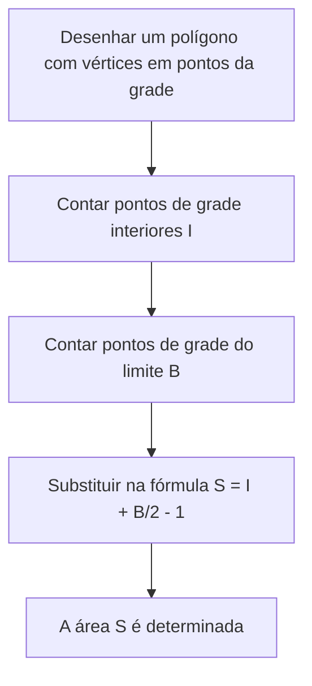
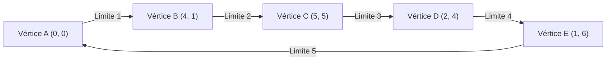

## 1. Introdução

No campo da geometria na matemática, o tema de encontrar a área de uma figura tem sido estudado por muitos matemáticos desde os tempos da Grécia antiga. Nas aulas da escola, aprendemos várias abordagens, começando da fórmula básica para a área de um triângulo, "base $\times$ altura $\div 2$", até fórmulas de área usando razões trigonométricas na matemática do ensino médio, a regra de Sarrus usando o produto vetorial em um plano de coordenadas e até a fórmula de Heron, que deriva a área baseada apenas nos comprimentos dos três lados.

No entanto, se todos os vértices de um polígono se encontrarem em **pontos da grade** (pontos onde ambas as coordenadas $x$ e $y$ são números inteiros), existe uma fórmula mágica que permite calcular a área usando apenas operações aritméticas extremamente simples, sem medir comprimentos ou realizar multiplicações complexas ou cálculos de raiz quadrada. Esse é o **[Teorema de Pick](https://kenji.blog/pt/p/picks-theorem/)**, que explicaremos em detalhes desta vez.

O teorema de Pick não é apenas uma "fórmula conveniente e misteriosa para encontrar a área facilmente", mas tem um pano de fundo muito profundo que se conecta com a topologia, a teoria dos grafos e a geometria algébrica na matemática moderna. Neste artigo, nos aprofundaremos no teorema de Pick de vários ângulos, desde como usá-lo basicamente, até a demonstração matemática de por que uma fórmula tão simples se aplica, seu contexto histórico e até mesmo as limitações do teorema e a possibilidade de sua extensão para 3D.

## 2. Georg Alexander Pick e o Contexto Histórico

Antes de explicar completamente o teorema de Pick, vamos abordar brevemente a pessoa que descobriu este belo teorema e seu contexto histórico.

Este teorema foi publicado em 1899 pelo matemático de origem austríaca **Georg Alexander Pick (1859-1942)**. Ele estudou matemática na Universidade de Viena e mais tarde atuou como professor por muitos anos na Universidade Alemã de Praga (agora Universidade Carolina em Praga).

Curiosamente, Pick tinha uma conexão profunda com o famoso Albert Einstein. Quando Einstein assumiu um cargo na universidade em Praga em 1911, Pick o recebeu calorosamente, e eles construíram uma amizade próxima, não apenas se engajando em discussões acadêmicas, mas também tocando violino juntos. Diz-se que Pick foi uma das pessoas que recomendou fortemente que Einstein estudasse "análise tensorial" e "geometria riemanniana", que se tornaram essenciais para a construção da teoria da relatividade geral.

No entanto, os últimos anos de Pick foram muito trágicos. Sendo de ascendência judaica, ele enfrentou perseguição com a ascensão da Alemanha nazista. Em 1942, ele foi enviado para o campo de concentração de Theresienstadt, onde faleceu apenas duas semanas depois, aos 82 anos. Embora sua vida tenha tido um final triste, o "[Teorema de Pick](https://kenji.blog/pt/p/picks-theorem/)" que ele deixou para trás continua a ser amado na educação matemática em todo o mundo de hoje devido à sua beleza e simplicidade.

## 3. O que é o [Teorema de Pick](https://kenji.blog/pt/p/picks-theorem/)?

Agora, vamos ao cerne do teorema de Pick. A afirmação do teorema é surpreendentemente simples e pode ser compreendida até por alunos do ensino fundamental.

Suponha que existam pontos de grade (como as interseções em papel quadriculado) alinhados vertical e horizontalmente em intervalos iguais em um plano. Suponha que conectemos alguns desses pontos da grade com linhas retas para desenhar um "polígono sem buracos e sem autointerseções (polígono simples)". Neste momento, a área $S$ do polígono desenhado é completamente determinada apenas pelo **número de pontos da grade no interior** do polígono e pelo **número de pontos da grade na linha de limite**, que é o que o teorema afirma.

Expresso como uma fórmula matemática, é da seguinte forma:

$$
S = I + \frac{B}{2} - 1
$$

- $S$ : Área do polígono
- $I$ (Interior) : **Número de pontos da grade no interior** do polígono
- $B$ (Boundary, Limite) : **Número de pontos da grade na linha de limite** do polígono (é claro, os próprios vértices estão incluídos nisso)

O ponto mais surpreendente desta fórmula é o fato de que, não importa quão complexa seja a forma do polígono (por exemplo, uma forma de estrela irregular ou uma forma extremamente alongada), desde que os vértices estejam nos pontos da grade e não haja autointerseções ou buracos, ela **sempre se aplica sem exceção**. Ela tem um apelo misterioso que parece contrariar a intuição no sentido de que não há necessidade de considerar os ângulos da forma ou os comprimentos dos lados de forma alguma.

O fluxograma abaixo mostra visualmente o procedimento para encontrar a área usando o teorema de Pick.



## 4. Confirmando o Poder do Teorema com Exemplos

Pode ser difícil ter uma noção real apenas olhando para a fórmula. Vamos verificar de fato com algumas formas específicas se o teorema de Pick realmente pode derivar a área correta.

### Exemplo 1: Um Retângulo Simples

Como a forma mais básica, consideremos um retângulo cujos vértices estão em $(0, 0), (5, 0), (5, 3), (0, 3)$.

- **Cálculo da área usando um método geral** : Como a largura é $5$ e a altura é $3$, a área é $5 \times 3 = 15$.
- **Número de pontos de grade interiores $I$** : Os pontos dentro do retângulo são combinações onde a coordenada $x$ é $1, 2, 3, 4$ e a coordenada $y$ é $1, 2$. Portanto, há $4 \times 2 = 8$ pontos no interior ( $I = 8$ ).
- **Número de pontos de grade do limite $B$** : Há $6$ pontos na borda inferior (incluindo ambas as extremidades) e $6$ pontos na borda superior. Nas bordas esquerda e direita, excluindo os quatro vértices dos cantos, há $2$ pontos cada. Somando-os, há $6 + 6 + 2 + 2 = 16$ pontos ( $B = 16$ ).

Vamos aplicar isso à fórmula do teorema de Pick.

$$
S = 8 + \frac{16}{2} - 1 = 8 + 8 - 1 = 15
$$

Correspondeu perfeitamente ao resultado do cálculo normal de $15$.

### Exemplo 2: [Tri](https://kenji.blog/pt/p/sorting-algorithms/)ângulo Retângulo

A seguir, vamos tentar com um triângulo retângulo que inclui uma abordagem diagonal. Este é um triângulo retângulo com vértices em $(0, 0), (6, 0), (0, 4)$.

- **Cálculo da área usando um método geral** : Como a base é $6$ e a altura é $4$, a área é $\frac{6 \times 4}{2} = 12$.
- **Número de pontos de grade interiores $I$** : Se você desenhar um diagrama e contá-los com cuidado, há um total de $7$ pontos de grade dentro do triângulo, como $(1, 1), (1, 2), (2, 1), (2, 2), (3, 1), (4, 1)$ ( $I = 7$ ).
- **Número de pontos de grade do limite $B$** : Há $7$ pontos na base (de $(0,0)$ a $(6,0)$), e $5$ pontos na borda da altura (de $(0,0)$ a $(0,4)$). A hipotenusa é o segmento de reta que conecta os pontos $(0, 4)$ e $(6, 0)$. Os pontos da grade neste segmento de reta passam por um ponto de grade como $(3, 2)$ porque $y$ diminui em $2$ toda vez que $x$ aumenta em $3$. Se os contarmos com cuidado, evitando a duplicação nos quatro cantos, há um total de $12$ pontos na linha de limite ( $B = 12$ ).

Aplicando à fórmula,

$$
S = 7 + \frac{12}{2} - 1 = 7 + 6 - 1 = 12
$$

Mais uma vez, coincide exatamente.

### Exemplo 3: Polígono Complexo com Entalhes

O teorema de Pick mostra seu poder mesmo com polígonos mais complexos com reentrâncias.



No caso de uma forma tão complexa, os métodos de cálculo convencionais exigem um trabalho muito tedioso, como dividir a forma em vários triângulos e retângulos, ou subtrair a área de partes em excesso de um grande retângulo que envolva completamente a forma inteira. Erros de cálculo também são prováveis de ocorrer.

No entanto, se você usar o teorema de Pick, poderá calcular a área exata instantaneamente apenas contando os pontos dentro da forma e contando os pontos na linha de limite. Isso realmente pode ser dito como fenomenal.

## 5. Demonstração Usando a Fórmula Poliédrica de Euler

Por que uma fórmula tão mágica se aplica? Existem várias maneiras de provar o teorema de Pick, mas aqui apresentaremos uma ideia de prova elegante usando um teorema famoso na teoria dos grafos, a **Fórmula Poliédrica de Euler**.

De acordo com o teorema de Euler, para um grafo conexo (rede) desenhado em um plano, se o número de vértices for $V$, o número de arestas for $E$ e o número de faces for $F$, a seguinte relação é verdadeira:

$$
V - E + F = 2
$$

(Neste $F$, a região infinitamente grande que se espalha para fora do grafo também é contada como uma face).

### Dividindo o Polígono em [Tri](https://kenji.blog/pt/p/sorting-algorithms/)ângulos

Primeiro, considere o polígono alvo $P$ cuja área você deseja encontrar. Tomando todos os pontos da grade no interior e no limite desse polígono como vértices, e conectando os pontos da grade entre si, dividimos (triangulamos) o interior do polígono $P$ para que ele seja completamente preenchido com pequenos "triângulos primitivos".
Um triângulo primitivo é um triângulo que não contém nenhum ponto de grade além de seus vértices, nem no interior nem nas arestas do seu limite. A área de tais triângulos primitivos é, sem exceção, todos $\frac{1}{2}$.

Consideramos o padrão de malha criado por essa divisão como um único grafo planar. Para este grafo, definimos os seguintes símbolos:
- $I$ : Número de pontos de grade no interior do polígono
- $B$ : Número de pontos de grade no limite do polígono
- $V$ : Número total de vértices no grafo. Obviamente $V = I + B$.
- $E$ : Número total de arestas no grafo.
- $f$ : Número de faces de triângulos primitivos formadas dentro do polígono.
- Como incluímos a face exterior ($1$ face), o número total de faces no teorema de Euler é $F = f + 1$.

Aplicando a fórmula de Euler a este grafo, obtemos
$$
(I + B) - E + (f + 1) = 2
$$
Isto é,
$$
I + B - E + f = 1 \quad \text{--- (Equação 1)}
$$

### Focando na Soma dos Ângulos Internos

A seguir, calculamos a soma dos ângulos internos de todos os triângulos do grafo de $2$ maneiras diferentes e criamos uma equação.

**Método 1: Calcular a partir do número de triângulos**
O polígono $P$ é dividido em $f$ triângulos primitivos. A soma dos ângulos internos de um triângulo é $180^\circ$ ( $\pi$ radianos). Portanto, a soma total dos ângulos internos de todos os triângulos primitivos é $f \times \pi$.

**Método 2: Calcular a partir dos ângulos em torno dos vértices**
Recontamos a soma dos ângulos internos como a soma dos ângulos que se reúnem em cada vértice.
- **Pontos de grade interiores (pontos $I$)** : Ao redor de cada ponto, estão reunidos ângulos no valor total de $360^\circ$ ( $2\pi$ radianos). Assim, o total é $2\pi \times I$.
- **Pontos de grade do limite (pontos $B$)** : Qual é a soma dos ângulos internos do polígono nos pontos do limite? A soma dos ângulos internos de um $n$-ágono arbitrário é $(n - 2) \times \pi$. Aqui, como existem $B$ pontos no limite, isso pode ser considerado um $B$-ágono, e a soma de seus ângulos internos é $(B - 2) \times \pi$.

Como a soma total dos ângulos encontrada por esses dois métodos deve ser igual, a seguinte equação é verdadeira.

$$
f \times \pi = 2\pi \times I + (B - 2) \times \pi
$$

Dividindo ambos os lados por $\pi$, obtemos uma equação muito simples.

$$
f = 2I + B - 2 \quad \text{--- (Equação 2)}
$$

### Cálculo da Área

Como dito no início, a área de todos os $f$ triângulos primitivos é $\frac{1}{2}$. Portanto, a área total $S$ do polígono é a soma das áreas dos triângulos primitivos e pode ser expressa da seguinte forma:

$$
S = \frac{f}{2}
$$

Substituindo a (Equação 2) encontrada anteriormente nisto, obtemos

$$
S = \frac{2I + B - 2}{2} = I + \frac{B}{2} - 1
$$

O teorema de Pick é brilhantemente derivado! O teorema de Euler, o fundamento da topologia, e a soma dos ângulos internos, o fundamento da geometria, fundem-se perfeitamente para provar essa bela fórmula.

## 6. Aplicação a Polígonos com Buracos

O teorema de Pick assume um "polígono simples sem buracos", mas o que acontece se houver um buraco no polígono?

Por exemplo, imagine uma forma como uma rosquinha, onde um polígono interno (buraco) completamente contido dentro do polígono externo é esvaziado. Para tais formas, a fórmula de Pick não se aplica como ela é. No entanto, é possível encontrar a área corrigindo o teorema de acordo com o número de buracos.

Se houver $h$ buracos independentes dentro do polígono, a fórmula para o teorema de Pick generalizado é a seguinte:

$$
S = I + \frac{B}{2} - 1 + h
$$

Aqui, $I$ conta apenas os pontos da grade dentro do polígono (a parte sólida excluindo as partes do buraco). Além disso, $B$ representa a soma não apenas dos pontos da grade na linha de limite externa, mas também todos os pontos da grade na linha de limite interna dos buracos.

A propriedade de que $+1$ é adicionado ao final da fórmula cada vez que um buraco aumenta está profundamente relacionada à característica de Euler na geometria, e tem um significado muito importante na deformação contínua do espaço (topologia).

## 7. Extensão para 3D e Polinômios de Ehrhart

Se uma fórmula tão bela e poderosa existe em um plano (2D), é extremamente natural como matemático pensar: "Não existe uma fórmula que possa calcular o volume de uma figura sólida 3D (poliedro) apenas a partir do número de pontos da grade no interior e na superfície?".

No entanto, surpreendentemente, foi provado que **uma extensão direta do teorema de Pick não existe no espaço tridimensional**. Em outras palavras, é impossível criar uma fórmula matemática que determine exclusivamente o volume apenas a partir do número de pontos da grade internos e do número de pontos da grade da superfície.

### Contraexemplo: Tetraedro de Reeve

A prova desta impossibilidade foi um contraexemplo chamado de "Tetraedro de Reeve", apresentado pelo matemático britânico John Reeve em 1957.
Reeve considerou um tetraedro (pirâmide triangular) tendo os seguintes 4 vértices:

- Vértice 1: $(0, 0, 0)$
- Vértice 2: $(1, 0, 0)$
- Vértice 3: $(0, 1, 0)$
- Vértice 4: $(1, 1, r)$ (onde $r$ é um número inteiro positivo arbitrário)

Ao investigar este tetraedro, o número de pontos de grade no interior é sempre $0$. Além disso, não há absolutamente nenhum ponto de grade na superfície, exceto pelos 4 pontos que são os vértices. Ou seja, seja $r$ $1$, $100$ ou $10000$, o número total de pontos de grade contidos neste tetraedro é sempre constante "$4$ pontos".

No entanto, o volume deste tetraedro é calculado como $\frac{r}{6}$.
Isso significa que mesmo que o número de pontos da grade seja exatamente o mesmo, é possível tornar o volume infinitamente grande mudando o valor de $r$. Portanto, ficou provado que é teoricamente impossível calcular a posteriori o "volume" apenas a partir da informação do "número de pontos da grade".

### Sublimação aos Polinômios de Ehrhart

Embora o teorema de Pick não pudesse ser estendido diretamente para 3D, esse problema não terminou aqui de forma alguma. O matemático francês Eugène Ehrhart estabeleceu uma nova teoria mudando sua abordagem.

Ele estudou "como o número de pontos de grade contidos em uma figura muda quando o tamanho da figura é ampliado por um fator inteiro $t$". Quando $L(P, t)$ é o número de pontos de grade contidos em uma figura $tP$ obtida expandindo um poliedro de $d$-dimensões $P$ cujos vértices estão em pontos da grade por $t$ vezes, Ehrhart provou que esse $L(P, t)$ se torna um polinômio de grau $d$ para $t$. Este é o **polinômio de Ehrhart**.

O polinômio de Ehrhart no caso bidimensional é exatamente a forma generalizada do próprio teorema de Pick, e é ativamente estudado na geometria algébrica moderna e combinatória como uma ferramenta extremamente importante para desvendar a relação entre pontos de grade e volume em espaços de alta dimensão de 3 dimensões e acima.

## 8. Implementação por Programa

Vamos implementar um programa simples em Python que calcula a área usando o teorema de Pick. Na verdade, dadas as coordenadas dos vértices de um polígono, é necessário contar os pontos de grade do limite $B$ e os pontos de grade interiores $I$.

O número de pontos de grade nos segmentos de reta no limite pode ser encontrado usando o **máximo divisor comum (MDC)** do valor absoluto da diferença nas coordenadas $x$ e do valor absoluto da diferença nas coordenadas $y$ das duas extremidades do segmento de reta.

```python
import math

def get_boundary_points(polygon):
    """
    Recebe uma lista de coordenadas de vértices de um polígono e retorna o número de pontos de grade de limite B.
    polygon: [(x1, y1), (x2, y2), ..., (xn, yn)]
    """
    B = 0
    n = len(polygon)
    for i in range(n):
        x1, y1 = polygon[i]
        x2, y2 = polygon[(i + 1) % n]  # Próximo vértice (volta ao primeiro no final)
        
        # O número de pontos de grade no segmento é igual ao máximo divisor comum de dx e dy (incluindo uma das extremidades)
        dx = abs(x1 - x2)
        dy = abs(y1 - y2)
        B += math.gcd(dx, dy)
        
    return B

# Para encontrar a área, você precisa calcular a área total separadamente usando produto vetorial etc.,
# ou contar I de forma ingênua.
# Aqui, como exemplo, mostramos uma função que calcula a área especificando I e B diretamente.

def picks_theorem(I, B):
    """
    Calcula a área S a partir dos pontos de grade interiores I e dos pontos de grade limite B
    """
    return I + B / 2.0 - 1.0

# Exemplo de execução
interior_points = 7
boundary_points = 12
area = picks_theorem(interior_points, boundary_points)
print(f"Pontos interiores: {interior_points}, Pontos de limite: {boundary_points}")
print(f"Área calculada: {area}")
```

Desta forma, mesmo quando detalhado como um algoritmo, a fórmula do próprio teorema de Pick é expressa como uma fórmula de cálculo extremamente simples.

## 9. Conclusão

O teorema de Pick é um belo teorema matemático com as seguintes características surpreendentes:

1. **Fórmula extremamente simples** : A área pode ser encontrada com uma equação consistindo apenas de adição e divisão, $S = I + \frac{B}{2} - 1$.
2. **Não é necessário medir comprimento** : Uma régua ou um transferidor para medir ângulos é absolutamente desnecessário, e a área é determinada apenas pelo ato primitivo de "contar pontos".
3. **Profundo contexto matemático** : Pode ser derivado do teorema de Euler, e também serve como entrada para matemática moderna avançada chamada polinômios de Ehrhart.

Quando você desenhar um polígono em papel quadriculado ou caderno pontilhado, lembre-se deste teorema e tente calcular a área, contando os pontos de fato. O momento em que "pontos de grade" e "área", que parecem não ter relação à primeira vista, se conectam perfeitamente nos apresentará vividamente a diversão de resolver quebra-cabeças e a profundidade que o estudo da matemática possui.
