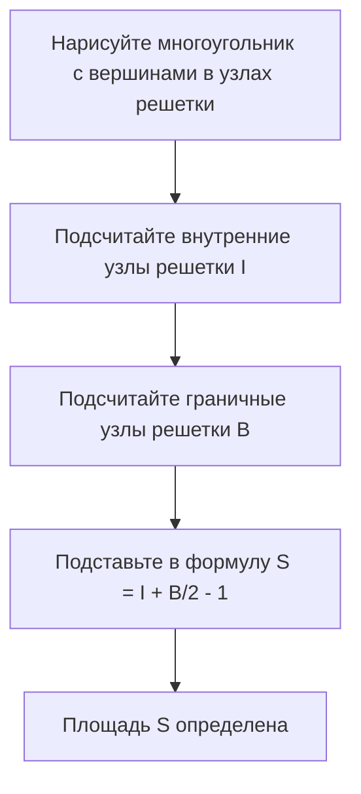
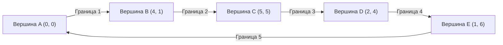

## 1. Введение

В области геометрии в математике тема нахождения площади фигуры изучалась многими математиками со времен Древней Греции. На школьных уроках мы изучаем различные подходы, начиная от базовой формулы площади треугольника "основание $\times$ высота $\div 2$", заканчивая формулами площади с использованием тригонометрических отношений в старших классах, правилом Саррюса с использованием векторного произведения на координатной плоскости и даже формулой Герона, которая выводит площадь только на основе длин трех сторон.

Однако, если все вершины многоугольника лежат в **узлах решетки** (точках, где координаты $x$ и $y$ являются целыми числами), существует волшебная формула, которая позволяет вычислить площадь, используя только чрезвычайно простые арифметические операции, без измерения длин или выполнения сложных умножений или вычислений квадратных корней. Это **теорема Пика**, которую мы подробно объясним в этот раз.

[Теорема Пика](https://kenji.blog/ru/p/picks-theorem/) — это не просто "удобная и загадочная формула для легкого нахождения площади", она имеет очень глубокую основу, которая связана с топологией, теорией графов и алгебраической геометрией в современной математике. В этой статье мы глубоко рассмотрим теорему Пика с разных сторон, начиная от того, как ее использовать на базовом уровне, и заканчивая математическим доказательством того, почему такая простая формула работает, ее историческим контекстом и даже ограничениями теоремы и возможностью ее расширения на 3D.

## 2. Георг Александр Пик и исторический контекст

Прежде чем полностью объяснить теорему Пика, давайте вкратце коснемся человека, который открыл эту красивую теорему, и ее исторического контекста.

Эта теорема была опубликована в 1899 году австрийским математиком **Георгом Александром Пиком (1859-1942)**. Он изучал математику в Венском университете, а затем много лет работал профессором в Немецком университете Праги (ныне Карлов университет в Праге).

Интересно, что Пик был тесно связан с известным Альбертом Эйнштейном. Когда Эйнштейн вступил в должность в университете в Праге в 1911 году, Пик тепло приветствовал его, и они построили близкую дружбу, не только участвуя в академических дискуссиях, но и вместе играя на скрипке. Говорят, что Пик был одним из тех, кто настоятельно рекомендовал Эйнштейну изучать "тензорный анализ" и "риманову геометрию", которые стали необходимыми для построения общей теории относительности.

Однако последние годы жизни Пика были очень трагичными. Будучи еврейского происхождения, он столкнулся с преследованиями с приходом к власти нацистской Германии. В 1942 году он был отправлен в концентрационный лагерь Терезиенштадт, где скончался всего две недели спустя в возрасте 82 лет. Хотя его жизнь закончилась печально, оставленная им "теорема Пика" по-прежнему любима в математическом образовании по всему миру благодаря своей красоте и простоте.

## 3. Что такое теорема Пика?

Теперь давайте перейдем к сути теоремы Пика. Утверждение теоремы удивительно простое и может быть понято даже учениками начальной школы.

Предположим, что на плоскости через равные промежутки по вертикали и горизонтали выстроены узлы решетки (подобно пересечениям на миллиметровой бумаге). Предположим, мы соединяем некоторые из этих узлов решетки прямыми линиями, чтобы нарисовать "многоугольник без дыр и самопересечений (простой многоугольник)". В это время площадь $S$ нарисованного многоугольника полностью определяется только **количеством узлов решетки внутри** многоугольника и **количеством узлов решетки на граничной линии**, о чем и гласит теорема.

В виде математической формулы это выглядит следующим образом:

$$
S = I + \frac{B}{2} - 1
$$

- $S$ : Площадь многоугольника
- $I$ (Interior, Внутренние) : **Количество узлов решетки внутри** многоугольника
- $B$ (Boundary, Граничные) : **Количество узлов решетки на граничной линии** многоугольника (конечно, в это число включены и сами вершины)

Самым удивительным моментом этой формулы является тот факт, что независимо от того, насколько сложна форма многоугольника (например, зазубренная форма звезды или сильно вытянутая форма), пока вершины находятся в узлах решетки и нет самопересечений или дыр, она **всегда работает без исключений**. У нее есть таинственная привлекательность, которая кажется противоречащей интуиции, поскольку вообще нет необходимости учитывать углы формы или длины сторон.

Блок-схема ниже наглядно показывает процедуру нахождения площади с использованием теоремы Пика.



## 4. Подтверждение силы теоремы на примерах

Может быть трудно получить реальное представление, просто взглянув на формулу. Давайте на практике проверим на нескольких конкретных формах, действительно ли теорема Пика может дать правильную площадь.

### Пример 1: Простой прямоугольник

В качестве самой базовой формы рассмотрим прямоугольник, вершины которого находятся в точках $(0, 0), (5, 0), (5, 3), (0, 3)$.

- **Вычисление площади обычным методом** : Так как ширина равна $5$, а высота равна $3$, площадь составляет $5 \times 3 = 15$.
- **Количество внутренних узлов решетки $I$** : Точки внутри прямоугольника — это комбинации, где координата $x$ равна $1, 2, 3, 4$, а координата $y$ равна $1, 2$. Следовательно, внутри находится $4 \times 2 = 8$ точек ( $I = 8$ ).
- **Количество граничных узлов решетки $B$** : На нижнем крае есть $6$ точек (включая оба конца) и $6$ точек на верхнем крае. На левом и правом краях, исключая четыре угловые вершины, есть по $2$ точки. В сумме получается $6 + 6 + 2 + 2 = 16$ точек ( $B = 16$ ).

Применим это к формуле теоремы Пика.

$$
S = 8 + \frac{16}{2} - 1 = 8 + 8 - 1 = 15
$$

Оно идеально совпало с обычным результатом расчета $15$.

### Пример 2: Прямоугольный треугольник

Далее давайте попробуем прямоугольный треугольник, который включает диагональный подход. Это прямоугольный треугольник с вершинами в точках $(0, 0), (6, 0), (0, 4)$.

- **Вычисление площади обычным методом** : Так как основание равно $6$, а высота равна $4$, площадь составляет $\frac{6 \times 4}{2} = 12$.
- **Количество внутренних узлов решетки $I$** : Если нарисовать схему и аккуратно их сосчитать, внутри треугольника будет всего $7$ узлов решетки, таких как $(1, 1), (1, 2), (2, 1), (2, 2), (3, 1), (4, 1)$ ( $I = 7$ ).
- **Количество граничных узлов решетки $B$** : На основании есть $7$ точек (от $(0,0)$ до $(6,0)$), и $5$ точек на крае высоты (от $(0,0)$ до $(0,4)$). Гипотенуза — это отрезок, соединяющий точки $(0, 4)$ и $(6, 0)$. Узлы решетки на этом отрезке проходят через точку решетки $(3, 2)$, потому что $y$ уменьшается на $2$ каждый раз, когда $x$ увеличивается на $3$. Если мы аккуратно их подсчитаем, избегая дублирования в четырех углах, то на граничной линии окажется в общей сложности $12$ точек ( $B = 12$ ).

Применяя к формуле, получаем

$$
S = 7 + \frac{12}{2} - 1 = 7 + 6 - 1 = 12
$$

Опять же, совпадает точно.

### Пример 3: Сложный многоугольник с впадинами

[Теорема Пика](https://kenji.blog/ru/p/picks-theorem/) показывает свою силу даже с более сложными многоугольниками, имеющими углубления.



В случае такой сложной формы традиционные методы расчета требуют очень утомительной работы, такой как разделение формы на несколько треугольников и прямоугольников или вычитание площади лишних частей из большого прямоугольника, который полностью охватывает всю форму. Ошибки в расчетах также вероятны.

Однако, если вы используете теорему Пика, вы можете мгновенно вычислить точную площадь, просто сосчитав точки внутри формы и сосчитав точки на граничной линии. Это действительно можно назвать феноменальным.

## 5. Доказательство с использованием формулы Эйлера для многогранников

Почему работает такая волшебная формула? Существует несколько способов доказать теорему Пика, но здесь мы представим элегантную идею доказательства, использующую известную теорему теории графов, **формулу Эйлера для многогранников**.

Согласно теореме Эйлера, для связного графа (сети), нарисованного на плоскости, если количество вершин равно $V$, количество ребер равно $E$, а количество граней равно $F$, справедливо следующее соотношение:

$$
V - E + F = 2
$$

(В этом $F$ бесконечно большая область, простирающаяся за пределы графа, также считается за одну грань).

### Разделение многоугольника на треугольники

Во-первых, рассмотрим целевой многоугольник $P$, площадь которого вы хотите найти. Принимая все узлы решетки внутри и на границе этого многоугольника за вершины и соединяя узлы решетки друг с другом, мы разделяем (триангулируем) внутреннюю часть многоугольника $P$ так, чтобы она была полностью заполнена маленькими "примитивными треугольниками".
Примитивный треугольник — это треугольник, который не содержит никаких узлов решетки, кроме своих вершин, ни внутри, ни на гранях своей границы. Площадь таких примитивных треугольников без исключения всегда равна $\frac{1}{2}$.

Мы рассматриваем сетчатый узор, созданный этим разделением, как один планарный граф. Для этого графа мы определяем следующие символы:
- $I$ : Количество узлов решетки внутри многоугольника
- $B$ : Количество узлов решетки на границе многоугольника
- $V$ : Общее количество вершин в графе. Очевидно, $V = I + B$.
- $E$ : Общее количество ребер в графе.
- $f$ : Количество граней примитивных треугольников, образованных внутри многоугольника.
- Поскольку мы включаем внешнюю грань ($1$ грань), общее количество граней в теореме Эйлера будет $F = f + 1$.

Применяя формулу Эйлера к этому графу, мы получаем
$$
(I + B) - E + (f + 1) = 2
$$
То есть,
$$
I + B - E + f = 1 \quad \text{--- (Уравнение 1)}
$$

### Фокусировка на сумме внутренних углов

Далее мы вычисляем сумму внутренних углов всех треугольников в графе $2$ различными способами и составляем уравнение.

**Метод 1: Вычисление из количества треугольников**
Многоугольник $P$ разделен на $f$ примитивных треугольников. Сумма внутренних углов одного треугольника равна $180^\circ$ ( $\pi$ радиан). Таким образом, общая сумма внутренних углов всех примитивных треугольников равна $f \times \pi$.

**Метод 2: Вычисление из углов вокруг вершин**
Мы пересчитываем сумму внутренних углов как сумму углов, сходящихся в каждой вершине.
- **Внутренние узлы решетки (точек $I$)** : Вокруг каждой точки собираются углы в сумме на $360^\circ$ ( $2\pi$ радиан). Таким образом, общая сумма равна $2\pi \times I$.
- **Граничные узлы решетки (точек $B$)** : Какова сумма внутренних углов многоугольника в точках на границе? Сумма внутренних углов произвольного $n$-угольника равна $(n - 2) \times \pi$. Здесь, поскольку на границе $B$ точек, это можно рассматривать как $B$-угольник, и сумма его внутренних углов равна $(B - 2) \times \pi$.

Поскольку общая сумма углов, найденная этими двумя методами, должна быть равна, выполняется следующее уравнение.

$$
f \times \pi = 2\pi \times I + (B - 2) \times \pi
$$

Разделив обе части на $\pi$, мы получим очень простое уравнение.

$$
f = 2I + B - 2 \quad \text{--- (Уравнение 2)}
$$

### Вычисление площади

Как указывалось в начале, площадь всех $f$ примитивных треугольников равна $\frac{1}{2}$. Таким образом, общая площадь $S$ многоугольника является суммой площадей примитивных треугольников и может быть выражена следующим образом:

$$
S = \frac{f}{2}
$$

Подставив в это найденное ранее (Уравнение 2), получаем

$$
S = \frac{2I + B - 2}{2} = I + \frac{B}{2} - 1
$$

[Теорема Пика](https://kenji.blog/ru/p/picks-theorem/) блестяще выведена! Теорема Эйлера, основа топологии, и сумма внутренних углов, основа геометрии, идеально сливаются для доказательства этой красивой формулы.

## 6. Применение к многоугольникам с дырами

[Теорема Пика](https://kenji.blog/ru/p/picks-theorem/) предполагает "простой многоугольник без дыр", но что произойдет, если в многоугольнике будет дыра?

Например, представьте себе форму, подобную пончику, в которой внутренний многоугольник (дыра), полностью содержащийся во внешнем многоугольнике, выдолблен. Для таких форм формула Пика не работает в своем первоначальном виде. Однако можно найти площадь, скорректировав теорему в зависимости от количества дыр.

Если внутри многоугольника имеется $h$ независимых дыр, формула обобщенной теоремы Пика будет следующей:

$$
S = I + \frac{B}{2} - 1 + h
$$

Здесь $I$ учитывает только узлы решетки внутри многоугольника (твердую часть, исключая части дыр). Кроме того, $B$ представляет собой сумму узлов решетки не только на внешней граничной линии, но и всех узлов решетки на внутренней граничной линии дыр.

То, что в конец формулы добавляется $+1$ каждый раз, когда увеличивается количество дыр, глубоко связано с эйлеровой характеристикой в геометрии и имеет очень важное значение при непрерывной деформации пространства (топологии).

## 7. Расширение на 3D и многочлены Эрхарта

Если такая красивая и мощная формула существует на плоскости (2D), для математика совершенно естественно подумать: "Разве нет формулы, которая могла бы вычислить объем твердого 3D-тела (многогранника) только по количеству узлов решетки внутри и на поверхности?".

Однако, на удивление, было доказано, что **прямого обобщения теоремы Пика на трехмерное пространство не существует**. Другими словами, невозможно создать математическую формулу, которая однозначно определяла бы объем только по количеству внутренних и поверхностных узлов решетки.

### Контрпример: Тетраэдр Рива

Доказательством этой невозможности послужил контрпример, названный "тетраэдром Рива", представленный британским математиком Джоном Ривом в 1957 году.
Рив рассмотрел тетраэдр (треугольную пирамиду) со следующими 4 вершинами:

- Вершина 1: $(0, 0, 0)$
- Вершина 2: $(1, 0, 0)$
- Вершина 3: $(0, 1, 0)$
- Вершина 4: $(1, 1, r)$ (где $r$ — произвольное целое положительное число)

При исследовании этого тетраэдра количество узлов решетки внутри всегда равно $0$. Кроме того, на поверхности абсолютно нет узлов решетки, за исключением 4 точек, являющихся вершинами. То есть, равно ли $r$ $1$, $100$ или $10000$, общее количество узлов решетки, содержащихся в этом тетраэдре, всегда постоянно и равно "$4$ точкам".

Однако объем этого тетраэдра рассчитывается как $\frac{r}{6}$.
Это означает, что даже если количество узлов решетки абсолютно одинаково, можно сделать объем бесконечно большим, изменив значение $r$. Таким образом, было доказано, что теоретически невозможно вычислить обратно "объем" только из информации о "количестве узлов решетки".

### Возвышение до многочленов Эрхарта

Хотя теорема Пика не могла быть прямо расширена на 3D, эта проблема ни в коем случае на этом не закончилась. Французский математик Эжен Эрхарт создал новую теорию, изменив свой подход.

Он изучал "как меняется количество узлов решетки, содержащихся в фигуре, при увеличении размера фигуры в целое число раз $t$". Когда $L(P, t)$ — это количество узлов решетки, содержащихся в фигуре $tP$, полученной расширением $d$-мерного многогранника $P$, чьи вершины лежат в узлах решетки, в $t$ раз, Эрхарт доказал, что это $L(P, t)$ становится многочленом степени $d$ от $t$. Это и есть **многочлен Эрхарта**.

Многочлен Эрхарта в двумерном случае — это в точности обобщенная форма самой теоремы Пика, и он активно изучается в современной алгебраической геометрии и комбинаторике как чрезвычайно важный инструмент для разгадки связи между узлами решетки и объемом в многомерных пространствах из 3-х и более измерений.

## 8. Реализация с помощью программы

Давайте реализуем простую программу на Python, которая вычисляет площадь с помощью теоремы Пика. На самом деле, учитывая координаты вершин многоугольника, необходимо подсчитать граничные узлы решетки $B$ и внутренние узлы решетки $I$.

Количество узлов решетки на отрезках линий на границе можно найти, используя **наибольший общий делитель (НОД)** абсолютного значения разности координат $x$ и абсолютного значения разности координат $y$ двух концов отрезка линии.

```python
import math

def get_boundary_points(polygon):
    """
    Получает список координат вершин многоугольника и возвращает количество граничных узлов решетки B.
    polygon: [(x1, y1), (x2, y2), ..., (xn, yn)]
    """
    B = 0
    n = len(polygon)
    for i in range(n):
        x1, y1 = polygon[i]
        x2, y2 = polygon[(i + 1) % n]  # Следующая вершина (в конце возвращается к первой)
        
        # Количество узлов решетки на отрезке равно наибольшему общему делителю dx и dy (включая один из концов)
        dx = abs(x1 - x2)
        dy = abs(y1 - y2)
        B += math.gcd(dx, dy)
        
    return B

# Чтобы найти площадь, необходимо вычислить общую площадь отдельно, используя векторное произведение и т.д.,
# или наивно сосчитать I.
# Здесь в качестве примера мы показываем функцию, которая вычисляет площадь, напрямую задавая I и B.

def picks_theorem(I, B):
    """
    Вычисляет площадь S из внутренних узлов решетки I и граничных узлов решетки B
    """
    return I + B / 2.0 - 1.0

# Пример выполнения
interior_points = 7
boundary_points = 12
area = picks_theorem(interior_points, boundary_points)
print(f"Внутренние точки: {interior_points}, Граничные точки: {boundary_points}")
print(f"Вычисленная площадь: {area}")
```

Таким образом, даже при разбиении на алгоритм, сама формула теоремы Пика выражается как чрезвычайно простая формула расчета.

## 9. Заключение

[Теорема Пика](https://kenji.blog/ru/p/picks-theorem/) — это красивая математическая теорема со следующими удивительными особенностями:

1. **Чрезвычайно простая формула** : Площадь можно найти с помощью уравнения, состоящего только из сложения и деления, $S = I + \frac{B}{2} - 1$.
2. **Нет необходимости измерять длину** : Шкала линейки или транспортир для измерения углов абсолютно не нужны, и площадь определяется лишь примитивным актом "подсчета точек".
3. **Глубокий математический контекст** : Она может быть выведена из теоремы Эйлера, а также служит входом в передовую современную математику, называемую многочленами Эрхарта.

Когда вы рисуете многоугольник на миллиметровой бумаге или в точечном блокноте, пожалуйста, вспомните эту теорему и попробуйте вычислить площадь, фактически считая точки. Тот момент, когда "узлы решетки" и "площадь", которые на первый взгляд кажутся не связанными друг с другом, красиво соединяются, ярко представит нам то удовольствие от решения головоломок и ту глубину, которой обладает изучение математики.
