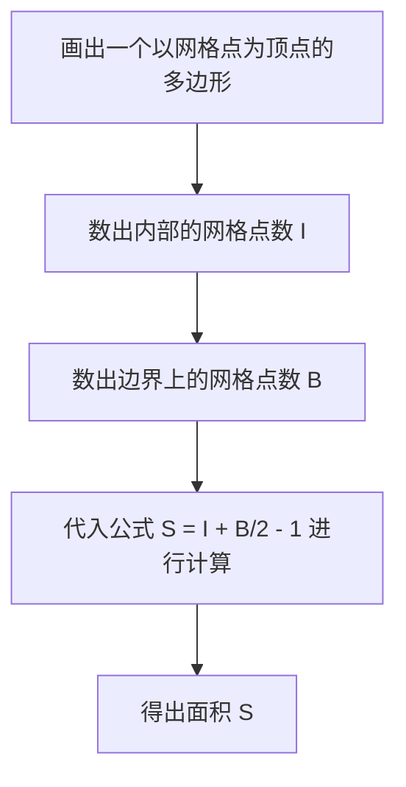
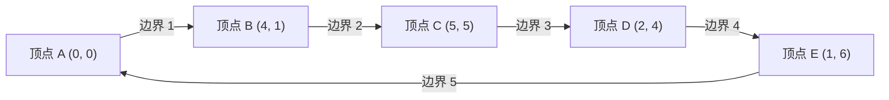

## 1. 引言

在数学的几何学领域，求图形面积这一课题自古希腊时代起就被众多数学家所研究。在学校的课堂上，我们学习了各种方法：从求三角形面积的“底 $\times$ 高 $\div 2$”这一基本公式开始，到了高中数学，会学习使用三角函数的面积公式，在坐标平面上使用向量外角的萨吕法则（Sarrus' rule），甚至还有仅通过三边长度就能推导出面积的海伦公式等。

然而，如果多边形的所有顶点都存在于 **网格点** （ $x$ 坐标和 $y$ 坐标均为整数的点）上，那么存在一个神奇的公式，你不需要测量任何长度，也不需要进行复杂的乘法或开平方计算，仅凭极其简单的四则运算就能算出面积。这就是本次将要详细讲解的 **[皮克定理](https://kenji.blog/zh-cn/p/picks-theorem/) ([Pick's Theorem](https://kenji.blog/zh-cn/p/picks-theorem/))** 。

[皮克定理](https://kenji.blog/zh-cn/p/picks-theorem/)不仅是一个“能够轻松求出面积的方便又神奇的公式”，在其背后还有着非常深厚的背景，它与现代数学中的拓扑学、图论以及代数几何都有着紧密的联系。在本文中，我们将从各个角度深入剖析[皮克定理](https://kenji.blog/zh-cn/p/picks-theorem/)，从它的基本用法，到为什么这样一个简单的公式能够成立的数学证明，以及其历史背景，甚至探讨该定理的局限性和向三维空间扩展的可能性。

## 2. 格奥尔格·亚历山大·皮克与历史背景

在正式讲解[皮克定理](https://kenji.blog/zh-cn/p/picks-theorem/)之前，让我们先来简单了解一下发现这个优美定理的人物及其时代背景。

该定理是由奥地利裔数学家 **格奥尔格·亚历山大·皮克 (Georg Alexander Pick, 1859-1942)** 于1899年发表的。他在维也纳大学学习了数学，之后在布拉格的德国大学（现布拉格查理大学）长期担任教授。

有趣的是，皮克与著名的阿尔伯特·爱因斯坦也有着很深的渊源。1911年爱因斯坦到布拉格的大学就职时，皮克对他表示了热烈的欢迎，两人不仅在学术上进行探讨，还一起拉小提琴，建立了深厚的友谊。据说皮克正是极力建议爱因斯坦学习对于建立广义相对论不可或缺的“张量分析”和“黎曼几何”的人之一。

然而，皮克的晚年却非常悲惨。作为犹太裔，他随着纳粹德国的崛起而遭到迫害。1942年，他被送往特雷津集中营，仅仅两周后便离开了人世，享年82岁。虽然他的一生以悲剧收场，但他留下来的“[皮克定理](https://kenji.blog/zh-cn/p/picks-theorem/)”，因为它的优美与简单，至今仍受到全世界数学教育界的喜爱。

## 3. 什么是[皮克定理](https://kenji.blog/zh-cn/p/picks-theorem/)？

那么，让我们进入[皮克定理](https://kenji.blog/zh-cn/p/picks-theorem/)的核心。该定理的主张惊人地简单，甚至连小学生也能理解。

假设平面上有等间距纵横排列的网格点（就像方格纸的交叉点一样）。我们用直线将其中几个网格点连接起来，画出一个没有自我相交的“无洞多边形（简单多边形）”。此时，画出的多边形的面积 $S$ ，完全仅由多边形 **内部的网格点数** 和 **边界上的网格点数** 来决定，这就是该定理的内容。

用数学公式表示如下：

$$
S = I + \frac{B}{2} - 1
$$

- $S$ ：多边形的面积
- $I$ （Interior）：多边形 **内部的网格点数**
- $B$ （Boundary）：多边形 **边界上的网格点数** （当然，顶点本身也包含在内）

这个公式最令人惊讶的地方在于，无论多边形的形状多么复杂（例如锯齿状的星形或极端细长的形状），只要顶点在网格点上，并且没有自我相交或空洞，它就 **毫无例外地永远成立** 。它在完全不需要考虑图形的角度或边长这一点上，具有一种违背直觉的不可思议的魅力。

下面的流程图直观地展示了使用[皮克定理](https://kenji.blog/zh-cn/p/picks-theorem/)求面积的步骤。



## 4. 用具体例子来确认定理的威力

仅仅看数学公式可能很难有切身的体会。让我们实际用几个具体的图形，来确认[皮克定理](https://kenji.blog/zh-cn/p/picks-theorem/)是否真的能够得出正确的面积。

### 具体例子1：简单的矩形

作为最基本的图形，我们考虑一个顶点位于 $(0, 0), (5, 0), (5, 3), (0, 3)$ 的矩形。

- **使用常规方法计算面积** ：由于长为 $5$ ，宽为 $3$ ，面积为 $5 \times 3 = 15$ 。
- **内部的网格点数 $I$** ：矩形内部的点是 $x$ 坐标为 $1, 2, 3, 4$ ， $y$ 坐标为 $1, 2$ 的组合。因此，内部存在 $4 \times 2 = 8$ 个点（ $I = 8$ ）。
- **边界上的网格点数 $B$** ：下边有 $6$ 个（包含两端），上边有 $6$ 个。左右两边，去掉四个角的顶点，各有 $2$ 个点。合计起来有 $6 + 6 + 2 + 2 = 16$ 个点（ $B = 16$ ）。

将其代入[皮克定理](https://kenji.blog/zh-cn/p/picks-theorem/)的公式试试看。

$$
S = 8 + \frac{16}{2} - 1 = 8 + 8 - 1 = 15
$$

与常规计算的结果 $15$ 完美一致。

### 具体例子2：直角三角形

接下来，我们尝试包含倾斜边的直角三角形。这是一个顶点位于 $(0, 0), (6, 0), (0, 4)$ 的直角三角形。

- **使用常规方法计算面积** ：底为 $6$ ，高为 $4$ ，因此面积为 $\frac{6 \times 4}{2} = 12$ 。
- **内部的网格点数 $I$** ：画图仔细数一下，三角形内部存在 $(1, 1), (1, 2), (2, 1), (2, 2), (3, 1), (4, 1)$ 等，共计 $7$ 个网格点（ $I = 7$ ）。
- **边界上的网格点数 $B$** ：底边上有 $7$ 个（从 $(0,0)$ 到 $(6,0)$ ），高所在的边上有 $5$ 个（从 $(0,0)$ 到 $(0,4)$ ）。斜边是连接点 $(0, 4)$ 和 $(6, 0)$ 的线段。这条线段上的网格点，因为 $x$ 每增加 $3$ ， $y$ 就减少 $2$ ，所以会经过 $(3, 2)$ 这个网格点。为了避免四个角等处的重复，准确地数出来的话，边界线上总共有 $12$ 个点（ $B = 12$ ）。

代入公式，

$$
S = 7 + \frac{12}{2} - 1 = 7 + 6 - 1 = 12
$$

结果依然完全一致。

### 具体例子3：带有凹陷的复杂多边形

即便是更加复杂、带有凹陷的多边形，[皮克定理](https://kenji.blog/zh-cn/p/picks-theorem/)也能发挥它的威力。



遇到这种复杂的图形，如果是传统的计算方法，需要将图形分割成多个三角形和矩形，或者在一个完全包住该图形的大矩形中，减去多余部分的面积等，这是一项非常繁琐的工作，也很容易发生计算错误。

但是只要使用[皮克定理](https://kenji.blog/zh-cn/p/picks-theorem/)，你只需点数图形内部的点，以及边界上的点，瞬间就能计算出准确的面积。这可以说是非常惊人的。

## 5. 使用欧拉多面体公式的证明

为什么能成立这样一个像魔法般的公式呢？[皮克定理](https://kenji.blog/zh-cn/p/picks-theorem/)的证明有几种方法，这里我们将介绍一种运用图论中著名的定理—— **欧拉多面体公式 (Euler's Polyhedral Formula)** 来进行证明的，非常优雅的方法。

根据欧拉定理，对于画在平面上的连通图（网络），假设顶点数为 $V$ ，边数为 $E$ ，面数为 $F$ ，则以下关系式成立。

$$
V - E + F = 2
$$

（这里的 $F$ 也把向图外侧无限延伸的外部区域算作一个面。）

### 将多边形分割为三角形

首先，考虑要求面积的目标多边形 $P$ 。我们将该多边形内部及边界上的所有网格点作为顶点，用线将这些网格点连接起来，对多边形 $P$ 的内部进行分割（三角剖分），使其被小“基本三角形”填满。
基本三角形是指，无论是在其内部还是在边界的边上，除了顶点以外都不包含任何其他网格点的三角形。这种基本三角形的面积毫无例外全都是 $\frac{1}{2}$ 。

我们将这种分割产生的网格图案视为一个平面图。对于这个图，定义以下符号：
- $I$ ：多边形内部的网格点数
- $B$ ：多边形边界上的网格点数
- $V$ ：图的总顶点数。很明显 $V = I + B$ 。
- $E$ ：图的总边数。
- $f$ ：多边形内部形成的基本三角形的面数。
- 由于要包含外侧的面（ $1$ 个），在欧拉定理中面的总数为 $F = f + 1$ 。

将欧拉公式应用于这个图，我们得到
$$
(I + B) - E + (f + 1) = 2
$$
也就是说，
$$
I + B - E + f = 1 \quad \text{--- (公式1)}
$$

### 关注内角和

接下来，我们用 $2$ 种不同的方法来计算图中所有三角形的内角和，并建立等式。

**方法1：从三角形的数量来计算**
多边形 $P$ 被分割成了 $f$ 个基本三角形。一个三角形的内角和是 $180^\circ$ （ $\pi$ 弧度）。因此，所有基本三角形内角和的总计是 $f \times \pi$ 。

**方法2：从顶点周围的角度来计算**
我们将内角和重新统计为汇聚在各个顶点周围的角度之和。
- **内部的网格点（ $I$ 个）** ：在每个点的周围，汇聚了整整 $360^\circ$ （ $2\pi$ 弧度）的角度。因此合计是 $2\pi \times I$ 。
- **边界上的网格点（ $B$ 个）** ：在边界上的点，多边形内侧角度的合计是多少呢？任意 $n$ 边形的内角和是 $(n - 2) \times \pi$ 。这里由于边界上有 $B$ 个点，这可以被视为一个 $B$ 边形，其内角和即为 $(B - 2) \times \pi$ 。

用这两种方法求得的角度总和必须相等，因此以下公式成立。

$$
f \times \pi = 2\pi \times I + (B - 2) \times \pi
$$

两边同除以 $\pi$ ，我们就得到了一个非常简单的公式。

$$
f = 2I + B - 2 \quad \text{--- (公式2)}
$$

### 面积的计算

正如开头所述， $f$ 个基本三角形的面积全都是 $\frac{1}{2}$ 。因此，多边形整体的面积 $S$ 就是基本三角形面积的总和，可以如下表示：

$$
S = \frac{f}{2}
$$

将前面求出的（公式2）代入其中，

$$
S = \frac{2I + B - 2}{2} = I + \frac{B}{2} - 1
$$

漂亮地推导出了[皮克定理](https://kenji.blog/zh-cn/p/picks-theorem/)！作为拓扑学基础的欧拉定理，和作为几何学基础的内角和巧妙地融合在一起，证明了这个优美的公式。

## 6. 在带洞多边形中的应用

[皮克定理](https://kenji.blog/zh-cn/p/picks-theorem/)是以“没有洞的简单多边形”为前提的，但如果多边形里开了“洞”会怎么样呢？

例如，想象一个像甜甜圈一样的图形，外部的多边形里面，完全被包含在内的一个内部多边形（洞）被挖空了。对于这样的图形，基础的皮克公式是无法直接使用的。但是，通过根据洞的数量对定理进行修正，依然可以求出面积。

如果多边形内部有 $h$ 个独立的洞，推广后的[皮克定理](https://kenji.blog/zh-cn/p/picks-theorem/)公式如下所示：

$$
S = I + \frac{B}{2} - 1 + h
$$

这里的 $I$ 仅计算多边形内部（实体部分，不包含洞的部分）的网格点。同时 $B$ 代表的不仅是外部边界线上的网格点，而是连同洞的内侧边界线上的网格点也全部合计在内的数量。

每增加 $1$ 个洞，公式末尾就会追加一个 $+1$ ，这种性质与几何学中的欧拉示性数有着很深的联系，在空间的连续变形（拓扑结构）中具有非常重要的意义。

## 7. 向三维空间的扩展与埃尔哈特多项式

既然在平面（二维）上存在如此优美且强大的公式，那么作为数学家，自然会想到：“三维空间的立体图形（多面体）的体积，难道就没有一个仅仅依靠内部和表面的网格点数就能计算的公式吗？”

然而令人惊讶的是， **在三维空间中不存在[皮克定理](https://kenji.blog/zh-cn/p/picks-theorem/)的直接类似物** ，这一点已经被证明。也就是说，仅仅依靠内部的网格点数和表面的网格点数，是无法构建出一个唯一确定体积的数学公式的。

### 反例：里夫四面体 (Reeve tetrahedron)

证明其不可能性的，是1957年英国数学家约翰·里夫提出的名为“里夫四面体”的反例。
里夫考虑了一个具有以下4个顶点的四面体（三角锥）。

- 顶点1： $(0, 0, 0)$
- 顶点2： $(1, 0, 0)$
- 顶点3： $(0, 1, 0)$
- 顶点4： $(1, 1, r)$ （这里的 $r$ 是任意正整数）

调查这个四面体会发现，它内部的网格点数永远是 $0$ 。另外，在其表面上，除了4个顶点以外，也完全不存在任何网格点。也就是说，不论 $r$ 是 $1$ 、 $100$ 还是 $10000$ ，这个四面体所包含的网格点总数永远恒定为“ $4$ 个”。

但是，如果计算这个四面体的体积，却会是 $\frac{r}{6}$ 。
这意味着，即使网格点的数量完全相同，通过改变 $r$ 的值，也可以使体积无限大。因此，证明了仅凭“网格点数量”这一信息来反向推算“体积”，在原理上是不可能的。

### 升华为埃尔哈特多项式

虽然无法将[皮克定理](https://kenji.blog/zh-cn/p/picks-theorem/)直接扩展到三维，但这个问题绝对没有就此结束。法国数学家欧仁·埃尔哈特转变了思路，建立了一套新的理论。

他研究了“将图形的尺寸放大到整数 $t$ 倍时，该图形所包含的网格点数会如何变化”。假设顶点在网格点上的 $d$ 维多面体 $P$ 放大 $t$ 倍后得到的图形 $tP$ 中包含的网格点数为 $L(P, t)$ ，埃尔哈特证明了这个 $L(P, t)$ 会成为一个关于 $t$ 的 $d$ 次多项式。这就是 **埃尔哈特多项式 (Ehrhart polynomial)** 。

二维情况下的埃尔哈特多项式，正是[皮克定理](https://kenji.blog/zh-cn/p/picks-theorem/)本身的一般化形式。它作为一种解开三维以上高维空间中网格点与体积之间关系的极其重要的工具，在现代的代数几何和组合数学中得到了活跃的研究。

## 8. 通过程序来实现

让我们用 Python 来实现一个使用[皮克定理](https://kenji.blog/zh-cn/p/picks-theorem/)计算面积的简单程序。实际上，当给出多边形的顶点坐标时，我们需要计数出边界上的网格点 $B$ 和内部的网格点 $I$ 。

边界上的线段上的网格点数，可以通过求线段两端的 $x$ 坐标差的绝对值与 $y$ 坐标差的绝对值的 **最大公约数 (GCD)** 来求得。

```python
import math

def get_boundary_points(polygon):
    """
    接收多边形的顶点坐标列表，返回边界上的网格点数 B。
    polygon: [(x1, y1), (x2, y2), ..., (xn, yn)]
    """
    B = 0
    n = len(polygon)
    for i in range(n):
        x1, y1 = polygon[i]
        x2, y2 = polygon[(i + 1) % n]  # 下一个顶点（最后回到第一个）
        
        # 线段上的网格点数，等于 dx 和 dy 的最大公约数（包含端点的其中一个）
        dx = abs(x1 - x2)
        dy = abs(y1 - y2)
        B += math.gcd(dx, dy)
        
    return B

# 要求面积，需要通过外积等方法另外求出整体的面积，
# 或者是用最笨的办法老老实实地去数 I 的数量。
# 这里作为示例，展示一个直接指定 I 和 B 来计算面积的函数。

def picks_theorem(I, B):
    """
    从内部的网格点 I 和边界上的网格点 B 计算面积 S
    """
    return I + B / 2.0 - 1.0

# 运行示例
interior_points = 7
boundary_points = 12
area = picks_theorem(interior_points, boundary_points)
print(f"内部的点: {interior_points}, 边界的点: {boundary_points}")
print(f"计算出的面积: {area}")
```

像这样，在将其转化为算法时，[皮克定理](https://kenji.blog/zh-cn/p/picks-theorem/)的公式本身也表现为极其简单的计算式。

## 9. 总结

[皮克定理](https://kenji.blog/zh-cn/p/picks-theorem/)是一个具有以下惊人特征的优美数学定理。

1. **极其简单的公式** ：只用 $S = I + \frac{B}{2} - 1$ 这个仅有加法和除法的单一切式就能求出面积。
2. **不需要测量长度** ：完全不需要刻度尺或者量角器，仅仅通过“数点”这种原始的行为就能决定面积。
3. **深厚的数学背景** ：可以由欧拉定理推导而出，它也成为了通向被称为埃尔哈特多项式的高阶现代数学的入口。

当你在方格纸或点阵笔记本上画多边形的时候，请务必回想一下这个定理，实际地数一数点来计算面积试试看。乍看之下毫无关联的“网格点”和“面积”完美结合的瞬间，将鲜明地向我们展示数学这门学问所具有的犹如解谜般的乐趣与深度。
