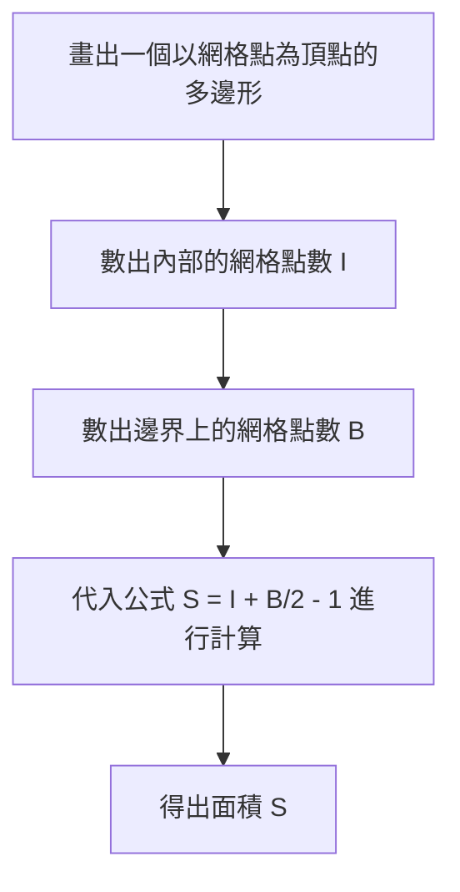
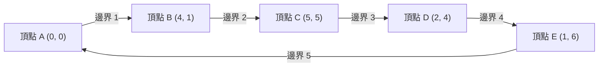

## 1. 引言

在數學的幾何學領域，求圖形面積這一課題自古希臘時代起就被眾多數學家所研究。在學校的課堂上，我們學習了各種方法：從求三角形面積的「底 $\times$ 高 $\div 2$」這一基本公式開始，到了高中數學，會學習使用三角函數的面積公式，在坐標平面上使用向量外積的薩呂法則（Sarrus' rule），甚至還有僅透過三邊長度就能推導出面積的海倫公式等。

然而，如果多邊形的所有頂點都存在於 **網格點** （ $x$ 坐標和 $y$ 坐標均為整數的點）上，那麼存在一個神奇的公式，你不需要測量任何長度，也不需要進行複雜的乘法或開平方計算，僅憑極其簡單的四則運算就能算出面積。這就是本次將要詳細講解的 **[皮克定理](https://kenji.blog/p/picks-theorem/) ([Pick's Theorem](https://kenji.blog/p/picks-theorem/))** 。

[皮克定理](https://kenji.blog/p/picks-theorem/)不僅是一個「能夠輕鬆求出面積的方便又神奇的公式」，在其背後還有著非常深厚的背景，它與現代數學中的拓撲學、圖論以及代數幾何都有著緊密的聯繫。在本文中，我們將從各個角度深入剖析[皮克定理](https://kenji.blog/p/picks-theorem/)，從它的基本用法，到為什麼這樣一個簡單的公式能夠成立的數學證明，以及其歷史背景，甚至探討該定理的侷限性和向三維空間擴展的可能性。

## 2. 格奧爾格·亞歷山大·皮克與歷史背景

在正式講解[皮克定理](https://kenji.blog/p/picks-theorem/)之前，讓我們先來簡單了解一下發現這個優美定理的人物及其時代背景。

該定理是由奧地利裔數學家 **格奧爾格·亞歷山大·皮克 (Georg Alexander Pick, 1859-1942)** 於1899年發表的。他在維也納大學學習了數學，之後在布拉格的德國大學（現布拉格查理大學）長期擔任教授。

有趣的是，皮克與著名的阿爾伯特·愛因斯坦也有著很深的淵源。1911年愛因斯坦到布拉格的大學就職時，皮克對他表示了熱烈的歡迎，兩人不僅在學術上進行探討，還一起拉小提琴，建立了深厚的友誼。據說皮克正是極力建議愛因斯坦學習對於建立廣義相對論不可或缺的「張量分析」和「黎曼幾何」的人之一。

然而，皮克的晚年卻非常悲慘。作為猶太裔，他隨著納粹德國的崛起而遭到迫害。1942年，他被送往泰雷津集中營，僅僅兩週後便離開了人世，享年82歲。雖然他的一生以悲劇收場，但他留下來的「[皮克定理](https://kenji.blog/p/picks-theorem/)」，因為它的優美與簡單，至今仍受到全世界數學教育界的喜愛。

## 3. 什麼是[皮克定理](https://kenji.blog/p/picks-theorem/)？

那麼，讓我們進入[皮克定理](https://kenji.blog/p/picks-theorem/)的核心。該定理的主張驚人地簡單，甚至連小學生也能理解。

假設平面上有等間距縱橫排列的網格點（就像方格紙的交叉點一樣）。我們用直線將其中幾個網格點連接起來，畫出一個沒有自我相交的「無洞多邊形（簡單多邊形）」。此時，畫出的多邊形的面積 $S$ ，完全僅由多邊形 **內部的網格點數** 和 **邊界上的網格點數** 來決定，這就是該定理的內容。

用數學公式表示如下：

$$
S = I + \frac{B}{2} - 1
$$

- $S$ ：多邊形的面積
- $I$ （Interior）：多邊形 **內部的網格點數**
- $B$ （Boundary）：多邊形 **邊界上的網格點數** （當然，頂點本身也包含在內）

這個公式最令人驚訝的地方在於，無論多邊形的形狀多麼複雜（例如鋸齒狀的星形或極端細長的形狀），只要頂點在網格點上，並且沒有自我相交或空洞，它就 **毫無例外地永遠成立** 。它在完全不需要考慮圖形的角度或邊長這一點上，具有一種違背直覺的不可思議的魅力。

下面的流程圖直觀地展示了使用[皮克定理](https://kenji.blog/p/picks-theorem/)求面積的步驟。



## 4. 用具體例子來確認定理的威力

僅僅看數學公式可能很難有切身的體會。讓我們實際用幾個具體的圖形，來確認[皮克定理](https://kenji.blog/p/picks-theorem/)是否真的能夠得出正確的面積。

### 具體例子1：簡單的矩形

作為最基本的圖形，我們考慮一個頂點位於 $(0, 0), (5, 0), (5, 3), (0, 3)$ 的矩形。

- **使用常規方法計算面積** ：由於長為 $5$ ，寬為 $3$ ，面積為 $5 \times 3 = 15$ 。
- **內部的網格點數 $I$** ：矩形內部的點是 $x$ 坐標為 $1, 2, 3, 4$ ， $y$ 坐標為 $1, 2$ 的組合。因此，內部存在 $4 \times 2 = 8$ 個點（ $I = 8$ ）。
- **邊界上的網格點數 $B$** ：下邊有 $6$ 個（包含兩端），上邊有 $6$ 個。左右兩邊，去掉四個角的頂點，各有 $2$ 個點。合計起來有 $6 + 6 + 2 + 2 = 16$ 個點（ $B = 16$ ）。

將其代入[皮克定理](https://kenji.blog/p/picks-theorem/)的公式試試看。

$$
S = 8 + \frac{16}{2} - 1 = 8 + 8 - 1 = 15
$$

與常規計算的結果 $15$ 完美一致。

### 具體例子2：直角三角形

接下來，我們嘗試包含傾斜邊的直角三角形。這是一個頂點位於 $(0, 0), (6, 0), (0, 4)$ 的直角三角形。

- **使用常規方法計算面積** ：底為 $6$ ，高為 $4$ ，因此面積為 $\frac{6 \times 4}{2} = 12$ 。
- **內部的網格點數 $I$** ：畫圖仔細數一下，三角形內部存在 $(1, 1), (1, 2), (2, 1), (2, 2), (3, 1), (4, 1)$ 等，共計 $7$ 個網格點（ $I = 7$ ）。
- **邊界上的網格點數 $B$** ：底邊上有 $7$ 個（從 $(0,0)$ 到 $(6,0)$ ），高所在的邊上有 $5$ 個（從 $(0,0)$ 到 $(0,4)$ ）。斜邊是連接點 $(0, 4)$ 和 $(6, 0)$ 的線段。這條線段上的網格點，因為 $x$ 每增加 $3$ ， $y$ 就減少 $2$ ，所以會經過 $(3, 2)$ 這個網格點。為了避免四個角等處的重複，準確地數出來的話，邊界線上總共有 $12$ 個點（ $B = 12$ ）。

代入公式，

$$
S = 7 + \frac{12}{2} - 1 = 7 + 6 - 1 = 12
$$

結果依然完全一致。

### 具體例子3：帶有凹陷的複雜多邊形

即便是更加複雜、帶有凹陷的多邊形，[皮克定理](https://kenji.blog/p/picks-theorem/)也能發揮它的威力。



遇到這種複雜的圖形，如果是傳統的計算方法，需要將圖形分割成多個三角形和矩形，或者在一個完全包住該圖形的大矩形中，減去多餘部分的面積等，這是一項非常繁瑣的工作，也很容易發生計算錯誤。

但是只要使用[皮克定理](https://kenji.blog/p/picks-theorem/)，你只需點數圖形內部的點，以及邊界上的點，瞬間就能計算出準確的面積。這可以說是非常驚人的。

## 5. 使用歐拉多面體公式的證明

為什麼能成立這樣一個像魔法般的公式呢？[皮克定理](https://kenji.blog/p/picks-theorem/)的證明有幾種方法，這裡我們將介紹一種運用圖論中著名的定理—— **歐拉多面體公式 (Euler's Polyhedral Formula)** 來進行證明的，非常優雅的方法。

根據歐拉定理，對於畫在平面上的連通圖（網絡），假設頂點數為 $V$ ，邊數為 $E$ ，面數為 $F$ ，則以下關係式成立。

$$
V - E + F = 2
$$

（這裡的 $F$ 也把向圖外側無限延伸的外部區域算作一個面。）

### 將多邊形分割為三角形

首先，考慮要求面積的目標多邊形 $P$ 。我們將該多邊形內部及邊界上的所有網格點作為頂點，用線將這些網格點連接起來，對多邊形 $P$ 的內部進行分割（三角剖分），使其被小「基本三角形」填滿。
基本三角形是指，無論是在其內部還是在邊界的邊上，除了頂點以外都不包含任何其他網格點的三角形。這種基本三角形的面積毫無例外全都是 $\frac{1}{2}$ 。

我們將這種分割產生的網格圖案視為一個平面圖。對於這個圖，定義以下符號：
- $I$ ：多邊形內部的網格點數
- $B$ ：多邊形邊界上的網格點數
- $V$ ：圖的總頂點數。很明顯 $V = I + B$ 。
- $E$ ：圖的總邊數。
- $f$ ：多邊形內部形成的基本三角形的面數。
- 由於要包含外側的面（ $1$ 個），在歐拉定理中面的總數為 $F = f + 1$ 。

將歐拉公式應用於這個圖，我們得到
$$
(I + B) - E + (f + 1) = 2
$$
也就是說，
$$
I + B - E + f = 1 \quad \text{--- (公式1)}
$$

### 關注內角和

接下來，我們用 $2$ 種不同的方法來計算圖中所有三角形的內角和，並建立等式。

**方法1：從三角形的數量來計算**
多邊形 $P$ 被分割成了 $f$ 個基本三角形。一個三角形的內角和是 $180^\circ$ （ $\pi$ 弧度）。因此，所有基本三角形內角和的總計是 $f \times \pi$ 。

**方法2：從頂點周圍的角度來計算**
我們將內角和重新統計為匯聚在各個頂點周圍的角度之和。
- **內部的網格點（ $I$ 個）** ：在每個點的周圍，匯聚了整整 $360^\circ$ （ $2\pi$ 弧度）的角度。因此合計是 $2\pi \times I$ 。
- **邊界上的網格點（ $B$ 個）** ：在邊界上的點，多邊形內側角度的合計是多少呢？任意 $n$ 邊形的內角和是 $(n - 2) \times \pi$ 。這裡由於邊界上有 $B$ 個點，這可以被視為一個 $B$ 邊形，其內角和即為 $(B - 2) \times \pi$ 。

用這兩種方法求得的角度總和必須相等，因此以下公式成立。

$$
f \times \pi = 2\pi \times I + (B - 2) \times \pi
$$

兩邊同除以 $\pi$ ，我們就得到了一個非常簡單的公式。

$$
f = 2I + B - 2 \quad \text{--- (公式2)}
$$

### 面積的計算

正如開頭所述， $f$ 個基本三角形的面積全都是 $\frac{1}{2}$ 。因此，多邊形整體的面積 $S$ 就是基本三角形面積的總和，可以如下表示：

$$
S = \frac{f}{2}
$$

將前面求出的（公式2）代入其中，

$$
S = \frac{2I + B - 2}{2} = I + \frac{B}{2} - 1
$$

漂亮地推導出了[皮克定理](https://kenji.blog/p/picks-theorem/)！作為拓撲學基礎的歐拉定理，和作為幾何學基礎的內角和巧妙地融合在一起，證明了這個優美的公式。

## 6. 在帶洞多邊形中的應用

[皮克定理](https://kenji.blog/p/picks-theorem/)是以「沒有洞的簡單多邊形」為前提的，但如果多邊形裡開了「洞」會怎麼樣呢？

例如，想像一個像甜甜圈一樣的圖形，外部的多邊形裡面，完全被包含在內的一個內部多邊形（洞）被挖空了。對於這樣的圖形，基礎的皮克公式是無法直接使用的。但是，透過根據洞的數量對定理進行修正，依然可以求出面積。

如果多邊形內部有 $h$ 個獨立的洞，推廣後的[皮克定理](https://kenji.blog/p/picks-theorem/)公式如下所示：

$$
S = I + \frac{B}{2} - 1 + h
$$

這裡的 $I$ 僅計算多邊形內部（實體部分，不包含洞的部分）的網格點。同時 $B$ 代表的不僅是外部邊界線上的網格點，而是連同洞的內側邊界線上的網格點也全部合計在內的數量。

每增加 $1$ 個洞，公式末尾就會追加一個 $+1$ ，這種性質與幾何學中的歐拉示性數有著很深的聯繫，在空間的連續變形（拓撲結構）中具有非常重要的意義。

## 7. 向三維空間的擴展與埃爾哈特多項式

既然在平面（二維）上存在如此優美且強大的公式，那麼作為數學家，自然會想到：「三維空間的立體圖形（多面體）的體積，難道就沒有一個僅僅依靠內部和表面的網格點數就能計算的公式嗎？」

然而令人驚訝的是， **在三維空間中不存在[皮克定理](https://kenji.blog/p/picks-theorem/)的直接類似物** ，這一點已經被證明。也就是說，僅僅依靠內部的網格點數和表面的網格點數，是無法構建出一個唯一確定體積的數學公式的。

### 反例：里夫四面體 (Reeve tetrahedron)

證明其不可能性的，是1957年英國數學家約翰·里夫提出的名為「里夫四面體」的反例。
里夫考慮了一個具有以下4個頂點的四面體（三角錐）。

- 頂點1： $(0, 0, 0)$
- 頂點2： $(1, 0, 0)$
- 頂點3： $(0, 1, 0)$
- 頂點4： $(1, 1, r)$ （這裡的 $r$ 是任意正整數）

調查這個四面體會發現，它內部的網格點數永遠是 $0$ 。另外，在其表面上，除了4個頂點以外，也完全不存在任何網格點。也就是說，不論 $r$ 是 $1$ 、 $100$ 還是 $10000$ ，這個四面體所包含的網格點總數永遠恆定為「 $4$ 個」。

但是，如果計算這個四面體的體積，卻會是 $\frac{r}{6}$ 。
這意味著，即使網格點的數量完全相同，透過改變 $r$ 的值，也可以使體積無限大。因此，證明了僅憑「網格點數量」這一資訊來反向推算「體積」，在原理上是不可能的。

### 昇華為埃爾哈特多項式

雖然無法將[皮克定理](https://kenji.blog/p/picks-theorem/)直接擴展到三維，但這個問題絕對沒有就此結束。法國數學家歐仁·埃爾哈特轉變了思路，建立了一套新的理論。

他研究了「將圖形的尺寸放大到整數 $t$ 倍時，該圖形所包含的網格點數會如何變化」。假設頂點在網格點上的 $d$ 維多面體 $P$ 放大 $t$ 倍後得到的圖形 $tP$ 中包含的網格點數為 $L(P, t)$ ，埃爾哈特證明了這個 $L(P, t)$ 會成為一個關於 $t$ 的 $d$ 次多項式。這就是 **埃爾哈特多項式 (Ehrhart polynomial)** 。

二維情況下的埃爾哈特多項式，正是[皮克定理](https://kenji.blog/p/picks-theorem/)本身的一般化形式。它作為一種解開三維以上高維空間中網格點與體積之間關係的極其重要的工具，在現代的代數幾何和組合數學中得到了活躍的研究。

## 8. 透過程式來實現

讓我們用 Python 來實現一個使用[皮克定理](https://kenji.blog/p/picks-theorem/)計算面積的簡單程式。實際上，當給出多邊形的頂點坐標時，我們需要計數出邊界上的網格點 $B$ 和內部的網格點 $I$ 。

邊界上的線段上的網格點數，可以透過求線段兩端的 $x$ 坐標差的絕對值與 $y$ 坐標差的絕對值的 **最大公約數 (GCD)** 來求得。

```python
import math

def get_boundary_points(polygon):
    """
    接收多邊形的頂點坐標列表，返回邊界上的網格點數 B。
    polygon: [(x1, y1), (x2, y2), ..., (xn, yn)]
    """
    B = 0
    n = len(polygon)
    for i in range(n):
        x1, y1 = polygon[i]
        x2, y2 = polygon[(i + 1) % n]  # 下一個頂點（最後回到第一個）
        
        # 線段上的網格點數，等於 dx 和 dy 的最大公約數（包含端點的其中一個）
        dx = abs(x1 - x2)
        dy = abs(y1 - y2)
        B += math.gcd(dx, dy)
        
    return B

# 要求面積，需要透過外積等方法另外求出整體的面積，
# 或者是用最笨的辦法老老實實地去數 I 的數量。
# 這裡作為示例，展示一個直接指定 I 和 B 來計算面積的函數。

def picks_theorem(I, B):
    """
    從內部的網格點 I 和邊界上的網格點 B 計算面積 S
    """
    return I + B / 2.0 - 1.0

# 運行示例
interior_points = 7
boundary_points = 12
area = picks_theorem(interior_points, boundary_points)
print(f"內部的點: {interior_points}, 邊界的點: {boundary_points}")
print(f"計算出的面積: {area}")
```

像這樣，在將其轉化為演算法時，[皮克定理](https://kenji.blog/p/picks-theorem/)的公式本身也表現為極其簡單的計算式。

## 9. 總結

[皮克定理](https://kenji.blog/p/picks-theorem/)是一個具有以下驚人特徵的優美數學定理。

1. **極其簡單的公式** ：只用 $S = I + \frac{B}{2} - 1$ 這個僅有加法和除法的單一等式就能求出面積。
2. **不需要測量長度** ：完全不需要刻度尺或者量角器，僅僅透過「數點」這種原始的行為就能決定面積。
3. **深厚的數學背景** ：可以由歐拉定理推導而出，它也成為了通向被稱為埃尔哈特多項式的高階現代數學的入口。

當你在方格紙或點陣筆記本上畫多邊形的時候，請務必回想一下這個定理，實際地數一數點來計算面積試試看。乍看之下毫無關聯的「網格點」和「面積」完美結合的瞬間，將鮮明地向我們展示數學這門學問所具有的猶如解謎般的樂趣與深度。
