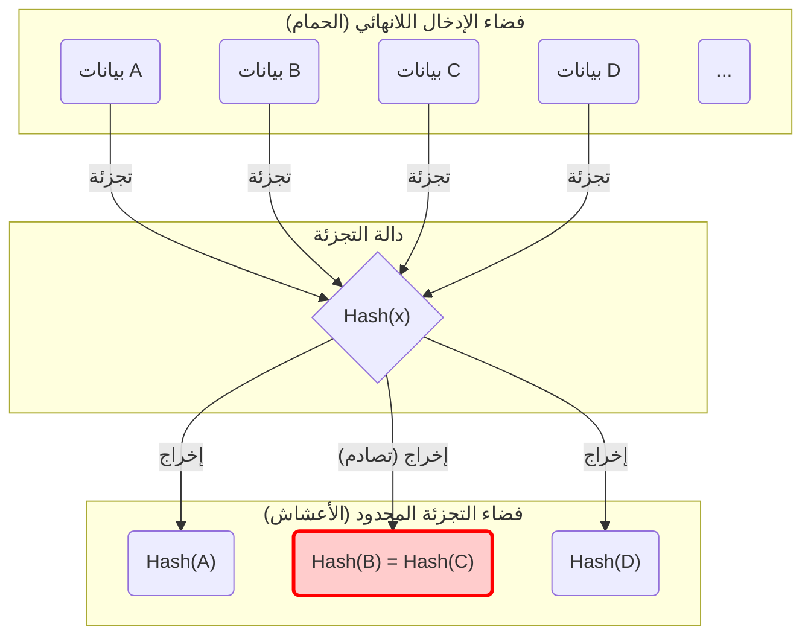
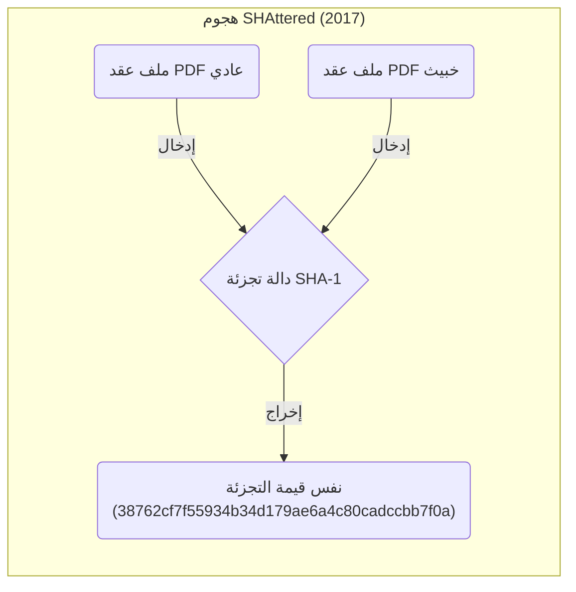
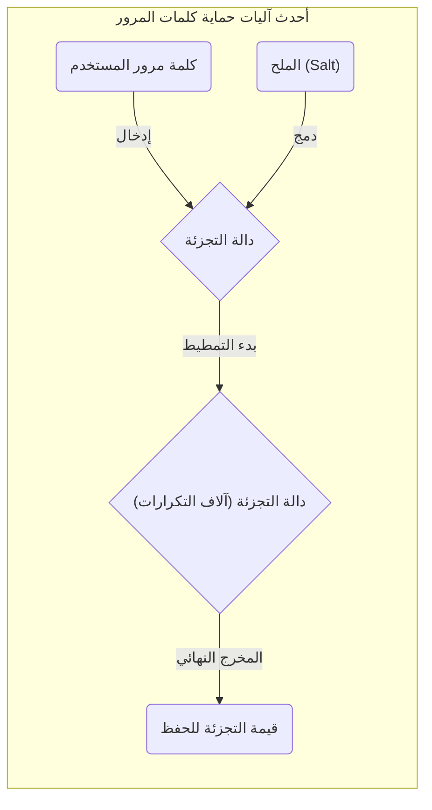

لا يمكن تجنب مفاهيم مثل **"مبدأ جحر الحمام" (Pigeonhole Principle)** و **"تصادم التجزئة" (Hash Collision)** عند دراسة علوم الكمبيوتر، أو أمن المعلومات، أو تقنيات التشفير.
مبدأ جحر الحمام بحد ذاته بسيط للغاية، ويعبر عن شيء بديهي لدرجة أن طالب المدرسة الابتدائية يمكنه فهمه بسهولة. ومع ذلك، فإن تأثير هذا المبدأ الرياضي البسيط على تصميم أمان دوال التجزئة وأنظمة التشفير التي تدعم مجتمع الإنترنت الحديث، لا يُحصى.

في هذه المقالة، سنبدأ من المفاهيم الأساسية لمبدأ جحر الحمام، ونستعرض آلية تصادم التجزئة، وتأثير مفارقة يوم الميلاد على التعقيد الحسابي، وأمثلة حقيقية للتصادمات في خوارزميات التشفير السابقة (مثل SHA-1)، وصولاً إلى تقييم الأمان لتقنيات التشفير المستقبلية، وذلك بشكل مفصل مدعوماً بالصيغ والرسوم التوضيحية.

## 1. أساسيات مبدأ جحر الحمام (Pigeonhole Principle)

**"مبدأ جحر الحمام"** (والذي يُعرف أيضاً بمبدأ أدراج ديريكليه) هو مفهوم أوضحه عالم الرياضيات في القرن التاسع عشر بيتر غوستاف ديريكليه، ويُعرّف على النحو التالي:

> إذا تم وضع $n$ من الحمام في $m$ من الجحور (الأعشاش)، وكان $n > m$، فإنه سيوجد عش واحد على الأقل يحتوي على حمامتين أو أكثر.

على سبيل المثال، لنفترض أن 10 حمامات ستدخل 9 أعشاش. مهما حاولت توزيع الحمامات بالتساوي، فلا بد أن يكون هناك عش واحد على الأقل يضم حمامتين. هذا يبدو بديهياً للغاية ولا يحتاج حتى إلى إثبات، ولكنه عندما يُصاغ رياضياً يصبح أداة قوية جداً لإثبات الوجود.

### أمثلة عملية من الحياة اليومية

بالإضافة إلى الحمام والأعشاش، يمكن تطبيق هذا المبدأ على العديد من المواقف في حياتنا اليومية.

*  **عدد شعر الرأس**: يُقال إن أقصى عدد لشعرات رأس الإنسان هو حوالي 200,000 شعرة. يبلغ عدد سكان طوكيو حوالي 14 مليون نسمة. لذلك، يوجد بالتأكيد في طوكيو **"شخصان يمتلكان نفس عدد الشعرات بالضبط"** (الحمام = سكان طوكيو، الأعشاش = عدد الشعرات الممكنة).
*  **شهر الميلاد**: إذا اجتمع 13 شخصاً، فهناك شخصان على الأقل يولدان في نفس الشهر (الحمام = 13 شخصاً، الأعشاش = 12 شهراً).

### التعبير الدقيق بالصيغ الرياضية (KaTeX)

لنعبر عن هذا المبدأ رياضياً باستخدام لغة نظرية المجموعات والدوال (Mappings).
لنفترض أن عدد عناصر المجموعة المنتهية $A$ هو $|A|$، وعدد عناصر المجموعة المنتهية $B$ هو $|B|$، وتوجد دالة $f: A \rightarrow B$.
في هذه الحالة، إذا كان $|A| > |B|$، فإن الدالة $f$ لا يمكن أن تكون دالة "متباينة" (Injective). الدالة المتباينة تعني أن كل مُدخل مختلف يرتبط بالضرورة بمُخرج مختلف.
بعبارة أخرى، فإنه بالضرورة توجد عناصر متمايزة $x, y \in A$ بحيث:

$$
\exists x, y \in A \quad (x \neq y \land f(x) = f(y))
$$

هذه الخاصية هي بالتحديد الصيغة الرياضية التي تشرح السبب الأساسي لـ **"تصادم التجزئة"** في علوم المعلومات والذي سيتم تناوله لاحقاً.

## 2. دوال التجزئة وآلية تصادم التجزئة

### ما هي دوال التجزئة التشفيرية؟

**دالة التجزئة ([Hash Function](https://kenji.blog/ar/p/modern-cryptography-public-key-hash-signature/))** هي دالة تأخذ بيانات إدخال ذات طول عشوائي (مثل الرسائل، أو الملفات، أو كلمات المرور) وتُحولها إلى بيانات إخراج ذات طول ثابت (قيمة التجزئة أو الملخص - Digest). من أشهر دوال التجزئة التشفيرية المستخدمة حالياً SHA-256 و SHA-3.

في تقنيات التشفير، يُطلب من دوال التجزئة أن تلبي بشكل صارم المتطلبات الأمنية الثلاثة التالية:

1.  **مقاومة الصورة الأولية (Pre-image resistance)**: يجب أن يكون من الصعب جداً استنتاج (استرجاع) بيانات الإدخال الأصلية من قيمة التجزئة الناتجة.
2.  **مقاومة الصورة الأولية الثانية (Second pre-image resistance)**: عند إعطاء بيانات إدخال معينة، يجب أن يكون من الصعب جداً العثور على "بيانات إدخال أخرى" تنتج نفس قيمة التجزئة.
3.  **مقاومة التصادم (Collision resistance)**: يجب أن يكون من الصعب جداً العثور بحرية على زوج من بيانات الإدخال المختلفة التي تنتج نفس قيمة التجزئة.

### حتمية التصادم من منظور مبدأ جحر الحمام

دعونا نطبق مبدأ جحر الحمام المذكور سابقاً على دوال التجزئة.

*  **الحمام**: مجموعة بيانات الإدخال. نظراً لأن محتويات الملفات أو مجموعات السلاسل النصية لا حصر لها، فإن عدد العناصر $|A|$ يُعتبر "لانهائياً".
*  **الأعشاش**: مجموعة قيم التجزئة الممكنة. نظراً لأن قيمة التجزئة ذات طول ثابت، فإن عدد العناصر $|B|$ يُعتبر "محدوداً".

على سبيل المثال، في حالة SHA-256 (المُستخدم في تقنيات البلوكشين مثل البيتكوين)، يكون طول الإخراج 256 بتاً. لذلك، فإن عدد قيم التجزئة الممكنة هو $2^{256}$ (تقريباً $1.15 \times 10^{77}$). وهو رقم هائل يضاهي عدد الذرات في الكون المرئي، ولكنه يظل **رقمًا محدودًا**.

من ناحية أخرى، التنوع الممكن لبيانات الإدخال من نصوص وصور هو **لانهائي**.
وبالتالي، فإن المتباينة "إجمالي بيانات الإدخال" > "إجمالي قيم التجزئة" تتحقق، وبموجب مبدأ جحر الحمام، فإنه **يجب بالضرورة أن توجد بياناتا إدخال مختلفتان تنتجان نفس قيمة التجزئة**. هذا ما يُعرف بظاهرة **"تصادم التجزئة" (Hash Collision)**.

يمثل مخطط Mermaid التالي كيف يتم رسم بيانات لا حصر لها على مساحة تجزئة محدودة.

في المخطط أعلاه، تم تعيين "البيانات B" و "البيانات C" إلى نفس قيمة التجزئة بالضبط، ويمثل الجزء المؤطر باللون الأحمر بالضبط موقع التصادم (Collision).

## 3. هجوم يوم الميلاد (Birthday Attack) وتهديد احتمالية التصادم

بما أن تصادم التجزئة حتمي نظرياً بسبب مبدأ جحر الحمام، ينشأ التساؤل العملي التالي: "إذن، ما مدى صعوبة العثور على هذا التصادم في الواقع؟" وهنا يأتي دور **"مفارقة يوم الميلاد" (Birthday Paradox)**، و **"هجوم يوم الميلاد" (Birthday Attack)** الذي يستغل خصائصها الرياضية بشكل سيء.

### ما هي مفارقة يوم الميلاد؟

هناك مسألة معروفة في نظرية الاحتمالات تسأل: "كم عدد الأشخاص الذين يجب أن يتجمعوا لتصبح احتمالية أن يكون لشخصين منهم نفس يوم الميلاد أكثر من 50%؟"
السنة بها 365 يوماً، لذا وفقاً لمبدأ جحر الحمام، يمكنك القول بالتأكيد (بنسبة 100%) أن هناك أشخاصاً يتشاركون يوم الميلاد عندما يجتمع 366 شخصاً. ولكن، والمثير للدهشة، أن الاحتمالية تتجاوز الـ 50% عندما يجتمع **23 شخصاً** فقط. وحقيقة أن التصادمات يمكن أن تحدث بعدد أشخاص أقل بكثير من المتوقع بديهياً هو ما يجعل منها مفارقة.

### التطبيق على تصادم التجزئة والإثبات الرياضي

لنفترض أن حجم مساحة قيمة التجزئة هو $N$ (مثلاً في حالة SHA-256 فإن $N = 2^{256}$). دعنا نحسب الاحتمالية $P$ لحدوث تصادم واحد على الأقل عند إنشاء بيانات إدخال $k$ عشوائية وحساب قيم التجزئة الخاصة بها.

الاحتمالية بأن تكون جميع المدخلات لها قيم تجزئة مختلفة (أي لا يوجد أي تصادم) تُحسب كالتالي:

$$
1 \times \left(1 - \frac{1}{N}\right) \times \left(1 - \frac{2}{N}\right) \times \cdots \times \left(1 - \frac{k-1}{N}\right)
$$

باستخدام التقريب $1 - x \approx e^{-x}$ المبني على متسلسلة تايلور، يمكننا تقريب احتمالية حدوث التصادم $P$ إلى:

$$
P \approx 1 - e^{-\frac{k(k-1)}{2N}} \approx 1 - e^{-\frac{k^2}{2N}}
$$

لإيجاد عدد المحاولات $k$ التي تجعل احتمالية التصادم تصل لـ 50% (أي $P = 0.5$)، نحل المعادلة التالية:

$$
0.5 = e^{-\frac{k^2}{2N}} \implies \ln(0.5) = -\frac{k^2}{2N} \implies k \approx \sqrt{2 \ln 2 \cdot N} \approx 1.177 \sqrt{N}
$$

هذه النتيجة في غاية الأهمية. فهي تعني أنه إذا كانت مساحة إخراج التجزئة هي $N$، فبإجراء حوالي $\sqrt{N}$ (أي $N^{0.5}$) من العمليات الحسابية، فإن احتمالية العثور على تصادم تجزئة تتجاوز 50%.

في حالة SHA-256، يبلغ مساحة الإخراج $2^{256}$، ولكن باستخدام هجوم يوم الميلاد، يمكن العثور على تصادم من خلال $\sqrt{2^{256}} = 2^{128}$ عملية حسابية. وبما أن $2^{128}$ عدد عمليات فلكي يتطلب وقتاً أطول من عمر الكون حتى باستخدام أقوى الحواسيب الفائقة الحديثة، يُعتبر SHA-256 حالياً آمناً (يفي بمقاومة التصادم).

## 4. تاريخ تصادم التجزئة في العالم الحقيقي: SHAttered

بعيداً عن الجانب النظري، هناك حالات تاريخية أُثبت فيها حدوث تصادمات تجزئة في الواقع.

هناك دالة تجزئة تُعرف بـ **SHA-1** (طول الإخراج 160 بت)، والتي كانت تُستخدم على نطاق واسع قديماً في شهادات SSL لمواقع الويب والتحقق من سلامة الملفات. لكون مخرجاتها 160 بت، كان يُعتقد نظرياً أن عملية البحث عن التصادم تتطلب $2^{80}$ عملية.

ولكن في عام 2017، أعلن فريق بحث من شركتي جوجل ومعهد CWI في أمستردام عن تقنية هجوم سُميت بـ **"SHAttered"**. استطاعوا بفضل التطور في تقنيات تحليل التشفير إيجاد تصادم في SHA-1 باستخدام $2^{63.1}$ عملية حسابية فقط.

وقد نشروا أول مثال في العالم لـ **ملفي PDF يتطابقان تماماً في قيمة تجزئة SHA-1** رغم اختلاف محتواهما كلياً (أحدهما ملف عادي والآخر ضار). هذه الحادثة أنهت عمر SHA-1 كـ "دالة تجزئة آمنة"، وحتّمت على الصناعة ككل الانتقال إلى عائلة SHA-2 (مثل SHA-256).

هكذا، يتضح لنا أن خوارزميات التشفير مقدر لها أن تضعف تدريجياً نتيجة الاختراقات الرياضية وتطور قدرات أجهزة الكمبيوتر.

## 5. مبدأ جحر الحمام في هياكل البيانات: جداول التجزئة

يعد [مبدأ جحر الحمام وتصادم التجزئة](https://kenji.blog/ar/p/pigeonhole-principle-hash-collision/) موضوعات مهمة ليس فقط في التشفير، ولكن في مجالات أخرى أيضًا. والمثال النموذجي على ذلك هو **جداول التجزئة ([Hash Table](https://kenji.blog/ar/p/search-algorithms-linear-binary-hash-table-principles/)s أو القواميس - Dictionaries)** التي تُستخدم بكثرة في البرمجة.

في جدول التجزئة، يتم حساب قيمة التجزئة من مفتاح وتستخدم كفهرس (Index) في مصفوفة (Array) لتخزين القيمة. وبفعل مبدأ جحر الحمام، إذا تمت محاولة تخزين بيانات (حمام) أكثر من حجم المصفوفة (الأعشاش)، أو كان هناك انحياز في دالة التجزئة، فإن حدوث "تصادم" (استهداف مفاتيح مختلفة لنفس الفهرس) هو أمر حتمي.

لحل هذا التصادم، تم بناء الخوارزميات التالية:

*  **طريقة التسلسل (Chaining)**: يتم ربط العناصر المتصادمة عبر قائمة مرتبطة (Linked list) وتخزينها في نفس الحاوية (Bucket).
*  **طريقة العنونة المفتوحة (Open Addressing)**: عند حدوث تصادم، يتم البحث عن "حاوية أخرى فارغة" وفقاً لقواعد معينة وتخزين العنصر بها.

خلف الكواليس في لغات البرمجة (مثل `dict` في Python أو `HashMap` في [Java](https://kenji.blog/ar/p/programming-languages-history-paradigm-evolution/))، يتم استخدام أساليب ذكية ومتقدمة لمعالجة التصادمات الناتجة عن مبدأ جحر الحمام بأسرع وأكفأ طريقة ممكنة.

## 6. تأمين الحماية ومستقبل تقنيات التشفير

نظراً لأنه من المستحيل صنع "دالة تجزئة لا تتصادم أبداً" بناءً على مبدأ جحر الحمام، يعتمد عالم أمن المعلومات على أسلوب **"تصميم النظام بحيث لا يمكن العثور على التصادم ضمن وقت وموارد حسابية واقعية"**.

### تأمين هامش الأمان

خط الدفاع الأقوى هو التأكد من أن طول بت قيمة التجزئة طويل بما يكفي.
بزيادة طول البت، يزداد عدد العمليات الحسابية اللازمة لشن هجوم بصورة أسية.

| الخوارزمية | طول المخرجات $n$ | تعقيد البحث عن التصادم $2^{n/2}$ | الوضع الحالي |
|---|---|---|---|
| MD5 | 128 بت | $2^{64}$ | مكسورة بالكامل (غير موصى بها) |
| SHA-1 | 160 بت | $2^{80}$ | مكسورة (غير موصى بها) |
| SHA-256 | 256 بت | $2^{128}$ | آمنة عملياً |
| SHA-512 | 512 بت | $2^{256}$ | آمنة جداً |
| SHA-3 (Keccak) | 256/512 بت | $2^{128} / 2^{256}$ | آمنة جداً (هيكل مختلف) |

عند اختيار تقنيات التشفير، من الضروري توقع تحسن أداء حواسيب المهاجمين (مثل قانون مور) والظهور المستقبلي للحواسيب الكمومية، واختيار خوارزمية تتمتع بـ **هامش أمان (Security Margin)** كافٍ.

### حماية كلمات المرور باستخدام الملح (Salt) وتمطيط التجزئة (Stretching)

على الرغم من أنها ظاهرة مختلفة قليلاً عن تصادم التجزئة، إلا أن هناك تدابير هامة تُتخذ لمنع تسرب كلمات المرور. مجرد تجزئة كلمة المرور لا يوفر حماية تُذكر ضد الهجمات التي تستخدم قواعد بيانات ضخمة لقيم تجزئة محسوبة مسبقاً (جداول قوس قزح - Rainbow Tables).

لمنع ذلك، يتم ربط سلسلة أحرف عشوائية تُسمى بـ **الملح (Salt)** بكل كلمة مرور قبل التجزئة، أو يتم استخدام عملية تُسمى بـ **التمطيط (Stretching)**، حيث يتم تكرار حساب التجزئة عمداً آلاف إلى عشرات الآلاف من المرات (تستخدم في ذلك دوال استنباط المفاتيح مثل PBKDF2 و bcrypt و Argon2).

من خلال القيام بذلك، نرفع متعمداً من التكلفة الحسابية التي سيتعين على المهاجم تكبدها، جاعلين هجوم القوة الغاشمة (Brute-force attack) غير عملي بتاتاً.

## 7. الخلاصة

في هذه المقالة، شرحنا كيف تتسبب النظرية الرياضية البسيطة والبديهية **"مبدأ جحر الحمام"**، بشكل حتمي في ظاهرة **"تصادم التجزئة"**، وكيف يؤثر ذلك على تصميم الأمان في تقنيات التشفير.

*  **حتمية مبدأ جحر الحمام**: أي دالة تجزئة بمدخلات غير محدودة ومخرجات محدودة، حتمًا ولأسباب رياضية، ستحتوي على تصادمات.
*  **تهديد هجوم يوم الميلاد**: وفقاً لمفارقة يوم الميلاد، فإنه بالنسبة لمساحة قيم تجزئة حجمها $N$، يمكن العثور على تصادم بإجراء $\sqrt{N}$ عملية حسابية تقريباً.
*  **فلسفة تصميم التشفير الحديث**: نظراً لاستحالة جعل عدد التصادمات صفراً، يتم زيادة طول المخرجات لدرجة كافية لجعل العثور على تصادم مستحيلاً من حيث التكلفة الحسابية.

إن الفهم العميق لهذه المبادئ يرتبط بشكل مباشر بفهم الأسس التي تُبنى عليها أنظمة الأمان الحديثة كالبلوكشين، والتوقيعات الرقمية، وإدارة كلمات المرور.
ورغم أن تقنيات التشفير قد تبدو معقدة ومستعصية، إلا أن وجود مبادئ ونظريات احتمالية قريبة منا مثل "الحمام والأعشاش" و"أعياد الميلاد" في صميمها، هو أمر يبرز العمق المثير لعلوم المعلومات.
